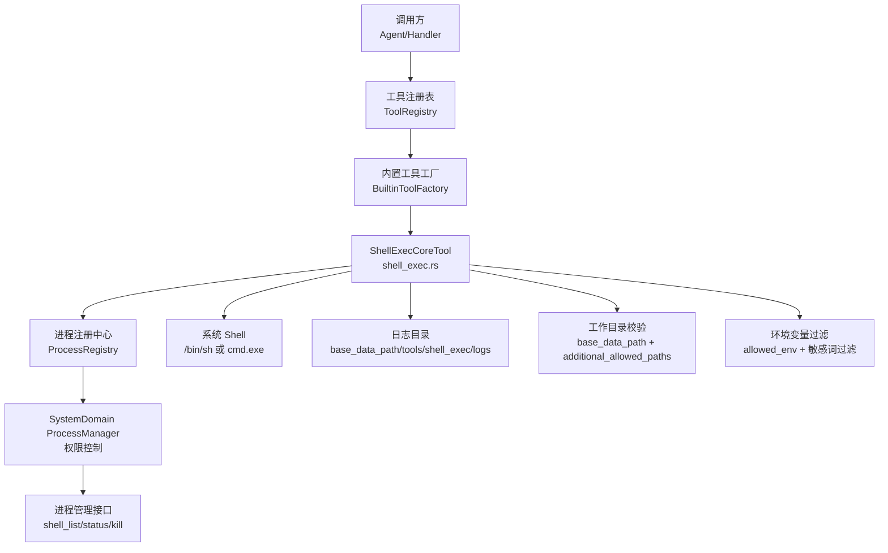
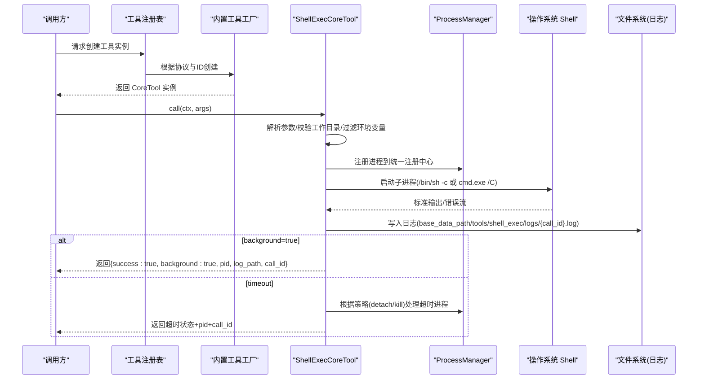
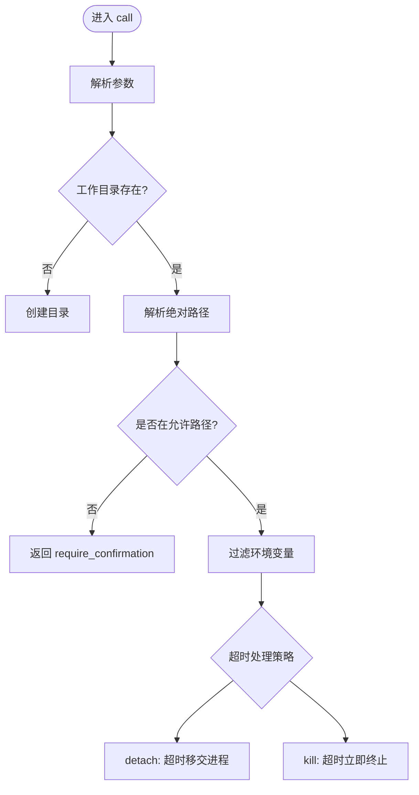
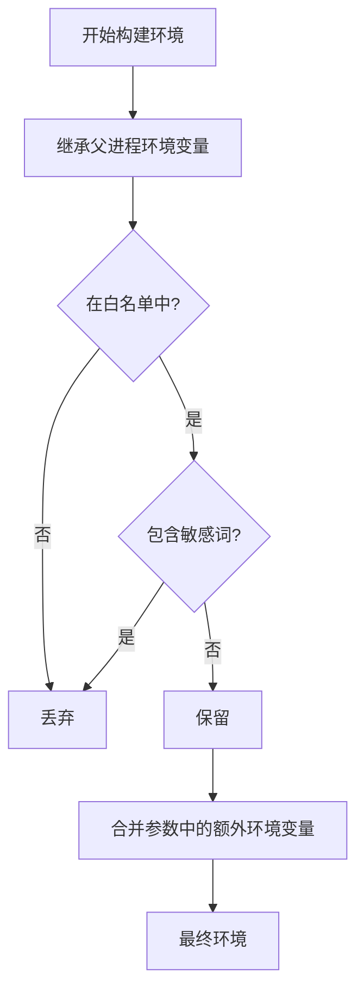
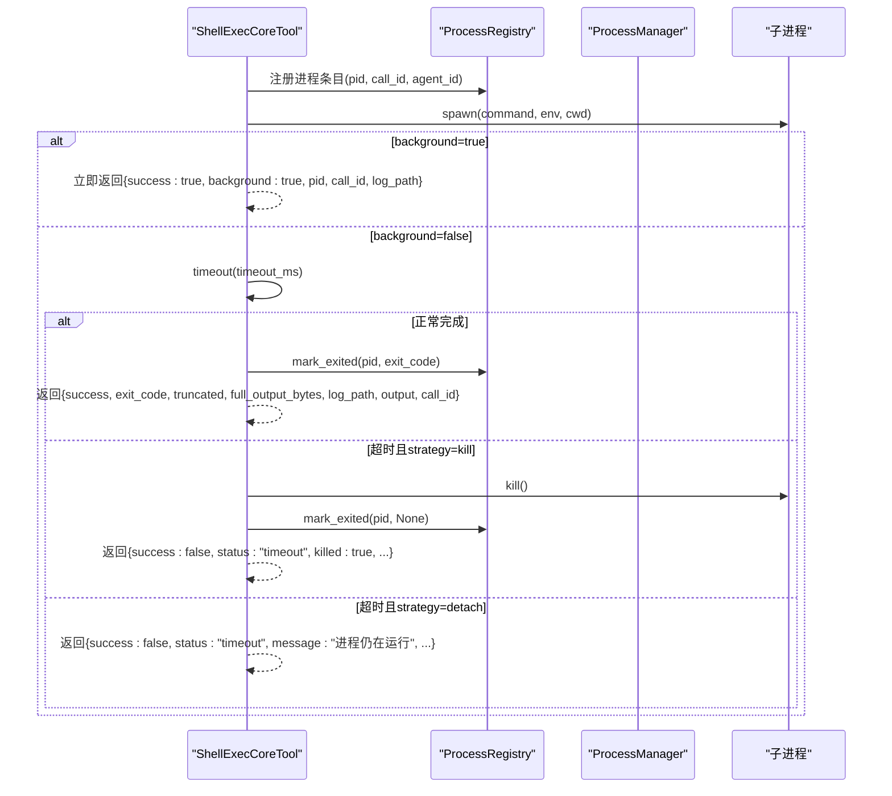
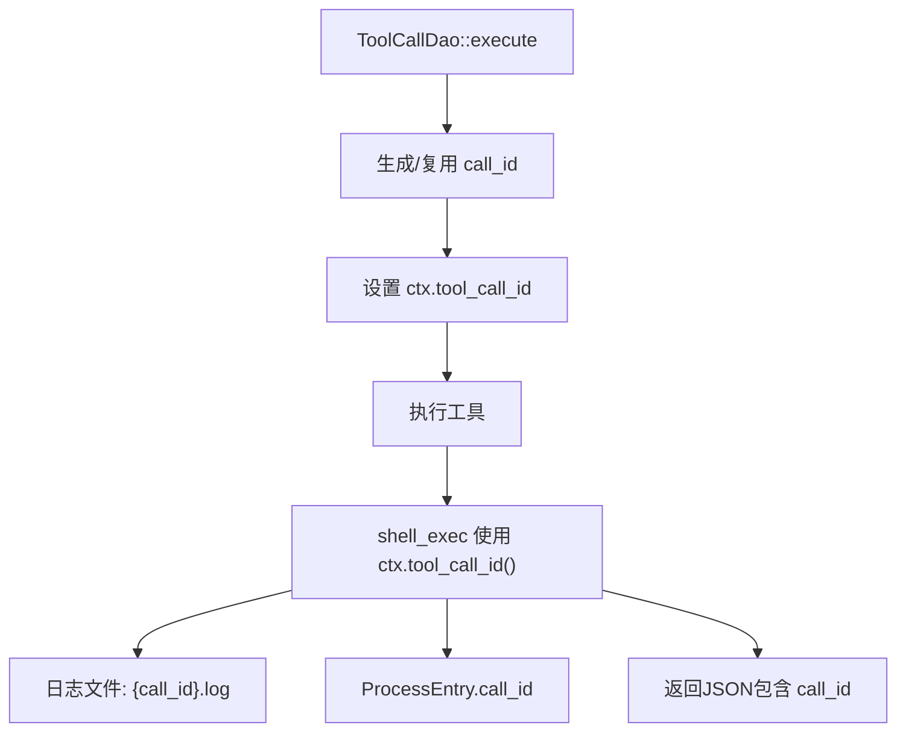
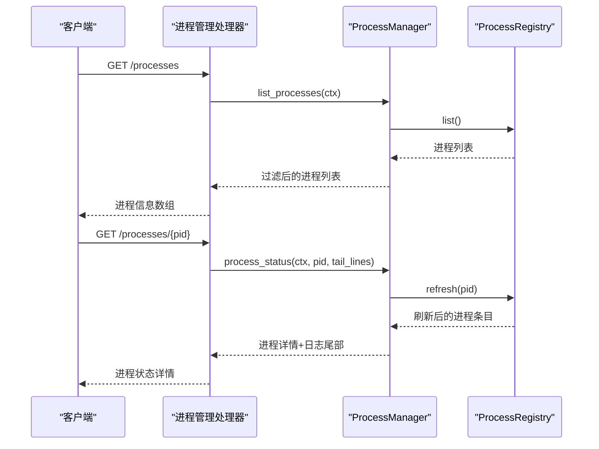
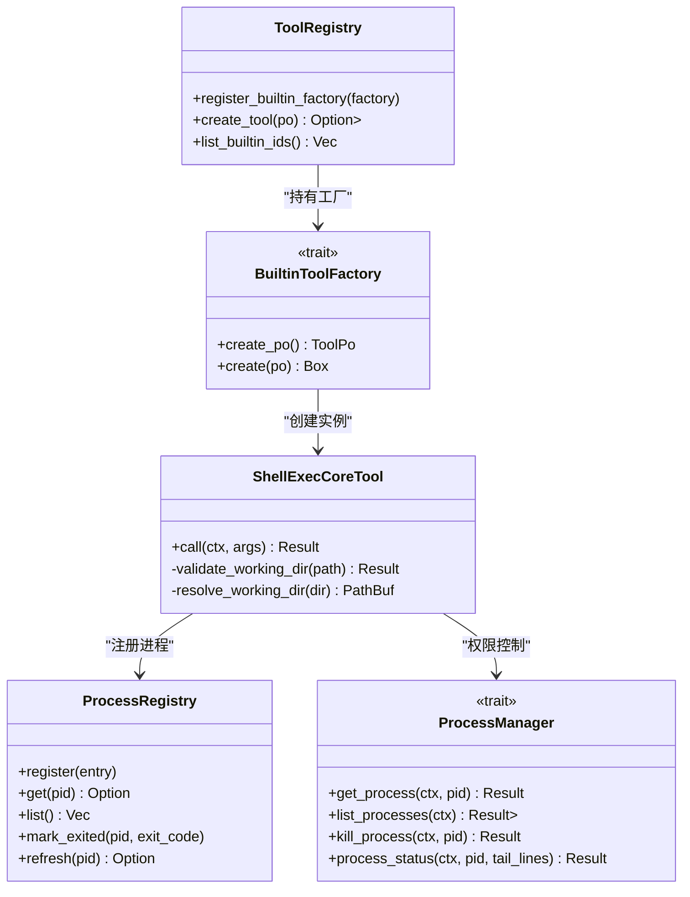

# Shell 执行工具（业务功能层）

<cite>
**本文引用的文件**
- [src/pkg/tool_registry/shell_exec.rs](src/pkg/tool_registry/shell_exec.rs)
- [src/pkg/tool_registry/tool_security.rs](src/pkg/tool_registry/tool_security.rs)
- [src/pkg/tool_registry/mod.rs](src/pkg/tool_registry/mod.rs)
- [src/pkg/tool_registry/builtin.rs](src/pkg/tool_registry/builtin.rs)
- [src/pkg/process/mod.rs](src/pkg/process/mod.rs)
- [src/service/domain/system/process.rs](src/service/domain/system/process.rs)
- [src/handlers/system/process/shell_list.rs](src/handlers/system/process/shell_list.rs)
- [src/handlers/system/process/shell_status.rs](src/handlers/system/process/shell_status.rs)
- [src/handlers/system/process/shell_kill.rs](src/handlers/system/process/shell_kill.rs)
- [src/config.rs](src/config.rs)
- [common/config/ai_orz.toml](common/config/ai_orz.toml)
- [src/pkg/tool_registry/shell_tests.rs](src/pkg/tool_registry/shell_tests.rs)
</cite>

## 更新摘要
**所做更改**
- 新增统一后台进程管理机制，集成 ProcessManager 进行进程生命周期管理
- 增强超时控制，支持 detach（默认）和 kill 两种超时处理策略
- 实现 call_id 单一事实源，确保全链路日志关联
- 新增 shell_list、shell_status、shell_kill 三个双露接口（HTTP + LLM 工具）
- 改进错误处理和进程状态管理
- 增强 Agent 权限隔离，确保进程管理的范围控制

## 目录
1. [简介](#简介)
2. [项目结构](#项目结构)
3. [核心组件](#核心组件)
4. [架构总览](#架构总览)
5. [详细组件分析](#详细组件分析)
6. [依赖关系分析](#依赖关系分析)
7. [性能考虑](#性能考虑)
8. [故障排查指南](#故障排查指南)
9. [结论](#结论)
10. [附录：使用示例与最佳实践](#附录使用示例与最佳实践)

## 简介
本文件为"Shell 执行工具"的完整技术文档，聚焦于命令执行、沙箱隔离、资源限制、异步执行、超时控制、进程监控与环境变量继承等能力。该工具以内置工具形式注册到全局工具注册表，通过统一的 CoreTool 接口被上层调用，支持同步等待与后台运行两种模式，并具备输出大小限制、工作目录白名单、环境变量白名单过滤等安全机制。

**最新更新**：增强了统一的后台进程管理能力，实现了超时移交机制和 call_id 全链路关联，提供了完整的进程管理三件套（shell_list、shell_status、shell_kill）。

> 📌 视角说明（AGENTS §2.1.3 Level 3 互补视角平行卡）：
> 本长文是「Shell 执行工具」主题的 **业务功能层** 视角。同主题还有以下平行视角卡，请按需交叉阅读：
> - [Shell 执行工具（框架层）](docs/wiki/zh/content/基础设施/工具注册表/Shell%20执行工具.md)
> - [Shell 执行工具（代码落地层）](docs/wiki/zh/content/核心模块/工具注册表/Shell%20执行工具.md)

## 项目结构
Shell 执行工具位于工具注册表模块中，作为内置工具之一被统一注册与管理。其关键位置如下：
- 工具实现与参数定义：shell_exec.rs
- 进程注册中心：process/mod.rs
- 系统域进程管理：service/domain/system/process.rs
- 进程管理处理器：handlers/system/process/*.rs
- 安全工具函数（路径校验、敏感信息过滤）：tool_security.rs
- 工具注册表与工厂：mod.rs、builtin.rs
- 应用配置与基础数据路径：config.rs、common/config/ai_orz.toml
- 单元测试：shell_tests.rs



**图表来源**
- [src/pkg/tool_registry/mod.rs:29-108](src/pkg/tool_registry/mod.rs#L29-L108)
- [src/pkg/tool_registry/builtin.rs:26-43](src/pkg/tool_registry/builtin.rs#L26-L43)
- [src/pkg/tool_registry/shell_exec.rs:20-166](src/pkg/tool_registry/shell_exec.rs#L20-L166)
- [src/pkg/process/mod.rs:57-124](src/pkg/process/mod.rs#L57-L124)
- [src/service/domain/system/process.rs:37-90](src/service/domain/system/process.rs#L37-L90)

章节来源
- [src/pkg/tool_registry/mod.rs:29-108](src/pkg/tool_registry/mod.rs#L29-L108)
- [src/pkg/tool_registry/builtin.rs:26-43](src/pkg/tool_registry/builtin.rs#L26-L43)
- [src/pkg/tool_registry/shell_exec.rs:20-166](src/pkg/tool_registry/shell_exec.rs#L20-L166)

## 核心组件
- ShellExecConfig：工具配置项，包含默认超时、最大输出大小、额外允许路径、允许的环境变量名白名单。
- ShellExecParams：调用参数，包括命令、工作目录、超时、输出大小限制、是否后台运行、附加环境变量、超时处理策略。
- ShellExecCoreTool：实现 CoreTool 接口，负责参数解析、工作目录校验、环境过滤、命令执行、超时控制、日志落盘与结果汇总。
- ProcessRegistry：内存版进程注册中心，提供进程注册、查询、状态管理功能。
- ProcessManager：SystemDomain 层的进程管理接口，提供带权限边界的管理能力。
- 工具注册：通过 BuiltinToolFactory 将 shell_exec 注册到全局 ToolRegistry，供上层按协议类型创建实例。

章节来源
- [src/pkg/tool_registry/shell_exec.rs:20-166](src/pkg/tool_registry/shell_exec.rs#L20-L166)
- [src/pkg/process/mod.rs:24-124](src/pkg/process/mod.rs#L24-L124)
- [src/service/domain/system/process.rs:227-249](src/service/domain/system/process.rs#L227-L249)
- [src/pkg/tool_registry/builtin.rs:26-43](src/pkg/tool_registry/builtin.rs#L26-L43)
- [src/pkg/tool_registry/mod.rs:29-108](src/pkg/tool_registry/mod.rs#L29-L108)

## 架构总览
Shell 执行工具遵循"适配器→领域→数据访问"的分层原则，本工具属于工具注册表层的内置实现，对外暴露统一的 CoreTool 接口，内部通过系统进程管理完成命令执行。

**更新**：新增了统一的进程管理架构，通过 ProcessManager 提供带权限边界的进程管理能力，支持 Agent 范围的进程隔离。



**图表来源**
- [src/pkg/tool_registry/shell_exec.rs:267-498](src/pkg/tool_registry/shell_exec.rs#L267-L498)
- [src/pkg/tool_registry/mod.rs:81-102](src/pkg/tool_registry/mod.rs#L81-L102)
- [src/pkg/tool_registry/builtin.rs:26-43](src/pkg/tool_registry/builtin.rs#L26-L43)
- [src/service/domain/system/process.rs:37-90](src/service/domain/system/process.rs#L37-L90)

## 详细组件分析

### 命令参数解析与工作目录设置
- 参数解析：从 JSON 参数中解析 command、working_dir、timeout_ms、max_output_size_bytes、background、env、timeout_action。
- 工作目录解析：相对路径基于 base_data_path；绝对路径需满足白名单校验（base_data_path 或 additional_allowed_paths）。
- 目录不存在时自动创建。



**图表来源**
- [src/pkg/tool_registry/shell_exec.rs:267-306](src/pkg/tool_registry/shell_exec.rs#L267-L306)
- [src/pkg/tool_registry/shell_exec.rs:177-216](src/pkg/tool_registry/shell_exec.rs#L177-L216)

章节来源
- [src/pkg/tool_registry/shell_exec.rs:267-306](src/pkg/tool_registry/shell_exec.rs#L267-L306)
- [src/pkg/tool_registry/shell_exec.rs:177-216](src/pkg/tool_registry/shell_exec.rs#L177-L216)

### 环境变量继承与安全过滤
- 继承策略：仅继承 allowed_env 白名单中的环境变量。
- 敏感过滤：即使出现在白名单中，若键名包含敏感关键词（如 password、token、secret、api_key、aws_*、google_application_credentials、ssh_auth_sock、git_config、git_ssh 等），也会被过滤。
- 扩展环境变量：支持在参数 env 中追加键值对，合并到基础环境。



**图表来源**
- [src/pkg/tool_registry/shell_exec.rs:219-263](src/pkg/tool_registry/shell_exec.rs#L219-L263)

章节来源
- [src/pkg/tool_registry/shell_exec.rs:219-263](src/pkg/tool_registry/shell_exec.rs#L219-L263)

### 统一后台进程管理与超时移交
**新增功能**：实现了统一的后台进程管理机制，支持超时移交策略。

- **进程注册中心**：所有 shell_exec 启动的进程都注册到统一的 ProcessRegistry，支持探活、状态管理和日志尾部读取。
- **超时处理策略**：
  - `detach`（默认）：超时后不终止进程，返回 PID 供后续通过 shell_status/shell_kill 管理
  - `kill`：超时后立即终止进程
- **Agent 权限隔离**：通过 ProcessManager 确保 Agent 只能管理自己启动的进程。



**图表来源**
- [src/pkg/tool_registry/shell_exec.rs:373-498](src/pkg/tool_registry/shell_exec.rs#L373-L498)
- [src/pkg/process/mod.rs:76-124](src/pkg/process/mod.rs#L76-L124)
- [src/service/domain/system/process.rs:58-73](src/service/domain/system/process.rs#L58-L73)

章节来源
- [src/pkg/tool_registry/shell_exec.rs:373-498](src/pkg/tool_registry/shell_exec.rs#L373-L498)
- [src/pkg/process/mod.rs:76-124](src/pkg/process/mod.rs#L76-L124)
- [src/service/domain/system/process.rs:58-73](src/service/domain/system/process.rs#L58-L73)

### call_id 单一事实源与全链路关联
**新增功能**：实现了 call_id 的全链路关联机制，确保日志、进程信息和工具调用的唯一性。

- **单一事实源**：call_id 由 ToolCallDao::execute 单点生成/复用，通过 RequestContext.tool_call_id 注入。
- **日志关联**：日志文件名格式为 `{call_id}.log`，与 ToolCallEntry 全链路关联。
- **进程关联**：ProcessEntry 携带 call_id 字段，便于通过进程反查工具调用。
- **返回值增强**：shell_exec 返回 JSON 包含 call_id 字段，满足"执行日志带 PID"的反查需求。



**图表来源**
- [src/pkg/tool_registry/shell_exec.rs:314-325](src/pkg/tool_registry/shell_exec.rs#L314-L325)
- [src/pkg/tool_registry/shell_exec.rs:373-391](src/pkg/tool_registry/shell_exec.rs#L373-L391)
- [src/pkg/tool_registry/shell_exec.rs:398-409](src/pkg/tool_registry/shell_exec.rs#L398-L409)

章节来源
- [src/pkg/tool_registry/shell_exec.rs:314-325](src/pkg/tool_registry/shell_exec.rs#L314-L325)
- [src/pkg/tool_registry/shell_exec.rs:373-391](src/pkg/tool_registry/shell_exec.rs#L373-L391)
- [src/pkg/tool_registry/shell_exec.rs:398-409](src/pkg/tool_registry/shell_exec.rs#L398-L409)

### 进程管理三件套接口
**新增功能**：提供了完整的进程管理接口，同时暴露为 HTTP API 和 LLM 工具。

- **shell_list**：列出后台进程，支持 Agent 范围过滤（仅可见自己启动的进程）
- **shell_status**：查询进程状态，支持日志尾部读取
- **shell_kill**：终止进程，发送 SIGKILL 信号



**图表来源**
- [src/handlers/system/process/shell_list.rs:19-49](src/handlers/system/process/shell_list.rs#L19-L49)
- [src/handlers/system/process/shell_status.rs:19-38](src/handlers/system/process/shell_status.rs#L19-L38)
- [src/handlers/system/process/shell_kill.rs:18-30](src/handlers/system/process/shell_kill.rs#L18-L30)

章节来源
- [src/handlers/system/process/shell_list.rs:19-49](src/handlers/system/process/shell_list.rs#L19-L49)
- [src/handlers/system/process/shell_status.rs:19-38](src/handlers/system/process/shell_status.rs#L19-L38)
- [src/handlers/system/process/shell_kill.rs:18-30](src/handlers/system/process/shell_kill.rs#L18-L30)

### 沙箱隔离机制与资源限制
- 工作目录沙箱：限制在执行 base_data_path 或 additional_allowed_paths 内，防止越权访问。
- 环境变量沙箱：仅继承白名单环境变量，并过滤敏感键。
- 输出大小限制：默认 10MB，可配置；超出则截断并保存完整日志。
- 超时限制：默认 300s，可配置；超时强制终止进程或移交控制权。
- 平台适配：Windows 使用 cmd.exe /C，Unix 使用 /bin/sh -c。
- **新增**：Agent 权限隔离，确保进程管理的范围控制。

章节来源
- [src/pkg/tool_registry/shell_exec.rs:20-68](src/pkg/tool_registry/shell_exec.rs#L20-L68)
- [src/pkg/tool_registry/shell_exec.rs:177-216](src/pkg/tool_registry/shell_exec.rs#L177-L216)
- [src/pkg/tool_registry/shell_exec.rs:267-498](src/pkg/tool_registry/shell_exec.rs#L267-L498)
- [src/service/domain/system/process.rs:21-31](src/service/domain/system/process.rs#L21-L31)

### 命令白名单控制
当前实现未提供"命令白名单"（仅允许特定命令）的直接开关。可通过以下策略间接实现：
- 在调用前对用户输入的命令进行严格校验（例如正则匹配允许的指令集合）。
- 结合工作目录白名单与环境变量白名单，降低风险面。
- 如需更细粒度控制，可在上层封装一层命令审批逻辑后再调用 shell_exec。

章节来源
- [src/pkg/tool_registry/shell_exec.rs:267-306](src/pkg/tool_registry/shell_exec.rs#L267-L306)

### 管道操作与 IO 处理
- 同步模式下，stdout 与 stderr 分别通过管道读取并合并到输出缓冲区。
- 后台模式下，stdout 与 stderr 均重定向到同一日志文件，便于后续查看。
- 输出写入采用异步写，避免阻塞主流程。
- **更新**：统一了日志流式模型，sync 和 background 模式都从 spawn 起把 stdout/stderr 重定向到日志文件。

章节来源
- [src/pkg/tool_registry/shell_exec.rs:334-355](src/pkg/tool_registry/shell_exec.rs#L334-L355)
- [src/pkg/tool_registry/shell_exec.rs:420-437](src/pkg/tool_registry/shell_exec.rs#L420-L437)

## 依赖关系分析
- 工具注册表：ToolRegistry 维护内置工具工厂映射，按协议分发创建。
- 内置工具工厂：GENERIC_BUILTIN_TOOLS 包含 shell_exec 工厂，统一注册。
- 进程注册中心：ProcessRegistry 提供内存版的进程信息管理。
- SystemDomain：通过 ProcessManager 提供带权限边界的进程管理能力。
- 配置：base_data_path 来自应用配置，用于工作目录与日志路径。
- 安全工具：tool_security.rs 提供路径与敏感信息相关的安全函数，虽主要面向 HTTP/FS 工具，但其理念可复用到 Shell 工具。



**图表来源**
- [src/pkg/tool_registry/mod.rs:29-108](src/pkg/tool_registry/mod.rs#L29-L108)
- [src/pkg/tool_registry/builtin.rs:26-43](src/pkg/tool_registry/builtin.rs#L26-L43)
- [src/pkg/tool_registry/shell_exec.rs:151-166](src/pkg/tool_registry/shell_exec.rs#L151-L166)
- [src/pkg/process/mod.rs:57-124](src/pkg/process/mod.rs#L57-L124)
- [src/service/domain/system/process.rs:227-249](src/service/domain/system/process.rs#L227-L249)

章节来源
- [src/pkg/tool_registry/mod.rs:29-108](src/pkg/tool_registry/mod.rs#L29-L108)
- [src/pkg/tool_registry/builtin.rs:26-43](src/pkg/tool_registry/builtin.rs#L26-L43)
- [src/pkg/tool_registry/shell_exec.rs:151-166](src/pkg/tool_registry/shell_exec.rs#L151-L166)

## 性能考虑
- 超时与内存保护：通过默认超时与最大输出大小限制，避免长时间占用与内存膨胀。
- 后台模式：长任务建议后台运行，减少请求阻塞。
- 日志落盘：大输出写入磁盘，避免内存峰值过高。
- 进程池管理：当前实现为每次调用创建子进程；在高并发场景下可考虑复用进程或队列化执行以降低开销。
- 资源回收：超时或错误时主动 kill 子进程，避免僵尸进程。
- **新增**：统一的进程注册中心减少了重复的进程管理逻辑，提高了资源利用效率。
- **新增**：Agent 权限隔离避免了不必要的进程查询和管理开销。

[本节为通用性能建议，不直接分析具体文件]

## 故障排查指南
- 权限不足
  - 现象：无法创建目录或写入日志。
  - 排查：检查 base_data_path 及 tools/shell_exec/logs 目录权限；确保进程有写权限。
- 命令不存在
  - 现象：spawn 失败或退出码非零。
  - 排查：确认 PATH 已正确继承；检查命令是否存在于目标环境中。
- 资源耗尽
  - 现象：超时或输出过大导致响应缓慢。
  - 排查：调整 default_timeout_ms 与 default_max_output_size_bytes；使用后台模式并查看日志。
- 工作目录不在白名单
  - 现象：返回 require_confirmation。
  - 排查：将工作目录设置在 base_data_path 或 additional_allowed_paths 中。
- 环境变量泄露
  - 现象：敏感信息未传入或被过滤。
  - 排查：检查 allowed_env 白名单与敏感词过滤规则；必要时在上层显式注入必要变量。
- **新增**：进程管理权限问题
  - 现象：Agent 无法管理其他 Agent 启动的进程。
  - 排查：确认调用方的 agent_id 与进程的 agent_id 匹配；检查 ProcessManager 的权限控制逻辑。
- **新增**：call_id 关联问题
  - 现象：日志文件与工具调用记录无法关联。
  - 排查：确认 RequestContext 中是否正确设置了 tool_call_id；检查日志文件名是否为 {call_id}.log。

章节来源
- [src/pkg/tool_registry/shell_exec.rs:177-216](src/pkg/tool_registry/shell_exec.rs#L177-L216)
- [src/pkg/tool_registry/shell_exec.rs:219-263](src/pkg/tool_registry/shell_exec.rs#L219-L263)
- [src/pkg/tool_registry/shell_exec.rs:267-498](src/pkg/tool_registry/shell_exec.rs#L267-L498)
- [src/service/domain/system/process.rs:21-31](src/service/domain/system/process.rs#L21-L31)

## 结论
Shell 执行工具提供了安全的命令执行能力，涵盖参数解析、工作目录白名单、环境变量白名单与敏感过滤、超时与输出大小限制、后台模式与日志落盘等特性。通过工具注册表统一管理，易于扩展与维护。

**最新更新**：增强了统一的后台进程管理能力，实现了超时移交机制和 call_id 全链路关联，提供了完整的进程管理三件套（shell_list、shell_status、shell_kill）。建议在业务侧结合命令白名单与审批流程，进一步提升安全性与可控性。

[本节为总结性内容，不直接分析具体文件]

## 附录：使用示例与最佳实践

### 系统信息查询
- 场景：查询系统基本信息（如 uname、systeminfo）。
- 要点：设置合理超时；输出可能较大，注意 max_output_size_bytes；建议使用后台模式并查看日志。

章节来源
- [src/pkg/tool_registry/shell_exec.rs:267-498](src/pkg/tool_registry/shell_exec.rs#L267-L498)

### 文件批处理
- 场景：批量复制/移动/转换文件。
- 要点：工作目录限定在项目根或额外允许路径；避免访问敏感文件；输出过大时查看日志。

章节来源
- [src/pkg/tool_registry/shell_exec.rs:177-216](src/pkg/tool_registry/shell_exec.rs#L177-L216)
- [src/pkg/tool_registry/shell_exec.rs:334-355](src/pkg/tool_registry/shell_exec.rs#L334-L355)

### 脚本执行
- 场景：执行预置脚本（如构建、测试、部署）。
- 要点：通过 env 注入必要变量；设置超时；后台运行并监控日志。

章节来源
- [src/pkg/tool_registry/shell_exec.rs:308-312](src/pkg/tool_registry/shell_exec.rs#L308-L312)
- [src/pkg/tool_registry/shell_exec.rs:393-410](src/pkg/tool_registry/shell_exec.rs#L393-L410)

### 管道操作
- 场景：组合多个命令并通过管道传递数据。
- 要点：在 Unix 环境下使用 /bin/sh -c 支持管道；注意输出大小限制与日志落盘。

章节来源
- [src/pkg/tool_registry/shell_exec.rs:505-516](src/pkg/tool_registry/shell_exec.rs#L505-L516)
- [src/pkg/tool_registry/shell_exec.rs:420-437](src/pkg/tool_registry/shell_exec.rs#L420-L437)

### 进程管理最佳实践
**新增**：使用进程管理三件套进行后台进程管理。

- **shell_list**：定期轮询获取进程列表，监控长任务的执行状态。
- **shell_status**：查询特定进程的详细信息，包括日志尾部输出。
- **shell_kill**：在需要时终止失控的进程。

```json
// 后台执行长任务
{
  "command": "python long_running_script.py",
  "background": true,
  "timeout_ms": 3600000
}

// 查询进程状态
GET /api/v1/system/processes/{pid}?tail_lines=50

// 终止进程
POST /api/v1/system/processes/{pid}/kill
```

章节来源
- [src/handlers/system/process/shell_list.rs:19-49](src/handlers/system/process/shell_list.rs#L19-L49)
- [src/handlers/system/process/shell_status.rs:19-38](src/handlers/system/process/shell_status.rs#L19-L38)
- [src/handlers/system/process/shell_kill.rs:18-30](src/handlers/system/process/shell_kill.rs#L18-L30)

### 安全最佳实践
- 命令注入防护：在上层对用户输入进行严格校验，限制允许的命令集合与参数格式。
- 权限最小化：仅授予必要的文件系统与网络权限；工作目录限制在沙箱内。
- 敏感信息过滤：使用环境变量白名单与敏感词过滤；避免在日志中输出敏感数据。
- **新增**：Agent 权限隔离：确保每个 Agent 只能管理自己启动的进程，防止跨 Agent 的进程操作。
- **新增**：call_id 追踪：通过统一的 call_id 实现全链路追踪，便于审计和问题排查。

章节来源
- [src/pkg/tool_registry/shell_exec.rs:219-263](src/pkg/tool_registry/shell_exec.rs#L219-L263)
- [src/pkg/tool_registry/shell_exec.rs:177-216](src/pkg/tool_registry/shell_exec.rs#L177-L216)
- [src/service/domain/system/process.rs:21-31](src/service/domain/system/process.rs#L21-L31)

### 性能调优建议
- 进程池管理：在高并发场景下，考虑对 shell_exec 调用进行排队与复用，减少进程创建开销。
- 资源回收：确保超时与错误路径中 kill 子进程，避免资源泄漏。
- 错误恢复：对常见错误（命令不存在、权限不足）进行重试或降级处理。
- **新增**：统一的进程注册中心减少了重复的进程管理逻辑，提高了资源利用效率。
- **新增**：Agent 权限隔离避免了不必要的进程查询和管理开销。

[本节为通用性能建议，不直接分析具体文件]

### 单元测试参考
- 配置解析与默认值验证
- 环境变量过滤与合并
- 参数解析完整性
- **新增**：超时移交机制测试
- **新增**：进程管理权限隔离测试
- **新增**：call_id 全链路关联测试

章节来源
- [src/pkg/tool_registry/shell_tests.rs:169-326](src/pkg/tool_registry/shell_tests.rs#L169-L326)
- [src/service/domain/system/process.rs:92-229](src/service/domain/system/process.rs#L92-L229)