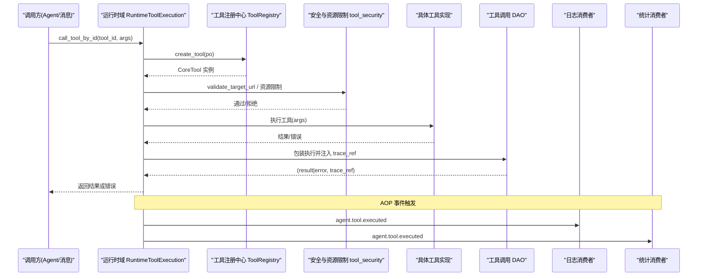
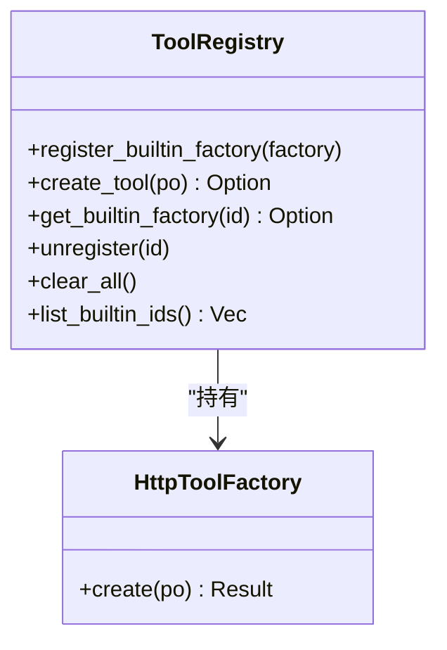
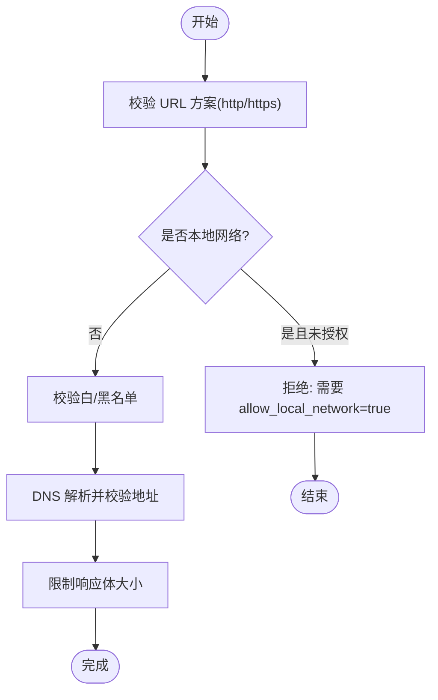
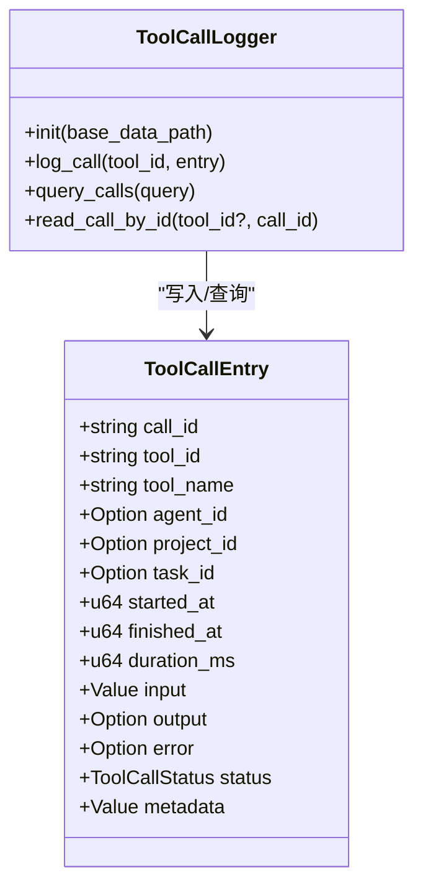
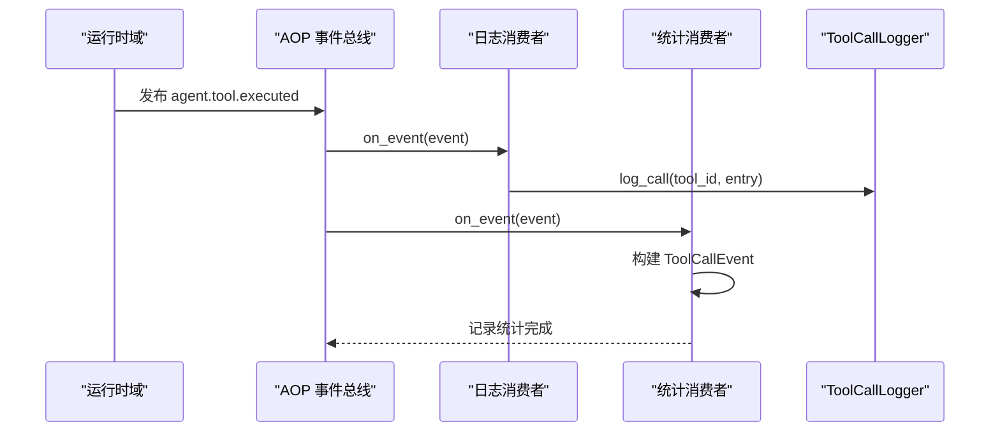
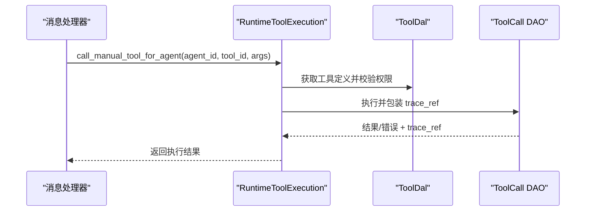
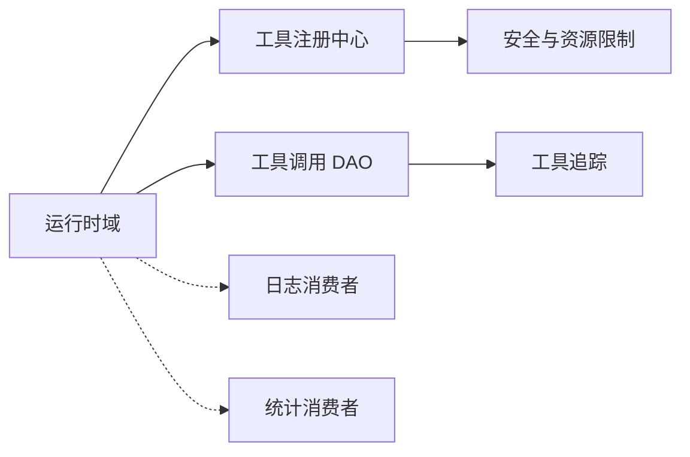

# 工具执行引擎

<cite>
**本文引用的文件**
- [src/pkg/tool_registry/mod.rs](src/pkg/tool_registry/mod.rs)
- [src/pkg/tool_registry/http.rs](src/pkg/tool_registry/http.rs)
- [src/pkg/tool_registry/tool_security.rs](src/pkg/tool_registry/tool_security.rs)
- [src/pkg/tool_tracing/entry.rs](src/pkg/tool_tracing/entry.rs)
- [src/pkg/tool_tracing/logger.rs](src/pkg/tool_tracing/logger.rs)
- [src/consumer/tool_exec_log_consumer.rs](src/consumer/tool_exec_log_consumer.rs)
- [src/consumer/tool_exec_stats_consumer.rs](src/consumer/tool_exec_stats_consumer.rs)
- [src/service/domain/runtime/mod.rs](src/service/domain/runtime/mod.rs)
- [src/service/domain/runtime/awakening.rs](src/service/domain/runtime/awakening.rs)
- [src/service/dao/tool_call/impl.rs](src/service/dao/tool_call/impl.rs)
- [src/handlers/finance/tool/response_test.rs](src/handlers/finance/tool/response_test.rs)
- [common/src/error_test.rs](common/src/error_test.rs)
</cite>

## 目录
1. [简介](#简介)
2. [项目结构](#项目结构)
3. [核心组件](#核心组件)
4. [架构总览](#架构总览)
5. [详细组件分析](#详细组件分析)
6. [依赖关系分析](#依赖关系分析)
7. [性能与并发特性](#性能与并发特性)
8. [故障排查指南](#故障排查指南)
9. [结论](#结论)
10. [附录](#附录)

## 简介
本文件面向“工具执行引擎”，系统性说明工具调度的调度机制、并发控制、资源隔离与执行监控；覆盖工具执行生命周期、上下文传递、参数验证、结果缓存（以日志与统计为主）、安全沙箱、权限控制、资源限制策略；并提供日志记录、性能统计、错误追踪、超时处理、重试与熔断保护等容错设计思路，以及调试、性能分析与问题诊断方法。

本项目遵循严格四层单向调用：Adapter → Domain → DAL → DAO，通用基础设施工具统一放在 pkg 层，无业务感知；所有服务层公共方法首参为 RequestContext，跨层通过 ctx.clone() 传递。

## 项目结构
围绕工具执行的关键代码分布在以下模块：
- 工具注册与协议路由：pkg/tool_registry
- 工具安全与资源限制：pkg/tool_registry/tool_security.rs
- 工具调用追踪与持久化：pkg/tool_tracing
- AOP 事件消费（日志与统计）：consumer/*_consumer
- 运行时域的工具执行入口：service/domain/runtime
- 工具调用 DAO 封装与错误透传：service/dao/tool_call
- HTTP 工具配置脱敏与响应展示：handlers/finance/tool/response_test.rs
- 错误码与类型契约：common/src/error_test.rs

```mermaid
graph TB
subgraph "运行时域"
RT["RuntimeToolExecution<br/>call_tool_by_id / call_tool"]
end
subgraph "工具注册中心"
REG["ToolRegistry<br/>按协议分发到 Builtin/Http/Mcp"]
SEC["tool_security<br/>SSRF/域名白名单/大小/超时"]
end
subgraph "追踪与统计"
TRC["ToolCallLogger<br/>JSONL 持久化"]
LOGC["ToolExecLogConsumer<br/>订阅 agent.tool.executed"]
STATC["ToolExecStatsConsumer<br/>记录 ToolCallEvent"]
end
subgraph "DAO"
DAO["ToolCall DAO<br/>包装执行并注入 trace_ref"]
end
RT --> REG
REG --> SEC
RT --> DAO
DAO --> TRC
RT -.-> LOGC
RT -.-> STATC
```

图表来源
- [src/service/domain/runtime/mod.rs:175-213](src/service/domain/runtime/mod.rs#L175-L213)
- [src/pkg/tool_registry/mod.rs:29-102](src/pkg/tool_registry/mod.rs#L29-L102)
- [src/pkg/tool_registry/tool_security.rs:92-169](src/pkg/tool_registry/tool_security.rs#L92-L169)
- [src/pkg/tool_tracing/logger.rs:33-73](src/pkg/tool_tracing/logger.rs#L33-L73)
- [src/consumer/tool_exec_log_consumer.rs:26-50](src/consumer/tool_exec_log_consumer.rs#L26-L50)
- [src/consumer/tool_exec_stats_consumer.rs:27-70](src/consumer/tool_exec_stats_consumer.rs#L27-L70)
- [src/service/dao/tool_call/impl.rs:156-178](src/service/dao/tool_call/impl.rs#L156-L178)

章节来源
- [src/pkg/tool_registry/mod.rs:29-102](src/pkg/tool_registry/mod.rs#L29-L102)
- [src/pkg/tool_registry/tool_security.rs:92-169](src/pkg/tool_registry/tool_security.rs#L92-L169)
- [src/pkg/tool_tracing/logger.rs:33-73](src/pkg/tool_tracing/logger.rs#L33-L73)
- [src/consumer/tool_exec_log_consumer.rs:26-50](src/consumer/tool_exec_log_consumer.rs#L26-L50)
- [src/consumer/tool_exec_stats_consumer.rs:27-70](src/consumer/tool_exec_stats_consumer.rs#L27-L70)
- [src/service/domain/runtime/mod.rs:175-213](src/service/domain/runtime/mod.rs#L175-L213)
- [src/service/dao/tool_call/impl.rs:156-178](src/service/dao/tool_call/impl.rs#L156-L178)

## 核心组件
- 工具注册中心（ToolRegistry）
  - 职责：按协议将 ToolPo 实例化为可执行 CoreTool；维护内置工厂、HTTP 工厂、MCP 工具创建逻辑。
  - 关键点：create_tool 根据协议分派；全局单例 GLOBAL_TOOL_REGISTRY。
- 工具安全与资源限制（tool_security）
  - 职责：URL 模板校验、域名白/黑名单、本地网络访问控制、DNS 解析后地址校验、响应体大小限制、敏感头脱敏、文件系统路径校验与符号链接拒绝。
  - 关键点：validate_target_url、read_limited_response_body、fs::resolve_and_validate_path。
- 工具调用追踪（tool_tracing）
  - 职责：结构化日志条目 ToolCallEntry、每日 JSONL 写入、按条件查询、trace 值脱敏。
  - 关键点：ToolCallLogger 单例、query_calls、redact_trace_values_for_tool。
- AOP 消费者
  - ToolExecLogConsumer：订阅 agent.tool.executed，落盘 JSONL。
  - ToolExecStatsConsumer：订阅同一事件，转换为 ToolCallEvent 上报 stats。
- 运行时域工具执行接口（RuntimeToolExecution）
  - 职责：统一入口 call_tool_by_id/call_tool/call_manual_tool_for_agent，负责协议路由与授权检查。
- 工具调用 DAO
  - 职责：执行工具并构造 trace_ref，失败时携带 trace_ref 以便上层定位。

章节来源
- [src/pkg/tool_registry/mod.rs:29-102](src/pkg/tool_registry/mod.rs#L29-L102)
- [src/pkg/tool_registry/tool_security.rs:92-169](src/pkg/tool_registry/tool_security.rs#L92-L169)
- [src/pkg/tool_tracing/entry.rs:1-91](src/pkg/tool_tracing/entry.rs#L1-L91)
- [src/pkg/tool_tracing/logger.rs:33-140](src/pkg/tool_tracing/logger.rs#L33-L140)
- [src/consumer/tool_exec_log_consumer.rs:26-50](src/consumer/tool_exec_log_consumer.rs#L26-L50)
- [src/consumer/tool_exec_stats_consumer.rs:27-70](src/consumer/tool_exec_stats_consumer.rs#L27-L70)
- [src/service/domain/runtime/mod.rs:175-213](src/service/domain/runtime/mod.rs#L175-L213)
- [src/service/dao/tool_call/impl.rs:156-178](src/service/dao/tool_call/impl.rs#L156-L178)

## 架构总览
工具执行从运行时域发起，经注册中心选择具体协议实现，执行前进行安全校验与资源限制，执行过程中产生 AOP 事件，由消费者异步落盘日志与统计，DAO 层在成功或失败时注入 trace_ref，便于端到端追踪。



图表来源
- [src/service/domain/runtime/mod.rs:175-213](src/service/domain/runtime/mod.rs#L175-L213)
- [src/pkg/tool_registry/mod.rs:81-102](src/pkg/tool_registry/mod.rs#L81-L102)
- [src/pkg/tool_registry/tool_security.rs:92-169](src/pkg/tool_registry/tool_security.rs#L92-L169)
- [src/consumer/tool_exec_log_consumer.rs:26-50](src/consumer/tool_exec_log_consumer.rs#L26-L50)
- [src/consumer/tool_exec_stats_consumer.rs:27-70](src/consumer/tool_exec_stats_consumer.rs#L27-L70)
- [src/service/dao/tool_call/impl.rs:156-178](src/service/dao/tool_call/impl.rs#L156-L178)

## 详细组件分析

### 工具注册与协议路由（ToolRegistry）
- 设计要点
  - 存储的是“工厂”而非实例，允许每次从数据库加载的 ToolPo 动态注入名称、描述等元数据。
  - 支持 Builtin、Http、Mcp 三种协议，create_tool 按协议分派。
  - 提供 register_builtin_factory、unregister、clear_all、list_builtin_ids 等管理能力。
- 扩展点
  - 可通过 with_http_factory 替换 HTTP 工具工厂，便于测试与定制。



图表来源
- [src/pkg/tool_registry/mod.rs:29-102](src/pkg/tool_registry/mod.rs#L29-L102)

章节来源
- [src/pkg/tool_registry/mod.rs:29-102](src/pkg/tool_registry/mod.rs#L29-L102)

### 工具安全沙箱与资源限制（tool_security）
- URL 与网络访问
  - 仅允许 http/https 方案，禁止 scheme 或 authority 包含模板占位符。
  - 支持 allowed_domains/blocked_domains 白/黑名单匹配。
  - 默认拒绝本地网络目标，除非显式 allow_local_network=true。
  - DNS 解析后进行二次校验，防止 SSRF。
- 响应体限制
  - 读取响应体时按 response_max_bytes 硬限制，超限即失败。
- 头部脱敏
  - 对 Authorization、Cookie、含 token/api-key/password 等敏感头进行脱敏。
- 文件系统沙箱
  - 路径规范化、拒绝符号链接、拒绝敏感文件名、限制在 base_path 或额外允许路径内。
- 超时与大小常量
  - DEFAULT_TIMEOUT_MS、HARD_TIMEOUT_MS、DEFAULT_RESPONSE_MAX_BYTES、HARD_RESPONSE_MAX_BYTES。



图表来源
- [src/pkg/tool_registry/tool_security.rs:92-169](src/pkg/tool_registry/tool_security.rs#L92-L169)
- [src/pkg/tool_registry/tool_security.rs:200-231](src/pkg/tool_registry/tool_security.rs#L200-L231)
- [src/pkg/tool_registry/tool_security.rs:314-419](src/pkg/tool_registry/tool_security.rs#L314-L419)

章节来源
- [src/pkg/tool_registry/tool_security.rs:92-169](src/pkg/tool_registry/tool_security.rs#L92-L169)
- [src/pkg/tool_registry/tool_security.rs:200-231](src/pkg/tool_registry/tool_security.rs#L200-L231)
- [src/pkg/tool_registry/tool_security.rs:314-419](src/pkg/tool_registry/tool_security.rs#L314-L419)

### 工具调用追踪与日志（tool_tracing）
- 数据结构
  - ToolCallEntry：包含 call_id、tool_id、tool_name、agent/project/task 关联、时间戳、输入输出、错误、状态、元数据。
  - ToolCallStatus：Started/Completed/Failed。
- 持久化
  - ToolCallLogger 单例，按日 JSONL 写入 {base_data_path}/tools/{tool_id}/call_trace/YYYYMMDD.jsonl。
  - 支持按 call_id、tool_id、agent/project/task、状态、时间范围查询，限制最大查询条数。
- 脱敏
  - 对外部协议工具（HTTP/MCP）的 trace input/output/error 默认脱敏，避免敏感信息泄露。



图表来源
- [src/pkg/tool_tracing/entry.rs:1-91](src/pkg/tool_tracing/entry.rs#L1-L91)
- [src/pkg/tool_tracing/logger.rs:33-140](src/pkg/tool_tracing/logger.rs#L33-L140)

章节来源
- [src/pkg/tool_tracing/entry.rs:1-91](src/pkg/tool_tracing/entry.rs#L1-L91)
- [src/pkg/tool_tracing/logger.rs:33-140](src/pkg/tool_tracing/logger.rs#L33-L140)

### AOP 事件消费（日志与统计）
- ToolExecLogConsumer
  - 订阅 agent.tool.executed，反序列化为 ToolExecEvent，调用 ToolCallLogger.log_call 写入 JSONL。
- ToolExecStatsConsumer
  - 订阅同一事件，映射为 ToolCallEvent，通过 global_stats().record 上报统计指标（耗时、状态、长度等）。



图表来源
- [src/consumer/tool_exec_log_consumer.rs:26-50](src/consumer/tool_exec_log_consumer.rs#L26-L50)
- [src/consumer/tool_exec_stats_consumer.rs:27-70](src/consumer/tool_exec_stats_consumer.rs#L27-L70)

章节来源
- [src/consumer/tool_exec_log_consumer.rs:26-50](src/consumer/tool_exec_log_consumer.rs#L26-L50)
- [src/consumer/tool_exec_stats_consumer.rs:27-70](src/consumer/tool_exec_stats_consumer.rs#L27-L70)

### 运行时工具执行入口（RuntimeToolExecution）
- 能力
  - call_tool_by_id：按工具 ID 查找并执行。
  - call_tool：已加载 Tool 的直接执行。
  - call_manual_tool_for_agent：消息模式 Manual 工具调用，拥有运行时授权检查（工具必须绑定 Agent 且为 Manual 模式）。
- 与唤醒流程集成
  - 在 Agent 唤醒循环中，根据 ControlMode 决定同步/异步执行路径，并将结果回写为 ChatMessage。



图表来源
- [src/service/domain/runtime/mod.rs:175-213](src/service/domain/runtime/mod.rs#L175-L213)
- [src/service/domain/runtime/awakening.rs:267-290](src/service/domain/runtime/awakening.rs#L267-L290)
- [src/service/dao/tool_call/impl.rs:156-178](src/service/dao/tool_call/impl.rs#L156-L178)

章节来源
- [src/service/domain/runtime/mod.rs:175-213](src/service/domain/runtime/mod.rs#L175-L213)
- [src/service/domain/runtime/awakening.rs:267-290](src/service/domain/runtime/awakening.rs#L267-L290)
- [src/service/dao/tool_call/impl.rs:156-178](src/service/dao/tool_call/impl.rs#L156-L178)

### HTTP 工具配置与响应展示
- 配置校验
  - 要求 method/url/timeout_ms/response_max_bytes 等字段合法，非法配置在创建阶段拒绝。
- 响应展示
  - 详情接口会对配置中的敏感字段进行脱敏，避免暴露密钥。

章节来源
- [src/pkg/tool_registry/http.rs:572-598](src/pkg/tool_registry/http.rs#L572-L598)
- [src/handlers/finance/tool/response_test.rs:1-49](src/handlers/finance/tool/response_test.rs#L1-L49)

### 错误模型与工具错误
- 错误码与类型
  - 使用 ErrorCode/ErrorType 统一错误分类，如 ToolAutoModeNotSupported。
- 工具执行失败
  - DAO 层在执行失败时将错误包装为 typed Error，并附带 trace_ref，便于上层定位。

章节来源
- [common/src/error_test.rs:1-47](common/src/error_test.rs#L1-L47)
- [src/service/dao/tool_call/impl.rs:156-178](src/service/dao/tool_call/impl.rs#L156-L178)

## 依赖关系分析
- 耦合与内聚
  - ToolRegistry 与协议实现解耦，通过工厂模式降低耦合度。
  - tool_security 被 HTTP 工具等外部协议复用，提升内聚性。
  - tool_tracing 与 AOP 消费者松耦合，通过事件驱动解耦日志与统计。
- 直接/间接依赖
  - RuntimeToolExecution 依赖 ToolRegistry 与 ToolDal/DAO。
  - DAO 依赖 tool_tracing 写入 trace 并注入 trace_ref。
  - AOP 消费者依赖 event 结构与 logger/stats。
- 外部依赖
  - reqwest/tokio 用于 HTTP 请求与网络 I/O。
  - sqlx/DuckDB 用于持久化与统计（不在本节展开）。
- 潜在循环依赖
  - 当前分层清晰，未见循环依赖迹象。



图表来源
- [src/service/domain/runtime/mod.rs:175-213](src/service/domain/runtime/mod.rs#L175-L213)
- [src/pkg/tool_registry/mod.rs:29-102](src/pkg/tool_registry/mod.rs#L29-L102)
- [src/pkg/tool_registry/tool_security.rs:92-169](src/pkg/tool_registry/tool_security.rs#L92-L169)
- [src/pkg/tool_tracing/logger.rs:33-140](src/pkg/tool_tracing/logger.rs#L33-L140)
- [src/consumer/tool_exec_log_consumer.rs:26-50](src/consumer/tool_exec_log_consumer.rs#L26-L50)
- [src/consumer/tool_exec_stats_consumer.rs:27-70](src/consumer/tool_exec_stats_consumer.rs#L27-L70)
- [src/service/dao/tool_call/impl.rs:156-178](src/service/dao/tool_call/impl.rs#L156-L178)

章节来源
- [src/service/domain/runtime/mod.rs:175-213](src/service/domain/runtime/mod.rs#L175-L213)
- [src/pkg/tool_registry/mod.rs:29-102](src/pkg/tool_registry/mod.rs#L29-L102)
- [src/pkg/tool_registry/tool_security.rs:92-169](src/pkg/tool_registry/tool_security.rs#L92-L169)
- [src/pkg/tool_tracing/logger.rs:33-140](src/pkg/tool_tracing/logger.rs#L33-L140)
- [src/consumer/tool_exec_log_consumer.rs:26-50](src/consumer/tool_exec_log_consumer.rs#L26-L50)
- [src/consumer/tool_exec_stats_consumer.rs:27-70](src/consumer/tool_exec_stats_consumer.rs#L27-L70)
- [src/service/dao/tool_call/impl.rs:156-178](src/service/dao/tool_call/impl.rs#L156-L178)

## 性能与并发特性
- 并发模型
  - 基于 tokio 异步运行时，I/O 密集型操作（HTTP、文件、网络）非阻塞。
  - AOP 消费者采用同步消费模式，但内部 IO 仍为异步友好。
- 资源限制
  - 响应体大小限制防止内存膨胀。
  - 超时限制防止长时间占用资源。
- 查询限制
  - 工具调用日志查询限制最大条数，避免扫描过多 JSONL 文件导致性能抖动。
- 建议优化
  - 在高吞吐场景下，可将 JSONL 查询升级为索引表或物化视图。
  - 对频繁调用的工具引入结果缓存（需结合工具幂等性与 TTL 策略）。

[本节为通用指导，不直接分析具体文件]

## 故障排查指南
- 常见问题定位
  - 工具未找到或参数校验失败：检查 ToolPo 配置与 create_tool 返回值；查看错误码与错误类型。
  - 网络访问被拒：确认 allow_local_network、allowed_domains、blocked_domains 配置；检查 DNS 解析结果。
  - 响应过大：调整 response_max_bytes；检查服务端响应体积。
  - 超时：调整 timeout_ms；检查下游服务延迟。
  - 文件访问被拒：检查路径是否在 base_path 或额外允许路径内；是否存在符号链接或敏感文件名。
- 追踪与日志
  - 使用 ToolCallLogger.query_calls 按 call_id/tool_id/agent/project/task/状态/时间范围检索。
  - 通过 trace_ref 在错误中快速定位对应调用记录。
- 统计与性能
  - 通过 ToolExecStatsConsumer 记录的 ToolCallEvent 分析成功率、耗时分布、错误类型。
- 调试技巧
  - 临时关闭外部工具脱敏（仅限内部环境），观察原始输入输出。
  - 使用单元测试与集成测试复现问题（参考 tests/integration 下的工具相关用例）。

章节来源
- [src/pkg/tool_tracing/logger.rs:105-140](src/pkg/tool_tracing/logger.rs#L105-L140)
- [src/service/dao/tool_call/impl.rs:156-178](src/service/dao/tool_call/impl.rs#L156-L178)
- [common/src/error_test.rs:1-47](common/src/error_test.rs#L1-L47)

## 结论
工具执行引擎通过“注册中心 + 安全沙箱 + AOP 事件 + 追踪日志 + 统计上报”的组合，实现了可扩展、可观测、可审计的工具执行体系。运行时域统一入口屏蔽协议差异，DAO 层注入 trace_ref 打通端到端追踪，消费者解耦日志与统计，安全与资源限制保障执行边界可控。建议在后续演进中增强结果缓存、细粒度权限控制、更丰富的熔断与重试策略，以提升稳定性与性能。

[本节为总结，不直接分析具体文件]

## 附录
- 术语
  - 工具：平台提供的可执行能力（Builtin/Http/Mcp）。
  - 工具调用：一次工具执行的完整生命周期。
  - 追踪引用（trace_ref）：指向工具调用记录的标识，用于错误定位。
- 最佳实践
  - 工具配置最小化暴露，敏感字段脱敏。
  - 合理设置超时与响应大小限制。
  - 使用 AOP 事件进行横切关注点（日志、统计、告警）解耦。
  - 在 Domain 层进行授权与业务校验，DAO 层专注执行与追踪。

[本节为补充说明，不直接分析具体文件]