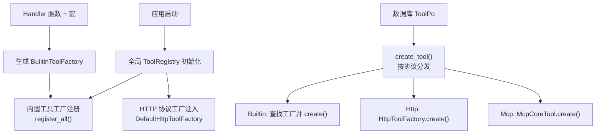
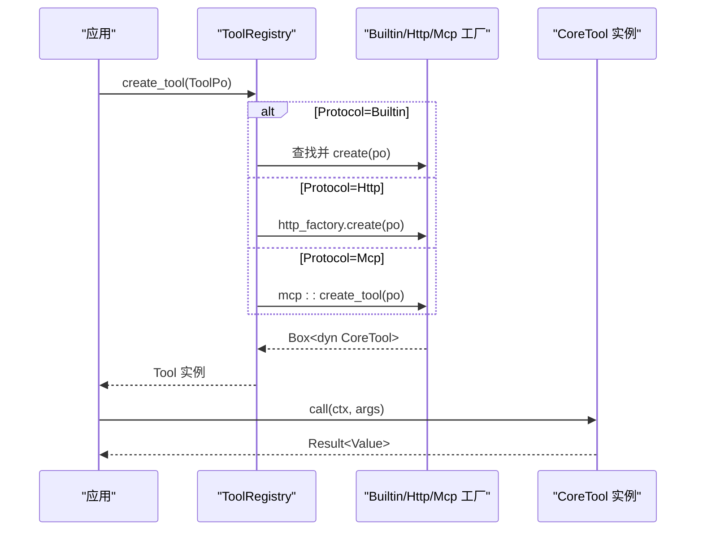
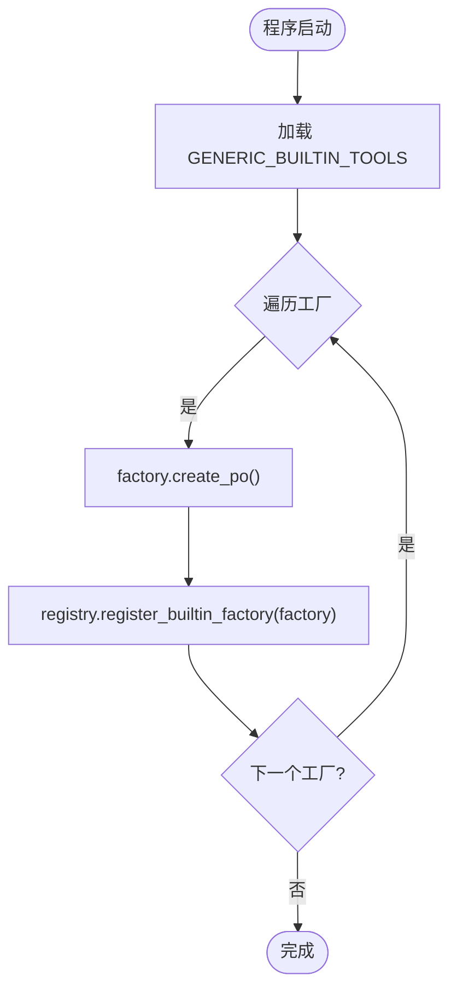
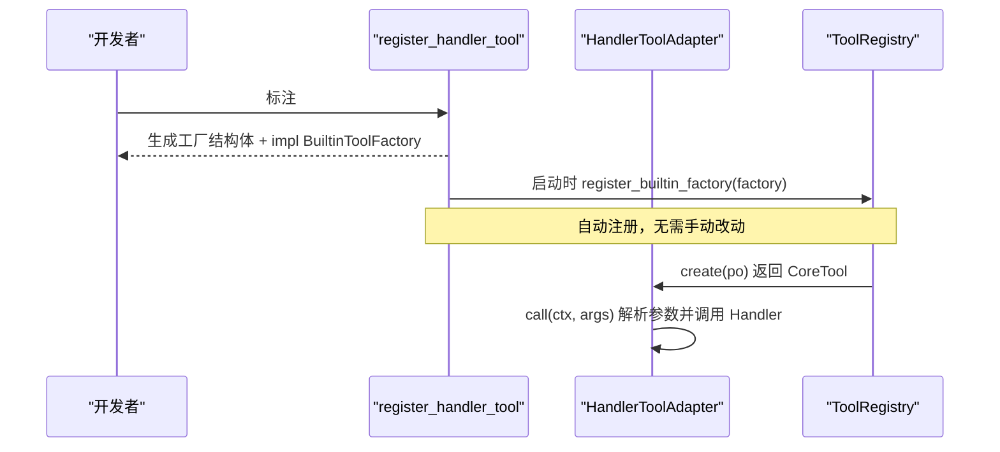
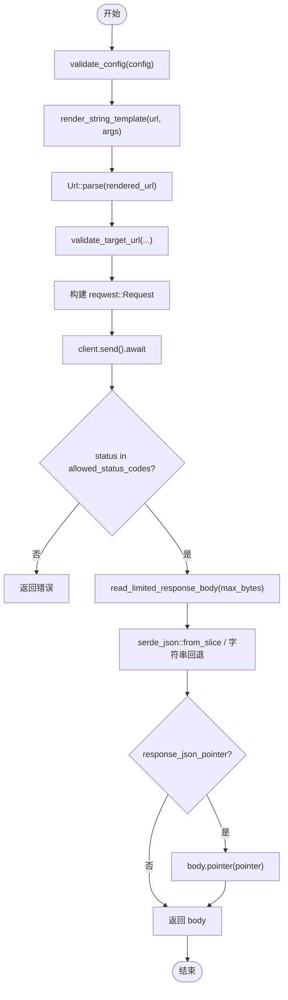
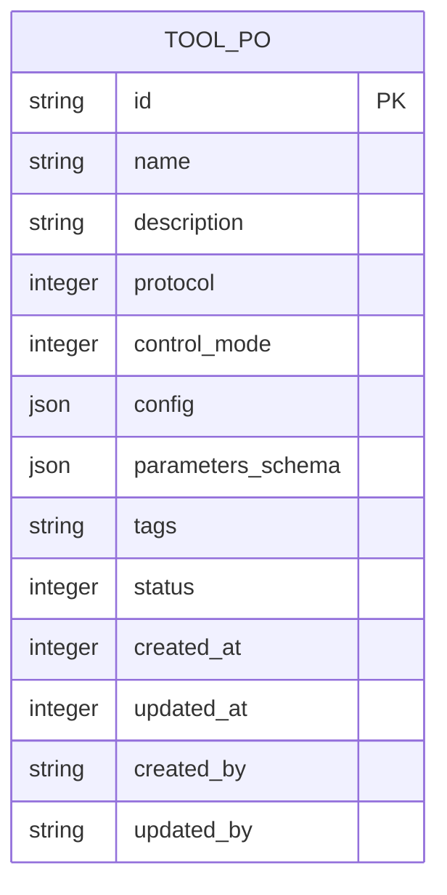
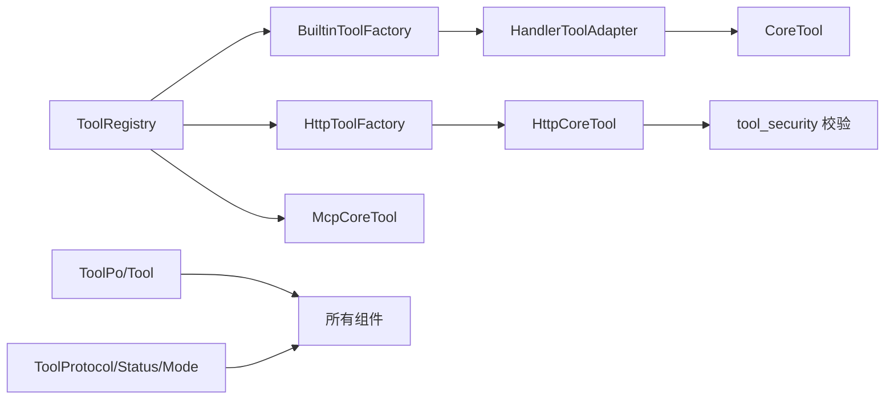

# 工具注册与发现

<cite>
**本文引用的文件**
- [src/pkg/tool_registry/mod.rs](src/pkg/tool_registry/mod.rs)
- [src/pkg/tool_registry/builtin.rs](src/pkg/tool_registry/builtin.rs)
- [src/pkg/tool_registry/handler_adapter/mod.rs](src/pkg/tool_registry/handler_adapter/mod.rs)
- [ai-orz-macros/src/lib.rs](ai-orz-macros/src/lib.rs)
- [src/models/tool.rs](src/models/tool.rs)
- [common/src/enums/tool.rs](common/src/enums/tool.rs)
- [src/pkg/tool_registry/http.rs](src/pkg/tool_registry/http.rs)
- [docs/design/handler-tool-registration-macro.md](docs/design/handler-tool-registration-macro.md)
</cite>

## 目录
1. [简介](#简介)
2. [项目结构](#项目结构)
3. [核心组件](#核心组件)
4. [架构总览](#架构总览)
5. [详细组件分析](#详细组件分析)
6. [依赖关系分析](#依赖关系分析)
7. [性能考量](#性能考量)
8. [故障排查指南](#故障排查指南)
9. [结论](#结论)
10. [附录](#附录)

## 简介
本文件系统性阐述“工具注册与发现”机制，覆盖以下主题：
- 工具的抽象接口设计与生命周期管理
- 内置工具的自动注册流程、动态发现与运行时创建
- 自定义工具的插件式集成（HTTP/MCP/Handler 适配）
- 工具元数据定义、版本兼容性检查、依赖关系解析
- 工具宏的使用示例与处理器适配器实现模式
- 标签系统、分类管理与搜索索引构建
- 冲突检测、热插拔支持、运行时动态加载等高级特性

## 项目结构
围绕工具注册与发现的关键代码分布在如下位置：
- 全局注册表与协议分发：src/pkg/tool_registry
- 处理器到 CoreTool 的适配器与宏：src/pkg/tool_registry/handler_adapter、ai-orz-macros
- 工具持久化对象与执行实体：src/models/tool.rs
- 工具协议枚举与状态：common/src/enums/tool.rs
- HTTP 工具运行时与安全校验：src/pkg/tool_registry/http.rs
- 设计文档与规范：docs/design/handler-tool-registration-macro.md



图表来源
- [src/pkg/tool_registry/mod.rs:29-102](src/pkg/tool_registry/mod.rs#L29-L102)
- [src/pkg/tool_registry/builtin.rs:26-43](src/pkg/tool_registry/builtin.rs#L26-L43)
- [src/pkg/tool_registry/http.rs:23-39](src/pkg/tool_registry/http.rs#L23-L39)
- [ai-orz-macros/src/lib.rs:167-231](ai-orz-macros/src/lib.rs#L167-L231)

章节来源
- [src/pkg/tool_registry/mod.rs:29-132](src/pkg/tool_registry/mod.rs#L29-L132)
- [src/pkg/tool_registry/builtin.rs:1-44](src/pkg/tool_registry/builtin.rs#L1-L44)
- [src/pkg/tool_registry/http.rs:1-124](src/pkg/tool_registry/http.rs#L1-L124)
- [ai-orz-macros/src/lib.rs:47-234](ai-orz-macros/src/lib.rs#L47-L234)

## 核心组件
- 全局工具注册表 ToolRegistry：维护各协议的工厂集合，提供统一 create_tool 入口。
- 内置工具工厂 BuiltinToolFactory：为每个内置工具提供默认 ToolPo 和实例构造。
- 处理器适配器 HandlerToolAdapter：将现有 Handler 函数适配为 CoreTool，复用权限、参数解析与错误处理。
- HTTP 工具运行时 HttpCoreTool：从数据库配置驱动，安全地发起 HTTP 调用。
- 工具模型 ToolPo/Tool：承载元数据、状态、可执行对象及搜索向量化能力。
- 工具协议枚举 ToolProtocol/ToolStatus/ControlMode：描述工具类型、状态与控制模式。

章节来源
- [src/pkg/tool_registry/mod.rs:46-132](src/pkg/tool_registry/mod.rs#L46-L132)
- [src/pkg/tool_registry/builtin.rs:13-44](src/pkg/tool_registry/builtin.rs#L13-L44)
- [src/pkg/tool_registry/handler_adapter/mod.rs:143-255](src/pkg/tool_registry/handler_adapter/mod.rs#L143-L255)
- [src/pkg/tool_registry/http.rs:75-124](src/pkg/tool_registry/http.rs#L75-L124)
- [src/models/tool.rs:16-106](src/models/tool.rs#L16-L106)
- [common/src/enums/tool.rs:9-162](common/src/enums/tool.rs#L9-L162)

## 架构总览
工具注册与发现遵循“工厂+协议分发”的模式：
- 启动阶段：全局注册表初始化，内置工具工厂批量注册；HTTP 协议工厂注入。
- 运行阶段：根据数据库中的 ToolPo，通过 create_tool 按协议分发给对应工厂创建可执行对象。
- 执行阶段：CoreTool::call 接收 RequestContext 与参数 JSON，返回结果与追踪引用。



图表来源
- [src/pkg/tool_registry/mod.rs:81-102](src/pkg/tool_registry/mod.rs#L81-L102)
- [src/pkg/tool_registry/http.rs:111-114](src/pkg/tool_registry/http.rs#L111-L114)
- [src/models/tool.rs:16-34](src/models/tool.rs#L16-L34)

## 详细组件分析

### 全局工具注册表 ToolRegistry
- 职责：集中管理各协议工厂，提供 create_tool、注册/注销、列举内置 ID 等能力。
- 并发安全：使用 Arc<Mutex<HashMap>> 保护内置工厂集合；HTTP 工厂通过 trait 注入。
- 扩展点：with_http_factory 允许替换 HTTP 工厂；unregister/clear_all 支持热插拔清理。

```mermaid
classDiagram
class ToolRegistry {
-builtin_factories : HashMap<String, BuiltinToolFactory>
-mcp_factories : HashMap<String, ()>
-http_factory : HttpToolFactory
+register_builtin_factory(factory)
+create_tool(po) -> Option<Box<dyn CoreTool>>
+get_builtin_factory(id) -> Option<BuiltinToolFactory>
+unregister(id)
+clear_all()
+list_builtin_ids() -> Vec<String>
}
```

图表来源
- [src/pkg/tool_registry/mod.rs:46-132](src/pkg/tool_registry/mod.rs#L46-L132)

章节来源
- [src/pkg/tool_registry/mod.rs:29-132](src/pkg/tool_registry/mod.rs#L29-L132)

### 内置工具工厂 BuiltinToolFactory
- 职责：为每个内置工具提供默认 ToolPo 与运行时实例构造。
- 自动注册：GENERIC_BUILTIN_TOOLS 包含 http_fetch、fs_read、fs_write、shell_exec；register_all 将其全部注册至全局注册表。
- 扩展方式：新增内置工具时，实现 BuiltinToolFactory 并在 GENERIC_BUILTIN_TOOLS 中登记。



图表来源
- [src/pkg/tool_registry/builtin.rs:26-43](src/pkg/tool_registry/builtin.rs#L26-L43)

章节来源
- [src/pkg/tool_registry/builtin.rs:13-44](src/pkg/tool_registry/builtin.rs#L13-L44)

### 处理器适配器与工具宏
- 目标：将现有 Handler 直接注册为内置工具，复用权限校验、参数解析、错误处理与业务逻辑。
- 适配器：HandlerToolAdapter 将 HandlerFn 适配为 CoreTool，负责 JSON 参数解析与调用转发。
- 宏：register_handler_tool 属性宏自动生成工厂结构体、实现 BuiltinToolFactory，并通过 ctor 在启动时自动注册。



图表来源
- [ai-orz-macros/src/lib.rs:167-231](ai-orz-macros/src/lib.rs#L167-L231)
- [src/pkg/tool_registry/handler_adapter/mod.rs:143-190](src/pkg/tool_registry/handler_adapter/mod.rs#L143-L190)

章节来源
- [ai-orz-macros/src/lib.rs:47-234](ai-orz-macros/src/lib.rs#L47-L234)
- [src/pkg/tool_registry/handler_adapter/mod.rs:1-255](src/pkg/tool_registry/handler_adapter/mod.rs#L1-L255)
- [docs/design/handler-tool-registration-macro.md:1-217](docs/design/handler-tool-registration-macro.md#L1-L217)

### HTTP 工具运行时
- 配置驱动：ToolPo.config 存储 HttpToolConfig，包含方法、URL 模板、头/查询/体模板、超时、响应限制、域名白名单/黑名单等。
- 安全校验：validate_config 严格校验 URL、模板占位符、状态码、JSON Pointer、超时与响应大小；validate_target_url 进行 SSRF 防护。
- 执行流程：execute_http_call 渲染模板、构建请求、发送、限长读取、可选 JSON Pointer 提取，返回统一结果结构。



图表来源
- [src/pkg/tool_registry/http.rs:126-220](src/pkg/tool_registry/http.rs#L126-L220)
- [src/pkg/tool_registry/http.rs:369-475](src/pkg/tool_registry/http.rs#L369-L475)

章节来源
- [src/pkg/tool_registry/http.rs:23-124](src/pkg/tool_registry/http.rs#L23-L124)
- [src/pkg/tool_registry/http.rs:126-599](src/pkg/tool_registry/http.rs#L126-L599)

### 工具模型与元数据
- ToolPo：持久化工具元数据，包括 id、name、description、protocol、control_mode、config、parameters_schema、tags、status、时间戳与操作者。
- Tool：完整实体，包含 PO 与可执行对象，以及可选的搜索匹配信息与统计数据。
- 向量可索引：ToolPo/Tool 实现 Vectorizable，用于全文/向量检索（名称+描述+标签）。



图表来源
- [src/models/tool.rs:57-88](src/models/tool.rs#L57-L88)

章节来源
- [src/models/tool.rs:16-106](src/models/tool.rs#L16-L106)
- [src/models/tool.rs:204-314](src/models/tool.rs#L204-L314)
- [common/src/enums/tool.rs:9-162](common/src/enums/tool.rs#L9-L162)

## 依赖关系分析
- ToolRegistry 依赖：
  - 内置工厂集合（HashMap<String, BuiltinToolFactory>）
  - HTTP 协议工厂（trait 注入）
  - MCP 工具创建（模块内函数）
- 处理器适配器依赖：
  - CoreTool 接口
  - HandlerFn trait 及其泛型实现
  - 宏生成的工厂与自动注册
- HTTP 工具依赖：
  - HttpToolConfig 与 validate_* 系列安全校验
  - reqwest 客户端与模板渲染
- 模型与枚举：
  - ToolPo/Tool 作为跨层传递的统一实体
  - ToolProtocol/ToolStatus/ControlMode 控制行为



图表来源
- [src/pkg/tool_registry/mod.rs:46-132](src/pkg/tool_registry/mod.rs#L46-L132)
- [src/pkg/tool_registry/handler_adapter/mod.rs:143-255](src/pkg/tool_registry/handler_adapter/mod.rs#L143-L255)
- [src/pkg/tool_registry/http.rs:23-124](src/pkg/tool_registry/http.rs#L23-L124)
- [src/models/tool.rs:16-106](src/models/tool.rs#L16-L106)
- [common/src/enums/tool.rs:9-162](common/src/enums/tool.rs#L9-L162)

章节来源
- [src/pkg/tool_registry/mod.rs:46-132](src/pkg/tool_registry/mod.rs#L46-L132)
- [src/pkg/tool_registry/handler_adapter/mod.rs:143-255](src/pkg/tool_registry/handler_adapter/mod.rs#L143-L255)
- [src/pkg/tool_registry/http.rs:23-124](src/pkg/tool_registry/http.rs#L23-L124)
- [src/models/tool.rs:16-106](src/models/tool.rs#L16-L106)
- [common/src/enums/tool.rs:9-162](common/src/enums/tool.rs#L9-L162)

## 性能考量
- 工厂缓存：内置工厂以 HashMap 存储，O(1) 查找；HTTP 工厂单例，避免重复构造。
- 并发安全：Mutex 保护内置工厂集合；HTTP 客户端无共享可变状态，线程安全。
- 网络开销：HTTP 工具启用重定向禁用、代理禁用、域名白/黑名单与响应大小限制，降低风险与带宽消耗。
- 序列化成本：参数与响应使用 serde_json，建议在参数 schema 中明确类型以减少反序列化失败与重试。

[本节为通用指导，不直接分析具体文件]

## 故障排查指南
- 工具不可用
  - 检查 ToolPo.status 是否为 Enabled；Stale 状态仅由同步恢复。
  - 确认 create_tool 是否成功返回实例；若为 None，检查协议与工厂是否存在。
- 参数解析失败
  - Handler 适配器会抛出无效参数错误；核对 parameters_schema 与实际传入 JSON。
- HTTP 工具失败
  - 检查 validate_config 是否通过；确认 URL 模板占位符、域名策略、状态码白名单。
  - 查看响应大小限制与 JSON Pointer 是否正确。
- 冲突与热插拔
  - 使用 unregister(id) 移除冲突或废弃工具；clear_all() 清空所有工厂。
  - 新增工具后需确保 register_all 或宏自动注册生效。

章节来源
- [src/models/tool.rs:163-202](src/models/tool.rs#L163-L202)
- [src/pkg/tool_registry/mod.rs:110-132](src/pkg/tool_registry/mod.rs#L110-L132)
- [src/pkg/tool_registry/handler_adapter/mod.rs:170-190](src/pkg/tool_registry/handler_adapter/mod.rs#L170-L190)
- [src/pkg/tool_registry/http.rs:369-475](src/pkg/tool_registry/http.rs#L369-L475)

## 结论
该工具注册与发现机制通过统一的抽象接口与协议分发，实现了内置工具的自动注册、处理器适配器的零拷贝复用、HTTP 工具的强安全配置驱动，以及可扩展的 MCP 集成。结合标签系统与向量可索引能力，支持高效的分类管理与搜索。通过工厂模式与全局注册表，提供了良好的热插拔与运行时管理能力。

[本节为总结性内容，不直接分析具体文件]

## 附录

### 工具宏使用示例
- 将现有 Handler 注册为工具：
  - 在核心逻辑函数上添加 #[register_handler_tool(id, name, description, params, neural?, tags?)]。
  - 宏自动生成工厂并启动时自动注册。
- 生成 HTTP 处理器：
  - 使用 #[generate_http_handler] 将核心函数转为 Axum 处理器，自动识别 path/query/body 字段。

章节来源
- [ai-orz-macros/src/lib.rs:47-234](ai-orz-macros/src/lib.rs#L47-L234)
- [docs/design/handler-tool-registration-macro.md:97-217](docs/design/handler-tool-registration-macro.md#L97-L217)

### 标签系统与分类管理
- 标签来源：
  - 宏参数 tags 支持逗号分隔多标签。
  - neural 标记会自动加入 "neural" 标签。
- 用途：
  - 能力匹配与筛选（如 project_management、skill_management、tool_management、messaging、file_management、internal）。
  - 资源发现类工具常带 neural 标记，便于 Agent 唤醒时注入 Prompt。

章节来源
- [ai-orz-macros/src/lib.rs:187-210](ai-orz-macros/src/lib.rs#L187-L210)
- [docs/design/handler-tool-registration-macro.md:220-353](docs/design/handler-tool-registration-macro.md#L220-L353)

### 搜索索引构建
- 向量化文本：ToolPo.vectorize_text 组合 name、description、tags。
- 集合名：tools。
- 适用场景：工具列表检索、推荐与智能匹配。

章节来源
- [src/models/tool.rs:285-314](src/models/tool.rs#L285-L314)

### 版本兼容性与依赖关系
- 版本兼容：
  - ToolProtocol/ToolStatus/ControlMode 提供 i32/i64 转换，保证数据库存储兼容。
  - ToolPo.new 根据协议设置默认 control_mode。
- 依赖解析：
  - HTTP 工具通过 HttpToolConfig 声明外部依赖（URL、域名策略、超时、响应限制）。
  - MCP 工具预留工厂接口，后续可注入服务器与运行时依赖。

章节来源
- [common/src/enums/tool.rs:9-162](common/src/enums/tool.rs#L9-L162)
- [src/models/tool.rs:204-242](src/models/tool.rs#L204-L242)
- [src/pkg/tool_registry/http.rs:41-96](src/pkg/tool_registry/http.rs#L41-L96)