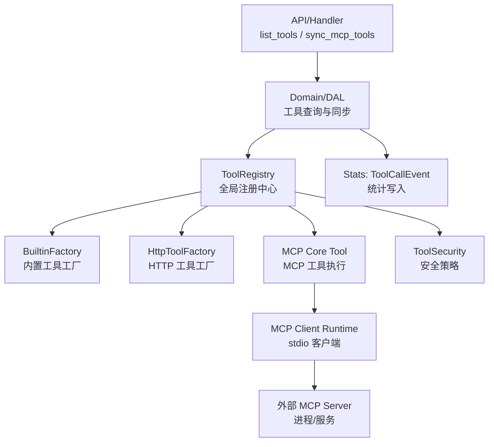
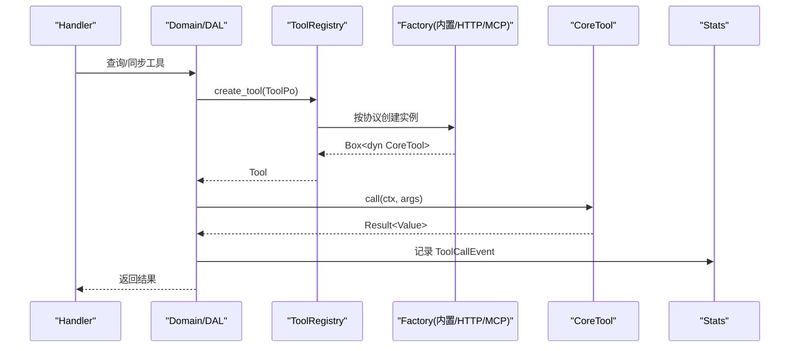
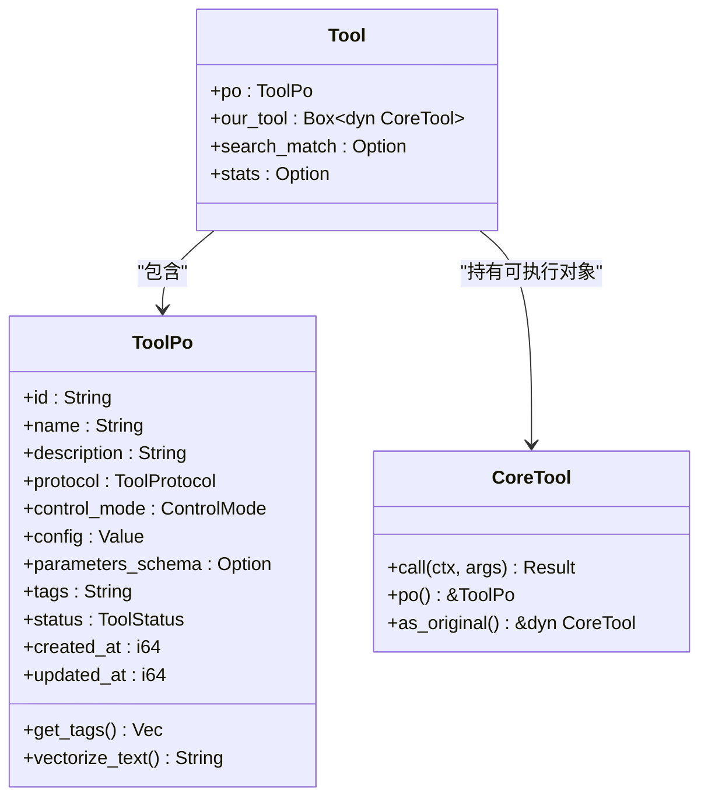
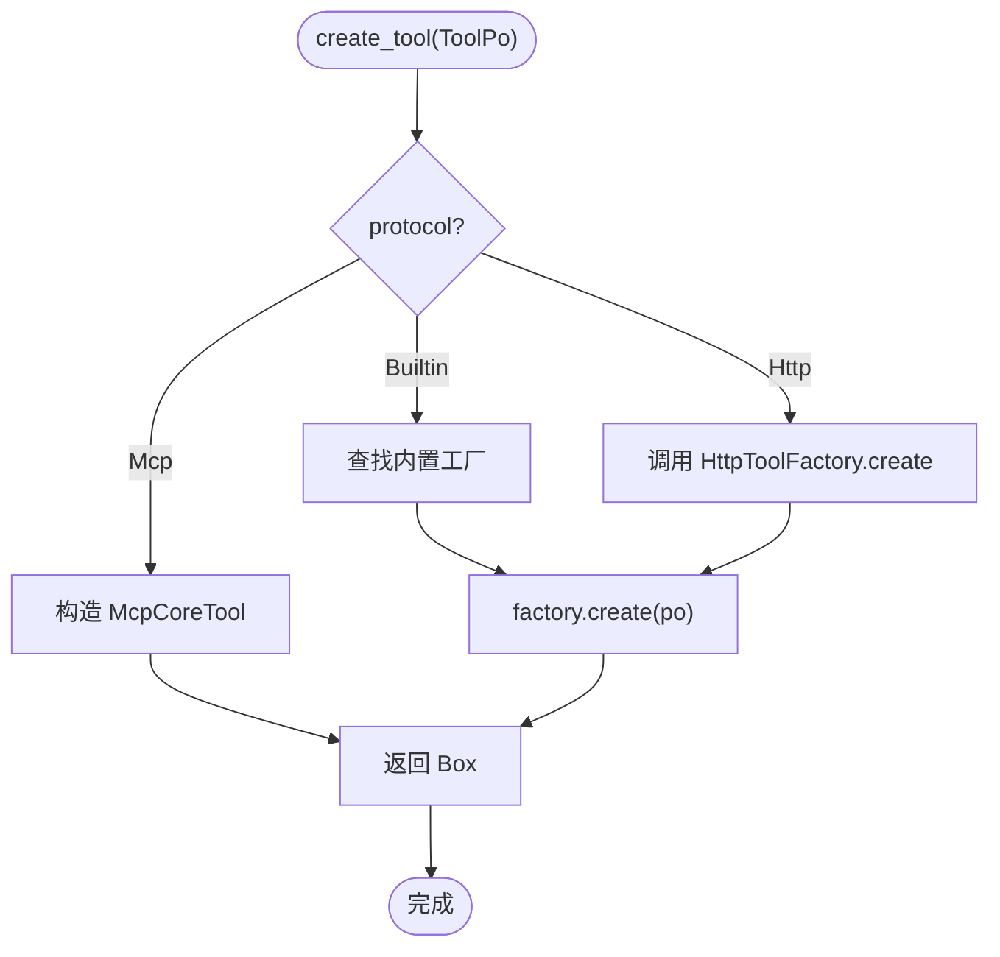
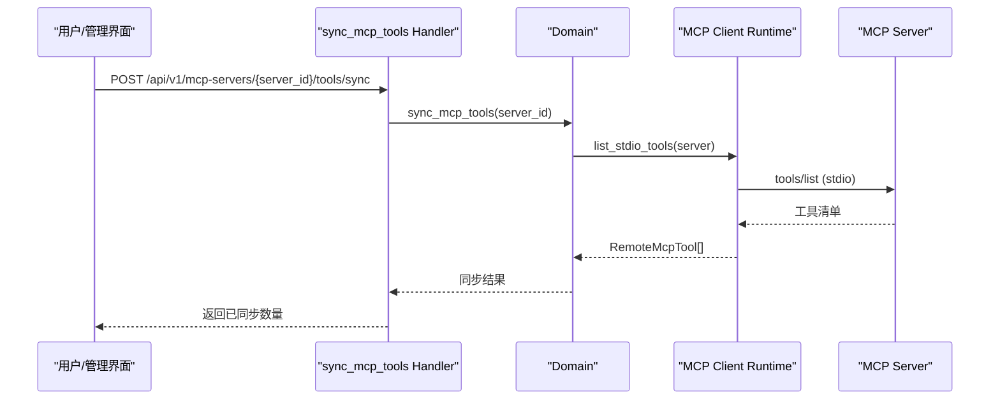
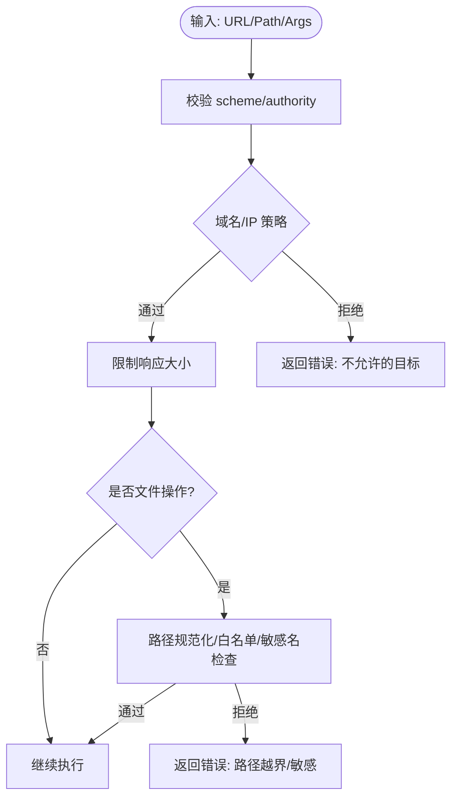
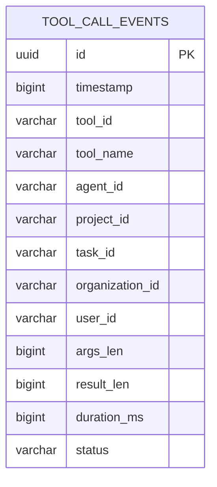
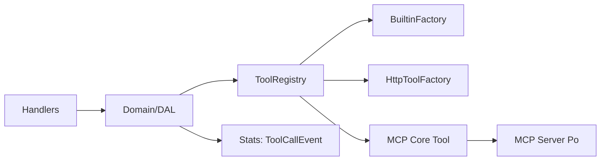

# 工具生态系统

<cite>
**本文引用的文件**
- [src/pkg/tool_registry/mod.rs](src/pkg/tool_registry/mod.rs)
- [src/models/tool.rs](src/models/tool.rs)
- [common/src/enums/tool.rs](common/src/enums/tool.rs)
- [src/pkg/tool_registry/builtin.rs](src/pkg/tool_registry/builtin.rs)
- [src/pkg/tool_registry/mcp.rs](src/pkg/tool_registry/mcp.rs)
- [src/pkg/tool_registry/tool_security.rs](src/pkg/tool_registry/tool_security.rs)
- [src/models/mcp_server.rs](src/models/mcp_server.rs)
- [src/handlers/finance/mcp_tool/sync_mcp_tools.rs](src/handlers/finance/mcp_tool/sync_mcp_tools.rs)
- [src/handlers/finance/tool/list_tools.rs](src/handlers/finance/tool/list_tools.rs)
- [src/pkg/stats/tool_call.rs](src/pkg/stats/tool_call.rs)
- 【① Design 决策】[docs/archive/design-archive/tool_design.md](docs/archive/design-archive/tool_design.md) — 工具系统三层调用架构 + 工具包 tag 免绑定三层校验 + register_handler_tool 宏
- 【① Design 决策】[docs/archive/design-archive/mcp_tool_design.md](docs/archive/design-archive/mcp_tool_design.md) — MCP Server 注册表 + descriptor 缓存 + run_mcp 调用桥
- 【② Plan 落地】[docs/archive/plan-archive/进程管理与shell_exec修复.md](docs/archive/plan-archive/进程管理与shell_exec修复.md) — shell_exec 命令黑白名单 + fs 路径安全双校验
- 【② Plan 落地】[docs/archive/plan-archive/前端工具与进程管理.md](docs/archive/plan-archive/前端工具与进程管理.md) — 前端工具管理 Builtin/HTTP/MCP 三 Tab 页面
- 【④ RAG 知识卡】[工具系统三层调用架构](docs/wiki/knowledge/zh/工具系统三层调用架构：CoreTool%20trait%20+%20Builtin%20HTTP%20MCP%20三协议路由%20+%20register_handler_tool%20宏%20+%20神经工具免绑定三层校验/工具系统三层调用架构：CoreTool%20trait%20+%20Builtin%20HTTP%20MCP%20三协议路由%20+%20register_handler_tool%20宏%20+%20神经工具免绑定三层校验.md) — §三层调用链 §tag 免绑定 §6 条红线 §三协议选择铁律
</cite>

## 目录
1. [简介](#简介)
2. [项目结构](#项目结构)
3. [核心组件](#核心组件)
4. [架构总览](#架构总览)
5. [详细组件分析](#详细组件分析)
6. [依赖关系分析](#依赖关系分析)
7. [性能与并发](#性能与并发)
8. [故障排查指南](#故障排查指南)
9. [结论](#结论)
10. [附录：配置与示例](#附录配置与示例)

## 简介
本文件系统性地梳理并文档化“工具生态系统”的注册、发现、执行与监控机制，覆盖内置工具、MCP 工具、自定义 HTTP 工具的集成方式；说明工具抽象接口、安全沙箱、参数校验、错误处理；给出 MCP 服务器配置、工具同步、调试要点；阐述标签分类、搜索、使用统计；并解释生命周期管理、版本控制、热更新以及执行引擎、并发控制与资源隔离等实现细节。

## 项目结构
围绕工具生态的关键代码分布在以下层次：
- 模型与枚举层：定义工具实体、协议类型、状态与控制模式。
- 工具注册中心：维护全局工厂映射，按协议分发创建可执行工具实例。
- 协议实现：内置工具（fs/http_fetch/shell_exec）、HTTP 工具、MCP 工具。
- 安全沙箱：统一的安全策略（SSRF、域名白黑名单、响应大小限制、路径沙箱）。
- 管理与 API：工具列表、MCP 工具同步等管理面能力。
- 统计与监控：工具调用事件采集与持久化。

图表来源
- [src/handlers/finance/tool/list_tools.rs:12-39](src/handlers/finance/tool/list_tools.rs#L12-L39)
- [src/handlers/finance/mcp_tool/sync_mcp_tools.rs:9-27](src/handlers/finance/mcp_tool/sync_mcp_tools.rs#L9-L27)
- [src/pkg/tool_registry/mod.rs:29-102](src/pkg/tool_registry/mod.rs#L29-L102)
- [src/pkg/tool_registry/mcp.rs:72-192](src/pkg/tool_registry/mcp.rs#L72-L192)
- [src/pkg/stats/tool_call.rs:12-41](src/pkg/stats/tool_call.rs#L12-L41)

章节来源
- [src/pkg/tool_registry/mod.rs:29-102](src/pkg/tool_registry/mod.rs#L29-L102)
- [src/handlers/finance/tool/list_tools.rs:12-39](src/handlers/finance/tool/list_tools.rs#L12-L39)
- [src/handlers/finance/mcp_tool/sync_mcp_tools.rs:9-27](src/handlers/finance/mcp_tool/sync_mcp_tools.rs#L9-L27)

## 核心组件
- 工具抽象接口与实体
  - CoreTool：统一的异步调用入口 call(ctx, args)，返回业务结果与 trace 引用；提供 po() 暴露元数据；支持装饰器通过 as_original 获取原始实现。
  - ToolPo：工具持久化对象，包含 id/name/description/protocol/config/parameters_schema/tags/status 等字段，并提供向量化文本用于搜索。
  - Tool：组合 PO 与可执行对象，可选携带搜索匹配信息与统计数据。
- 工具协议与状态
  - ToolProtocol：builtin/http/mcp。
  - ToolStatus：enabled/disabled/stale（stale 表示远端工具消失或改名，仅由同步流程恢复）。
  - ControlMode：auto/manual，区分由框架自动处理还是自建链路手动处理。
- 全局注册中心
  - ToolRegistry：维护 builtin_factories、mcp_factories、http_factory；根据 ToolPo.protocol 分派到对应工厂创建可执行工具；支持注册/注销/列举内置工具。
- 内置工具工厂
  - BuiltinToolFactory：为每个内置工具提供 create_po 与 create；系统启动时注册 http_fetch/fs_read/fs_write/shell_exec 等通用内置工具。
- MCP 工具
  - McpCoreTool：从 ToolPo + McpToolConfig 构建，运行时需注入 McpServerPo 与 McpClientRuntime；call 委托给 runtime.call_tool。
  - McpClientRuntime：封装 stdio 连接、tools/list、call_tool、超时控制、会话关闭与失效标记。
- 安全沙箱
  - tool_security：URL 校验（scheme/authority/白黑名单/本地网络限制）、DNS 解析后 IP 校验、响应体大小限制、敏感头脱敏；文件系统路径校验（基目录+额外允许目录、符号链接拒绝、敏感文件名拦截）。
- 统计与监控
  - ToolCallEvent：记录 tool_id/tool_name/agent/project/task/org/user、args/result 长度、耗时、状态；以独立表存储便于分析。

章节来源
- [src/models/tool.rs:16-106](src/models/tool.rs#L16-L106)
- [common/src/enums/tool.rs:9-118](common/src/enums/tool.rs#L9-L118)
- [src/pkg/tool_registry/mod.rs:29-132](src/pkg/tool_registry/mod.rs#L29-L132)
- [src/pkg/tool_registry/builtin.rs:13-43](src/pkg/tool_registry/builtin.rs#L13-L43)
- [src/pkg/tool_registry/mcp.rs:28-394](src/pkg/tool_registry/mcp.rs#L28-L394)
- [src/pkg/tool_registry/tool_security.rs:17-312](src/pkg/tool_registry/tool_security.rs#L17-L312)
- [src/pkg/stats/tool_call.rs:12-41](src/pkg/stats/tool_call.rs#L12-L41)

## 架构总览
工具生态采用“注册中心 + 多协议工厂 + 统一抽象”的分层设计：
- Handler/Domain 不关心具体协议，只持有 ToolPo 并通过 Registry.create_tool 获得可执行对象。
- 注册中心依据 protocol 路由到不同工厂：
  - Builtin：从预编译工厂创建。
  - Http：通过 HttpToolFactory 基于数据库配置创建。
  - Mcp：构造 McpCoreTool，并在 DAL 层注入服务端连接信息。
- 安全策略在工具执行前集中校验，避免越权访问与 SSRF。
- 统计埋点在调用前后收集，落库至 DuckDB 专用表。

图表来源
- [src/pkg/tool_registry/mod.rs:81-102](src/pkg/tool_registry/mod.rs#L81-L102)
- [src/pkg/tool_registry/mcp.rs:323-355](src/pkg/tool_registry/mcp.rs#L323-L355)
- [src/pkg/stats/tool_call.rs:12-41](src/pkg/stats/tool_call.rs#L12-L41)

## 详细组件分析

### 工具抽象与实体
- CoreTool 定义了统一的异步调用接口与元数据访问点，支持装饰器链式包装（如限流、鉴权、埋点）。
- ToolPo 承载工具元数据，支持 tags 用于能力匹配与筛选；vectorize_text 将 name/description/tags 拼接为检索文本。
- Tool 聚合 PO 与可执行对象，并可附加 search_match/stats 以便管理面展示。

图表来源
- [src/models/tool.rs:16-106](src/models/tool.rs#L16-L106)
- [src/models/tool.rs:285-313](src/models/tool.rs#L285-L313)

章节来源
- [src/models/tool.rs:16-106](src/models/tool.rs#L16-L106)
- [src/models/tool.rs:285-313](src/models/tool.rs#L285-L313)

### 工具注册中心与工厂
- ToolRegistry 维护三类工厂：
  - builtin_factories：HashMap<id, BuiltinToolFactory>，按 id 查找并创建实例。
  - mcp_factories：预留扩展位，当前通过 create_tool(po) 直接构造 McpCoreTool。
  - http_factory：协议级工厂，支持替换默认实现。
- 注册流程：
  - 启动时 register_all 注册通用内置工具（http_fetch/fs_read/fs_write/shell_exec）。
  - 运行时通过 create_tool(po) 根据 protocol 分派。

图表来源
- [src/pkg/tool_registry/mod.rs:81-102](src/pkg/tool_registry/mod.rs#L81-L102)
- [src/pkg/tool_registry/builtin.rs:27-43](src/pkg/tool_registry/builtin.rs#L27-L43)

章节来源
- [src/pkg/tool_registry/mod.rs:29-132](src/pkg/tool_registry/mod.rs#L29-L132)
- [src/pkg/tool_registry/builtin.rs:13-43](src/pkg/tool_registry/builtin.rs#L13-L43)

### MCP 工具：配置、同步与执行
- 配置分离：ToolPo.config 仅保存 server_id 与 tool_name；McpServerPo.config 保存命令/参数/环境变量/URL/Headers/超时/响应大小等连接配置。
- 执行流程：
  - 构造 McpCoreTool 时需注入 McpServerPo 与 McpClientRuntime。
  - call_tool 通过 stdio 子进程启动 MCP 服务，设置超时，调用 tools/list 或 call_tool，关闭会话并清理失效标记。
- 同步流程：
  - Handler 接收 server_id，调用 Domain 层同步远程工具到本地 Tool 记录。

图表来源
- [src/handlers/finance/mcp_tool/sync_mcp_tools.rs:9-27](src/handlers/finance/mcp_tool/sync_mcp_tools.rs#L9-L27)
- [src/pkg/tool_registry/mcp.rs:90-140](src/pkg/tool_registry/mcp.rs#L90-L140)

章节来源
- [src/models/mcp_server.rs:97-167](src/models/mcp_server.rs#L97-L167)
- [src/pkg/tool_registry/mcp.rs:72-192](src/pkg/tool_registry/mcp.rs#L72-L192)
- [src/handlers/finance/mcp_tool/sync_mcp_tools.rs:9-27](src/handlers/finance/mcp_tool/sync_mcp_tools.rs#L9-L27)

### 安全沙箱与参数验证
- URL 安全：
  - 强制 scheme 为 http/https，禁止模板占位符出现在 scheme 与 authority。
  - 支持 allow_local_network、allowed_domains、blocked_domains 策略；解析 DNS 后再次校验 IP 是否命中本地网段。
  - 限制响应体大小，读取时逐块累计并硬上限截断。
  - 响应头中识别敏感键并脱敏输出。
- 文件系统安全：
  - 拒绝敏感文件名（.env/.key/id_rsa/password 等）。
  - 规范化路径（解析 .. 与符号链接），确保最终路径落在 base_path 或额外允许目录内。
  - 拒绝符号链接访问。
- 参数校验：
  - MCP 工具 config 必须包含非空的 server_id 与 tool_name。
  - ToolPo.parameters_schema 可用于动态工具参数校验（由上层校验器使用）。

图表来源
- [src/pkg/tool_registry/tool_security.rs:92-170](src/pkg/tool_registry/tool_security.rs#L92-L170)
- [src/pkg/tool_registry/tool_security.rs:233-312](src/pkg/tool_registry/tool_security.rs#L233-L312)
- [src/pkg/tool_registry/tool_security.rs:314-487](src/pkg/tool_registry/tool_security.rs#L314-L487)

章节来源
- [src/pkg/tool_registry/tool_security.rs:92-170](src/pkg/tool_registry/tool_security.rs#L92-L170)
- [src/pkg/tool_registry/tool_security.rs:233-312](src/pkg/tool_registry/tool_security.rs#L233-L312)
- [src/pkg/tool_registry/tool_security.rs:314-487](src/pkg/tool_registry/tool_security.rs#L314-L487)

### 工具标签、搜索与使用统计
- 标签分类：ToolPo.tags 为 JSON 字符串数组，用于能力匹配与管理面筛选；可通过 vectorize_text 参与向量检索。
- 搜索：ToolPo/Tool 实现 Vectorizable，集合名为 "tools"，可将名称、描述、标签拼接为检索文本。
- 使用统计：ToolCallEvent 记录每次调用的上下文维度（tool/agent/project/task/org/user）与指标（args/result 长度、耗时、状态），写入 DuckDB 专用表 tool_call_events。

图表来源
- [src/pkg/stats/tool_call.rs:12-41](src/pkg/stats/tool_call.rs#L12-L41)
- [src/pkg/stats/tool_call.rs:130-155](src/pkg/stats/tool_call.rs#L130-L155)

章节来源
- [src/models/tool.rs:285-313](src/models/tool.rs#L285-L313)
- [src/pkg/stats/tool_call.rs:12-41](src/pkg/stats/tool_call.rs#L12-L41)
- [src/pkg/stats/tool_call.rs:130-155](src/pkg/stats/tool_call.rs#L130-L155)

### 生命周期管理、版本控制与热更新
- 生命周期：
  - 工具状态机：Enabled/Disabled/Stale；Stale 仅由同步流程恢复，管理面不可随意切换。
  - 可用目标状态由 available_statuses 决定，transition_status 负责原子更新与时间戳修正。
- 版本控制：
  - ToolPo.updated_at/updated_by 记录变更；MCP 工具通过重新同步刷新本地记录。
- 热更新：
  - 注册中心支持 unregister/clear_all；运行时通过新的 ToolPo 重建实例，无需重启服务。
  - MCP 客户端运行时对失败服务器进行失效标记，后续请求会尝试重建会话。

章节来源
- [src/models/tool.rs:163-202](src/models/tool.rs#L163-L202)
- [src/pkg/tool_registry/mod.rs:110-132](src/pkg/tool_registry/mod.rs#L110-L132)
- [src/pkg/tool_registry/mcp.rs:60-99](src/pkg/tool_registry/mcp.rs#L60-L99)

### 工具执行引擎、并发控制与资源隔离
- 执行引擎：
  - 统一通过 CoreTool::call 执行，内部按协议委派到具体实现（内置/HTTP/MCP）。
  - MCP 通过 stdio 子进程与外部服务通信，具备超时与连接超时保护。
- 并发控制：
  - 注册中心使用 Mutex 保护工厂映射；MCP 客户端运行时使用 Mutex 维护失效服务器集合。
  - 建议在上层（Agent/任务调度）对工具调用加并发限制与重试退避。
- 资源隔离：
  - MCP 子进程环境隔离：显式 env_clear 并仅注入必要环境变量。
  - 文件系统沙箱：严格路径白名单与敏感文件拦截。
  - HTTP 沙箱：域名白黑名单、禁止本地网络访问（除非显式允许）、响应大小限制。

章节来源
- [src/pkg/tool_registry/mod.rs:46-64](src/pkg/tool_registry/mod.rs#L46-L64)
- [src/pkg/tool_registry/mcp.rs:200-240](src/pkg/tool_registry/mcp.rs#L200-L240)
- [src/pkg/tool_registry/tool_security.rs:92-170](src/pkg/tool_registry/tool_security.rs#L92-L170)
- [src/pkg/tool_registry/tool_security.rs:314-487](src/pkg/tool_registry/tool_security.rs#L314-L487)

## 依赖关系分析
- 模块耦合：
  - Handler 依赖 Domain/DAL，DAL 依赖 DAO；工具相关逻辑集中在 pkg/tool_registry 与 models。
  - MCP 工具依赖 models/mcp_server 的连接配置；统计依赖 stats/tool_call。
- 外部依赖：
  - rmcp 用于 MCP stdio 客户端；reqwest 用于 HTTP 工具；DuckDB 用于统计存储。
- 潜在循环依赖：
  - 通过 trait 与工厂解耦，避免 DAO→DAO 互调；工具注册中心仅持有工厂引用，不反向依赖具体实现。

图表来源
- [src/handlers/finance/tool/list_tools.rs:12-39](src/handlers/finance/tool/list_tools.rs#L12-L39)
- [src/pkg/tool_registry/mod.rs:29-102](src/pkg/tool_registry/mod.rs#L29-L102)
- [src/models/mcp_server.rs:267-322](src/models/mcp_server.rs#L267-L322)
- [src/pkg/stats/tool_call.rs:12-41](src/pkg/stats/tool_call.rs#L12-L41)

章节来源
- [src/handlers/finance/tool/list_tools.rs:12-39](src/handlers/finance/tool/list_tools.rs#L12-L39)
- [src/pkg/tool_registry/mod.rs:29-102](src/pkg/tool_registry/mod.rs#L29-L102)
- [src/models/mcp_server.rs:267-322](src/models/mcp_server.rs#L267-L322)
- [src/pkg/stats/tool_call.rs:12-41](src/pkg/stats/tool_call.rs#L12-L41)

## 性能与并发
- 注册中心：
  - 工厂映射使用 Mutex 保护，读多写少场景下建议减少运行时注册频率，尽量在启动阶段完成注册。
- MCP 客户端：
  - 每次调用建立/关闭 stdio 会话，存在开销；可在 DAL 层引入会话池或长连接（未来扩展）以降低延迟。
  - 超时与连接超时防止阻塞；建议合理设置 timeout_ms/connect_timeout_ms。
- HTTP 工具：
  - 响应体大小限制避免内存膨胀；建议结合上游 Content-Length 快速拒绝大响应。
- 统计写入：
  - 使用 DuckDB 专用表，批量插入优化吞吐；在高并发场景可考虑异步队列缓冲。

[本节为通用指导，不直接分析具体文件]

## 故障排查指南
- MCP 工具无法执行：
  - 检查 ToolPo.config 中的 server_id 与 tool_name 是否为空。
  - 确认 McpServerPo.config 的 command/args/env/url/headers 正确，且 PATH 可解析命令。
  - 查看日志中是否出现 session close failed 或 timed out 提示。
- HTTP 工具被拒绝：
  - 确认 scheme 为 http/https，authority 不含模板占位符。
  - 若目标为本地网络地址，需显式允许 allow_local_network=true。
  - 检查 allowed_domains/blocked_domains 策略是否命中。
- 文件访问被拒绝：
  - 检查路径是否在 base_path 或额外允许目录内；是否存在符号链接；文件名是否命中敏感模式。
- 统计缺失：
  - 确认 ToolCallEvent 已正确构造并写入 tool_call_events 表；检查表结构与权限。

章节来源
- [src/pkg/tool_registry/mcp.rs:200-240](src/pkg/tool_registry/mcp.rs#L200-L240)
- [src/pkg/tool_registry/tool_security.rs:92-170](src/pkg/tool_registry/tool_security.rs#L92-L170)
- [src/pkg/tool_registry/tool_security.rs:314-487](src/pkg/tool_registry/tool_security.rs#L314-L487)
- [src/pkg/stats/tool_call.rs:130-155](src/pkg/stats/tool_call.rs#L130-L155)

## 结论
本工具生态系统通过统一的抽象接口与注册中心，实现了内置、HTTP、MCP 三类工具的无缝集成；借助严格的安全沙箱与参数校验保障执行安全；通过标签与向量化支持搜索与分类；以独立的统计表支撑使用度量。MCP 工具通过配置分离与运行时注入实现灵活扩展，配合状态机与同步流程完成生命周期管理。建议在工程实践中结合并发控制、超时与资源隔离策略，以获得稳定高效的工具执行体验。

## 附录：配置与示例
- MCP 服务器配置要点
  - transport=stdio：需提供 command/args/env；timeout_ms/connect_timeout_ms/response_max_bytes 合理设置。
  - transport=streamable_http：需提供 url/headers；当前运行时未实现，后续扩展。
  - 管理面展示需对敏感字段脱敏（env/headers/url）。
- 工具同步示例
  - 调用 POST /api/v1/mcp-servers/{server_id}/tools/sync，将远端工具清单同步到本地 Tool 记录。
- 工具列表与搜索
  - 调用 GET /api/v1/tools 获取分页列表；可使用 tags 与关键词进行过滤；向量检索基于 name/description/tags。
- 调试建议
  - 启用详细日志，关注 MCP 会话初始化与关闭过程。
  - 对 HTTP 工具开启响应头脱敏后的日志，便于定位认证问题。
  - 使用 ToolCallEvent 分析耗时与错误分布，定位瓶颈。

章节来源
- [src/models/mcp_server.rs:97-167](src/models/mcp_server.rs#L97-L167)
- [src/handlers/finance/mcp_tool/sync_mcp_tools.rs:9-27](src/handlers/finance/mcp_tool/sync_mcp_tools.rs#L9-L27)
- [src/handlers/finance/tool/list_tools.rs:12-39](src/handlers/finance/tool/list_tools.rs#L12-L39)
- [src/pkg/stats/tool_call.rs:12-41](src/pkg/stats/tool_call.rs#L12-L41)