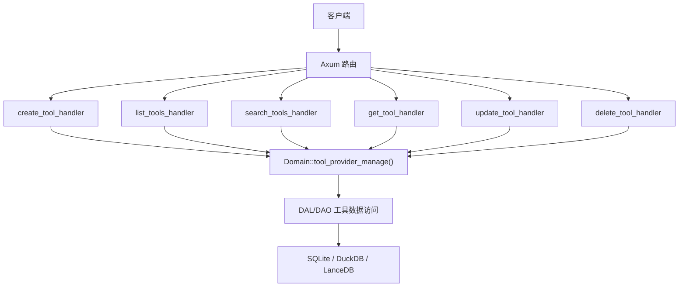
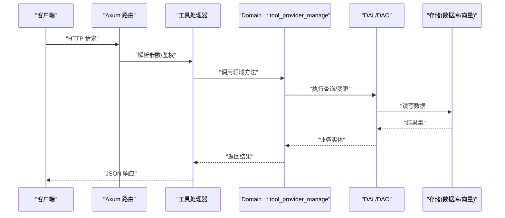
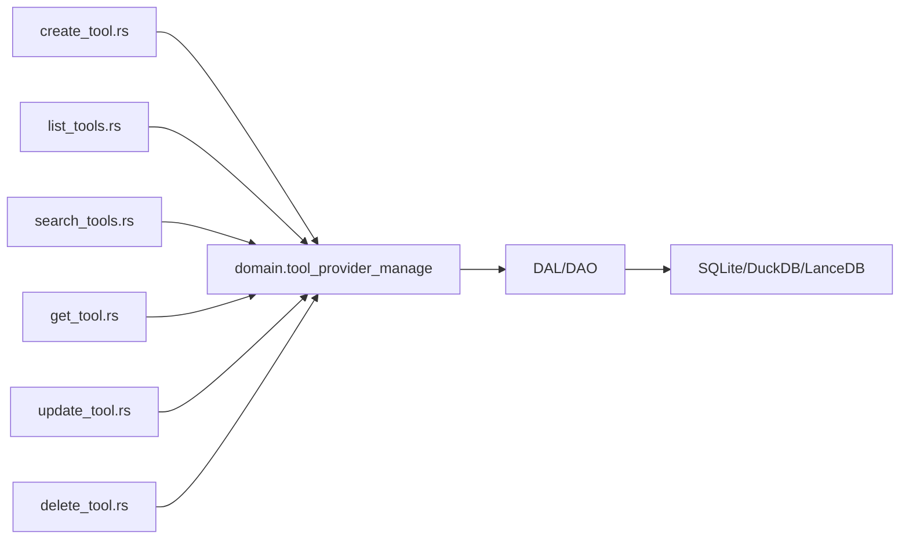

# 工具管理 API（业务功能层）

<cite>
**本文引用的文件**
- [common/src/api/tool.rs](common/src/api/tool.rs)
- [common/src/enums/tool.rs](common/src/enums/tool.rs)
- [src/handlers/finance/tool/mod.rs](src/handlers/finance/tool/mod.rs)
- [src/handlers/finance/tool/create_tool.rs](src/handlers/finance/tool/create_tool.rs)
- [src/handlers/finance/tool/list_tools.rs](src/handlers/finance/tool/list_tools.rs)
- [src/handlers/finance/tool/search_tools.rs](src/handlers/finance/tool/search_tools.rs)
- [src/handlers/finance/tool/update_tool.rs](src/handlers/finance/tool/update_tool.rs)
- [src/handlers/finance/tool/delete_tool.rs](src/handlers/finance/tool/delete_tool.rs)
- [src/handlers/finance/tool/get_tool.rs](src/handlers/finance/tool/get_tool.rs)
- [common/src/models/tool.rs](common/src/models/tool.rs)
</cite>

## 目录
1. [简介](#简介)
2. [项目结构](#项目结构)
3. [核心组件](#核心组件)
4. [架构总览](#架构总览)
5. [详细组件分析](#详细组件分析)
6. [依赖关系分析](#依赖关系分析)
7. [性能与扩展性](#性能与扩展性)
8. [故障排查指南](#故障排查指南)
9. [结论](#结论)
10. [附录：API 规范与示例](#附录api-规范与示例)

## 简介
本文件为"工具管理"模块的 RESTful API 文档，覆盖工具的创建、查询、更新、删除、搜索、标签聚合、调试调用、调用追踪等能力。接口遵循 Axum 路由约定，统一通过 RequestContext 传递用户上下文，领域逻辑由 Domain 层实现，数据访问由 DAL/DAO 完成。枚举 ToolProtocol、ToolStatus、ControlMode 定义工具协议、状态与控制模式。

> 📌 视角说明（AGENTS §2.1.3 Level 3 互补视角平行卡）：
> 本长文是「工具管理 API」主题的 **业务功能层** 视角。同主题还有以下平行视角卡，请按需交叉阅读：
> - [工具管理 API（API 参考层）](docs/wiki/zh/content/API 参考/RESTful API/财务管理模块 API/工具管理 API.md)

## 项目结构
工具管理相关代码采用四层单向调用：Adapter（HTTP Handler）→ Domain → DAL → DAO。Handler 仅负责参数校验与响应转换；Domain 封装业务规则；DAL/DAO 负责持久化。公共请求/响应 DTO 集中在 common/src/api/tool.rs，枚举在 common/src/enums/tool.rs。

图表来源
- [src/handlers/finance/tool/mod.rs:1-46](src/handlers/finance/tool/mod.rs#L1-L46)
- [src/handlers/finance/tool/create_tool.rs:1-72](src/handlers/finance/tool/create_tool.rs#L1-L72)
- [src/handlers/finance/tool/list_tools.rs:1-40](src/handlers/finance/tool/list_tools.rs#L1-L40)
- [src/handlers/finance/tool/search_tools.rs:1-53](src/handlers/finance/tool/search_tools.rs#L1-L53)
- [src/handlers/finance/tool/get_tool.rs:1-47](src/handlers/finance/tool/get_tool.rs#L1-L47)
- [src/handlers/finance/tool/update_tool.rs:1-83](src/handlers/finance/tool/update_tool.rs#L1-L83)
- [src/handlers/finance/tool/delete_tool.rs:1-35](src/handlers/finance/tool/delete_tool.rs#L1-L35)

章节来源
- [src/handlers/finance/tool/mod.rs:1-46](src/handlers/finance/tool/mod.rs#L1-L46)

## 核心组件
- 请求/响应 DTO：CreateToolRequest、GetToolRequest、ListToolsRequest、SearchToolsRequest、UpdateToolRequest、DeleteToolRequest、DebugCallToolRequest、ToolQueryRequest、Tag 列表请求/响应、调用追踪查询请求/响应等，均定义于 common/src/api/tool.rs。
- 枚举类型：ToolProtocol（builtin/http/mcp）、ToolStatus（disabled/enabled/stale）、ControlMode（auto/manual），定义于 common/src/enums/tool.rs。
- HTTP 处理器：每个方法独立文件，注册到路由并通过 generate_http_handler 暴露为 REST 接口。
- 领域服务：通过 domain().tool_provider_manage() 提供工具管理能力（创建、查询、搜索、更新、删除、绑定/解绑 Agent、统计等）。

章节来源
- [common/src/api/tool.rs:1-430](common/src/api/tool.rs#L1-L430)
- [common/src/enums/tool.rs:1-162](common/src/enums/tool.rs#L1-L162)
- [src/handlers/finance/tool/mod.rs:1-46](src/handlers/finance/tool/mod.rs#L1-L46)

## 架构总览
工具管理 API 的请求处理流程如下：

图表来源
- [src/handlers/finance/tool/create_tool.rs:1-72](src/handlers/finance/tool/create_tool.rs#L1-L72)
- [src/handlers/finance/tool/list_tools.rs:1-40](src/handlers/finance/tool/list_tools.rs#L1-L40)
- [src/handlers/finance/tool/search_tools.rs:1-53](src/handlers/finance/tool/search_tools.rs#L1-L53)
- [src/handlers/finance/tool/get_tool.rs:1-47](src/handlers/finance/tool/get_tool.rs#L1-L47)
- [src/handlers/finance/tool/update_tool.rs:1-83](src/handlers/finance/tool/update_tool.rs#L1-L83)
- [src/handlers/finance/tool/delete_tool.rs:1-35](src/handlers/finance/tool/delete_tool.rs#L1-L35)

## 详细组件分析

### 工具 CRUD 接口
- 创建工具
  - 路径与方法：POST /api/v1/tools
  - 请求体：CreateToolRequest（name、description、protocol、config、parameters_schema、tags、control_mode、enabled）
  - 响应：CreateToolResponse（id、name、description、tool_type、created_at）
  - 说明：内置工具不允许通过该接口创建；需具备用户上下文。
  - 章节来源
    - [src/handlers/finance/tool/create_tool.rs:1-72](src/handlers/finance/tool/create_tool.rs#L1-L72)
    - [common/src/api/tool.rs:9-43](common/src/api/tool.rs#L9-L43)

- 获取工具详情
  - 路径与方法：GET /api/v1/tools/{id}
  - 查询参数：with_stats、stats_time_start、stats_time_end、stats_interval（hourly/daily）
  - 响应：GetToolResponse（包含协议、控制模式、配置、参数 Schema、标签、启用状态、状态、创建/更新时间、可选统计）
  - 章节来源
    - [src/handlers/finance/tool/get_tool.rs:1-47](src/handlers/finance/tool/get_tool.rs#L1-L47)
    - [common/src/api/tool.rs:45-103](common/src/api/tool.rs#L45-L103)

- 列出工具
  - 路径与方法：GET /api/v1/tools
  - 查询参数：分页（limit、offset）
  - 响应：PagedResult<ToolListItem>
  - 说明：语法糖，内部固定按 created_at 降序。
  - 章节来源
    - [src/handlers/finance/tool/list_tools.rs:1-40](src/handlers/finance/tool/list_tools.rs#L1-L40)
    - [common/src/api/tool.rs:143-157](common/src/api/tool.rs#L143-L157)

- 搜索工具
  - 路径与方法：POST /api/v1/tools/search
  - 请求体：SearchToolsRequest（keyword、ids、agent_id、tags、protocol、status、mcp_server_id、enabled_only、分页）
  - 响应：PagedResult<ToolListItem>
  - 说明：支持 FTS5 + 向量语义混合搜索，默认排除 Stale 状态。
  - 章节来源
    - [src/handlers/finance/tool/search_tools.rs:1-53](src/handlers/finance/tool/search_tools.rs#L1-L53)
    - [common/src/api/tool.rs:183-208](common/src/api/tool.rs#L183-L208)

- 更新工具
  - 路径与方法：PUT /api/v1/tools/{id}
  - 请求体：UpdateToolRequest（name、description、protocol、control_mode、config、parameters_schema、tags、enabled）
  - 响应：GetToolResponse
  - 说明：内置工具不可修改；非内置工具不可改为内置协议；enabled 会触发状态转换。
  - 章节来源
    - [src/handlers/finance/tool/update_tool.rs:1-83](src/handlers/finance/tool/update_tool.rs#L1-L83)
    - [common/src/api/tool.rs:244-270](common/src/api/tool.rs#L244-L270)

- 删除工具
  - 路径与方法：DELETE /api/v1/tools/{id}
  - 响应：DeleteToolResponse（success）
  - 说明：软删除。
  - 章节来源
    - [src/handlers/finance/tool/delete_tool.rs:1-35](src/handlers/finance/tool/delete_tool.rs#L1-L35)
    - [common/src/api/tool.rs:105-118](common/src/api/tool.rs#L105-L118)

### 工具状态管理与控制模式
- 状态枚举：Disabled、Enabled、Stale（远端同步异常）
- 控制模式：Auto（原生自动调用）、Manual（自定义流水线）
- 章节来源
  - [common/src/enums/tool.rs:58-105](common/src/enums/tool.rs#L58-L105)
  - [common/src/enums/tool.rs:107-127](common/src/enums/tool.rs#L107-L127)

### 工具查询与批量操作
- 通用查询：ToolQueryRequest（ids、keyword、agent_id、tags、protocol、status、mcp_server_id、enabled_only、分页）
- 批量查询：通过 ids 字段进行批量过滤
- 章节来源
  - [common/src/api/tool.rs:159-181](common/src/api/tool.rs#L159-L181)

### 工具标签管理与分类查询
- 标签聚合：ListToolTagsRequest/ListToolTagsResponse（返回启用工具的不重复标签集合）
- 分类查询：通过 tags、protocol、status、enabled_only 等条件组合筛选
- 章节来源
  - [common/src/api/tool.rs:387-396](common/src/api/tool.rs#L387-L396)
  - [common/src/api/tool.rs:183-208](common/src/api/tool.rs#L183-L208)

### 工具调试调用与调用追踪
- 调试调用：DebugCallToolRequest（id、args），返回 success、result、tool_call_id、status
- 调用追踪查询：QueryToolCallEntriesRequest（call_id、agent_id、project_id、task_id、tool_id、status、时间范围、limit），返回 ToolCallEntryDetail 列表
- 单条追踪：GetToolCallEntryRequest（call_id、可选 tool_id/agent_id/project_id/task_id 限定范围）
- 章节来源
  - [common/src/api/tool.rs:120-141](common/src/api/tool.rs#L120-L141)
  - [common/src/api/tool.rs:321-385](common/src/api/tool.rs#L321-L385)
  - [common/src/models/tool.rs:1-22](common/src/models/tool.rs#L1-L22)

### 工具与 Agent 绑定/解绑
- 绑定：BindToolToAgentRequest（agent_id、tool_id），返回 success
- 解绑：UnbindToolFromAgentRequest（agent_id、tool_id），返回 success
- 章节来源
  - [common/src/api/tool.rs:285-319](common/src/api/tool.rs#L285-L319)

### 版本控制与依赖关系
- 版本控制：当前接口未暴露显式版本字段；可通过 protocol/config/parameters_schema 表达不同实现或参数契约。若需强版本，可在 config 中引入 version 字段并在 Domain 层校验。
- 依赖关系：工具可关联 MCP 服务器（mcp_server_id），用于远程工具发现与同步；状态 Stale 表示远端工具已消失或改名但本地记录保留。
- 章节来源
  - [common/src/enums/tool.rs:9-56](common/src/enums/tool.rs#L9-L56)
  - [common/src/api/tool.rs:183-208](common/src/api/tool.rs#L183-L208)

### 导入导出、模板管理、批量部署
- 导入导出：当前仓库未提供专用导入导出接口；可通过批量创建/更新接口组合实现。
- 模板管理：可通过 parameters_schema 与 config 描述工具模板；建议在 Domain 层增加模板校验与复用机制。
- 批量部署：可通过批量更新 enabled/status 实现批量启停；建议结合任务队列异步执行。
- 章节来源
  - [common/src/api/tool.rs:244-270](common/src/api/tool.rs#L244-L270)
  - [common/src/api/tool.rs:183-208](common/src/api/tool.rs#L183-L208)

## 依赖关系分析
- 处理器依赖 Domain 的工具提供者管理接口；Domain 再委托 DAL/DAO 进行数据访问。
- 公共 DTO 与枚举被多个处理器共享，保证前后端一致。
- 搜索能力依赖 FTS5 与向量检索后端（LanceDB/HNSW/InMemory/SqliteVss）。

图表来源
- [src/handlers/finance/tool/create_tool.rs:1-72](src/handlers/finance/tool/create_tool.rs#L1-L72)
- [src/handlers/finance/tool/list_tools.rs:1-40](src/handlers/finance/tool/list_tools.rs#L1-L40)
- [src/handlers/finance/tool/search_tools.rs:1-53](src/handlers/finance/tool/search_tools.rs#L1-L53)
- [src/handlers/finance/tool/get_tool.rs:1-47](src/handlers/finance/tool/get_tool.rs#L1-L47)
- [src/handlers/finance/tool/update_tool.rs:1-83](src/handlers/finance/tool/update_tool.rs#L1-L83)
- [src/handlers/finance/tool/delete_tool.rs:1-35](src/handlers/finance/tool/delete_tool.rs#L1-L35)

章节来源
- [src/handlers/finance/tool/mod.rs:1-46](src/handlers/finance/tool/mod.rs#L1-L46)

## 性能与扩展性
- 搜索优化：search 接口使用 FTS5 + 向量语义混合检索，适合关键词与语义相关性场景；query 接口侧重条件过滤。
- 分页：所有列表/搜索接口支持 limit/offset 分页，避免一次性加载大量数据。
- 统计：get 接口支持按需加载统计信息（调用次数、失败次数）并可指定时间范围与粒度（hourly/daily）。
- 扩展点：Domain 层可扩展模板校验、批量任务、异步导入导出、缓存策略等。

[本节为通用指导，不直接分析具体文件]

## 故障排查指南
- 缺少用户上下文：创建/更新等操作要求 ctx.uid() 非空，否则返回 InvalidRequest。
- 内置工具限制：内置工具不允许通过管理接口创建或修改协议类型。
- 工具不存在：获取/更新/删除时若未找到对应工具，将返回 NotFound。
- 状态转换错误：更新 enabled 时会进行状态转换，非法转换将抛出 InvalidRequest。
- 搜索排除项：search 默认排除 Stale 状态，如需包含请调整 Domain 查询。

章节来源
- [src/handlers/finance/tool/create_tool.rs:21-35](src/handlers/finance/tool/create_tool.rs#L21-L35)
- [src/handlers/finance/tool/update_tool.rs:22-42](src/handlers/finance/tool/update_tool.rs#L22-L42)
- [src/handlers/finance/tool/get_tool.rs:22-43](src/handlers/finance/tool/get_tool.rs#L22-L43)
- [src/handlers/finance/tool/delete_tool.rs:22-31](src/handlers/finance/tool/delete_tool.rs#L22-L31)

## 结论
工具管理 API 提供了完整的 CRUD、搜索、标签聚合、调试调用与调用追踪能力，遵循清晰的四层架构与统一的 DTO/枚举设计。通过 Domain 层的扩展点，可进一步实现版本控制、模板管理、批量导入导出与部署等功能。建议在生产环境结合限流、审计日志与监控指标提升稳定性与可观测性。

[本节为总结性内容，不直接分析具体文件]

## 附录：API 规范与示例

### 认证与授权
- 认证方式：通过 RequestContext 中的 uid 标识当前用户；缺失时将拒绝创建/更新等操作。
- 授权范围：部分接口支持 agent_id/project_id/task_id 作为访问范围限定（如调用追踪查询）。

章节来源
- [src/handlers/finance/tool/create_tool.rs:21-35](src/handlers/finance/tool/create_tool.rs#L21-L35)
- [common/src/api/tool.rs:368-382](common/src/api/tool.rs#L368-L382)

### 错误码与响应格式
- 常见错误：InvalidRequest（参数/权限问题）、NotFound（资源不存在）
- 响应格式：统一 JSON，列表/搜索返回 PagedResult<T>，详情返回具体 DTO

章节来源
- [src/handlers/finance/tool/update_tool.rs:22-42](src/handlers/finance/tool/update_tool.rs#L22-L42)
- [src/handlers/finance/tool/get_tool.rs:22-43](src/handlers/finance/tool/get_tool.rs#L22-L43)

### 限流策略
- 建议对 search、list、debug call 等高频接口实施限流；可在路由层或中间件层实现。
- 针对批量操作建议使用异步任务队列，避免阻塞请求。

[本节为通用指导，不直接分析具体文件]

### API 调用示例（路径与参数）
- 创建工具
  - POST /api/v1/tools
  - 请求体：{ name, description, protocol, config, parameters_schema, tags, control_mode, enabled }
  - 参考：CreateToolRequest
  - 章节来源
    - [common/src/api/tool.rs:9-43](common/src/api/tool.rs#L9-L43)

- 获取工具详情
  - GET /api/v1/tools/{id}?with_stats=true&stats_interval=hourly
  - 参考：GetToolRequest
  - 章节来源
    - [common/src/api/tool.rs:45-63](common/src/api/tool.rs#L45-L63)

- 列出工具
  - GET /api/v1/tools?limit=20&offset=0
  - 参考：ListToolsRequest
  - 章节来源
    - [common/src/api/tool.rs:143-150](common/src/api/tool.rs#L143-L150)

- 搜索工具
  - POST /api/v1/tools/search
  - 请求体：{ keyword, ids, agent_id, tags, protocol, status, mcp_server_id, enabled_only, pagination }
  - 参考：SearchToolsRequest
  - 章节来源
    - [common/src/api/tool.rs:183-205](common/src/api/tool.rs#L183-L205)

- 更新工具
  - PUT /api/v1/tools/{id}
  - 请求体：{ name, description, protocol, control_mode, config, parameters_schema, tags, enabled }
  - 参考：UpdateToolRequest
  - 章节来源
    - [common/src/api/tool.rs:244-267](common/src/api/tool.rs#L244-L267)

- 删除工具
  - DELETE /api/v1/tools/{id}
  - 参考：DeleteToolRequest
  - 章节来源
    - [common/src/api/tool.rs:105-111](common/src/api/tool.rs#L105-L111)

- 调试调用工具
  - POST /api/v1/tools/{id}/debug-call
  - 请求体：{ args }
  - 参考：DebugCallToolRequest
  - 章节来源
    - [common/src/api/tool.rs:120-128](common/src/api/tool.rs#L120-L128)

- 查询调用追踪
  - GET /api/v1/tools/calls?call_id=&agent_id=&project_id=&task_id=&tool_id=&status=&started_after=&started_before=&limit=10
  - 参考：QueryToolCallEntriesRequest
  - 章节来源
    - [common/src/api/tool.rs:332-363](common/src/api/tool.rs#L332-L363)

- 获取单条调用追踪
  - GET /api/v1/tools/calls/{call_id}?tool_id=&agent_id=&project_id=&task_id=
  - 参考：GetToolCallEntryRequest
  - 章节来源
    - [common/src/api/tool.rs:368-382](common/src/api/tool.rs#L368-L382)

### 集成指南
- 前端集成：使用 Axios/Fetch 调用上述接口；注意携带认证头与分页参数。
- 后端集成：通过 Domain 层方法直接调用，避免跨层耦合；使用 RequestContext 传递用户上下文。
- 测试建议：使用 tests/integration/ 下的集成测试框架验证接口行为与边界条件。

[本节为通用指导，不直接分析具体文件]