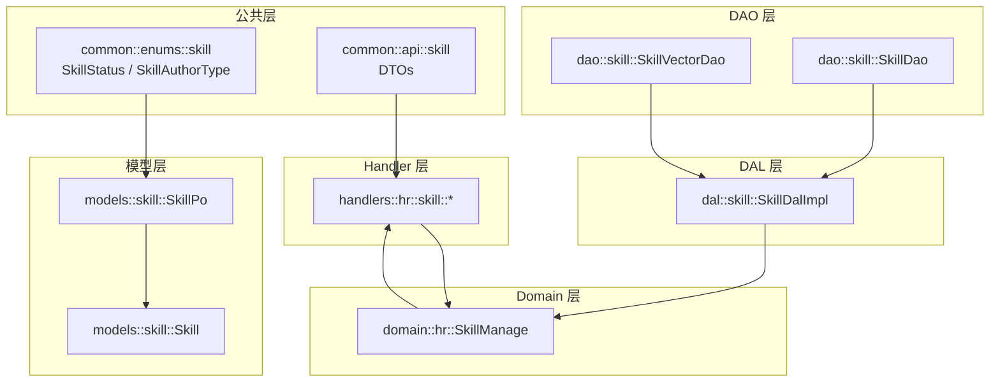
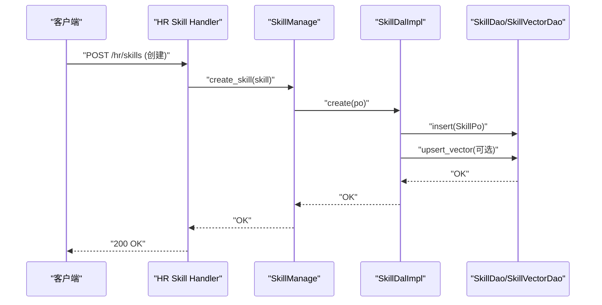
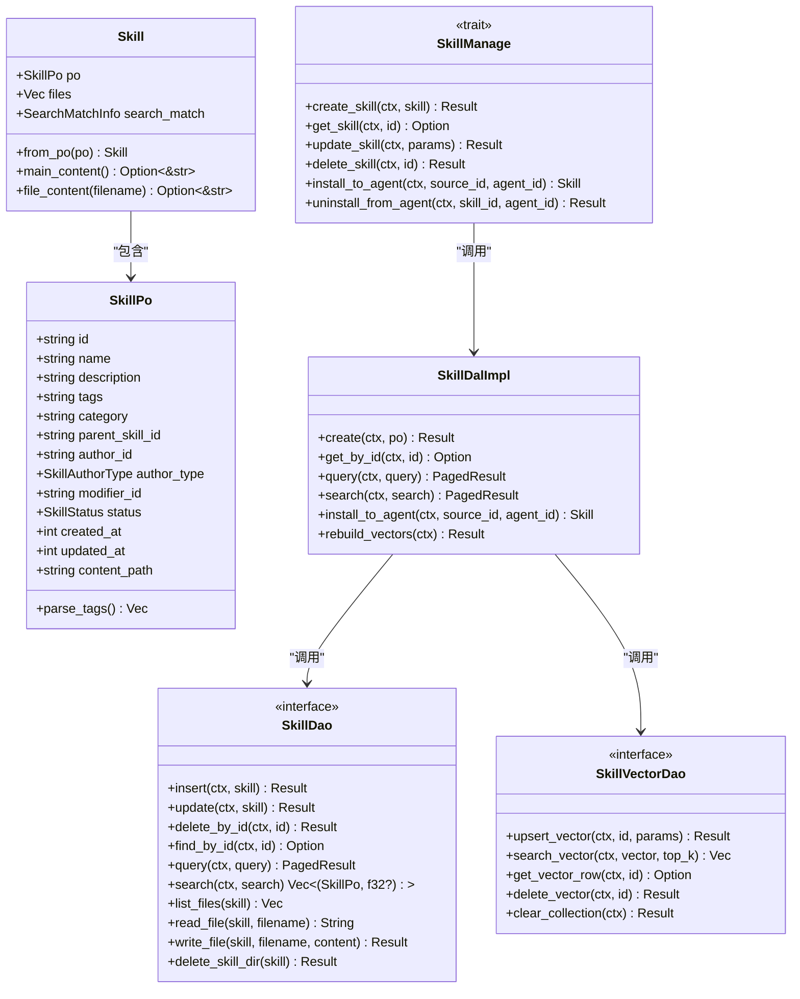
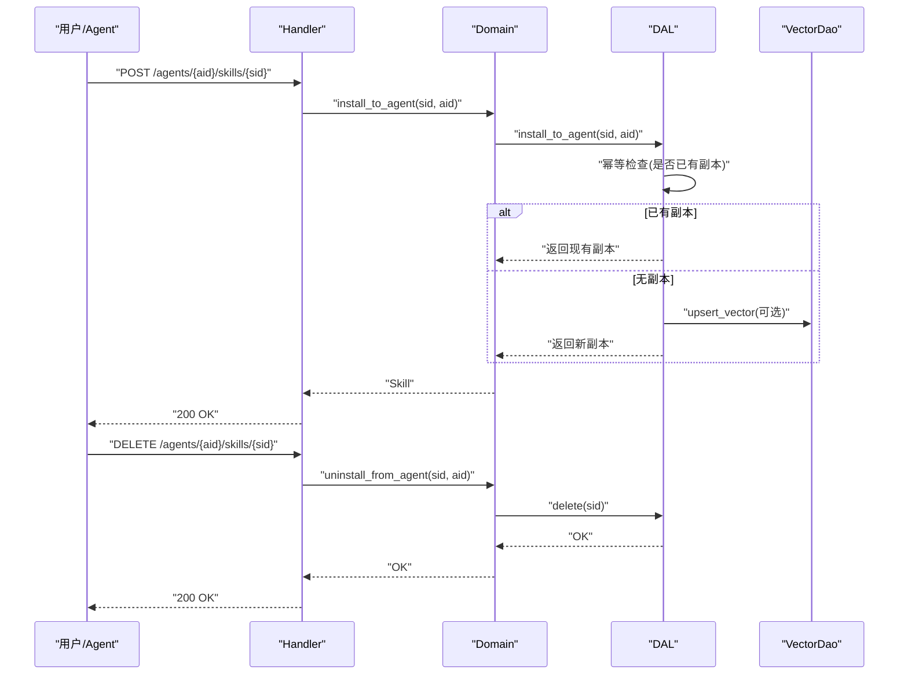
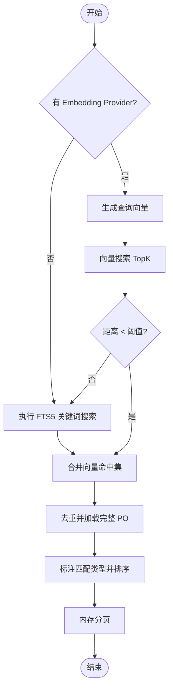
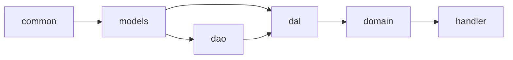
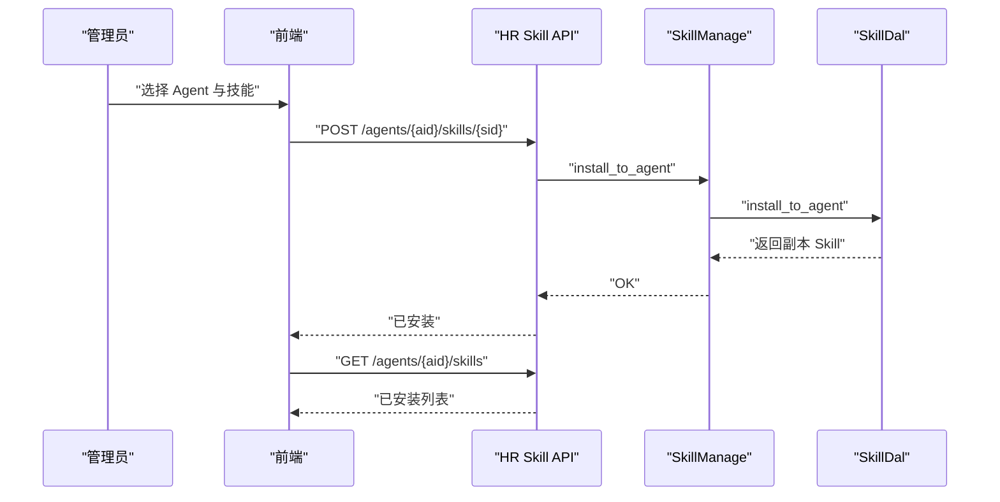

# 技能系统

<cite>
**本文引用的文件**
- [docs/skill_design.md](docs/skill_design.md)
- [common/src/api/skill.rs](common/src/api/skill.rs)
- [common/src/enums/skill.rs](common/src/enums/skill.rs)
- [src/models/skill.rs](src/models/skill.rs)
- [src/service/dao/skill/mod.rs](src/service/dao/skill/mod.rs)
- [src/service/dal/skill.rs](src/service/dal/skill.rs)
- [src/service/domain/hr/skill.rs](src/service/domain/hr/skill.rs)
- [src/handlers/hr/skill/list_skill_tags.rs](src/handlers/hr/skill/list_skill_tags.rs)
- [src/handlers/hr/skill/install_skill_to_agent.rs](src/handlers/hr/skill/install_skill_to_agent.rs)
- [src/handlers/hr/skill/uninstall_skill_from_agent.rs](src/handlers/hr/skill/uninstall_skill_from_agent.rs)
- [src/handlers/hr/skill/update_skill_file_content.rs](src/handlers/hr/skill/update_skill_file_content.rs)
- （2026-09-04 清理：superpowers 目录已归档，待 doc-maintainer 跟进）

**本文关联三类文档（四类互引闭环）**
- 【① Design 决策快照】
  - [skill_design.md](docs/archive/design-archive/skill_design.md) — skills 表设计 + 文件相对路径管理 + 三状态机（待沉淀/可用/过期）软删除
  - [skill_system_enhancement_design.md](docs/archive/design-archive/skill_system_enhancement_design.md) — tag 过滤 + 技能包唤醒注入机制
- 【② Plan 落地快照】
  - [预置基础技能导入重构.md](docs/archive/plan-archive/预置基础技能导入重构.md) — 5 套 TEMPLATE_* 目录 + default.json 编译期嵌入 include_str!
- 【④ RAG 原子知识卡】
  - [技能系统 Seed 预置导入与 Agent 入职绑定：5 套 TEMPLATE_* 编译期嵌入 + install_skill_pack 幂等 Tag 分发 + Prompt Token 熔断](docs/wiki/knowledge/zh/技能系统%20Seed%20预置导入与%20Agent%20入职绑定：5%20套%20TEMPLATE_*%20编译期嵌入%20+%20install_skill_pack%20幂等%20Tag%20分发%20+%20Prompt%20Token%20熔断/技能系统%20Seed%20预置导入与%20Agent%20入职绑定：5%20套%20TEMPLATE_*%20编译期嵌入%20+%20install_skill_pack%20幂等%20Tag%20分发%20+%20Prompt%20Token%20熔断.md) — 5 套模板（工具/记忆/项目/沟通/技能自管理）+ Draft 副本 id 重命名防 UNIQUE + content_path 防路径穿越 6 条红线
- 【③ Wiki 关联长文】
  - [技能包管理.md](docs/wiki/zh/content/功能模块/AI%20Agent%20管理/技能包管理.md) — Tag 筛选 + 批量安装 + 安装历史面板 UI
  - [技能与工具绑定.md](docs/wiki/zh/content/项目概述/核心功能特性/Agent%20全生命周期管理/技能与工具绑定.md) — 入职流程五部曲
  - [系统初始化.md](docs/wiki/zh/content/功能模块/用户与组织管理/系统初始化.md) — init_base_data 内置 import_default_skills_if_empty()
- [Skill 系统增强：5 套 TEMPLATE 预置包 + install_skill_pack 幂等 Tag 分发 + Agent 入职绑定 + Prompt Token 熔断](docs/wiki/knowledge/zh/Skill 系统增强：5 套 TEMPLATE 预置包 + install_skill_pack 幂等 Tag 分发 + Agent 入职绑定 + Prompt Token 熔断/Skill 系统增强：5 套 TEMPLATE 预置包 + install_skill_pack 幂等 Tag 分发 + Agent 入职绑定 + Prompt Token 熔断.md)

## 2026-09-01 增量变更
- [src/handlers/hr/agent/sync_packs.rs#L1-L25](src/handlers/hr/agent/sync_packs.rs#L1-L25) — 新 Agent 入职时包同步唯一入口（替换 5 次 install_skill_pack）
- [src/service/domain/hr/agent.rs#L94-L133](src/service/domain/hr/agent.rs#L94-L133) — create_agent 拆 2 步调 sync_agent_packs
- [src/service/domain/hr/agent.rs#L135-L290](src/service/domain/hr/agent.rs#L135-L290) — sync_agent_packs domain 两阶段实现（按 tag 批量 find + 汇总去重 + 批量 create/update）
- [src/service/domain/hr/skill.rs#L203-L228](src/service/domain/hr/skill.rs#L203-L228) — restore_skill Expired→Draft + 非 Expired 状态 Conflict 409 边界
- [src/handlers/hr/skill/list_expired_agent_skills.rs](src/handlers/hr/skill/list_expired_agent_skills.rs) — 新增 Expired 独立区 handler（list_for_agent 保持 exclude Expired 语义不变）
- [src/handlers/hr/skill/restore_skill.rs](src/handlers/hr/skill/restore_skill.rs) — 新增恢复 handler
- [common/src/api/agent.rs](common/src/api/agent.rs) / [common/src/api/skill.rs](common/src/api/skill.rs) — 新增 Expired 状态字段 + install 副本 version 字段

**本文关联的 RAG 知识卡**：
- [Skill 系统增强：5 套 TEMPLATE 预置包 + install_skill_pack 幂等 Tag 分发 + Agent 入职绑定 + Prompt Token 熔断](docs/wiki/knowledge/zh/Skill 系统增强：5 套 TEMPLATE 预置包 + install_skill_pack 幂等 Tag 分发 + Agent 入职绑定 + Prompt Token 熔断/Skill 系统增强：5 套 TEMPLATE 预置包 + install_skill_pack 幂等 Tag 分发 + Agent 入职绑定 + Prompt Token 熔断.md)
- [Agent 关联全景与工具技能分组装配：三分组互斥去重 + 专业领域打包复用 + 按需装配](docs/wiki/knowledge/zh/Agent 关联全景与工具技能分组装配：三分组互斥去重 + 专业领域打包复用 + 按需装配/Agent 关联全景与工具技能分组装配：三分组互斥去重 + 专业领域打包复用 + 按需装配.md)
</cite>

## 更新摘要

**2026-09-01 增量**：sync_agent_packs 通用包同步替代 5 次 install_skill_pack；install_to_agent 原地更新 + Skill 副本 load 兜底；Expired 技能独立区 + restore 409 边界；create_agent 精简为一次包同步调用。

## 目录
1. [简介](#简介)
2. [项目结构](#项目结构)
3. [核心组件](#核心组件)
4. [架构总览](#架构总览)
5. [详细组件分析](#详细组件分析)
6. [依赖关系分析](#依赖关系分析)
7. [性能与可扩展性](#性能与可扩展性)
8. [故障排查指南](#故障排查指南)
9. [结论](#结论)
10. [附录：API 与使用示例](#附录api-与使用示例)

## 简介
本系统为 Agent 提供“可沉淀、可复用、可检索”的技能能力。技能以文件形式存储，元数据持久化到数据库，支持标签分类、状态管理、向量语义搜索、安装卸载、版本演进（通过副本机制）以及按包（tag）批量分发。面向用户和 Agent 的管理面 API 完备，前端具备搜索发现、安装卸载、详情编辑等交互。

## 项目结构
技能系统采用清晰的分层架构：
- 公共 DTO/枚举：common 层定义跨端共享的数据结构与枚举
- 模型层：持久化对象 SkillPo 与业务聚合 Skill
- DAO 层：SQLite 基础 CRUD、文件读写、向量索引接口
- DAL 层：组合 DAO，组装完整 Skill，处理向量索引维护与搜索聚合
- Domain 层：HR 领域技能管理能力，封装业务规则、权限校验、路径安全校验
- Handler 层：HTTP 路由处理器，编排 Domain/DAL/DAO，暴露 RESTful API

图表来源
- [common/src/enums/skill.rs:1-79](common/src/enums/skill.rs#L1-L79)
- [common/src/api/skill.rs:1-466](common/src/api/skill.rs#L1-L466)
- [src/models/skill.rs:1-193](src/models/skill.rs#L1-L193)
- [src/service/dao/skill/mod.rs:1-194](src/service/dao/skill/mod.rs#L1-L194)
- [src/service/dal/skill.rs:1-825](src/service/dal/skill.rs#L1-L825)
- [src/service/domain/hr/skill.rs:1-339](src/service/domain/hr/skill.rs#L1-L339)
- [src/handlers/hr/skill/*.rs](src/handlers/hr/skill/list_skill_tags.rs)

章节来源
- [docs/skill_design.md:1-822](docs/skill_design.md#L1-L822)

## 核心组件
- 技能状态与作者类型：已发布/草稿/过期；用户或 Agent 创建
- 持久化对象与业务实体：SkillPo（DB 映射）、Skill（PO + 文件列表 + 搜索元信息）
- 查询与搜索：FTS5 关键词搜索 + 向量语义搜索，DAL 层聚合排序
- 文件管理：主内容 skill.md 与附加文本文件，支持读取、写入、列出、导入
- 安装与卸载：单技能安装/卸载、按 tag 的技能包安装/卸载（含删除副本选项）
- 权限与安全：仅作者可访问/修改；严格的路径安全校验，防止越权与覆盖主文件

章节来源
- [common/src/enums/skill.rs:1-79](common/src/enums/skill.rs#L1-L79)
- [src/models/skill.rs:1-193](src/models/skill.rs#L1-L193)
- [src/service/dao/skill/mod.rs:18-47](src/service/dao/skill/mod.rs#L18-L47)
- [src/service/dal/skill.rs:305-513](src/service/dal/skill.rs#L305-L513)
- [src/service/domain/hr/skill.rs:290-338](src/service/domain/hr/skill.rs#L290-L338)

## 架构总览
技能系统遵循 Handler → Domain → DAL → DAO 的单向依赖，保证职责清晰与可测试性。向量搜索在 DAL 层统一编排，失败时自动降级为关键词搜索。文件操作集中在 DAO/DAL，Domain 负责业务规则与权限校验。

图表来源
- [src/handlers/hr/skill/create_skill.rs](src/handlers/hr/skill/create_skill.rs)
- [src/service/domain/hr/skill.rs:16-29](src/service/domain/hr/skill.rs#L16-L29)
- [src/service/dal/skill.rs:167-210](src/service/dal/skill.rs#L167-L210)
- [src/service/dao/skill/mod.rs:51-133](src/service/dao/skill/mod.rs#L51-L133)

## 详细组件分析

#### 2026-09-01 增量：sync_agent_packs 两阶段统一入口 + Expired 独立区
- **sync_agent_packs 两阶段设计**：create_agent 在事务内先创建 Agent 实体，再调用 domain 层 sync_agent_packs 完成包同步，彻底替代原先 5 次 install_skill_pack 串行调用。sync_agent_packs 第一阶段按运行时 tag 批量查询所有 Published 技能，第二阶段汇总去重后对每个 tag 执行 upsert（已存在副本则原地更新，不存在则新建副本），避免重复创建 Draft 副本产生 UNIQUE 冲突。
- **install_to_agent 原地更新兜底**：当 Agent 已持有某 tag 的 Draft 副本时，新同步不再 create 新副本，而是加载原有副本并用最新 Published 内容覆盖，保证内容新鲜度同时不破坏副本 id 与 Agent 运行时绑定。
- **Expired 技能独立展示区**：list_for_agent 默认查询保持 exclude Expired 语义不变（与前端 tab 拆分对应），新增 list_expired_agent_skills handler 专门拉取已过期副本供用户在独立 tab 查看。
- **restore_skill 409 边界保护**：restore_skill 仅允许 Expired→Draft 状态迁移；若目标技能副本当前非 Expired（如已是 Draft 或 Published），直接返回 Conflict 409 拒绝，防止非法状态回滚。

### 数据模型与存储
- 表 skills：包含 id、name、description、tags(JSON)、category、author_id、author_type、modifier_id、status、created_at、updated_at、content_path 等字段
- 状态：Expired(0)/Published(1)/Draft(2)，默认 Draft
- 作者类型：User(0)/Agent(1)
- 文件存储：按状态区分根目录，Draft 位于 agents/{agent_id}/skills/{skill_id}，Published 位于 skills/{skill_id}
- content_path 存储相对路径，便于迁移与多实例共享

章节来源
- [docs/skill_design.md:12-63](docs/skill_design.md#L12-L63)
- [common/src/enums/skill.rs:6-19](common/src/enums/skill.rs#L6-L19)
- [common/src/enums/skill.rs:45-79](common/src/enums/skill.rs#L45-L79)
- [docs/skill_design.md:315-360](docs/skill_design.md#L315-L360)

### DAO 层：基础数据与文件
- SkillDao：CRUD、通用查询、搜索（FTS5）、文件读写、目录删除、按 tag 过滤、distinct tags
- SkillVectorDao：向量索引 upsert/search/get/delete/clear
- 文件策略：小文件预读内容，大文件按需加载；主文件 skill.md 与普通附件分离处理

章节来源
- [src/service/dao/skill/mod.rs:18-169](src/service/dao/skill/mod.rs#L18-L169)

### DAL 层：搜索聚合与安装
- 搜索流程：
  - 若存在 Embedding Provider，则生成查询向量并执行向量搜索（Top K），按距离阈值过滤
  - 同时执行 FTS5 关键词搜索
  - 合并去重，标注匹配类型（Hybrid/Vector/Keyword），综合排序后分页返回
- 安装流程：
  - 幂等检查：同一 Agent 对同一源技能的副本只保留一份
  - 原子复制文件并创建 DB 记录，返回完整 Skill（含文件列表）
- 向量索引维护：
  - 创建/更新时尝试构建向量参数并 upsert，失败降级为日志警告
  - 重建接口：清空集合后全量重新索引，更新集合元数据

章节来源
- [src/service/dal/skill.rs:305-513](src/service/dal/skill.rs#L305-L513)
- [src/service/dal/skill.rs:584-643](src/service/dal/skill.rs#L584-L643)
- [src/service/dal/skill.rs:723-800](src/service/dal/skill.rs#L723-L800)

### Domain 层：业务规则与权限
- 创建/更新/删除：先校验路径安全，再更新元数据与文件
- 文件编辑：仅作者可访问/修改；支持乐观锁（expected_updated_at）
- 安装/卸载：
  - install_to_agent：返回新副本 Skill
  - uninstall_from_agent：仅允许卸载 Agent 自有副本（parent_skill_id 非空）
- 路径安全校验：拒绝绝对路径、反斜杠、尾随斜杠、覆盖主文件、非法片段

章节来源
- [src/service/domain/hr/skill.rs:16-66](src/service/domain/hr/skill.rs#L16-L66)
- [src/service/domain/hr/skill.rs:141-184](src/service/domain/hr/skill.rs#L141-L184)
- [src/service/domain/hr/skill.rs:209-287](src/service/domain/hr/skill.rs#L209-L287)
- [src/service/domain/hr/skill.rs:290-338](src/service/domain/hr/skill.rs#L290-L338)

### Handler 层：API 入口
- 列表/搜索/详情：GET/POST /hr/skills*
- 文件管理：GET/PUT /hr/skills/{id}/files/*
- 安装/卸载：
  - POST /hr/agents/{agent_id}/skills/{skill_id} 安装
  - DELETE /hr/agents/{agent_id}/skills/{skill_id} 卸载
  - GET /hr/skills/tags 获取 distinct tags（用于技能包下拉）
- 技能包：
  - 安装：按 tag 批量安装 Published 技能
  - 卸载：移除 tag 关联，可选删除副本

章节来源
- [common/src/api/skill.rs:307-425](common/src/api/skill.rs#L307-L425)
- [src/handlers/hr/skill/list_skill_tags.rs](src/handlers/hr/skill/list_skill_tags.rs)
- [src/handlers/hr/skill/install_skill_to_agent.rs](src/handlers/hr/skill/install_skill_to_agent.rs)
- [src/handlers/hr/skill/uninstall_skill_from_agent.rs](src/handlers/hr/skill/uninstall_skill_from_agent.rs)
- [src/handlers/hr/skill/update_skill_file_content.rs](src/handlers/hr/skill/update_skill_file_content.rs)
- （2026-09-04 清理：superpowers 目录已归档，待 doc-maintainer 跟进）

### 类图（代码级）

图表来源
- [src/models/skill.rs:20-193](src/models/skill.rs#L20-L193)
- [src/service/dao/skill/mod.rs:49-169](src/service/dao/skill/mod.rs#L49-L169)
- [src/service/dal/skill.rs:50-155](src/service/dal/skill.rs#L50-L155)
- [src/service/domain/hr/skill.rs:12-151](src/service/domain/hr/skill.rs#L12-L151)

### 序列图：安装/卸载技能

图表来源
- [src/handlers/hr/skill/install_skill_to_agent.rs](src/handlers/hr/skill/install_skill_to_agent.rs)
- [src/handlers/hr/skill/uninstall_skill_from_agent.rs](src/handlers/hr/skill/uninstall_skill_from_agent.rs)
- [src/service/dal/skill.rs:584-643](src/service/dal/skill.rs#L584-L643)
- [src/service/domain/hr/skill.rs:141-184](src/service/domain/hr/skill.rs#L141-L184)

### 流程图：搜索聚合算法

图表来源
- [src/service/dal/skill.rs:305-513](src/service/dal/skill.rs#L305-L513)

## 依赖关系分析
- common 层被所有上层模块依赖，提供稳定 DTO/枚举
- models 层依赖 common 枚举，被 DAO/DAL/Domain 使用
- DAO 层依赖 models 与配置（路径计算），不感知上层业务
- DAL 层组合多个 DAO，屏蔽底层细节，向上提供业务级接口
- Domain 层依赖 DAL，封装业务规则与权限
- Handler 层依赖 Domain，仅做请求解析与响应封装

图表来源
- [src/service/dal/skill.rs:1-48](src/service/dal/skill.rs#L1-L48)
- [src/service/domain/hr/skill.rs:1-15](src/service/domain/hr/skill.rs#L1-L15)

章节来源
- [src/service/dal/skill.rs:1-48](src/service/dal/skill.rs#L1-L48)
- [src/service/domain/hr/skill.rs:1-15](src/service/domain/hr/skill.rs#L1-L15)

## 性能与可扩展性
- 搜索性能：向量搜索限制 TopK 并设置距离阈值，避免低质量结果；FTS5 关键词搜索作为兜底
- 降级策略：向量搜索失败时自动降级为关键词搜索，不影响可用性
- 文件 IO：小文件预读减少多次 IO，大文件按需加载降低内存占用
- 并发控制：文件更新支持乐观锁（expected_updated_at），避免覆盖冲突
- 扩展点：
  - 向量存储抽象（VectorStore），可替换后端实现
  - 插件式文件导入（Attachment 引用），解耦上传与技能写入

章节来源
- [src/service/dal/skill.rs:305-513](src/service/dal/skill.rs#L305-L513)
- [src/service/domain/hr/skill.rs:233-287](src/service/domain/hr/skill.rs#L233-L287)
- [docs/skill_design.md:108-143](docs/skill_design.md#L108-L143)

## 故障排查指南
- 向量搜索不可用：检查默认 Embedding Provider 是否配置；查看日志中“vector_index/vector_search”降级提示
- 文件更新冲突：确认 expected_updated_at 是否与当前 updated_at 一致；否则返回 409 Conflict
- 路径安全错误：检查 target_path 是否为相对路径、不含反斜杠、不指向目录、不覆盖 skill.md
- 安装重复：同一 Agent 对同一源技能只会保留一个副本，重复安装会返回已有副本
- 权限问题：仅作者可访问/修改技能；确保 ctx.uid() 与 author_id 一致

章节来源
- [src/service/dal/skill.rs:167-210](src/service/dal/skill.rs#L167-L210)
- [src/service/domain/hr/skill.rs:233-287](src/service/domain/hr/skill.rs#L233-L287)
- [src/service/domain/hr/skill.rs:290-338](src/service/domain/hr/skill.rs#L290-L338)

## 结论
技能系统通过分层架构与严格的权限/路径安全校验，提供了完整的技能生命周期管理能力：从创建、编辑、搜索、安装到卸载。向量与关键词混合搜索提升了发现效率，副本机制支持技能演进与版本隔离。未来可在技能市场、质量评估、冲突检测等方面继续增强。

## 附录：API 与使用示例

### 关键 API 清单
- 列表/搜索/详情
  - GET /api/v1/hr/skills
  - POST /api/v1/hr/skills/query
  - GET /api/v1/hr/skills/{id}
- 创建/更新/删除
  - POST /api/v1/hr/skills
  - PUT /api/v1/hr/skills/{id}
  - DELETE /api/v1/hr/skills/{id}
- 文件管理
  - GET /api/v1/hr/skills/{id}/files
  - GET /api/v1/hr/skills/{id}/files/{*filename}
  - PUT /api/v1/hr/skills/{id}/files/{*filename}
- 安装/卸载
  - POST /api/v1/hr/agents/{agent_id}/skills/{skill_id}
  - DELETE /api/v1/hr/agents/{agent_id}/skills/{skill_id}
- 技能包
  - GET /api/v1/hr/skills/tags
  - 安装/卸载按 tag（参考计划文档中的路由与 DTO）

章节来源
- [common/src/api/skill.rs:11-466](common/src/api/skill.rs#L11-L466)
- [docs/skill_design.md:84-107](docs/skill_design.md#L84-L107)
- （2026-09-04 清理：superpowers 目录已归档，待 doc-maintainer 跟进）

### Agent 绑定示例（概念流程）
- 选择目标 Agent
- 搜索并安装技能（单技能或按 tag 的技能包）
- 验证已安装列表
- 如需调整，卸载单技能或卸载技能包（可选择是否删除副本）

图表来源
- [src/handlers/hr/skill/install_skill_to_agent.rs](src/handlers/hr/skill/install_skill_to_agent.rs)
- [src/service/domain/hr/skill.rs:141-151](src/service/domain/hr/skill.rs#L141-L151)
- [src/service/dal/skill.rs:584-643](src/service/dal/skill.rs#L584-L643)

### 本文关联的三类文档（四类互引闭环，Batch11 精确对齐）
#### ① Design 决策快照
- [skill_system_enhancement_design.md](docs/archive/design-archive/skill_system_enhancement_design.md) — 6 条决策：SQL 层 json_each tag 过滤 / 技能包卸载不删副本 / 安装幂等 / content_hash 重装覆盖 / Token 熔断只注入摘要不注入 skill.md
#### ② Plan 落地快照
- [Agent管理集成测试.md](docs/archive/plan-archive/Agent管理集成测试.md) — Follow-up Skill 向量测试 9 个（CRUD + FTS5 + 向量 + 混合排序 + 删除索引清理）
#### ④ RAG 原子知识卡
- [Skill 系统增强：5 套 TEMPLATE 预置包 + install_skill_pack 幂等 Tag 分发 + Agent 入职绑定 + Prompt Token 熔断](docs/wiki/knowledge/zh/Skill%20系统增强：5%20套%20TEMPLATE%20预置包%20+%20install_skill_pack%20幂等%20Tag%20分发%20+%20Agent%20入职绑定%20+%20Prompt%20Token%20熔断/Skill%20系统增强：5%20套%20TEMPLATE%20预置包%20+%20install_skill_pack%20幂等%20Tag%20分发%20+%20Agent%20入职绑定%20+%20Prompt%20Token%20熔断.md) — §3 Prompt Token 熔断分层架构（Layer1 固定→Layer4 最先裁剪，17K 总上限）
