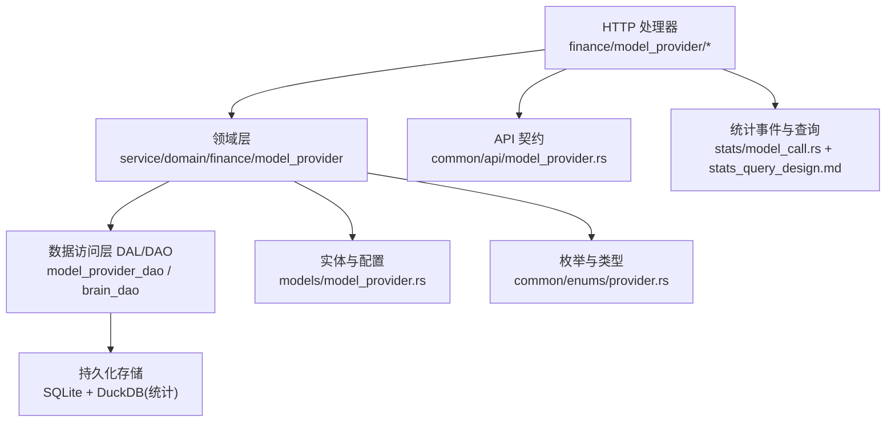
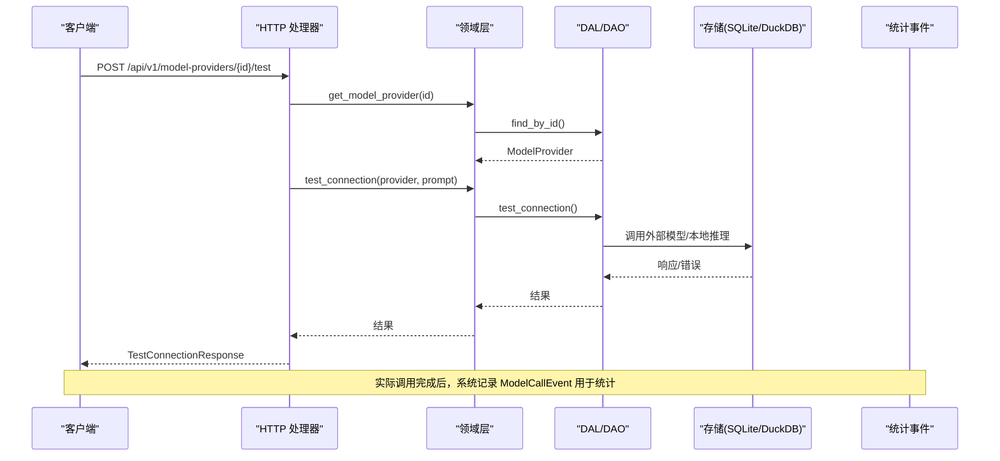
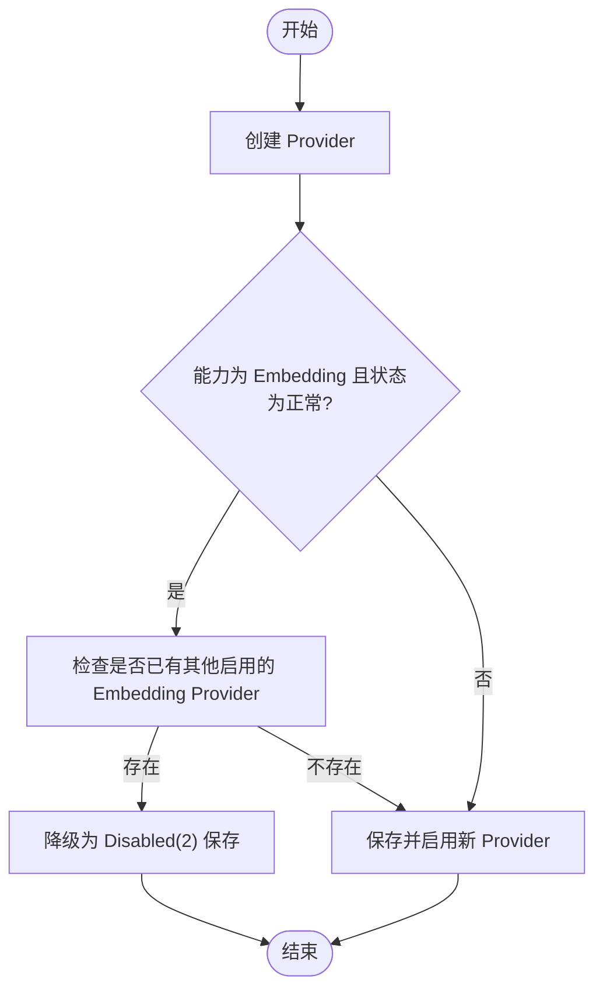
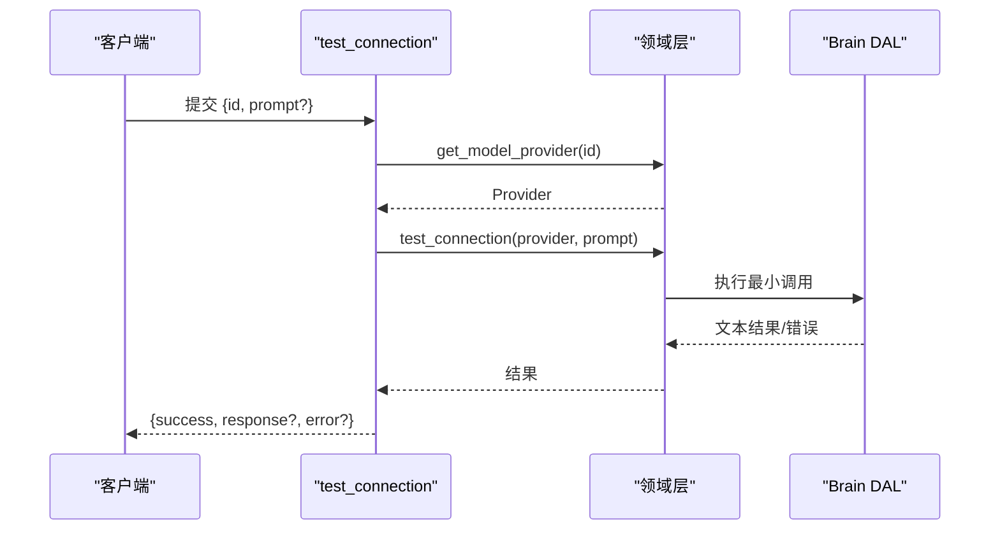
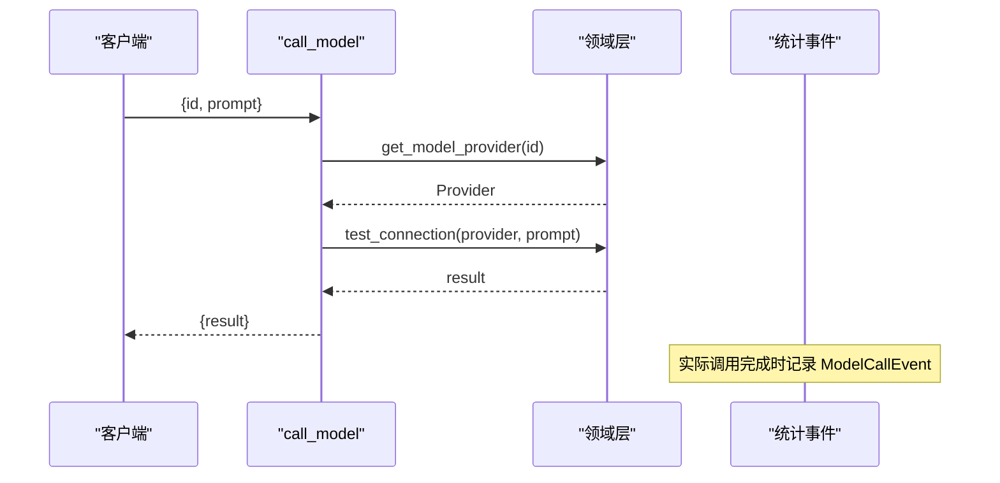
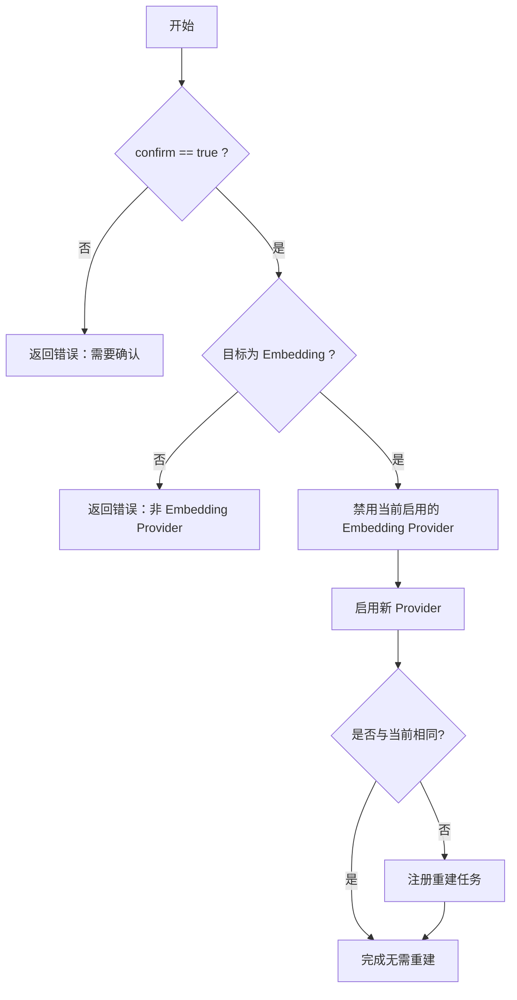
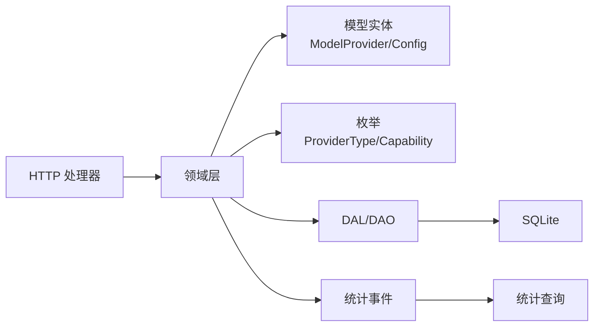

# 模型提供商管理（业务功能层）

<cite>
**本文引用的文件**
- [src/handlers/finance/model_provider/mod.rs](src/handlers/finance/model_provider/mod.rs)
- [common/src/api/model_provider.rs](common/src/api/model_provider.rs)
- [src/models/model_provider.rs](src/models/model_provider.rs)
- [src/service/domain/finance/model_provider.rs](src/service/domain/finance/model_provider.rs)
- [src/handlers/finance/model_provider/create_model_provider.rs](src/handlers/finance/model_provider/create_model_provider.rs)
- [src/handlers/finance/model_provider/get_model_provider.rs](src/handlers/finance/model_provider/get_model_provider.rs)
- [src/handlers/finance/model_provider/query_model_providers.rs](src/handlers/finance/model_provider/query_model_providers.rs)
- [src/handlers/finance/model_provider/test_connection.rs](src/handlers/finance/model_provider/test_connection.rs)
- [src/handlers/finance/model_provider/call_model.rs](src/handlers/finance/model_provider/call_model.rs)
- [src/handlers/finance/model_provider/switch_embedding.rs](src/handlers/finance/model_provider/switch_embedding.rs)
- [migrations/20260510000000_model_provider_config.sql](migrations/20260510000000_model_provider_config.sql)
- [migrations/20260511000000_add_model_capability.sql](migrations/20260511000000_add_model_capability.sql)
- [common/src/enums/provider.rs](common/src/enums/provider.rs)
- [common/src/enums/agent.rs](common/src/enums/agent.rs)
- [src/handlers/finance/model_provider/create_model_provider.rs](src/handlers/finance/model_provider/create_model_provider.rs)
- [src/handlers/finance/model_provider/update_model_provider.rs](src/handlers/finance/model_provider/update_model_provider.rs)
- [src/pkg/stats/model_call.rs](src/pkg/stats/model_call.rs)
- [docs/stats_query_design.md](docs/stats_query_design.md)
- [src/service/dal/task.rs](src/service/dal/task.rs)
</cite>

## 目录
1. [简介](#简介)
2. [项目结构](#项目结构)
3. [核心组件](#核心组件)
4. [架构总览](#架构总览)
5. [详细组件分析](#详细组件分析)
6. [依赖关系分析](#依赖关系分析)
7. [性能与容量规划](#性能与容量规划)
8. [故障排查指南](#故障排查指南)
9. [结论](#结论)
10. [附录：API 参考与使用示例](#附录api-参考与使用示例)

## 简介
本模块提供统一的 AI 模型提供商接入与管理能力，支持 OpenAI、Anthropic、本地模型（如 Ollama）、FastEmbed 等多种提供商类型。通过配置模板、API Key 管理、连接测试、能力检测、向量嵌入切换、调用统计与监控等机制，实现对多种模型的统一编排与治理。系统还内置了降级与重建策略，确保在 Embedding Provider 不可用或切换时，业务主流程不受影响。

> 📌 视角说明（AGENTS §2.1.3 Level 3 互补视角平行卡）：
> 本长文是「模型提供商管理」主题的 **业务功能层** 视角。同主题还有以下平行视角卡，请按需交叉阅读：
> - [模型提供商管理（前端 UI 层）](docs/wiki/zh/content/前端应用/页面模块/Finance%20管理页面/模型提供商管理.md)

## 项目结构
围绕“模型提供商”的 HTTP 接口按方法粒度拆分，每个处理器位于 finance/model_provider 子模块中；领域层封装在 service/domain/finance/model_provider；数据模型与 API DTO 分别定义于 models 与 common/api；数据库迁移脚本位于 migrations；统计事件与查询设计见 docs/stats_query_design.md。

图表来源
- [src/handlers/finance/model_provider/mod.rs:1-25](src/handlers/finance/model_provider/mod.rs#L1-L25)
- [src/service/domain/finance/model_provider.rs:50-148](src/service/domain/finance/model_provider.rs#L50-L148)
- [common/src/api/model_provider.rs:1-391](common/src/api/model_provider.rs#L1-L391)
- [src/models/model_provider.rs:1-248](src/models/model_provider.rs#L1-L248)
- [common/src/enums/provider.rs:1-45](common/src/enums/provider.rs#L1-L45)
- [src/pkg/stats/model_call.rs:1-62](src/pkg/stats/model_call.rs#L1-L62)
- [docs/stats_query_design.md:53-414](docs/stats_query_design.md#L53-L414)

章节来源
- [src/handlers/finance/model_provider/mod.rs:1-25](src/handlers/finance/model_provider/mod.rs#L1-L25)

## 核心组件
- 模型提供商实体与配置
  - ModelProviderPo：持久化对象，包含 id、name、provider_type、capability、model_name、api_key、base_url、description、config(JSON)、status、审计字段与时间戳。
  - ModelProviderConfig：JSON 配置，包含上下文窗口长度、推荐上下文长度、最大输出 token、默认温度、每分钟请求/Token 限制、每日配额等。
  - ModelProvider：业务对象，聚合 PO 与可选的模型调用统计。
- 提供商类型与能力
  - ProviderType：OpenAI、DeepSeek、Qwen、Doubao、Ollama、Custom、FastEmbed、DoubaoVision 等。
  - ModelCapability：Agent（对话/思考/工具）与 Embedding（向量化）。
- HTTP 处理器
  - 创建、查询、更新、删除、列表、详情、连接测试、模型调用、向量嵌入切换、重建进度查询等。
- 领域层
  - 校验与编排：Embedding 创建不阻塞——已有启用者时新创建降级为 Disabled(2)；启用时走 409 switch_required 确认后切换；创建/更新 Embedding 时按生效状态条件触发向量重建任务；切换时禁用旧 provider；调用 Brain 进行连通性测试。
- 统计与监控
  - ModelCallEvent：记录调用次数、输入/输出 token、总 token 等指标。
  - 统计查询设计：支持多维度过滤、时序聚合、按需注入到详情页。

章节来源
- [src/models/model_provider.rs:1-248](src/models/model_provider.rs#L1-L248)
- [common/src/enums/provider.rs:1-45](common/src/enums/provider.rs#L1-L45)
- [src/handlers/finance/model_provider/mod.rs:1-25](src/handlers/finance/model_provider/mod.rs#L1-L25)
- [src/service/domain/finance/model_provider.rs:50-148](src/service/domain/finance/model_provider.rs#L50-L148)
- [src/pkg/stats/model_call.rs:1-62](src/pkg/stats/model_call.rs#L1-L62)
- [docs/stats_query_design.md:53-414](docs/stats_query_design.md#L53-L414)

## 架构总览
下图展示了从 HTTP 请求到领域处理、DAL/DAO、存储与统计事件的完整链路。

图表来源
- [src/handlers/finance/model_provider/test_connection.rs:1-67](src/handlers/finance/model_provider/test_connection.rs#L1-L67)
- [src/service/domain/finance/model_provider.rs:93-101](src/service/domain/finance/model_provider.rs#L93-L101)
- [src/pkg/stats/model_call.rs:1-62](src/pkg/stats/model_call.rs#L1-L62)

## 详细组件分析

### 模型提供商 CRUD 与查询
- 创建
  - 入口：POST /api/v1/model-providers
  - 行为：构造 ModelProviderPo，设置基础信息与审计字段，调用领域层保存。Embedding 创建采用「创建不阻塞」策略——已有启用 Embedding 时新创建降级为 Disabled(2)，首个创建直接 Normal 启用。
  - 创建响应：`CreateModelProviderResponse { status, rebuild_task_id }` 包含实际落库状态（可能为 Disabled）和重建任务 ID（仅首个 Normal Embedding 触发重建）。
- 获取详情
  - 入口：GET /api/v1/model-providers/{id}
  - 行为：构建 FetchOptions，可选择附带模型调用统计（含时间范围与粒度），返回配置项（`max_context_length`、`recommended_context_length` 等上下文长度字段）。
- 查询列表
  - 入口：POST /api/v1/model-providers/query
  - 行为：支持按 provider_type、capability、status、exclude_status 分页查询。
- 更新与删除
  - 更新：PUT /api/v1/model-providers/{id}，支持部分字段更新；仅使用中(Normal) Embedding 的 `model_name`/`api_key`/`base_url` 变化触发重建；Disabled 编辑不触发（启用时 switch 全量重建兜底）。`max_context_length` 和 `recommended_context_length` 为 partial update 三态逻辑（None=不改、Some(val)=设置为 val）。
  - 禁用与删除分离：禁用通过 `UpdateModelProviderStatusRequest { status: 2 }` 实现（条目保留可再启用），删除通过 `delete_model_provider` API 实现（软删除 status=0，条目消失不可恢复）。
  - 删除 Embedding 时前端显示警示文案：「若它是使用中的向量模型，删除后语义搜索将失效，需重新配置并全量重建向量索引」。

图表来源
- [src/service/domain/finance/model_provider.rs:54-82](src/service/domain/finance/model_provider.rs#L54-L82)
- [common/src/api/model_provider.rs:135-195](common/src/api/model_provider.rs#L135-L195)

章节来源
- [src/handlers/finance/model_provider/create_model_provider.rs:1-31](src/handlers/finance/model_provider/create_model_provider.rs#L1-L31)
- [src/handlers/finance/model_provider/get_model_provider.rs:1-71](src/handlers/finance/model_provider/get_model_provider.rs#L1-L71)
- [src/handlers/finance/model_provider/query_model_providers.rs:40-59](src/handlers/finance/model_provider/query_model_providers.rs#L40-L59)
- [src/service/domain/finance/model_provider.rs:50-82](src/service/domain/finance/model_provider.rs#L50-L82)

### 连接测试与能力检测
- 连接测试
  - 入口：POST /api/v1/model-providers/{id}/test
  - 行为：加载 Provider，使用默认或自定义 prompt 发起一次最小调用，验证连通性与鉴权；空响应视为失败。
- 能力检测
  - 通过 ProviderType 与 ModelCapability 区分 Agent 与 Embedding；领域层在更新/切换时强制约束唯一启用的 Embedding Provider。

图表来源
- [src/handlers/finance/model_provider/test_connection.rs:1-67](src/handlers/finance/model_provider/test_connection.rs#L1-L67)
- [src/service/domain/finance/model_provider.rs:93-101](src/service/domain/finance/model_provider.rs#L93-L101)

章节来源
- [src/handlers/finance/model_provider/test_connection.rs:1-67](src/handlers/finance/model_provider/test_connection.rs#L1-L67)
- [common/src/enums/provider.rs:1-45](common/src/enums/provider.rs#L1-L45)

### 模型调用与统计
- 模型调用
  - 入口：POST /api/v1/model-providers/{id}/call
  - 行为：加载 Provider，复用 test_connection 逻辑生成文本结果。
- 统计事件
  - 事件：ModelCallEvent，记录 agent/project/task/org/user 维度、provider、model、token 用量等。
  - 查询：支持按 provider/agent/project/task 等多维过滤与时序聚合，详情可动态注入统计。

图表来源
- [src/handlers/finance/model_provider/call_model.rs:1-42](src/handlers/finance/model_provider/call_model.rs#L1-L42)
- [src/pkg/stats/model_call.rs:1-62](src/pkg/stats/model_call.rs#L1-L62)
- [docs/stats_query_design.md:254-311](docs/stats_query_design.md#L254-L311)

章节来源
- [src/handlers/finance/model_provider/call_model.rs:1-42](src/handlers/finance/model_provider/call_model.rs#L1-L42)
- [src/pkg/stats/model_call.rs:1-62](src/pkg/stats/model_call.rs#L1-L62)
- [docs/stats_query_design.md:53-414](docs/stats_query_design.md#L53-L414)

### Embedding 生命周期
- 创建
  - 首个 Embedding → Normal(启用) + 触发重建
  - 后续 Embedding → Disabled(未启用) + 不触发重建
- 启用 Disabled → 409 switch_required → 前端弹确认 → switch_embedding（软删旧+启用新+全量重建）
- 编辑 Normal Embedding 配置变化（model_name/api_key/base_url）→ 触发重建；编辑 Disabled → 不触发
- 禁用与删除语义分离：禁用（status=2, Disabled）保留条目可再启用；删除（status=0, Deleted）软删除不可恢复

### 上下文长度配置
- `max_context_length`：模型支持的最大 token 数，作为压缩阈值基准
- `recommended_context_length`：建议的工作上下文上限，优先作为压缩触发阈值；未设置时按 `max_context_length * 60%` 自动计算
- 更新时采用三态逻辑：`None` 字段保持原值不改，`Some(val)` 设置为新值
- 前端表单中两个字段均支持可选输入，留空时不发送更新

### 向量嵌入切换与重建
- 切换
  - 入口：POST /api/v1/finance/model-providers/:id/switch
  - 行为：校验 confirm=true；目标必须为 Embedding Provider；禁用当前启用的 Embedding Provider；启用新的；若新旧相同则无需重建。
- 重建
  - 注册后台任务 RebuildVectorsTask，异步重建各实体的向量索引；支持查询重建进度。
- 降级
  - 无可用 Embedding Provider 时，跳过向量索引更新，主流程不阻塞。

图表来源
- [src/handlers/finance/model_provider/switch_embedding.rs:1-55](src/handlers/finance/model_provider/switch_embedding.rs#L1-L55)
- [src/service/domain/finance/model_provider.rs:103-148](src/service/domain/finance/model_provider.rs#L103-L148)
- [src/service/dal/task.rs:723-803](src/service/dal/task.rs#L723-L803)

章节来源
- [src/handlers/finance/model_provider/switch_embedding.rs:1-55](src/handlers/finance/model_provider/switch_embedding.rs#L1-L55)
- [src/service/domain/finance/model_provider.rs:103-148](src/service/domain/finance/model_provider.rs#L103-L148)
- [src/service/dal/task.rs:578-605](src/service/dal/task.rs#L578-L605)
- [src/service/dal/task.rs:723-803](src/service/dal/task.rs#L723-L803)

### 配置模板与限流
- 配置模板
  - 通过 ModelProviderConfig JSON 字段存储上下文窗口、推荐长度、最大输出、温度、RPM/TPM 限制、每日配额等。
- 限流与配额
  - 可在配置中设置 rpm_limit、tpm_limit、daily_quota；具体限流实现由上层调度器或适配器负责（此处以配置为主）。

章节来源
- [src/models/model_provider.rs:9-35](src/models/model_provider.rs#L9-L35)
- [migrations/20260510000000_model_provider_config.sql:1-3](migrations/20260510000000_model_provider_config.sql#L1-L3)

## 依赖关系分析
- 处理器依赖领域层，领域层依赖 DAL/DAO 与存储；统计事件独立记录并通过查询服务聚合。
- 枚举 ProviderType 与 ModelCapability 贯穿 API 与模型层，保证类型一致。
- 向量重建与降级逻辑在 DAL 层实现，确保业务主流程健壮性。

图表来源
- [src/handlers/finance/model_provider/mod.rs:1-25](src/handlers/finance/model_provider/mod.rs#L1-L25)
- [src/models/model_provider.rs:1-248](src/models/model_provider.rs#L1-L248)
- [common/src/enums/provider.rs:1-45](common/src/enums/provider.rs#L1-L45)
- [src/pkg/stats/model_call.rs:1-62](src/pkg/stats/model_call.rs#L1-L62)

章节来源
- [common/src/enums/provider.rs:1-45](common/src/enums/provider.rs#L1-L45)
- [src/models/model_provider.rs:1-248](src/models/model_provider.rs#L1-L248)

## 性能与容量规划
- 统计查询
  - 使用 ModelProviderStatsDao 支持多维度过滤与时序聚合，避免在列表场景下无谓触发昂贵计算。
- 向量重建
  - 切换 Embedding Provider 后异步重建，减少前端等待；单条失败降级为 warn 日志，不影响整体。
- 上下文窗口
  - 通过 max_context_length 与 recommended_context_length 控制压缩阈值，降低长上下文带来的成本与延迟。

[本节为通用指导，不直接分析具体文件]

## 故障排查指南
- 连接测试失败
  - 检查 API Key、Base URL、网络连通性；查看返回的错误信息；确认模型名称与能力匹配。
- 切换 Embedding Provider 失败
  - 确认目标为 Embedding Provider；确认 confirm=true；检查是否已有其他启用的 Embedding Provider。
- Embedding 创建为 Disabled
  - 这是预期行为（已有启用者），在列表点「启用」确认切换后生效。
- 向量重建卡住或失败
  - 查看重建任务 ID 与进度；检查向量存储集合元数据；关注单条记录的失败日志与降级行为。
- 统计缺失
  - 确认 ModelCallEvent 已记录；检查统计查询的时间范围与分组条件；确认统计表可用。

章节来源
- [src/handlers/finance/model_provider/test_connection.rs:1-67](src/handlers/finance/model_provider/test_connection.rs#L1-L67)
- [src/handlers/finance/model_provider/switch_embedding.rs:1-55](src/handlers/finance/model_provider/switch_embedding.rs#L1-L55)
- [src/service/dal/task.rs:578-605](src/service/dal/task.rs#L578-L605)
- [docs/stats_query_design.md:254-311](docs/stats_query_design.md#L254-L311)

## 结论
本模块通过统一的 API 与领域模型，将多类 AI 提供商纳入同一管理体系，提供连接测试、能力检测、向量嵌入切换、统计监控与降级重建等关键能力。结合配置模板与限流参数，可实现对成本与性能的精细化控制。建议在上线前完成连接测试与统计验证，并在切换 Embedding Provider 时评估重建时间与资源占用。

[本节为总结性内容，不直接分析具体文件]

## 附录：API 参考与使用示例
- 创建模型提供商
  - 方法：POST /api/v1/model-providers
  - 请求体关键字段：name、provider_type、capability、model_name、api_key、base_url、description、max_context_length、recommended_context_length
  - 响应：id、name、provider_type、model_name、description、created_at、上下文相关字段
- 获取模型提供商详情
  - 方法：GET /api/v1/model-providers/{id}
  - 查询参数：with_model_call_stats、stats_start_time、stats_end_time、stats_interval
  - 响应：基础信息、配置项、可选统计
- 查询模型提供商列表
  - 方法：POST /api/v1/model-providers/query
  - 请求体：provider_type、capability、status、exclude_status、分页参数
- 连接测试
  - 方法：POST /api/v1/model-providers/{id}/test
  - 请求体：prompt（可选）
  - 响应：success、response、error
- 模型调用
  - 方法：POST /api/v1/model-providers/{id}/call
  - 请求体：prompt
  - 响应：result
- 切换向量嵌入提供商
  - 方法：POST /api/v1/finance/model-providers/:id/switch
  - 请求体：id、confirm(true)
  - 响应：id、name、previous_provider_id/name、rebuild_status、task_id
- 查询重建进度
  - 方法：GET .../rebuild-progress
  - 查询参数：task_id
  - 响应：task_id、status、current_entity、processed_records、total_entities 等

章节来源
- [common/src/api/model_provider.rs:9-391](common/src/api/model_provider.rs#L9-L391)
- [src/handlers/finance/model_provider/create_model_provider.rs:1-31](src/handlers/finance/model_provider/create_model_provider.rs#L1-L31)
- [src/handlers/finance/model_provider/get_model_provider.rs:1-71](src/handlers/finance/model_provider/get_model_provider.rs#L1-L71)
- [src/handlers/finance/model_provider/query_model_providers.rs:40-59](src/handlers/finance/model_provider/query_model_providers.rs#L40-L59)
- [src/handlers/finance/model_provider/test_connection.rs:1-67](src/handlers/finance/model_provider/test_connection.rs#L1-L67)
- [src/handlers/finance/model_provider/call_model.rs:1-42](src/handlers/finance/model_provider/call_model.rs#L1-L42)
- [src/handlers/finance/model_provider/switch_embedding.rs:1-55](src/handlers/finance/model_provider/switch_embedding.rs#L1-L55)