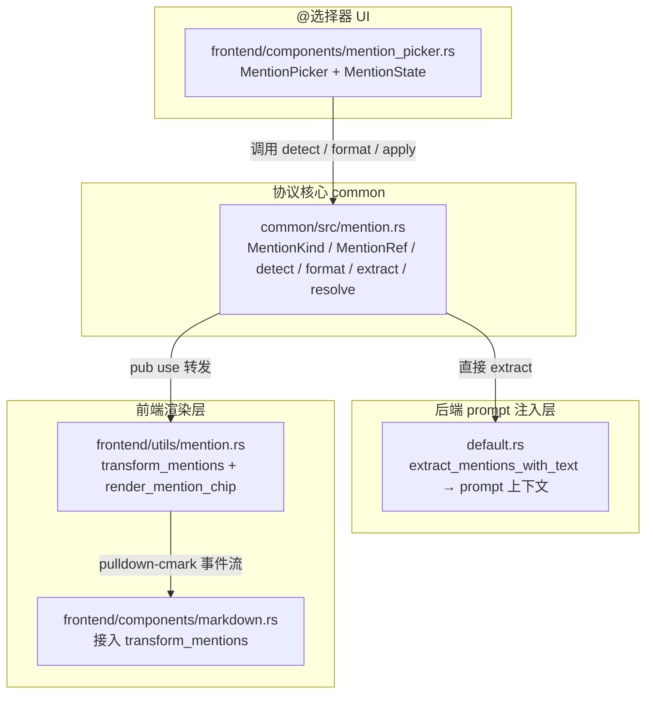

# @提及功能（mention）

> 在消息里 `@` Agent、任务或项目，把实体信息送入 Agent 的 prompt 上下文——但它不是数据库列，也不是自定义语法。AI Orz 的 @ 提及走 **CommonMark 链接协议**，降级安全、消息体自包含、前后端共享单一事实源。

```cite
本文引用的文件：
- common/src/mention.rs#L1-L604
- frontend/src/utils/mention.rs#L1-L223
- frontend/src/components/mention_picker.rs#L1-L582
- src/service/dal/agent/builder/default.rs#L175-L201
- frontend/src/components/markdown.rs#L11-L68

本文关联三类文档：
① Design
（暂未关联）

② Plan
（暂未关联）

③ RAG 知识卡
- docs/wiki/knowledge/zh/@提及功能（mention）：文本协议 + 选择器 + prompt 注入 + Markdown 渲染/@提及功能（mention）：文本协议 + 选择器 + prompt 注入 + Markdown 渲染.md
- docs/wiki/knowledge/zh/脱敏引擎下沉%20common：fail-closed%20+%20ValueRule%20+%20边界统一%20+%20闭环脱敏/脱敏引擎下沉%20common：fail-closed%20+%20ValueRule%20+%20边界统一%20+%20闭环脱敏.md

④ 关联 Wiki 长文
- docs/wiki/zh/content/功能模块/消息系统/消息系统.md
- docs/wiki/zh/content/功能模块/消息系统/Agent消息集成.md
- docs/wiki/zh/content/核心模块/工具与技能/工具系统/工具输出与安全治理.md
```

---

## 1. 简介

AI Orz 的 @ 提及让用户在输入框里用 `@` 符号唤起候选菜单，选中后向消息正文插入一段 CommonMark 链接语法 `[@张伟](agent:agt_7f3)`。发送时它跟正文一起出现在后端 prompt 里，Agent 能看到「本条消息提到了谁 / 什么」。

**解决什么问题**：Agent 收到消息时只看到纯文本，无法知道用户正在指向哪个 Agent、哪个任务或哪个项目。@ 提及把实体上下文补进 prompt，Agent 据此决定是否需要调用查询工具去拿详情。

**为什么不用自定义语法**：常见做法是 `<@agent:agt_7f3>` 或 `@agt_7f3`，但这些语法在渲染器不识别时会把原始串直接暴露给用户。CommonMark 链接语法本身就是合法 Markdown，没被识别时退化成一个普通链接——这叫「降级安全」。

**为什么不用独立 mentions 列**：消息体里内嵌语法的好处是**自包含**——复制、转发、导入导出都不丢提及信息，不需要数据库 migration，也不会触发 sqlx 离线缓存重生成。Agent 在回复正文里写语法即可发送提及，无需为它新增工具参数。

**设计哲学三句话**：

- 协议是 CommonMark，不是自定义 DSL
- 消息体自包含，不靠存储层补状态
- 协议核心只写一份（`common/src/mention.rs`），前后端天然一致

章节来源：`common/src/mention.rs#L1-L31`

---

## 2. 架构总览

四层架构，协议核心居中心、前后端各自叠加：



- **协议核心层**（`common/src/mention.rs`）是纯文本模块，不依赖渲染库也不碰 DOM。所有解析、拼装、输入检测、提及提取逻辑汇聚这里。前端 `pub use` 转发协议 API，后端直接调用 `extract_mentions_with_text`。
- **前端渲染层**（`frontend/src/utils/mention.rs`）用 pulldown-cmark 事件流拦截把提及链接替换成 chip HTML。同时承担源文 HTML 降级为纯文本的 XSS 防护。
- **@选择器 UI**（`frontend/src/components/mention_picker.rs`）是 Dioxus 组件，纯展示组件 MentionPicker + 外置状态 MentionState，键盘导航和鼠标点选共用 confirm 入口。
- **后端 prompt 注入层**（`src/service/dal/agent/builder/default.rs`）从消息正文提取提及列表，拼进 prompt 的「提及上下文」区块。

章节来源：`common/src/mention.rs#L17-L23`, `frontend/src/utils/mention.rs#L1-L17`, `frontend/src/components/mention_picker.rs#L3-L12`, `src/service/dal/agent/builder/default.rs#L175-L201`

---

## 3. 核心组件详解

### 3.1 协议核心模块（`common/src/mention.rs`）

**三个核心数据结构**：

- `MentionKind`（L36-L43）：Agent / Task / Project 三类型枚举。`as_str()` 返回协议前缀 `agent` / `task` / `project`，`chip_class()` 返回前端样式类后缀。
- `MentionRef`（L80-L85）：协议层提取结果，只有 `kind + id`，不依赖存储层。
- `ResolvedMention`（L92-L102）：后端消费结构，额外携带 `name`（展示名）和 `summary`（可选上下文摘要）。

**协议函数族**：

| 函数 | 行号 | 职责 |
|------|------|------|
| `parse_mention_dest` | L119-L130 | dest 字符串 → MentionRef。空 id、含空白、非三种前缀都返回 None（不干扰普通链接） |
| `format_mention` | L136-L142 | 生成 `[@名](type:id)` 语法，对 `[` `]` `\` 做最小转义 |
| `detect_mention_query` | L195-L214 | 光标位置 + 文本 → 检测是否处于「正在输入 @ 查询」状态。调用方传入 caret（纯函数，不碰 DOM） |
| `apply_mention_pick` | L220-L228 | 替换 `[start..caret]` 区间、末尾补空格，返回新文本和新光标位置 |
| `remove_mention_token` | L233-L247 | 摘胶囊条时删掉正文里的 token + 其后一个空格 |
| `extract_mentions_with_text` | L262-L296 | 轻量扫描 `[...](type:id)` 语法，返回 `(MentionRef, 链接文本)` |
| `extract_mentions` | L301-L306 | 同上但只取 kind+id |
| `resolve_display_name` | L313-L326 | Agent 实时名覆盖优先，Task/Project 用快照名 |

**边界检测细节**（L164-L189）：`is_mention_boundary` 判断 `@` 前字符是否为行首/空白/开括号——字母数字（如邮箱 `a@b.com`）不触发。`is_query_char` 黑名单挡掉括号字符，防止刚插入的 `[@张伟](agent:agt_1)` 在光标停在末尾时菜单立刻重新弹出。

章节来源：`common/src/mention.rs#L36-L326`

### 3.2 前端渲染层（`frontend/src/utils/mention.rs`）

前端渲染层只保留 pulldown-cmark 事件流拦截与 chip HTML 生成两块逻辑，协议 API 通过 `pub use common::mention::*` 原样转发（L14-L17）。

**transform_mentions**（L59-L120）核心流程：

1. 遍历 pulldown-cmark 事件流，遇到 `Event::Start(Tag::Link)` 时调 `parse_mention_dest(dest_url)` 判断是否为提及链接
2. 命中则进入 pending 状态，收集链接内部事件的文本内容作为 name_buf
3. 遇到 `Event::End(TagEnd::Link)` 时：normalize_snapshot 规整快照 → resolve_display_name 实时名覆盖 → push `Event::InlineHtml(render_mention_chip(...))`
4. 顺带把所有源文的 `Html` / `InlineHtml` 事件降级为 `Text`（L90）——这步就是 XSS 防护，不能因为加了提及链路就放开

**render_mention_chip**（L42-L50）生成 `<span>`，带 `data-mention-kind` / `data-mention-id` 属性，供样式和点击跳转挂钩。展示名和 id 都过 `escape_html`（L24-L37）。

章节来源：`frontend/src/utils/mention.rs#L14-L133`

### 3.3 @选择器 UI（`frontend/src/components/mention_picker.rs`）

**设计要点**（L3-L12）：纯展示组件 + 外置状态，不碰光标 DOM，输入框始终是受控 textarea，避免中文输入法组合期间被重渲染打断（历史教训 commit `0644609c`）。

**MentionState**（L142-L334）：所有字段都是 `Signal`（可 Copy 传递）。核心方法：
- `sync(text, caret)`：由 `oninput` 调用，重新跑 `detect_mention_query`，查询词变化时清空旧候选避免闪旧结果
- `confirm(text)`：键鼠共用入口——`hover` 先对齐高亮再调 `confirm`，所以不会出现「点了 A 插入 B」
- `move_selection(delta)`：键盘移动高亮，返回 `bool` 表示是否吞掉按键

**候选加载**（L339-L474）：`load_candidates` 按类型 + 关键词拉取。`mention_kinds_for`（L111-L119）分层——项目会话只允许 Agent + Task（Agent 限于项目协作人），默认对话三种都可。Agent 取组织全量由关键词收窄。

**req 序号机制**（L172-L196）：每次拉候选先自增 `req` 序号，异步响应回来时只在「当前序号等于请求序号」时才写结果，丢弃过期的慢响应。

**MentionPicker 组件**（L514-L582）：Tab 切换和候选项都用 `onmousedown + prevent_default`（L536-L538, L563-L568）——click 事件前 textarea 会先失焦，光标位置就丢了。

章节来源：`frontend/src/components/mention_picker.rs#L1-L582`

### 3.4 后端 prompt 注入（`src/service/dal/agent/builder/default.rs`）

在 Agent Prompt Builder 构建当前消息时（L175-L201），调 `extract_mentions_with_text(message.content())` 从消息正文提取提及列表，逐条构造成 `ResolvedMention`，拼进 prompt 的「提及上下文」区块。

区块内容的提示语很克制："它们是上下文补充、不是待办，按正文意图处理即可，无需专门回复它们"——防止 Agent 把提及当成必须回复的任务。需要详情时提示"请调用对应的查询工具获取，不要凭空猜测"。

当前阶段只做纯文本解析（不查 DAL），后续若要注入实时详情（如任务当前状态、Agent 角色）再重构。

章节来源：`src/service/dal/agent/builder/default.rs#L175-L201`

---

## 4. 数据流

用户输入到 Agent 感知的完整链路：

```
1. 用户在输入框打字，光标移动
2. oninput 回调 → mention_state.sync(text, caret)
   → common::mention::detect_mention_query(text, caret)
   → @ 前字符是空白/行首/开括号？且光标后是纯查询词？
3. 命中：菜单打开 → use_effect 触发 load_candidates
   → mention_kinds_for(project_id) 限定候选类型
   → req 序号自增，spawn 异步拉取（query_agents / search_tasks / search_projects）
4. 用户 ↑↓ 选择 → Enter 或鼠标点选 → MentionState.confirm(text)
   → apply_mention_pick(text, query, token)
   → 替换 [start..caret] 区间、末尾补空格、返回新文本+新光标
5. 输入框受控 textarea 用新文本渲染，光标设回新位置
6. 用户点发送 → markdown 消息正文含 [@张伟](agent:agt_7f3) 语法
7. 后端 AgentLoop 消费消息 → Prompt Builder 调 extract_mentions_with_text
   → 拼装 ResolvedMention 列表 → 拼进 prompt 的「提及上下文」区块
8. LLM 看到「本条消息通过 @ 提及了 Agent「张伟」(agt_7f3)」+ 提示语
```

章节来源：`common/src/mention.rs#L191-L228`, `frontend/src/components/mention_picker.rs#L206-L328`, `src/service/dal/agent/builder/default.rs#L175-L201`

---

## 5. 设计决策说明

**CommonMark 链接语法选择**：自定义语法（如 `<@agt_7f3>`）会把原始串暴露给未识别的渲染器。CommonMark 链接本身合法，降级成普通链接时 `[@张伟](agent:agt_7f3)` 变成可点击链接 `@张伟`，不会暴露内部 id。代价是 dest 含空白会被截断（与 CommonMark 无尖括号 dest 规则一致），但我们用 `dest含空白→跳过` 过滤掉了。章节来源：`common/src/mention.rs#L13-L15`

**光标边界检测**：`is_mention_boundary` 把 `@` 前字母数字（邮箱场景）挡掉，避免 `zhang@|` 误触发。`is_query_char` 黑名单把括号字符挡掉，防止刚插入的 `[@张伟](agent:agt_1)|` 光标停末尾时菜单立刻重弹。章节来源：`common/src/mention.rs#L164-L189`

**实时名覆盖 vs 快照名**：Agent 名有全局目录缓存（前端 Directory 目录、后端 Agent 表），所以 `resolve_display_name` 命中目录时覆盖文本快照名——改名后历史消息自动同步。Task/Project 没有全局目录缓存，直接用文本快照名，避免为了渲染发起请求。章节来源：`common/src/mention.rs#L308-L326`

**mousedown 历史教训**：Dioxus 的 click 事件是在 mousedown 之后、up 之前触发的。click 触发时 textarea 已经失焦，selectionStart 为 0，插入点就错位了。改成 `onmousedown + prevent_default` 完全绕开这个问题。章节来源：`frontend/src/components/mention_picker.rs#L533-L538`, `frontend/src/components/mention_picker.rs#L561-L568`

章节来源：`common/src/mention.rs#L13-L15`, `common/src/mention.rs#L164-L189`, `common/src/mention.rs#L308-L326`, `frontend/src/components/mention_picker.rs#L533-L568`

---

## 6. 安全与约束

**XSS 防护**（`frontend/src/utils/mention.rs#L24-L37, L88-L90`）：`escape_html` 对 chip 的展示名和 id 做 5 字符转义（`& < > " '`）。更重要的是 `transform_mentions` 把源文的 `Html` / `InlineHtml` 事件降级为 `Text`，push_html 会自动转义——调用方不需要再单独做转义映射。不能因为加了提及链路就放开 XSS。

**token 边界安全**（`common/src/mention.rs#L220-L228`）：`apply_mention_pick` 在插入末尾强制补一个空格，避免与后续文字粘连导致 `is_query_char` 误判。调用方必须把光标设回返回的新位置，否则受控 textarea 重渲染后光标跳到末尾。

**候选范围分层**（`frontend/src/components/mention_picker.rs#L111-L119`）：项目会话 `mention_kinds_for(Some(project_id))` 限定为 Agent + Task，默认对话放开三种。单一事实源在 `mention_picker.rs`，拉候选和 Tab 渲染都走这里。

**前端纯 textarea**（`frontend/src/components/mention_picker.rs#L9-L11`）：MentionPicker 不碰光标 DOM，输入框始终是受控 textarea。避免中文输入法组合期间被重渲染打断——历史教训 commit `0644609c` 记录过。

**协议迭代只改 common/src/mention.rs**（`common/src/mention.rs#L23`）：前后端复用同一模块，改这里两边自动同步。禁止前端单独维护一套 mention 解析逻辑。

章节来源：`frontend/src/utils/mention.rs#L24-L37`, `common/src/mention.rs#L220-L228`, `frontend/src/components/mention_picker.rs#L111-L119`, `common/src/mention.rs#L23`

---

## 7. 性能与边界条件

**高频 detect 调用**：`oninput` 每次按键都会触发 `detect_mention_query`。它是纯字符串切片——`rfind('@')` + 字符边界检查，无分配无正则。32 字节 MAX_QUERY_BYTES 限制了查询长度，长查询会直接返回 None（L145）。

**req 序号丢弃过期响应**（`frontend/src/components/mention_picker.rs#L172-L196`）：用户连续输入时，每敲一个字符都会触发新的候选拉取。`req` 序号每次递增，异步响应回来时只在序号匹配时才写结果。慢响应覆盖新结果的 race condition 被彻底消除。

**名字转义**（`common/src/mention.rs#L136-L142`）：`format_mention` 对 `\` `[` `]` 做最小转义——这三个字符会破坏 Markdown 链接语法。转义后的名字仍能被 `extract_mentions_with_text` 正常提取（L537-L546 测试用例）。

**刚插入后不再弹菜单**（`common/src/mention.rs#L443-L452` 测试）：`detect_query_rejects_after_inserted_mention` 用例验证了 `[@张伟](agent:agt_1)|` 光标停末尾时不会再次检测到查询——`is_query_char` 把 `]` `(` 挡掉了。但空格后重新打 `@` 会正常触发（`[@张伟](agent:agt_1) @李|` → query="李"）。

**前端 reexport 保持同源**（`frontend/src/utils/mention.rs#L208-L222` 测试）：`reexports_match_common_protocol` 测试验证了前端 `format_mention` 拼出来的语法能被 `parse_mention_dest` 还原——协议迭代后两边保持一致。

章节来源：`common/src/mention.rs#L145`, `frontend/src/components/mention_picker.rs#L172-L196`, `common/src/mention.rs#L136-L142`, `common/src/mention.rs#L443-L452`

---

## 8. 故障排查指南

### 8.1 @ 菜单不弹出

**症状**：输入 `@` 后没反应，或输入 `@张` 后不弹候选菜单。

**原因**：`detect_mention_query` 返回了 None。可能的触发点：
- `@` 前字符不属于可触发边界（如在单词中间：`zhang@|`）
- 查询词超过 32 字节
- 查询词里出现了括号字符（`is_query_char` 黑名单命中）

**排查路径**：在 `common/src/mention.rs#L195-L214` 的 `detect_mention_query` 里打印输入文本和 caret，检查 `is_mention_boundary` 和 `is_query_char` 的返回值。或者对照单元测试 `detect_query_triggers_on_boundary` / `detect_query_rejects_email_and_plain_text` 理解触发条件。

**修复**：如果是边界不够宽泛，在 `is_mention_boundary`（L164-L176）里追加字符；如果是查询词黑名单误杀，在 `is_query_char`（L183-L189）里调整。

### 8.2 光标位置丢失 / 插入点错乱

**症状**：点选候选项后，提及语法插到了错误位置，或者光标跳到了输入框末尾。

**原因**：前端没把 `apply_mention_pick` 返回的新光标位置设回去。Dioxus 受控 textarea 的光标需要在重渲染后手动设置。

**排查路径**：在 chat 页面的 `on_pick` 回调里检查是否调了 `textarea.set_selectionRange`（或 Dioxus 等价 API）把光标设到返回的 caret 位置。

**修复**：`apply_mention_pick` 的返回值 `(new_text, caret)` 必须同时使用——新文本写回 state，caret 在渲染后用 JS 设置回 textarea。

### 8.3 Agent 收不到提及

**症状**：消息里明明有 `[@张伟](agent:agt_1)`，Agent 的回复里却没体现对这条提及的感知。

**原因**：可能是 Prompt Builder 的 `extract_mentions_with_text` 没有命中，或者命中后没正确拼进 prompt。

**排查路径**：在 `src/service/dal/agent/builder/default.rs#L178-L201` 附近打印 `mentions` 列表，看是否为空。如果为空，检查消息 content 里是否真的含 `](type:id)` 语法（dest 含空白或未闭合链接都会被跳过）。对照 `extract_ignores_normal_links_and_emails` 测试用例理解过滤条件。

**修复**：如果是 dest 格式问题，排查前端 `format_mention` 的产物是否正确。如果提取正常但 Agent 没体现，检查 prompt 区块是否被模型忽略（可能需要调整提示语或移到更靠前的位置）。

### 8.4 mention 渲染失败 / chip 显示异常

**症状**：消息里的 `[@张伟](agent:agt_1)` 没变成 chip，保持普通链接形态。

**原因**：`transform_mentions` 里 `parse_mention_dest` 返回了 None。可能是 dest 不是 `agent:`/`task:`/`project:` 前缀，或者 id 为空/含空白。

**排查路径**：在 `frontend/src/utils/mention.rs#L96` 处打印 `dest_url`，看 `parse_mention_dest` 是否命中。对照 `parse_mention_dest_rejects_non_mention` 测试理解非提及 dest 的过滤条件。

**修复**：如果是协议前缀错了，检查后端 prompt 注入的 extract 是否正确写回；如果是前端渲染链路没接入，确认 markdown 组件调了 `transform_mentions`。

### 8.5 中文输入法组合期间菜单干扰输入

**症状**：用中文输入法打字时，@ 菜单弹出打断了组合输入，或候选闪烁。

**原因**：IME 组合输入期间 `oninput` 会触发多次，每次都重算 `detect_mention_query`，可能导致状态抖动。更严重的是如果组件碰光标 DOM，会打断组合状态。

**排查路径**：`frontend/src/components/mention_picker.rs#L9-L11` 记录了历史教训 `0644609c`——组件不碰光标 DOM，只插纯文本。如果问题复现，检查组合输入期间 `sync` 方法是否有防抖（当前没有）。

**修复**：短期可在 IME 组合状态（`compositionstart`/`compositionend` 事件）期间跳过 `sync` 调用。长期可以在 `sync` 里对查询词变化加 debounce。

章节来源：`common/src/mention.rs#L195-L214`, `common/src/mention.rs#L220-L228`, `src/service/dal/agent/builder/default.rs#L178-L201`, `frontend/src/utils/mention.rs#L91-L96`, `frontend/src/components/mention_picker.rs#L9-L11`

---

## 9. 总结

AI Orz 的 @ 提及功能是一份协议设计的教科书案例：

- **协议选型**：CommonMark 链接语法，降级安全——不识别时退化为普通链接而非暴露内部 id
- **架构分层**：协议核心在 `common/src/mention.rs`，前后端共享；前端渲染和后端注入各自叠加
- **边界处理**：`is_mention_boundary` 和 `is_query_char` 两道闸门解决了邮箱误触发、插入后重弹、中文输入法干扰等典型问题
- **实时 vs 快照**：Agent 名用实时目录覆盖，Task/Project 用快照名，两全其美
- **UX 细节**：mousedown 避失焦、req 序号丢过期响应、候选范围按会话分层

协议只写一份，这是整个设计能长期稳定演进的根本保障。

章节来源：`common/src/mention.rs#L1-L31`, `common/src/mention.rs#L23`

---

## 10. 附录：协议语法表 + MentionKind 枚举值

### 10.1 协议语法表

| 实体类型 | 语法 | 示例 |
|----------|------|------|
| Agent | `[@<展示名>](agent:<agt_id>)` | `[@张伟](agent:agt_7f3)` |
| Task | `[@<展示名>](task:<tsk_id>)` | `[@数据清洗](task:tsk_a91)` |
| Project | `[@<展示名>](project:<prj_id>)` | `[@客户数据平台](project:prj_2c8)` |

**名字转义规则**（`common/src/mention.rs#L136-L142`）：

| 原字符 | 转义后 | 原因 |
|--------|--------|------|
| `\` | `\\` | Markdown 转义符本身需转义 |
| `[` | `\[` | 破坏链接文本起点 |
| `]` | `\]` | 破坏链接文本终点 |

**展示名只是快照**：渲染时 `resolve_display_name` 优先用实时目录名覆盖（仅 Agent），所以名字变化后历史消息会自动同步。

### 10.2 MentionKind 枚举值

| 值 | 协议前缀 `as_str()` | chip 样式类 `chip_class()` | 中文标签 `kind_label()` |
|----|---------------------|---------------------------|------------------------|
| `MentionKind::Agent` | `agent` | `mention-agent` | Agent |
| `MentionKind::Task` | `task` | `mention-task` | 任务 |
| `MentionKind::Project` | `project` | `mention-project` | 项目 |

章节来源：`common/src/mention.rs#L36-L63`, `common/src/mention.rs#L104-L113`, `common/src/mention.rs#L136-L142`
