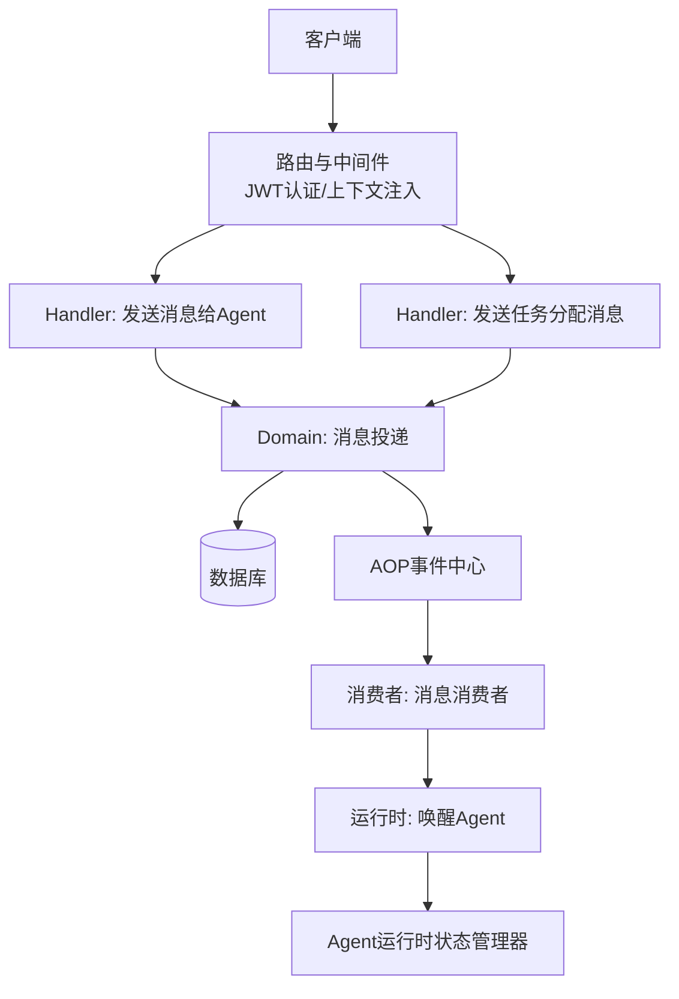
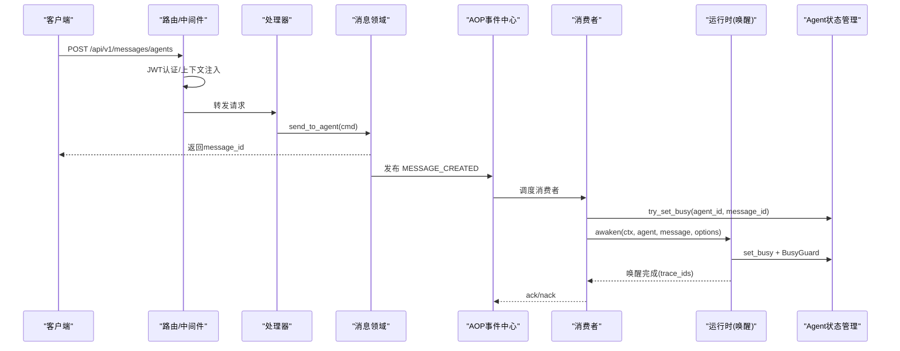
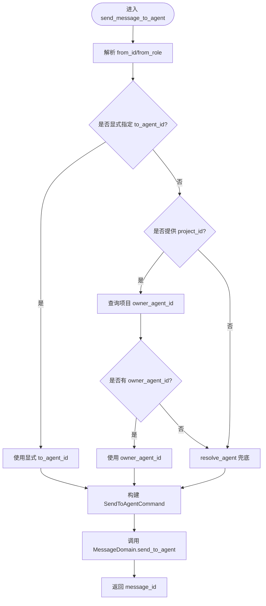
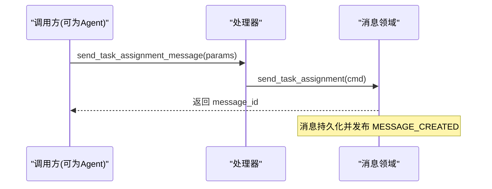
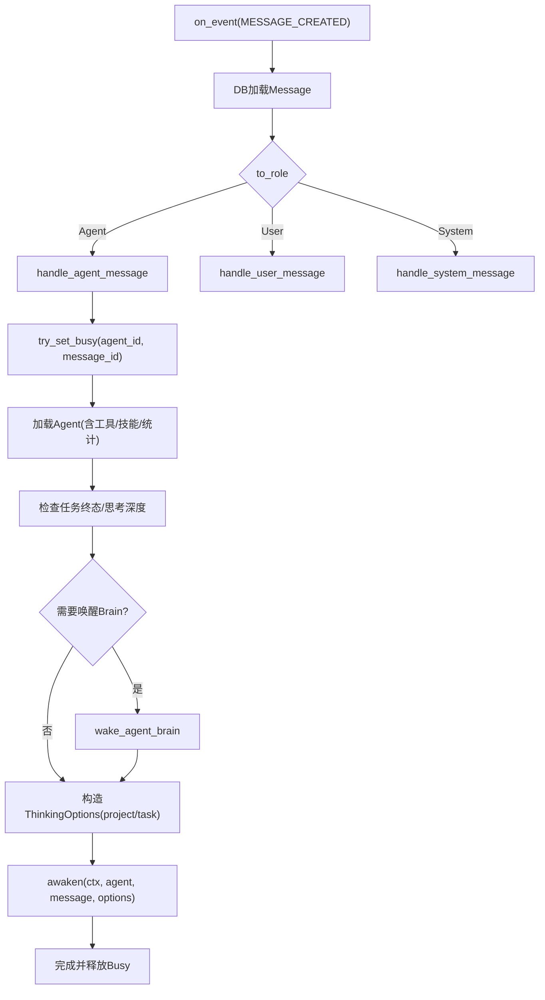
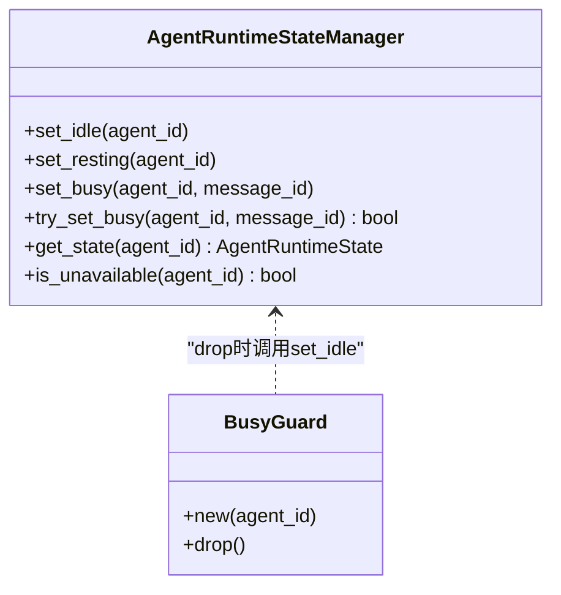
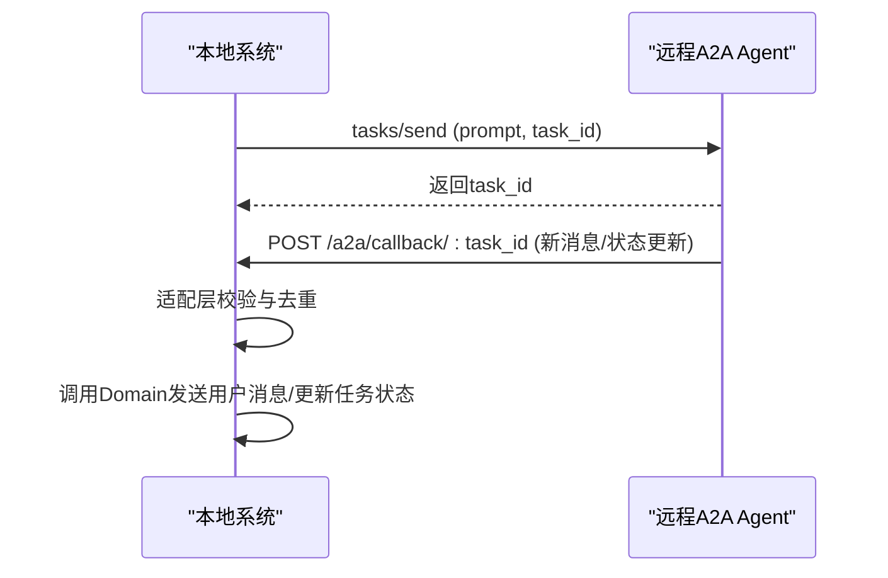
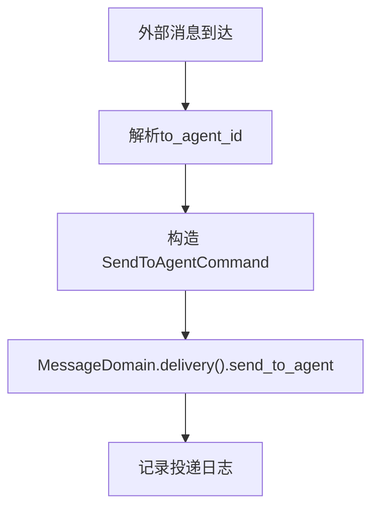
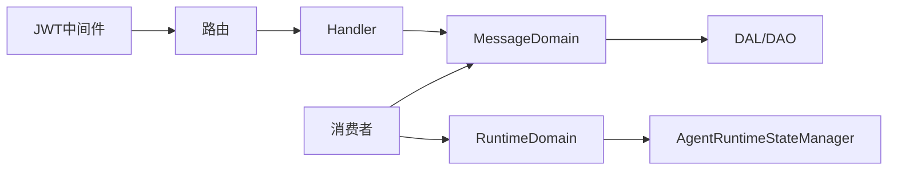

# Agent消息集成

<cite>
**本文引用的文件**   
- [send_message_to_agent.rs](src/handlers/finance/message/send_message_to_agent.rs)
- [send_task_assignment_message.rs](src/handlers/finance/message/send_task_assignment_message.rs)
- [message.rs（消费者）](src/consumer/message.rs)
- [message_domain/mod.rs](src/service/domain/message/mod.rs)
- [awakening.rs](src/service/domain/runtime/awakening.rs)
- [agent_runtime_state.rs](src/pkg/agent_runtime_state.rs)
- [busy_guard.rs](src/service/domain/runtime/busy_guard.rs)
- [jwt_auth.rs](src/middleware/jwt_auth.rs)
- [router.rs](src/router.rs)
- [message.rs（API DTOs）](common/src/api/message.rs)
- [a2a.rs（A2A运行时DAO）](src/service/dao/agent_runtime/a2a.rs)
- [external_agent_design.md](docs/external_agent_design.md)
- [message_channel.rs（生产者）](src/producer/message_channel.rs)
</cite>

## 目录
1. [简介](#简介)
2. [项目结构](#项目结构)
3. [核心组件](#核心组件)
4. [架构总览](#架构总览)
5. [详细组件分析](#详细组件分析)
6. [依赖关系分析](#依赖关系分析)
7. [性能与可靠性](#性能与可靠性)
8. [故障排查指南](#故障排查指南)
9. [结论](#结论)
10. [附录：模板、参数校验与响应示例](#附录模板参数校验与响应示例)

## 简介
本文件面向“Agent消息集成”能力，系统性说明如何向Agent发送消息，包括普通消息发送 send_message_to_agent 与任务分配消息 send_task_assignment_message。文档覆盖消息协议、路由规则、状态管理、队列与优先级、超时与重试、异步处理、追踪与监控、安全认证与权限控制，以及调试与排障方法。

## 项目结构
本项目采用严格四层单向调用：Adapter（HTTP Handler / AOP Producer）→ Domain → DAL → DAO。消息相关的关键路径如下：
- Adapter层：HTTP处理器接收请求并构造命令；AOP Producer将事件入队。
- Domain层：消息领域封装投递与管理；运行时领域负责唤醒Agent。
- DAL/DAO层：持久化消息、渠道配置与推送。
- 消费者：消费MESSAGE_CREATED事件，按to_role分发到Agent/User/System分支。

图表来源
- [router.rs:12-37](src/router.rs#L12-L37)
- [send_message_to_agent.rs:29-92](src/handlers/finance/message/send_message_to_agent.rs#L29-L92)
- [send_task_assignment_message.rs:22-47](src/handlers/finance/message/send_task_assignment_message.rs#L22-L47)
- [message_domain/mod.rs:281-331](src/service/domain/message/mod.rs#L281-L331)
- [message.rs（消费者）:78-111](src/consumer/message.rs#L78-L111)
- [awakening.rs:424-456](src/service/domain/runtime/awakening.rs#L424-L456)
- [agent_runtime_state.rs:73-107](src/pkg/agent_runtime_state.rs#L73-L107)

章节来源
- [router.rs:12-37](src/router.rs#L12-L37)
- [send_message_to_agent.rs:29-92](src/handlers/finance/message/send_message_to_agent.rs#L29-L92)
- [send_task_assignment_message.rs:22-47](src/handlers/finance/message/send_task_assignment_message.rs#L22-L47)
- [message_domain/mod.rs:281-331](src/service/domain/message/mod.rs#L281-L331)
- [message.rs（消费者）:78-111](src/consumer/message.rs#L78-L111)
- [awakening.rs:424-456](src/service/domain/runtime/awakening.rs#L424-L456)
- [agent_runtime_state.rs:73-107](src/pkg/agent_runtime_state.rs#L73-L107)

## 核心组件
- HTTP处理器
  - send_message_to_agent：支持默认对话框与Project对话框两种场景，自动路由目标Agent。
  - send_task_assignment_message：Agent间任务分配消息，立即返回，接收方在下一轮唤醒中处理。
- 消息领域（MessageDomain）
  - 提供send_to_agent、send_task_assignment、deliver_message等接口，统一消息创建、持久化与投递。
- 消费者（MessageConsumer）
  - 订阅MESSAGE_CREATED事件，按to_role分发：Agent→唤醒；User→推送；System→工具执行。
- 运行时（RuntimeDomain/Awakening）
  - 唤醒Agent，设置Busy状态，注入上下文，发布循环启动事件。
- Agent状态管理（AgentRuntimeStateManager + BusyGuard）
  - 原子占用Agent，RAII清理Busy状态，避免死锁与泄漏。
- AOP事件中心
  - 内存事件队列，支持优先级与顺序键，ack/nack重试机制。
- 安全与路由
  - JWT中间件双模式认证（Cookie/Bearer），路由层保护受保护端点。

章节来源
- [send_message_to_agent.rs:29-92](src/handlers/finance/message/send_message_to_agent.rs#L29-L92)
- [send_task_assignment_message.rs:22-47](src/handlers/finance/message/send_task_assignment_message.rs#L22-L47)
- [message_domain/mod.rs:281-331](src/service/domain/message/mod.rs#L281-L331)
- [message.rs（消费者）:78-111](src/consumer/message.rs#L78-L111)
- [awakening.rs:424-456](src/service/domain/runtime/awakening.rs#L424-L456)
- [agent_runtime_state.rs:73-107](src/pkg/agent_runtime_state.rs#L73-L107)
- [jwt_auth.rs:25-87](src/middleware/jwt_auth.rs#L25-L87)
- [router.rs:12-37](src/router.rs#L12-L37)

## 架构总览
下图展示从HTTP请求到Agent唤醒的完整链路，包含认证、路由、领域、事件与消费者。

图表来源
- [router.rs:12-37](src/router.rs#L12-L37)
- [send_message_to_agent.rs:29-92](src/handlers/finance/message/send_message_to_agent.rs#L29-L92)
- [message_domain/mod.rs:281-331](src/service/domain/message/mod.rs#L281-L331)
- [message.rs（消费者）:78-111](src/consumer/message.rs#L78-L111)
- [awakening.rs:424-456](src/service/domain/runtime/awakening.rs#L424-L456)
- [agent_runtime_state.rs:73-107](src/pkg/agent_runtime_state.rs#L73-L107)

## 详细组件分析

### 普通消息发送 send_message_to_agent
- 功能要点
  - 支持两种对话上下文：默认对话框（无project_id）与Project对话框（有project_id）。
  - to_agent_id路由优先级：显式指定 > project.owner_agent_id > resolve_agent兜底。
  - 构造SendToAgentCommand并调用MessageDomain.delivery().send_to_agent。
- 关键流程
  - 解析from_id/from_role（来自RequestContext）。
  - 根据project_id查询项目并获取owner_agent_id或resolve_agent。
  - 构建命令并持久化消息，返回message_id。

图表来源
- [send_message_to_agent.rs:29-92](src/handlers/finance/message/send_message_to_agent.rs#L29-L92)
- [message_domain/mod.rs:121-143](src/service/domain/message/mod.rs#L121-L143)

章节来源
- [send_message_to_agent.rs:29-92](src/handlers/finance/message/send_message_to_agent.rs#L29-L92)
- [message_domain/mod.rs:121-143](src/service/domain/message/mod.rs#L121-L143)

### 任务分配消息 send_task_assignment_message
- 功能要点
  - 用于Agent之间分配任务，消息类型对应TaskAssignment。
  - 立即返回message_id，接收Agent在下一轮awaken中收到任务分配通知。
- 关键流程
  - 解析from_id/from_role。
  - 构造SendTaskAssignmentCommand并调用MessageDomain.delivery().send_task_assignment。

图表来源
- [send_task_assignment_message.rs:22-47](src/handlers/finance/message/send_task_assignment_message.rs#L22-L47)
- [message_domain/mod.rs:310-315](src/service/domain/message/mod.rs#L310-L315)

章节来源
- [send_task_assignment_message.rs:22-47](src/handlers/finance/message/send_task_assignment_message.rs#L22-L47)
- [message_domain/mod.rs:310-315](src/service/domain/message/mod.rs#L310-L315)

### 消费者与Agent唤醒
- 事件消费
  - 订阅MESSAGE_CREATED事件，加载完整Message，按to_role分发。
- Agent分支
  - 原子占用Agent（try_set_busy），加载Agent实体（含工具/技能/统计），检查任务终态与思考深度限制，必要时唤醒Brain，构造ThinkingOptions（注入project/task上下文），最终调用awaken。
- User分支
  - 调用deliver_message推送给用户，若所有渠道失败则返回错误触发重试。
- System分支
  - 解析ToolCallRequest，执行工具并回写结果。

图表来源
- [message.rs（消费者）:78-111](src/consumer/message.rs#L78-L111)
- [message.rs（消费者）:147-357](src/consumer/message.rs#L147-L357)
- [awakening.rs:424-456](src/service/domain/runtime/awakening.rs#L424-L456)
- [agent_runtime_state.rs:73-107](src/pkg/agent_runtime_state.rs#L73-L107)

章节来源
- [message.rs（消费者）:78-111](src/consumer/message.rs#L78-L111)
- [message.rs（消费者）:147-357](src/consumer/message.rs#L147-L357)
- [awakening.rs:424-456](src/service/domain/runtime/awakening.rs#L424-L456)
- [agent_runtime_state.rs:73-107](src/pkg/agent_runtime_state.rs#L73-L107)

### Agent状态管理与Busy清理
- 原子占用
  - try_set_busy确保同一Agent不会被并发重复唤醒，避免TOCTOU竞态。
- RAII清理
  - BusyGuard在awaken作用域结束时自动set_idle，防止异常或提早返回导致状态泄漏。
- 状态事件
  - 状态变更通过AOP发布AgentStateEvent，便于监控与审计。

图表来源
- [agent_runtime_state.rs:73-107](src/pkg/agent_runtime_state.rs#L73-L107)
- [busy_guard.rs:1-32](src/service/domain/runtime/busy_guard.rs#L1-L32)

章节来源
- [agent_runtime_state.rs:73-107](src/pkg/agent_runtime_state.rs#L73-L107)
- [busy_guard.rs:1-32](src/service/domain/runtime/busy_guard.rs#L1-L32)

### 消息协议与外部Agent（A2A）
- 本地消息协议
  - 消息内容承载不同业务语义（文本、工具调用、任务分配等），由MessageType区分。
- A2A远程Agent
  - 通过HTTP JSON-RPC 2.0调用远程Agent tasks/send，支持回调与轮询双通道更新。
  - 状态映射：Completed/Failed/Working等映射到本地Task状态。
  - 幂等性：基于tags去重与终态跳过。

图表来源
- [a2a.rs:150-195](src/service/dao/agent_runtime/a2a.rs#L150-L195)
- [external_agent_design.md:107-188](docs/external_agent_design.md#L107-L188)

章节来源
- [a2a.rs:150-195](src/service/dao/agent_runtime/a2a.rs#L150-L195)
- [external_agent_design.md:107-188](docs/external_agent_design.md#L107-L188)

### 消息路由与消息通道生产者
- 路由规则
  - 处理器根据project_id与显式to_agent_id决定目标Agent。
- 消息通道生产者
  - 将外部消息转换为内部SendToAgentCommand并通过MessageDomain投递。
  - 若无可用Agent，记录警告并返回。

图表来源
- [message_channel.rs:40-90](src/producer/message_channel.rs#L40-L90)

章节来源
- [message_channel.rs:40-90](src/producer/message_channel.rs#L40-L90)

## 依赖关系分析
- 模块耦合
  - Handler依赖Domain；Domain依赖DAL/DAO；消费者依赖Domain与Runtime；运行时依赖状态管理器。
- 外部依赖
  - Axum路由与中间件；JWT认证；AOP事件中心；SQLite/DuckDB存储；LanceDB向量检索。
- 潜在环路与解耦
  - 通过Domain抽象与AOP事件解耦生产/消费；状态管理为全局单例但仅内存态，重启重置。

图表来源
- [router.rs:12-37](src/router.rs#L12-L37)
- [message_domain/mod.rs:281-331](src/service/domain/message/mod.rs#L281-L331)
- [message.rs（消费者）:78-111](src/consumer/message.rs#L78-L111)
- [agent_runtime_state.rs:73-107](src/pkg/agent_runtime_state.rs#L73-L107)

章节来源
- [router.rs:12-37](src/router.rs#L12-L37)
- [message_domain/mod.rs:281-331](src/service/domain/message/mod.rs#L281-L331)
- [message.rs（消费者）:78-111](src/consumer/message.rs#L78-L111)
- [agent_runtime_state.rs:73-107](src/pkg/agent_runtime_state.rs#L73-L107)

## 性能与可靠性
- 队列与优先级
  - AOP内存事件队列支持优先级排序与顺序键保证；空order_key并行消费。
- 并发与限流
  - 消费者并发度可配置（默认4）；Agent原子占用避免重复唤醒。
- 超时与重试
  - nack将消息置为Pending以重试；空队列sleep与错误重试sleep可配置。
- 资源保护
  - BusyGuard确保Busy状态清理；awaken前检查任务终态与思考深度，避免无效唤醒。
- 监控与追踪
  - 状态变更发布AgentStateEvent；awaken发布AgentLoopEvent；工具调用日志持久化JSONL。

章节来源
- [message.rs（消费者）:130-140](src/consumer/message.rs#L130-L140)
- [agent_runtime_state.rs:134-157](src/pkg/agent_runtime_state.rs#L134-L157)
- [awakening.rs:424-456](src/service/domain/runtime/awakening.rs#L424-L456)

## 故障排查指南
- 常见问题
  - 未认证：受保护路由缺少JWT返回401；浏览器请求重定向登录页。
  - Agent不可用：Busy或Resting导致消息被拒绝并重试。
  - 投递失败：所有渠道失败时返回错误触发重试。
  - 任务终态：Completed/Cancelled/Archived的任务不再唤醒Agent。
- 诊断步骤
  - 检查JWT中间件与路由层是否正确挂载。
  - 查看消费者日志与AOP事件队列长度/进行中数量。
  - 确认Agent状态是否为Idle；观察BusyGuard是否正确释放。
  - 核对消息类型与to_role匹配；检查任务状态与思考深度限制。
- 工具与方法
  - 使用SSE订阅消息推送验证投递链路。
  - 查看工具调用日志与trace_ref定位问题。

章节来源
- [jwt_auth.rs:25-87](src/middleware/jwt_auth.rs#L25-L87)
- [message.rs（消费者）:359-389](src/consumer/message.rs#L359-L389)
- [agent_runtime_state.rs:73-107](src/pkg/agent_runtime_state.rs#L73-L107)
- [message.rs（消费者）:198-294](src/consumer/message.rs#L198-L294)

## 结论
Agent消息集成功能通过清晰的层次划分与AOP事件驱动，实现了高可靠的消息投递与Agent唤醒。结合原子状态管理、RAII清理、优先级队列与重试机制，系统在并发与容错方面具备良好表现。配合JWT认证与路由保护，确保了安全性与权限控制。建议在生产环境持续监控AOP事件队列与Agent状态，结合SSE与日志追踪进行端到端诊断。

## 附录：模板、参数校验与响应示例
- 消息模板
  - 普通消息：文本内容，可选project_id/task_id/reply_to_id/attachment_ids。
  - 任务分配消息：包含task_id、task_title、task_description、from_id、to_agent_id、project_id。
- 参数校验
  - to_agent_id为空时按优先级解析；project不存在返回not_found；无可用前台Agent返回not_found。
  - ToolCallRequest需满足特定格式，否则返回bad_request。
- 响应示例
  - send_message_to_agent：返回{message_id}。
  - send_task_assignment_message：返回{message_id}。
  - 列表/搜索：返回消息列表与分页信息。

章节来源
- [message.rs（API DTOs）:7-102](common/src/api/message.rs#L7-L102)
- [message.rs（API DTOs）:104-172](common/src/api/message.rs#L104-L172)
- [message.rs（API DTOs）:174-235](common/src/api/message.rs#L174-L235)
- [send_message_to_agent.rs:29-92](src/handlers/finance/message/send_message_to_agent.rs#L29-L92)
- [send_task_assignment_message.rs:22-47](src/handlers/finance/message/send_task_assignment_message.rs#L22-L47)