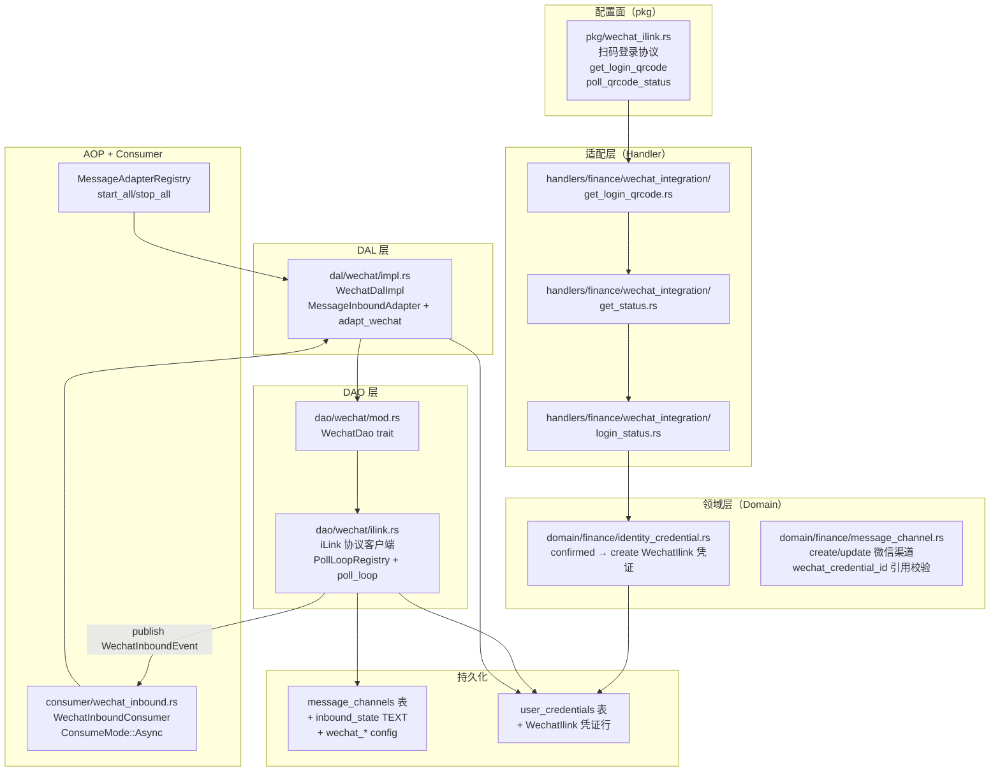
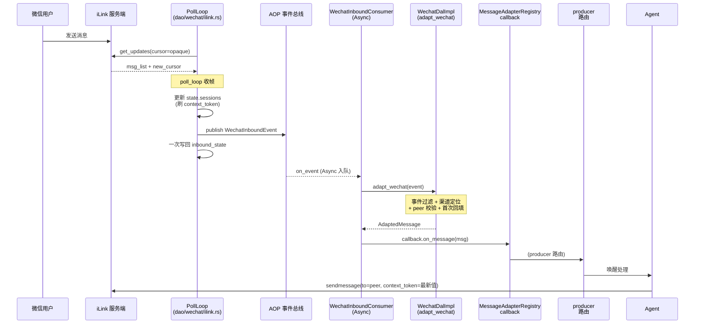
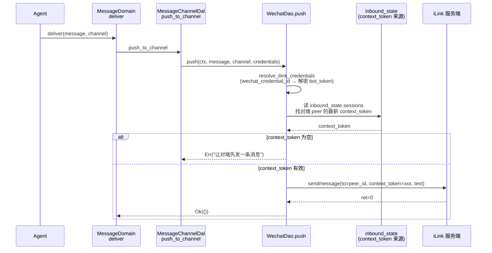

# 微信 iLink 专属渠道

<cite>
**本文引用的文件**
- [dal/wechat/mod.rs](src/service/dal/wechat/mod.rs) — WechatDal 总 trait + 单例 init + 注册 MessageAdapterRegistry
- [dal/wechat/impl.rs](src/service/dal/wechat/impl.rs) — WechatDalImpl：adapt_wechat + MessageInboundAdapter + WechatCredentialDal + WechatListenerDal
- [dao/wechat/mod.rs](src/service/dao/wechat/mod.rs) — WechatDao trait：push / test_connection / start_polling / stop_polling / stop_all_polling / is_polling
- [dao/wechat/ilink.rs](src/service/dao/wechat/ilink.rs) — iLink 协议客户端 + PollLoopRegistry + get_updates 长轮询 + sendmessage 出站 + InboundStateWriter 窄接口
- [pkg/wechat_ilink.rs](src/pkg/wechat_ilink.rs) — 扫码登录协议：get_login_qrcode + poll_qrcode_status 长轮询
- [consumer/wechat_inbound.rs](src/consumer/wechat_inbound.rs) — WechatInboundConsumer：ConsumeMode::Async + adapt_wechat + callback.on_message
- [models/events/wechat.rs](src/models/events/wechat.rs) — IlinkMessage + WechatInboundEvent（AOP 事件信封，order_key=bot_id）
- [common/src/api/wechat_integration.rs](common/src/api/wechat_integration.rs) — DTO：WechatLoginQrcodeRequest + WechatLoginStatusResponse + WechatCredentialSnapshot
- [common/src/models/inbound_state.rs](common/src/models/inbound_state.rs) — InboundState + InboundCursor(CursorKind::Opaque) + InboundSessions
- [common/src/models/identity_credentials.rs](common/src/models/identity_credentials.rs) — CredentialKind::WechatIlink + CredentialDetail::WechatIlink + CredentialDetailPatch::WechatIlink
- [dao/message_channel/sqlite.rs](src/service/dao/message_channel/sqlite.rs) — set_inbound_state（InboundStateWriter 生产实现）
- [models/message_channel.rs](src/models/message_channel.rs) — MessageChannelPo.inbound_state 字段 + wechat_* config 字段
- [pkg/adapter/message.rs](src/pkg/adapter/message.rs) — MessageInboundAdapter trait + MessageAdapterRegistry 中台
- [producer/message_channel.rs](src/producer/message_channel.rs) — MessageAdapterCallback 注入 + start_all/stop_all
- [migrations/20260906000001_add_inbound_state_to_message_channels.sql](migrations/20260906000001_add_inbound_state_to_message_channels.sql) — inbound_state 列 DDL

**本文关联三类文档**
- 【① Design 决策快照】
  - [wechat_channel_integration_design.md](docs/design/wechat_channel_integration_design.md) — iLink 协议设计 + 分层架构（如有）
  - [message_channel_design.md](docs/archive/design-archive/message_channel_design.md) — 消息渠道入站适配中台架构
- 【② Plan 落地快照】（如有）
  - [微信 iLink 专属渠道闭环.md](docs/plan/微信%20iLink%20专属渠道闭环.md) — 阶段一完整闭环落地快照
- 【④ RAG 原子知识卡】
  - [微信 iLink 专属渠道闭环：wechat_dal + ilink_dao + inbound_state + 授权流程](docs/wiki/knowledge/zh/微信%20iLink%20专属渠道闭环：wechat_dal%20+%20ilink_dao%20+%20inbound_state%20+%20授权流程/微信%20iLink%20专属渠道闭环：wechat_dal%20+%20ilink_dao%20+%20inbound_state%20+%20授权流程.md) — 本长文对应的 RAG 摘要卡
  - [InboundState 入站运行状态：动态游标 + 会话滚动刷新](docs/wiki/knowledge/zh/InboundState%20入站运行状态：动态游标%20+%20会话滚动刷新/InboundState%20入站运行状态：动态游标%20+%20会话滚动刷新.md) — 运行时状态持久化模型
  - [IdentityCredentials 身份凭证扩展：授权流程 + QR登录 + 多渠道凭证管理](docs/wiki/knowledge/zh/IdentityCredentials%20身份凭证扩展：授权流程%20+%20QR登录%20+%20多渠道凭证管理/IdentityCredentials%20身份凭证扩展：授权流程%20+%20QR登录%20+%20多渠道凭证管理.md) — WechatIlink 凭证类型 + 扫码授权流程
  - [消息渠道入站适配中台：MessageInboundAdapter trait + MessageAdapterRegistry 全局注册 + start_all stop_all 生命周期](docs/wiki/knowledge/zh/消息渠道入站适配中台：MessageInboundAdapter%20trait%20+%20MessageAdapterRegistry%20全局注册%20+%20start_all%20stop_all%20生命周期/消息渠道入站适配中台：MessageInboundAdapter%20trait%20+%20MessageAdapterRegistry%20全局注册%20+%20start_all%20stop_all%20生命周期.md) — 中台 trait+registry，WechatDalImpl 是其实现
  - [Lark P2P WS 私信入站：身份凭证引用解析 + app_id 聚合 WS + open_id 自动映射 + LarkWsMetrics 健康指标](docs/wiki/knowledge/zh/Lark%20P2P%20WS%20私信入站：身份凭证引用解析%20+%20app_id%20聚合%20WS%20+%20open_id%20自动映射%20+%20LarkWsMetrics%20健康指标/Lark%20P2P%20WS%20私信入站：身份凭证引用解析%20+%20app_id%20聚合%20WS%20+%20open_id%20自动映射%20+%20LarkWsMetrics%20健康指标.md) — 对称渠道实现，供架构对齐参考
  - [Domain 内部事件与消费者全链路：8 类 DomainEvent 枚举 + 8 类 Consumer 业务消费 + AOP Producer 投递入口 + Registry 订阅](docs/wiki/knowledge/zh/Domain%20内部事件与消费者全链路：8%20类%20DomainEvent%20枚举%20+%208%20类%20Consumer%20业务消费%20+%20AOP%20Producer%20投递入口%20+%20Registry%20订阅/Domain%20内部事件与消费者全链路：8%20类%20DomainEvent%20枚举%20+%208%20类%20Consumer%20业务消费%20+%20AOP%20Producer%20投递入口%20+%20Registry%20订阅.md) — Async Consumer 模式参考
- 【③ Wiki 关联长文】
  - [消息渠道管理.md](docs/wiki/zh/content/功能模块/消息系统/消息渠道管理.md) — 管理员创建微信渠道，填 wechat_credential_id + 绑定 agent
  - [消息系统.md](docs/wiki/zh/content/功能模块/消息系统/消息系统.md) — 多渠道消息总览
  - [消息通道生产者.md](docs/wiki/zh/content/基础设施/AOP%20事件系统/事件生产者/消息通道生产者.md) — AOP 层：start_all + AdaptedMessage → NewMessage → 唤醒
  - [飞书集成系统.md](docs/wiki/zh/content/核心模块/服务层/领域层/财务领域/飞书集成系统.md) — Lark 渠道对称参考
  - [身份凭证管理（统一 Domain CRUD 加密存储与生命周期联动）.md](docs/wiki/zh/content/核心模块/服务层/领域层/财务领域/身份凭证管理（统一%20Domain%20CRUD%20加密存储与生命周期联动）.md) — 凭证引用解析 + 加密落库通用框架
</cite>

## 更新摘要
**2026-09-07 新建长文**：微信 iLink（ClawBot）阶段一双向私信闭环完整说明——扫码授权获取 WechatIlink 凭证 → 创建微信渠道（wechat_credential_id 引用）→ WechatDalImpl 注册 MessageAdapterRegistry → poll_loop 长轮询收帧 → WechatInboundConsumer Async 消费 → adapt_wechat 协议转换 → callback.on_message 投递 producer → Agent 唤醒 + outbound push sendmessage 回复。iLink 特有机制：inbound_state 运行时持久化（Opaque 游标 + context_token 会话滚动刷新）+ channel_id 键控轮询（一渠道一轮询，不做 app_id 聚合）+ PollLoopRegistry ensure 凭证指纹幂等重建。

## 目录
1. [简介](#简介)
2. [项目结构](#项目结构)
3. [核心组件](#核心组件)
4. [架构总览](#架构总览)
5. [详细组件分析](#详细组件分析)
6. [依赖关系分析](#依赖关系分析)
7. [性能与并发](#性能与并发)
8. [故障排查指南](#故障排查指南)
9. [结论](#结论)
10. [附录：配置模板与示例](#附录配置模板与示例)

## 简介

微信 iLink（ClawBot）是 AI Orz 的**第二个完成双向私信闭环**的外部消息渠道。与飞书 Lark WS 的 App 级 WS 连接不同，iLink 是**个人 bot 微信号**级渠道，每个 MessageChannel 行独立管理自己的长轮询（channel_id 键控，不做 app_id 聚合）。

**核心流程**：用户扫码 → confirmed 时 bot_token/bot_id/base_url 一次性产出 → Domain 加密落库 `CredentialKind::WechatIlink` 凭证行 → 管理员创建微信渠道（wechat_credential_id 引用凭证）→ WechatDalImpl.start 逐渠道建长轮询 → poll_loop 收帧 publish AOP 事件 → Consumer Async 消费 → adapt_wechat 协议转换 → callback.on_message → producer → Agent 唤醒 → outbound push sendmessage 回复。

**iLink 特有机制**：
- **inbound_state 运行时持久化**：`message_channels` 表新增 TEXT JSON 列，持久化 `InboundState { cursor: InboundCursor(Opaque), sessions: InboundSessions }`——运行时循环独占写，与静态 config_json 物理隔离
- **context_token 会话令牌**：iLink 协议要求出站 sendmessage 必须带最新 context_token（滚动刷新），空值报错提示"让对端先发一条消息"
- **channel_id 键控轮询**：一渠道一轮询（一个 bot 微信号 = 一个 MessageChannel），不做共享连接
- **PollLoopRegistry ensure 幂等三态**：同指纹 no-op / 指纹变化自动重建

## 项目结构



**图表来源**
- [dal/wechat/mod.rs#L51-L63](src/service/dal/wechat/mod.rs#L51-L63) — WechatDalImpl 注册到 MessageAdapterRegistry
- [dal/wechat/impl.rs#L369-L437](src/service/dal/wechat/impl.rs#L369-L437) — MessageInboundAdapter start/stop 实现
- [dao/wechat/ilink.rs#L365-L461](src/service/dao/wechat/ilink.rs#L365-L461) — poll_loop 循环体
- [dao/wechat/ilink.rs#L464-L551](src/service/dao/wechat/ilink.rs#L464-L551) — PollLoopRegistry ensure/stop/stop_all

**章节来源**
- [微信 iLink 专属渠道闭环 RAG 卡 §1](docs/wiki/knowledge/zh/微信%20iLink%20专属渠道闭环：wechat_dal%20+%20ilink_dao%20+%20inbound_state%20+%20授权流程/微信%20iLink%20专属渠道闭环：wechat_dal%20+%20ilink_dao%20+%20inbound_state%20+%20授权流程.md)
- [InboundState RAG 卡 §1](docs/wiki/knowledge/zh/InboundState%20入站运行状态：动态游标%20+%20会话滚动刷新/InboundState%20入站运行状态：动态游标%20+%20会话滚动刷新.md)

## 核心组件

**配置面**
- `pkg/wechat_ilink.rs`：扫码登录协议客户端，两接口（get_bot_qrcode + get_qrcode_status 长轮询），45s 超时宽容为无事件

**DAL 层**
- `dal/wechat/impl.rs`：WechatDalImpl 结构，三职责——adapt_wechat 协议转换（事件过滤 + peer 校验 + 首次入站自动回填 wechat_peer_id）、MessageInboundAdapter 实现（start 渠道数据驱动逐渠道建轮询 + stop 全部释放）、WechatCredentialDal/WechatListenerDal（凭证解析 + 渠道定位查询 + 凭证变更联动）

**DAO 层**
- `dao/wechat/ilink.rs`：iLink 消息面协议客户端。核心组件：IlinkChannelCredentials（凭证 + fingerprint 三要素 hash）、PollLoopRegistry（channel_id 键控 + ensure 幂等 + 指纹变化自动重建）、poll_loop 循环体（收帧 publish AOP 事件 → 刷 context_token → 推进游标 → 一次写回 inbound_state）、InboundStateWriter 窄接口（DAO 不依赖 MessageChannelDao 完整类型）

**Consumer**
- `consumer/wechat_inbound.rs`：WechatInboundConsumer，订阅 `wechat.inbound.message` 事件，ConsumeMode::Async。on_event 内：adapt_wechat 协议转换（事件过滤/渠道定位/用户映射都在 DAL 内）→ callback.on_message 投递上层。DAO 读循环不做业务。

**事件模型**
- `models/events/wechat.rs`：IlinkMessage（协议消息条目）+ WechatInboundEvent（AOP 信封，kind=`wechat.inbound.message`，order_key=bot_id 同 bot 串行）

**运行状态模型**
- `common/src/models/inbound_state.rs`：InboundState { cursor: InboundCursor, sessions: InboundSessions }。CursorKind::Opaque（iLink 的 get_updates_buf 不透明），InboundSessions 按 peer 组织 + context_token 滚动刷新 + 100 上限裁剪

## 架构总览

**入站时序（正常收帧）**：



**关键架构决策**：

1. **Async Consumer 模式**：DAO 轮询读循环只 publish（入队即返回），协议转换 + 渠道查找 + callback 投递在 worker 线程。慢业务不阻塞长轮询收帧。
2. **channel_id 键控轮询（不做 app_id 聚合）**：与 Lark WS 的 app_id 聚合模式对比。原因：iLink 是个人 bot 微信号级渠道，一个 bot_id 对应一个用户的微信，天然隔离，无共享连接收益。
3. **InboundStateWriter 窄接口**：DAO 不依赖 MessageChannelDao 完整类型（DAO 禁止依赖其他 DAO），init 时注入薄接口。
4. **一次写回而非每条消息都写**：poll_loop 每轮拉取结束（有新游标或消息 > 0）才 save。空轮询零写入。

**出站时序（Agent 回复）**：



**图表来源**
- [dao/wechat/ilink.rs#L365-L461](src/service/dao/wechat/ilink.rs#L365-L461) — poll_loop 收帧 + publish + 刷会话 + 推进游标 + 一次写回
- [consumer/wechat_inbound.rs#L46-L85](src/consumer/wechat_inbound.rs#L46-L85) — on_event: adapt_wechat → callback.on_message
- [dal/wechat/impl.rs#L122-L250](src/service/dal/wechat/impl.rs#L122-L250) — adapt_wechat 四层过滤

## 详细组件分析

### 1. PollLoopRegistry（dao/wechat/ilink.rs#L464-L551）

受管长轮询循环注册表，核心职责：channel_id 键控 + ensure 幂等三态 + 指纹变化自动重建。

ensure 三态：
- 未运行 → 启动新循环（加载 inbound_state，空状态从头拉取）
- 运行中且凭证指纹相同 → no-op（幂等，不重建）
- 运行中但指纹不同（bot_id / bot_token / base_url 任一变化）→ stop 旧句柄 abort + 启动新循环

指纹计算（防 bot_token 明文留存）：`DefaultHasher` hash(bot_id + bot_token + base_url)。

### 2. poll_loop 循环体（dao/wechat/ilink.rs#L365-L461）

```rust
loop {
    let cursor = state.cursor.as_ref().map(|c| c.value.clone());
    match get_updates(&credentials, cursor.as_deref()).await {
        Err(e) → 退避重试（前 5 次 2s，之后 30s 避限流）
        Ok(updates) → {
            // 收帧即 publish AOP 事件（入队即返回，业务由 Async consumer 消费）
            for message in messages {
                state.sessions.upsert(peer_id, Some(context_token), ...);
                registry.publish(WechatInboundEvent { ... });
            }
            // 推进游标
            if let Some(new_cursor) = updates.cursor {
                state.cursor = Some(InboundCursor::opaque(new_cursor, "ilink"));
            }
            // 一次写回（有变化才落库）
            writer.save(&channel_id, &state).await;
            sleep(POLL_PAUSE_MS);
        }
    }
}
```

终止方式：PollLoopRegistry.remove 时 `abort()`。单 writer 独占 inbound_state，abort 只损失"最后一轮"的状态写回——游标回退靠事件幂等键兜底。

### 3. adapt_wechat（dal/wechat/impl.rs#L122-L250）

四层过滤 + 首次入站自动回填：
1. **事件过滤**：`!message.is_user() || !message.is_finished()` → 跳过 BOT 回声 / 未完成消息
2. **渠道定位**：信封自带 channel_id → 直查 MessageChannel → 不存在 / 未启用 → 跳过
3. **peer 校验 + 首次回填**：渠道 config.wechat_peer_id 已配置但与 incoming peer 不一致 → warn + 跳过；未配置 → 首次入站自动回填（RMW 竞态窗口可接受，回填失败不阻断）
4. **用户映射**：channel.user_id() → from_id；channel.agent_id() → to_agent_id（未绑定为 None，由 producer 层路由）

不做 Agent 路由——这个设计与 Lark Dal 对齐。

### 4. InboundStateWriter 窄接口（dao/wechat/ilink.rs#L312-L344）

DAO 不依赖 MessageChannelDao 完整类型（DAO 禁止跨 DAO 依赖），init 时注入薄接口：
```rust
#[async_trait]
pub trait InboundStateWriter: Send + Sync {
    async fn save(&self, channel_id: &str, state: &InboundState);
}
```

生产实现委托 `MessageChannelDao::set_inbound_state`；测试注入内存实现验证写回链路。

### 5. InboundState 运行状态模型（common/src/models/inbound_state.rs#L16-L193）

**物理隔离**：inbound_state TEXT 列与 config_json TEXT 列同表但物理隔离。运行时循环只写 inbound_state，管理后台只写 config，互不覆盖。

**游标 kind=Opaque**：iLink 的 get_updates_buf 不透明，只能原样回传，禁止比较大小、禁止回退。服务端返回新值才覆盖（空值保持旧游标）。

**Sessions Vec 而非 HashMap**：peer 数个位数量级，线性查找开销可忽略；Vec 顺序稳定，日志排障直观。upsert 时 None 字段保留原值、Some 字段覆盖。100 上限裁剪防无限膨胀。

### 6. Consumer Async 模式（consumer/wechat_inbound.rs）

```rust
fn consume_mode(&self) -> ConsumeMode { ConsumeMode::Async }
fn on_event(&self, ctx, event) -> Result<()> {
    let adapted = wechat_dal.adapt_wechat(ctx, &event).await?; // 可能 DB IO
    if let Some(msg) = adapted {
        wechat_dal.callback_or_none().on_message(msg).await?; // 回调投递 producer
    }
    Ok(())
}
```

Async 模式的动机：adapt_wechat 内需要查渠道表（DB IO），callback.on_message 需要调 producer 路由（可能 Redis/HTTP）——这些操作如果在 poll_loop 内执行 = 阻塞长轮询读帧 = 消息积压 + 长轮询超时。

## 依赖关系分析

**分层依赖（严格单向，禁止跨层）**：
```
Handler (wechat_integration)
  ↓
Domain (finance/identity_credential + finance/message_channel)
  ↓
DAL (wechat/impl.rs + message_channel.rs)
  ↓
DAO (wechat/ilink.rs + message_channel/sqlite.rs + user_credential/sqlite.rs)
  ↓
PO (message_channel.rs + user_credential.rs + events/wechat.rs)
```

**关键依赖约束**：
- DAO 层禁止依赖 MessageChannelDao 完整类型 → InboundStateWriter 窄接口隔离
- DAO 层禁止做凭证解析 → DAL 层 resolve_channel_credentials → DAO 层只消费已解析的 IlinkChannelCredentials
- pkg/adapter 禁止依赖业务类型（MessagePo/Agent）→ 纯基础设施层

**与其他渠道的依赖**：WechatDalImpl 与 LarkMessageChannelDal 平行独立实现 MessageInboundAdapter。互不依赖。凭证引用解析路径一致（wechat_credential_id → user_credentials → 解密 → IlinkChannelCredentials）。

## 性能与并发

**单 channel 长轮询**：
- poll_loop 内部 get_updates 45s 超时（> 服务端 35s hold）→ 常态是 35s 内收到事件或 45s 超时返回空
- 空轮询零写入：只有新游标或消息 > 0 才落库 inbound_state
- InboundSessions.upsert + retain_default 纯内存操作，无 DB IO

**多 channel 并发**：
- 每个 channel 一个独立 tokio::task（tokio::spawn poll_loop）
- 同一 bot_id 的轮询串行（order_key=bot_id 保证 AOP 事件消费顺序）
- PollLoopRegistry 用 RwLock<HashMap>，ensure/stop/stop_all 需写锁（低频操作）

**凭证指纹 hash**：DefaultHasher hash(bot_id + bot_token + base_url) — 指纹常驻内存 registry，bot_token 明文只在 DAO 轮询内解密使用后立即丢弃。

**失败退避节奏**：前 5 次 2s 快速重试，超过后 30s 避限流。连续失败计数 reset 在成功时。

## 故障排查指南

### 故障 1：WechatDalImpl 未注册到 MessageAdapterRegistry
**现象**：消息渠道管理页面"入站监听"开关开着但系统收不到消息。`is_running()` 返回 false。
**排查**：
1. 检查 `WechatDalImpl.init()` 是否被调用（启动日志 `sys_info!("wechat message adapter registered")`）
2. 如果 `register skipped` 日志出现 → registry 已存在同 channel_type 的 adapter → 检查是否 Lark 覆盖了 Wechat（不会，但确保 init 只调一次）

### 故障 2：resolve_channel_credentials 返回 None，start 跳过渠道
**现象**：启动日志 "wechat adapter start skipped channel XXX: credential reference unresolved"。
**排查**：
1. 渠道的 `wechat_credential_id` 是否存在且非空
2. `user_credentials` 表是否有该 id 的行，且 kind = `wechat_ilink`（不是 `lark_app` 或其他）
3. `resolve_ilink_credentials` 内 decrypt_channel_secret 解密是否成功（bot_token 不是 `enc:v1:` 开头的密文时会失败）

### 故障 3：对端发消息但 poll_loop 没收到
**现象**：用户手机发消息但 Agent 没回复。`message_channels.inbound_state` 游标长时间无更新。
**排查**：
1. `poll_loop` 日志 "started: channel_id=XXX" 是否出现（channel_id 正确）
2. `get_updates` HTTP 请求是否发出（日志 "wechat getupdates failed" 还是正常）
3. bot_token / base_url 是否正确（重新扫码获取新凭证，触发 ensure 指纹变化 → 自动重建）

### 故障 4：出站 sendmessage 报错 "让对端先发一条消息"
**现象**：Agent 回复时报错缺少 context_token。
**排查**：
1. 该 channel 的 inbound_state.sessions 是否为空（对端从未入站过 → context_token 不存在）
2. 如果 sessions 有数据但 context_token 空 → inbound_state 被破坏 → 扫 session 或重建轮询（让对端先发一条消息建立会话）
3. bot_token 轮换后 inbound_state 未清空 → 可能 context_token 属于旧 bot_id

### 故障 5：inbound_state JSON 损坏导致轮询从头开始
**现象**：inbound_state 列内容不是合法 JSON（手动编辑 / SQL 错误）。
**排查**：
1. `InboundState::from_json` 失败返回 None → poll_loop 默认空状态 → 从 get_updates_buf 空值开始拉取
2. 重复消息靠 message_key 幂等键兜底（WechatInboundEvent.id() = message_key）
3. 排查谁在写坏 inbound_state（只有 poll_loop 写，唯一写入者）

### 故障 6：多渠道凭证轮换后旧轮询未停
**现象**：同一 bot_id 出现两条 poll_loop（旧 + 新），出站消息随机走旧或新。
**排查**：
1. `ensure` 的指纹变化触发 stop + start。旧轮询 abort() 后日志 "stopped" 应出现
2. 如果指纹没变（bot_id/bot_token/base_url 完全一致）→ 不会重建 → 手动 stop_all + start_all

## 结论

微信 iLink 渠道的关键设计模式——channel_id 键控轮询（对比 Lark 的 app_id 聚合）、inbound_state 通用运行状态持久化模型（与 config_json 物理隔离）、PollLoopRegistry ensure 幂等三态、InboundStateWriter 窄接口隔离 DAO 依赖——为后续新增钉钉、企微、Slack 等增量拉取型渠道提供了标准模板。

**架构对齐**：与 Lark WS 渠道保持「凭证引用 → DAL 解析 → DAO 消费 → Producer 路由」的完整对称，差异仅限「连接管理粒度（channel vs app_id）」和「运行状态模型（inbound_state 持久化 vs LarkWsMetrics 内存指标）」。

**与总卡的关系**：本长文是 Level 5 纯新主题的完整实现说明；对应的 RAG 卡（微信 iLink 专属渠道闭环 / InboundState / IdentityCredentials 扩展）已全部创建并完成四类互引闭环。

## 附录：配置模板与示例

**MessageChannel 创建请求（Wechat 渠道）**：
```json
{
  "channel_type": "wechat",
  "name": "我的微信",
  "wechat_credential_id": "cred_xxx_wechat_ilink",
  "wechat_listen_inbound": true,
  "agent_id": "agent_001"
}
```

**inbound_state JSON 示例**：
```json
{
  "cursor": {
    "value": "opaque_buf_xxx",
    "kind": "opaque",
    "source": "ilink",
    "updated_at_ms": 1725600000000
  },
  "sessions": {
    "sessions": [
      {
        "peer_id": "peer_wx_123",
        "context_token": "ctx_token_scrolls",
        "last_message_id": "msg_key_001",
        "updated_at_ms": 1725600010000
      }
    ]
  }
}
```

**凭证类型校验矩阵**：
- wechat_credential_id → user_credentials → CredentialKind 必须为 `wechat_ilink`
- resolve_ilink_credentials 内再次校验 kind（防御跨类型误用）
- 两个校验层：Domain 层 create_message_channel 前置校验 + DAO 层 ensure 时二次校验（双重保险）

---

**章节来源**
- [dao/wechat/ilink.rs](src/service/dao/wechat/ilink.rs#L365-L461)
- [dal/wechat/impl.rs](src/service/dal/wechat/impl.rs#L122-L250)
- [common/src/models/inbound_state.rs](common/src/models/inbound_state.rs#L16-L193)
- [consumer/wechat_inbound.rs](src/consumer/wechat_inbound.rs#L20-L86)
- [微信 iLink 专属渠道闭环 RAG 卡](docs/wiki/knowledge/zh/微信%20iLink%20专属渠道闭环：wechat_dal%20+%20ilink_dao%20+%20inbound_state%20+%20授权流程/微信%20iLink%20专属渠道闭环：wechat_dal%20+%20ilink_dao%20+%20inbound_state%20+%20授权流程.md)
