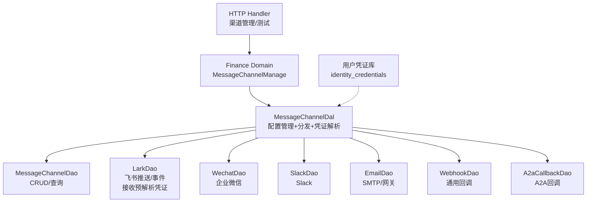
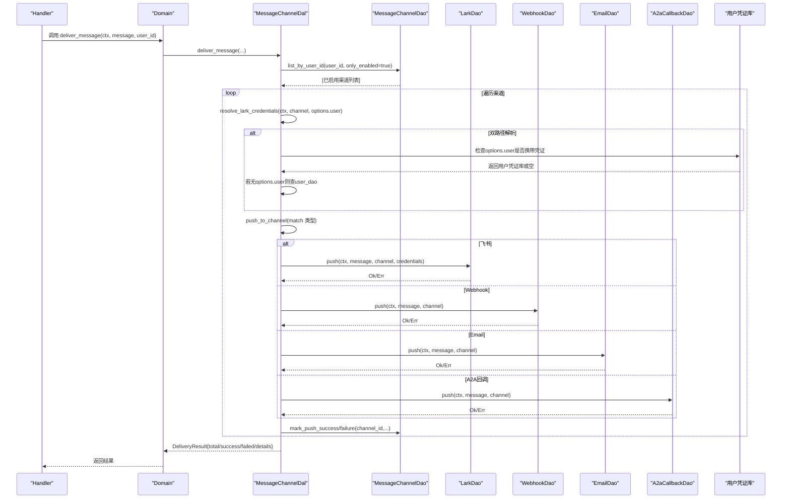
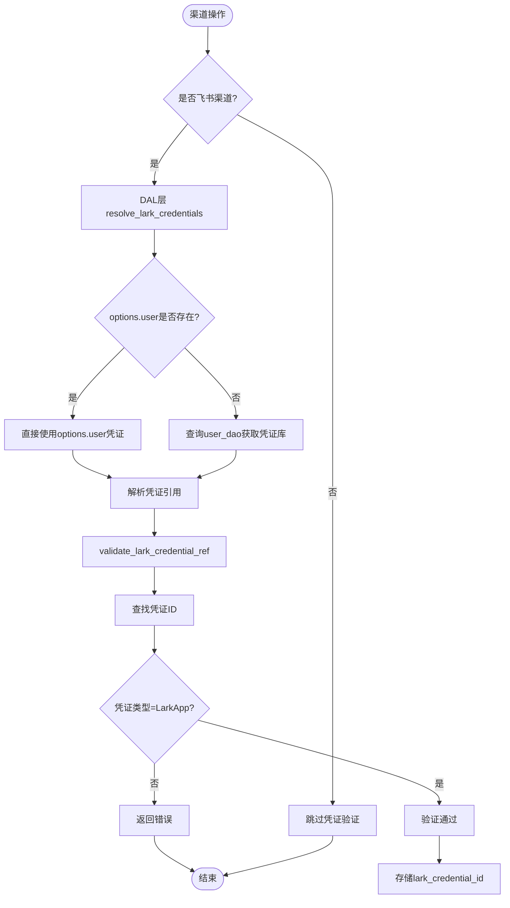
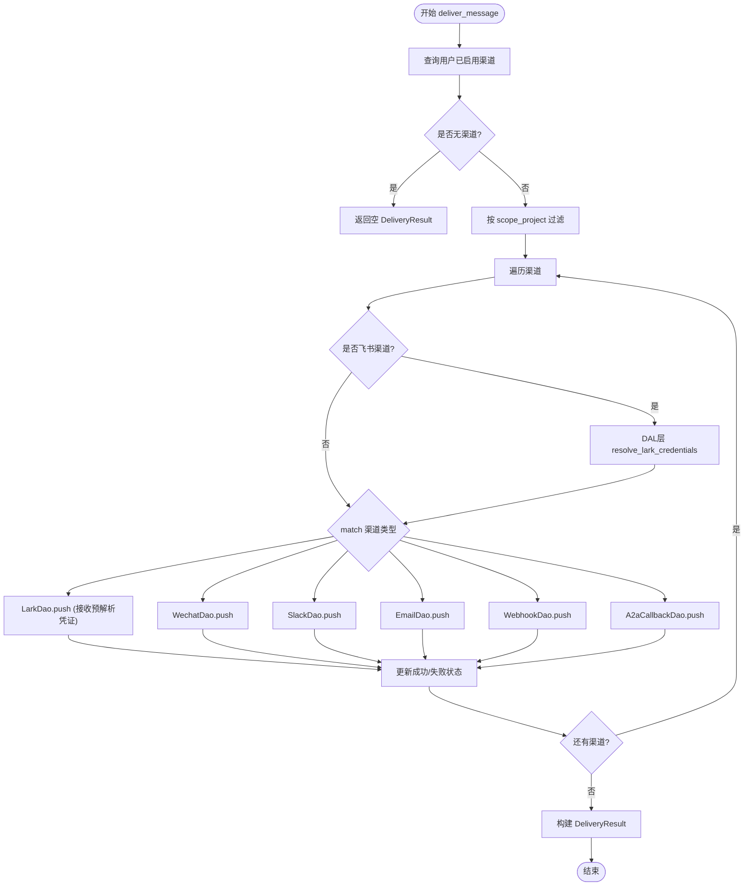
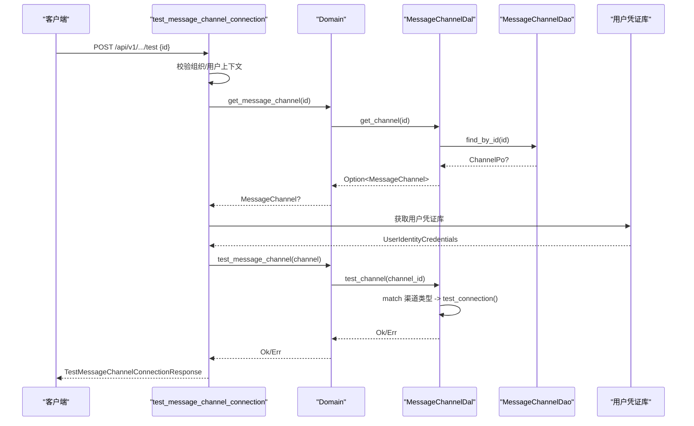
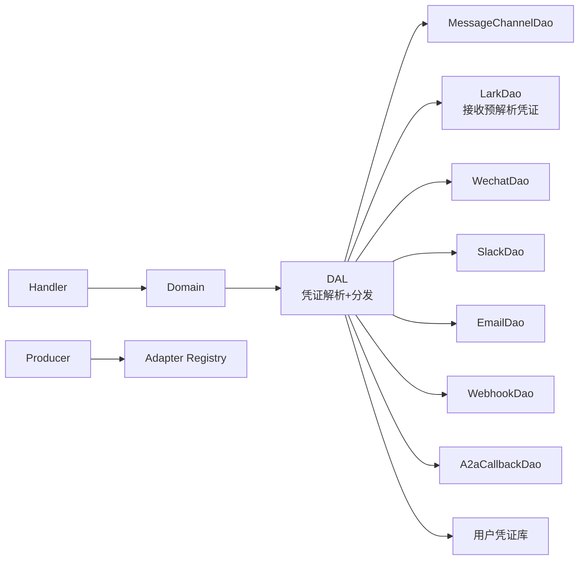

# 消息渠道管理（业务功能层）

<cite>
**本文引用的文件**
- [message_channel_design.md](docs/archive/design-archive/message_channel_design.md)
- [lark_cli_integration.md](docs/archive/design-archive/lark_cli_integration.md)
- [enums/message_channel.rs](common/src/enums/message_channel.rs)
- [models/message_channel.rs](src/models/message_channel.rs)
- [dal/message_channel.rs](src/service/dal/message_channel.rs)
- [domain/finance/message_channel.rs](src/service/domain/finance/message_channel.rs)
- [domain/finance/identity_credential.rs](src/service/domain/finance/identity_credential.rs)
- [handlers/finance/message_channel/test_message_channel_connection.rs](src/handlers/finance/message_channel/test_message_channel_connection.rs)
- [dao/lark/mod.rs](src/service/dao/lark/mod.rs)
- [dao/webhook/mod.rs](src/service/dao/webhook/mod.rs)
- [dao/email/mod.rs](src/service/dao/email/mod.rs)
- [producer/message_channel.rs](src/producer/message_channel.rs)
- [pkg/stats/mod.rs](src/pkg/stats/mod.rs)
- [testing_guidelines.md](docs/testing_guidelines.md)
- [identity_credentials.rs](common/src/models/identity_credentials.rs)（resolve_lark_credential_ref / resolve_github_credential）
- [pkg/crypto.rs](src/pkg/crypto.rs)（decrypt_channel_secret 唯一解密点）
- [lark.rs](src/service/dal/lark.rs)
- [create_message_channel.rs](src/handlers/finance/message_channel/create_message_channel.rs)
- [response.rs](src/handlers/finance/message_channel/response.rs)
- [20260812000000_users_identity_credentials.sql](migrations/20260812000000_users_identity_credentials.sql)
- [user.rs](src/service/dal/user.rs)
- [delivery.rs](src/service/domain/message/delivery.rs)

**本文关联三类文档**
- 【① Design 决策快照】
  - [message_channel_design.md](docs/archive/design-archive/message_channel_design.md) — 渠道引用检查、凭证加密、入站适配中台
  - [lark_cli_integration.md](docs/archive/design-archive/lark_cli_integration.md) — 飞书 WS 监听移交、WS 指数退避
- 【② Plan 落地快照（真实定稿）】
  - [身份凭证Domain统一CRUD重构.md](docs/archive/plan-archive/身份凭证Domain统一CRUD重构.md) — resolve_lark_credential_ref 统一校验入口 + 渠道引用前置检查
  - [飞书P2P消息集成.md](docs/archive/plan-archive/飞书P2P消息集成.md) — v4 AOP 入站中台落地 + 飞书私信双向闭环
  - [lark-cli_集成二期.md](docs/archive/plan-archive/lark-cli_集成二期.md) — 凭证用户级 + OAuth 身份 + WS 稳定性增强
- 【④ RAG 原子知识卡】
  - [身份凭证模型层信息下沉：CredentialDetail 行为 + CredentialDetailPatch 补丁语义 + 默认槽位独立](docs/wiki/knowledge/zh/身份凭证模型层信息下沉：CredentialDetail%20行为%20+%20CredentialDetailPatch%20补丁语义%20+%20默认槽位独立/身份凭证模型层信息下沉：CredentialDetail%20行为%20+%20CredentialDetailPatch%20补丁语义%20+%20默认槽位独立.md)
  - [身份凭证 Domain 统一 CRUD：5 类型无关方法 + 2 Command + match kind 分发生命周期副作用](docs/wiki/knowledge/zh/身份凭证%20Domain%20统一%20CRUD：5%20类型无关方法%20+%202%20Command%20+%20match%20kind%20分发生命周期副作用/身份凭证%20Domain%20统一%20CRUD：5%20类型无关方法%20+%202%20Command%20+%20match%20kind%20分发生命周期副作用.md)
  - [AES-256-GCM 敏感字段加密：encrypt_channel_secret 闭包注入 + 加密原语位置 + 版本兼容](docs/wiki/knowledge/zh/AES-256-GCM%20敏感字段加密：encrypt_channel_secret%20闭包注入%20+%20加密原语位置%20+%20版本兼容/AES-256-GCM%20敏感字段加密：encrypt_channel_secret%20闭包注入%20+%20加密原语位置%20+%20版本兼容.md)
  - 【Batch4 新增 2 张】
  - [消息渠道入站适配中台：MessageInboundAdapter trait + MessageAdapterRegistry 全局注册 + start_all stop_all 生命周期](docs/wiki/knowledge/zh/消息渠道入站适配中台：MessageInboundAdapter%20trait%20+%20MessageAdapterRegistry%20全局注册%20+%20start_all%20stop_all%20生命周期/消息渠道入站适配中台：MessageInboundAdapter%20trait%20+%20MessageAdapterRegistry%20全局注册%20+%20start_all%20stop_all%20生命周期.md) — pkg/adapter 纯基础设施抽象 + 渠道生命周期统一管理
  - [Lark P2P WS 私信入站：身份凭证引用解析 + app_id 聚合 WS + open_id 自动映射 + LarkWsMetrics 健康指标](docs/wiki/knowledge/zh/Lark%20P2P%20WS%20私信入站：身份凭证引用解析%20+%20app_id%20聚合%20WS%20+%20open_id%20自动映射%20+%20LarkWsMetrics%20健康指标/Lark%20P2P%20WS%20私信入站：身份凭证引用解析%20+%20app_id%20聚合%20WS%20+%20open_id%20自动映射%20+%20LarkWsMetrics%20健康指标.md) — 三级凭证引用解析 + app_id 连接聚合 + open_id→内部用户映射
- 【③ Wiki 关联长文】
  - [身份凭证管理（统一 Domain CRUD 加密存储与生命周期联动）.md](docs/wiki/zh/content/核心模块/服务层/领域层/财务领域/身份凭证管理（统一%20Domain%20CRUD%20加密存储与生命周期联动）.md) — 完整身份凭证链路（Batch2 新建长文）
  - [飞书集成系统.md](docs/wiki/zh/content/核心模块/服务层/领域层/财务领域/飞书集成系统.md) — Lark 凭证变更 WS 移交细节 + 健康指标聚合
  - [消息渠道适配器.md](docs/wiki/zh/content/项目概述/核心功能特性/多渠道消息系统/消息渠道适配器.md) — 入站适配中台 + 出站推送完整架构
</cite>

## 更新摘要
**所做更改**
- 重大架构变更：凭证解析逻辑从DAO层迁移到DAL层，实现职责分离和性能优化
- 新增双路径凭证解析机制（options.user优先 + user dao兜底），消除N+1查询问题
- 用户级身份凭证库支持：users表JSON列存储，支持多种凭证类型统一管理
- 更新各组件职责说明，明确DAL层负责凭证解析，DAO层专注协议实现
- 增强故障排查指南，包含新架构下的问题诊断方法

**Batch2 2026-08-15 增量同步**：针对飞书渠道创建/更新流程调用 `UserIdentityCredentials.resolve_lark_credential_ref` 作为「凭证存在+类型匹配」唯一校验入口、渠道建联流程 decrypt_channel_secret 是唯一解密点、Lark 凭证 delete_credential 前置检查渠道引用报 Conflict 拒删 3 项增量完成同步。cite 区补 4 类互引闭环。§5 新增「飞书渠道 resolve_lark_credential_ref 统一校验入口」小节。§8 Troubleshooting 补 1 条。

## 目录
1. [简介](#简介)
2. [项目结构](#项目结构)
3. [核心组件](#核心组件)
4. [架构总览](#架构总览)
5. [详细组件分析](#详细组件分析)
6. [依赖关系分析](#依赖关系分析)
7. [性能与并发](#性能与并发)
8. [故障排查指南](#故障排查指南)
9. [结论](#结论)
10. [附录：配置模板与示例](#附录：配置模板与示例)

## 简介
本文件面向"消息渠道管理"能力，覆盖多渠道（HTTP、WebSocket、SSE、邮件等）的创建、配置、管理与监控。**重大架构更新**：现已完成凭证解析架构重构，将凭证解析逻辑从DAO层迁移至DAL层，通过`resolve_lark_credentials`方法实现双路径凭证解析机制（优先使用options.user提供的凭证，否则查询用户身份凭证）。新增用户级身份凭证库存储在users表的JSON列中，实现了凭证与渠道的解耦设计，显著提升了飞书渠道的安全性和可维护性。**最新变更**包括：
- DAL层统一凭证解析：通过双路径机制优化性能，避免重复数据库查询
- 用户级凭证库：统一管理飞书等外部平台的认证信息
- 职责清晰分离：DAL层负责业务逻辑，DAO层专注协议实现
- 连接测试、错误聚合与失败隔离
- SSE 推送集成与订阅端点
- 多渠道路由、消息分发与结果聚合
- 安全认证、访问控制与流量限制建议
- 热插拔、动态配置与版本兼容性策略
- 性能监控、错误统计与告警通知机制

> 📌 视角说明（AGENTS §2.1.3 Level 3 互补视角平行卡）：
> 本长文是「消息渠道管理」主题的 **业务功能层** 视角。同主题还有以下平行视角卡，请按需交叉阅读：
> - [消息渠道管理（前端 UI 层）](docs/wiki/zh/content/前端应用/页面模块/Finance%20管理页面/消息渠道管理.md)

## 项目结构
消息渠道管理遵循严格四层单向调用：Adapter（Handler/回调）→ Domain → DAL → DAO。**重大架构变更**：凭证解析逻辑已从DAO层迁移至DAL层，实现了更清晰的职责分离和更好的性能优化。DAL层现负责完整的凭证解析流程，包括双路径解析机制；DAO层接口已简化为直接接收预解析的凭证参数。



**图表来源**
- [dal/message_channel.rs:60-126](src/service/dal/message_channel.rs#L60-L126)
- [dal/message_channel.rs:130-142](src/service/dal/message_channel.rs#L130-L142)
- [dal/message_channel.rs:202-222](src/service/dal/message_channel.rs#L202-L222)
- [dal/message_channel.rs:299-313](src/service/dal/message_channel.rs#L299-L313)
- [identity_credentials.rs:11-19](common/src/models/identity_credentials.rs#L11-L19)

**章节来源**
- [message_channel_design.md:235-320](docs/message_channel_design.md#L235-L320)
- [dal/message_channel.rs:1-126](src/service/dal/message_channel.rs#L1-L126)

## 核心组件
- 渠道类型与状态枚举：定义支持的渠道类型与生命周期状态，提供字符串化与序列化能力。
- 渠道实体与持久化对象：封装渠道配置、范围、状态迁移与时间戳。
- **新增**：用户身份凭证库：存储在users表的JSON列中，支持多种凭证类型的统一管理。
- **更新**：DAL 统一入口：集中处理渠道 CRUD、状态切换、连接测试、消息分发与**凭证解析**。
- **新增**：凭证解析器：在DAL层通过`resolve_lark_credentials`方法实现双路径凭证解析。
- 各渠道 DAO：各自负责协议细节（HTTP/WebSocket/SMTP/A2A），对外暴露 push/test_connection，**不再负责凭证解析**。
- Handler 管理面：提供创建、查询、更新、删除、状态切换与连接测试 API。
- 生产者与适配器：启动/停止外部渠道适配器（如飞书 WebSocket 事件监听）。

**章节来源**
- [enums/message_channel.rs:9-28](common/src/enums/message_channel.rs#L9-L28)
- [enums/message_channel.rs:82-122](common/src/enums/message_channel.rs#L82-L122)
- [models/message_channel.rs:19-113](src/models/message_channel.rs#L19-L113)
- [models/message_channel.rs:115-195](src/models/message_channel.rs#L115-L195)
- [identity_credentials.rs:11-77](common/src/models/identity_credentials.rs#L11-L77)
- [dal/message_channel.rs:60-126](src/service/dal/message_channel.rs#L60-L126)
- [domain/finance/message_channel.rs:11-72](src/service/domain/finance/message_channel.rs#L11-L72)
- [handlers/finance/message_channel/test_message_channel_connection.rs:1-57](src/handlers/finance/message_channel/test_message_channel_connection.rs#L1-L57)
- [producer/message_channel.rs:93-115](src/producer/message_channel.rs#L93-L115)

## 架构总览
DAL 通过纯 match 将消息分发到具体渠道 DAO，失败不阻断其他渠道；同时记录成功/失败并更新渠道最后推送时间与错误信息。SSE 作为内置推送通道，与外部渠道并行工作。**重大架构更新**：凭证解析逻辑已迁移至DAL层，通过`resolve_lark_credentials`方法实现双路径解析机制，显著提升了性能和可维护性。



**图表来源**
- [dal/message_channel.rs:226-284](src/service/dal/message_channel.rs#L226-L284)
- [dal/message_channel.rs:299-335](src/service/dal/message_channel.rs#L299-L335)
- [dal/message_channel.rs:312-328](src/service/dal/message_channel.rs#L312-L328)
- [lark.rs:250-296](src/service/dal/lark.rs#L250-L296)

## 详细组件分析

### 渠道类型与状态
- ChannelType：支持 Lark、Wechat、Slack、Email、Webhook、A2aCallback。
- ChannelStatus：Deleted、Active、Disabled，并提供状态迁移规则与可用目标集合。

**章节来源**
- [enums/message_channel.rs:9-28](common/src/enums/message_channel.rs#L9-L28)
- [enums/message_channel.rs:82-122](common/src/enums/message_channel.rs#L82-L122)
- [models/message_channel.rs:67-107](src/models/message_channel.rs#L67-L107)

### 渠道实体与配置
- MessageChannelPo：包含组织/用户/Agent 绑定、渠道类型、名称、webhook_url、access_token、secret、config_json、scope_project、last_pushed_at、last_error 等。
- ChannelConfig：**重大更新**：新增 `lark_credential_id` 字段用于凭证引用，移除了内联的飞书应用凭证字段，实现了凭证与渠道的解耦。

**章节来源**
- [models/message_channel.rs:115-195](src/models/message_channel.rs#L115-L195)
- [models/message_channel.rs:197-255](src/models/message_channel.rs#L197-L255)

### 用户级凭证库
**新增功能**：用户身份凭证库存储在 users 表的 `identity_credentials` JSON 列中，支持多种凭证类型的统一管理：

| 信息 | 存储位置 | 维度 | 说明 |
|------|----------|------|------|
| 应用凭证（app_id/secret） | **users 表新增 `identity_credentials` JSON 列** | 用户级 | 绑定关系唯一事实源；Settings 绑定页管理 |
| 渠道 ↔ 凭证 | `ChannelConfig.lark_credential_id` 引用 | 渠道级 | 飞书共用凭证只留引用；**内联凭证字段删除，无兼容回退路径** |
| 用户 OAuth token | lark-cli per-user HOME 自管 | 用户维度（文件系统） | 不落 DB；后端经 `auth status --json` 实时查状态 |

**章节来源**
- [identity_credentials.rs:11-77](common/src/models/identity_credentials.rs#L11-L77)
- [20260812000000_users_identity_credentials.sql:1-12](migrations/20260812000000_users_identity_credentials.sql#L1-L12)

### 凭证引用机制与DAL层解析
**重大架构更新**：凭证解析逻辑已从DAO层迁移到DAL层，通过`resolve_lark_credentials`方法实现双路径解析机制：

1. **双路径解析**：
   - 路径1：优先使用`options.user`已携带的凭证（免重复查库）
   - 路径2：若options无用户信息，则通过user_dao按渠道归属用户查询凭证库

2. **职责分离**：
   - DAL层：负责凭证解析、渠道分发、状态管理
   - DAO层：专注协议实现，接收预解析的凭证执行出站调用

3. **性能优化**：同一批渠道扫描中同用户只查一次凭证库，消除N+1查询问题



**图表来源**
- [dal/message_channel.rs:312-328](src/service/dal/message_channel.rs#L312-L328)
- [create_message_channel.rs:15-29](src/handlers/finance/message_channel/create_message_channel.rs#L15-L29)
- [identity_credentials.rs:54-77](common/src/models/identity_credentials.rs#L54-L77)

**章节来源**
- [dal/message_channel.rs:312-328](src/service/dal/message_channel.rs#L312-L328)
- [create_message_channel.rs:15-29](src/handlers/finance/message_channel/create_message_channel.rs#L15-L29)
- [identity_credentials.rs:54-77](common/src/models/identity_credentials.rs#L54-L77)

### DAL 统一分发与连接测试
**重大更新**：DAL层现负责完整的凭证解析流程，包括双路径解析机制。

- 配置管理：create/update/delete/get/list/query/status。
- 连接测试：根据渠道类型匹配对应 DAO 的 test_connection。
- 消息分发：查询用户已启用渠道，按 scope_project 过滤后逐个推送，记录详情并更新状态。
- **新增**：凭证解析：在推送前通过`resolve_lark_credentials`方法解析渠道引用的凭证，确保使用正确的认证信息。



**图表来源**
- [dal/message_channel.rs:226-284](src/service/dal/message_channel.rs#L226-L284)
- [dal/message_channel.rs:299-335](src/service/dal/message_channel.rs#L299-L335)
- [dal/message_channel.rs:347-356](src/service/dal/message_channel.rs#L347-L356)

**章节来源**
- [dal/message_channel.rs:60-126](src/service/dal/message_channel.rs#L60-L126)
- [dal/message_channel.rs:202-222](src/service/dal/message_channel.rs#L202-L222)
- [dal/message_channel.rs:226-284](src/service/dal/message_channel.rs#L226-L284)
- [dal/message_channel.rs:299-335](src/service/dal/message_channel.rs#L299-L335)

### 各渠道 DAO 职责
**重大更新**：各渠道DAO的职责更加清晰，飞书DAO不再负责凭证解析。

- 飞书（LarkDao）：出站消息推送、入站事件监听（WebSocket）、凭证获取与测试。**重要变更**：接口已简化为直接接收预解析的`LarkAppCredentials`参数，不再进行凭证解析。
- **更新**：飞书凭证解析：通过DAL层的`resolve_lark_credentials`函数完成，DAO层专注于协议实现。
- 通用 Webhook（WebhookDao）：HTTP 回调推送与连接测试。
- 邮件（EmailDao）：SMTP/邮件网关推送与连接测试。
- 其他渠道（Wechat/Slack/A2aCallback）：类似 push/test_connection 约定。

**章节来源**
- [dao/lark/mod.rs:53-88](src/service/dao/lark/mod.rs#L53-L88)
- [dao/lark/mod.rs:127-186](src/service/dao/lark/mod.rs#L127-L186)
- [dao/webhook/mod.rs:1-48](src/service/dao/webhook/mod.rs#L1-L48)
- [dao/email/mod.rs:1-47](src/service/dao/email/mod.rs#L1-L47)

### Handler 管理面与连接测试
- 管理面路由：创建、查询、更新、删除、状态切换、测试连接。
- 连接测试流程：解析请求上下文与权限 → 获取渠道 → 调用 Domain → 返回测试结果。
- **新增**：凭证关联：创建/更新渠道时自动关联用户凭证，支持凭证名称反查显示。



**图表来源**
- [handlers/finance/message_channel/test_message_channel_connection.rs:17-56](src/handlers/finance/message_channel/test_message_channel_connection.rs#L17-L56)
- [dal/message_channel.rs:202-222](src/service/dal/message_channel.rs#L202-L222)
- [response.rs:83-92](src/handlers/finance/message_channel/response.rs#L83-L92)

**章节来源**
- [handlers/finance/message_channel/test_message_channel_connection.rs:1-57](src/handlers/finance/message_channel/test_message_channel_connection.rs#L1-L57)
- [domain/finance/message_channel.rs:11-72](src/service/domain/finance/message_channel.rs#L11-L72)

### SSE 推送集成
- SSE 作为内置推送通道，与外部渠道并行；消费者在消息处理后调用 deliver_message，内部可结合 SSE 推送。
- 订阅端点：GET /api/v1/finance/messages/sse/{user_id}，建立流式响应。
- 集成测试覆盖 SSE 连通性与端到端内容验证。

**章节来源**
- [testing_guidelines.md:479-491](docs/testing_guidelines.md#L479-L491)
- [message_channel_design.md:23-36](docs/message_channel_design.md#L23-L36)

### 多渠道路由、消息分发与聚合
- 路由规则：按用户维度查询已启用渠道，并按 scope_project 进行项目级过滤。
- 分发策略：顺序遍历、逐个推送、失败隔离；每个渠道结果写入 details。
- 聚合指标：DeliveryResult.total/success/failed/sse_delivered 汇总统计。

**章节来源**
- [dal/message_channel.rs:226-284](src/service/dal/message_channel.rs#L226-L284)
- [dal/message_channel.rs:340-391](src/service/dal/message_channel.rs#L340-L391)

## 依赖关系分析
**重大更新**：依赖关系图反映了新的DAL层凭证解析架构。

- 单向依赖：Handler → Domain → DAL → DAO；DAL 内聚所有渠道 DAO，避免跨层耦合。
- 渠道 DAO 之间相互独立，新增渠道只需在 DAL 的 match 中增加分支。
- **更新**：凭证库依赖：DAL 层负责凭证解析，通过`resolve_lark_credentials`方法调用用户凭证库，形成新的依赖关系。
- 生产者/适配器：消息渠道生产者负责注册与启停外部适配器（如飞书事件监听）。



**图表来源**
- [dal/message_channel.rs:130-142](src/service/dal/message_channel.rs#L130-L142)
- [producer/message_channel.rs:93-115](src/producer/message_channel.rs#L93-L115)
- [lark.rs:250-296](src/service/dal/lark.rs#L250-L296)

**章节来源**
- [dal/message_channel.rs:130-142](src/service/dal/message_channel.rs#L130-L142)
- [producer/message_channel.rs:93-115](src/producer/message_channel.rs#L93-L115)

## 性能与并发
- 并发推送：DAL 对每个渠道顺序执行 push，但可在上层使用异步任务并发推送以提升吞吐（设计文档中建议使用 tokio::spawn 异步执行）。
- 失败隔离：单个渠道失败不影响其他渠道与主流程，错误信息聚合至 details。
- SSE 推送：基于广播通道，适合多订阅者场景；注意背压与丢帧处理。
- 统计与监控：使用 stats 模块记录运行时指标，便于观测渠道健康度与延迟分布。
- **重大更新**：凭证解析缓存：DAL层实现智能缓存机制，同一批渠道扫描中同用户只查一次凭证库，消除 N+1 查询问题，显著提升性能。

**章节来源**
- [message_channel_design.md:401-407](docs/message_channel_design.md#L401-L407)
- [dal/message_channel.rs:226-284](src/service/dal/message_channel.rs#L226-L284)
- [pkg/stats/mod.rs:1-57](src/pkg/stats/mod.rs#L1-L57)
- [lark.rs:184-197](src/service/dal/lark.rs#L184-L197)

## 故障排查指南
- 连接测试失败：检查渠道配置（token、secret、URL、SMTP 参数），调用 /test 接口定位具体错误。
- 推送失败聚合：查看 DeliveryResult.details 中的 error 字段，确认是否为 unsupported_operation 或网络不可达。
- SSE 订阅异常：确认订阅端点返回 200，检查后端广播通道与消费者是否正确调用 deliver_message。
- 日志与统计：结合 stats 模块与系统日志，定位慢调用与错误热点。
- **重大更新**：凭证相关问题：
  - 凭证引用无效：检查 `lark_credential_id` 是否存在且类型为 LarkApp
  - 凭证解析失败：查看DAL层日志，确认双路径解析是否正常工作
  - 权限问题：确认当前用户有权限访问该凭证
  - 性能问题：检查是否存在N+1查询问题，确认凭证库缓存是否生效
  - 选项传递问题：确认ChannelPushOptions.user是否正确传递到DAL层

**章节来源**
- [dal/message_channel.rs:202-222](src/service/dal/message_channel.rs#L202-L222)
- [dal/message_channel.rs:315-335](src/service/dal/message_channel.rs#L315-L335)
- [testing_guidelines.md:479-491](docs/testing_guidelines.md#L479-L491)
- [pkg/stats/mod.rs:152-171](src/pkg/stats/mod.rs#L152-L171)
- [identity_credentials.rs:54-77](common/src/models/identity_credentials.rs#L54-L77)

## 结论
消息渠道管理以 DAL 为统一入口，采用纯 match 分发到独立 DAO，实现高内聚低耦合与编译期安全。**重大架构更新**：凭证解析逻辑已从DAO层迁移至DAL层，通过`resolve_lark_credentials`方法实现双路径解析机制，显著提升了性能和可维护性。新增的用户级凭证库统一管理飞书等外部平台的认证信息，配合智能缓存机制消除了N+1查询问题。通过连接测试、失败聚合与 SSE 推送，形成完整的渠道生命周期管理能力。配合 stats 监控与集成测试，保障多渠道稳定运行与持续演进。

## 附录：配置模板与示例
- 渠道配置模板（ChannelConfig）：
  - **重大更新**：飞书：`lark_credential_id`（凭证引用ID）、`lark_identity_mode`、`lark_open_id`、`lark_user_name`、`lark_listen_inbound`
  - 微信：wechat_app_id、wechat_app_secret、wechat_open_id
  - 邮件：email_smtp_host、email_smtp_port、email_username、email_password、email_from_address、email_to_address
  - Slack：slack_bot_token、slack_channel_id
  - Webhook：webhook_method、webhook_headers、webhook_body_template
  - 扩展：extra

- **新增**：用户凭证库结构：
  ```json
  {
    "items": [
      {
        "id": "credential-id",
        "kind": "lark_app",
        "name": "凭证名称",
        "created_at": "2026-01-01T00:00:00Z",
        "updated_at": "2026-01-01T00:00:00Z",
        "detail": {
          "type": "lark_app",
          "app_id": "cli_xxx",
          "app_secret": "enc:v1:secret",
          "encrypt_key": "enc:v1:key",
          "verification_token": null
        }
      }
    ],
    "default_credential_id": "credential-id"
  }
  ```

- 连接测试示例：
  - 调用 POST /api/v1/.../test，传入渠道 ID，返回 success/error。

- 多渠道路由示例：
  - 用户全局渠道（scope_project=NULL）接收所有项目消息；项目级渠道仅接收指定项目消息。

- 故障转移与降级：
  - 某渠道失败不影响其他渠道；可结合重试队列与告警策略实现自动恢复。

**章节来源**
- [models/message_channel.rs:197-255](src/models/message_channel.rs#L197-L255)
- [identity_credentials.rs:11-119](common/src/models/identity_credentials.rs#L11-L119)
- [handlers/finance/message_channel/test_message_channel_connection.rs:17-56](src/handlers/finance/message_channel/test_message_channel_connection.rs#L17-L56)
- [dal/message_channel.rs:243-256](src/service/dal/message_channel.rs#L243-L256)