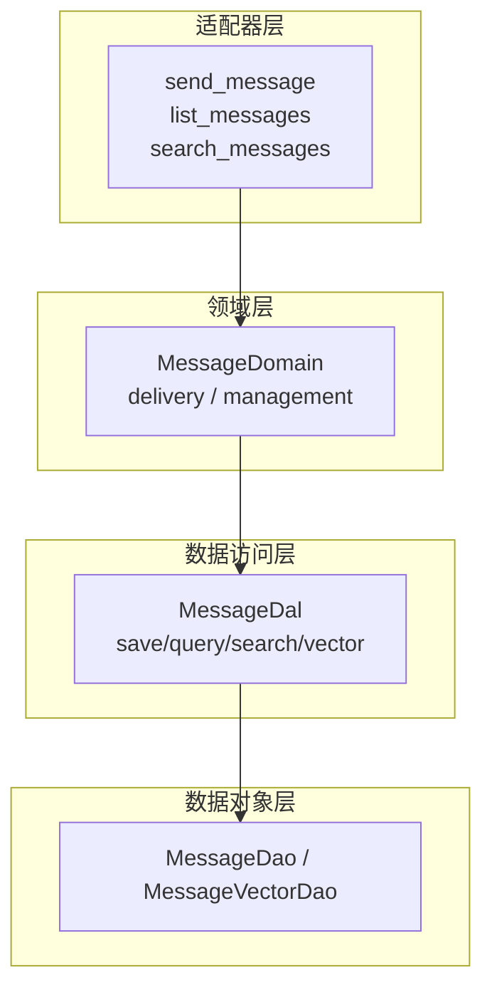
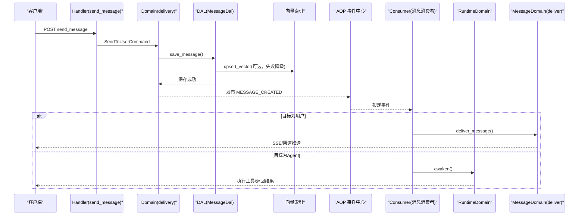
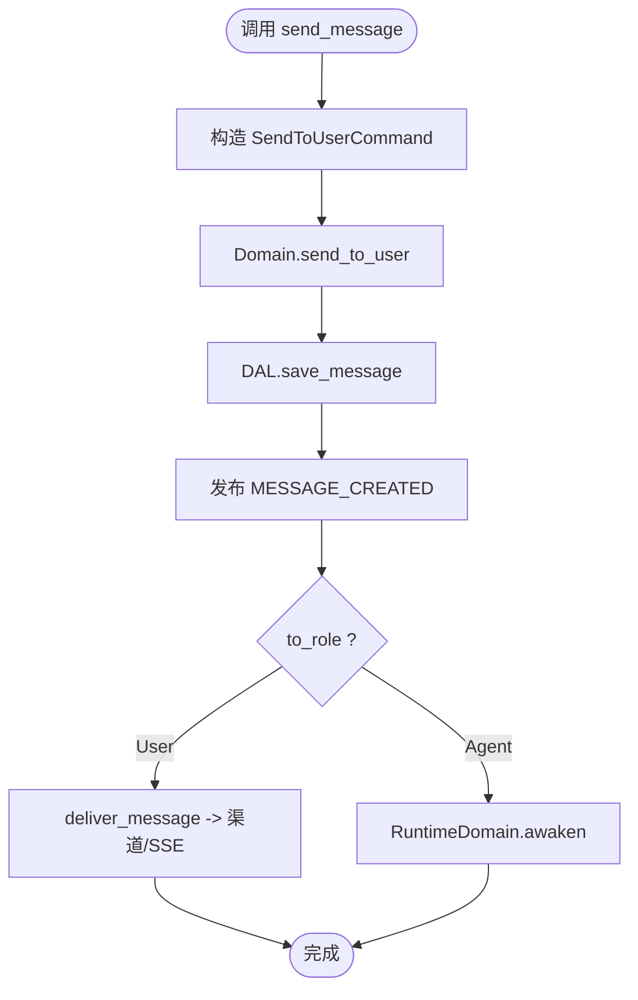
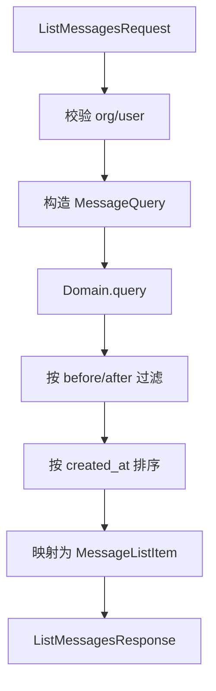
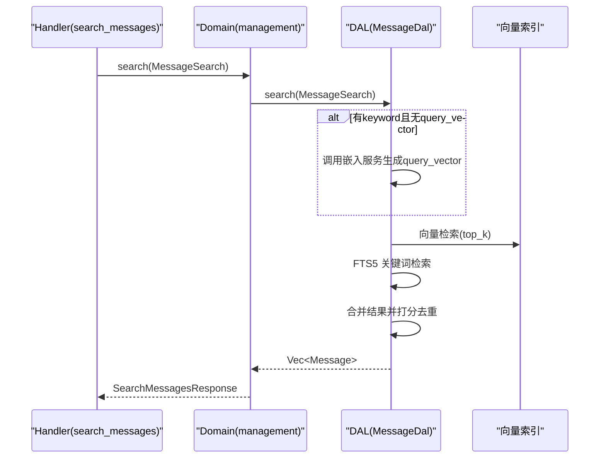
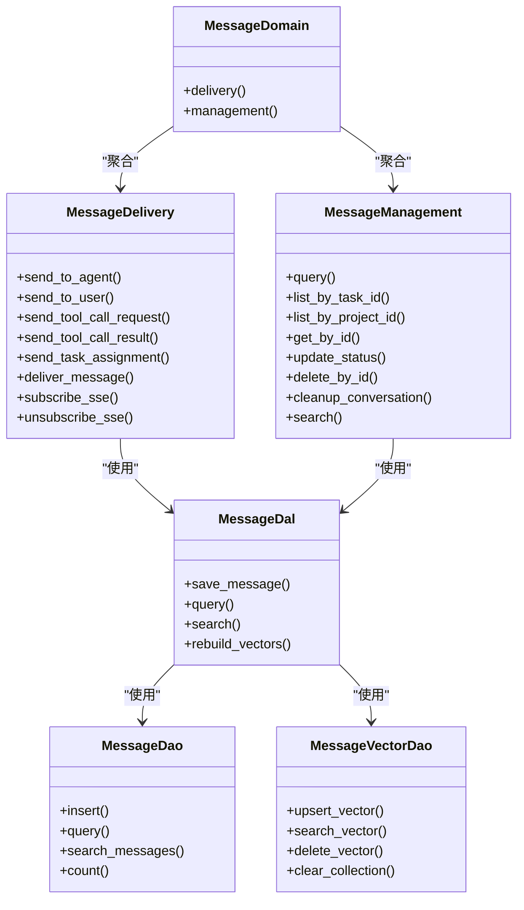

# 消息管理

<cite>
**本文引用的文件**
- [send_message.rs](src/handlers/finance/message/send_message.rs)
- [list_messages.rs](src/handlers/finance/message/list_messages.rs)
- [search_messages.rs](src/handlers/finance/message/search_messages.rs)
- [message_domain_mod.rs](src/service/domain/message/mod.rs)
- [delivery.rs](src/service/domain/message/delivery.rs)
- [management.rs](src/service/domain/message/management.rs)
- [message_dal.rs](src/service/dal/message.rs)
- [message_model.rs](src/models/message.rs)
- [message_enums.rs](common/src/enums/message.rs)
- [message_api.rs](common/src/api/message.rs)
- [message_consumer.rs](src/consumer/message.rs)
- [message_dao_mod.rs](src/service/dao/message/mod.rs)
- [消息交互与SSE推送：MessageDomain delivery+management 双能力 + AgentLoopConsumer 循环驱动 + 多渠道出站（飞书/Slack/Email/Webhook/微信）](docs/wiki/knowledge/zh/消息交互与SSE推送：MessageDomain双能力 + AgentLoopConsumer循环 + 多渠道出站5类/消息交互与SSE推送：MessageDomain双能力 + AgentLoopConsumer循环 + 多渠道出站5类.md)
</cite>

## 目录
1. [简介](#简介)
2. [项目结构](#项目结构)
3. [核心组件](#核心组件)
4. [架构总览](#架构总览)
5. [详细组件分析](#详细组件分析)
6. [依赖关系分析](#依赖关系分析)
7. [性能与高并发](#性能与高并发)
8. [故障排查指南](#故障排查指南)
9. [结论](#结论)
10. [附录：接口与示例](#附录接口与示例)

## 简介
本文件围绕“消息管理”能力，系统化说明消息的创建、查询、搜索与生命周期管理。重点覆盖以下接口与流程：
- 发送消息（send_message）
- 消息列表查询（list_messages）
- 混合搜索（search_messages：FTS5 关键词 + 向量语义）
并补充消息格式规范、状态流转、优先级处理、模板化内容、批量操作、过滤条件、持久化与索引优化、归档策略、错误处理与重试机制、审计日志以及高并发与性能优化方案。

## 项目结构
消息功能遵循四层单向调用：Adapter（HTTP Handler / AOP Producer）→ Domain → DAL → DAO，禁止跨层调用与同层互调。Domain 对外暴露业务实体与内部事件；DAL 统一使用业务实体；DAO 仅面向 PO 对象。

**图表来源**
- [send_message.rs:1-41](src/handlers/finance/message/send_message.rs#L1-L41)
- [list_messages.rs:1-122](src/handlers/finance/message/list_messages.rs#L1-L122)
- [search_messages.rs:1-79](src/handlers/finance/message/search_messages.rs#L1-L79)
- [message_domain_mod.rs:1-378](src/service/domain/message/mod.rs#L1-L378)
- [message_dal.rs:1-580](src/service/dal/message.rs#L1-L580)
- [message_dao_mod.rs:1-229](src/service/dao/message/mod.rs#L1-L229)

**章节来源**
- [send_message.rs:1-41](src/handlers/finance/message/send_message.rs#L1-L41)
- [list_messages.rs:1-122](src/handlers/finance/message/list_messages.rs#L1-L122)
- [search_messages.rs:1-79](src/handlers/finance/message/search_messages.rs#L1-L79)
- [message_domain_mod.rs:1-378](src/service/domain/message/mod.rs#L1-L378)
- [message_dal.rs:1-580](src/service/dal/message.rs#L1-L580)
- [message_dao_mod.rs:1-229](src/service/dao/message/mod.rs#L1-L229)

## 核心组件
- 领域层（Domain）
  - delivery：负责消息投递（发送给用户/Agent、工具调用请求/结果、任务分配、渠道分发、SSE 推送）。
  - management：负责消息查询、更新、删除、清理对话、混合搜索。
- 数据访问层（DAL）
  - save_message：写入消息并异步构建向量索引（失败降级）。
  - query/search：组合查询与混合检索（FTS5 + 向量），支持业务过滤。
- 数据对象层（DAO）
  - MessageDao：消息 CRUD、统计、全文检索。
  - MessageVectorDao：向量索引 upsert/search/delete/clear。
- 模型与枚举
  - Message/MessagePo：业务实体与持久化对象，包含消息链 root_id/reply_to_id、组织隔离等。
  - MessageType/MessageRole/MessageStatus：类型、角色、状态。
- 消费者（Consumer）
  - 订阅 MESSAGE_CREATED 事件，按 to_role 分发到 RuntimeDomain 或 MessageDomain 进行后续处理。

**章节来源**
- [message_domain_mod.rs:1-378](src/service/domain/message/mod.rs#L1-L378)
- [message_dal.rs:1-580](src/service/dal/message.rs#L1-L580)
- [message_dao_mod.rs:1-229](src/service/dao/message/mod.rs#L1-L229)
- [message_model.rs:1-690](src/models/message.rs#L1-L690)
- [message_enums.rs:1-189](common/src/enums/message.rs#L1-L189)
- [message_consumer.rs:1-534](src/consumer/message.rs#L1-L534)

## 架构总览
消息从 HTTP Handler 进入，经 Domain 编排，DAL 落库并尝试构建向量索引；随后通过 AOP 发布事件，由 Consumer 消费并根据接收方角色路由到不同业务域。

**图表来源**
- [send_message.rs:1-41](src/handlers/finance/message/send_message.rs#L1-L41)
- [delivery.rs:160-208](src/service/domain/message/delivery.rs#L160-L208)
- [message_dal.rs:133-193](src/service/dal/message.rs#L133-L193)
- [message_consumer.rs:78-141](src/consumer/message.rs#L78-L141)

## 详细组件分析

### 发送消息（send_message）
- 入口：HTTP Handler 将参数转换为 SendToUserCommand，调用 Domain.delivery().send_to_user。
- 领域实现：生成消息 ID，计算 root_id（支持 reply_to_id 继承），构造 MessagePo，调用 DAL.save_message。
- 持久化：DAL 插入消息后发布 AOP 事件，并尝试构建向量索引（失败降级记录日志）。
- 后续：Consumer 收到事件，若 to_role=User，则走 deliver_message 推送至渠道与 SSE。

**图表来源**
- [send_message.rs:1-41](src/handlers/finance/message/send_message.rs#L1-L41)
- [delivery.rs:160-208](src/service/domain/message/delivery.rs#L160-L208)
- [message_dal.rs:133-193](src/service/dal/message.rs#L133-L193)
- [message_consumer.rs:98-141](src/consumer/message.rs#L98-L141)

**章节来源**
- [send_message.rs:1-41](src/handlers/finance/message/send_message.rs#L1-L41)
- [delivery.rs:160-208](src/service/domain/message/delivery.rs#L160-L208)
- [message_dal.rs:133-193](src/service/dal/message.rs#L133-L193)
- [message_consumer.rs:98-141](src/consumer/message.rs#L98-L141)

### 消息列表查询（list_messages）
- 入口：解析 ListMessagesRequest，校验组织与用户上下文，计算排序方向（after_timestamp 时 ASC，否则 DESC）。
- 查询：构造 MessageQuery 调用 Domain.management().query，再在 Handler 层根据 before/after 时间戳做二次过滤与排序。
- 响应：映射为 MessageListItem，附带附件元信息（当 file_type 存在时）。

**图表来源**
- [list_messages.rs:1-122](src/handlers/finance/message/list_messages.rs#L1-L122)
- [message_dao_mod.rs:9-57](src/service/dao/message/mod.rs#L9-L57)

**章节来源**
- [list_messages.rs:1-122](src/handlers/finance/message/list_messages.rs#L1-L122)
- [message_dao_mod.rs:9-57](src/service/dao/message/mod.rs#L9-L57)

### 混合搜索（search_messages）
- 入口：解析 SearchMessagesRequest，构造 MessageSearch（含 keyword、filters、top_k）。
- 领域/DAL：若有关键词且未提供 query_vector，自动调用嵌入服务生成查询向量；分别执行 FTS5 关键词检索与向量检索，合并结果并按权重打分去重。
- 响应：返回 MessageSearchResult，包含 match_type、fts_rank、vector_distance。

**图表来源**
- [search_messages.rs:1-79](src/handlers/finance/message/search_messages.rs#L1-L79)
- [message_dal.rs:357-396](src/service/dal/message.rs#L357-L396)
- [message_dal.rs:465-572](src/service/dal/message.rs#L465-L572)

**章节来源**
- [search_messages.rs:1-79](src/handlers/finance/message/search_messages.rs#L1-L79)
- [message_dal.rs:357-396](src/service/dal/message.rs#L357-L396)
- [message_dal.rs:465-572](src/service/dal/message.rs#L465-L572)

### 消息格式规范与模板
- 文本消息：content 存储完整文本。
- 附件消息：content 存储文件相对路径，file_meta 存储路径、大小、MIME 类型。
- 工具调用消息：content 为 ToolCallMessage JSON（请求/结果共用），支持大结果截断与 trace_ref。
- 任务分配消息：content 为 TaskAssignmentMessage JSON。
- Prompt 友好：MessagePo.to_prompt 输出结构化字段便于大模型识别。

**章节来源**
- [message_model.rs:18-127](src/models/message.rs#L18-L127)
- [message_model.rs:249-400](src/models/message.rs#L249-L400)
- [message_model.rs:402-571](src/models/message.rs#L402-L571)
- [message_model.rs:573-612](src/models/message.rs#L573-L612)

### 消息状态管理与优先级
- 状态：Recalled/Pending/Processing/Processed/Failed，用于事件总线恢复与重试。
- 优先级：默认优先级 5，可通过扩展覆盖。
- 消费者 ack/nack：成功标记 Processed，失败回退 Pending 触发重试。

**章节来源**
- [message_enums.rs:134-189](common/src/enums/message.rs#L134-L189)
- [message_model.rs:239-247](src/models/message.rs#L239-L247)
- [message_consumer.rs:114-141](src/consumer/message.rs#L114-L141)

### 消息生命周期与投递
- 创建：Handler → Domain → DAL → 持久化 → 发布事件。
- 消费：Consumer 根据 to_role 分发，用户消息走 deliver_message（多渠道+SSE），Agent 消息唤醒运行态。
- 投递：deliver_message 同时推送到配置渠道与 SSE，统计成功数。

**章节来源**
- [message_consumer.rs:78-141](src/consumer/message.rs#L78-L141)
- [delivery.rs:381-436](src/service/domain/message/delivery.rs#L381-L436)

### 消息模板与批量操作
- 模板：ToolCallMessage、TaskAssignmentMessage 作为标准内容模板，确保一致性与可追溯性。
- 批量：DAO 提供 list_by_status、count 等能力；Domain 支持 cleanup_conversation（按任务清空）。

**章节来源**
- [message_model.rs:402-571](src/models/message.rs#L402-L571)
- [message_model.rs:573-612](src/models/message.rs#L573-L612)
- [message_dao_mod.rs:138-176](src/service/dao/message/mod.rs#L138-L176)
- [management.rs:72-75](src/service/domain/message/management.rs#L72-L75)

### 消息过滤条件与分页
- 过滤：MessageQuery 支持 project/task/from/to/status/type/organization 等维度。
- 分页：limit/offset/order_by；list_messages 支持 before/after 时间戳双向翻页。

**章节来源**
- [message_dao_mod.rs:9-57](src/service/dao/message/mod.rs#L9-L57)
- [list_messages.rs:10-58](src/handlers/finance/message/list_messages.rs#L10-L58)

### 持久化存储与索引优化
- 持久化：SQLx SQLite，PO 直接落库。
- 索引：FTS5 全文检索 + 向量索引（LanceDB/HNSW/InMemory/SqliteVss 多后端降级）。
- 重建：rebuild_vectors 支持全量重建向量索引。

**章节来源**
- [message_dal.rs:398-445](src/service/dal/message.rs#L398-L445)
- [message_dal.rs:465-572](src/service/dal/message.rs#L465-L572)
- [message_dao_mod.rs:178-217](src/service/dao/message/mod.rs#L178-L217)

### 归档策略
- 逻辑删除：Recalled 状态表示不再显示和处理。
- 物理删除：delete_by_task_id 支持按任务清空（谨慎使用）。

**章节来源**
- [message_enums.rs:134-189](common/src/enums/message.rs#L134-L189)
- [message_dao_mod.rs:127-129](src/service/dao/message/mod.rs#L127-L129)

### 错误处理与重试机制
- 向量索引失败：记录警告并降级，不影响主流程。
- 投递失败：所有渠道失败返回错误，触发 nack 重试。
- 消费者重试：error_retry_sleep_ms 控制重试间隔。

**章节来源**
- [message_dal.rs:150-193](src/service/dal/message.rs#L150-L193)
- [message_consumer.rs:379-388](src/consumer/message.rs#L379-L388)
- [message_consumer.rs:138-141](src/consumer/message.rs#L138-L141)

### 审计日志
- 事件：MESSAGE_CREATED 事件包含消息关键元数据，便于追踪。
- 日志：向量索引相关操作记录 warn/debug 日志，便于定位问题。

**章节来源**
- [message_dal.rs:133-193](src/service/dal/message.rs#L133-L193)
- [message_consumer.rs:91-97](src/consumer/message.rs#L91-L97)

## 依赖关系分析

**图表来源**
- [message_domain_mod.rs:70-378](src/service/domain/message/mod.rs#L70-L378)
- [message_dal.rs:49-122](src/service/dal/message.rs#L49-L122)
- [message_dao_mod.rs:61-217](src/service/dao/message/mod.rs#L61-L217)

**章节来源**
- [message_domain_mod.rs:70-378](src/service/domain/message/mod.rs#L70-L378)
- [message_dal.rs:49-122](src/service/dal/message.rs#L49-L122)
- [message_dao_mod.rs:61-217](src/service/dao/message/mod.rs#L61-L217)

## 性能与高并发
- 消费者并发：concurrency=4，空队列休眠 100ms，错误重试间隔 1000ms。
- 向量索引：写入失败降级，避免阻塞主流程；重建支持批量处理。
- 搜索合并：关键词权重 0.7，向量权重 0.3，去重后取 top_k。
- 建议：
  - 合理设置 limit/top_k，避免过大结果集。
  - 对高频查询建立合适索引（created_at、project_id、task_id、status_in）。
  - 向量后端选择与缓存策略结合，降低延迟。

**章节来源**
- [message_consumer.rs:130-141](src/consumer/message.rs#L130-L141)
- [message_dal.rs:520-572](src/service/dal/message.rs#L520-L572)

## 故障排查指南
- 向量索引失败：检查嵌入 Provider 配置与网络，查看 warn 日志。
- 投递失败：确认渠道配置与 SSE 连接，关注 success/sse_delivered 计数。
- Agent 忙碌：Busy 状态冲突会触发重试，检查 Agent 运行态与任务状态。
- 搜索结果为空：确认 FTS5 索引与向量索引是否就绪，必要时执行 rebuild_vectors。

**章节来源**
- [message_dal.rs:150-193](src/service/dal/message.rs#L150-L193)
- [message_consumer.rs:379-388](src/consumer/message.rs#L379-L388)
- [message_consumer.rs:150-196](src/consumer/message.rs#L150-L196)

## 结论
消息系统以清晰的层次划分与事件驱动为核心，实现了高内聚的消息创建、查询、搜索与投递能力。通过 FTS5 与向量索引的混合检索、稳健的重试与降级机制、以及可扩展的渠道与 SSE 推送，满足高并发与高性能场景需求。建议在业务侧合理使用过滤条件与分页，并结合索引与缓存策略进一步优化体验。

## 附录：接口与示例
- 发送消息
  - 请求体：SendMessageParams（to_user_id、content、project_id、task_id、reply_to_id）
  - 响应：SendMessageResponse（message_id）
  - 参考：[send_message.rs:1-41](src/handlers/finance/message/send_message.rs#L1-L41)

- 消息列表
  - 请求参数：ListMessagesRequest（project_id、task_id、from_id、to_id、before_timestamp、after_timestamp、limit）
  - 响应：ListMessagesResponse（messages、total）
  - 参考：[list_messages.rs:1-122](src/handlers/finance/message/list_messages.rs#L1-L122)、[message_api.rs:7-102](common/src/api/message.rs#L7-L102)

- 混合搜索
  - 请求体：SearchMessagesRequest（keyword、project_id、task_id、from_id、to_id、limit）
  - 响应：SearchMessagesResponse（messages、total）
  - 参考：[search_messages.rs:1-79](src/handlers/finance/message/search_messages.rs#L1-L79)、[message_api.rs:104-172](common/src/api/message.rs#L104-L172)

- 过滤与分页示例
  - 按项目/任务/发送方/接收方过滤，结合 before/after 时间戳实现上拉/下拉翻页。
  - 参考：[message_dao_mod.rs:9-57](src/service/dao/message/mod.rs#L9-L57)、[list_messages.rs:10-58](src/handlers/finance/message/list_messages.rs#L10-L58)

- 批量操作示例
  - 按状态查询：list_by_status
  - 统计数量：count
  - 清理对话：cleanup_conversation
  - 参考：[message_dao_mod.rs:138-176](src/service/dao/message/mod.rs#L138-L176)、[management.rs:72-75](src/service/domain/message/management.rs#L72-L75)

- 消息模板示例
  - 工具调用：ToolCallMessage（请求/结果）
  - 任务分配：TaskAssignmentMessage
  - 参考：[message_model.rs:402-571](src/models/message.rs#L402-L571)、[message_model.rs:573-612](src/models/message.rs#L573-L612)