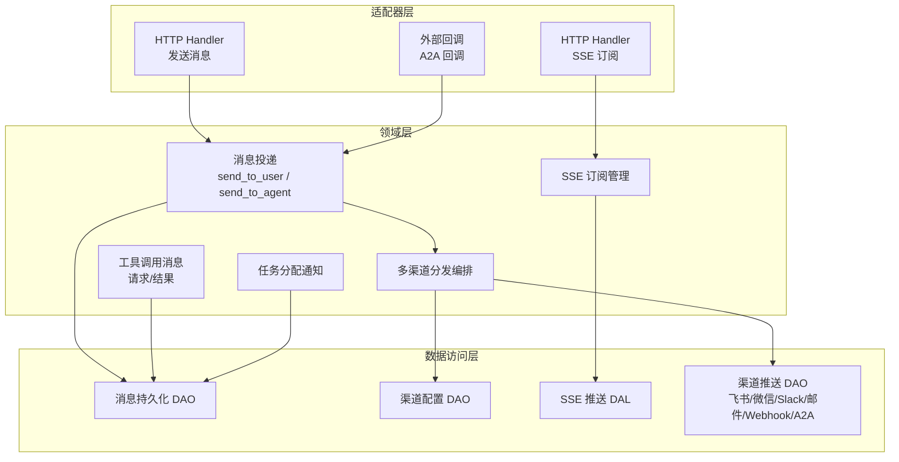
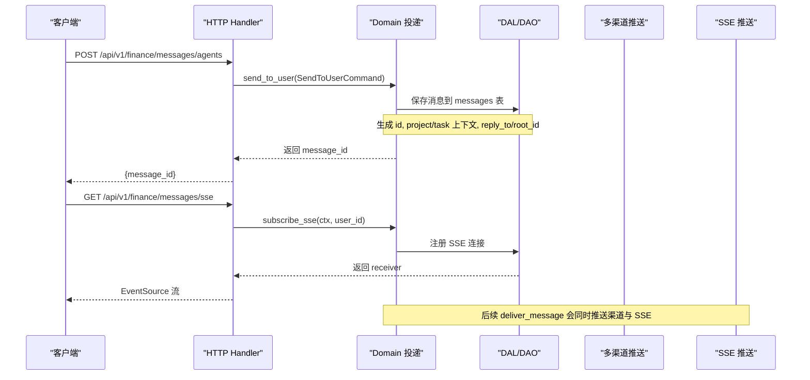
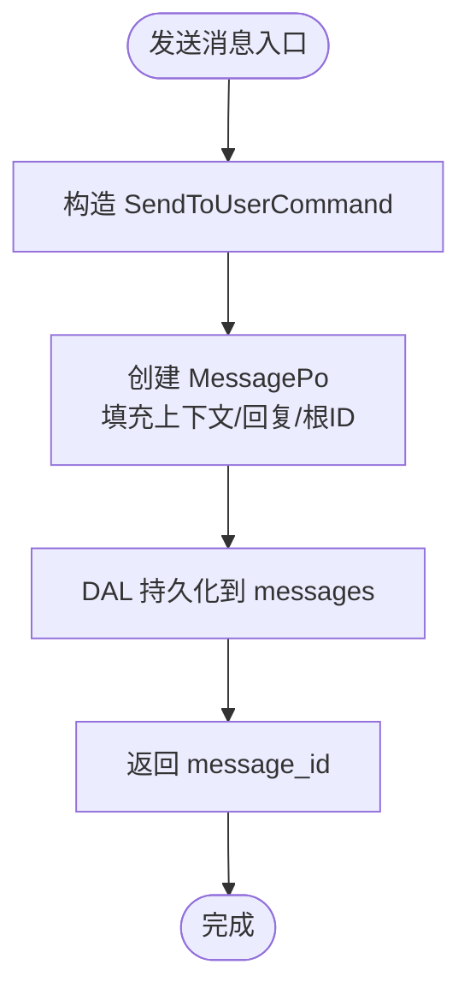
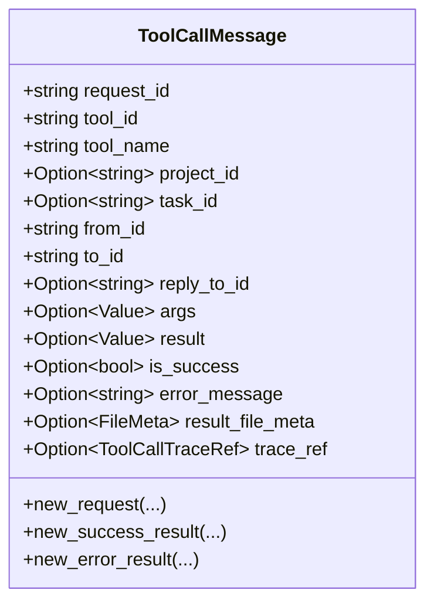
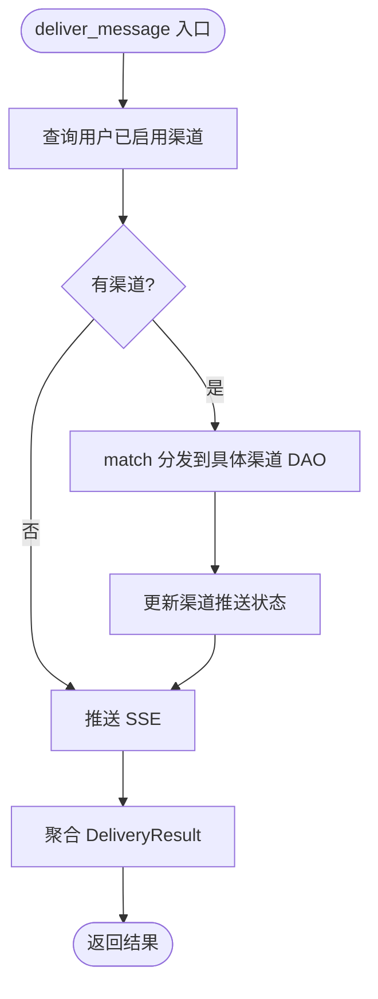
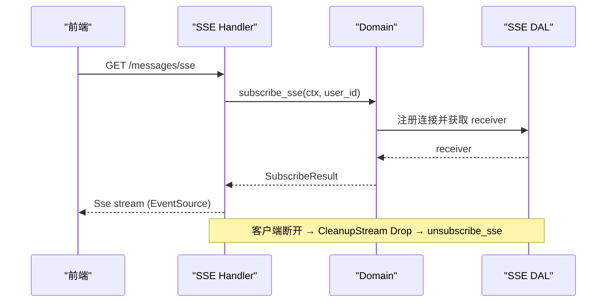
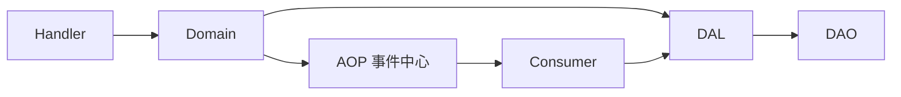

# 消息系统（业务功能层）

<cite>
**本文引用的文件**
- [send_message.rs](src/handlers/finance/message/send_message.rs)
- [subscribe_sse.rs](src/handlers/finance/message/subscribe_sse.rs)
- [delivery.rs](src/service/domain/message/delivery.rs)
- [message.rs](src/models/message.rs)
- [message_channel.rs](src/models/message_channel.rs)
- [20260428100000_add_reply_to_id_to_messages.sql](migrations/20260428100000_add_reply_to_id_to_messages.sql)
- [20260508000000_message_channels.sql](migrations/20260508000000_message_channels.sql)
- [20260718000000_add_org_and_root_to_messages.sql](migrations/20260718000000_add_org_and_root_to_messages.sql)
- [message_channel_design.md](docs/message_channel_design.md)
- [message_interaction_design.md](docs/message_interaction_design.md)
- 【① Design 决策】[docs/design/agent_loop_engine_design.md](docs/design/agent_loop_engine_design.md) — Agent 自主跟进任务进度 + 补偿巡检 + Owner Agent 调度
- 【① Design 决策】[docs/design/message_interaction_design.md](docs/design/message_interaction_design.md) — 用户-Agent 多角色调度 + 项目上下文路由隔离
- 【② Plan 落地】[docs/plan/聊天MVP.md](docs/plan/聊天MVP.md) — 对话页 3s 轮询 + 双向分页（before/after timestamp）
- 【② Plan 落地】[docs/plan/agent_loop_engine_plan.md](docs/plan/agent_loop_engine_plan.md) — 消息驱动 Agent 唤醒链路 + 事件+定时双链路
- 【④ RAG 知识卡】[消息交互与SSE推送](docs/wiki/knowledge/zh/消息交互与SSE推送：MessageDomain双能力%20+%20AgentLoopConsumer循环%20+%20多渠道出站5类/消息交互与SSE推送：MessageDomain双能力%20+%20AgentLoopConsumer循环%20+%20多渠道出站5类.md) — §1 发送 4 段原子链路 §SSE 中间件 Broadcast §AgentLoopConsumer Busy 时 Vec 缓存 §7 条红线
</cite>

## 目录
1. [简介](#简介)
2. [项目结构](#项目结构)
3. [核心组件](#核心组件)
4. [架构总览](#架构总览)
5. [详细组件分析](#详细组件分析)
6. [依赖关系分析](#依赖关系分析)
7. [性能考虑](#性能考虑)
8. [故障排查指南](#故障排查指南)
9. [结论](#结论)
10. [附录](#附录)

## 简介
本文件面向消息系统的发送、接收、存储与推送机制，覆盖多渠道（HTTP/Webhook、WebSocket/A2A回调、SSE）、消息路由、事件队列、重试策略、消息格式规范、审计追踪、渠道配置、模板化推送、过滤与订阅、历史查询、持久化与归档、高可用与故障恢复等主题。文档严格遵循四层单向调用：Adapter（Handler/回调/Producer）→ Domain → DAL → DAO，并基于仓库现有实现进行说明。

> 📌 视角说明（AGENTS §2.1.3 Level 3 互补视角平行卡）：
> 本长文是「消息系统」主题的 **业务功能层** 视角。同主题还有以下平行视角卡，请按需交叉阅读：
> - [消息系统（数据模型层）](docs/wiki/zh/content/数据模型/消息和记忆模型/消息系统.md)

## 项目结构
消息系统涉及三层职责清晰的分层：
- Adapter 层：HTTP Handler 暴露发送与 SSE 订阅接口；外部回调（如 A2A）作为入站入口。
- Domain 层：封装消息投递、工具调用结果回写、任务分配通知、SSE 订阅管理、多渠道分发编排。
- DAL/DAO 层：消息与渠道的持久化、SSE 连接管理、各渠道具体推送实现（飞书、微信、Slack、邮件、Webhook、A2A回调）。

图表来源
- [send_message.rs:1-41](src/handlers/finance/message/send_message.rs#L1-L41)
- [subscribe_sse.rs:1-93](src/handlers/finance/message/subscribe_sse.rs#L1-L93)
- [delivery.rs:1-461](src/service/domain/message/delivery.rs#L1-L461)

章节来源
- [message_interaction_design.md:162-219](docs/message_interaction_design.md#L162-L219)
- [message_channel_design.md:410-474](docs/message_channel_design.md#L410-L474)

## 核心组件
- 消息实体与持久化对象：Message/MessagePo，承载文本、附件、工具调用请求/结果、任务分配通知等类型，支持 reply_to_id 与 root_id 构建消息链。
- 消息投递：send_to_user、send_to_agent、send_tool_call_request、send_tool_call_result、send_task_assignment。
- 多渠道分发：deliver_message 将消息推送到用户已启用的渠道（飞书、微信、Slack、邮件、Webhook、A2A回调），并聚合成功/失败详情。
- SSE 实时推送：subscribe_sse/unsubscribe_sse 管理长连接，按用户维度广播消息事件。
- 渠道配置：MessageChannel/MessageChannelPo + ChannelConfig，支持多租户隔离、Agent 级绑定、状态机切换、扩展配置 JSON。

章节来源
- [message.rs:18-127](src/models/message.rs#L18-L127)
- [message.rs:249-400](src/models/message.rs#L249-L400)
- [delivery.rs:51-208](src/service/domain/message/delivery.rs#L51-L208)
- [delivery.rs:210-330](src/service/domain/message/delivery.rs#L210-L330)
- [delivery.rs:332-436](src/service/domain/message/delivery.rs#L332-L436)
- [message_channel.rs:19-113](src/models/message_channel.rs#L19-L113)
- [message_channel.rs:115-195](src/models/message_channel.rs#L115-L195)
- [message_channel.rs:197-255](src/models/message_channel.rs#L197-L255)

## 架构总览
消息从 HTTP 或外部回调进入，经 Domain 层统一处理，落库后通过事件中心异步消费，最终通过多渠道与 SSE 推送至客户端。

图表来源
- [send_message.rs:1-41](src/handlers/finance/message/send_message.rs#L1-L41)
- [subscribe_sse.rs:1-93](src/handlers/finance/message/subscribe_sse.rs#L1-L93)
- [delivery.rs:160-208](src/service/domain/message/delivery.rs#L160-L208)
- [delivery.rs:381-436](src/service/domain/message/delivery.rs#L381-L436)

## 详细组件分析

### 消息发送与存储（HTTP 发送）
- 入口：HTTP Handler 解析参数并构造 SendToUserCommand，调用 Domain::delivery().send_to_user。
- 存储：Domain 创建 MessagePo，设置 from/to角色、消息类型、内容、reply_to_id、root_id、组织 ID 等，并通过 DAL 持久化。
- 上下文：project_id/task_id 可从命令或 RequestContext 注入；reply_to_id 用于构建消息链，root_id 用于整链拉取。

图表来源
- [send_message.rs:19-40](src/handlers/finance/message/send_message.rs#L19-L40)
- [delivery.rs:160-208](src/service/domain/message/delivery.rs#L160-L208)
- [message.rs:358-400](src/models/message.rs#L358-L400)

章节来源
- [send_message.rs:1-41](src/handlers/finance/message/send_message.rs#L1-L41)
- [delivery.rs:160-208](src/service/domain/message/delivery.rs#L160-L208)
- [message.rs:358-400](src/models/message.rs#L358-L400)

### 工具调用消息（请求与结果）
- 请求：ToolCallRequest 以 ToolCallMessage 序列化存入 content，记录 tool_id/tool_name/args 等。
- 结果：ToolCallResult 包含 result/error_message/result_file_meta，大结果会被截断为标记；可携带 trace_ref 指向完整执行轨迹。
- 链路：结果消息关联请求消息的 reply_to_id 与 root_id，保证可追溯。

图表来源
- [message.rs:402-571](src/models/message.rs#L402-L571)
- [delivery.rs:210-330](src/service/domain/message/delivery.rs#L210-L330)

章节来源
- [message.rs:402-571](src/models/message.rs#L402-L571)
- [delivery.rs:210-330](src/service/domain/message/delivery.rs#L210-L330)

### 任务分配通知
- 使用 TaskAssignmentMessage 序列化为 content，类型为 TaskAssignment。
- 关联 project_id 与 task_id，便于在任务上下文中展示与检索。

章节来源
- [delivery.rs:332-379](src/service/domain/message/delivery.rs#L332-L379)
- [message.rs:573-612](src/models/message.rs#L573-L612)

### 多渠道消息分发（HTTP/Webhook、WebSocket/A2A回调、SSE）
- 分发编排：deliver_message 先调用 MessageChannelDal::deliver_message 推送至用户已启用渠道，再调用 MessagePushDal::push_to_sse 推送给在线 SSE 订阅者。
- 渠道类型：Lark、Wechat、Slack、Email、Webhook、A2aCallback；当前 Webhook 未实现实际 HTTP 推送，返回 unsupported_operation 错误并计入 failed。
- 结果聚合：DeliveryResult 包含 total/success/failed/details 与 sse_delivered。

图表来源
- [delivery.rs:381-436](src/service/domain/message/delivery.rs#L381-L436)
- [message_channel_design.md:517-613](docs/message_channel_design.md#L517-L613)

章节来源
- [delivery.rs:381-436](src/service/domain/message/delivery.rs#L381-L436)
- [message_channel_design.md:23-37](docs/message_channel_design.md#L23-L37)
- [message_channel_design.md:517-613](docs/message_channel_design.md#L517-L613)

### SSE 实时推送与订阅
- 订阅：GET /api/v1/finance/messages/sse，从 RequestContext 提取 uid 并注册连接，返回 Stream。
- 清理：CleanupStream 在 Drop 时异步注销连接，避免内存泄漏。
- 保活：keep_alive 每 15 秒发送 keep-alive 事件。

图表来源
- [subscribe_sse.rs:17-93](src/handlers/finance/message/subscribe_sse.rs#L17-L93)
- [delivery.rs:438-459](src/service/domain/message/delivery.rs#L438-L459)

章节来源
- [subscribe_sse.rs:1-93](src/handlers/finance/message/subscribe_sse.rs#L1-L93)
- [delivery.rs:438-459](src/service/domain/message/delivery.rs#L438-L459)

### 消息格式规范与审计
- 消息类型：Text、Image、File、Audio、Video、ToolCallRequest、ToolCallResult、TaskAssignment 等。
- 附件：file_type 与 file_meta 描述路径、MIME、大小；content 存储相对路径。
- 审计：ToolCallResult 可携带 trace_ref 指向完整执行轨迹；消息链通过 reply_to_id 与 root_id 串联，便于按链查询。

章节来源
- [message.rs:18-127](src/models/message.rs#L18-L127)
- [message.rs:402-571](src/models/message.rs#L402-L571)
- [message.rs:614-638](src/models/message.rs#L614-L638)

### 消息加密与敏感信息
- 渠道配置中的 access_token、secret、config_json 中的密码/密钥等敏感字段在查询响应中采用脱敏策略（仅返回存在性布尔值），避免明文泄露。
- 设计文档指出初期为明文存储，后续统一接入加密层。

章节来源
- [message_channel_design.md:52-70](docs/message_channel_design.md#L52-L70)
- [message_channel_design.md:148-153](docs/message_channel_design.md#L148-L153)

### 消息路由与过滤
- 路由：根据 channel_type 在 DAL 层纯 match 分发到对应 DAO，新增渠道需补充 match arm，编译期保证完整性。
- 过滤：渠道可按 scope_project 限定项目范围；消息查询支持按 project_id/task_id/reply_to_id/status 等条件过滤。

章节来源
- [message_channel_design.md:478-513](docs/message_channel_design.md#L478-L513)
- [message_channel.rs:115-195](src/models/message_channel.rs#L115-L195)

### 消息队列与重试机制
- 事件队列：消息创建后发布事件到 AOP 事件中心，消费者按 order_key（task/project/id）顺序消费，并发度可控。
- 重试：当前渠道推送失败不自动重试，仅记录 last_error；可在未来引入独立重试队列与日志表。

章节来源
- [message_interaction_design.md:371-383](docs/message_interaction_design.md#L371-L383)
- [message_channel_design.md:151-153](docs/message_channel_design.md#L151-L153)

### 消息渠道配置与模板
- 渠道配置：ChannelConfig 支持飞书、微信、邮件、Slack、通用 Webhook 的详细参数；Webhook 支持 method、headers、body_template 模板。
- 示例：参考 ChannelConfig 字段定义与迁移脚本中的 message_channels 表结构。

章节来源
- [message_channel.rs:197-255](src/models/message_channel.rs#L197-L255)
- [20260508000000_message_channels.sql:1-31](migrations/20260508000000_message_channels.sql#L1-L31)

### 实时消息推送、订阅与历史查询
- 实时推送：SSE 长连接按用户维度广播消息事件；deliver_message 同时推送渠道与 SSE。
- 订阅：subscribe_sse 提供 EventSource 流，支持 keep-alive 与自动清理。
- 历史查询：messages 表支持按 project/task/reply_to/status 等条件分页查询；FTS5 与向量搜索可用于全文与语义检索。

章节来源
- [message_interaction_design.md:162-219](docs/message_interaction_design.md#L162-L219)
- [delivery.rs:381-436](src/service/domain/message/delivery.rs#L381-L436)
- [message.rs:640-651](src/models/message.rs#L640-L651)

### 持久化与归档策略
- 持久化：messages 与 message_channels 表通过迁移脚本维护；索引覆盖常用查询列（project/task/from/to/status/created_at/reply_to/organization/root）。
- 归档：当前未实现显式归档逻辑；可通过定期归档任务将历史消息迁移至冷存储，并保持索引与查询一致性。

章节来源
- [20260428100000_add_reply_to_id_to_messages.sql:1-53](migrations/20260428100000_add_reply_to_id_to_messages.sql#L1-L53)
- [20260718000000_add_org_and_root_to_messages.sql:1-17](migrations/20260718000000_add_org_and_root_to_messages.sql#L1-L17)
- [20260508000000_message_channels.sql:1-31](migrations/20260508000000_message_channels.sql#L1-L31)

### 高可用设计与故障恢复
- 失败隔离：多渠道推送失败不影响主流程与其他渠道；Webhook 未实现场景返回 unsupported_operation 并计入 failed。
- 连接安全：SSE 连接在客户端断开或服务关闭时自动清理，防止资源泄漏。
- 幂等与顺序：事件消费按 order_key 保证同任务/项目内顺序；消息 ID 使用 UUID v7，具备时间有序性。

章节来源
- [message_channel_design.md:23-37](docs/message_channel_design.md#L23-L37)
- [subscribe_sse.rs:17-93](src/handlers/finance/message/subscribe_sse.rs#L17-L93)
- [message.rs:204-247](src/models/message.rs#L204-L247)

## 依赖关系分析
- 分层依赖：Handler → Domain → DAL → DAO，单向依赖，无跨层调用。
- 渠道分发：DAL 内部通过 match 对 ChannelType 进行分发，新增渠道需补充分支，编译期校验。
- 事件驱动：消息创建后发布事件，消费者异步处理，降低同步路径压力。

图表来源
- [message_channel_design.md:410-474](docs/message_channel_design.md#L410-L474)
- [message_interaction_design.md:371-383](docs/message_interaction_design.md#L371-L383)

章节来源
- [message_channel_design.md:410-474](docs/message_channel_design.md#L410-L474)
- [message_interaction_design.md:371-383](docs/message_interaction_design.md#L371-L383)

## 性能考虑
- 异步推送：多渠道推送使用 tokio::spawn 或异步 DAL 方法，避免阻塞主流程。
- 批量与限流：当前模块未内置限流，建议在上层统一限流与监控。
- 索引优化：messages 与 message_channels 表已建立常用索引，提升查询性能。
- SSE 保活：keep_alive 间隔可调，平衡网络开销与连接稳定性。

[本节为通用指导，无需特定文件引用]

## 故障排查指南
- Webhook 渠道未实现：deliver_message 返回 unsupported_operation 错误并计入 failed，检查渠道配置与实现进度。
- SSE 连接泄漏：确认 CleanupStream Drop 是否触发注销；观察连接数增长情况。
- 消息链断裂：检查 reply_to_id 与 root_id 是否正确继承；历史数据 fallback 策略应保证链根一致。
- 渠道状态异常：通过 available_statuses 与 transition_status 校验状态迁移合法性。

章节来源
- [message_channel_design.md:23-37](docs/message_channel_design.md#L23-L37)
- [subscribe_sse.rs:17-93](src/handlers/finance/message/subscribe_sse.rs#L17-L93)
- [message_channel.rs:67-107](src/models/message_channel.rs#L67-L107)

## 结论
消息系统以清晰的四层架构与事件驱动模式实现，支持多渠道分发与 SSE 实时推送，具备消息链追踪、工具调用审计、渠道配置与状态管理等能力。当前 Webhook 渠道尚未实现实际推送，其他渠道逐步完善。建议在后续版本中引入统一限流、重试队列与归档策略，进一步提升可靠性与可运维性。

[本节为总结，无需特定文件引用]

## 附录
- API 清单：发送消息、列表查询、搜索、SSE 订阅、渠道管理接口详见交互设计文档。
- 数据库迁移：messages 与 message_channels 表结构及索引见迁移脚本。
- 渠道枚举与配置：ChannelType 与 ChannelConfig 字段定义见模型文件。

章节来源
- [message_interaction_design.md:287-297](docs/message_interaction_design.md#L287-L297)
- [20260428100000_add_reply_to_id_to_messages.sql:1-53](migrations/20260428100000_add_reply_to_id_to_messages.sql#L1-L53)
- [20260508000000_message_channels.sql:1-31](migrations/20260508000000_message_channels.sql#L1-L31)
- [message_channel.rs:197-255](src/models/message_channel.rs#L197-L255)