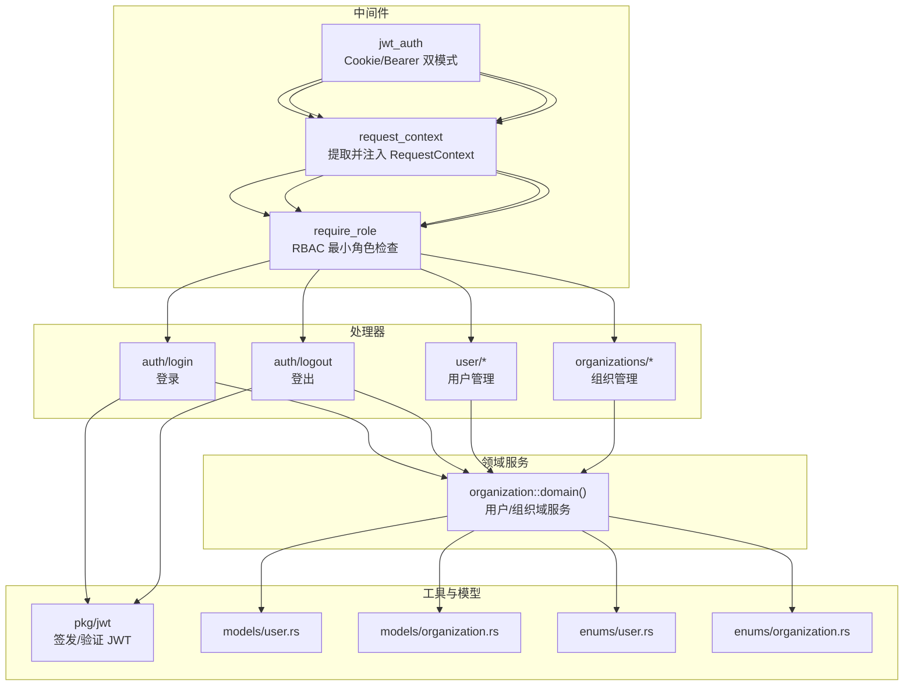
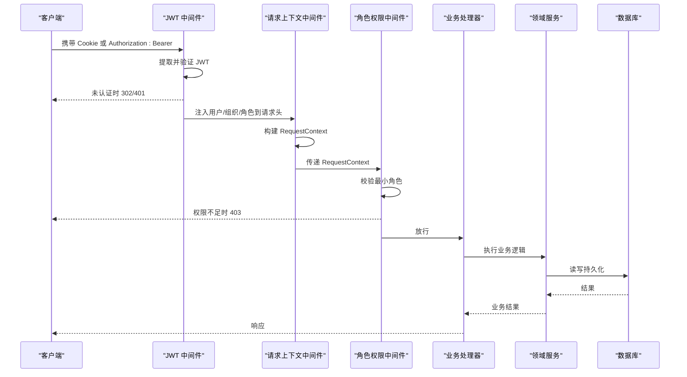
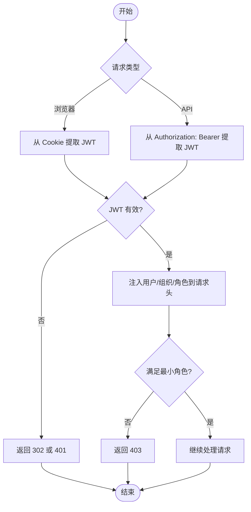
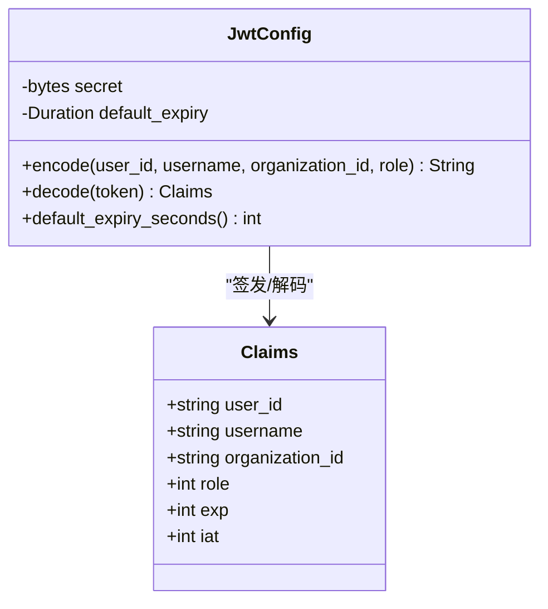
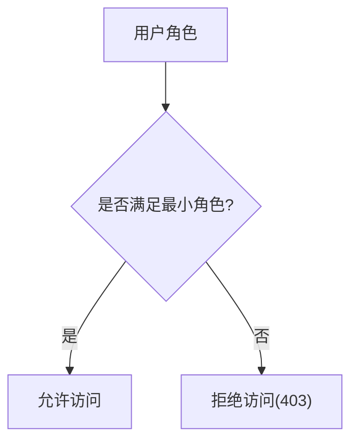
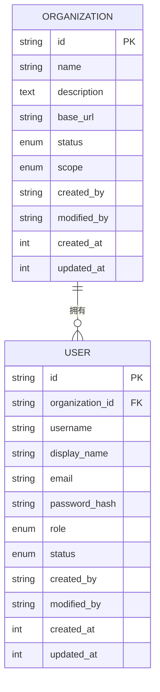
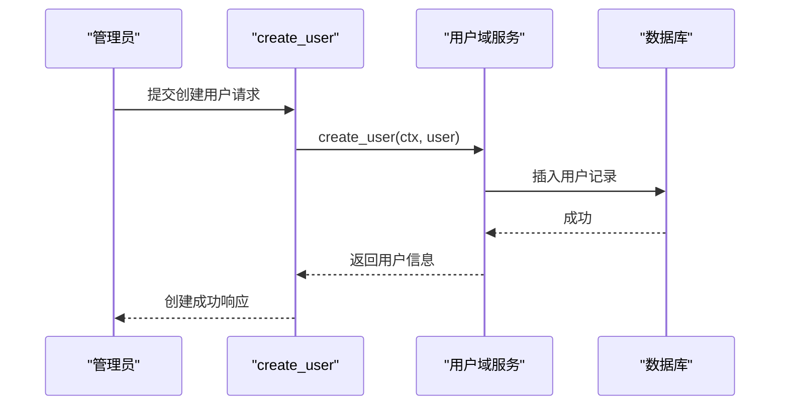
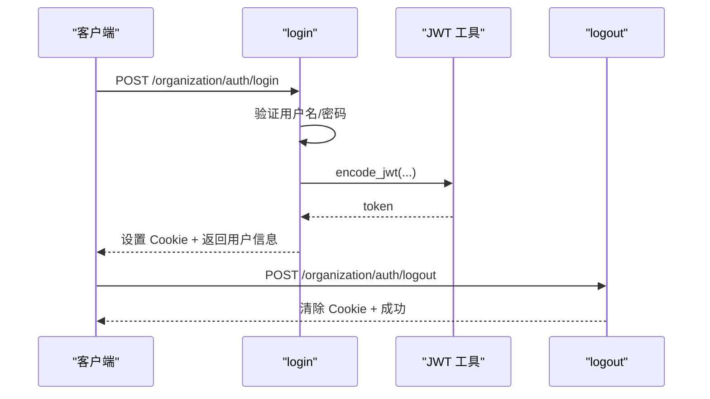
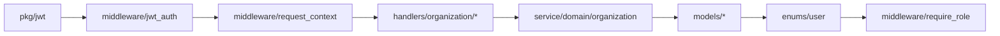

# 用户与组织管理

<cite>
**本文引用的文件**
- [src/handlers/organization/mod.rs](src/handlers/organization/mod.rs)
- [src/handlers/organization/auth/login.rs](src/handlers/organization/auth/login.rs)
- [src/handlers/organization/auth/logout.rs](src/handlers/organization/auth/logout.rs)
- [src/handlers/organization/user/create_user.rs](src/handlers/organization/user/create_user.rs)
- [src/handlers/organization/user/mod.rs](src/handlers/organization/user/mod.rs)
- [src/handlers/organization/organizations/mod.rs](src/handlers/organization/organizations/mod.rs)
- [src/middleware/jwt_auth.rs](src/middleware/jwt_auth.rs)
- [src/middleware/require_role.rs](src/middleware/require_role.rs)
- [src/middleware/request_context.rs](src/middleware/request_context.rs)
- [src/pkg/jwt.rs](src/pkg/jwt.rs)
- [src/models/user.rs](src/models/user.rs)
- [src/models/organization.rs](src/models/organization.rs)
- [common/src/enums/user.rs](common/src/enums/user.rs)
- [common/src/enums/organization.rs](common/src/enums/organization.rs)
- 【① Design 决策】[docs/design/organization_design.md](docs/design/organization_design.md) — 首次启动自举首个 SuperAdmin + root_org_id 级联归属过滤
- 【① Design 决策】[docs/design/agent_onboarding_design.md](docs/design/agent_onboarding_design.md) — Agent 入职五步流程 + 原子回滚
- 【① Design 决策】[docs/design/request_context_design.md](docs/design/request_context_design.md) — ctx 树形扩散 + 不可变优先重建替代修改
- 【② Plan 落地】[docs/plan/用户偏好双源设计.md](docs/plan/用户偏好双源设计.md) — 偏好双源冲突 3 条规则（自报优先>AI 推荐）
- 【② Plan 落地】[docs/plan/调用者类型上下文.md](docs/plan/调用者类型上下文.md) — caller_type User/Agent/System 三枚举注入 ctx
- 【④ RAG 知识卡】[组织权限与用户偏好](docs/wiki/knowledge/zh/组织权限与用户偏好：Organization多级%20+%20UserRole并查集继承%20+%20JWT双模式%20+%20偏好双源沉淀%20+%20Agent入职五步/组织权限与用户偏好：Organization多级%20+%20UserRole并查集继承%20+%20JWT双模式%20+%20偏好双源沉淀%20+%20Agent入职五步.md) — §UserRole 并查集继承 §JWT Cookie+Bearer 双模式 §HR::onboard_agent 五步 §7 条红线
</cite>

## 目录
1. [简介](#简介)
2. [项目结构](#项目结构)
3. [核心组件](#核心组件)
4. [架构总览](#架构总览)
5. [详细组件分析](#详细组件分析)
6. [依赖关系分析](#依赖关系分析)
7. [性能考虑](#性能考虑)
8. [故障排查指南](#故障排查指南)
9. [结论](#结论)
10. [附录：API 接口文档](#附录api-接口文档)

## 简介
本章节面向“用户与组织管理”能力，覆盖用户认证、授权、组织架构与用户生命周期管理。重点包括：
- 用户注册与登录流程（含 Cookie/Bearer 双模式）
- JWT 认证机制与安全策略
- RBAC 权限控制模型与角色继承
- 组织管理与多租户隔离
- 用户 CRUD 与权限校验
- 数据模型、业务流程与 API 规范

## 项目结构
围绕“用户与组织管理”，后端采用 Axum 路由 + 中间件 + Handler 的分层设计：
- 中间件层：JWT 认证、请求上下文提取、角色权限校验
- 处理器层：认证、组织、用户等 HTTP 接口
- 领域服务层：通过 domain() 访问组织域服务（用户管理、组织管理等）
- 数据模型层：UserPo、OrganizationPo 及枚举定义

**图表来源**
- [src/middleware/jwt_auth.rs:1-156](src/middleware/jwt_auth.rs#L1-L156)
- [src/middleware/request_context.rs:1-41](src/middleware/request_context.rs#L1-L41)
- [src/middleware/require_role.rs:1-39](src/middleware/require_role.rs#L1-L39)
- [src/handlers/organization/auth/login.rs:1-69](src/handlers/organization/auth/login.rs#L1-L69)
- [src/handlers/organization/auth/logout.rs:1-40](src/handlers/organization/auth/logout.rs#L1-L40)
- [src/handlers/organization/user/create_user.rs:1-72](src/handlers/organization/user/create_user.rs#L1-L72)
- [src/pkg/jwt.rs:1-159](src/pkg/jwt.rs#L1-L159)
- [src/models/user.rs:1-98](src/models/user.rs#L1-L98)
- [src/models/organization.rs:1-62](src/models/organization.rs#L1-L62)
- [common/src/enums/user.rs:1-212](common/src/enums/user.rs#L1-L212)
- [common/src/enums/organization.rs:1-101](common/src/enums/organization.rs#L1-L101)

**章节来源**
- [src/handlers/organization/mod.rs:1-15](src/handlers/organization/mod.rs#L1-L15)

## 核心组件
- JWT 认证中间件：支持 Cookie 与 Authorization: Bearer 双模式；失败时浏览器重定向、API 返回 401；通过后向请求头注入用户信息，供后续中间件使用。
- 请求上下文中间件：从请求头提取用户、组织、角色等信息，构造 RequestContext 注入到请求扩展，便于 Handler 使用。
- 角色权限中间件：基于 RBAC 的最小角色要求检查，支持角色继承（Member → Admin → SuperAdmin）。
- 认证处理器：登录签发 JWT 并设置 Cookie；登出清除 Cookie。
- 用户与组织处理器：提供用户与组织的 CRUD 能力，受中间件保护。
- JWT 工具：集中管理密钥、过期时间、签发与解码。
- 数据模型与枚举：UserPo、OrganizationPo 以及 UserRole、UserStatus、OrganizationStatus、OrganizationScope。

**章节来源**
- [src/middleware/jwt_auth.rs:1-156](src/middleware/jwt_auth.rs#L1-L156)
- [src/middleware/request_context.rs:1-41](src/middleware/request_context.rs#L1-L41)
- [src/middleware/require_role.rs:1-39](src/middleware/require_role.rs#L1-L39)
- [src/handlers/organization/auth/login.rs:1-69](src/handlers/organization/auth/login.rs#L1-L69)
- [src/handlers/organization/auth/logout.rs:1-40](src/handlers/organization/auth/logout.rs#L1-L40)
- [src/pkg/jwt.rs:1-159](src/pkg/jwt.rs#L1-L159)
- [src/models/user.rs:1-98](src/models/user.rs#L1-L98)
- [src/models/organization.rs:1-62](src/models/organization.rs#L1-L62)
- [common/src/enums/user.rs:1-212](common/src/enums/user.rs#L1-L212)
- [common/src/enums/organization.rs:1-101](common/src/enums/organization.rs#L1-L101)

## 架构总览
下图展示一次受保护的 API 调用从进入服务器到鉴权、授权、处理业务、落库的完整链路。

**图表来源**
- [src/middleware/jwt_auth.rs:1-156](src/middleware/jwt_auth.rs#L1-L156)
- [src/middleware/request_context.rs:1-41](src/middleware/request_context.rs#L1-L41)
- [src/middleware/require_role.rs:1-39](src/middleware/require_role.rs#L1-L39)

## 详细组件分析

### 认证与授权流程
- 登录：验证用户名密码后签发 JWT，设置 HttpOnly Cookie，返回 token 与用户基本信息。
- 鉴权：中间件优先从 Cookie 取 token，否则从 Authorization: Bearer 取；验证失败按请求类型返回 302 或 401。
- 授权：基于 RBAC 的最小角色检查，支持角色继承链判断。

**图表来源**
- [src/middleware/jwt_auth.rs:1-156](src/middleware/jwt_auth.rs#L1-L156)
- [src/middleware/require_role.rs:1-39](src/middleware/require_role.rs#L1-L39)

**章节来源**
- [src/handlers/organization/auth/login.rs:1-69](src/handlers/organization/auth/login.rs#L1-L69)
- [src/handlers/organization/auth/logout.rs:1-40](src/handlers/organization/auth/logout.rs#L1-L40)
- [src/middleware/jwt_auth.rs:1-156](src/middleware/jwt_auth.rs#L1-L156)
- [src/middleware/require_role.rs:1-39](src/middleware/require_role.rs#L1-L39)

### JWT 认证机制
- Claims 包含用户 ID、用户名、组织 ID、角色、过期时间等。
- 使用 HS256 算法签名，全局配置管理密钥与默认过期时间。
- 登录成功后设置 HttpOnly Cookie，路径为根路径，安全属性可配置。

**图表来源**
- [src/pkg/jwt.rs:1-159](src/pkg/jwt.rs#L1-L159)

**章节来源**
- [src/pkg/jwt.rs:1-159](src/pkg/jwt.rs#L1-L159)

### RBAC 权限控制模型
- 角色层级：SuperAdmin（根）→ Admin → Member。
- 继承规则：上级角色拥有下级角色的所有权限；权限判断沿最小角色向上遍历祖先链。
- 中间件根据当前用户角色与接口要求的最小角色进行判定。

**图表来源**
- [common/src/enums/user.rs:1-212](common/src/enums/user.rs#L1-L212)
- [src/middleware/require_role.rs:1-39](src/middleware/require_role.rs#L1-L39)

**章节来源**
- [common/src/enums/user.rs:1-212](common/src/enums/user.rs#L1-L212)
- [src/middleware/require_role.rs:1-39](src/middleware/require_role.rs#L1-L39)

### 组织架构与多租户隔离
- 组织模型包含名称、描述、外网基础 URL、状态、范围（本地/远程）等字段。
- 用户属于特定组织，请求上下文中携带组织 ID，用于数据隔离与查询过滤。
- 多节点网络扩展通过 OrganizationScope 区分本地与远程组织。

**图表来源**
- [src/models/organization.rs:1-62](src/models/organization.rs#L1-L62)
- [src/models/user.rs:1-98](src/models/user.rs#L1-L98)
- [common/src/enums/organization.rs:1-101](common/src/enums/organization.rs#L1-L101)

**章节来源**
- [src/models/organization.rs:1-62](src/models/organization.rs#L1-L62)
- [src/models/user.rs:1-98](src/models/user.rs#L1-L98)
- [common/src/enums/organization.rs:1-101](common/src/enums/organization.rs#L1-L101)

### 用户生命周期管理
- 创建用户：在当前组织下创建新用户，分配角色，记录创建人。
- 查询/更新/删除用户：通过组织维度进行数据隔离。
- 状态管理：用户状态（启用/禁用）影响登录与访问。

**图表来源**
- [src/handlers/organization/user/create_user.rs:1-72](src/handlers/organization/user/create_user.rs#L1-L72)

**章节来源**
- [src/handlers/organization/user/create_user.rs:1-72](src/handlers/organization/user/create_user.rs#L1-L72)

### 登录与登出流程
- 登录：验证凭据 → 签发 JWT → 设置 Cookie → 返回用户信息与 token。
- 登出：清除 Cookie → 返回成功。

**图表来源**
- [src/handlers/organization/auth/login.rs:1-69](src/handlers/organization/auth/login.rs#L1-L69)
- [src/handlers/organization/auth/logout.rs:1-40](src/handlers/organization/auth/logout.rs#L1-L40)
- [src/pkg/jwt.rs:1-159](src/pkg/jwt.rs#L1-L159)

**章节来源**
- [src/handlers/organization/auth/login.rs:1-69](src/handlers/organization/auth/login.rs#L1-L69)
- [src/handlers/organization/auth/logout.rs:1-40](src/handlers/organization/auth/logout.rs#L1-L40)

## 依赖关系分析
- 中间件依赖：
  - jwt_auth 依赖 pkg/jwt 进行令牌签发与验证。
  - request_context 依赖常量与配置，将用户上下文注入请求扩展。
  - require_role 依赖 enums/user 的角色继承与权限判断。
- 处理器依赖：
  - auth/login 与 auth/logout 依赖 JWT 工具与 Cookie 库。
  - user/* 与 organizations/* 依赖领域服务 domain() 进行数据操作。
- 数据模型与枚举：
  - UserPo、OrganizationPo 与对应枚举共同构成数据契约。

**图表来源**
- [src/middleware/jwt_auth.rs:1-156](src/middleware/jwt_auth.rs#L1-L156)
- [src/middleware/request_context.rs:1-41](src/middleware/request_context.rs#L1-L41)
- [src/middleware/require_role.rs:1-39](src/middleware/require_role.rs#L1-L39)
- [src/handlers/organization/user/mod.rs:1-17](src/handlers/organization/user/mod.rs#L1-L17)
- [src/handlers/organization/organizations/mod.rs:1-12](src/handlers/organization/organizations/mod.rs#L1-L12)
- [src/models/user.rs:1-98](src/models/user.rs#L1-L98)
- [src/models/organization.rs:1-62](src/models/organization.rs#L1-L62)
- [common/src/enums/user.rs:1-212](common/src/enums/user.rs#L1-L212)

**章节来源**
- [src/handlers/organization/user/mod.rs:1-17](src/handlers/organization/user/mod.rs#L1-L17)
- [src/handlers/organization/organizations/mod.rs:1-12](src/handlers/organization/organizations/mod.rs#L1-L12)

## 性能考虑
- JWT 验证开销低，建议合理设置过期时间以平衡安全与性能。
- 角色权限判断为 O(n) 祖先链遍历，角色层级固定且浅，性能可接受。
- 请求上下文中间件仅做轻量解析与注入，避免在 Handler 中重复解析。
- 组织维度数据隔离建议在 SQL 层加入组织 ID 过滤，减少内存过滤成本。

[本节为通用指导，不直接分析具体文件]

## 故障排查指南
- 未认证错误：
  - 浏览器场景：检查 Cookie 是否设置成功、是否被浏览器策略拦截。
  - API 场景：检查 Authorization 头格式是否为 “Bearer <token>”。
- 权限不足：
  - 确认当前用户角色与接口要求的最小角色关系，必要时提升角色。
- 登录失败：
  - 检查用户名、组织 ID、密码哈希是否正确；确认领域服务验证逻辑。
- 登出不生效：
  - 检查 Cookie 清除响应是否被缓存或代理丢弃；确保路径与域名一致。

**章节来源**
- [src/middleware/jwt_auth.rs:1-156](src/middleware/jwt_auth.rs#L1-L156)
- [src/middleware/require_role.rs:1-39](src/middleware/require_role.rs#L1-L39)
- [src/handlers/organization/auth/login.rs:1-69](src/handlers/organization/auth/login.rs#L1-L69)
- [src/handlers/organization/auth/logout.rs:1-40](src/handlers/organization/auth/logout.rs#L1-L40)

## 结论
本项目实现了完整的用户与组织管理能力：
- 双模式 JWT 认证，兼顾浏览器与 API 场景
- RBAC 角色继承与最小角色授权
- 组织维度的数据隔离与多租户支持
- 用户与组织的 CRUD 接口，配合中间件保障安全
- 清晰的模型与枚举定义，便于扩展与维护

[本节为总结性内容，不直接分析具体文件]

## 附录：API 接口文档

### 认证接口
- 登录
  - 方法：POST
  - 路径：/organization/auth/login
  - 请求体：包含 organization_id、username、password_hash
  - 响应：返回 user_id、username、organization_id、token，并设置 Cookie
  - 说明：验证成功后签发 JWT，浏览器自动携带 Cookie
- 登出
  - 方法：POST
  - 路径：/organization/auth/logout
  - 响应：返回 success=true，并清除 Cookie

**章节来源**
- [src/handlers/organization/auth/login.rs:1-69](src/handlers/organization/auth/login.rs#L1-L69)
- [src/handlers/organization/auth/logout.rs:1-40](src/handlers/organization/auth/logout.rs#L1-L40)

### 用户管理接口
- 创建用户
  - 方法：POST
  - 路径：/api/v1/organizations/users
  - 请求体：username、display_name、email、password_hash、role
  - 响应：返回 user_id、username、display_name、email、role
  - 说明：在当前组织下创建用户，角色映射与权限由中间件控制
- 其他用户接口（列表、查询、更新、删除）
  - 路径前缀：/api/v1/organizations/users
  - 说明：均受 JWT 与角色权限中间件保护，按组织维度隔离数据

**章节来源**
- [src/handlers/organization/user/create_user.rs:1-72](src/handlers/organization/user/create_user.rs#L1-L72)
- [src/handlers/organization/user/mod.rs:1-17](src/handlers/organization/user/mod.rs#L1-L17)

### 组织管理接口
- 获取组织、更新组织、删除组织、列出组织
  - 路径前缀：/api/v1/organizations
  - 说明：受 JWT 与角色权限中间件保护，按组织维度隔离数据

**章节来源**
- [src/handlers/organization/organizations/mod.rs:1-12](src/handlers/organization/organizations/mod.rs#L1-L12)

### 权限验证接口
- 角色权限检查
  - 机制：通过 require_role 中间件对每个接口声明最小角色要求
  - 行为：不满足时返回 403，提示“权限不足”

**章节来源**
- [src/middleware/require_role.rs:1-39](src/middleware/require_role.rs#L1-L39)

### 多租户隔离机制与数据安全策略
- 多租户隔离：
  - 用户与组织关联，请求上下文携带 organization_id
  - 数据查询与写入需带上组织 ID 过滤，确保跨组织数据不可见
- 数据安全策略：
  - JWT 使用 HS256 签名，密钥集中管理，过期时间可控
  - Cookie 设置为 HttpOnly，防止 XSS 窃取
  - 敏感字段（如密码哈希）不暴露给前端或日志
  - 角色权限最小化原则，接口按需声明最小角色

**章节来源**
- [src/middleware/jwt_auth.rs:1-156](src/middleware/jwt_auth.rs#L1-L156)
- [src/pkg/jwt.rs:1-159](src/pkg/jwt.rs#L1-L159)
- [src/models/user.rs:1-98](src/models/user.rs#L1-L98)
- [src/models/organization.rs:1-62](src/models/organization.rs#L1-L62)