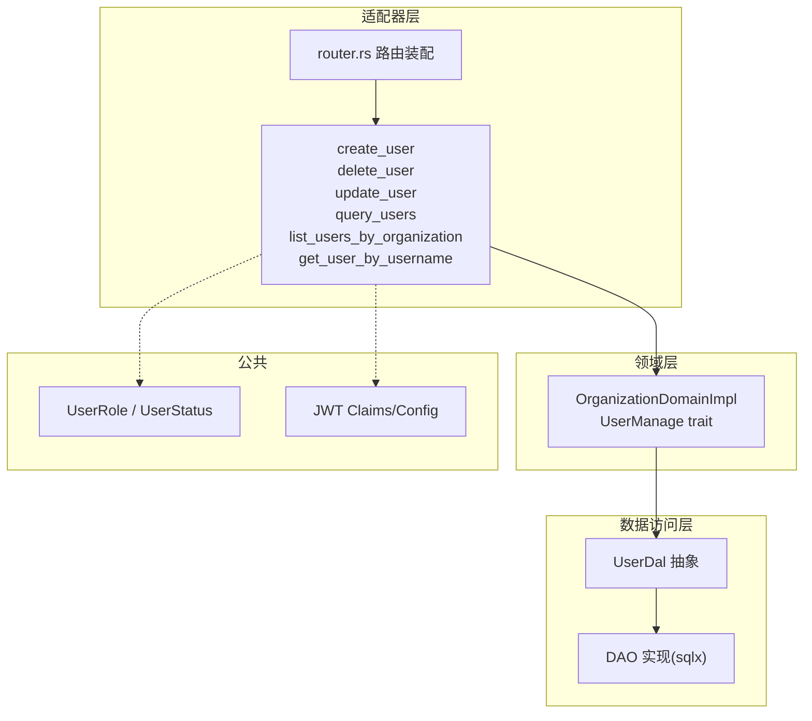
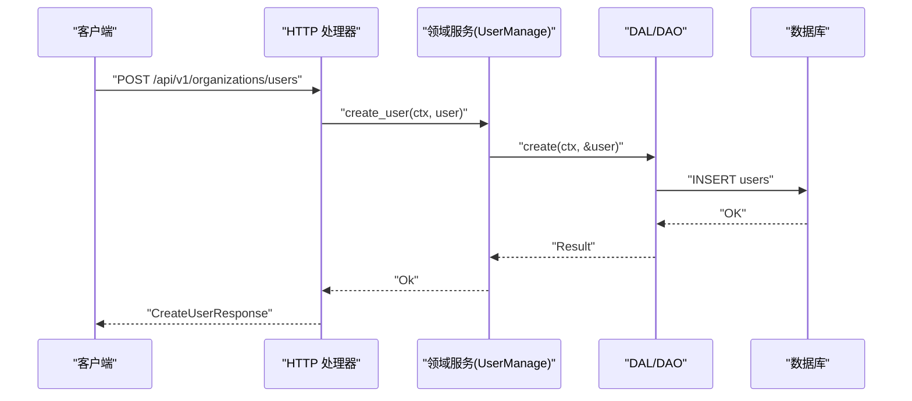
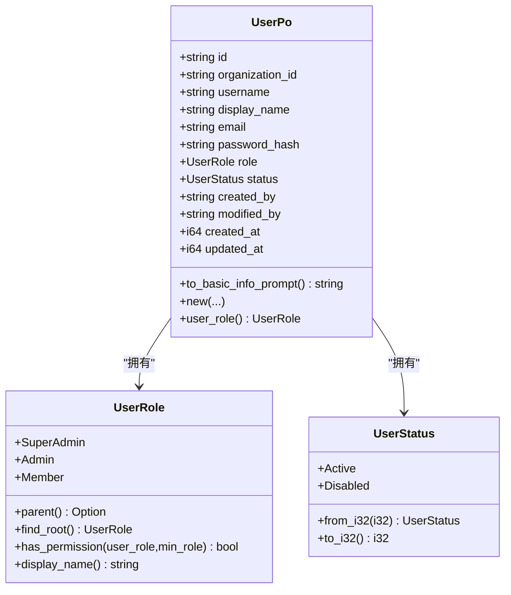
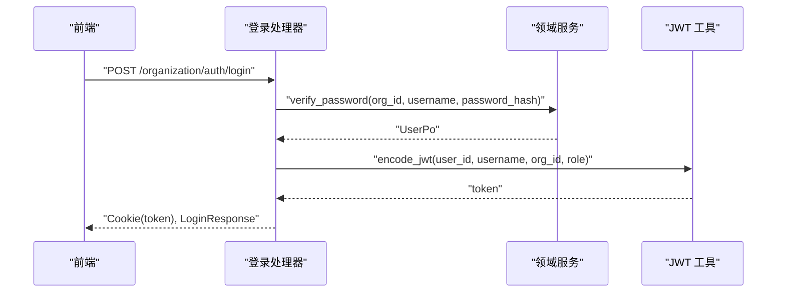
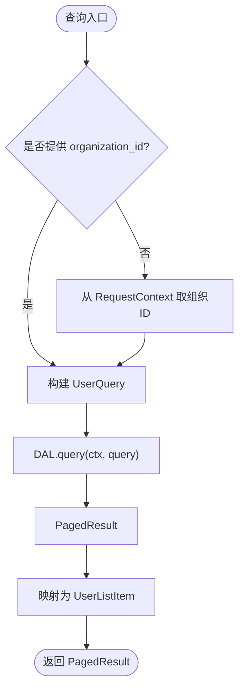
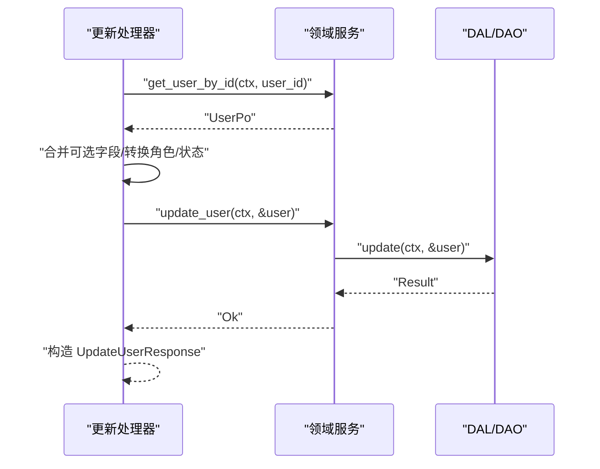
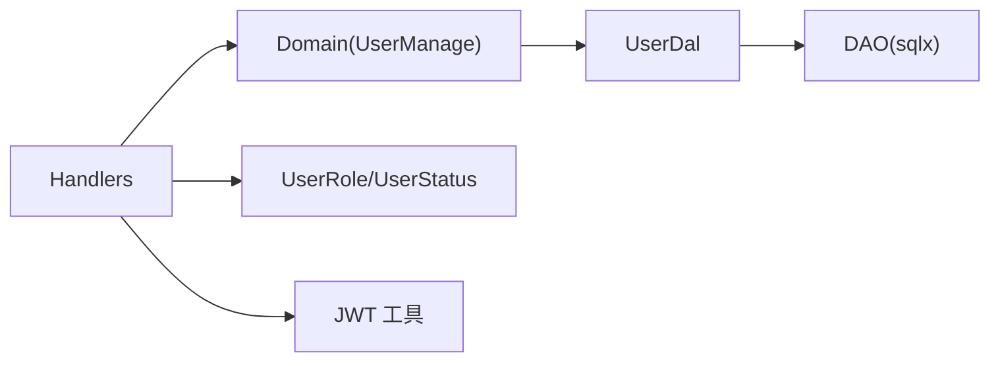

# 用户管理

<cite>
**本文引用的文件**
- [src/models/user.rs](src/models/user.rs)
- [common/src/enums/user.rs](common/src/enums/user.rs)
- [src/handlers/organization/user/mod.rs](src/handlers/organization/user/mod.rs)
- [src/handlers/organization/user/create_user.rs](src/handlers/organization/user/create_user.rs)
- [src/handlers/organization/user/delete_user.rs](src/handlers/organization/user/delete_user.rs)
- [src/handlers/organization/user/update_user.rs](src/handlers/organization/user/update_user.rs)
- [src/handlers/organization/user/query_users.rs](src/handlers/organization/user/query_users.rs)
- [src/handlers/organization/user/list_users_by_organization.rs](src/handlers/organization/user/list_users_by_organization.rs)
- [src/handlers/organization/user/get_user_by_username.rs](src/handlers/organization/user/get_user_by_username.rs)
- [src/service/domain/organization/mod.rs](src/service/domain/organization/mod.rs)
- [src/service/domain/organization/user.rs](src/service/domain/organization/user.rs)
- [src/service/dal/user.rs](src/service/dal/user.rs)
- [src/router.rs](src/router.rs)
- [src/pkg/jwt.rs](src/pkg/jwt.rs)
- [src/handlers/organization/auth/login.rs](src/handlers/organization/auth/login.rs)
- [frontend/src/pages/reception.rs](frontend/src/pages/reception.rs)
- [frontend/src/pages/organization/users.rs](frontend/src/pages/organization/users.rs)
</cite>

## 目录
1. [简介](#简介)
2. [项目结构](#项目结构)
3. [核心组件](#核心组件)
4. [架构总览](#架构总览)
5. [详细组件分析](#详细组件分析)
6. [依赖关系分析](#依赖关系分析)
7. [性能考虑](#性能考虑)
8. [故障排查指南](#故障排查指南)
9. [结论](#结论)
10. [附录：API 规范](#附录api-规范)

## 简介
本文件面向“用户管理”能力，覆盖用户生命周期、注册登录、信息查询、状态与角色管理、数据模型设计、组织关系映射、完整 API 规格（含分页与批量）、以及安全与合规要点。系统采用严格四层单向调用：Adapter（HTTP Handler）→ Domain → DAL → DAO，禁止跨层与同层互调；Domain 输入为 Command/Query，输出为业务实体与内部事件；DAL 对外统一使用业务实体而非持久化对象。

## 项目结构
用户管理相关代码分布在以下层次：
- Adapter 层：HTTP 路由与处理器，负责参数校验、上下文提取、响应封装。
- Domain 层：组织域聚合，暴露用户管理能力（查询、创建、更新、删除、统计、密码验证等）。
- DAL 层：用户领域的数据访问抽象，提供统一的查询、分页、计数接口。
- DAO 层：具体数据库实现（SQLite/DuckDB 等），由 sqlx 驱动。
- 公共枚举与 DTO：角色、状态、请求/响应类型定义在 common 模块。
- JWT 认证：登录签发 token，中间件解析并注入 RequestContext。

图表来源
- [src/router.rs:248-290](src/router.rs#L248-L290)
- [src/handlers/organization/user/mod.rs:1-17](src/handlers/organization/user/mod.rs#L1-L17)
- [src/service/domain/organization/mod.rs:1-200](src/service/domain/organization/mod.rs#L1-L200)
- [src/service/dal/user.rs](src/service/dal/user.rs)
- [common/src/enums/user.rs:1-212](common/src/enums/user.rs#L1-L212)
- [src/pkg/jwt.rs:1-158](src/pkg/jwt.rs#L1-L158)

章节来源
- [src/router.rs:248-290](src/router.rs#L248-L290)
- [src/handlers/organization/user/mod.rs:1-17](src/handlers/organization/user/mod.rs#L1-L17)

## 核心组件
- 用户数据模型：UserPo 包含 id、organization_id、username、display_name、email、password_hash、role、status、审计字段与时间戳。
- 角色与状态：
  - UserRole：SuperAdmin(0)、Admin(1)、Member(2)，支持父角色查找与权限判定。
  - UserStatus：Active(1)、Disabled(0)。
- 领域服务：OrganizationDomainImpl 实现 UserManage trait，提供 find_by_username、query、find_by_organization_id、create_user、update_user、delete_user、exists_by_username、count_by_organization_id、count_users、verify_password、get_user_by_id。
- 数据访问：UserDal 抽象 + DAO 实现，提供通用查询、分页、计数、按组织过滤等能力。
- 认证：登录流程通过 domain.verify_password 校验后签发 JWT，浏览器通过 Cookie 自动携带。

章节来源
- [src/models/user.rs:1-98](src/models/user.rs#L1-L98)
- [common/src/enums/user.rs:1-212](common/src/enums/user.rs#L1-L212)
- [src/service/domain/organization/mod.rs:1-200](src/service/domain/organization/mod.rs#L1-L200)
- [src/service/domain/organization/user.rs:1-83](src/service/domain/organization/user.rs#L1-L83)
- [src/pkg/jwt.rs:1-158](src/pkg/jwt.rs#L1-L158)

## 架构总览
用户管理的请求从 HTTP 进入，经路由分发到对应 handler，handler 调用 OrganizationDomain.user_manage() 完成业务编排，再委托至 DAL/DAO 进行数据操作。查询类接口支持分页与组合条件；写操作涉及角色转换、状态更新与审计字段填充。

图表来源
- [src/handlers/organization/user/create_user.rs:1-72](src/handlers/organization/user/create_user.rs#L1-L72)
- [src/service/domain/organization/user.rs:1-83](src/service/domain/organization/user.rs#L1-L83)
- [src/service/dal/user.rs](src/service/dal/user.rs)

## 详细组件分析

### 用户数据模型与状态流转
- 数据模型：UserPo 作为持久化对象，仅在 DAO/DAL 内部使用；Domain 对外以业务实体承载必要字段。
- 角色体系：基于并查集语义的继承链 Member → Admin → SuperAdmin，提供 parent/find_root/has_permission 等方法。
- 状态流转：默认 Active，可置为 Disabled（软删除语义）。更新时维护 updated_at。

图表来源
- [src/models/user.rs:1-98](src/models/user.rs#L1-L98)
- [common/src/enums/user.rs:1-212](common/src/enums/user.rs#L1-L212)

章节来源
- [src/models/user.rs:1-98](src/models/user.rs#L1-L98)
- [common/src/enums/user.rs:1-212](common/src/enums/user.rs#L1-L212)

### 用户注册与登录
- 注册（创建用户）：Handler 从 RequestContext 获取当前组织 ID，生成随机用户 ID，将前端传入的角色数值转换为 UserRole 枚举，构造 UserPo 后调用 Domain.create_user。
- 登录：Handler 调用 Domain.verify_password 校验用户名与密码哈希，成功后签发 JWT（HS256），并通过 Cookie 返回；前端可在后续请求中自动携带。

图表来源
- [src/handlers/organization/auth/login.rs:1-48](src/handlers/organization/auth/login.rs#L1-L48)
- [src/pkg/jwt.rs:1-158](src/pkg/jwt.rs#L1-L158)
- [src/service/domain/organization/mod.rs:1-200](src/service/domain/organization/mod.rs#L1-L200)

章节来源
- [src/handlers/organization/user/create_user.rs:1-72](src/handlers/organization/user/create_user.rs#L1-L72)
- [src/handlers/organization/auth/login.rs:1-48](src/handlers/organization/auth/login.rs#L1-L48)
- [src/pkg/jwt.rs:1-158](src/pkg/jwt.rs#L1-L158)

### 用户信息查询与分页
- 按组织列出：GET /api/v1/organizations/{org_id}/users，返回该组织下所有用户列表及总数。
- 通用查询：POST /api/v1/users/query，支持 organization_id、pagination 等条件，返回 PagedResult。
- 按用户名查询：GET /api/v1/organizations/users/by-username/{username}，用于认证场景。

图表来源
- [src/handlers/organization/user/query_users.rs:1-62](src/handlers/organization/user/query_users.rs#L1-L62)
- [src/handlers/organization/user/list_users_by_organization.rs:1-53](src/handlers/organization/user/list_users_by_organization.rs#L1-L53)
- [src/handlers/organization/user/get_user_by_username.rs:1-55](src/handlers/organization/user/get_user_by_username.rs#L1-L55)

章节来源
- [src/handlers/organization/user/query_users.rs:1-62](src/handlers/organization/user/query_users.rs#L1-L62)
- [src/handlers/organization/user/list_users_by_organization.rs:1-53](src/handlers/organization/user/list_users_by_organization.rs#L1-L53)
- [src/handlers/organization/user/get_user_by_username.rs:1-55](src/handlers/organization/user/get_user_by_username.rs#L1-L55)

### 用户信息更新与删除
- 更新：PUT /api/v1/organizations/users/{id}，支持可选字段更新（display_name、email、role、status、password_hash），自动更新时间戳。
- 删除：DELETE /api/v1/organizations/users/{id}，执行软删除或物理删除（由 DAL/DAO 实现决定）。

图表来源
- [src/handlers/organization/user/update_user.rs:1-83](src/handlers/organization/user/update_user.rs#L1-L83)
- [src/service/domain/organization/user.rs:1-83](src/service/domain/organization/user.rs#L1-L83)

章节来源
- [src/handlers/organization/user/update_user.rs:1-83](src/handlers/organization/user/update_user.rs#L1-L83)
- [src/handlers/organization/user/delete_user.rs:1-24](src/handlers/organization/user/delete_user.rs#L1-L24)

### 用户与组织的关系映射
- 每个用户属于一个组织（organization_id），查询与统计均围绕组织维度展开。
- 前端组织用户页面支持创建、删除、列表刷新等操作，调用后端组织用户接口。

章节来源
- [src/models/user.rs:1-98](src/models/user.rs#L1-L98)
- [frontend/src/pages/organization/users.rs:1-106](frontend/src/pages/organization/users.rs#L1-L106)

## 依赖关系分析
- Handler 仅依赖 Domain 暴露的 UserManage trait，不直接访问 DAL/DAO。
- Domain 聚合 OrganizationDal 与 UserDal，解耦具体存储实现。
- 角色与状态枚举位于 common，被多个层复用。
- JWT 配置全局单例，登录流程统一签发与校验。

图表来源
- [src/service/domain/organization/mod.rs:1-200](src/service/domain/organization/mod.rs#L1-L200)
- [src/service/dal/user.rs](src/service/dal/user.rs)
- [common/src/enums/user.rs:1-212](common/src/enums/user.rs#L1-L212)
- [src/pkg/jwt.rs:1-158](src/pkg/jwt.rs#L1-L158)

章节来源
- [src/service/domain/organization/mod.rs:1-200](src/service/domain/organization/mod.rs#L1-L200)
- [src/service/dal/user.rs](src/service/dal/user.rs)

## 性能考虑
- 查询分页：优先使用 DAL 的分页接口，避免全量加载；前端按需拉取。
- 索引建议：对 organization_id、username、status 建立合适索引以提升查询效率。
- 角色判断：使用 has_permission 的祖先链遍历，复杂度 O(k)（k 为层级深度），通常很小。
- 登录鉴权：JWT 解码开销低，注意合理设置过期时间以减少频繁刷新。

## 故障排查指南
- 未找到组织信息：创建/查询接口需从 RequestContext 获取 organization_id，若缺失会返回错误。
- 用户不存在：更新接口先 get_user_by_id，不存在则返回 not_found。
- 角色转换异常：确保前端传入的角色数值与后端枚举映射一致（0/1/2）。
- 登录失败：检查密码哈希是否正确、组织 ID 是否匹配、用户状态是否为 Active。

章节来源
- [src/handlers/organization/user/create_user.rs:1-72](src/handlers/organization/user/create_user.rs#L1-L72)
- [src/handlers/organization/user/update_user.rs:1-83](src/handlers/organization/user/update_user.rs#L1-L83)
- [src/handlers/organization/user/get_user_by_username.rs:1-55](src/handlers/organization/user/get_user_by_username.rs#L1-L55)

## 结论
用户管理模块遵循严格的分层架构，职责清晰、扩展性强。通过统一的 Domain 接口与 DAL 抽象，实现了灵活的查询与分页能力；结合 JWT 认证与角色权限体系，满足多租户组织下的用户管理与安全控制需求。建议在后续迭代中完善批量操作、审计日志与更细粒度的权限策略。

## 附录：API 规范

### 路由总览
- POST /api/v1/organizations/users — 创建用户
- GET /api/v1/organizations/{org_id}/users — 按组织列出用户
- GET /api/v1/organizations/users/me/list — 当前组织用户列表
- PUT /api/v1/organizations/users/{id} — 更新用户
- DELETE /api/v1/organizations/users/{id} — 删除用户
- GET /api/v1/organizations/users/by-username/{username} — 按用户名查询（认证用）
- POST /api/v1/users/query — 通用查询（分页）

章节来源
- [src/router.rs:248-290](src/router.rs#L248-L290)

### 创建用户
- 方法：POST
- 路径：/api/v1/organizations/users
- 请求体：CreateUserRequest（username、password_hash、display_name?、email?、role）
- 响应：CreateUserResponse（user_id、username、display_name?、email?、role）
- 说明：从 RequestContext 获取当前组织 ID；role 数值映射为 UserRole；敏感字段不暴露给 Agent 工具。

章节来源
- [src/handlers/organization/user/create_user.rs:1-72](src/handlers/organization/user/create_user.rs#L1-L72)

### 按组织列出用户
- 方法：GET
- 路径：/api/v1/organizations/{org_id}/users
- 响应：ListUsersResponse（data: [UserListItem], total）
- 说明：返回指定组织下全部用户，便于前端展示与管理。

章节来源
- [src/handlers/organization/user/list_users_by_organization.rs:1-53](src/handlers/organization/user/list_users_by_organization.rs#L1-L53)

### 当前组织用户列表
- 方法：GET
- 路径：/api/v1/organizations/users/me/list
- 响应：ListUsersResponse（data、total）
- 说明：基于当前登录用户的组织上下文。

章节来源
- [src/router.rs:248-290](src/router.rs#L248-L290)

### 更新用户
- 方法：PUT
- 路径：/api/v1/organizations/users/{id}
- 请求体：UpdateUserRequest（display_name?、email?、role?、status?、password_hash?）
- 响应：UpdateUserResponse（user_id、username、display_name?、email?、role、status）
- 说明：仅更新提供的可选字段；自动更新 updated_at；role/status 数值转枚举。

章节来源
- [src/handlers/organization/user/update_user.rs:1-83](src/handlers/organization/user/update_user.rs#L1-L83)

### 删除用户
- 方法：DELETE
- 路径：/api/v1/organizations/users/{id}
- 响应：DeleteUserResponse（success）
- 说明：高危操作，仅限管理员手动调用。

章节来源
- [src/handlers/organization/user/delete_user.rs:1-24](src/handlers/organization/user/delete_user.rs#L1-L24)

### 按用户名查询（认证用）
- 方法：GET
- 路径：/api/v1/organizations/users/by-username/{username}
- 响应：GetUserByUsernameResponse（user: UserInfoResponse?）
- 说明：用于登录认证，避免用户枚举风险。

章节来源
- [src/handlers/organization/user/get_user_by_username.rs:1-55](src/handlers/organization/user/get_user_by_username.rs#L1-L55)

### 通用查询（分页）
- 方法：POST
- 路径：/api/v1/users/query
- 请求体：UserQueryRequest（organization_id?、pagination）
- 响应：PagedResult<UserListItem>
- 说明：支持组合条件与分页；可透传 organization_id 或使用上下文中的组织 ID。

章节来源
- [src/handlers/organization/user/query_users.rs:1-62](src/handlers/organization/user/query_users.rs#L1-L62)

### 登录
- 方法：POST
- 路径：/organization/auth/login
- 请求体：LoginRequest（username、password_hash、organization_id）
- 响应：LoginResponse（user_id、username、organization_id、token）+ Cookie(token)
- 说明：校验通过后签发 JWT；浏览器通过 Cookie 自动携带。

章节来源
- [src/handlers/organization/auth/login.rs:1-48](src/handlers/organization/auth/login.rs#L1-L48)
- [src/pkg/jwt.rs:1-158](src/pkg/jwt.rs#L1-L158)

### 前端交互要点
- 接待页：检查系统初始化状态，已初始化则显示登录表单；未初始化则显示初始化表单。
- 登录后：保存 token，获取当前用户信息回填 role/org_id。
- 组织用户页：支持创建、删除、列表刷新，调用组织用户接口。

章节来源
- [frontend/src/pages/reception.rs:54-122](frontend/src/pages/reception.rs#L54-L122)
- [frontend/src/pages/organization/users.rs:1-106](frontend/src/pages/organization/users.rs#L1-L106)

### 数据安全、隐私保护与合规性
- 密码处理：前端提交密码哈希，服务端不接收明文；建议使用强哈希算法（如 bcrypt）。
- 最小化暴露：用户详情接口不返回敏感字段（如 password_hash）。
- 访问控制：写操作与删除操作限制管理员；认证接口避免用户枚举。
- 令牌安全：JWT 使用 HS256 签名，合理设置过期时间；生产环境启用 HTTPS 并设置 secure Cookie。
- 审计字段：created_by、modified_by、created_at、updated_at 记录变更轨迹。
- 合规建议：遵循数据最小化原则，对用户邮箱等个人信息进行脱敏展示；定期审查权限与访问日志。