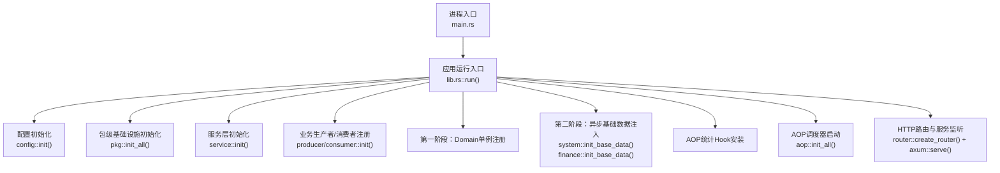
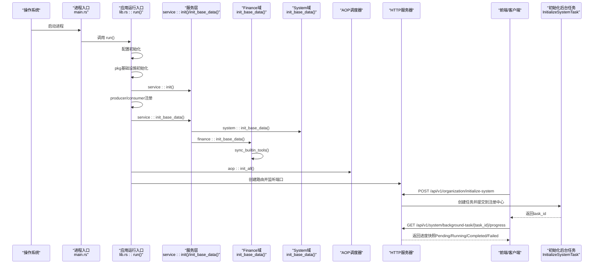
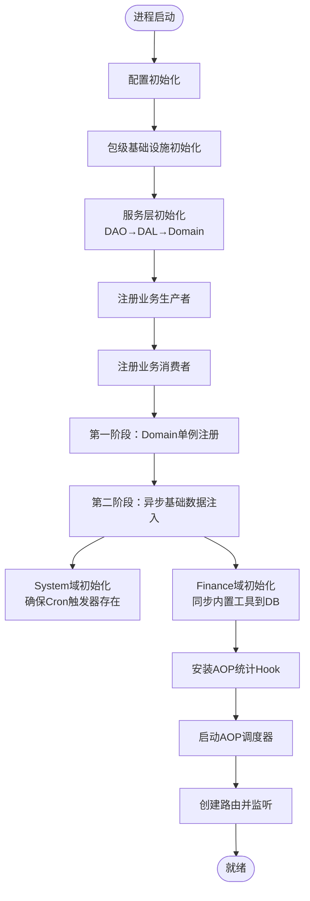
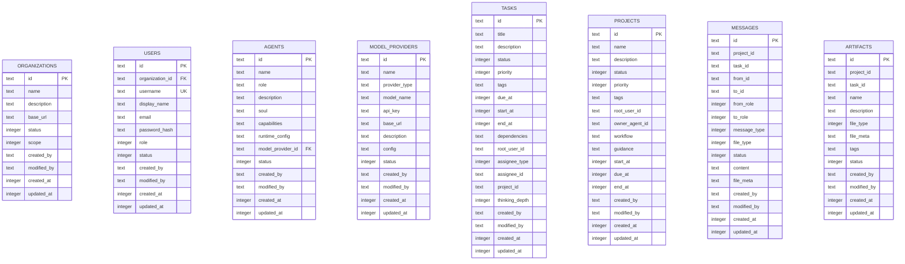
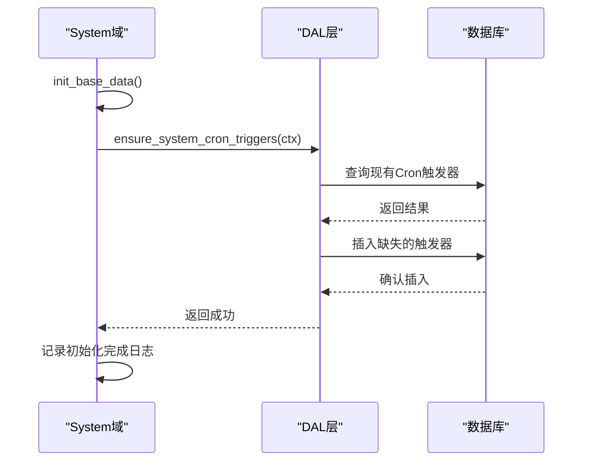
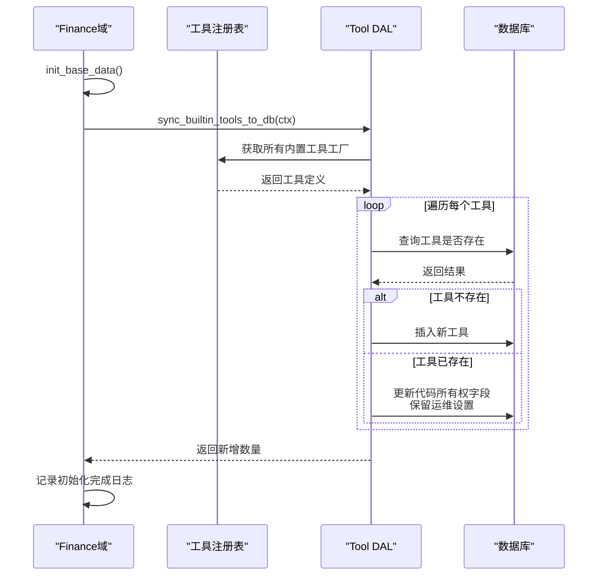
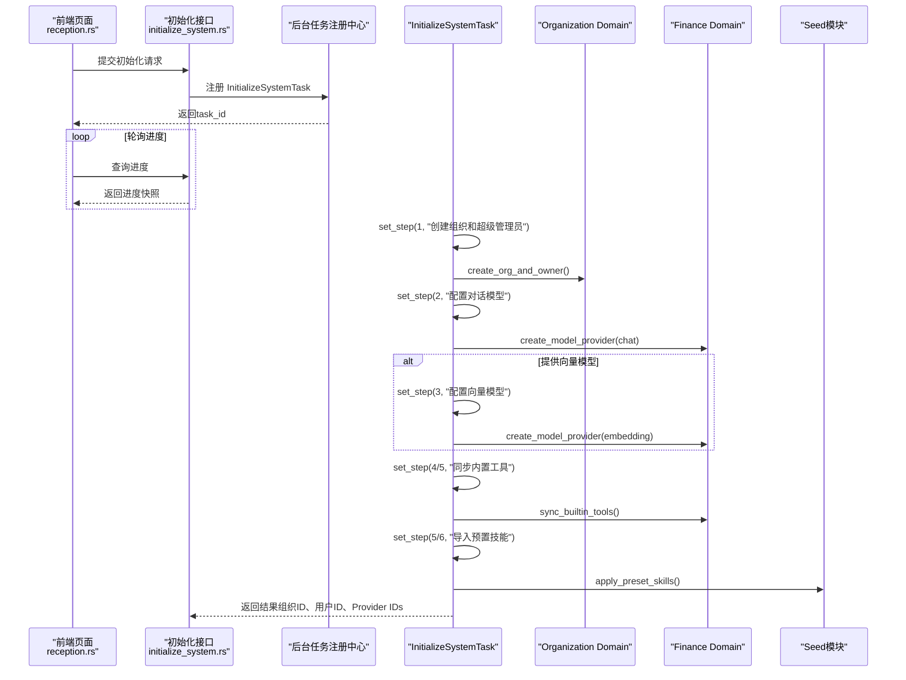

# 系统初始化

<cite>
**本文引用的文件**
- [lib.rs](src/lib.rs)
- [service/mod.rs](src/service/mod.rs)
- [domain/mod.rs](src/service/domain/mod.rs)
- [finance/mod.rs](src/service/domain/finance/mod.rs)
- [system/mod.rs](src/service/domain/system/mod.rs)
- [tool_provider.rs](src/service/domain/finance/tool_provider.rs)
- [tool.rs](src/service/dal/tool.rs)
- [tool_registry/mod.rs](src/pkg/tool_registry/mod.rs)
- [initialize_system.rs](src/handlers/organization/initialize_system.rs)
- [health.rs](src/handlers/health.rs)
- [health_metrics.rs](src/handlers/system/health_metrics.rs)
- [20260420000000_initial.sql](migrations/20260420000000_initial.sql)
- [seed_handler_test.rs](src/handlers/system/seed/seed_handler_test.rs)
- [system_cron_triggers_test.rs](tests/integration/system_cron_triggers_test.rs)
- [reception.rs](frontend/src/pages/reception.rs)

### 本文关联的三类文档（四类互引闭环）

**① 设计文档（Design）**：
- [任务调度器设计](docs/archive/design-archive/task_scheduler_design.md) — Cron 解析、生产者消费者与两阶段初始化规范
- 【Batch10 追加】[seed-config-migration.md](docs/archive/design-archive/seed-config-migration.md) — Seed 工具箱 domain 架构；5 套 TEMPLATE_SKILL 编译期嵌入（include_str!）；SeedSnapshot Diff 增量导入；两阶段初始化严格顺序（pkg::init_all → service::init → producer/consumer::init → init_base_data → aop::start）；init_all_base_data 域派发模式

**② 落地计划（Plan）（Batch10 追加）**：
- [Agent管理集成测试.md](docs/archive/plan-archive/Agent管理集成测试.md) — init_full_test_env 启动顺序 6 步与真实启动严格对齐；Consumer::init 只注册订阅者禁止写 DB

**④ RAG 原子知识卡**：
- [Cron 任务调度与系统启动顺序 RAG 卡](docs/wiki/knowledge/zh/Cron%20%E4%BB%BB%E5%8A%A1%E8%B0%83%E5%BA%A6%E4%B8%8E%E7%B3%BB%E7%BB%9F%E5%90%AF%E5%8A%A8%E9%A1%BA%E5%BA%8F%EF%BC%9A5%E5%AD%97%E6%AE%B5cron%E8%A7%A3%E6%9E%90%20+%20ensure_system_cron_triggers%202%E6%9D%A1%E6%B3%A8%E5%85%A5%20+%20CronTriggerConsumer%20%E4%BA%8B%E4%BB%B6%20+%20%E4%B8%A4%E9%98%B6%E6%AE%B5init/aop%E4%B8%A5%E6%A0%BC%E5%88%86%E7%A6%BB/Cron%20%E4%BB%BB%E5%8A%A1%E8%B0%83%E5%BA%A6%E4%B8%8E%E7%B3%BB%E7%BB%9F%E5%90%AF%E5%8A%A8%E9%A1%BA%E5%BA%8F%EF%BC%9A5%E5%AD%97%E6%AE%B5cron%E8%A7%A3%E6%9E%90%20+%20ensure_system_cron_triggers%202%E6%9D%A1%E6%B3%A8%E5%85%A5%20+%20CronTriggerConsumer%20%E4%BA%8B%E4%BB%B6%20+%20%E4%B8%A4%E9%98%B6%E6%AE%B5init/aop%E4%B8%A5%E6%A0%BC%E5%88%86%E7%A6%BB.md) — 5 字段 cron 解析 + 2 条系统触发器 + 两阶段 init/aop 分离速查
- 【Batch10 追加】[种子配置与系统两阶段初始化：5 套 TEMPLATE_SKILL 编译期嵌入 + seed diff 增量导入 + 两阶段 init aop 严格分离 + init_all_base_data 域派发](docs/wiki/knowledge/zh/种子配置与系统两阶段初始化：5%20套%20TEMPLATE_SKILL%20编译期嵌入%20+%20seed%20diff%20增量导入%20+%20两阶段%20init%20aop%20严格分离%20+%20init_all_base_data%20域派发/种子配置与系统两阶段初始化：5%20套%20TEMPLATE_SKILL%20编译期嵌入%20+%20seed%20diff%20增量导入%20+%20两阶段%20init%20aop%20严格分离%20+%20init_all_base_data%20域派发.md) — §3 两阶段启动完整顺序（6 步）+ §红线 1 init_base_data 先于 aop::init_all + §红线 8 Consumer::init 只注册订阅者不许写 DB
</cite>

## 更新摘要
**变更内容**
- 新增两阶段初始化系统，在应用启动时异步注入基础数据
- Finance域新增init_base_data()函数，将内置工具从注册表同步到数据库
- System域新增init_base_data()函数，确保系统级Cron触发器存在
- 更新初始化流程图和架构说明，反映新的异步初始化机制

## 目录
1. [简介](#简介)
2. [项目结构](#项目结构)
3. [核心组件](#核心组件)
4. [架构总览](#架构总览)
5. [详细组件分析](#详细组件分析)
6. [依赖关系分析](#依赖关系分析)
7. [性能考虑](#性能考虑)
8. [故障排查指南](#故障排查指南)
9. [结论](#结论)
10. [附录](#附录)

## 简介
本文件面向"系统首次启动与初始化"的完整生命周期，覆盖以下内容：
- 进程启动、配置加载、服务层注册、AOP调度器启动等两阶段初始化流程
- 数据库迁移与表结构创建（基于SQL迁移）
- 默认数据填充与管理员账户创建（通过后台任务异步执行）
- 初始化过程中的依赖检查、版本兼容性验证、数据迁移执行策略
- **新增**：Finance域内置工具同步、System域Cron触发器幂等初始化
- 错误处理机制与回滚策略建议
- 初始化配置项与环境变量说明
- 生产环境部署注意事项、数据备份恢复流程、系统健康检查机制

## 项目结构
系统采用四层单向调用：Adapter（HTTP Handler / AOP Producer）→ Domain → DAL → DAO。初始化入口位于应用主函数，随后按序完成配置、包级基础设施、服务层单例注册、业务生产者/消费者注册、**两阶段幂等基础数据注入**、AOP调度器启动，最后启动HTTP服务器。

**图表来源**
- [lib.rs:114-172](src/lib.rs#L114-L172)
- [service/mod.rs:6-23](src/service/mod.rs#L6-L23)

**章节来源**
- [lib.rs:114-172](src/lib.rs#L114-L172)
- [service/mod.rs:6-23](src/service/mod.rs#L6-L23)

## 核心组件
- 进程与应用启动：主函数仅委托给库入口 run，避免重复编译；run中完成配置、基础设施、服务层、AOP、HTTP服务器的顺序初始化。
- 服务层初始化：DAO/DAL/Domain三层依次初始化，保证依赖顺序正确。
- **新增**：两阶段基础数据注入 - 第一阶段注册Domain单例，第二阶段异步执行幂等数据初始化。
- **Finance域增强**：init_base_data()函数将内置工具从注册表同步到数据库，支持所有权分界刷新。
- **System域增强**：init_base_data()函数确保系统级Cron触发器存在，失败不阻塞启动。
- 初始化后台任务：首次初始化组织、超级管理员、对话模型提供商、可选向量模型提供商、预置技能导入，全部以异步任务形式执行并支持进度查询。
- 健康检查：提供轻量健康接口与指标聚合接口，用于外部探针与前端监控。

**章节来源**
- [lib.rs:114-172](src/lib.rs#L114-L172)
- [service/mod.rs:6-23](src/service/mod.rs#L6-L23)
- [finance/mod.rs:56-76](src/service/domain/finance/mod.rs#L56-L76)
- [system/mod.rs:37-49](src/service/domain/system/mod.rs#L37-L49)
- [initialize_system.rs:24-284](src/handlers/organization/initialize_system.rs#L24-L284)
- [health.rs:1-16](src/handlers/health.rs#L1-L16)
- [health_metrics.rs:28-62](src/handlers/system/health_metrics.rs#L28-L62)

## 架构总览
下图展示从进程启动到首次初始化完成的端到端时序，包括两阶段初始化和后台任务的提交与进度轮询。

**图表来源**
- [lib.rs:114-172](src/lib.rs#L114-L172)
- [service/mod.rs:17-23](src/service/mod.rs#L17-L23)
- [domain/mod.rs:34-45](src/service/domain/mod.rs#L34-L45)
- [finance/mod.rs:56-76](src/service/domain/finance/mod.rs#L56-L76)
- [system/mod.rs:37-49](src/service/domain/system/mod.rs#L37-L49)
- [initialize_system.rs:227-284](src/handlers/organization/initialize_system.rs#L227-L284)

## 详细组件分析

### 进程启动与两阶段初始化
- **第一阶段（同步）**：配置加载、包级基础设施初始化、服务层单例注册、业务生产者/消费者注册。
- **第二阶段（异步）**：各Domain的幂等基础数据注入（System域Cron触发器、Finance域内置工具同步），失败仅记录日志，不阻塞启动。
- 随后安装AOP统计Hook，启动AOP调度器，创建HTTP路由并监听端口。

**图表来源**
- [lib.rs:114-172](src/lib.rs#L114-L172)
- [service/mod.rs:6-23](src/service/mod.rs#L6-L23)
- [domain/mod.rs:34-45](src/service/domain/mod.rs#L34-L45)

**章节来源**
- [lib.rs:114-172](src/lib.rs#L114-L172)
- [service/mod.rs:6-23](src/service/mod.rs#L6-L23)

### 数据库迁移与表结构
- 使用SQL迁移脚本管理数据库结构演进，首个迁移文件包含组织、用户、Agent、模型服务商、任务、项目、消息、工件等核心表结构。
- 运行时通过DAL/DAO层访问数据库，所有写操作均经过领域层封装，PO对象仅在DAO/DAL内部使用。

**图表来源**
- [20260420000000_initial.sql:9-200](migrations/20260420000000_initial.sql#L9-L200)

**章节来源**
- [20260420000000_initial.sql:9-200](migrations/20260420000000_initial.sql#L9-L200)

### 两阶段基础数据注入系统

#### System域基础数据初始化
System域的init_base_data()函数负责确保系统级Cron触发器存在，实现幂等性保证：

**图表来源**
- [system/mod.rs:37-49](src/service/domain/system/mod.rs#L37-L49)

#### Finance域内置工具同步
Finance域的init_base_data()函数将内置工具从注册表同步到数据库，支持所有权分界刷新：

**图表来源**
- [finance/mod.rs:56-76](src/service/domain/finance/mod.rs#L56-L76)
- [tool_provider.rs:57-60](src/service/domain/finance/tool_provider.rs#L57-L60)
- [tool.rs:141-144](src/service/dal/tool.rs#L141-L144)

**章节来源**
- [system/mod.rs:37-49](src/service/domain/system/mod.rs#L37-L49)
- [finance/mod.rs:56-76](src/service/domain/finance/mod.rs#L56-L76)
- [tool_provider.rs:57-60](src/service/domain/finance/tool_provider.rs#L57-L60)
- [tool.rs:141-144](src/service/dal/tool.rs#L141-L144)

### 首次初始化流程（后台任务）
首次初始化由HTTP接口触发，创建一个自包含进度的后台任务，分步执行：
- Step 1：创建组织与超级管理员
- Step 2：创建对话模型提供商
- Step 3（可选）：创建向量模型提供商
- Step 4/5：同步内置工具到数据库
- Step 5/6：导入预置技能（来自内嵌模板）

**图表来源**
- [initialize_system.rs:24-224](src/handlers/organization/initialize_system.rs#L24-L224)
- [reception.rs:207-232](frontend/src/pages/reception.rs#L207-L232)

**章节来源**
- [initialize_system.rs:24-224](src/handlers/organization/initialize_system.rs#L24-L224)
- [reception.rs:207-232](frontend/src/pages/reception.rs#L207-L232)

### 默认数据填充与管理员账户创建
- 管理员账户：在创建组织的同时创建超级管理员用户，角色为SuperAdmin。
- 默认Provider：对话模型提供商必选；向量模型提供商可选。
- **新增**：内置工具与技能：初始化过程中会同步内置工具并导入预置技能，确保Agent具备开箱即用的能力。
- **增强**：内置工具同步支持所有权分界，代码定义字段自动更新，运维配置字段保持不变。

**章节来源**
- [initialize_system.rs:138-224](src/handlers/organization/initialize_system.rs#L138-L224)

### 依赖检查、版本兼容性与数据迁移
- 依赖检查：服务层初始化时按DAO→DAL→Domain顺序注册，确保依赖可用；AOP生产者/消费者在基础数据注入前注册，避免事件丢失。
- 版本兼容性：种子快照包含版本号字段，导入/导出时使用版本校验；默认模板通过内嵌JSON提供稳定基线。
- 数据迁移：SQL迁移脚本定义表结构演进；集成测试表明系统级Cron Trigger在init_base_data之后确保存在，体现幂等性。
- **新增**：内置工具同步确保版本升级后每次启动内置工具定义自动对齐代码。

**章节来源**
- [service/mod.rs:6-23](src/service/mod.rs#L6-L23)
- [system_cron_triggers_test.rs:1-31](tests/integration/system_cron_triggers_test.rs#L1-31)
- [seed_handler_test.rs:46-73](src/handlers/system/seed/seed_handler_test.rs#L46-L73)

### 错误处理与回滚策略
- 错误传播：后台任务在每一步更新进度状态，失败时标记Failed并记录错误信息；HTTP层统一返回结构化错误。
- 幂等性：基础数据注入与系统级Cron Trigger确保多次执行不会产生重复数据。
- **新增**：Finance域工具同步失败仅记录warn日志，不阻塞启动；initialize_system流程也会再次同步。
- 回滚建议：
  - 对关键步骤（如创建组织/用户/Provider）使用事务包裹，失败时回滚。
  - 对批量导入（如预置技能）采用分批提交与失败重试，必要时保留中间状态以便断点续跑。
  - 对外部依赖（如模型API）增加超时与熔断，避免长时间阻塞。

**章节来源**
- [initialize_system.rs:66-131](src/handlers/organization/initialize_system.rs#L66-L131)
- [finance/mod.rs:56-76](src/service/domain/finance/mod.rs#L56-L76)
- [system/mod.rs:37-49](src/service/domain/system/mod.rs#L37-L49)
- [system_cron_triggers_test.rs:1-31](tests/integration/system_cron_triggers_test.rs#L1-31)

### 配置选项与环境变量
- 前端静态资源目录：可通过环境变量FRONTEND_DIST_DIR覆盖配置中的路径。
- 服务器监听地址：从配置读取，便于在不同环境灵活绑定。
- 其他配置项：数据库连接、存储路径、AOP队列参数等由配置模块集中管理，具体键值请参考配置模块实现。

**章节来源**
- [lib.rs:156-172](src/lib.rs#L156-L172)

### 生产环境部署注意事项
- 启动顺序：确保数据库迁移已执行，服务层与AOP调度器正常启动后再暴露HTTP接口。
- 权限与安全：初始化接口应限制为受控入口（如仅允许特定网络或认证），避免未授权初始化。
- 资源与容量：合理设置AOP队列大小与Worker数量，避免背压导致初始化延迟。
- 可观测性：启用健康检查与指标采集，结合前端监控面板观察初始化进度与系统健康。
- **新增**：内置工具同步在生产环境应确保工具注册表正确初始化，避免因注册表缺失导致工具无法同步。

### 数据备份与恢复流程
- 备份：基于SQLite的数据文件进行冷备或热备（需确保一致性），或使用系统提供的备份接口（若存在）。
- 恢复：停止服务后替换数据库文件，重启服务；或通过种子快照导入恢复配置与基础数据。
- 敏感字段：导入快照时敏感字段（密码、API Key）必须单独提供，不会随快照导出。

### 系统健康检查机制
- 轻量健康接口：返回服务状态与版本信息，适合Kubernetes Liveness/Readiness Probe。
- 指标聚合接口：聚合AOP队列深度、Agent数量、运行时长等指标，供前端仪表盘展示。

**章节来源**
- [health.rs:1-16](src/handlers/health.rs#L1-L16)
- [health_metrics.rs:28-62](src/handlers/system/health_metrics.rs#L28-L62)

## 依赖关系分析
服务层初始化严格遵循单向依赖：DAO最先初始化，DAL依赖DAO，Domain依赖DAL。此顺序确保后续业务逻辑调用时依赖可用。

**图表来源**
- [service/mod.rs:6-23](src/service/mod.rs#L6-L23)

**章节来源**
- [service/mod.rs:6-23](src/service/mod.rs#L6-L23)

## 性能考虑
- 异步初始化：将需要DB IO的基础数据注入放在异步阶段，避免阻塞启动。
- 幂等写入：确保多次执行不会产生额外开销或重复数据。
- 队列与并发：合理配置AOP队列与消费者数量，避免初始化期间事件积压。
- 外部依赖：对模型API调用增加超时与重试策略，防止初始化长时间挂起。
- **新增**：内置工具同步采用所有权分界策略，仅更新必要字段，减少数据库写操作。

## 故障排查指南
- 初始化失败：查看后台任务进度中的error字段，定位失败步骤；检查对应Domain的日志与数据库状态。
- 健康检查异常：确认服务是否成功监听端口，检查AOP调度器与队列状态。
- 数据不一致：使用种子快照进行差异对比（DryRun），再决定是否应用变更。
- **新增**：内置工具同步问题：检查工具注册表是否正确初始化，查看finance域初始化日志确认同步结果。

**章节来源**
- [initialize_system.rs:227-284](src/handlers/organization/initialize_system.rs#L227-L284)
- [health.rs:1-16](src/handlers/health.rs#L1-L16)
- [health_metrics.rs:28-62](src/handlers/system/health_metrics.rs#L28-L62)

## 结论
系统初始化采用两阶段设计：同步阶段完成基础设施与服务层注册，异步阶段执行幂等基础数据注入。**新增的Finance域内置工具同步和System域Cron触发器初始化**进一步增强了系统的自管理能力，确保版本升级后内置功能自动对齐。首次初始化通过后台任务异步执行，提供细粒度进度与错误信息，便于前端展示与运维监控。配合SQL迁移、种子快照与健康检查，形成完整的初始化与可观测体系。生产环境部署时应关注权限控制、资源容量与可观测性，确保稳定可靠。

## 附录
- 数据库迁移文件：migrations/20260420000000_initial.sql定义了核心表结构。
- 集成测试：tests/integration/system_cron_triggers_test.rs验证系统级Cron Trigger的幂等性与存在性。
- 前端交互：frontend/src/pages/reception.rs演示了初始化任务的提交与进度轮询。
- **新增**：工具注册表：src/pkg/tool_registry/mod.rs提供内置工具的注册与管理机制。
- **新增**：DAL层工具同步：src/service/dal/tool.rs实现内置工具到数据库的同步逻辑。

**章节来源**
- [20260420000000_initial.sql:9-200](migrations/20260420000000_initial.sql#L9-L200)
- [system_cron_triggers_test.rs:1-31](tests/integration/system_cron_triggers_test.rs#L1-31)
- [reception.rs:207-232](frontend/src/pages/reception.rs#L207-L232)
- [tool_registry/mod.rs:29-132](src/pkg/tool_registry/mod.rs#L29-L132)
- [tool.rs:141-144](src/service/dal/tool.rs#L141-L144)