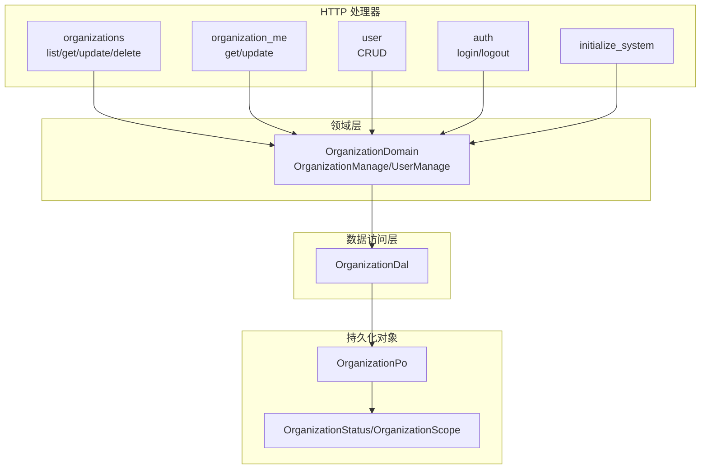
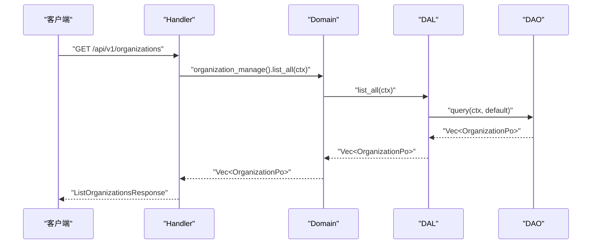
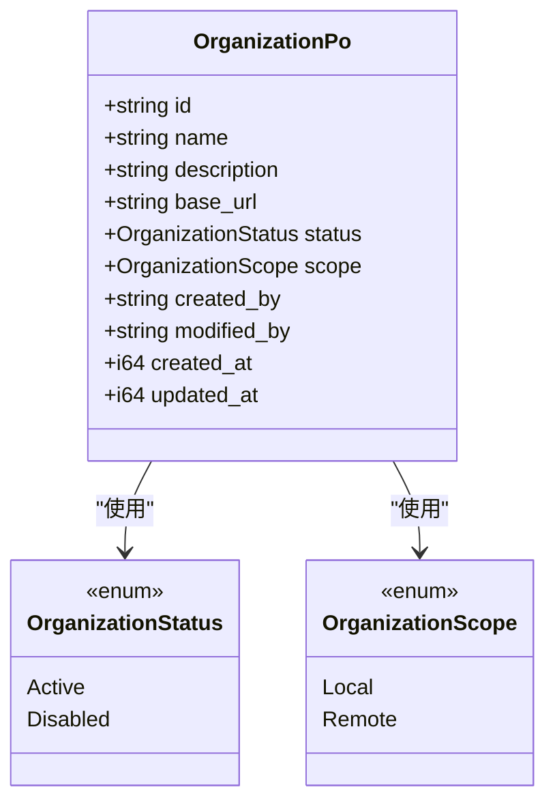
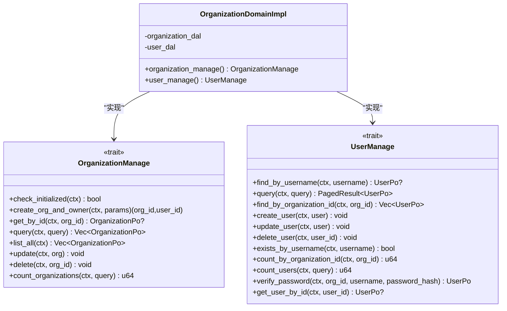
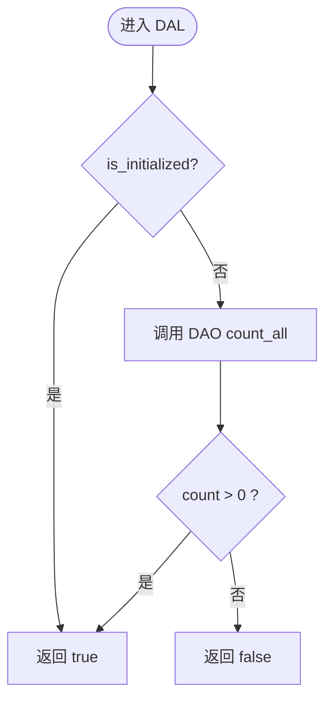
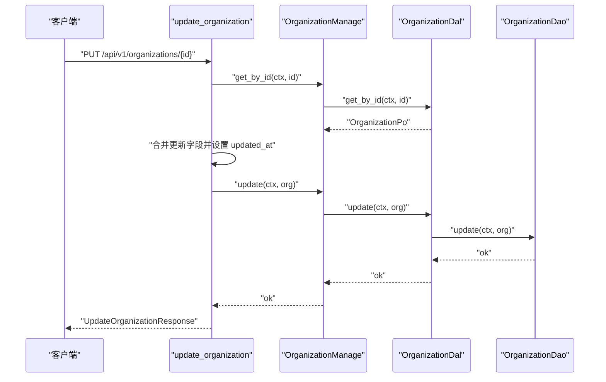

# 组织管理

<cite>
**本文引用的文件**
- [organization_design.md](docs/organization_design.md)
- [mod.rs（handlers/organization）](src/handlers/organization/mod.rs)
- [mod.rs（handlers/organization/organizations）](src/handlers/organization/organizations/mod.rs)
- [list_organizations.rs](src/handlers/organization/organizations/list_organizations.rs)
- [get_organization.rs](src/handlers/organization/organizations/get_organization.rs)
- [update_organization.rs](src/handlers/organization/organizations/update_organization.rs)
- [delete_organization.rs](src/handlers/organization/organizations/delete_organization.rs)
- [mod.rs（service/domain/organization）](src/service/domain/organization/mod.rs)
- [organization.rs（DAL）](src/service/dal/organization.rs)
- [mod.rs（DAO organization）](src/service/dao/organization/mod.rs)
- [organization.rs（模型）](src/models/organization.rs)
- [organization.rs（枚举）](common/src/enums/organization.rs)
- [organization.rs（DTO）](common/src/api/organization.rs)
- [organization/sqlite.rs（DAO 实现）](src/service/dao/organization/sqlite.rs)
- [message.rs（DAL）](src/service/dal/message.rs)
- [add_org_config.sql（迁移）](migrations/20260830000000_add_org_config.sql)
- [organization_link.rs（模型）](src/models/organization_link.rs)
- [organization_pairing_code.rs（模型）](src/models/organization_pairing_code.rs)
- [organization_link.rs（DTO）](common/src/api/organization_link.rs)
- [organization/links/mod.rs（handler 模块）](src/handlers/organization/links/mod.rs)
- [federation_directory.rs（consumer）](src/consumer/federation_directory.rs)
- [federation_ws_outbound.rs（consumer）](src/consumer/federation_ws_outbound.rs)
- [federation_inbound_task.rs（consumer）](src/consumer/federation_inbound_task.rs)
- [20260904000001-000004 + 20260905000001（联邦迁移）](migrations/20260904000001_add_group_name_to_org.sql)
- [pkg/ws/mod.rs](src/pkg/ws/mod.rs)
- 【② Plan 落地】[docs/plan/组织组网与去中心化联邦方案.md](docs/plan/组织组网与去中心化联邦方案.md)

**本文关联的 RAG 知识卡**
- docs/wiki/knowledge/zh/组织权限与用户偏好：Organization多级 + UserRole并查集继承 + JWT双模式 + 偏好双源沉淀 + Agent入职五步/组织权限与用户偏好：Organization多级 + UserRole并查集继承 + JWT双模式 + 偏好双源沉淀 + Agent入职五步.md
</cite>

## 更新摘要（2026-08-31）

本次变更新增**组织级可扩展配置系统**，在组织管理模块中引入组织维度的持久化开关：

**DB 迁移**：`migrations/20260830000000_add_org_config.sql` 为 organizations 表新增 `config TEXT NOT NULL DEFAULT '{}'` 列，以 JSON 承载可扩展配置，后续新增配置项无需改表。

**DTO 新增与扩展**：`common/src/api/organization.rs` 新增 `OrganizationConfig { enable_message_vector: bool }`（所有字段 `#[serde(default)]`），`OrganizationInfoResponse` 新增 config 字段返回，`UpdateCurrentOrganizationRequest` / `UpdateOrganizationRequest` 新增 `config: Option<OrganizationConfig>` 支持超级管理员修改。

**DAO 缓存 + 读写穿**：`src/service/dao/organization/sqlite.rs` 新增 `ORG_CONFIG_CACHE` 全局缓存（读穿 + 写穿双模式），`get_org_config` 先查缓存未命中回退 DB 并回填，`set_org_config` 先落盘再刷缓存。

**DAL + Domain 透传**：`OrganizationDal` / `OrganizationManage` trait 新增 `get_org_config` / `update_org_config`，impl 层薄封装透传 DAO。

**下游消费**：消息 DAL 落库时经 DAO 缓存检查 `enable_message_vector`，默认 false 跳过向量索引构建，避免每条消息回查 DB。

## 目录
1. [简介](#简介)
2. [项目结构](#项目结构)
3. [核心组件](#核心组件)
4. [架构总览](#架构总览)
5. [详细组件分析](#详细组件分析)
6. [依赖关系分析](#依赖关系分析)
7. [性能考虑](#性能考虑)
8. [故障排查指南](#故障排查指南)
9. [结论](#结论)
10. [附录：API 文档](#附录api-文档)

## 简介
本章节面向“组织管理”能力，覆盖组织架构设计、组织 CRUD、当前组织管理、组织层级与权限、多租户隔离策略与数据访问控制机制。系统采用严格四层单向调用：Adapter（HTTP Handler / 公开回调）→ Domain → DAL → DAO，禁止跨层调用与同层互调；Domain 输入为 Command/Query，输出为业务实体与内部事件；DAL 对外接口统一使用业务实体，PO 仅在 DAO/DAL 内部使用。

## 项目结构
组织管理相关代码按功能二次分组，Handler 层包含：
- 组织管理：获取列表、获取详情、更新、删除
- 当前组织：获取当前组织、更新当前组织
- 用户管理：创建、查询、更新、删除
- 认证：登录、登出
- 系统初始化：首次启动创建首个组织与超级管理员

图表来源
- [mod.rs（handlers/organization）:1-15](src/handlers/organization/mod.rs#L1-L15)
- [mod.rs（service/domain/organization）:1-200](src/service/domain/organization/mod.rs#L1-L200)
- [organization.rs（DAL）:1-126](src/service/dal/organization.rs#L1-L126)
- [organization.rs（模型）:1-62](src/models/organization.rs#L1-L62)
- [organization.rs（枚举）:1-101](common/src/enums/organization.rs#L1-L101)

章节来源
- [organization_design.md:1-218](docs/organization_design.md#L1-L218)
- [mod.rs（handlers/organization）:1-15](src/handlers/organization/mod.rs#L1-L15)

## 核心组件
- 领域层 OrganizationDomain：聚合组织管理与用户管理能力，提供单例与初始化入口，所有公共方法首参为 RequestContext，跨层传递使用 ctx.clone()。
- 数据访问层 OrganizationDal：封装 DAO，提供 is_initialized、get_by_id、create、query、list_all、update、delete、count 等统一接口。
- 持久化对象 OrganizationPo：包含 id、name、description、base_url、status、scope、created_by、modified_by、created_at、updated_at。
- 枚举类型：OrganizationStatus（Active/Disabled）、OrganizationScope（Local/Remote）。

章节来源
- [mod.rs（service/domain/organization）:1-200](src/service/domain/organization/mod.rs#L1-L200)
- [organization.rs（DAL）:1-126](src/service/dal/organization.rs#L1-L126)
- [organization.rs（模型）:1-62](src/models/organization.rs#L1-L62)
- [organization.rs（枚举）:1-101](common/src/enums/organization.rs#L1-L101)

## 架构总览
组织管理遵循 Adapter → Domain → DAL → DAO 的单向调用链。Handler 仅负责参数校验、上下文组装与响应映射；Domain 编排业务逻辑；DAL 屏蔽 DAO 差异；DAO 实现具体 SQL 操作。

图表来源
- [list_organizations.rs:1-40](src/handlers/organization/organizations/list_organizations.rs#L1-L40)
- [mod.rs（service/domain/organization）:1-200](src/service/domain/organization/mod.rs#L1-L200)
- [organization.rs（DAL）:1-126](src/service/dal/organization.rs#L1-L126)
- [mod.rs（DAO organization）:1-40](src/service/dao/organization/mod.rs#L1-L40)

## 详细组件分析

### 组织数据模型与枚举
- OrganizationPo：组织主数据，包含状态与范围字段，用于多节点网络扩展与生命周期管理。
- OrganizationStatus：Active 表示正常，Disabled 表示禁用（软删除语义）。
- OrganizationScope：Local 表示本地运行，Remote 表示远程节点。

图表来源
- [organization.rs（模型）:1-62](src/models/organization.rs#L1-L62)
- [organization.rs（枚举）:1-101](common/src/enums/organization.rs#L1-L101)

章节来源
- [organization.rs（模型）:1-62](src/models/organization.rs#L1-L62)
- [organization.rs（枚举）:1-101](common/src/enums/organization.rs#L1-L101)

### 领域层：OrganizationDomain
- 提供 OrganizationManage 与 UserManage 两个子能力。
- 所有方法首参为 RequestContext，支持跨层透传与上下文隔离。
- 关键方法：check_initialized、create_org_and_owner、get_by_id、query、list_all、update、delete、count_organizations。

图表来源
- [mod.rs（service/domain/organization）:1-200](src/service/domain/organization/mod.rs#L1-L200)

章节来源
- [mod.rs（service/domain/organization）:1-200](src/service/domain/organization/mod.rs#L1-L200)

### 数据访问层：OrganizationDal
- 封装 DAO，提供 is_initialized、get_by_id、create、query、list_all、update、delete、count_organizations、count。
- list_all 通过默认查询条件复用通用 query。
- count_organizations 是 count 的语法糖。

图表来源
- [organization.rs（DAL）:1-126](src/service/dal/organization.rs#L1-L126)
- [mod.rs（DAO organization）:1-40](src/service/dao/organization/mod.rs#L1-L40)

章节来源
- [organization.rs（DAL）:1-126](src/service/dal/organization.rs#L1-L126)
- [mod.rs（DAO organization）:1-40](src/service/dao/organization/mod.rs#L1-L40)

### HTTP 处理器：组织 CRUD
- 列表：GET /api/v1/organizations，返回组织列表与总数。
- 详情：GET /api/v1/organizations/{id}，不存在时返回未找到错误。
- 更新：PUT /api/v1/organizations/{id}，支持名称、描述、基础 URL、状态更新，自动更新时间戳。
- 删除：DELETE /api/v1/organizations/{id}，高危操作，不注册为 Agent 工具。

图表来源
- [update_organization.rs:1-68](src/handlers/organization/organizations/update_organization.rs#L1-L68)
- [mod.rs（service/domain/organization）:1-200](src/service/domain/organization/mod.rs#L1-L200)
- [organization.rs（DAL）:1-126](src/service/dal/organization.rs#L1-L126)
- [mod.rs（DAO organization）:1-40](src/service/dao/organization/mod.rs#L1-L40)

章节来源
- [list_organizations.rs:1-40](src/handlers/organization/organizations/list_organizations.rs#L1-L40)
- [get_organization.rs:1-48](src/handlers/organization/organizations/get_organization.rs#L1-L48)
- [update_organization.rs:1-68](src/handlers/organization/organizations/update_organization.rs#L1-L68)
- [delete_organization.rs:1-24](src/handlers/organization/organizations/delete_organization.rs#L1-L24)

### 当前组织管理
- 获取当前组织：基于请求上下文中的组织标识读取。
- 更新当前组织：在权限允许范围内更新当前组织的配置项。

章节来源
- [mod.rs（handlers/organization/organization_me）:1-8](src/handlers/organization/organization_me/mod.rs#L1-L8)

### 系统初始化流程
- 服务启动后检查是否已初始化。
- 若未初始化，前端跳转初始化向导，填写组织信息与管理员信息。
- 后端创建组织与超级管理员用户，返回组织 ID 与用户 ID，完成初始化后跳转登录页。

章节来源
- [organization_design.md:75-87](docs/organization_design.md#L75-L87)

## 依赖关系分析
- Handler 依赖 Domain 暴露的组织/用户管理能力。
- Domain 依赖 DAL 提供的数据访问抽象。
- DAL 依赖 DAO 的具体实现（SQLite）。
- 模型与枚举被 DAL/DAO/Handler 共同引用，保证数据结构一致性。

图表来源
- [mod.rs（handlers/organization）:1-15](src/handlers/organization/mod.rs#L1-L15)
- [mod.rs（service/domain/organization）:1-200](src/service/domain/organization/mod.rs#L1-L200)
- [organization.rs（DAL）:1-126](src/service/dal/organization.rs#L1-L126)
- [mod.rs（DAO organization）:1-40](src/service/dao/organization/mod.rs#L1-L40)
- [organization.rs（模型）:1-62](src/models/organization.rs#L1-L62)
- [organization.rs（枚举）:1-101](common/src/enums/organization.rs#L1-L101)

章节来源
- [mod.rs（handlers/organization）:1-15](src/handlers/organization/mod.rs#L1-L15)
- [mod.rs（service/domain/organization）:1-200](src/service/domain/organization/mod.rs#L1-L200)
- [organization.rs（DAL）:1-126](src/service/dal/organization.rs#L1-L126)
- [mod.rs（DAO organization）:1-40](src/service/dao/organization/mod.rs#L1-L40)

## 性能考虑
- 列表与计数分离：DAL 提供 count_organizations/count，避免不必要的 LIST 查询开销。
- 通用查询复用：query 支持组合条件，count 复用 filter 逻辑，减少重复 SQL 构建。
- 软删除与状态：通过 OrganizationStatus 控制可见性，减少无效数据扫描。
- 上下文隔离：RequestContext 贯穿调用链，确保多租户隔离与审计追踪。

[本节为通用指导，无需特定文件来源]

## 故障排查指南
- 组织不存在：获取详情时若未找到记录，将返回未找到错误。
- 权限不足：更新与删除操作需具备相应权限，建议在路由层或中间件进行最小权限校验。
- 初始化失败：检查 organizations 表是否有记录，确认初始化流程是否完整执行。

章节来源
- [get_organization.rs:1-48](src/handlers/organization/organizations/get_organization.rs#L1-L48)
- [organization_design.md:75-87](docs/organization_design.md#L75-L87)

## 结论
组织管理模块以清晰的四层架构实现，职责边界明确，便于扩展与维护。通过 Domain 聚合能力、DAL 统一接口、DAO 具体实现，保证了高内聚低耦合。结合 RequestContext 的多租户隔离与状态/范围枚举，满足多节点与多租户场景下的数据访问控制需求。

[本节为总结，无需特定文件来源]

## 附录：API 文档

### 组织列表查询
- 方法：GET
- 路径：/api/v1/organizations
- 请求体：无
- 响应体：ListOrganizationsResponse（data: List of OrganizationListItem, total: u64）
- 说明：返回当前用户可访问的所有组织列表及总数。

章节来源
- [list_organizations.rs:1-40](src/handlers/organization/organizations/list_organizations.rs#L1-L40)

### 单个组织获取
- 方法：GET
- 路径：/api/v1/organizations/{id}
- 请求体：无
- 响应体：GetOrganizationResponse（data: OrganizationInfoResponse）
- 说明：根据组织 ID 获取基本信息；不存在时返回未找到错误。

章节来源
- [get_organization.rs:1-48](src/handlers/organization/organizations/get_organization.rs#L1-L48)

### 组织信息更新
- 方法：PUT
- 路径：/api/v1/organizations/{id}
- 请求体：UpdateOrganizationRequest（name?, description?, base_url?, status?）
- 响应体：UpdateOrganizationResponse（data: OrganizationInfoResponse）
- 说明：仅管理员可更新；自动设置 updated_at。

章节来源
- [update_organization.rs:1-68](src/handlers/organization/organizations/update_organization.rs#L1-L68)

### 组织删除
- 方法：DELETE
- 路径：/api/v1/organizations/{id}
- 请求体：无
- 响应体：DeleteOrganizationResponse（success: bool）
- 说明：高危操作，不注册为 Agent 工具；建议配合权限中间件使用。

章节来源
- [delete_organization.rs:1-24](src/handlers/organization/organizations/delete_organization.rs#L1-L24)

### 当前组织管理
- 获取当前组织：GET /api/v1/organization/me
- 更新当前组织：PUT /api/v1/organization/me
- 说明：基于请求上下文中的组织标识进行操作。

章节来源
- [mod.rs（handlers/organization/organization_me）:1-8](src/handlers/organization/organization_me/mod.rs#L1-L8)

### 系统初始化
- 方法：POST
- 路径：/api/organization/initialize
- 请求体：InitializeSystemRequest（组织名称、描述、管理员用户名、密码哈希、显示名、邮箱；`chat_model: Option<ModelProviderInitConfig>` + `embedding_model: Option<ModelProviderInitConfig>` 均为可选，`#[serde(default)]`）
- 响应体：`InitializeSystemResponse { organization_id, user_id, chat_provider_id: Option<String>, embedding_provider_id: Option<String> }`；未配置对应模型时 provider_id 为 null
- 说明：首次启动创建首个组织与超级管理员用户。对话/向量模型均为可选，未配置时跳过并提示后果（创建 Agent 前需在模型管理中补配；向量模型补配会自动触发全量重建）。

章节来源
- [organization.rs（API DTO）:7-62](common/src/api/organization.rs#L7-L62)
- [initialize_system.rs](src/handlers/organization/initialize_system.rs)

### 多租户隔离与数据访问控制
- 隔离维度：
  - 组织级隔离：所有数据访问均携带 RequestContext，确保按组织过滤。
  - 状态与范围：OrganizationStatus 控制启用/禁用；OrganizationScope 区分本地/远程节点。
- 访问控制：
  - 路由层/中间件进行最小权限校验（如 require_role_middleware）。
  - 领域层二次校验（如 UserRole::has_permission）。
- 审计追踪：
  - created_by、modified_by、created_at、updated_at 记录变更轨迹。

章节来源
- [organization.rs（模型）:1-62](src/models/organization.rs#L1-L62)
- [organization.rs（枚举）:1-101](common/src/enums/organization.rs#L1-L101)
- [organization_design.md:150-158](docs/organization_design.md#L150-L158)