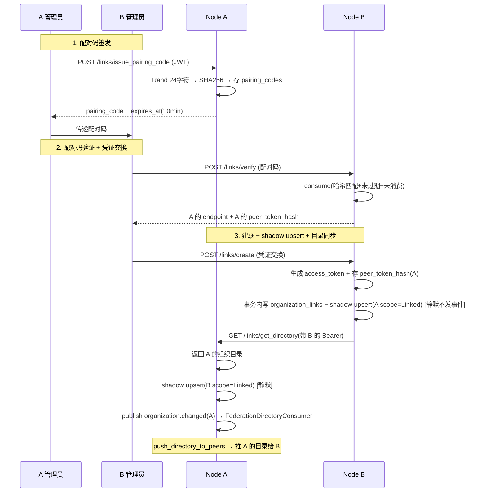
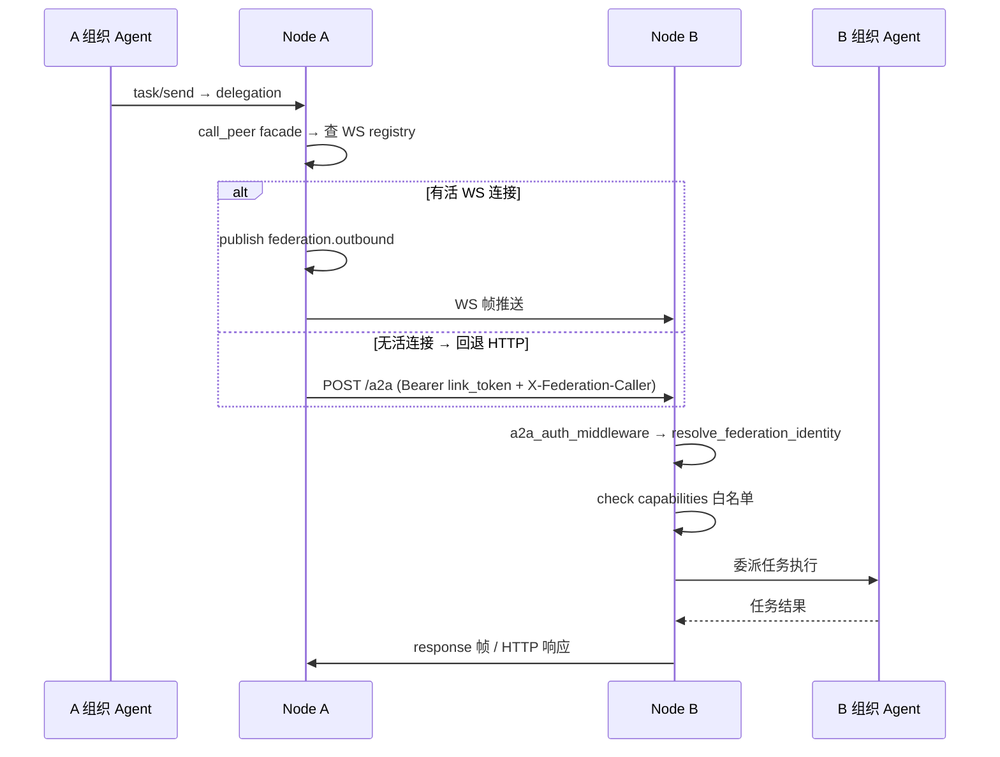

# 组织组网与联邦

<cite>
**本文引用的文件**
- [common/src/enums/organization.rs](common/src/enums/organization.rs)
- [common/src/api/organization_link.rs](common/src/api/organization_link.rs)
- [src/models/organization_link.rs](src/models/organization_link.rs)
- [src/models/organization_pairing_code.rs](src/models/organization_pairing_code.rs)
- [src/service/dao/organization_link/mod.rs](src/service/dao/organization_link/mod.rs)
- [src/service/dao/organization_link/sqlite.rs](src/service/dao/organization_link/sqlite.rs)
- [src/service/dao/organization_pairing/mod.rs](src/service/dao/organization_pairing/mod.rs)
- [src/service/dao/organization_pairing/sqlite.rs](src/service/dao/organization_pairing/sqlite.rs)
- [src/service/domain/organization/org.rs](src/service/domain/organization/org.rs)
- [src/service/dal/organization.rs](src/service/dal/organization.rs)
- [src/handlers/organization/links/mod.rs](src/handlers/organization/links/mod.rs)
- [src/consumer/federation_directory.rs](src/consumer/federation_directory.rs)
- [src/consumer/federation_ws_outbound.rs](src/consumer/federation_ws_outbound.rs)
- [src/consumer/federation_inbound_task.rs](src/consumer/federation_inbound_task.rs)
- [src/models/events/federation.rs](src/models/events/federation.rs)
- [migrations/20260904000001_add_group_name_to_org.sql](migrations/20260904000001_add_group_name_to_org.sql)
- [migrations/20260904000002_create_organization_links.sql](migrations/20260904000002_create_organization_links.sql)
- [migrations/20260904000003_create_organization_pairing_codes.sql](migrations/20260904000003_create_organization_pairing_codes.sql)
- [migrations/20260904000004_add_capabilities_to_organization_links.sql](migrations/20260904000004_add_capabilities_to_organization_links.sql)
- [migrations/20260905000001_organizations_addresses.sql](migrations/20260905000001_organizations_addresses.sql)
- [src/pkg/ws/mod.rs](src/pkg/ws/mod.rs)
- 【② Plan 落地】[docs/plan/组织组网与去中心化联邦方案.md](docs/plan/组织组网与去中心化联邦方案.md) — Phase 1 评审稿：ADR D1-D7 + scope 三态 + 配对码协议 + 分阶段实施
- 【② Plan 落地】[docs/plan/跨组织业务调用方案.md](docs/plan/跨组织业务调用方案.md) — Phase 2 主体：双模鉴权 + 能力白名单 + receptionist 接待模型
- 【④ RAG 知识卡】[联邦组网地基](docs/wiki/knowledge/zh/联邦组网地基：scope%20三态%20+%20organization_links%20+%20pairing_code%20+%20目录同步%20+%20WS%20长连接/联邦组网地基：scope%20三态%20+%20organization_links%20+%20pairing_code%20+%20目录同步%20+%20WS%20长连接.md) — scope 三态 + 连接契约 + 配对码 + shadow upsert + 目录推拉 + WS 长连接 + §4 硬约束 10 条
- 【④ RAG 知识卡】[跨组织业务调用鉴权模型](docs/wiki/knowledge/zh/跨组织业务调用鉴权模型：dual-mode%20auth%20+%20federation_identity%20+%20delegation%20+%20audit%20+%20capabilities/跨组织业务调用鉴权模型：dual-mode%20auth%20+%20federation_identity%20+%20delegation%20+%20audit%20+%20capabilities.md) — 鉴权子主题：双模鉴权 + federation_identity 纯函数 + receptionist + capabilities 白名单
- 【关联长文】[用户与组织管理](docs/wiki/zh/content/功能模块/用户与组织管理/用户与组织管理.md) — scope 三态扩展 + 组织间组网关系说明
- 【关联长文】[Organization 领域编排](docs/wiki/zh/content/架构设计/分层架构设计/Domain%20层编排/Organization%20领域编排.md) — OrganizationManage trait 扩展：联邦能力 + 静默 shadow upsert
- 【关联长文】[跨组织业务调用鉴权](docs/wiki/zh/content/功能模块/用户与组织管理/跨组织业务调用鉴权.md) — 鉴权模型独立长文（兄弟篇）
- **2026-09-05 更新摘要**：联邦组网 Phase 1+2 全量落地。scope 三态扩展（Local/Linked/Remote）+ group_name 展示标签 + organization_links 连接契约表 + organization_pairing_codes 配对码表 + 5 个 migration。组网配对协议（签发→验证→凭证交换→建联→shadow upsert→目录拉取）+ 目录推拉同步（推送保证时效 + cron 定时对账保证最终一致）。WS 长连接（pkg::ws 通用管理器 + adapter 模式业务解耦）+ federation.outbound / federation.inbound.* 事件帧。跨组织鉴权（/a2a 双模鉴权中间件 + federation_identity 纯函数 + receptionist 接待模型 + capabilities 连接级白名单）。caller_organization_id 计量管道 + JWT Claims iss/aud 扩展。
</cite>

## 目录
1. [简介](#简介)
2. [架构总览](#架构总览)
3. [核心组件详解](#核心组件详解)
4. [数据流：配对到建联](#数据流配对到建联)
5. [数据流：跨组织调用](#数据流跨组织调用)
6. [设计决策（ADR）](#设计决策adr)
7. [安全与约束](#安全与约束)
8. [故障排查指南](#故障排查指南)
9. [总结](#总结)
10. [附录：迁移 SQL 汇总](#附录迁移-sql-汇总)

## 简介
本章节面向 AI Orz 的组织组网与去中心化联邦能力，系统性说明跨组织点对点建联、目录同步、跨组织业务调用（A2A Agent 委派）的完整技术体系。内容覆盖：scope 三态数据模型扩展、配对码握手协议、连接契约表、shadow upsert 静默影子写入、目录推拉结合同步、WS 长连接通信通道、跨组织鉴权模型、能力白名单门禁。

**核心理念**：无主节点的去中心化组网——任何两个 ai_orz 节点上的组织可以独立建联；网络靠重复配对自然生长；目录最终一致可接受（集团/组名是展示标签，不参与逻辑判断，消除分布式一致性痛点）。

## 架构总览

```mermaid
graph TB
subgraph "A 组织 (Node A)"
A_org[Organization scope=Local]
A_link[organization_links<br/>local=A peer=B<br/>access_token → B<br/>peer_token_hash ← B]
A_shadow_B[Organization shadow<br/>scope=Linked<br/>(B 的影子)]
A_WS[federation_ws_outbound<br/>+ federation_inbound_task]
end
subgraph "B 组织 (Node B)"
B_org[Organization scope=Local]
B_link[organization_links<br/>local=B peer=A<br/>access_token → A<br/>peer_token_hash ← A]
B_shadow_A[Organization shadow<br/>scope=Linked<br/>(A 的影子)]
B_WS[federation_ws_outbound<br/>+ federation_inbound_task]
end
A_link <-- 唯一约束 (local_org_id, peer_org_id) --> B_link
A_WS <-- federation.outbound / federation.inbound.send_task --> B_WS
A_org --> A_link
B_org --> B_link
A_link --> A_shadow_B
B_link --> B_shadow_A
```

**图表来源**
- [organization_link.rs:L1-L89](src/models/organization_link.rs#L1-L89)
- [org.rs:L1-L1294](src/service/domain/organization/org.rs#L1-L1294)

## 核心组件详解

### 数据模型层
- **OrganizationScope 三态**：Local(0) 本地自建组织 / Linked(1) 已建联对端（organizations 影子记录，双向可通信）/ Remote(2) 仅目录同步所得影子（只读）。scope 默认值 Local，由 migration ALTER TABLE organizations ADD COLUMN scope INTEGER NOT NULL DEFAULT 0。
- **organization_links 连接契约表**：独立表承载 endpoint + access_token(明文出站) + peer_token_hash(SHA256 入站校验) + capabilities(JSON 数组) + status + 唯一约束 (local_org_id, peer_org_id)。凭证不进 organizations 表，防止放大泄漏面。
- **organization_pairing_codes 配对码表**：短时效（10 分钟）单用途握手凭证。仅存 SHA256 code_hash（明文不出库）。consume 原子完成哈希匹配 + 未消费 + 未过期 + 置 consumed_at 四判定。

### Domain 层
- **OrganizationManage 联邦扩展**（src/service/domain/organization/org.rs）：issue_pairing_code → verify_pairing_code → create_link（双向凭证交换 + shadow upsert 对端影子 + 目录拉取）→ list_links → revoke_link → push_directory_to_peers → reconcile_directories。
- **call_peer facade**：DAL 层统一出站入口，先查 WS registry 有活连接则 publish federation.outbound，无则回退 HTTP A2aRuntimeDao。

### AOP Consumer 层
- **FederationDirectoryConsumer**：订阅 organization.changed → push_directory_to_peers 全量推送。
- **FederationWsOutboundConsumer**：订阅 federation.outbound → ws::connection push 帧。
- **FederationInboundTaskConsumer**：订阅 federation.inbound.send_task → 复用 HTTP send_task 核心函数 → publish response 帧。

### HTTP Handler 层
- 统一前缀 `/api/v1/organization/links/*`：issue_pairing_code / verify_pairing_code / create_link / list_links / revoke_link / get_directory / sync_directory / get_capabilities。generate_http_handler 宏标注，**不注册 register_handler_tool** 防 Agent 误触。

章节来源
- [org.rs:L1-L1294](src/service/domain/organization/org.rs#L1-L1294)
- [organization.rs(DAL):L1-L515](src/service/dal/organization.rs#L1-L515)
- [handlers/links/mod.rs:L1-L27](src/handlers/organization/links/mod.rs#L1-L27)

## 数据流：配对到建联



章节来源
- [organization_link/api:L1-L329](common/src/api/organization_link.rs#L1-L329)
- [org.rs:L1-L1294](src/service/domain/organization/org.rs#L1-L1294)

## 数据流：跨组织调用



章节来源
- [a2a_auth.rs:L1-L108](src/middleware/a2a_auth.rs#L1-L108)
- [federation_identity.rs:L1-L117](src/middleware/federation_identity.rs#L1-L117)
- [organization.rs(DAL):L1-L515](src/service/dal/organization.rs#L1-L515)

## 设计决策（ADR）

| # | 决策 | 理由 |
|---|------|------|
| D1 | 集团 = group_name 纯展示标签，不参与任何逻辑判断 | 消解分布式一致性：可重名、可不同步、无权威源；名字错了只影响显示 |
| D2 | scope 三态 Local/Linked/Remote | "能否通信"只看 Linked，判断规则极简；Remote = 目录同步所得影子 |
| D3 | 去中心化，无锚点/主节点 | 组织对等建联；目录靠配对时 gossip 传播，最终一致可接受 |
| D4 | 连接参数独立 organization_links 表，不进 organizations | organizations 是高频 join 表，凭证混入会放大泄漏面 |
| D5 | 配对码模式，复用邀请码机制 | 不收对方管理员账密（安全红线）；24 字符 + 10min TTL + 用后即焚 |
| D6 | capabilities 默认 '[]'，建联即拒绝全部跨组织能力 | fail-closed 设计；建联后显式追加 |
| D7 | /a2a 双模鉴权独立中间件，与 JWT middleware 并存 | 本地用户（Cookie/Bearer）+ 对端（link Bearer + 声明头）两类调用方走同一 handler |

**ADR 完整清单见** [docs/plan/组织组网与去中心化联邦方案.md](docs/plan/组织组网与去中心化联邦方案.md)

## 安全与约束

1. **配对码 consume 错误统一返回 None**——绝不区分无效/过期/已使用，防枚举探测
2. **access_token 明文出站存本地，peer_token_hash SHA256 入站校验**——禁止任何一侧存对方 token 明文
3. **create_link 双写（organization_links + shadow upsert）包同一个事务**——防止半残状态
4. **handlers/organization/links 只标 generate_http_handler，不注册 register_handler_tool**——防 Agent 误触组网
5. **federation_identity 纯函数不绑定传输层**——HTTP 和 WS 握手共用同一份解析逻辑
6. **capabilities 空数组默认无能力开放**——建联后显式追加
7. **目录推送 best-effort，不阻断主流程**——推送失败走 cron 对账兜底

章节来源
- [organization_pairing/sqlite.rs:L1-L77](src/service/dao/organization_pairing/sqlite.rs#L1-L77)
- [organization_link.rs:L1-L89](src/models/organization_link.rs#L1-L89)

## 故障排查指南

1. **配对码签发了但 verify 总是返回 None** → 检查 pairing_codes 表记录的 expires_at 是否小于当前时间戳（10 分钟 TTL 过了）；检查 code_hash 是否正确——签发方存的是 SHA256(plain_code)，验证方也必须 SHA256 后再查
2. **建联成功但 list_links 查不到对端** → 检查 shadow upsert 事务是否完整（create_link 时 pair 写 + organization scope Linked 写包了同一个事务）；检查 DAO::find_by_pair 是否正确用了 (local_org_id, peer_org_id) 联合键
3. **跨组织调用 403 "capability not allowed"** → 查 organization_links 表 capabilities 列 JSON 内容——建联时默认是 '[]'，必须显式追加 `["a2a_task"]` 等能力
4. **WS 出站 consumer 日志 WARN "no active WS connection"** → call_peer facade 走 WS 但注册表没有对端活连接；检查 FederationWsOutboundConsumer 对端是否已成功握手；必要时手动走 HTTP fallback（facade 代码会自动判断）
5. **目录同步后 organizations 表 scope=Linked 但不发事件** → 这是预期行为（shadow upsert 走 PeerOrgUpsert 静默写入）；普通组织创建才会发 organization.changed 事件触发 FederationDirectoryConsumer

## 总结

联邦组网 Phase 1+2 全量落地，实现了从零到可用的跨组织点对点建联能力。scope 三态扩展保持简单的"能否通信=scope==Linked"判定规则；connection contract 与 entity 分离的设计避免了凭证泄漏面放大；配对码协议的单用途原子消费设计防止了枚举攻击；目录推拉结合保证时效+最终一致；WS 长连接通过 pkg::ws 通用管理器 + adapter 模式实现业务解耦。跨组织鉴权通过双模中间件 + federation_identity 纯函数实现一套逻辑服务两条链路（HTTP + WS）。

## 附录：迁移 SQL 汇总

| 文件名 | 作用 | 关键 SQL |
|--------|------|----------|
| 20260904000001 | group_name 展示标签 | `ALTER TABLE organizations ADD COLUMN group_name TEXT NOT NULL DEFAULT ''` |
| 20260904000002 | organization_links 建表 | `CREATE TABLE organization_links (..., UNIQUE(local_org_id, peer_org_id))` |
| 20260904000003 | organization_pairing_codes 建表 | `CREATE TABLE organization_pairing_codes (..., consumed_at TEXT DEFAULT NULL)` |
| 20260904000004 | capabilities 白名单 | `ALTER TABLE organization_links ADD COLUMN capabilities TEXT NOT NULL DEFAULT '[]'` |
| 20260905000001 | addresses 多地址 + scope ALTER | `ALTER TABLE organizations ADD COLUMN addresses TEXT NOT NULL DEFAULT '[]'` + `ADD COLUMN scope INTEGER NOT NULL DEFAULT 0` |
