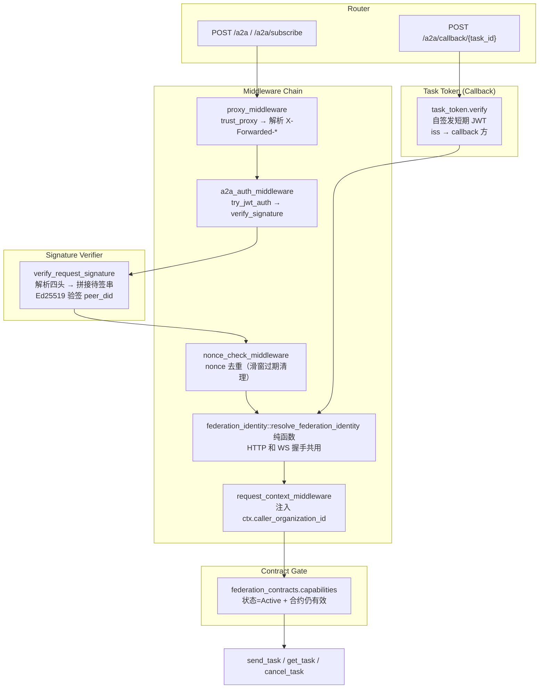

# 跨组织业务调用鉴权

<cite>
**本文引用的文件**
- [src/middleware/a2a_auth.rs](src/middleware/a2a_auth.rs)
- [src/middleware/federation_identity.rs](src/middleware/federation_identity.rs)
- [src/pkg/jwt.rs](src/pkg/jwt.rs)
- [src/pkg/request_context.rs](src/pkg/request_context.rs)
- [src/service/dao/agent_runtime/a2a.rs](src/service/dao/agent_runtime/a2a.rs)
- [src/service/dal/organization.rs](src/service/dal/organization.rs)
- [common/src/api/organization_link.rs](common/src/api/organization_link.rs)
- [common/src/constants/http_header.rs](common/src/constants/http_header.rs)
- [src/router.rs](src/router.rs)
- [src/consumer/federation_inbound_task.rs](src/consumer/federation_inbound_task.rs)
- 【② Plan 落地】[docs/plan/跨组织业务调用方案.md](docs/plan/跨组织业务调用方案.md) — Phase 2 设计稿：P1+P2 双模鉴权 → P3 capabilities endpoint → P4 A2A delegation e2e → P5 federation_agents → P6 receptionist identity → 方案②凭证直传拍板
- 【② Plan 落地】[docs/plan/组织组网与去中心化联邦方案.md](docs/plan/组织组网与去中心化联邦方案.md) — Phase 1 组网地基（鉴权的前置依赖）
- 【④ RAG 知识卡】[跨组织业务调用鉴权模型](docs/wiki/knowledge/zh/跨组织业务调用鉴权模型：dual-mode%20auth%20+%20federation_identity%20+%20delegation%20+%20audit%20+%20capabilities/跨组织业务调用鉴权模型：dual-mode%20auth%20+%20federation_identity%20+%20delegation%20+%20audit%20+%20capabilities.md) — 双模鉴权时序 + federation_identity 纯函数 + receptionist + capabilities 白名单 §4 硬约束 7 条
- 【④ RAG 知识卡】[联邦组网地基](docs/wiki/knowledge/zh/联邦组网地基：scope%20三态%20+%20organization_links%20+%20pairing_code%20+%20目录同步%20+%20WS%20长连接/联邦组网地基：scope%20三态%20+%20organization_links%20+%20pairing_code%20+%20目录同步%20+%20WS%20长连接.md) — 组网地基（兄弟卡：鉴权依赖连接）
- 【关联长文】[路由和中间件](docs/wiki/zh/content/核心模块/路由和中间件.md) — /a2a 路由组双模鉴权扩展
- 【关联长文】[A2A Server 模式](docs/wiki/zh/content/项目概述/核心功能特性/A2A%20协议支持/A2A%20Server%20模式.md) — /a2a handler 路由现在接受双模鉴权
- 【关联长文】[组织组网与联邦](docs/wiki/zh/content/功能模块/用户与组织管理/组织组网与联邦.md) — 组网地基独立长文（兄弟篇）
- **2026-09-05 更新摘要**：跨组织鉴权全量落地。/a2a 双模鉴权中间件（本地 JWT Cookie/Bearer + 对端 link access_token Bearer + X-Federation-Caller 声明头）。federation_identity 纯函数——HTTP 和 WS 握手共用同一份解析逻辑，不绑定传输层。receptionist 接待身份模型为每个建联对端分配内部用户，审计与权限体系与本地同构。capabilities 连接级白名单 fail-closed 默认 '[]'。caller_organization_id 计量管道 + JWT Claims iss/aud 扩展。
- [src/pkg/crypto/mod.rs:1-L50](src/pkg/crypto/mod.rs#L1-L50) — 签名基建模块入口
- [src/pkg/crypto/did.rs:1-L80](src/pkg/crypto/did.rs#L1-L80) — did:key 生成与解析（Ed25519 公钥编码）
- [src/pkg/crypto/task_token.rs:1-L60](src/pkg/crypto/task_token.rs#L1-L60) — 任务令牌（异步回调自签短期 JWT）
- [src/pkg/nonce.rs:1-L40](src/pkg/nonce.rs#L1-L40) — nonce 防重放（内存滑窗 + 过期清理）
- [src/middleware/proxy.rs:1-L60](src/middleware/proxy.rs#L1-L60) — 网关反向代理头解析（trust_proxy 安全前提）
- [src/models/federation_contract.rs:1-L80](src/models/federation_contract.rs#L1-L80) — 联邦合约数据模型（从 organization_links 独立）
- [src/service/dao/federation_contract/mod.rs:1-L60](src/service/dao/federation_contract/mod.rs#L1-L60) — 联邦合约 DAO 入口
- [src/service/dao/federation_contract/sqlite.rs:1-L120](src/service/dao/federation_contract/sqlite.rs#L1-L120) — 联邦合约 SQLite 实现
- [src/handlers/organization/contracts/mod.rs:1-L40](src/handlers/organization/contracts/mod.rs#L1-L40) — 合约授权 handler 注册
- [src/handlers/organization/contracts/list_contracts.rs:1-L40](src/handlers/organization/contracts/list_contracts.rs#L1-L40) — 合约列表查询
- [src/handlers/organization/contracts/update_contract_capabilities.rs:1-L40](src/handlers/organization/contracts/update_contract_capabilities.rs#L1-L40) — 合约能力更新
- [src/handlers/organization/contracts/terminate_contract.rs:1-L40](src/handlers/organization/contracts/terminate_contract.rs#L1-L40) — 合约熔断终止
- [migrations/20260909000001_add_federation_identity_keys.sql](migrations/20260909000001_add_federation_identity_keys.sql) — peer_did + peer_verification_key 两列新增
- [migrations/20260909000002_federation_signature_upgrade.sql](migrations/20260909000002_federation_signature_upgrade.sql) — 删除 access_token / peer_token_hash 两列（签名模式取代）
- [migrations/20260909000003_federation_contracts.sql](migrations/20260909000003_federation_contracts.sql) — federation_contracts 表创建（capabilities 下沉 + terminate 熔断）
</cite>

## 目录
1. [简介](#简介)
2. [架构总览](#架构总览)
3. [签名鉴权链路详解](#签名鉴权链路详解)
4. [联邦身份解析纯函数](#联邦身份解析纯函数)
5. [Receptionist 接待模型](#receptionist-接待模型)
6. [联邦合约授权](#联邦合约授权)
7. [回调鉴权：自签发短期任务令牌](#回调鉴权自签发短期任务令牌)
8. [审计与计量全链路](#审计与计量全链路)
9. [故障排查指南](#故障排查指南)
10. [总结](#总结)
11. [附录：错误码速查](#附录错误码速查)

## 简介
本章节面向跨组织业务调用的鉴权模型，系统性说明 AI Orz 在联邦组网之后如何安全地支持跨组织 Agent 委派。核心挑战：/a2a 是公开 A2A Server 接口，需要同时接受两类合法调用方——本地用户（既有 JWT）和建联对端节点（新的联邦凭证）。

**2026-09-10 架构升级**：旧版 access_token + peer_token_hash 对称凭证模式已全面升级为 **did:key + Ed25519 每请求签名**。每条 organization_links 记录现在存储对端的 `peer_did`（did:key 形式）和 `peer_verification_key`（原始 Ed25519 公钥），出站侧使用本地私钥对每个请求独立签名，入站侧验签 + nonce 去重后放行。capabilities 白名单从 organization_links JSON 字段下沉到独立的 `federation_contracts` 表，支持 terminate 熔断终止。异步回调 `/a2a/callback/{task_id}` 使用自签发短期任务令牌（`pkg::crypto::task_token`），不再复用链路级 Bearer token。

## 架构总览



**图表来源**
- [federation_identity.rs:L1-L117](src/middleware/federation_identity.rs#L1-L117)
- [proxy.rs:L1-L60](src/middleware/proxy.rs#L1-L60)
- [nonce.rs:L1-L40](src/pkg/nonce.rs#L1-L40)
- [crypto/mod.rs:L1-L50](src/pkg/crypto/mod.rs#L1-L50)
- [crypto/did.rs:L1-L80](src/pkg/crypto/did.rs#L1-L80)

章节来源
- [crypto/did.rs](src/pkg/crypto/did.rs) — did:key 生成与解析
- [crypto/task_token.rs](src/pkg/crypto/task_token.rs) — 回调鉴权
- [nonce.rs](src/pkg/nonce.rs) — 防重放
- [router.rs](src/router.rs)

## 签名鉴权链路详解

`/a2a` JSON-RPC 入口现在接受两类合法调用方，鉴权中间件 `a2a_auth_middleware` 按优先级尝试：

1. **本地用户路径（try_jwt_auth）**：检查 Cookie `ai_orz_token` → 解析 JWT → 校验 exp + 签名 → 成功则继续。这是既有语义，完全原样保留。
2. **对端联邦路径（verify_request_signature）**：try_jwt_auth 失败时进入。执行签名链路 **5 步验证**：

   **Step 1：提取四头**
   - `X-Federation-Did`：调用方 did:key（如 `did:key:z6MkhaXgBZDvotDkL5257faiztiGiC2QtKLGpbnnEGta2doK`）
   - `X-Federation-Timestamp`：Unix 毫秒时间戳（窗口 ±300s）
   - `X-Federation-Nonce`：随机 24 字符（nonce 去重）
   - `X-Federation-Signature`：Base64(Ed25519(待签串))

   **Step 2：nonce 去重** — 查 `pkg::nonce` 内存滑窗，若 nonce ≤ 24 小时则 **reject**（防重放）

   **Step 3：时间戳校验** — |now - timestamp| > 300_000ms 则 **reject**

   **Step 4：拼接待签串**
   ```
   待签串 = `${timestamp}\n${nonce}\n${method}\n${path}\n${SHA256(body)}`
   ```

   **Step 5：验签**
   - 根据 X-Federation-Did 查 organization_links 表 → 拿到 peer_verification_key（原始 Ed25519 公钥）
   - `Ed25519::verify(peer_verification_key, 待签串, Base64::decode(signature))`
   - 同时查 federation_contracts 表，确保合约 status=Active

**fail-closed 设计**：
- 任何一步失败 → 401 "signature verification failed"（不暴露具体哪一步失败）
- 两条路径都失败 → 401 "未登录或会话过期"（统一错误消息，不泄露鉴权路径）
- proxy_middleware 解析的 `X-Forwarded-*` 头仅在 `trust_proxy=true` 时使用，防止 Header 注入

**出站侧签名**：对端组织调用本端时，出站侧执行对称的 5 步签名（使用本地 Ed25519 私钥 + 本端 did），复用同一个 `sign_request` 函数。

章节来源
- [crypto/mod.rs](src/pkg/crypto/mod.rs) — 签名基建模块
- [crypto/did.rs](src/pkg/crypto/did.rs) — did:key 生成与解析
- [nonce.rs](src/pkg/nonce.rs) — nonce 去重实现
- [proxy.rs](src/middleware/proxy.rs) — trust_proxy 安全前提

## 联邦身份解析纯函数

`middleware/federation_identity.rs` 是整个跨组织鉴权的核心——**不绑定任何传输层**：

- **输入**：已验签的 did + 已反序列化的 FederationCallerDeclaration（纯 JSON）
- **输出**：FederationIdentity{local_org_id, peer_org_id, receptionist_user_id, contract_capabilities}
- **不依赖**：axum::Request / HeadersMap / WsFrame — 任何传输层类型都不出现

HTTP 中间件（a2a_auth.rs）和 WS 长连接握手阶段（pkg::ws 升级前）都调用这同一个 `resolve_federation_identity` 函数，彻底避免两条链路鉴权逻辑漂移。WS 长连接握手 **复用每请求签名链路**（同 5 步验证），握手成功后 nonce 在连接期内跳过（连接级去重）。

解析步骤：
1. 根据 X-Federation-Did 查 organization_links 匹配 + status=Active
2. 查 federation_contracts 表 → 拿 contract.capabilities（从 link JSON 下沉）
3. 查本端为该 link 分配的 receptionist_user_id
4. 构建 FederationIdentity（纯数据，由调用方决定如何注入）

章节来源
- [federation_identity.rs:L1-L117](src/middleware/federation_identity.rs#L1-L117)
- [federation_contract/sqlite.rs](src/service/dao/federation_contract/sqlite.rs)

## Receptionist 接待模型

联邦访客（A 组织的 Agent/用户调 B 组织的 Agent）在 B 组织没有 JWT 或密码。本端为每个建联对端分配一个**接待用户**（receptionist_user_id），所有跨组织调用被视为"receptionist 在调用本端资源"。

好处：
- 权限系统不需要为联邦调用写特殊分支——receptionist 的 UserRole 决定它能调什么
- 审计日志天然有 user_id 维度，和本地用户调用格式一致
- 无 Agent 误触风险——receptionist 是自动创建的系统用户

章节来源
- [federation_identity.rs:L1-L117](src/middleware/federation_identity.rs#L1-L117)
- [org.rs:L1-L1294](src/service/domain/organization/org.rs#L1-L1294)

## 联邦合约授权

capabilities 白名单从 `organization_links.capabilities` JSON 字段**下沉**到独立的 `federation_contracts` 表，粒度从「连接级」变为「合约级」。

**升级前**：每条 organization_links 一条记录，capabilities 是 JSON 数组 `'["a2a_task"]'`，默认 fail-closed 空数组。

**升级后**：
- `federation_contracts` 表与 organization_links 1:N 关系
- 每条合约记录：contract_type、capabilities（JSON 数组）、status（Active / Terminated / Expired）、terminated_at（熔断时间）
- terminate_contract handler 支持主动熔断（置 status=Terminated + 写 terminated_at）
- update_contract_capabilities handler 支持运行时增删能力

**权限判定**：验签成功后，federation_identity 查所有 Active 的 contract → 汇总 capabilities → 与请求声明的能力做交集。交集为空 → 403 "capability not allowed"。

**熔断场景**：
- 对端组织行为异常（恶意调用 / 频繁触发能力）→ 管理员手动 terminate
- 对端 did 公钥轮换 → 旧合约自动 expire 或手动 terminate

章节来源
- [federation_contract.rs:L1-L80](src/models/federation_contract.rs#L1-L80)
- [federation_contract/sqlite.rs](src/service/dao/federation_contract/sqlite.rs)
- [handlers/organization/contracts/terminate_contract.rs](src/handlers/organization/contracts/terminate_contract.rs)
- [migrations/20260909000003_federation_contracts.sql](migrations/20260909000003_federation_contracts.sql)

## 回调鉴权：自签发短期任务令牌

异步回调端点 `/a2a/callback/{task_id}` **不再复用链路级签名鉴权**，改为使用**自签发短期任务令牌**（`pkg::crypto::task_token`）。

**为什么需要独立鉴权**：回调路径的调用方不是建联对端，而是执行中的 A2A Agent（可能来自任何节点）。这些 Agent 未必持有该链路的签名凭证，但需要证明自己确实是"本端已启动的 task 回调"。

**令牌签发与验证流程**：
1. 本端发起 A2A 委派时，为每个 task_id 签发一个短期 JWT（exp = 任务预计执行时间 + 30min 余量）
2. JWT Claims：`iss="ai_orz"`、`sub=task_id`、`aud=callback_endpoint`
3. 令牌作为 callback_url 的 query param `?task_token=` 嵌入，随委派一起发给对端
4. 对端执行完毕回调时携带该令牌 → 本端用同一密钥验签 → 成功则放行

**fail-closed 设计**：
- 令牌过期 → 401 "task token expired"
- 令牌无效签名 → 401 "task token invalid"
- task_id 不匹配 → 403 "task not found"

章节来源
- [crypto/task_token.rs:L1-L60](src/pkg/crypto/task_token.rs#L1-L60)
- [a2a_auth.rs](src/middleware/a2a_auth.rs) — 回调鉴权分支

## 审计与计量全链路

审计贯穿整个跨组织调用周期：
1. **出站侧**：call_peer facade 在 publish FederationOutboundEvent 时携带 `CALLER_AUDIT_KEY{peer_org_id, event_id, caller_agent_id}`
2. **入站侧**：FederationInboundTaskConsumer 执行完 publish FederationOutboundEvent（response 帧）时同样携带审计字段
3. **WS consumer**：FederationWsOutboundConsumer 无活连接丢弃时 WARN 日志打印 peer_org_id，供运维排障
4. **caller_organization_id 计量管道**：RequestContext.caller_organization_id 由 request_context_middleware 注入 → Stats collector 自动按 caller_org_id + local_org_id 聚合 "A 组织调 B 组织 N 次" → 为后续计费结算留口子

章节来源
- [federation_inbound_task.rs:L1-L132](src/consumer/federation_inbound_task.rs#L1-L132)
- [request_context.rs:L1-L855](src/pkg/request_context.rs#L1-L855)
- [organization.rs(DAL):L1-L515](src/service/dal/organization.rs#L1-L515)

## 故障排查指南

1. **跨组织调用 401 "signature verification failed"** → 检查四头是否完整（X-Federation-Did / Timestamp / Nonce / Signature）；时间戳是否在 ±300s 窗口内；nonce 是否已在内存滑窗中（防重放触发）；待签串拼接是否与对端完全一致
2. **跨组织调用 401 "task token expired/invalid"** → 检查 task_token.rs 的签发逻辑；exp 是否给足余量（任务执行时间 + 30min）；对端回调时是否正确携带 token
3. **跨组织调用 403 "capability not allowed"** → 查 federation_contracts 表 status=Active 的记录 capabilities 字段；是否需要新增合约（一条 link 可对应多条合约）；是否合约已被 terminate_contract 熔断
4. **跨组织调用 401 "peer_did not found"** → 检查 organization_links 表 peer_did / peer_verification_key 两列是否存在（旧版 link 可能缺失，需执行 migration 20260909000001 + 重新建联或手动回填）
5. **proxy_middleware 不解析 X-Forwarded-*** → 确认 config.server.trust_proxy = true；反向代理（Caddy/Nginx）必须正确 set X-Forwarded-Proto / X-Forwarded-For；裸机直连时保持 false 即可
6. **审计日志缺 CALLER_AUDIT_KEY 字段** → 检查 FederationOutboundEvent / FederationInboundEvent payload 构建处是否包含 peer_org_id + event_id + receptionist_user_id；静态 grep 确认 consumer 代码里有这些字段
7. **nonce 内存泄漏疑似** → nonce.rs 使用定时过期清理（默认 24h TTL）；观察 `federation.nonce.cleanup` WARN 日志；异常高流量时可考虑增加清理频率

## 总结

跨组织鉴权模型从双模 token hash 匹配升级为 did:key + Ed25519 每请求签名链路，在身份认证（签名 5 步 + nonce 防重放 + 时间戳窗口）、权限控制（federation_contracts 独立合约表 + 熔断 terminate）、回调鉴权（task_token 自签短期令牌）三个维度全面强化。federation_identity 纯函数保证 HTTP 和 WS 握手两条链路鉴权逻辑不漂移；receptionist 接待模型让跨组织调用在权限体系和审计体系上与本地同构；proxy_middleware 的 trust_proxy 安全前提防止 Header 注入。caller_organization_id 计量管道为后续计费结算留口子。

---

### 本文关联的文档
- 🔧 Plan: docs/plan/联邦鉴权升级方案.md
- 🎴 RAG 卡: docs/wiki/knowledge/zh/跨组织业务调用鉴权模型：dual-mode auth + federation_identity + delegation + audit + capabilities/跨组织业务调用鉴权模型：dual-mode auth + federation_identity + delegation + audit + capabilities.md
- 🎴 RAG 卡: docs/wiki/knowledge/zh/联邦合约授权：federation_contracts 表 + 能力从 link 下沉 + terminate 熔断/联邦合约授权：federation_contracts 表 + 能力从 link 下沉 + terminate 熔断.md

---

### 更新摘要（2026-09-10，base d070a076→HEAD）
**主题**：联邦鉴权架构从 token hash 匹配升级为 did:key + Ed25519 每请求签名
**关键变更**：
1. 签名链路 5 步验证（四头提取 → nonce 去重 → 时间戳校验 → 待签串拼接 → Ed25519 验签）取代旧 access_token + peer_token_hash 模式
2. capabilities 从 organization_links.capabilities JSON 下沉到独立 federation_contracts 表，支持 terminate 熔断 + 运行时增删
3. 回调鉴权从复用链路级 Bearer 改为 pkg::crypto::task_token 自签发短期任务令牌
4. 新增 pkg::crypto/mod.rs + did.rs（did:key 生成）+ task_token.rs + pkg::nonce.rs（防重放）+ middleware/proxy.rs（trust_proxy）
5. organization_links 表删 access_token/peer_token_hash 两列，新增 peer_did/peer_verification_key 两列
**涉及 RAG 卡**：跨组织业务调用鉴权模型卡、联邦合约授权卡

## 附录：错误码速查

| HTTP 状态码 | ApiResponse message | 可能原因 | 排查方向 |
|-------------|---------------------|---------|----------|
| 401 | 未登录或会话过期 | JWT 过期 / 伪造 JWT / 签名链路失败 / 两条鉴权路径都失败 | 检查 Cookie / Authorization header / 四头签名完整性 / organization_links 表 |
| 401 | signature verification failed | nonce 重放 / 时间戳超窗口 / Ed25519 验签失败 | 查 nonce 内存滑窗 / 时间戳 ±300s / peer_verification_key 与对端 did 是否配对 |
| 401 | task token expired | 回调令牌 exp 过期 | 检查任务执行时间余量 / 是否需要延长 exp |
| 401 | task token invalid | 回调令牌签名不匹配 | 检查签发与验签密钥是否一致 |
| 403 | capability not allowed | 请求的能力不在任何 Active contract 的 capabilities 交集内 | 查 federation_contracts 表；新增合约或 terminate 的合约恢复 |
| 403 | 未授权 | 本地 JWT 解析成功但 role 不足 | 检查 ctx.role().has_permission() |
