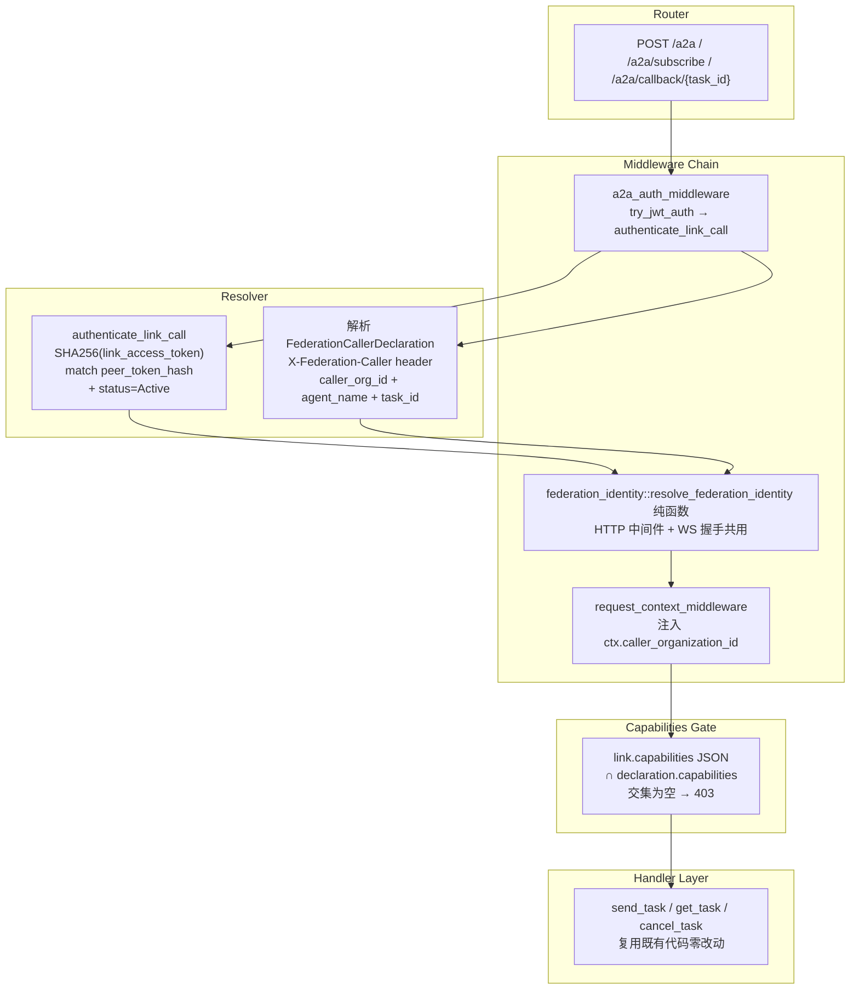

# 跨组织业务调用鉴权

<cite>
**本文引用的文件**
- [src/middleware/a2a_auth.rs](src/middleware/a2a_auth.rs)
- [src/middleware/federation_identity.rs](src/middleware/federation_identity.rs)
- [src/pkg/jwt.rs](src/pkg/jwt.rs)
- [src/pkg/request_context.rs](src/pkg/request_context.rs)
- [src/service/dao/agent_runtime/a2a.rs](src/service/dao/agent_runtime/a2a.rs)
- [src/service/dal/organization.rs](src/service/dal/organization.rs)
- [common/src/api/organization_link.rs](common/src/api/organization_link.rs)
- [common/src/constants/http_header.rs](common/src/constants/http_header.rs)
- [src/router.rs](src/router.rs)
- [src/consumer/federation_inbound_task.rs](src/consumer/federation_inbound_task.rs)
- 【② Plan 落地】[docs/plan/跨组织业务调用方案.md](docs/plan/跨组织业务调用方案.md) — Phase 2 设计稿：P1+P2 双模鉴权 → P3 capabilities endpoint → P4 A2A delegation e2e → P5 federation_agents → P6 receptionist identity → 方案②凭证直传拍板
- 【② Plan 落地】[docs/plan/组织组网与去中心化联邦方案.md](docs/plan/组织组网与去中心化联邦方案.md) — Phase 1 组网地基（鉴权的前置依赖）
- 【④ RAG 知识卡】[跨组织业务调用鉴权模型](docs/wiki/knowledge/zh/跨组织业务调用鉴权模型：dual-mode%20auth%20+%20federation_identity%20+%20delegation%20+%20audit%20+%20capabilities/跨组织业务调用鉴权模型：dual-mode%20auth%20+%20federation_identity%20+%20delegation%20+%20audit%20+%20capabilities.md) — 双模鉴权时序 + federation_identity 纯函数 + receptionist + capabilities 白名单 §4 硬约束 7 条
- 【④ RAG 知识卡】[联邦组网地基](docs/wiki/knowledge/zh/联邦组网地基：scope%20三态%20+%20organization_links%20+%20pairing_code%20+%20目录同步%20+%20WS%20长连接/联邦组网地基：scope%20三态%20+%20organization_links%20+%20pairing_code%20+%20目录同步%20+%20WS%20长连接.md) — 组网地基（兄弟卡：鉴权依赖连接）
- 【关联长文】[路由和中间件](docs/wiki/zh/content/核心模块/路由和中间件.md) — /a2a 路由组双模鉴权扩展
- 【关联长文】[A2A Server 模式](docs/wiki/zh/content/项目概述/核心功能特性/A2A%20协议支持/A2A%20Server%20模式.md) — /a2a handler 路由现在接受双模鉴权
- 【关联长文】[组织组网与联邦](docs/wiki/zh/content/功能模块/用户与组织管理/组织组网与联邦.md) — 组网地基独立长文（兄弟篇）
- **2026-09-05 更新摘要**：跨组织鉴权全量落地。/a2a 双模鉴权中间件（本地 JWT Cookie/Bearer + 对端 link access_token Bearer + X-Federation-Caller 声明头）。federation_identity 纯函数——HTTP 和 WS 握手共用同一份解析逻辑，不绑定传输层。receptionist 接待身份模型为每个建联对端分配内部用户，审计与权限体系与本地同构。capabilities 连接级白名单 fail-closed 默认 '[]'。caller_organization_id 计量管道 + JWT Claims iss/aud 扩展。
</cite>

## 目录
1. [简介](#简介)
2. [架构总览](#架构总览)
3. [双模鉴权详解](#双模鉴权详解)
4. [联邦身份解析纯函数](#联邦身份解析纯函数)
5. [Receptionist 接待模型](#receptionist-接待模型)
6. [Capabilities 白名单](#capabilities-白名单)
7. [审计与计量全链路](#审计与计量全链路)
8. [故障排查指南](#故障排查指南)
9. [总结](#总结)
10. [附录：错误码速查](#附录错误码速查)

## 简介
本章节面向跨组织业务调用的鉴权模型，系统性说明 AI Orz 在联邦组网之后如何安全地支持跨组织 Agent 委派。核心挑战：/a2a 是公开 A2A Server 接口，需要同时接受两类合法调用方——本地用户（既有 JWT）和建联对端节点（新的联邦凭证）。解决方案：双模鉴权中间件 + federation_identity 纯函数 + receptionist 接待身份模型 + 连接级 capabilities 白名单，确保跨组织调用在身份认证、权限控制、审计追踪三个维度都有保障。

## 架构总览

**图表来源**
- [a2a_auth.rs:L1-L108](src/middleware/a2a_auth.rs#L1-L108)
- [federation_identity.rs:L1-L117](src/middleware/federation_identity.rs#L1-L117)

章节来源
- [a2a_auth.rs:L1-L108](src/middleware/a2a_auth.rs#L1-L108)
- [router.rs](src/router.rs)

## 双模鉴权详解

`/a2a` JSON-RPC 入口现在接受两类合法调用方，鉴权中间件 `a2a_auth_middleware` 按优先级尝试：

1. **本地用户路径（try_jwt_auth）**：检查 Cookie `ai_orz_token` → 解析 JWT → 校验 exp + 签名 → 成功则继续。这是既有语义，完全原样保留。
2. **对端联邦路径（authenticate_link_call）**：try_jwt_auth 失败时进入。提取 `Authorization: Bearer <token>` → 遍历所有 Active organization_links → 对每个 link 计算 SHA256(token) 比对 peer_token_hash → 匹配则定位到 OrganizationLinkPo。同时解析可选的 `X-Federation-Caller: <FederationCallerDeclaration JSON>` 声明头。声明头合法 JSON 时 federation_identity 才会带 capabilities 字段参与白名单判定。

**fail-closed 设计**：
- 声明头存在但非法 JSON → 401（不是 400——暗示身份问题而非格式问题）
- link Bearer 存在但没有 X-Federation-Caller 声明头 → 401（link Bearer 必须搭配声明头）
- 两条路径都失败 → 401 "未登录或会话过期"（统一错误消息，不泄露鉴权路径）

章节来源
- [a2a_auth.rs:L1-L108](src/middleware/a2a_auth.rs#L1-L108)
- [http_header.rs](common/src/constants/http_header.rs)

## 联邦身份解析纯函数

`middleware/federation_identity.rs` 是整个跨组织鉴权的核心——**不绑定任何传输层**：

- **输入**：凭证字符串（access_token 或 user_jwt）+ 已反序列化的 FederationCallerDeclaration（纯 JSON）
- **输出**：FederationIdentity{local_org_id, peer_org_id, receptionist_user_id, capabilities}
- **不依赖**：axum::Request / HeadersMap / WsFrame — 任何传输层类型都不出现

HTTP 中间件（a2a_auth.rs）和 WS 长连接握手阶段（pkg::ws 升级前）都调用这同一个 `resolve_federation_identity` 函数，彻底避免两条链路鉴权逻辑漂移。

解析步骤：
1. 验证 organization_links 匹配 + status=Active
2. 反序列化 link.capabilities JSON → declaration.capabilities → 计算交集
3. 查本端为该 link 分配的 receptionist_user_id
4. 构建 FederationIdentity（纯数据，由调用方决定如何注入）

章节来源
- [federation_identity.rs:L1-L117](src/middleware/federation_identity.rs#L1-L117)

## Receptionist 接待模型

联邦访客（A 组织的 Agent/用户调 B 组织的 Agent）在 B 组织没有 JWT 或密码。本端为每个建联对端分配一个**接待用户**（receptionist_user_id），所有跨组织调用被视为"receptionist 在调用本端资源"。

好处：
- 权限系统不需要为联邦调用写特殊分支——receptionist 的 UserRole 决定它能调什么
- 审计日志天然有 user_id 维度，和本地用户调用格式一致
- 无 Agent 误触风险——receptionist 是自动创建的系统用户

章节来源
- [federation_identity.rs:L1-L117](src/middleware/federation_identity.rs#L1-L117)
- [org.rs:L1-L1294](src/service/domain/organization/org.rs#L1-L1294)

## Capabilities 白名单

每条 organization_links 记录有 `capabilities` JSON 数组（migration 20260904000004），默认值 `'[]'`。跨组织调用时 federation_identity 把 link.capabilities 与声明头的 capabilities 做**交集判定**：

- 交集为空 → 403 "capability not allowed"
- 请求的能力不在交集内 → 403

Fail-closed 设计：新建联默认 '[]'（空数组字符串），需显式追加如 `["a2a_task"]` 后才放行跨组织 Agent 委派。

章节来源
- [20260904000004 migration](migrations/20260904000004_add_capabilities_to_organization_links.sql)
- [organization_link.rs:L1-L89](src/models/organization_link.rs#L1-L89)

## 审计与计量全链路

审计贯穿整个跨组织调用周期：
1. **出站侧**：call_peer facade 在 publish FederationOutboundEvent 时携带 `CALLER_AUDIT_KEY{peer_org_id, event_id, caller_agent_id}`
2. **入站侧**：FederationInboundTaskConsumer 执行完 publish FederationOutboundEvent（response 帧）时同样携带审计字段
3. **WS consumer**：FederationWsOutboundConsumer 无活连接丢弃时 WARN 日志打印 peer_org_id，供运维排障
4. **caller_organization_id 计量管道**：RequestContext.caller_organization_id 由 request_context_middleware 注入 → Stats collector 自动按 caller_org_id + local_org_id 聚合 "A 组织调 B 组织 N 次" → 为后续计费结算留口子

章节来源
- [federation_inbound_task.rs:L1-L132](src/consumer/federation_inbound_task.rs#L1-L132)
- [request_context.rs:L1-L855](src/pkg/request_context.rs#L1-L855)
- [organization.rs(DAL):L1-L515](src/service/dal/organization.rs#L1-L515)

## 故障排查指南

1. **跨组织调用 401** → 检查 Authorization header 是否为合法 Bearer token；如果是 link Bearer，检查 organization_links 表是否存在匹配的 peer_token_hash 且 status=Active；如果是 user JWT，检查 Claims 里的 organization_id 是否在本端存在
2. **跨组织调用 403 "capability not allowed"** → 查 organization_links.capabilities JSON 数组，是否包含请求的能力（如 "a2a_task"）；建联后默认 '[]'，必须显式追加
3. **跨组织调用 401 "invalid federation caller declaration"** → X-Federation-Caller header 存在但 JSON 解析失败；确认是合法 JSON 字符串，字段完整；如果不需要声明头，移除 header 让中间件只走 link token 匹配路径
4. **跨组织调用 500 "receptionist user not found"** → create_link 时 shadow upsert + receptionist 创建是否在同一个事务；检查 receptionist UserPo 是否正确写入 users 表；receptionist 缺失时需要手动重建或重新建联
5. **审计日志缺 CALLER_AUDIT_KEY 字段** → 检查 FederationOutboundEvent / FederationInboundEvent payload 构建处是否包含 peer_org_id + event_id + receptionist_user_id；静态 grep 确认 consumer 代码里有这些字段

## 总结

跨组织鉴权模型通过双模鉴权中间件解决了 /a2a 同时服务本地用户和建联对端的认证问题；federation_identity 纯函数保证 HTTP 和 WS 两条链路鉴权逻辑不漂移；receptionist 接待模型让跨组织调用在权限体系和审计体系上与本地同构；capabilities 连接级白名单实现了细粒度门禁。caller_organization_id 计量管道为后续计费结算留口子。

## 附录：错误码速查

| HTTP 状态码 | ApiResponse message | 可能原因 | 排查方向 |
|-------------|---------------------|---------|----------|
| 401 | 未登录或会话过期 | JWT 过期 / 伪造 JWT / link Bearer 无效 / 两条鉴权路径都失败 | 检查 Cookie / Authorization header / organization_links 表 |
| 401 | invalid federation caller declaration | X-Federation-Caller 声明头存在但 JSON 非法 | 确认 header 是合法 JSON；移除 header 让中间件只走 link token |
| 403 | capability not allowed | 请求的能力不在 link.capabilities 白名单交集内 | 查 organization_links.capabilities JSON；追加需要的能力 |
| 403 | 未授权 | 本地 JWT 解析成功但 role 不足 | 检查 ctx.role().has_permission() |
