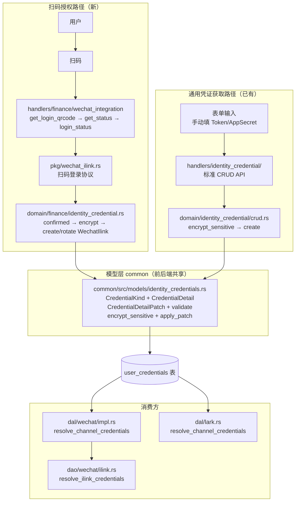
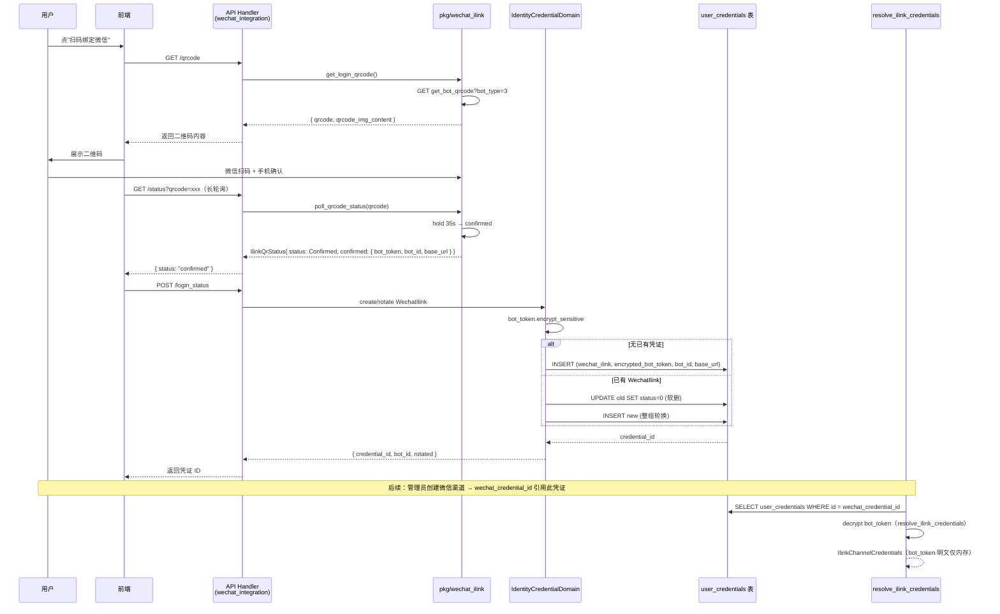

# 身份凭证与授权流程

<cite>
**本文引用的文件**
- [common/src/models/identity_credentials.rs](common/src/models/identity_credentials.rs) — CredentialKind 枚举（含 WechatIlink 新增变体）+ CredentialDetail 类型契约 + CredentialDetailPatch 补丁语义 + WechatIlink validate 校验
- [common/src/api/wechat_integration.rs](common/src/api/wechat_integration.rs) — 微信集成 DTO：WechatLoginQrcodeRequest + WechatLoginStatusResponse + WechatCredentialSnapshot
- [src/pkg/wechat_ilink.rs](src/pkg/wechat_ilink.rs) — 扫码登录协议客户端：get_login_qrcode + poll_qrcode_status 长轮询
- [src/handlers/finance/wechat_integration/](src/handlers/finance/wechat_integration/) — REST API 三端点：get_login_qrcode + get_status + login_status
- [src/service/domain/finance/identity_credential.rs](src/service/domain/finance/identity_credential.rs) — Domain 层：confirmed 时 encrypt bot_token → create WechatIlink 凭证 → 已存在同类型 → 整组轮换
- [src/service/dao/wechat/ilink.rs](src/service/dao/wechat/ilink.rs#L74-L128) — resolve_ilink_credentials：WechatIlink 凭证类型的唯一解析入口（kind 校验 + decrypt + base_url 空值回落）
- [src/service/domain/finance/mod.rs](src/service/domain/finance/mod.rs) — CreateCredentialCmd 构造器 + platform 参数处理
- [src/models/message_channel.rs](src/models/message_channel.rs) — ChannelConfig.wechat_credential_id 引用字段
- [src/service/dal/wechat/impl.rs](src/service/dal/wechat/impl.rs#L257-L295) — WechatCredentialDal：resolve_channel_credentials + find_channels_by_credential_id

**本文关联三类文档**
- 【① Design 决策快照】（如有）
  - [wechat_channel_integration_design.md](docs/design/wechat_channel_integration_design.md) — iLink 扫码授权协议设计
- 【② Plan 落地快照】（如有）
  - [微信 iLink 专属渠道闭环.md](docs/plan/微信%20iLink%20专属渠道闭环.md) — 阶段一扫码授权落地快照
  - [身份凭证Domain统一CRUD重构.md](docs/archive/plan-archive/身份凭证Domain统一CRUD重构.md) — 通用 CRUD 框架落地（扫码授权消费此框架）
- 【④ RAG 原子知识卡】
  - [IdentityCredentials 身份凭证扩展：授权流程 + QR登录 + 多渠道凭证管理](docs/wiki/knowledge/zh/IdentityCredentials%20身份凭证扩展：授权流程%20+%20QR登录%20+%20多渠道凭证管理/IdentityCredentials%20身份凭证扩展：授权流程%20+%20QR登录%20+%20多渠道凭证管理.md) — 本长文对应的 RAG 摘要卡
  - [身份凭证统一链路（总卡：模型层 + Domain 层 CRUD + Handler 层 API + 外部集成联动 + CredentialDetail 类型无关下沉）](docs/wiki/knowledge/zh/身份凭证统一链路（总卡：模型层%20+%20Domain%20层%20CRUD%20+%20Handler%20层%20API%20+%20外部集成联动%20+%20CredentialDetail%20类型无关下沉）/身份凭证统一链路（总卡：模型层%20+%20Domain%20层%20CRUD%20+%20Handler%20层%20API%20+%20外部集成联动%20+%20CredentialDetail%20类型无关下沉）.md) — 通用 CRUD 框架总卡，本长文描述 WechatIlink 新类型如何接入
  - [微信 iLink 专属渠道闭环：wechat_dal + ilink_dao + inbound_state + 授权流程](docs/wiki/knowledge/zh/微信%20iLink%20专属渠道闭环：wechat_dal%20+%20ilink_dao%20+%20inbound_state%20+%20授权流程/微信%20iLink%20专属渠道闭环：wechat_dal%20+%20ilink_dao%20+%20inbound_state%20+%20授权流程.md) — 凭证的消费方
  - [消息渠道入站适配中台：MessageInboundAdapter trait + MessageAdapterRegistry 全局注册 + start_all stop_all 生命周期](docs/wiki/knowledge/zh/消息渠道入站适配中台：MessageInboundAdapter%20trait%20+%20MessageAdapterRegistry%20全局注册%20+%20start_all%20stop_all%20生命周期/消息渠道入站适配中台：MessageInboundAdapter%20trait%20+%20MessageAdapterRegistry%20全局注册%20+%20start_all%20stop_all%20生命周期.md) — 消费链路的基础设施层
  - [InboundState 入站运行状态：动态游标 + 会话滚动刷新](docs/wiki/knowledge/zh/InboundState%20入站运行状态：动态游标%20+%20会话滚动刷新/InboundState%20入站运行状态：动态游标%20+%20会话滚动刷新.md) — 凭证轮换后 inbound_state 的处理参考
- 【③ Wiki 关联长文】
  - [身份凭证管理（统一 Domain CRUD 加密存储与生命周期联动）.md](docs/wiki/zh/content/核心模块/服务层/领域层/财务领域/身份凭证管理（统一%20Domain%20CRUD%20加密存储与生命周期联动）.md) — 通用 CRUD 框架长文，本长文的上游依赖
  - [微信 iLink 专属渠道.md](docs/wiki/zh/content/功能模块/消息系统/微信%20iLink%20专属渠道.md) — 扫码授权 → 创建渠道 → 入站收帧的端到端闭环长文
  - [消息渠道管理.md](docs/wiki/zh/content/功能模块/消息系统/消息渠道管理.md) — 管理员如何用 wechat_credential_id 引用凭证创建渠道
  - [飞书集成系统.md](docs/wiki/zh/content/核心模块/服务层/领域层/财务领域/飞书集成系统.md) — Lark 凭证获取路径（手动表单输入 AppID/AppSecret），与扫码授权的对比参考
</cite>

## 更新摘要
**2026-09-07 新建长文**：描述 AI Orz 身份凭证系统中「**扫码授权获取凭证**」这一全新路径如何与已有的「身份凭证统一 CRUD 框架」集成。WechatIlink 是凭证类型扩展 + 扫码授权获取路径的双重增量：CredentialKind/CredentialDetail 枚举新增 WechatIlink 变体（bot_token/bot_id/user_id/base_url）+ Domain 层 confirmed 分支自动 encrypt_sensitive 加密 bot_token 落库 + 已存在同类型凭证时整组轮换（旧软删 + 新创建，rotated 标志）+ 渠道通过 wechat_credential_id 引用后由 WechatDalImpl.start 调用 resolve_channel_credentials → resolve_ilink_credentials 解密消费。

## 目录
1. [简介](#简介)
2. [项目结构](#项目结构)
3. [核心组件](#核心组件)
4. [架构总览](#架构总览)
5. [详细组件分析](#详细组件分析)
6. [依赖关系分析](#依赖关系分析)
7. [性能与并发](#性能与并发)
8. [故障排查指南](#故障排查指南)
9. [结论](#结论)
10. [附录：凭证类型扩展矩阵](#附录凭证类型扩展矩阵)

## 简介

本长文描述 AI Orz 的「**身份凭证统一系统**」如何同时支持两种凭证获取路径：

| 路径 | 获取方式 | 凭证类型示例 | 落库方式 |
|------|----------|-------------|---------|
| **手动表单输入** | 用户在前端表单填 Token/AppSecret | LarkApp / GithubToken / GenericToken / OAuth / UserPassword | Domain CRUD API 明文传入 → encrypt_sensitive 加密落库 |
| **扫码授权** | 用户扫微信 ClawBot 二维码 → 手机确认 → Domain 自动落库 | WechatIlink（新增） | pkg/wechat_ilink confirmed 分支 → encrypt_sensitive 加密落库 |

扫码授权的核心增量：
- **WechatIlink 是专用 kind，不需要 platform**：`CredentialKind::WechatIlink.requires_platform() == false`，与 LarkApp 同属「专用 kind」范畴（不是 GenericToken/OAuth/UserPassword 那种 generic 类 kind）
- **整组轮换而非原地 patch**：重新扫码 confirmed 时，旧 WechatIlink 凭证软删 + 新凭证创建（`rotated: true` 标志）。bot_token 与 iLink 会话绑定，旧 token 失效后无法原地 update_detail
- **DAO 层唯一解析入口**：`resolve_ilink_credentials`（dao/wechat/ilink.rs#L74-L128）校验 kind + decrypt bot_token + validate base_url → 返回 IlinkChannelCredentials。出站 push 和轮询启动都调它

**凭证引用路径统一（与 Lark 对齐）**：
```
MessageChannel.wechat_credential_id → user_credentials.find_by_id → resolve_ilink_credentials 解密 → IlinkChannelCredentials(bot_token, bot_id, base_url)
```

## 项目结构



**图表来源**
- [identity_credentials.rs#L23-L58](common/src/models/identity_credentials.rs#L23-L58) — CredentialKind 枚举
- [identity_credentials.rs#L145-L154](common/src/models/identity_credentials.rs#L145-L154) — CredentialDetail::WechatIlink 字段
- [identity_credentials.rs#L359-L374](common/src/models/identity_credentials.rs#L359-L374) — WechatIlink validate 校验
- [wechat_ilink.rs#L88-L209](src/pkg/wechat_ilink.rs#L88-L209) — 扫码登录完整流程
- [dao/wechat/ilink.rs#L74-L128](src/service/dao/wechat/ilink.rs#L74-L128) — resolve_ilink_credentials

**章节来源**
- [IdentityCredentials 扩展 RAG 卡 §1](docs/wiki/knowledge/zh/IdentityCredentials%20身份凭证扩展：授权流程%20+%20QR登录%20+%20多渠道凭证管理/IdentityCredentials%20身份凭证扩展：授权流程%20+%20QR登录%20+%20多渠道凭证管理.md)
- [身份凭证统一链路 RAG 卡 §1](docs/wiki/knowledge/zh/身份凭证统一链路（总卡：模型层%20+%20Domain%20层%20CRUD%20+%20Handler%20层%20API%20+%20外部集成联动%20+%20CredentialDetail%20类型无关下沉）/身份凭证统一链路（总卡：模型层%20+%20Domain%20层%20CRUD%20+%20Handler%20层%20API%20+%20外部集成联动%20+%20CredentialDetail%20类型无关下沉）.md)

## 核心组件

**模型层（common::models::identity_credentials.rs）**
- `CredentialKind::WechatIlink` — 专用 kind，requires_platform() 返回 false（generic 类 kind 才需要 platform）
- `CredentialDetail::WechatIlink` — bot_token（加密落库）+ bot_id + user_id（可选）+ base_url（https 必填）
- `CredentialDetailPatch::WechatIlink` — 重新扫码整组覆盖语义（提供即覆盖，None/空白保持）
- `WechatIlink.validate` — 三要素必填 + base_url https 校验
- `WechatIlink.encrypt_sensitive` — 只加密 bot_token（其他字段非敏感）
- `WechatIlink.normalized` — trim + bot_token/bot_id 空白处理 + base_url 去尾斜杠

**pkg 层（pkg/wechat_ilink.rs）**
- `get_login_qrcode()` — `GET {base}/ilink/bot/get_bot_qrcode?bot_type=3` → 返回 qrcode（轮询标识）+ qrcode_img_content
- `poll_qrcode_status(qrcode)` — `GET {base}/ilink/bot/get_qrcode_status?qrcode=xxx` + header `iLink-App-ClientVersion: 1` → 45s 长轮询（服务端 hold 35s）
- `IlinkQrStatusKind` 四态：Wait → Scaned → Expired / Confirmed
- confirmed 时返回 bot_token（敏感）/ bot_id / user_id（可选）/ base_url（缺省回落 ILINK_DEFAULT_BASE_URL）

**Handler 层（handlers/finance/wechat_integration/）**
- `/api/v1/finance/identity/wechat/qrcode` — get_login_qrcode
- `/api/v1/finance/identity/wechat/status?qrcode=xxx` — get_status（长轮询）
- `/api/v1/finance/identity/wechat/login_status` — confirmed 时调 Domain 落库

**Domain 层（domain/finance/identity_credential.rs confirmed 分支）**
- 检测同用户是否已有 WechatIlink 凭证
- 无 → `create_credential`（encrypt bot_token → 落库）
- 有 → 整组轮换（软删旧凭证 + 创建新凭证，返回 `rotated: true`）

**DAO 层消费（dao/wechat/ilink.rs）**
- `resolve_ilink_credentials(credential_row, channel)` — 唯一解析入口
  - 校验 `credential.kind == WechatIlink`（双重保险）
  - decrypt bot_token（`pkg::crypto::decrypt_channel_secret`）
  - base_url 空值回落 ILINK_DEFAULT_BASE_URL
  - 返回 `IlinkChannelCredentials { bot_token, bot_id, base_url }`

## 架构总览

**扫码授权完整时序**：



**加密边界**：bot_token 在 Domain 层 `encrypt_sensitive` 闭包内加密 → `enc:v1:bot_xxx` 密文落库；DAO 层 `resolve_ilink_credentials` 内调 `decrypt_channel_secret` 解密 → 明文仅在 DAO 方法返回值 `IlinkChannelCredentials` 内存中，用完即丢弃。

**图表来源**
- [pkg/wechat_ilink.rs#L88-L209](src/pkg/wechat_ilink.rs#L88-L209)
- [common/src/models/identity_credentials.rs#L145-L154](common/src/models/identity_credentials.rs#L145-L154)
- [domain/finance/identity_credential.rs](src/service/domain/finance/identity_credential.rs)（confirmed 分支）
- [dao/wechat/ilink.rs#L74-L128](src/service/dao/wechat/ilink.rs#L74-L128)

## 详细组件分析

### 1. CredentialDetail::WechatIlink（common/src/models/identity_credentials.rs#L145-L154）

```rust
WechatIlink {
    bot_token: String,   // 敏感字段 → encrypt_sensitive 加密 → 密文落库
    bot_id: String,      // 非敏感，原样存
    user_id: Option<String>, // 部分登录响应未返回
    base_url: String,     // 登录响应带回，空值回落默认域
}
```

加密策略：`encrypt_sensitive` 只对 bot_token 调加密闭包，bot_id/base_url/user_id 原样保留。验证矩阵：bot_token/bot_id/base_url 三要素必填 + base_url 必须 `https://`。

整组轮换 patch 语义：`CredentialDetailPatch::WechatIlink` 提供即覆盖（重新扫码整组轮换语义），None/空白保持原值。与 LarkApp patch 不同——LarkApp 可以部分更新（只换 app_secret），WechatIlink 必须整组换（bot_token/bot_id/base_url 三者由 confirmed 一次性产出）。

### 2. pkg/wechat_ilink.rs 扫码登录协议

两接口均 GET、无需 bot_token（配置面操作）：

- `GET {base}/ilink/bot/get_bot_qrcode?bot_type=3` → 返回 `qrcode`（轮询标识）+ `qrcode_img_content`（二维码渲染内容，用户可在浏览器直接打开）
- `GET {base}/ilink/bot/get_qrcode_status?qrcode=<urlencoded>` + header `iLink-App-ClientVersion: 1` → 45s 长轮询

**超时宽容**：客户端 45s > 服务端 hold 35s → 客户端先到超时被视为本轮无事件（返回 Wait），不是网络错误。调用方把超时视为正常状态。

**confirmed 凭据获取**：bot_token / ilink_bot_id 必填（confirmed 响应缺这两个字段 → 校验报错）；ilink_user_id 可选；baseurl 缺省时回落 `ILINK_DEFAULT_BASE_URL`。

### 3. Domain 层 confirmed 分支（domain/finance/identity_credential.rs）

```rust
// 伪代码
let confirmed = pkg::wechat_ilink::poll_qrcode_status(qrcode)?
    .confirmed.expect("只有 Confirmed 才调 login_status");

// 检测同用户是否已有 WechatIlink 凭证
let existing = credential_dao.query({ user_id, credential_type: WechatIlink })?;
if existing.is_empty() {
    // 新建：encrypt bot_token → 落库
    let detail = CredentialDetail::WechatIlink {
        bot_token: confirmed.bot_token,
        bot_id: confirmed.bot_id,
        user_id: confirmed.user_id,
        base_url: confirmed.base_url,
    }.validate()?
     .encrypt_sensitive(|s| crypto::encrypt_channel_secret(s))?;
    let id = credential_dao.create(user_id, WechatIlink, detail)?;
    return { credential_id: id, rotated: false };
} else {
    // 整组轮换：软删旧 + 创建新
    let old_id = existing[0].id.clone();
    credential_dao.soft_delete(&old_id)?; // status=0
    let id = credential_dao.create(...)?;  // encrypt_sensitive 同上
    return { credential_id: id, rotated: true };
}
```

为什么整组轮换而不是原地 patch？bot_token 与 iLink 会话绑定。旧 token 失效后，即使 app 还在跑 poll_loop，收到的 getupdates 会鉴权失败。原地 update_detail 语义上不是"轮换"，"轮换"表示旧凭证彻底失效、新凭证接管。

### 4. resolve_ilink_credentials 双重校验（dao/wechat/ilink.rs#L74-L128）

这是 WechatIlink 凭证消费的**唯一入口**（出站 push 和轮询启动都调它），两层校验：

1. **kind 校验**：`credential.kind != WechatIlink` → 报错"渠道引用的凭证类型不匹配"（防御跨类型误用，比如误把 LarkApp 凭证配置到 Wechat 渠道）
2. **解密 + base_url fallback**：`pkg::crypto::decrypt_channel_secret(bot_token)` → 成功 → 空值回落 ILINK_DEFAULT_BASE_URL

两个调用方：
- 出站 push：`WechatDao.push` 接收预解析的 IlinkChannelCredentials（DAL 层传入）
- 轮询启动：`WechatDao.start_polling` 接收预解析的 IlinkChannelCredentials（PollLoopRegistry.ensure 内传入）

### 5. Dao 层禁止凭证解析（架构红线）

DAO 层**不做凭证解析**——出站 push 和 start_polling 的 IlinkChannelCredentials 参数都由 DAL 层 `resolve_channel_credentials` 预解析后传入。DAO 不依赖 UserCredentialDao（DAO 禁止跨 DAO 依赖）。

```rust
// WechatDao trait 签名（示例）
async fn push(&self, ctx, message, channel, credentials: &IlinkChannelCredentials) -> Result<()>
async fn start_polling(&self, channel, credentials: &IlinkChannelCredentials) -> Result<()>
```

DAL 层调 DAO 方法前：`resolve_channel_credentials(channel)` → `resolve_ilink_credentials(credential_row, channel)` → IlinkChannelCredentials。

## 依赖关系分析

**分层依赖（严格单向）**：
```
pkg/wechat_ilink.rs（扫码登录协议，纯 HTTP 客户端）
  ↓
handlers/finance/wechat_integration（REST API 适配层）
  ↓
domain/finance/identity_credential.rs（confirmed 业务编排：encrypt → create/rotate）
  ↓
DAO（credential/sqlite + wechat/ilink）—— 两个独立 DAO，互不依赖

消费侧：
dal/wechat/impl.rs → resolve_channel_credentials（DAL 层）
  ↓
dao/wechat/ilink.rs → resolve_ilink_credentials（DAO 层）
```

**关键依赖约束**：
- DAO 层禁止依赖 UserCredentialDao 完整类型 → resolve_ilink_credentials 接收已查出的 UserCredentialPo（函数参数），不自己查库
- Domain 层禁止直接调 pkg/wechat_ilink（协议客户端）→ Handler 层先调 pkg 拿 confirmed 凭据 → 调 Domain
- common::models 禁止依赖后端 crypto → encrypt_sensitive 参数是闭包 `F: Fn(&str) -> Result<String>`

**与通用 CRUD 框架的关系**：扫码授权的凭证落库走的是**同一个** `IdentityCredentialDomain.create_credential`（Domain 层 CRUD 框架）。新增的 WechatIlink 类型对 Domain CRUD 代码零改动——Domain 层把 `CredentialDetail` 当 opaque Value 透传给 DAL，只有消费方（Wechat DAO）自己 into() 成 WechatIlinkDetail。

## 性能与并发

**扫码登录**：
- 低频配置面操作，用户平均每天不扫超过 3 次
- poll_qrcode_status 长轮询 45s 超时：一次请求 = 45s 连接（hold 35s 是常态，超时 10s 缓冲）
- confirmed 分支：一次 soft_delete + 一次 create（rotated=true 时），两次 INSERT/UPDATE，SQLite 单表 < 5ms

**凭证解析（消费侧）**：
- resolve_ilink_credentials 是纯函数（不查库，输入 UserCredentialPo 已查出），性能 < 1ms
- 解密开销：decrypt_channel_secret AES-256-GCM，bot_token 短（< 512 bytes），< 0.5ms
- WechatDalImpl.start 时逐渠道并行解析（渠道数通常 < 10），总耗时 < 10ms

**凭证轮换后联动**：
- 整组轮换 → WechatListenerDal.rebuild_listeners_for_credential(credential_id)
- stop 旧 bot_id 轮询 + start 新 bot_id 轮询
- PollLoopRegistry.ensure 内部 stop 旧 → start 新，无重叠运行

## 故障排查指南

### 故障 1：resolve_ilink_credentials 报"凭证类型不匹配"
**现象**：渠道轮询未启动，日志 "wechat channel XXX 凭证引用解析失败：类型不匹配"。
**排查**：
1. `wechat_credential_id` 引用的凭证 kind 是否 `wechat_ilink`（不是 lark_app / generic_token 等）
2. 是否配置错误——把 Lark 凭证填给 Wechat 渠道了
3. resolve_ilink_credentials 内部 match arm 未覆盖新 kind？——检查 CredentialKind::WechatIlink 是否已注册

### 故障 2：confirmed 后落库失败（bot_token 加密报错）
**现象**：扫码后 login_status 接口报错"bot_token 解密失败"或类似加密异常。
**排查**：
1. encrypt_channel_secret 的 master_key 是否已配置（IDENTITY_KEK 环境变量）
2. confirmed 的 bot_token 是否为空——iLink 协议 confirmed 必须返回 bot_token，缺失时校验会拦截
3. Domain 层 encrypt_sensitive 闭包是否正确传入——闭包应调 pkg::crypto::encrypt_channel_secret

### 故障 3：整组轮换后旧轮询未停
**现象**：同一 bot_id 出现两条 poll_loop（旧 token + 新 token），出站消息鉴权失败。
**排查**：
1. soft_delete 是否生效——`user_credentials` 表旧行 status 是否已设为 0
2. rebuild_listeners_for_credential 是否被触发——credential_changed 事件是否订阅
3. PollLoopRegistry.stop 是否调了——stop_all 兜底可以强制停全部轮询再重建

### 故障 4：轮询启动跳过渠道但不报错
**现象**：`WechatDalImpl.start` 日志 "skipped channel XXX: credential reference unresolved" 出现。
**排查**：
1. wechat_credential_id 是否为空——渠道 config_json 里 wechat_credential_id 字段是否填了
2. 引用的凭证行是否存在且未软删——`status != 0`
3. resolve_ilink_credentials 是否解密成功——解密失败会返回 None（被调方跳过）

### 故障 5：扫码后 get_status 一直 Wait（不触发 Scaned/Confirmed）
**现象**：用户手机扫了码但前端长轮询一直返回 wait。
**排查**：
1. 45s 超时被当作 Wait——正常现象，继续轮询
2. base_url 是否正确——登录响应带回的 base_url 是否与 pkg 默认值一致（ILINK_DEFAULT_BASE_URL = https://ilinkai.weixin.qq.com）
3. iLink 服务端 hold 超时后返回 Wait——正常，客户端应继续下一轮轮询

### 故障 6：WechatIlink validate 报 base_url 必须 https
**现象**：confirmed 后落库失败，提示"base_url 必须 https 地址"。
**排查**：
1. 登录响应的 baseurl 是否以 http:// 开头——iLink 协议要求 https，http 是非法配置
2. pkg/wechat_ilink.rs 的 ILINK_DEFAULT_BASE_URL 是否被修改为 http 前缀

## 结论

WechatIlink 扫码授权路径的关键设计增量：**新增一种凭证获取路径**（扫码而非手动表单）、**新增一种凭证类型**（WechatIlink）、**DAO 层新增唯一解析入口**（resolve_ilink_credentials 双重校验）、**整组轮换语义**（rotated 标志 + soft_delete 旧凭证）。

这套机制对通用 CRUD 框架代码零改动——CredentialDetail 被当作 opaque Value 透传，Domain 层不感知 WechatIlink 的字段结构，只有消费方（Wechat DAO）自己 `into()` 成强类型。这正是「CredentialDetail 类型无关下沉」设计的收益：新增凭证类型 = common 枚举加一变体 + pkg 加一个协议客户端 + DAO 加一个 `resolve_xxx_credentials` 函数，Domain CRUD 框架零行改动。

## 附录：凭证类型扩展矩阵

| 维度 | LarkApp（手动表单） | WechatIlink（扫码授权） | GenericToken（手动表单） |
|------|-------------------|----------------------|------------------------|
| CredentialKind | lark_app | wechat_ilink | generic_token |
| requires_platform | false | false | true |
| 获取方式 | 前端表单填 AppID/AppSecret | 扫码 confirmed 自动落库 | 前端表单填 Token + platform |
| 敏感字段 | app_secret + encrypt_key | bot_token | token |
| 整组轮换 | 否（原地 patch） | 是（rotated=true） | 否（原地 patch） |
| DAO 解析入口 | resolve_lark_credentials | resolve_ilink_credentials | 无直接 DAO 消费（增强器消费） |
| 渠道引用字段 | lark_credential_id | wechat_credential_id | 无（工具 CredentialRequirement 消费） |

---

**章节来源**
- [common/src/models/identity_credentials.rs](common/src/models/identity_credentials.rs)
- [src/pkg/wechat_ilink.rs](src/pkg/wechat_ilink.rs)
- [src/service/domain/finance/identity_credential.rs](src/service/domain/finance/identity_credential.rs)
- [src/service/dao/wechat/ilink.rs#L74-L128](src/service/dao/wechat/ilink.rs#L74-L128)
- [IdentityCredentials 扩展 RAG 卡](docs/wiki/knowledge/zh/IdentityCredentials%20身份凭证扩展：授权流程%20+%20QR登录%20+%20多渠道凭证管理/IdentityCredentials%20身份凭证扩展：授权流程%20+%20QR登录%20+%20多渠道凭证管理.md)
- [身份凭证统一链路 RAG 卡](docs/wiki/knowledge/zh/身份凭证统一链路（总卡：模型层%20+%20Domain%20层%20CRUD%20+%20Handler%20层%20API%20+%20外部集成联动%20+%20CredentialDetail%20类型无关下沉）/身份凭证统一链路（总卡：模型层%20+%20Domain%20层%20CRUD%20+%20Handler%20层%20API%20+%20外部集成联动%20+%20CredentialDetail%20类型无关下沉）.md)
