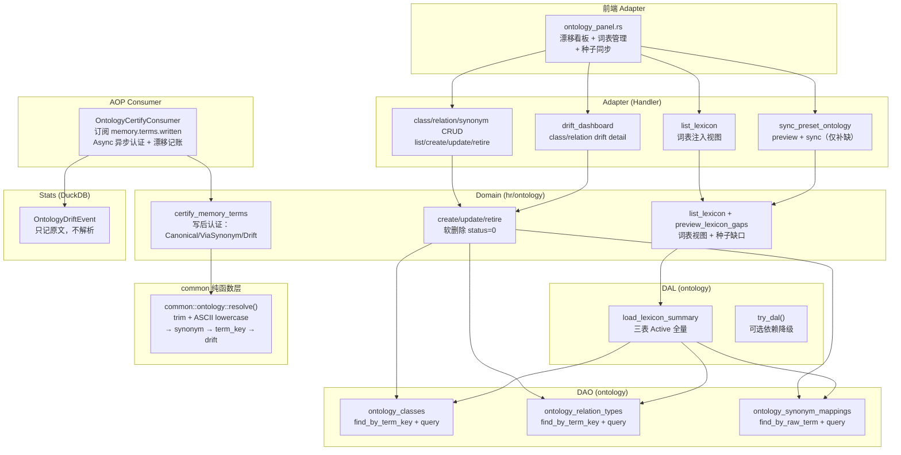
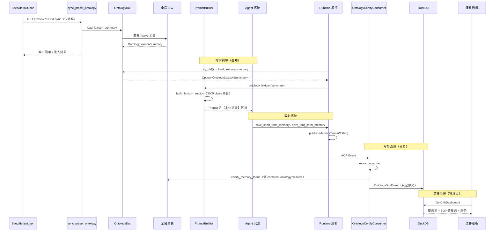
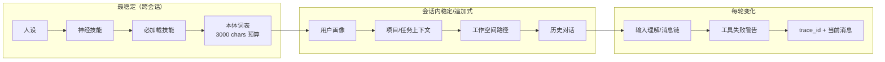

# 本体词表与漂移治理

<cite>
**本文引用的文件**
- [src/service/dao/ontology/mod.rs](src/service/dao/ontology/mod.rs)
- [src/service/dao/ontology/sqlite.rs](src/service/dao/ontology/sqlite.rs)
- [src/models/ontology.rs](src/models/ontology.rs)
- [src/service/dal/ontology.rs](src/service/dal/ontology.rs)
- [src/service/domain/hr/ontology.rs](src/service/domain/hr/ontology.rs)
- [common/src/ontology.rs](common/src/ontology.rs)
- [common/src/enums/ontology.rs](common/src/enums/ontology.rs)
- [common/src/api/ontology.rs](common/src/api/ontology.rs)
- [src/consumer/ontology_certify_consumer.rs](src/consumer/ontology_certify_consumer.rs)
- [src/pkg/stats/ontology_drift.rs](src/pkg/stats/ontology_drift.rs)
- [src/handlers/system/seed/sync_preset_ontology.rs](src/handlers/system/seed/sync_preset_ontology.rs)
- [frontend/src/pages/hr/ontology_panel.rs](frontend/src/pages/hr/ontology_panel.rs)
- [src/service/dal/agent/builder/default.rs](src/service/dal/agent/builder/default.rs)
- [src/models/prompt_builder.rs](src/models/prompt_builder.rs)

### 本文关联的三类文档

#### ① Design 决策快照
- [ontology_knowledge_sedimentation_design.md](docs/design/ontology_knowledge_sedimentation_design.md) — 本体与知识图谱合一（TBox/ABox 分层）、三段沉淀闭环、漂移不物化、惰性解析纯函数、16 条关键决策（DB 即 SSOT / hr 域归属 / 写后认证 AOP Async 管道 / PromptBuilder 词表注入）
- [memory_design.md](docs/design/memory_design.md) — 四层记忆系统设计（本体域的上游）

#### ② Plan 落地快照
- （暂未创建，实施启动时补写 docs/plan/ 本体论知识沉淀落地篇）

#### ④ RAG 原子知识卡
- [本体词表漂移治理与 Prompt 注入](docs/wiki/knowledge/zh/本体词表漂移治理与%20Prompt%20注入：OntologyDal%20load_lexicon_summary%20+%20common%20纯函数解析%20+%20写后认证%20+%20DuckDB%20漂移记账/本体词表漂移治理与%20Prompt%20注入：OntologyDal%20load_lexicon_summary%20+%20common%20纯函数解析%20+%20写后认证%20+%20DuckDB%20漂移记账.md) — 本长文对应的 RAG 原子卡（三表/DAL/common 纯函数/写后认证/DuckDB/Prompt 注入全链路）
- [PromptBuilder 工作空间与本体词表注入 + 前缀缓存优化](docs/wiki/knowledge/zh/PromptBuilder%20工作空间与本体词表注入%20+%20前缀缓存优化：workspace_context,%20ontology_lexicon,%20稳定性递减排序/PromptBuilder%20工作空间与本体词表注入%20+%20前缀缓存优化：workspace_context,%20ontology_lexicon,%20稳定性递减排序.md) — Prompt 注入消费侧（build_lexicon_section + 区块重排 + 前缀缓存优化）
- [知识图谱 traverse](docs/wiki/knowledge/zh/知识图谱%20traverse：BFS%20levels%20深度返回%20+%20DFS%20栈批量预取%20edge_cache%20+%20IN%20列表%20400%20分块防%20999%20溢出/知识图谱%20traverse：BFS%20levels%20深度返回%20+%20DFS%20栈批量预取%20edge_cache%20+%20IN%20列表%20400%20分块防%20999%20溢出.md) — 平行卡：ABox 图谱遍历视角（与本卡 TBox 词表治理视角互补）
- [记忆搜索增强三合一](docs/wiki/knowledge/zh/记忆搜索增强三合一：FTS5%20tags%20语义过滤%20+%20图谱%20traverse%20BFS%EF%BC%8FDFS%20遍历%20+%20recommend_seed_nodes%20三因子推荐/记忆搜索增强三合一：FTS5%20tags%20语义过滤%20+%20图谱%20traverse%20BFS%EF%BC%8FDFS%20遍历%20+%20recommend_seed_nodes%20三因子推荐.md) — 平行卡：FTS5 + 向量 + 图谱 搜索三合一
</cite>

## 目录
1. [简介](#简介)
2. [项目结构](#项目结构)
3. [核心组件](#核心组件)
4. [架构总览](#架构总览)
5. [详细组件分析](#详细组件分析)
6. [依赖关系分析](#依赖关系分析)
7. [性能与优化](#性能与优化)
8. [故障排查指南](#故障排查指南)
9. [结论](#结论)
10. [附录：API 接口](#附录api-接口)

## 简介

AI Orz 的**本体域（Ontology）**解决知识沉淀的"漂移"病根——Agent 沉淀知识图谱时，节点类型和关系词缺少稳定约定，词表以"枚举 + 散文"形态散落，Agent 临场猜测导致同一概念用不同词表达，图谱逐渐失去一致性。本体域把**受控词表（TBox）**和**知识图谱（ABox）**合一，提供三段沉淀闭环（感知→引导→治理），并通过 Prompt 注入让 Agent 在沉淀前就"看得见"词表。

**核心设计**（16 条决策见 design doc）：
- 全局三表（不带 organization_id）：`ontology_classes`（实体类）、`ontology_relation_types`（关系类型）、`ontology_synonym_mappings`（同义映射）
- 漂移**不物化**（惰性解析纯函数）：common::ontology::resolve() 纯函数算漂移结论，历史漂移随本体进化自动愈合
- 写后认证走 AOP Async 管道：runtime 只 publish(MemoryTermsWritten)，OntologyCertifyConsumer 异步完成 certify + DuckDB 漂移记账
- Prompt 词表注入预算 3000 chars，位置固定为第 4 块（稳定性递减排序，前缀缓存友好）
- 种子词表注入走 seed 走初始化 + 管理员手动同步（不做启动自动注入）

## 项目结构



**图表来源**
- [src/service/dao/ontology/mod.rs](src/service/dao/ontology/mod.rs)
- [src/service/dal/ontology.rs#L62-L124](src/service/dal/ontology.rs#L62-L124)
- [src/service/domain/hr/ontology.rs#L545-L573](src/service/domain/hr/ontology.rs#L545-L573)
- [src/consumer/ontology_certify_consumer.rs](src/consumer/ontology_certify_consumer.rs)
- [common/src/ontology.rs](common/src/ontology.rs)
- [frontend/src/pages/hr/ontology_panel.rs#L114-L438](frontend/src/pages/hr/ontology_panel.rs#L114-L438)

**章节来源**
- [docs/design/ontology_knowledge_sedimentation_design.md](docs/design/ontology_knowledge_sedimentation_design.md)
- [src/service/domain/hr/ontology.rs](src/service/domain/hr/ontology.rs)
- [src/service/dal/ontology.rs](src/service/dal/ontology.rs)

## 核心组件

- **三表模型层**：`OntologyClassPo`（实体类）/ `OntologyRelationTypePo`（关系类型）/ `OntologySynonymMappingPo`（同义映射）；三表全局不带 organization_id，`term_key` 语义锚点唯一约束
- **纯函数解析层**（common crate）：`common::ontology::resolve(TermKind, raw_term, classes_map, relations_map, synonyms_map)` 漂移判定——先查 synonyms→Canonical/ViaSynonym，再查 term_key→Canonical，都无→Drift；无 IO、无时钟、无副作用
- **OntologyDal**：`try_dal()` 可选依赖降级；`load_lexicon_summary()` 三表 Active 全量 → OntologyLexiconSummary（classes + relation_types + synonyms）；`active_all_pagination()` 大 limit 模拟全量
- **OntologyDomain**：`certify_memory_terms()` 运行时写后认证；词表 CRUD（软删除 status=0）；`preview_lexicon_gaps()` 种子词表缺口对比
- **OntologyCertifyConsumer**：订阅 `memory.terms.written`，Async 异步模式；调 OntologyDomain.certify_memory_terms + 写 OntologyDriftEvent 到 DuckDB
- **OntologyDriftEvent StatsEvent**：只记 raw_term 原文（不解析结论——解析随本体进化过期，原文不可变）

## 架构总览

### 三段沉淀闭环



**图表来源**
- [docs/design/ontology_knowledge_sedimentation_design.md §2.1](docs/design/ontology_knowledge_sedimentation_design.md)
- [src/consumer/ontology_certify_consumer.rs#L1-L80](src/consumer/ontology_certify_consumer.rs#L1-L80)
- [frontend/src/pages/hr/ontology_panel.rs#L334-L383](frontend/src/pages/hr/ontology_panel.rs#L334-L383)

**章节来源**
- [src/service/domain/runtime/awakening.rs#L343-L393](src/service/domain/runtime/awakening.rs#L343-L393)
- [common/src/ontology.rs](common/src/ontology.rs)

### Prompt 词表注入位置（稳定性递减 11 块）



**图表来源**
- [src/service/dal/agent/builder/default.rs#L1-L60](src/service/dal/agent/builder/default.rs#L1-L60)
- [src/service/dal/agent/builder/default.rs#L145-L230](src/service/dal/agent/builder/default.rs#L145-L230)

**章节来源**
- [src/models/prompt_builder.rs#L135-L146](src/models/prompt_builder.rs#L135-L146)
- [src/service/dal/agent/builder/default.rs#L1055-L1234](src/service/dal/agent/builder/default.rs#L1055-L1234)

## 详细组件分析

### §5.1 三表模型与 DAO

三张全局词表设计（`term_key` 语义锚点，全局不带 organization_id）：

| 表 | 核心字段 | 关键约束 | DAO 入口 |
|---|---|---|---|
| `ontology_classes` | term_key, display_name, description, required_fields, status | term_key UNIQUE；软删除 status=0 | OntologyClassQuery / query_classes / find_class_by_term_key |
| `ontology_relation_types` | term_key, display_name, description, target_classes[], range_classes[], status | target_classes + range_classes JSON 数组；同上 | OntologyRelationTypeQuery / query_relation_types |
| `ontology_synonym_mappings` | raw_term, target_key, target_kind(TermKind) | raw_term + target_key 组合唯一；物理删除无退役语义 | OntologySynonymQuery / query_synonyms |

**设计边界**（design §2.2）：term_key 是跨表/跨环境引用的唯一锚点；词表量级为个位数十词（正常 < 100），全量载入成本可忽略。

**章节来源**
- [src/service/dao/ontology/mod.rs#L1-L70](src/service/dao/ontology/mod.rs#L1-L70)
- [src/models/ontology.rs#L19-L240](src/models/ontology.rs#L19-L240)

### §5.2 纯函数解析层（common::ontology）

`common::ontology` 是跨 crate 共享的**纯计算层**——无 IO、无时钟、无副作用。关键 API：

- `normalize(raw_term: &str) -> String`：trim + ASCII 小写（不去下划线）
- `resolve(raw_term, TermKind, classes_map, relations_map, synonyms_map) -> ResolvedTerm`：漂移判定核心
  - 先查 synonyms_map → `ViaSynonym { canonical_term_key }`（找到同义映射）
  - 再查 classes_map / relations_map → `Canonical`（词表命中）
  - 都无 → `Drift { raw_term }`（漂移入口保留）
- `OntologyLexiconSummary` / `LexiconTermSummary` / `LexiconSynonymSummary`：展示视图

**为什么漂移不物化**：漂移 = "以当前本体词表为参数的计算结论"。今天漂移的词，管理员明天加同义映射或收编为新词，下一次解析自动愈合——历史漂移数据只在 DuckDB 保留原文审计（OntologyDriftEvent 只记 raw_term），不入图谱不入 SQLite。

**章节来源**
- [common/src/ontology.rs](common/src/ontology.rs)

### §5.3 OntologyDal 与 Domain 层

OntologyDal 提供两个核心能力：

1. **load_lexicon_summary**：三表 Active 全量加载 → OntologyLexiconSummary（供 Prompt 注入 + Domain 词表视图）
2. **try_dal() → Option**：可选依赖降级——本体子系统未初始化时返回 None，PromptBuilder 直接跳过词表注入

OntologyDomain（hr 域）：
- `certify_memory_terms()`：运行时写后认证，对每对 (kind, raw_term) 调 common::ontology::resolve()，Canonical/ViaSynonym → is_published 置位；Drift → needs_review（软门禁，不拦截不撤回）
- `list_lexicon()`：词表注入视图（list_lexicon 路由暴露）
- CRUD + 软退役（status=0 退役、synonyms 物理删除）

**章节来源**
- [src/service/dal/ontology.rs#L62-L124](src/service/dal/ontology.rs#L62-L124)
- [src/service/domain/hr/ontology.rs#L545-L573](src/service/domain/hr/ontology.rs#L545-L573)

### §5.4 写后认证 Async 管道

三段闭环的治理段：运行时尾部 publish → OntologyCertifyConsumer Async 异步消费 → certify + DuckDB 漂移记账。

```
Runtime 尾部（agent 沉淀完成）
  └─ publish(MemoryTermsWritten)         ← 写路径零耦合零阻塞
OntologyCertifyConsumer
  ├─ ConsumeMode::Async                  ← 异步不阻塞写路径
  ├─ subscribe(EventTopic::MemoryTermsWritten)
  ├─ OntologyDomain.certify_memory_terms ← 认证：Canonical/ViaSynonym/Drift
  └─ record(OntologyDriftEvent)          ← DuckDB：只记 raw_term
```

**设计理由**（design 决策 #16）：写路径只 publish 一个 AOP 事件，不调 Domain/DAL/Stats——业务与统计彻底解耦；消费者内完成认证与打点，不影响主流程性能与错误传播。

**章节来源**
- [src/consumer/ontology_certify_consumer.rs#L1-L80](src/consumer/ontology_certify_consumer.rs#L1-L80)
- [src/pkg/stats/ontology_drift.rs#L1-L40](src/pkg/stats/ontology_drift.rs#L1-L40)

### §5.5 PromptBuilder 词表注入

**OntologyDal::try_dal()** 在 Runtime 唤醒入口被调用（`Option<Arc<dyn OntologyDal>>`），取到后调 `load_lexicon_summary` 拿到 OntologyLexiconSummary，通过 `builder.ontology_lexicon(&summary)` 注入 DefaultPromptBuilder。

DefaultPromptBuilder 用 `build_lexicon_section` 渲染【本体词表】区块：
- 位置固定为第 4 块（稳定性递减排序）
- 预算 3000 chars；裁剪优先级：关系词 > 实体类 > 同义样例
- 空词表或未初始化 → 跳过注入（None filter）

**章节来源**
- [src/service/dal/agent/builder/default.rs#L145-L230](src/service/dal/agent/builder/default.rs#L145-L230)
- [src/models/prompt_builder.rs#L135-L146](src/models/prompt_builder.rs#L135-L146)
- [src/service/domain/runtime/awakening.rs#L343-L393](src/service/domain/runtime/awakening.rs#L343-L393)

### §5.6 前端漂移看板 + 词表管理

前端在 HR 管理页面下提供完整的本体治理界面（`ontology_panel.rs`）：
- **漂移看板**：DuckDB 聚合展示 relation/class 漂移覆盖率、TOP 漂移词列表、漂移趋势（按天）
- **实体类/关系类型/同义映射 三 tab 管理**：CRUD + 软退役（status=0）；同义映射物理删除
- **种子同步**：preview（只读缺口对比）+ sync（仅补缺注入）

**章节来源**
- [frontend/src/pages/hr/ontology_panel.rs#L114-L438](frontend/src/pages/hr/ontology_panel.rs#L114-L438)

### §5.7 种子词表注入

种子词表走 system/seed/default.json，跟组织初始化 seed 注入 + 管理员手动同步：
- 不走启动自动注入（启动链路只承担基础设施自检，设计决策 #15）
- 同步策略固定「仅补缺」（term_key 物理存在即跳过，不覆盖管理页本地修改）
- Handler 走同步返回（量级几十条毫秒级，不走后台任务——与预置技能同步有意差异）

**章节来源**
- [src/handlers/system/seed/sync_preset_ontology.rs](src/handlers/system/seed/sync_preset_ontology.rs)
- [src/service/domain/system/seed/default.json](src/service/domain/system/seed/default.json)

## 依赖关系分析

```mermaid
graph TD
    subgraph "上游（消费本体）"
        R["Runtime<br/>awakening / sleep_and_settle"]
        PB["PromptBuilder<br/>build_lexicon_section"]
        DAO_MEM["MemoryDao<br/>写后 publish"]
    end
    subgraph "本体域"
        DAL_O["OntologyDal<br/>load_lexicon_summary"]
        DOM_O["OntologyDomain<br/>certify + CRUD"]
        C_RESOLVE["common::ontology::resolve<br/>纯函数"]
        DAO_O["OntologyDao<br/>三表"]
    end
    subgraph "下游（被消费）"
        DB["SQLite 三表"]
        DUCKDB["DuckDB<br/>ontology_drift_events"]
        AOP["AOP Event<br/>memory.terms.written"]
    end
    R -->|try_dal → load_lexicon_summary| DAL_O
    DAL_O --> DAO_O
    PB -->|ontology_lexicon(summary)| PB
    DAO_MEM --> AOP
    AOP --> DOM_O
    DOM_O --> C_RESOLVE
    DOM_O --> DAO_O
    DOM_O --> DUCKDB
    DAO_O --> DB
    DAO_MEM --> DB
```

**章节来源**
- [docs/LAYERED_ARCHITECTURE_PRACTICE.md](docs/LAYERED_ARCHITECTURE_PRACTICE.md)
- [src/service/domain/hr/ontology.rs](src/service/domain/hr/ontology.rs)

## 性能与优化

1. **词表量级几十条**：OntologyDal.load_lexicon_summary 一次性拉取 Active 全量到内存，成本可忽略；三表都有 term_key UNIQUE 索引加速查找
2. **common::ontology::resolve() 哈希表查找**：词表加载后构建 HashMap，漂移判定 O(1) 查表；无 IO 无副作用
3. **Prompt 区块裁剪贪心**：build_lexicon_section 按预算 3000 chars 逐词条贪心装入，装不下即停；同义样例优先级最低整体让位
4. **漂移不物化 = 零额外存储**：只在 DuckDB 记录原文审计，不回写 SQLite 图谱表；本体进化后历史漂移自动愈合
5. **Async 消费模式**：OntologyCertifyConsumer 异步执行，runtime 写路径零阻塞
6. **漂移看板 DuckDB 聚合**：SQL GROUP BY + COUNT，原生列式引擎性能优异

**章节来源**
- [docs/design/ontology_knowledge_sedimentation_design.md §3.2](docs/design/ontology_knowledge_sedimentation_design.md)
- [common/src/ontology.rs](common/src/ontology.rs)

## 故障排查指南

### 常见问题与排查路径

| # | 症状 | 排查路径 |
|---|------|---------|
| 1 | Agent 沉淀漂移越来越多 | DuckDB 漂移看板查覆盖率 → 确认 seed 同步策略「仅补缺」是否漏同步 → 管理员手动 sync_preset_ontology → 加同义映射收编漂移词 |
| 2 | Prompt 没有【本体词表】区块 | 查 OntologyDal::try_dal() 是否返回 None（本体子系统未初始化）→ 查 OntologyDal.load_lexicon_summary 是否返回空 summary → 查 DefaultPromptBuilder.ontology_lexicon 是否被调用（awakening.rs 注入点） |
| 3 | 词表区块被截断（关系词完整但实体类只剩部分） | LEXICON_PROMPT_BUDGET_CHARS=3000 是硬预算 → 查是否管理员扩表超限 → 裁剪优先级固定关系词>实体类>同义样例 → 同义样例整体让位不装 |
| 4 | OntologyDriftEvent 没有落 DuckDB | 查 OntologyCertifyConsumer 是否在 startup 注册（AOP Registry）→ 查是否有 log_warn 「消费反序列化失败」→ 查 EventTopic::MemoryTermsWritten 是否正确 publish |
| 5 | certify_memory_terms 把正确的词误判为 Drift | 查 common::ontology::resolve 的 normalize 规则（trim + ASCII 小写、不去下划线）→ 确认 term_key 是否完全匹配 → 如果不是，考虑加同义映射而非改 normalize |
| 6 | warn_if_lexicon_truncated 被触发（不应该） | 词表量级正常 < 100，LEXICON_LOAD_LIMIT=1000 → 触发意味着词表量级异常大或 DAO 层查询漏加 status=Active 过滤 → grep 检查 DAO query_classes |

### 诊断命令（后端）
```bash
# 查 DuckDB 漂移事件最新记录
cargo test -p ai_orz -- drift -- --nocapture

# 查词表全量加载结果
# 在 OntologyDomain.list_lexicon 打断点，看 OntologyLexiconSummary 内容
```

**章节来源**
- [docs/design/ontology_knowledge_sedimentation_design.md §6](docs/design/ontology_knowledge_sedimentation_design.md)
- [src/pkg/stats/ontology_drift.rs](src/pkg/stats/ontology_drift.rs)

## 结论

本体域为知识沉淀提供了**受控词表治理框架**——全局三表（DB 即 SSOT）、惰性解析纯函数（common::ontology::resolve）、写后认证 Async 管道（OntologyCertifyConsumer）、Prompt 词表注入（3000 chars 预算 + 稳定性递减排序）、漂移不物化（历史自动愈合）、种子同步仅补缺。三段沉淀闭环（感知→引导→治理）让 Agent 在沉淀前就看得见词表，沉淀时被提示词引导，沉淀后被异步认证 + 漂移记账——漂移不是故障信号，而是本体需要进化的信号（DuckDB 漂移看板给出"新词漂移堆积 → 提示同步"的自然反馈路径）。

## 附录：API 接口

### Handler 层 REST API（全部挂在 Admin 鉴权路由下）

| 路由 | 方法 | 用途 | 文件 |
|------|------|------|------|
| `/api/v1/hr/ontology/classes` | GET | 列表（支持 keyword 搜索 + status 过滤）| list_classes.rs |
| `/api/v1/hr/ontology/classes` | POST | 创建实体类词条 | create_class.rs |
| `/api/v1/hr/ontology/classes/{id}` | PUT | 更新实体类词条 | update_class.rs |
| `/api/v1/hr/ontology/classes/{id}/retire` | POST | 软退役（status=0）| retire_class.rs |
| `/api/v1/hr/ontology/relation-types` | GET/POST | 关系类型列表/创建 | list_relation_types.rs / create_relation_type.rs |
| `/api/v1/hr/ontology/relation-types/{id}` | PUT/POST retire | 关系类型更新/退役 | update_relation_type.rs / retire_relation_type.rs |
| `/api/v1/hr/ontology/synonyms` | GET/POST | 同义映射列表/创建 | list_synonyms.rs / create_synonym.rs |
| `/api/v1/hr/ontology/synonyms/{id}` | DELETE | 删除同义映射（物理）| delete_synonym.rs |
| `/api/v1/hr/ontology/drift-dashboard` | GET | DuckDB 漂移看板聚合 | get_drift_dashboard.rs |
| `/api/v1/hr/ontology/drift/class-details` | GET | 某实体类的漂移详情 | list_drift_class_details.rs |
| `/api/v1/hr/ontology/drift/relation-details` | GET | 某关系类型的漂移详情 | list_drift_relation_details.rs |
| `/api/v1/hr/ontology/lexicon` | GET | 词表注入视图（三表 Active 全量）| list_lexicon.rs |
| `/api/v1/system/seed/preset-ontology/preview` | GET | 种子词表缺口对比 | sync_preset_ontology.rs |
| `/api/v1/system/seed/preset-ontology/sync` | POST | 种子词表同步（仅补缺）| sync_preset_ontology.rs |

**章节来源**
- [common/src/api/ontology.rs](common/src/api/ontology.rs)
- [src/handlers/hr/ontology/mod.rs](src/handlers/hr/ontology/mod.rs)
- [src/handlers/system/seed/sync_preset_ontology.rs](src/handlers/system/seed/sync_preset_ontology.rs)
