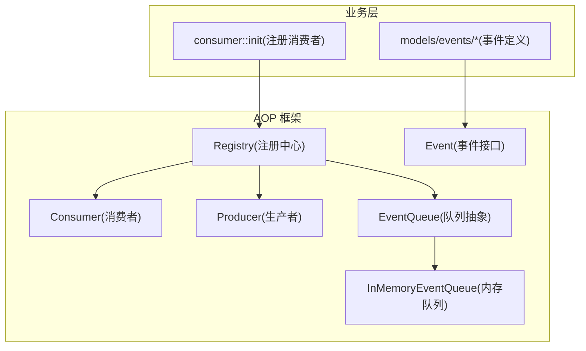
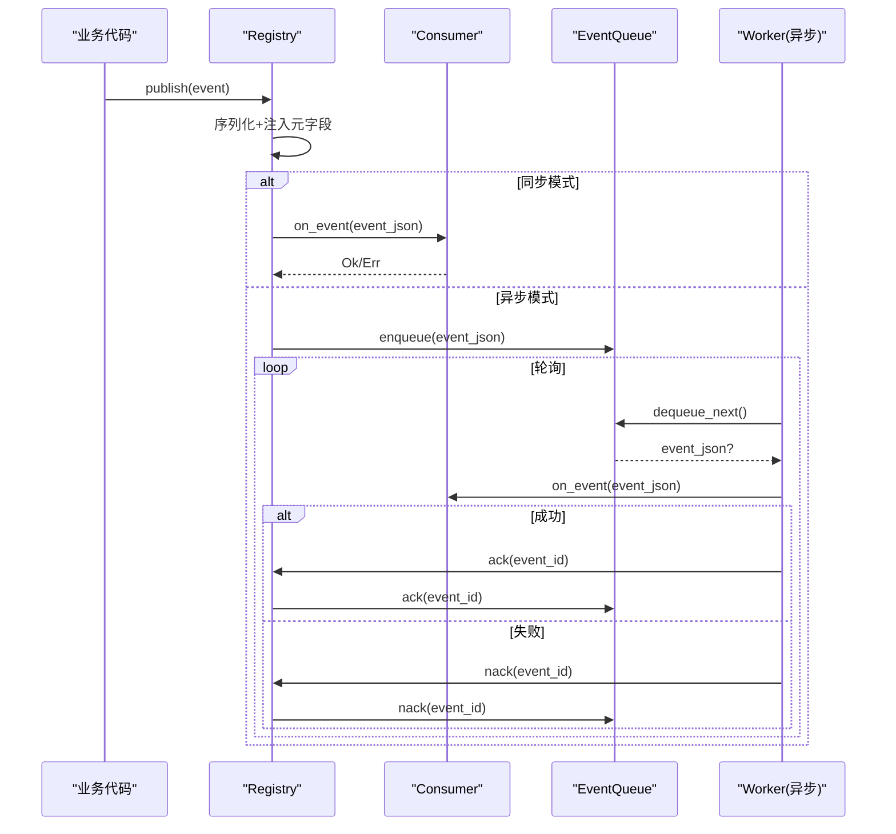
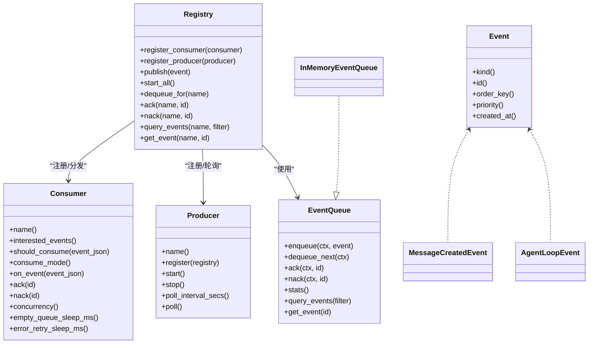

# AOP 事件系统（系统管理层）

<cite>
**本文引用的文件**
- [src/pkg/aop/mod.rs](src/pkg/aop/mod.rs)
- [src/pkg/aop/core/mod.rs](src/pkg/aop/core/mod.rs)
- [src/pkg/aop/core/event.rs](src/pkg/aop/core/event.rs)
- [src/pkg/aop/core/producer.rs](src/pkg/aop/core/producer.rs)
- [src/pkg/aop/core/consumer.rs](src/pkg/aop/core/consumer.rs)
- [src/pkg/aop/core/registry.rs](src/pkg/aop/core/registry.rs)
- [src/pkg/aop/core/scheduler.rs](src/pkg/aop/core/scheduler.rs)
- [src/pkg/aop/queue/mod.rs](src/pkg/aop/queue/mod.rs)
- [src/pkg/aop/queue/in_memory.rs](src/pkg/aop/queue/in_memory.rs)
- [src/models/events/mod.rs](src/models/events/mod.rs)
- [src/models/events/message.rs](src/models/events/message.rs)
- [src/models/events/agent_loop.rs](src/models/events/agent_loop.rs)
- [src/consumer/mod.rs](src/consumer/mod.rs)
- [docs/event_design.md](docs/event_design.md)
</cite>

### 本文关联的三类文档（四类互引闭环）

**① 设计文档（Design）**：
- [消费者与生产者架构设计](docs/design/consumer_architecture.md) — AOP 生产消费异步框架总设计 + 系统管理面板 AOP 监控接入点设计

**② 落地计划（Plan）**：
- [Agent 循环驱动引擎 Plan](docs/plan/agent_loop_engine_plan.md) — AOP 事件 → Consumer → Agent 唤醒 → 管理面板监控闭环

**④ RAG 原子知识卡**：
- [Domain 内部事件与消费者全链路：8 类 DomainEvent 枚举 + 8 类 Consumer 业务消费 + AOP Producer 投递入口 + Registry 订阅](docs/wiki/knowledge/zh/Domain%20%E5%86%85%E9%83%A8%E4%BA%8B%E4%BB%B6%E4%B8%8E%E6%B6%88%E8%B4%B9%E8%80%85%E5%85%A8%E9%93%BE%E8%B7%AF%EF%BC%9A8%20%E7%B1%BB%20DomainEvent%20%E6%9E%9A%E4%B8%BE%20+%208%20%E7%B1%BB%20Consumer%20%E4%B8%9A%E5%8A%A1%E6%B6%88%E8%B4%B9%20+%20AOP%20Producer%20%E6%8A%95%E9%80%92%E5%85%A5%E5%8F%A3%20+%20Registry%20%E8%AE%A2%E9%98%85/Domain%20%E5%86%85%E9%83%A8%E4%BA%8B%E4%BB%B6%E4%B8%8E%E6%B6%88%E8%B4%B9%E8%80%85%E5%85%A8%E9%93%BE%E8%B7%AF%EF%BC%9A8%20%E7%B1%BB%20DomainEvent%20%E6%9E%9A%E4%B8%BE%20+%208%20%E7%B1%BB%20Consumer%20%E4%B8%9A%E5%8A%A1%E6%B6%88%E8%B4%B9%20+%20AOP%20Producer%20%E6%8A%95%E9%80%92%E5%85%A5%E5%8F%A3%20+%20Registry%20%E8%AE%A2%E9%98%85.md) — 8 Consumer 全能力映射到 AOP 监控面板的 5 指标卡片 + 事件分布饼图 + 时序折线

## 目录
1. [简介](#简介)
2. [项目结构](#项目结构)
3. [核心组件](#核心组件)
4. [架构总览](#架构总览)
5. [详细组件分析](#详细组件分析)
6. [依赖关系分析](#依赖关系分析)
7. [性能与扩展性](#性能与扩展性)
8. [故障排查指南](#故障排查指南)
9. [结论](#结论)
10. [附录：最佳实践与扩展开发指南](#附录最佳实践与扩展开发指南)

## 简介
本文件面向 AOP（面向切面编程）事件系统，围绕事件驱动架构、事件总线模式与生产者-消费者模型，系统化说明事件定义、发布、订阅、处理机制；并覆盖事件类型分类、路由、过滤、转换、持久化、重放、补偿、监控指标、调试追踪与错误诊断。同时给出在业务解耦、异步处理、横切关注点中的应用场景，以及扩展开发与最佳实践建议。

> 📌 视角说明（AGENTS §2.1.3 Level 3 互补视角平行卡）：
> 本长文是「AOP 事件系统」主题的 **系统管理层** 视角。同主题还有以下平行视角卡，请按需交叉阅读：
> - [AOP 事件系统（框架层）](docs/wiki/zh/content/基础设施/AOP 事件系统/AOP 事件系统.md)
> - [AOP 事件系统（代码落地层）](docs/wiki/zh/content/核心模块/AOP 事件系统/AOP 事件系统.md)

## 项目结构
AOP 事件中心位于 src/pkg/aop，提供纯框架能力（无业务感知），业务消费者注册于 src/consumer，事件数据模型位于 src/models/events。队列实现为内存优先的 InMemoryEventQueue，支持按 order_key 顺序保证与优先级调度。

图表来源
- [src/pkg/aop/mod.rs:1-61](src/pkg/aop/mod.rs#L1-L61)
- [src/pkg/aop/core/mod.rs:1-14](src/pkg/aop/core/mod.rs#L1-L14)
- [src/pkg/aop/core/registry.rs:11-19](src/pkg/aop/core/registry.rs#L11-L19)
- [src/pkg/aop/queue/mod.rs:77-106](src/pkg/aop/queue/mod.rs#L77-L106)
- [src/pkg/aop/queue/in_memory.rs:41-49](src/pkg/aop/queue/in_memory.rs#L41-L49)
- [src/consumer/mod.rs:16-36](src/consumer/mod.rs#L16-L36)
- [src/models/events/mod.rs:1-21](src/models/events/mod.rs#L1-L21)

章节来源
- [src/pkg/aop/mod.rs:1-61](src/pkg/aop/mod.rs#L1-L61)
- [src/pkg/aop/core/mod.rs:1-14](src/pkg/aop/core/mod.rs#L1-L14)
- [src/consumer/mod.rs:16-36](src/consumer/mod.rs#L16-L36)
- [src/models/events/mod.rs:1-21](src/models/events/mod.rs#L1-L21)

## 核心组件
- 事件 Event：统一的事件数据结构与元信息（kind/id/order_key/priority/created_at）。
- 消费者 Consumer：支持同步/异步两种消费模式，具备过滤、确认/重试、并发控制等能力。
- 生产者 Producer：外部渠道或定时任务将事件注入到 Registry。
- 注册中心 Registry：负责消费者注册、事件分发、异步 worker 启动、指标 Hook 注入、队列管理。
- 队列 EventQueue：抽象出 enqueue/dequeue/ack/nack/stats/query 等能力，当前默认实现为内存队列。
- 指标 Hook AopMetricsHook：零侵入采集 publish/consume_start/success/failure 等生命周期指标。

章节来源
- [src/pkg/aop/core/event.rs:1-25](src/pkg/aop/core/event.rs#L1-L25)
- [src/pkg/aop/core/consumer.rs:1-72](src/pkg/aop/core/consumer.rs#L1-L72)
- [src/pkg/aop/core/producer.rs:1-36](src/pkg/aop/core/producer.rs#L1-L36)
- [src/pkg/aop/core/registry.rs:11-19](src/pkg/aop/core/registry.rs#L11-L19)
- [src/pkg/aop/queue/mod.rs:77-106](src/pkg/aop/queue/mod.rs#L77-L106)
- [src/pkg/aop/core/metrics_hook.rs:1-90](src/pkg/aop/core/metrics_hook.rs#L1-L90)

## 架构总览
AOP 事件中心采用“事件总线 + 生产者-消费者”模式：
- 发布侧：业务代码通过 aop::publish(event) 发布事件，Registry 序列化并注入统一元字段（event_id/kind/order_key/priority/created_at）。
- 路由与过滤：根据事件 kind 路由到对应消费者列表；每个消费者可自定义 should_consume 进行细粒度过滤。
- 消费模式：
  - 同步 Sync：直接在发布线程调用 on_event，适合轻量处理。
  - 异步 Async：入队后由独立 worker 拉取处理，支持 ack/nack 与重试退避。
- 顺序与优先级：order_key 相同的事件串行处理；全局按 priority 降序、创建时间升序调度。
- 指标与可观测性：通过 AopMetricsHook 采集关键节点耗时与失败原因。

图表来源
- [src/pkg/aop/core/registry.rs:97-206](src/pkg/aop/core/registry.rs#L97-L206)
- [src/pkg/aop/core/registry.rs:208-258](src/pkg/aop/core/registry.rs#L208-L258)
- [src/pkg/aop/core/registry.rs:260-487](src/pkg/aop/core/registry.rs#L260-L487)
- [src/pkg/aop/queue/in_memory.rs:104-177](src/pkg/aop/queue/in_memory.rs#L104-L177)
- [src/pkg/aop/queue/in_memory.rs:179-267](src/pkg/aop/queue/in_memory.rs#L179-L267)

## 详细组件分析

### 事件定义与类型分类
- 事件基类 Event：定义 kind/id/order_key/priority/created_at 等元信息，所有事件需实现该 trait。
- 内置事件示例：
  - message.created：消息创建事件，order_key 按接收者角色分层（Agent 用 agent_id，非 Agent 用 task/project 降级），确保同 Agent 串行与用户消息有序。
  - agent.loop：Agent 循环生命周期事件，order_key 为 agent_id，用于记录 awaken/settle 的耗时与状态。
- 事件模块组织：src/models/events 下按领域划分事件类型，统一导出。

章节来源
- [src/pkg/aop/core/event.rs:1-25](src/pkg/aop/core/event.rs#L1-L25)
- [src/models/events/message.rs:1-53](src/models/events/message.rs#L1-L53)
- [src/models/events/agent_loop.rs:1-79](src/models/events/agent_loop.rs#L1-L79)
- [src/models/events/mod.rs:1-21](src/models/events/mod.rs#L1-L21)

### 事件发布与路由
- 发布入口：aop::publish(event) 调用全局 Registry.publish。
- 路由逻辑：根据 event.kind 查找已注册的消费者集合；对每个消费者执行 should_consume 过滤。
- 元字段注入：在 JSON 顶层注入 event_id/kind/order_key/priority/created_at，便于队列与监控读取一致元数据。
- 指标埋点：on_publish 在每个消费者匹配时触发。

章节来源
- [src/pkg/aop/mod.rs:36-51](src/pkg/aop/mod.rs#L36-L51)
- [src/pkg/aop/core/registry.rs:97-206](src/pkg/aop/core/registry.rs#L97-L206)
- [src/pkg/aop/core/metrics_hook.rs:16-55](src/pkg/aop/core/metrics_hook.rs#L16-L55)

### 事件订阅与处理
- 消费者注册：consumer::init 中集中注册各业务消费者到 Registry。
- 消费模式：
  - 同步：直接 on_event，适合轻量操作。
  - 异步：入队后由 worker 拉取，支持 concurrency 并行度、empty_queue_sleep_ms/error_retry_sleep_ms 控制节奏。
- 确认与重试：成功 ack，失败 nack 并重试；失败路径包含退避 sleep，避免紧密自旋。

章节来源
- [src/consumer/mod.rs:16-36](src/consumer/mod.rs#L16-L36)
- [src/pkg/aop/core/consumer.rs:1-72](src/pkg/aop/core/consumer.rs#L1-L72)
- [src/pkg/aop/core/registry.rs:260-487](src/pkg/aop/core/registry.rs#L260-L487)

### 事件队列与顺序保证
- 队列抽象 EventQueue：提供 enqueue/dequeue/ack/nack/stats/query 等能力。
- 内存队列 InMemoryEventQueue：
  - 使用全局堆 + 按 order_key 分堆维护优先级与顺序。
  - 有 active_message 标记保证同一 order_key 仅一个事件在处理中。
  - 提供 stats/query/get_event 等监控与调试能力。
- 顺序策略：order_key 为空则全局堆竞争；否则按 order_key 串行。

章节来源
- [src/pkg/aop/queue/mod.rs:10-106](src/pkg/aop/queue/mod.rs#L10-L106)
- [src/pkg/aop/queue/in_memory.rs:11-49](src/pkg/aop/queue/in_memory.rs#L11-L49)
- [src/pkg/aop/queue/in_memory.rs:104-177](src/pkg/aop/queue/in_memory.rs#L104-L177)
- [src/pkg/aop/queue/in_memory.rs:179-267](src/pkg/aop/queue/in_memory.rs#L179-L267)
- [src/pkg/aop/queue/in_memory.rs:300-447](src/pkg/aop/queue/in_memory.rs#L300-L447)

### 事件过滤与转换
- 过滤：Consumer.should_consume 基于事件 JSON 做细粒度过滤（如按 org_id、task_id、message_type 等）。
- 转换：可在消费者内部将事件 JSON 转换为领域对象进行处理；也可在发布前预处理（例如在 Producer 中完成）。

章节来源
- [src/pkg/aop/core/consumer.rs:25-43](src/pkg/aop/core/consumer.rs#L25-L43)
- [src/pkg/aop/core/producer.rs:7-35](src/pkg/aop/core/producer.rs#L7-L35)

### 事件持久化、重放与补偿
- 当前默认队列是内存实现，重启不保留事件；如需持久化，可实现新的 EventQueue 后端（如 SQLite/DuckDB/文件日志）并在 Registry 中注册。
- 重放：可通过队列 query_events 获取待处理事件，结合 ack/nack 与自定义 re-enqueue 逻辑实现重放。
- 补偿：利用 nack 与 error_retry_sleep_ms 实现指数退避或固定间隔重试；对于幂等业务，重复处理不会破坏一致性。

章节来源
- [src/pkg/aop/queue/mod.rs:77-106](src/pkg/aop/queue/mod.rs#L77-L106)
- [src/pkg/aop/core/registry.rs:208-258](src/pkg/aop/core/registry.rs#L208-L258)
- [src/pkg/aop/core/registry.rs:333-445](src/pkg/aop/core/registry.rs#L333-L445)
- [docs/event_design.md:1-195](docs/event_design.md#L1-L195)

### 事件监控、指标与性能分析
- 指标 Hook：AopMetricsHook 提供 on_publish/on_consume_start/on_consume_success/on_consume_failure 四个回调，零开销默认实现。
- 队列统计：QueueStats 提供 pending_count/in_progress_count/order_keys/oldest_event_age_secs 等指标。
- 性能要点：
  - 同步模式适合轻量处理，避免额外队列开销。
  - 异步模式通过 concurrency 控制吞吐，配合 empty_queue_sleep_ms/error_retry_sleep_ms 平衡延迟与资源占用。
  - order_key 设计影响并行度与顺序保证，需谨慎选择。

章节来源
- [src/pkg/aop/core/metrics_hook.rs:1-90](src/pkg/aop/core/metrics_hook.rs#L1-L90)
- [src/pkg/aop/queue/mod.rs:10-28](src/pkg/aop/queue/mod.rs#L10-L28)
- [src/pkg/aop/core/registry.rs:260-487](src/pkg/aop/core/registry.rs#L260-L487)

### 事件调试工具、追踪链路、错误诊断
- 调试查询：通过 registry.query_events/get_event 查看队列中的事件摘要与详情（payload_preview 脱敏）。
- 追踪链路：事件 JSON 顶层包含 event_id/kind/order_key/priority/created_at，可作为跨组件追踪键。
- 错误诊断：
  - 关注 nack 路径与 error_retry_sleep_ms 配置，避免频繁重试导致 CPU 抖动。
  - 检查 order_key 是否过粗导致串行瓶颈，或过细导致锁竞争。
  - 使用 metrics hook 收集失败原因与耗时分布。

章节来源
- [src/pkg/aop/core/registry.rs:500-553](src/pkg/aop/core/registry.rs#L500-L553)
- [src/pkg/aop/queue/in_memory.rs:314-447](src/pkg/aop/queue/in_memory.rs#L314-L447)
- [src/pkg/aop/core/registry.rs:333-445](src/pkg/aop/core/registry.rs#L333-L445)

### AOP 在业务中的应用场景
- 业务解耦：消息创建、Agent 循环、工具调用等事件解耦上下游，降低耦合度。
- 异步处理：将耗时逻辑（如统计聚合、日志落盘、通知推送）放入异步消费者。
- 横切关注点：通过消费者统一实现审计、指标采集、告警、限流等横切逻辑。

章节来源
- [src/consumer/mod.rs:16-36](src/consumer/mod.rs#L16-L36)
- [src/models/events/message.rs:1-53](src/models/events/message.rs#L1-L53)
- [src/models/events/agent_loop.rs:1-79](src/models/events/agent_loop.rs#L1-L79)

## 依赖关系分析
- 单向依赖：AOP 框架不感知业务实体，业务消费者通过 consumer::init 注册；事件模型位于 models/events。
- 组件耦合：
  - Registry 依赖 Consumer/Producer/EventQueue/AopMetricsHook。
  - InMemoryEventQueue 依赖 RequestContext 与 serde_json。
  - 事件类型依赖 Event trait 与 EventKind。
- 潜在风险：
  - order_key 设计不当可能导致串行瓶颈。
  - 高并发 nack 路径需合理设置 error_retry_sleep_ms 避免自旋。
  - 同步消费者阻塞发布线程，应谨慎使用。

图表来源
- [src/pkg/aop/core/registry.rs:11-19](src/pkg/aop/core/registry.rs#L11-L19)
- [src/pkg/aop/core/consumer.rs:1-72](src/pkg/aop/core/consumer.rs#L1-L72)
- [src/pkg/aop/core/producer.rs:1-36](src/pkg/aop/core/producer.rs#L1-L36)
- [src/pkg/aop/queue/mod.rs:77-106](src/pkg/aop/queue/mod.rs#L77-L106)
- [src/pkg/aop/queue/in_memory.rs:41-49](src/pkg/aop/queue/in_memory.rs#L41-L49)
- [src/pkg/aop/core/event.rs:1-25](src/pkg/aop/core/event.rs#L1-L25)
- [src/models/events/message.rs:1-53](src/models/events/message.rs#L1-L53)
- [src/models/events/agent_loop.rs:1-79](src/models/events/agent_loop.rs#L1-L79)

章节来源
- [src/pkg/aop/core/registry.rs:11-19](src/pkg/aop/core/registry.rs#L11-L19)
- [src/pkg/aop/core/consumer.rs:1-72](src/pkg/aop/core/consumer.rs#L1-L72)
- [src/pkg/aop/core/producer.rs:1-36](src/pkg/aop/core/producer.rs#L1-L36)
- [src/pkg/aop/queue/mod.rs:77-106](src/pkg/aop/queue/mod.rs#L77-L106)
- [src/pkg/aop/queue/in_memory.rs:41-49](src/pkg/aop/queue/in_memory.rs#L41-L49)
- [src/pkg/aop/core/event.rs:1-25](src/pkg/aop/core/event.rs#L1-L25)

## 性能与扩展性
- 并发模型：
  - 同步模式：低延迟但可能阻塞发布线程，适用于轻量处理。
  - 异步模式：通过 concurrency 提升吞吐，注意队列长度与内存占用。
- 顺序与优先级：
  - order_key 越粗，串行程度越高；越细，并行度越高但需保证幂等。
  - priority 用于跨 order_key 的全局优先级调度。
- 可扩展性：
  - 新增事件类型：实现 Event trait 并在 models/events 中导出。
  - 新增消费者：实现 Consumer trait，在 consumer::init 中注册。
  - 新队列后端：实现 EventQueue trait，替换默认 InMemoryEventQueue。

章节来源
- [src/pkg/aop/core/consumer.rs:1-72](src/pkg/aop/core/consumer.rs#L1-L72)
- [src/pkg/aop/queue/in_memory.rs:104-177](src/pkg/aop/queue/in_memory.rs#L104-L177)
- [src/pkg/aop/queue/in_memory.rs:179-267](src/pkg/aop/queue/in_memory.rs#L179-L267)
- [src/models/events/mod.rs:1-21](src/models/events/mod.rs#L1-L21)

## 故障排查指南
- 常见问题定位：
  - 事件堆积：检查 queue_len 与 QueueStats.pending_count，调整 concurrency 或优化 on_event 耗时。
  - 顺序卡死：检查 order_key 是否正确，确认 ack/nack 是否成对调用。
  - 频繁重试：检查 error_retry_sleep_ms 与 nack 路径，避免紧密自旋。
- 诊断步骤：
  - 使用 registry.query_events/get_event 查看事件详情与状态。
  - 通过 metrics hook 收集失败原因与耗时分布。
  - 审查 order_key 设计，必要时拆分或合并。
- 恢复策略：
  - 对幂等业务可安全重放；对非幂等业务需引入去重或补偿事务。
  - 对异常队列状态，可使用 clear 清空测试环境队列（生产慎用）。

章节来源
- [src/pkg/aop/core/registry.rs:500-553](src/pkg/aop/core/registry.rs#L500-L553)
- [src/pkg/aop/queue/in_memory.rs:285-298](src/pkg/aop/queue/in_memory.rs#L285-L298)
- [src/pkg/aop/core/registry.rs:333-445](src/pkg/aop/core/registry.rs#L333-L445)

## 结论
AOP 事件系统在项目中提供了统一的事件分发与调度能力，支持同步/异步消费、顺序保证、优先级调度、指标采集与调试查询。通过合理的 order_key 设计与消费者实现，可有效实现业务解耦、异步处理与横切关注点的统一管理。未来可按需扩展持久化队列与重放能力，进一步提升系统的可靠性与可观测性。

## 附录：最佳实践与扩展开发指南
- 事件设计
  - 明确事件语义，保持事件不可变且可序列化。
  - 合理设计 order_key：Agent 维度串行、用户消息按 task/project 降级。
  - 为事件添加必要元字段（event_id/kind/order_key/priority/created_at）。
- 消费者实现
  - 轻量逻辑使用同步模式；耗时逻辑使用异步模式。
  - 实现 should_consume 进行细粒度过滤，减少无效处理。
  - 正确实现 ack/nack，确保事件状态一致。
- 队列与顺序
  - 避免过粗的 order_key 导致串行瓶颈。
  - 合理使用 priority 区分紧急与后台任务。
- 监控与调试
  - 注入 AopMetricsHook 采集关键指标。
  - 使用 query_events/get_event 进行问题定位。
  - 关注 nack 路径与重试退避，避免 CPU 抖动。
- 扩展开发
  - 新增事件：实现 Event trait，注册到 models/events。
  - 新增消费者：实现 Consumer trait，在 consumer::init 中注册。
  - 新队列后端：实现 EventQueue trait，替换默认实现。

章节来源
- [src/models/events/message.rs:1-53](src/models/events/message.rs#L1-L53)
- [src/models/events/agent_loop.rs:1-79](src/models/events/agent_loop.rs#L1-L79)
- [src/consumer/mod.rs:16-36](src/consumer/mod.rs#L16-L36)
- [src/pkg/aop/core/metrics_hook.rs:1-90](src/pkg/aop/core/metrics_hook.rs#L1-L90)
- [src/pkg/aop/queue/mod.rs:77-106](src/pkg/aop/queue/mod.rs#L77-L106)