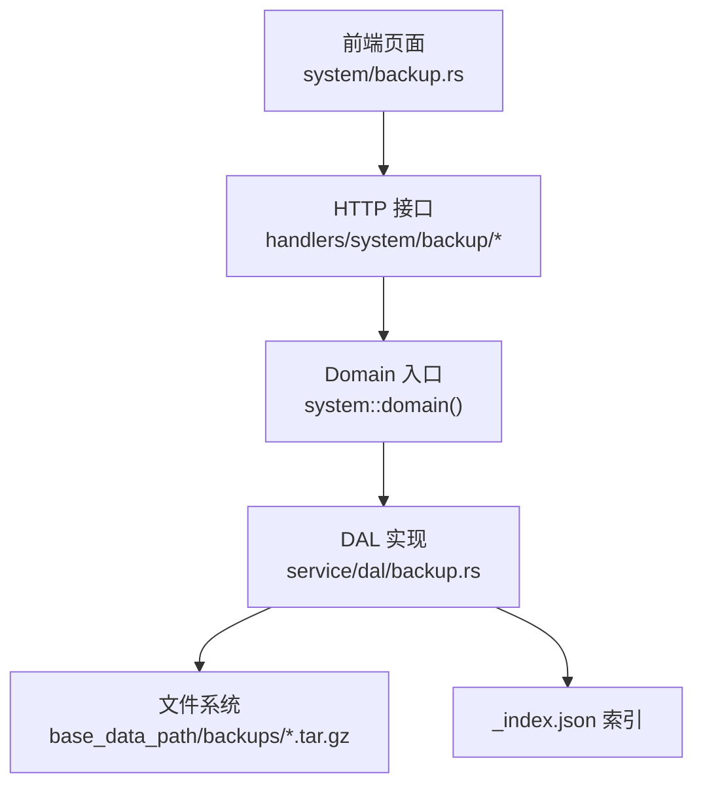
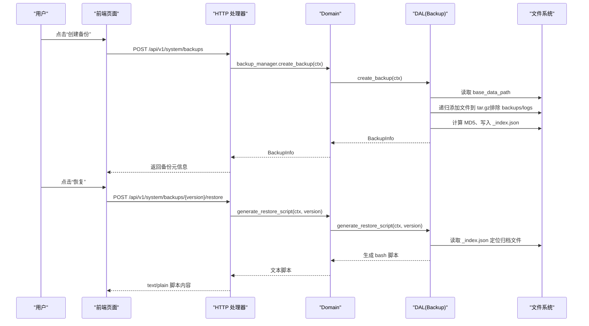
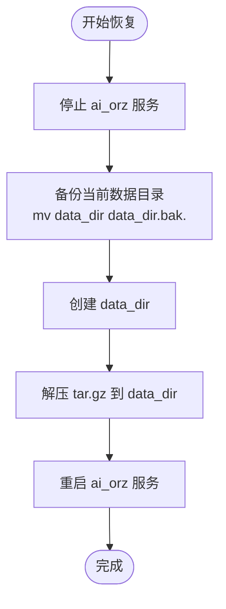
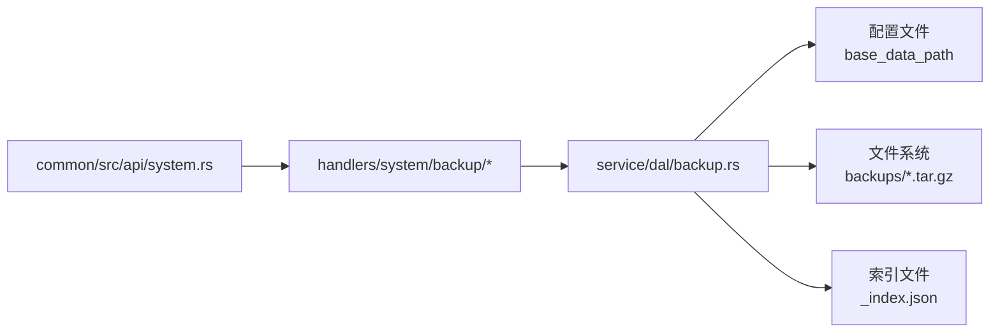

# 备份恢复管理（业务功能层）

<cite>
**本文引用的文件**
- [src/service/dal/backup.rs](src/service/dal/backup.rs)
- [src/handlers/system/backup/mod.rs](src/handlers/system/backup/mod.rs)
- [src/handlers/system/backup/create_backup.rs](src/handlers/system/backup/create_backup.rs)
- [src/handlers/system/backup/delete_backup.rs](src/handlers/system/backup/delete_backup.rs)
- [src/handlers/system/backup/list_backups.rs](src/handlers/system/backup/list_backups.rs)
- [src/handlers/system/backup/restore_backup.rs](src/handlers/system/backup/restore_backup.rs)
- [common/src/api/system.rs](common/src/api/system.rs)
- [frontend/src/pages/system/backup.rs](frontend/src/pages/system/backup.rs)
- [common/config/ai_orz.toml](common/config/ai_orz.toml)
</cite>

## 目录
1. [简介](#简介)
2. [项目结构](#项目结构)
3. [核心组件](#核心组件)
4. [架构总览](#架构总览)
5. [详细组件分析](#详细组件分析)
6. [依赖关系分析](#依赖关系分析)
7. [性能与容量规划](#性能与容量规划)
8. [故障排查指南](#故障排查指南)
9. [结论](#结论)
10. [附录：操作清单与最佳实践](#附录：操作清单与最佳实践)

## 简介
本章节面向系统管理员与运维人员，说明 ai_orz 的“数据备份与恢复”能力。当前实现为基于文件系统的全量归档备份：将 base_data_path 下的业务数据目录打包为 tar.gz 归档，排除 backups/ 与 logs/ 子目录；通过 _index.json 索引维护备份元信息（版本、时间戳、文件名、大小、MD5）。提供创建、列出、删除备份以及生成恢复脚本的能力，并通过前端页面进行可视化操作。

> 📌 视角说明（AGENTS §2.1.3 Level 3 互补视角平行卡）：
> 本长文是「备份恢复管理」主题的 **业务功能层** 视角。同主题还有以下平行视角卡，请按需交叉阅读：
> - [备份恢复管理（前端 UI 层）](docs/wiki/zh/content/前端应用/页面模块/系统管理页面/备份恢复管理.md)

## 项目结构
备份恢复功能遵循四层单向调用：Adapter（HTTP Handler）→ Domain → DAL → DAO（本模块未涉及 DAO），通用基础设施工具位于 pkg 层。备份相关代码主要分布在 handlers/system/backup、service/dal/backup、common/api/system、frontend/pages/system/backup 等位置。

图表来源
- [src/handlers/system/backup/mod.rs:1-32](src/handlers/system/backup/mod.rs#L1-L32)
- [src/handlers/system/backup/create_backup.rs:1-27](src/handlers/system/backup/create_backup.rs#L1-L27)
- [src/handlers/system/backup/list_backups.rs:1-22](src/handlers/system/backup/list_backups.rs#L1-L22)
- [src/handlers/system/backup/delete_backup.rs:1-25](src/handlers/system/backup/delete_backup.rs#L1-L25)
- [src/handlers/system/backup/restore_backup.rs:1-36](src/handlers/system/backup/restore_backup.rs#L1-L36)
- [src/service/dal/backup.rs:1-642](src/service/dal/backup.rs#L1-L642)
- [frontend/src/pages/system/backup.rs:1-322](frontend/src/pages/system/backup.rs#L1-L322)

章节来源
- [src/handlers/system/backup/mod.rs:1-32](src/handlers/system/backup/mod.rs#L1-L32)
- [src/service/dal/backup.rs:1-642](src/service/dal/backup.rs#L1-L642)
- [frontend/src/pages/system/backup.rs:1-322](frontend/src/pages/system/backup.rs#L1-L322)

## 核心组件
- HTTP 适配器层
  - 创建备份：POST /api/v1/system/backups
  - 列出备份：GET /api/v1/system/backups
  - 删除备份：DELETE /api/v1/system/backups/{version}
  - 获取恢复脚本：POST /api/v1/system/backups/{version}/restore
- 领域入口
  - 通过 system::domain().backup_manager() 暴露统一入口
- 数据访问层（DAL）
  - 负责归档创建、索引读写、恢复脚本生成、目录遍历与压缩
- 前端页面
  - 列表展示、创建、删除、恢复脚本预览与复制

章节来源
- [common/src/api/system.rs:35-49](common/src/api/system.rs#L35-L49)
- [src/handlers/system/backup/create_backup.rs:1-27](src/handlers/system/backup/create_backup.rs#L1-L27)
- [src/handlers/system/backup/list_backups.rs:1-22](src/handlers/system/backup/list_backups.rs#L1-L22)
- [src/handlers/system/backup/delete_backup.rs:1-25](src/handlers/system/backup/delete_backup.rs#L1-L25)
- [src/handlers/system/backup/restore_backup.rs:1-36](src/handlers/system/backup/restore_backup.rs#L1-L36)
- [src/service/dal/backup.rs:1-642](src/service/dal/backup.rs#L1-L642)
- [frontend/src/pages/system/backup.rs:1-322](frontend/src/pages/system/backup.rs#L1-L322)

## 架构总览
备份流程采用“请求驱动 + 文件归档 + 索引管理”的模式：
- 请求进入 Handler，校验权限后委托给 Domain 的 backup_manager
- Domain 调用 DAL 执行具体备份/恢复逻辑
- DAL 使用 tar+gzip 对 base_data_path 进行归档，排除 backups/ 与 logs/
- 每次备份写入 _index.json 索引，记录版本、时间戳、文件名、大小、MD5
- 恢复时不直接解压，而是生成可执行的 bash 脚本供管理员在停机状态下执行

图表来源
- [src/handlers/system/backup/create_backup.rs:1-27](src/handlers/system/backup/create_backup.rs#L1-L27)
- [src/handlers/system/backup/restore_backup.rs:1-36](src/handlers/system/backup/restore_backup.rs#L1-L36)
- [src/service/dal/backup.rs:100-243](src/service/dal/backup.rs#L100-L243)

## 详细组件分析

### 权限控制与安全
- 路由层要求 Admin/SuperAdmin 可访问备份相关接口
- Handler 内部二次校验 SuperAdmin 权限，仅放行高危操作（创建、删除、恢复脚本）
- 恢复脚本以纯文本返回，需由管理员在停机环境下手动执行，避免在服务运行时覆盖数据

章节来源
- [src/handlers/system/backup/mod.rs:19-32](src/handlers/system/backup/mod.rs#L19-L32)
- [src/handlers/system/backup/create_backup.rs:1-27](src/handlers/system/backup/create_backup.rs#L1-L27)
- [src/handlers/system/backup/delete_backup.rs:1-25](src/handlers/system/backup/delete_backup.rs#L1-L25)
- [src/handlers/system/backup/restore_backup.rs:1-36](src/handlers/system/backup/restore_backup.rs#L1-L36)

### 备份策略与类型
- 全量备份：每次备份均包含 base_data_path 下全部业务数据（排除 backups/ 与 logs/）
- 增量备份：当前实现未提供增量备份能力
- 定时任务：当前未内置定时备份触发器；可通过外部调度或 Cron Trigger 机制调用备份接口

章节来源
- [src/service/dal/backup.rs:100-152](src/service/dal/backup.rs#L100-L152)
- [src/handlers/system/backup/create_backup.rs:1-27](src/handlers/system/backup/create_backup.rs#L1-L27)

### 存储位置、命名规则与格式
- 存储位置：base_data_path/backups/
- 归档命名：v{版本号}_{YYYYMMDD_HHMMSS}.tar.gz
- 索引文件：_index.json（JSON 格式，记录 schema_version 与备份列表）
- 压缩格式：tar.gz（gzip 压缩）
- 排除目录：backups/、logs/（仅在顶层排除，避免嵌套备份与日志被重复归档）

章节来源
- [src/service/dal/backup.rs:91-99](src/service/dal/backup.rs#L91-L99)
- [src/service/dal/backup.rs:114-127](src/service/dal/backup.rs#L114-L127)
- [src/service/dal/backup.rs:247-266](src/service/dal/backup.rs#L247-L266)
- [src/service/dal/backup.rs:268-321](src/service/dal/backup.rs#L268-L321)

### 备份生命周期与一致性
- 版本管理：从现有索引中取最大版本号 +1，保证单调递增
- 完整性校验：归档完成后计算 MD5，并持久化至索引
- 索引重建：若索引为空，自动扫描 backups/ 目录重建索引，增强鲁棒性
- 事务性：归档与索引更新顺序写入，失败时不会留下半写状态（无跨文件原子提交）

章节来源
- [src/service/dal/backup.rs:110-152](src/service/dal/backup.rs#L110-L152)
- [src/service/dal/backup.rs:154-174](src/service/dal/backup.rs#L154-L174)
- [src/service/dal/backup.rs:358-394](src/service/dal/backup.rs#L358-L394)

### 恢复流程与回滚
- 恢复方式：通过 REST 接口获取 bash 恢复脚本，内容包含停止服务、备份当前数据、解压归档、重启服务的步骤
- 数据一致性：建议在停机状态下执行恢复脚本，避免运行中写入导致不一致
- 回滚机制：脚本会先将当前 data_dir 重命名为 .bak.{时间戳}，便于回滚到上一状态

图表来源
- [src/service/dal/backup.rs:198-243](src/service/dal/backup.rs#L198-L243)

章节来源
- [src/handlers/system/backup/restore_backup.rs:1-36](src/handlers/system/backup/restore_backup.rs#L1-L36)
- [src/service/dal/backup.rs:198-243](src/service/dal/backup.rs#L198-L243)

### 监控、告警与重试
- 监控：当前未提供备份任务的专用监控指标；可通过系统健康指标与日志观察
- 告警：未内置备份成功/失败告警；可在外部调度层或日志采集系统中配置告警规则
- 重试：未内置失败重试；建议在上层调度器实现幂等与重试策略

章节来源
- [common/src/api/system.rs:7-33](common/src/api/system.rs#L7-L33)
- [src/service/dal/backup.rs:100-243](src/service/dal/backup.rs#L100-L243)

### 前端交互
- 列表展示：显示版本、时间、文件名、大小、MD5（截断显示，悬停可见完整值）
- 创建备份：按钮触发，成功后刷新列表并提示最新版本号
- 删除备份：二次确认弹窗，确认后删除对应归档与索引条目
- 恢复脚本：弹出窗口展示 bash 脚本，支持一键复制到剪贴板

章节来源
- [frontend/src/pages/system/backup.rs:1-322](frontend/src/pages/system/backup.rs#L1-L322)

## 依赖关系分析
- Handler 依赖 common::api 中的 DTO（Create/List/DeleteBackupRequest）
- Handler 通过 system::domain().backup_manager() 调用 DAL
- DAL 依赖配置模块获取 base_data_path，并使用标准库与第三方库进行文件 I/O、压缩与哈希计算
- 前端依赖后端 REST 接口，渲染备份列表与操作

图表来源
- [common/src/api/system.rs:35-49](common/src/api/system.rs#L35-L49)
- [src/handlers/system/backup/mod.rs:1-32](src/handlers/system/backup/mod.rs#L1-L32)
- [src/service/dal/backup.rs:1-642](src/service/dal/backup.rs#L1-L642)

章节来源
- [common/src/api/system.rs:35-49](common/src/api/system.rs#L35-L49)
- [src/handlers/system/backup/mod.rs:1-32](src/handlers/system/backup/mod.rs#L1-L32)
- [src/service/dal/backup.rs:1-642](src/service/dal/backup.rs#L1-L642)

## 性能与容量规划
- 归档复杂度：O(N) 文件遍历与写入，受磁盘 I/O 限制较大
- 内存占用：流式写入 tar.gz，峰值内存较低
- 容量规划：根据 base_data_path 规模估算归档大小；定期清理旧备份以释放空间
- 并发影响：备份期间不建议同时进行大量文件写入，以免延长归档时间与增大锁竞争

[本节为通用指导，无需引用具体文件]

## 故障排查指南
- 无法列出备份
  - 检查 backups/ 目录是否存在，_index.json 是否可读
  - 若索引为空，系统将尝试扫描重建索引
- 创建备份失败
  - 检查 base_data_path 是否有写权限
  - 检查磁盘空间是否充足
  - 查看错误码与日志定位具体阶段（创建目录、写入归档、计算 MD5、更新索引）
- 删除备份失败
  - 确认版本存在且未被其他进程锁定
  - 检查 backups/ 目录权限
- 恢复脚本不可用
  - 确认目标版本对应的 .tar.gz 文件存在
  - 确保在停机状态下执行脚本，避免覆盖活跃数据

章节来源
- [src/service/dal/backup.rs:154-174](src/service/dal/backup.rs#L154-L174)
- [src/service/dal/backup.rs:176-196](src/service/dal/backup.rs#L176-L196)
- [src/service/dal/backup.rs:198-243](src/service/dal/backup.rs#L198-L243)
- [src/service/dal/backup.rs:358-394](src/service/dal/backup.rs#L358-L394)

## 结论
当前备份恢复能力提供了可靠的全量归档与恢复脚本生成，适合在生产环境中作为灾难恢复的基础手段。建议结合外部调度与监控体系，形成完整的备份策略闭环。未来可考虑引入增量备份、加密传输、在线恢复与更细粒度的恢复点选择。

[本节为总结，无需引用具体文件]

## 附录：操作清单与最佳实践
- 备份策略
  - 全量备份：按日或周执行一次全量归档
  - 增量备份：暂不支持，可通过外部工具实现差异快照
  - 保留策略：保留最近 N 个版本，定期清理旧备份
- 存储与命名
  - 归档存放于 base_data_path/backups/
  - 命名规则：v{version}_{YYYYMMDD_HHMMSS}.tar.gz
  - 索引文件：_index.json
- 恢复流程
  - 通过接口获取恢复脚本
  - 停止服务，执行脚本，验证数据一致性后重启服务
- 安全与权限
  - 仅 SuperAdmin 可执行创建、删除、恢复脚本
  - 恢复脚本为明文文本，需在可信环境执行
- 监控与告警
  - 在外部调度层记录备份成功/失败事件
  - 对失败事件设置告警通知
- 灾难恢复场景
  - 主节点故障：在备用节点部署相同版本服务，使用最新备份恢复数据
  - 误删数据：使用最近可用版本恢复，必要时先回滚到上一数据目录备份

[本节为通用指导，无需引用具体文件]