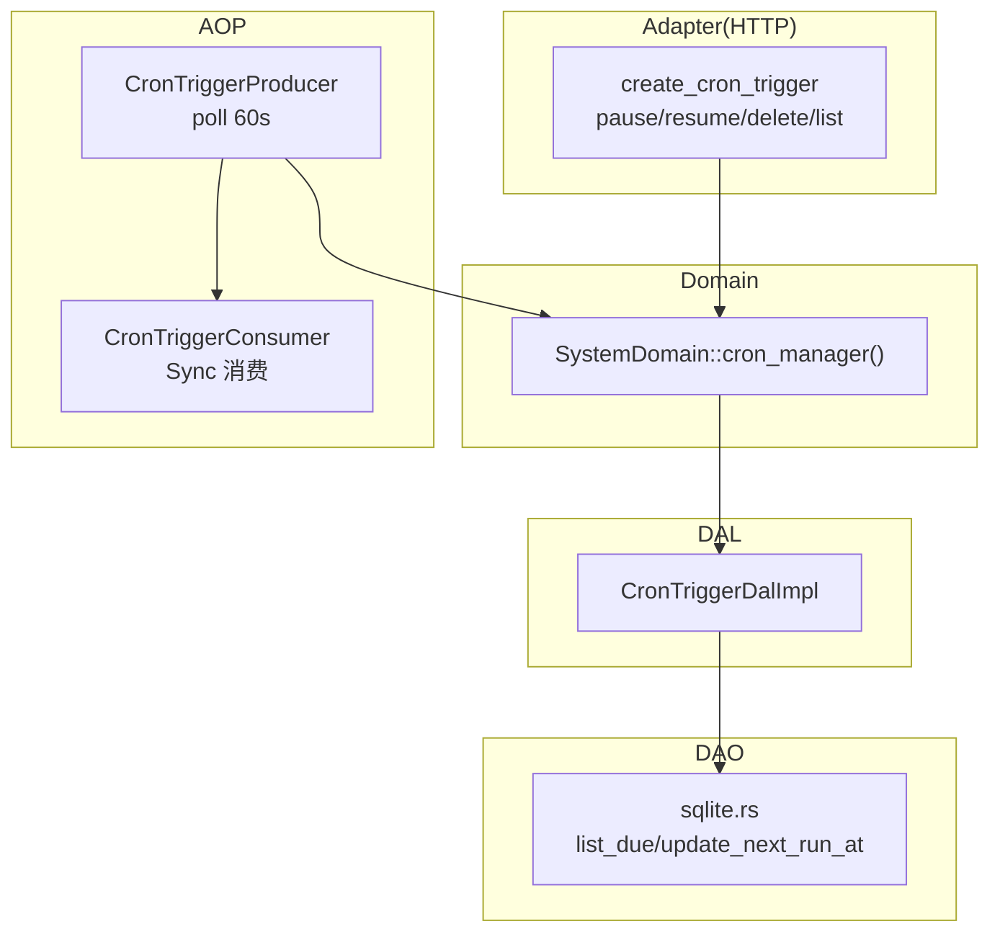
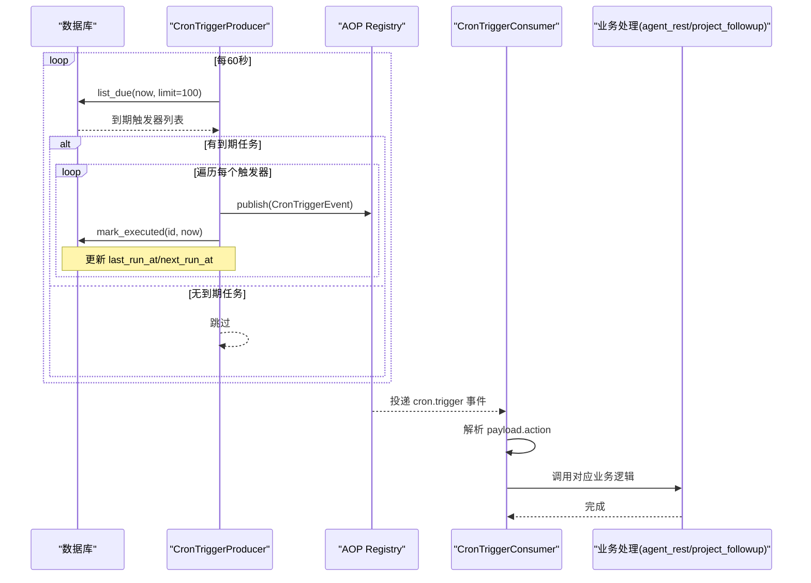
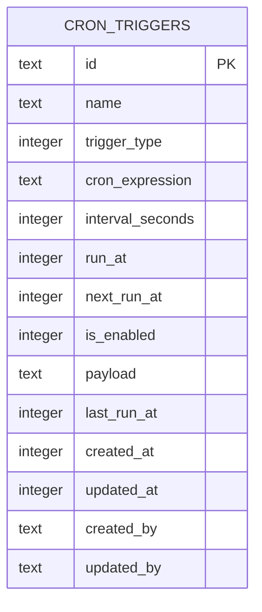
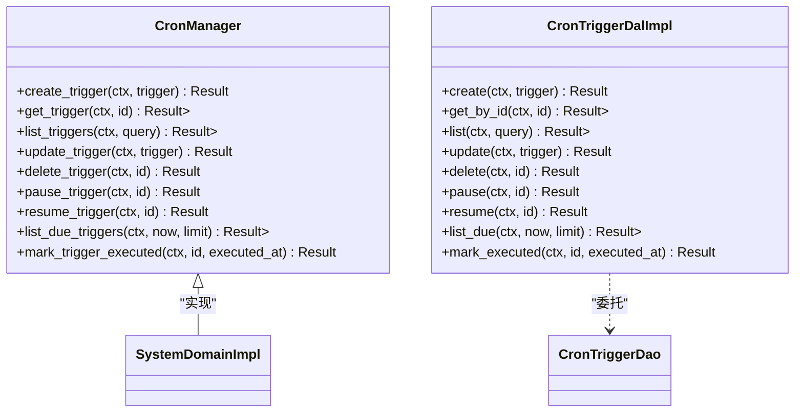
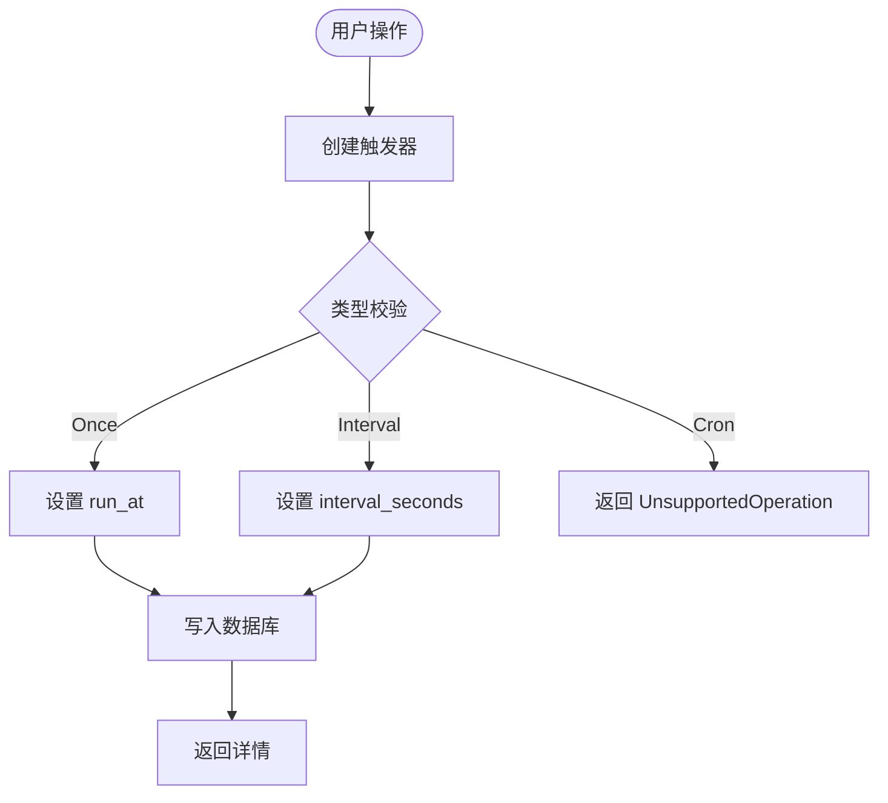
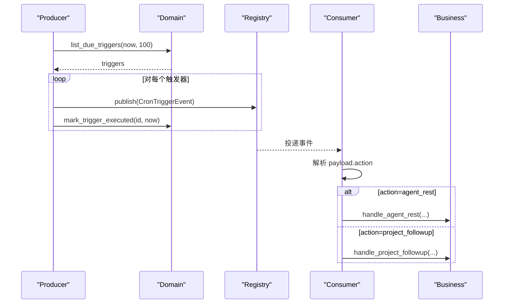
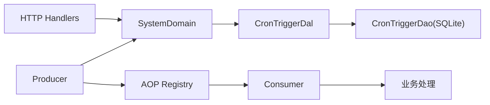

# 定时任务调度（业务功能层）

<cite>
**本文引用的文件**
- [src/models/cron_trigger.rs](src/models/cron_trigger.rs)
- [common/src/enums/cron_trigger.rs](common/src/enums/cron_trigger.rs)
- [common/src/api/cron_trigger.rs](common/src/api/cron_trigger.rs)
- [migrations/20260711000000_cron_triggers.sql](migrations/20260711000000_cron_triggers.sql)
- [src/service/dao/cron_trigger/mod.rs](src/service/dao/cron_trigger/mod.rs)
- [src/service/dao/cron_trigger/sqlite.rs](src/service/dao/cron_trigger/sqlite.rs)
- [src/service/dal/cron_trigger.rs](src/service/dal/cron_trigger.rs)
- [src/service/domain/system/mod.rs](src/service/domain/system/mod.rs)
- [src/handlers/system/cron_trigger/mod.rs](src/handlers/system/cron_trigger/mod.rs)
- [src/handlers/system/cron_trigger/create_cron_trigger.rs](src/handlers/system/cron_trigger/create_cron_trigger.rs)
- [src/producer/cron_trigger.rs](src/producer/cron_trigger.rs)
- [src/consumer/scheduler.rs](src/consumer/scheduler.rs)
- [frontend/src/pages/system/triggers.rs](frontend/src/pages/system/triggers.rs)

### 本文关联的三类文档（四类互引闭环）

**① 设计文档（Design）**：
- [任务调度器设计](docs/design/task_scheduler_design.md) — Cron 解析、生产者消费者与两阶段初始化规范

**② 落地计划（Plan）**：
- [唤醒上下文与睡眠约束](docs/plan/唤醒上下文与睡眠约束.md) — Agent 睡眠沉淀与唤醒上下文落地点

**④ RAG 原子知识卡**：
- [Cron 任务调度与系统启动顺序 RAG 卡](docs/wiki/knowledge/zh/Cron%20%E4%BB%BB%E5%8A%A1%E8%B0%83%E5%BA%A6%E4%B8%8E%E7%B3%BB%E7%BB%9F%E5%90%AF%E5%8A%A8%E9%A1%BA%E5%BA%8F%EF%BC%9A5%E5%AD%97%E6%AE%B5cron%E8%A7%A3%E6%9E%90%20+%20ensure_system_cron_triggers%202%E6%9D%A1%E6%B3%A8%E5%85%A5%20+%20CronTriggerConsumer%20%E4%BA%8B%E4%BB%B6%20+%20%E4%B8%A4%E9%98%B6%E6%AE%B5init/aop%E4%B8%A5%E6%A0%BC%E5%88%86%E7%A6%BB/Cron%20%E4%BB%BB%E5%8A%A1%E8%B0%83%E5%BA%A6%E4%B8%8E%E7%B3%BB%E7%BB%9F%E5%90%AF%E5%8A%A8%E9%A1%BA%E5%BA%8F%EF%BC%9A5%E5%AD%97%E6%AE%B5cron%E8%A7%A3%E6%9E%90%20+%20ensure_system_cron_triggers%202%E6%9D%A1%E6%B3%A8%E5%85%A5%20+%20CronTriggerConsumer%20%E4%BA%8B%E4%BB%B6%20+%20%E4%B8%A4%E9%98%B6%E6%AE%B5init/aop%E4%B8%A5%E6%A0%BC%E5%88%86%E7%A6%BB.md) — 5 字段 cron 解析 + 2 条系统触发器 + 两阶段 init/aop 分离速查
</cite>

## 目录
1. [简介](#简介)
2. [项目结构](#项目结构)
3. [核心组件](#核心组件)
4. [架构总览](#架构总览)
5. [详细组件分析](#详细组件分析)
6. [依赖关系分析](#依赖关系分析)
7. [性能与并发](#性能与并发)
8. [故障排查](#故障排查)
9. [结论](#结论)
10. [附录：常见场景与配置建议](#附录：常见场景与配置建议)

## 简介
本系统实现了一个基于事件驱动的定时任务调度子系统，支持一次性触发与固定间隔触发；Cron 表达式类型已预留但尚未启用。调度器通过 AOP 事件中心进行解耦：生产者每 60 秒轮询数据库中的到期触发器，发布事件；消费者同步消费事件并分发到具体业务动作（如 agent_rest、project_followup）。系统启动时会自动注入两条系统级默认触发器（Agent 睡眠沉淀、项目进度巡检），保证基础能力可用。

> 📌 视角说明（AGENTS §2.1.3 Level 3 互补视角平行卡）：
> 本长文是「定时任务调度」主题的 **业务功能层** 视角。同主题还有以下平行视角卡，请按需交叉阅读：
> - [定时任务调度（前端 UI 层）](docs/wiki/zh/content/前端应用/页面模块/系统管理页面/定时任务调度.md)

## 项目结构
定时任务相关代码遵循四层单向调用：Adapter（HTTP Handler）→ Domain → DAL → DAO，禁止跨层调用与同层互调。持久化对象 CronTriggerPo 仅在 DAO/DAL 内部使用，Domain 对外接口统一返回业务实体或内部事件。

图表来源
- [src/handlers/system/cron_trigger/create_cron_trigger.rs:14-67](src/handlers/system/cron_trigger/create_cron_trigger.rs#L14-L67)
- [src/service/domain/system/mod.rs:116-141](src/service/domain/system/mod.rs#L116-L141)
- [src/service/dal/cron_trigger.rs:37-74](src/service/dal/cron_trigger.rs#L37-L74)
- [src/service/dao/cron_trigger/sqlite.rs:166-213](src/service/dao/cron_trigger/sqlite.rs#L166-L213)
- [src/producer/cron_trigger.rs:26-87](src/producer/cron_trigger.rs#L26-L87)
- [src/consumer/scheduler.rs:39-95](src/consumer/scheduler.rs#L39-L95)

章节来源
- [src/handlers/system/cron_trigger/mod.rs:1-21](src/handlers/system/cron_trigger/mod.rs#L1-L21)
- [src/service/domain/system/mod.rs:20-58](src/service/domain/system/mod.rs#L20-L58)

## 核心组件
- 数据模型与枚举
  - CronTriggerPo：持久化对象，包含触发类型、表达式/间隔/执行时间、下次执行时间、负载等字段。
  - TriggerType：Once/Cron/Interval，当前仅 Once 与 Interval 可用。
- API DTO
  - Create/Update/List/Detail 等请求响应结构，前后端共享。
- 存储层
  - cron_triggers 表及索引，按 next_run_at、is_enabled、trigger_type、created_at 优化查询。
- 领域服务
  - SystemDomain::cron_manager() 暴露创建、查询、暂停、恢复、删除、获取到期任务、标记执行等方法。
- 生产/消费
  - Producer：每 60 秒轮询到期触发器，发布 cron.trigger 事件，并更新 last_run_at/next_run_at。
  - Consumer：同步消费事件，解析 payload.action 分发到业务处理（agent_rest、project_followup）。

章节来源
- [src/models/cron_trigger.rs:10-65](src/models/cron_trigger.rs#L10-L65)
- [common/src/enums/cron_trigger.rs:9-46](common/src/enums/cron_trigger.rs#L9-L46)
- [common/src/api/cron_trigger.rs:8-105](common/src/api/cron_trigger.rs#L8-L105)
- [migrations/20260711000000_cron_triggers.sql:1-25](migrations/20260711000000_cron_triggers.sql#L1-L25)
- [src/service/domain/system/mod.rs:116-141](src/service/domain/system/mod.rs#L116-L141)
- [src/producer/cron_trigger.rs:26-87](src/producer/cron_trigger.rs#L26-L87)
- [src/consumer/scheduler.rs:39-95](src/consumer/scheduler.rs#L39-L95)

## 架构总览
调度流程采用“生产者轮询 + 事件中心 + 消费者同步处理”的解耦模式：

图表来源
- [src/producer/cron_trigger.rs:42-87](src/producer/cron_trigger.rs#L42-L87)
- [src/consumer/scheduler.rs:53-95](src/consumer/scheduler.rs#L53-L95)
- [src/service/dao/cron_trigger/sqlite.rs:166-213](src/service/dao/cron_trigger/sqlite.rs#L166-L213)

## 详细组件分析

### 数据模型与存储
- CronTriggerPo 字段覆盖触发规则、状态与审计信息；构造时自动生成 ID、时间戳与默认负载。
- cron_triggers 表提供必要索引以支撑高效轮询与分页。

图表来源
- [migrations/20260711000000_cron_triggers.sql:4-24](migrations/20260711000000_cron_triggers.sql#L4-L24)
- [src/models/cron_trigger.rs:10-27](src/models/cron_trigger.rs#L10-L27)

章节来源
- [src/models/cron_trigger.rs:10-65](src/models/cron_trigger.rs#L10-L65)
- [migrations/20260711000000_cron_triggers.sql:1-25](migrations/20260711000000_cron_triggers.sql#L1-L25)

### 领域服务与 DAL/DAO
- Domain 层暴露 CronManager 接口，封装 CRUD、暂停/恢复、获取到期任务、标记执行。
- DAL 层负责业务语义（如暂停/恢复设置 is_enabled，计算下次执行时间）。
- DAO 层直接操作 SQLite，使用预编译 SQL 与索引优化查询。

图表来源
- [src/service/domain/system/mod.rs:116-141](src/service/domain/system/mod.rs#L116-L141)
- [src/service/dal/cron_trigger.rs:37-74](src/service/dal/cron_trigger.rs#L37-L74)
- [src/service/dao/cron_trigger/mod.rs:18-56](src/service/dao/cron_trigger/mod.rs#L18-L56)

章节来源
- [src/service/domain/system/mod.rs:116-141](src/service/domain/system/mod.rs#L116-L141)
- [src/service/dal/cron_trigger.rs:37-177](src/service/dal/cron_trigger.rs#L37-L177)
- [src/service/dao/cron_trigger/mod.rs:1-63](src/service/dao/cron_trigger/mod.rs#L1-L63)
- [src/service/dao/cron_trigger/sqlite.rs:166-213](src/service/dao/cron_trigger/sqlite.rs#L166-L213)

### HTTP 接口与前端
- 后端提供创建、获取、列表、暂停、恢复、删除等接口，当前创建时对 Cron 类型返回不支持错误。
- 前端页面展示触发器列表、状态分布、调度信息，并提供创建表单（含 Cron 表达式输入框与预设）。

图表来源
- [src/handlers/system/cron_trigger/create_cron_trigger.rs:19-38](src/handlers/system/cron_trigger/create_cron_trigger.rs#L19-L38)
- [common/src/api/cron_trigger.rs:8-43](common/src/api/cron_trigger.rs#L8-L43)
- [frontend/src/pages/system/triggers.rs:113-122](frontend/src/pages/system/triggers.rs#L113-L122)

章节来源
- [src/handlers/system/cron_trigger/mod.rs:1-21](src/handlers/system/cron_trigger/mod.rs#L1-L21)
- [src/handlers/system/cron_trigger/create_cron_trigger.rs:14-67](src/handlers/system/cron_trigger/create_cron_trigger.rs#L14-L67)
- [common/src/api/cron_trigger.rs:8-105](common/src/api/cron_trigger.rs#L8-L105)
- [frontend/src/pages/system/triggers.rs:113-122](frontend/src/pages/system/triggers.rs#L113-L122)

### 生产者与消费者
- 生产者每 60 秒轮询到期任务，发布事件并更新执行时间。
- 消费者同步消费事件，根据 payload.action 路由到不同业务处理。

图表来源
- [src/producer/cron_trigger.rs:42-87](src/producer/cron_trigger.rs#L42-L87)
- [src/consumer/scheduler.rs:53-95](src/consumer/scheduler.rs#L53-L95)
- [src/service/domain/system/mod.rs:240-258](src/service/domain/system/mod.rs#L240-L258)

章节来源
- [src/producer/cron_trigger.rs:1-88](src/producer/cron_trigger.rs#L1-L88)
- [src/consumer/scheduler.rs:1-211](src/consumer/scheduler.rs#L1-L211)

### 系统默认任务
- 启动阶段会确保两条系统级触发器存在：agent_rest（每 4 小时）、project_followup（每 1 小时），幂等插入。

章节来源
- [src/service/domain/system/mod.rs:358-415](src/service/domain/system/mod.rs#L358-L415)

## 依赖关系分析
- Adapter 层仅依赖 Domain 层，不直接访问 DAL/DAO。
- Domain 层通过 trait 抽象 DAL，DAL 再委托 DAO。
- Producer/Consumer 通过 AOP 框架解耦，Producer 依赖 Domain，Consumer 依赖业务域。

图表来源
- [src/handlers/system/cron_trigger/create_cron_trigger.rs:14-67](src/handlers/system/cron_trigger/create_cron_trigger.rs#L14-L67)
- [src/service/domain/system/mod.rs:20-58](src/service/domain/system/mod.rs#L20-L58)
- [src/service/dal/cron_trigger.rs:15-32](src/service/dal/cron_trigger.rs#L15-L32)
- [src/producer/cron_trigger.rs:26-87](src/producer/cron_trigger.rs#L26-L87)
- [src/consumer/scheduler.rs:39-95](src/consumer/scheduler.rs#L39-L95)

章节来源
- [src/service/domain/system/mod.rs:20-58](src/service/domain/system/mod.rs#L20-L58)
- [src/service/dal/cron_trigger.rs:15-32](src/service/dal/cron_trigger.rs#L15-L32)

## 性能与并发
- 轮询频率：生产者每 60 秒轮询一次，适合低频系统任务。
- 批量拉取：每次最多拉取 100 条到期任务，避免单次 IO 过大。
- 数据库索引：next_run_at、is_enabled、trigger_type、created_at 索引提升查询效率。
- 同步消费：消费者为 Sync 模式，事件处理串行执行，避免同一触发器并发冲突；如需更高吞吐可考虑扩展为异步消费并按 trigger_id 分片。
- 超时与重试：当前未实现显式超时与失败重试；可在消费者层增加超时控制与重试队列，结合 AOP 统计与告警。

[本节为通用指导，无需特定文件引用]

## 故障排查
- 创建 Cron 类型失败：当前后端对 TriggerType::Cron 返回不支持错误，需先实现表达式解析与下次执行时间计算。
- 任务未执行：检查 is_enabled 是否为 1、next_run_at 是否小于等于当前时间、数据库索引是否存在。
- 消费者报错：查看事件 payload 是否合法 JSON，action 是否受支持；确认业务处理函数是否抛出异常。
- 日志与监控：利用 AOP 统计与日志查询接口观察事件投递与消费情况。

章节来源
- [src/handlers/system/cron_trigger/create_cron_trigger.rs:32-37](src/handlers/system/cron_trigger/create_cron_trigger.rs#L32-L37)
- [src/service/dao/cron_trigger/sqlite.rs:166-187](src/service/dao/cron_trigger/sqlite.rs#L166-L187)
- [src/consumer/scheduler.rs:53-95](src/consumer/scheduler.rs#L53-L95)

## 结论
该定时任务调度子系统以事件驱动为核心，实现了稳定可靠的周期性任务执行机制。当前已完整支持一次性与固定间隔触发，Cron 表达式类型已预留但未启用。通过清晰的层次划分与 AOP 解耦，系统具备良好的可扩展性与可维护性。后续可优先完善 Cron 表达式解析、失败重试、超时控制与高可用部署策略。

[本节为总结，无需特定文件引用]

## 附录：常见场景与配置建议
- 数据同步：使用 Interval 类型，payload 中指定目标系统与批次大小，配合限流与重试。
- 报告生成：使用 Once 类型在特定时间点触发，或 Interval 类型按天/周生成。
- 清理任务：使用 Interval 类型定期清理过期数据，注意分批与事务边界。
- 优先级与资源限制：可通过 payload 携带优先级与资源配额，消费者侧实现调度策略。
- 负载均衡：多实例部署时，确保数据库唯一约束与索引正确，避免重复执行；必要时引入分布式锁。
- 高可用与故障转移：结合进程守护与健康检查，失败时自动重启；关键任务增加重试与告警。

[本节为概念性内容，无需特定文件引用]