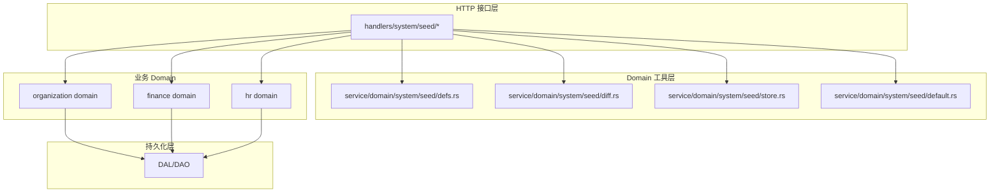
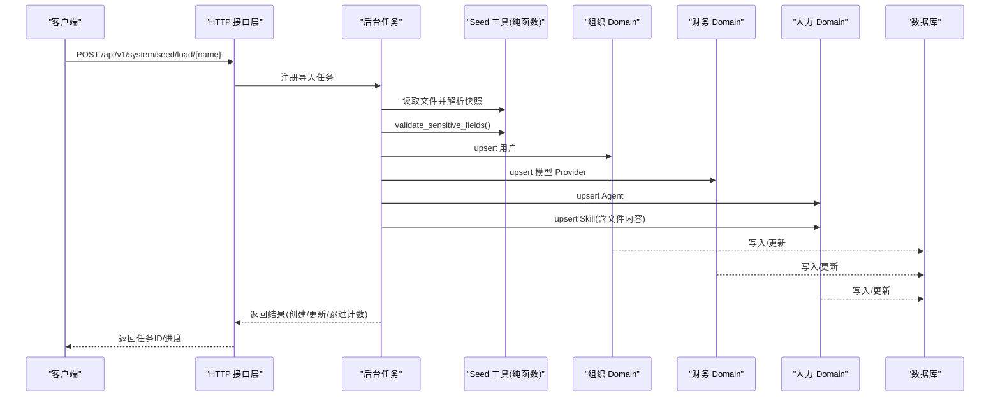
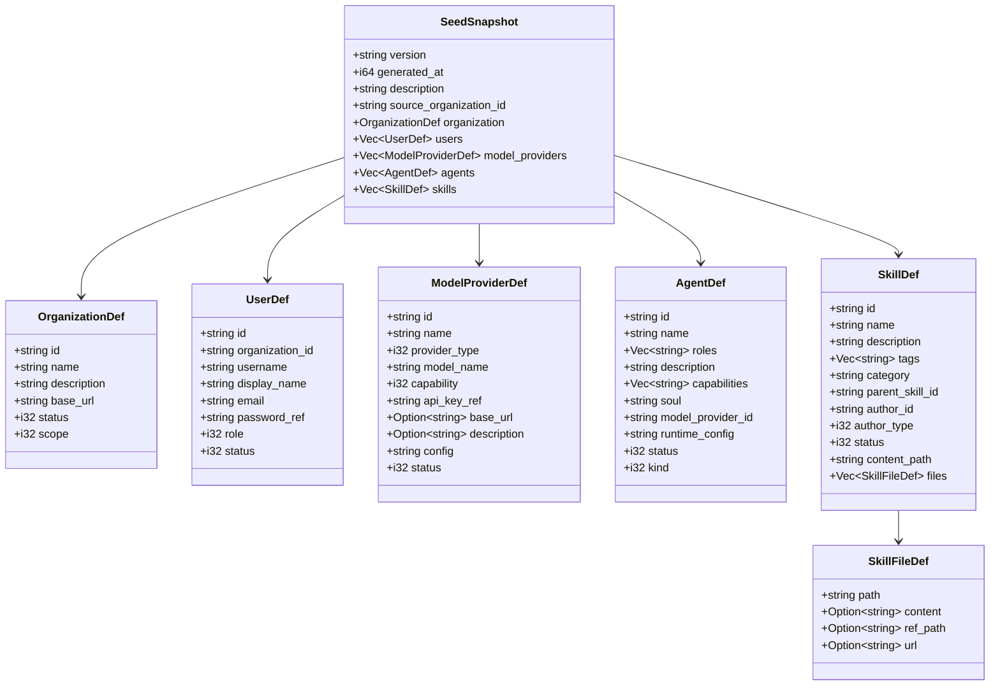
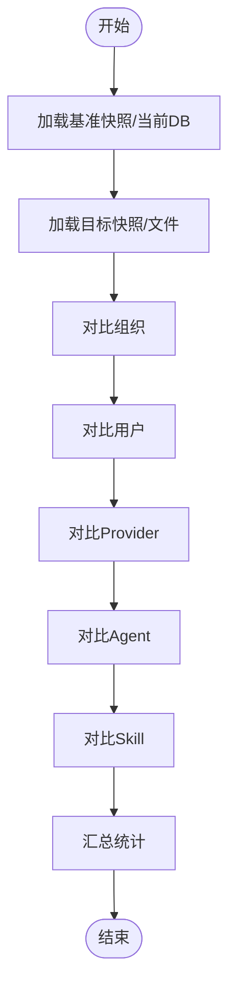
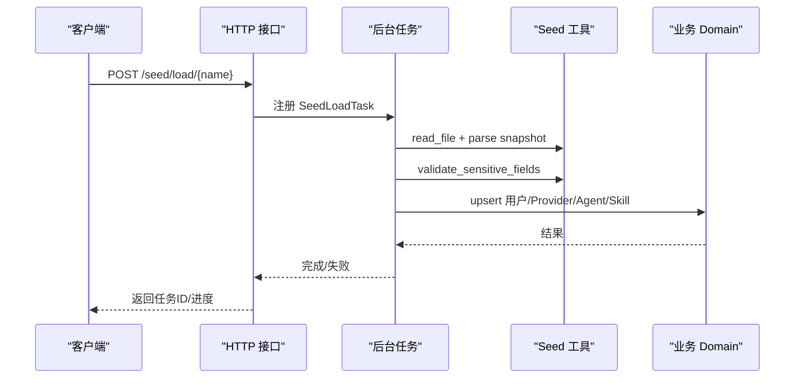
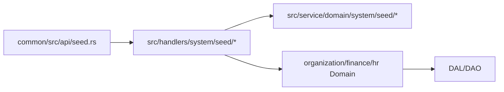

# 种子数据管理（业务功能层）

<cite>
**本文引用的文件**
- [common/src/api/seed.rs](common/src/api/seed.rs)
- [src/handlers/system/seed/mod.rs](src/handlers/system/seed/mod.rs)
- [src/handlers/system/seed/load.rs](src/handlers/system/seed/load.rs)
- [src/handlers/system/seed/save.rs](src/handlers/system/seed/save.rs)
- [src/handlers/system/seed/apply_default.rs](src/handlers/system/seed/apply_default.rs)
- [src/service/domain/system/seed/mod.rs](src/service/domain/system/seed/mod.rs)
- [src/service/domain/system/seed/defs.rs](src/service/domain/system/seed/defs.rs)
- [src/service/domain/system/seed/diff.rs](src/service/domain/system/seed/diff.rs)
- [src/service/domain/system/seed/store.rs](src/service/domain/system/seed/store.rs)
- [src/service/domain/system/seed/default.rs](src/service/domain/system/seed/default.rs)
- [src/service/domain/system/seed/default.json](src/service/domain/system/seed/default.json)
### 本文关联的三类文档（四类互引闭环）
#### ① Design 决策快照
- [seed-config-migration.md](docs/archive/design-archive/seed-config-migration.md) — Seed 工具箱纯 Domain 架构；SeedSnapshot 版本号 + 8 类实体；Diff 4 种变化（新增/删除/修改/未变）+ 3 种占位符；4 策略（INSERT_ONLY / UPSERT / MIRROR / PREVIEW）；5 套 TEMPLATE_SKILL 编译期嵌入；权限 SuperAdmin；异步后台任务 + Progress 百分比
#### ② Plan 落地快照
- [Agent管理集成测试.md](docs/archive/plan-archive/Agent管理集成测试.md) — 集成测试对齐两阶段初始化顺序；Consumer::init 只注册订阅者
#### ④ RAG 原子知识卡
- [种子配置与系统两阶段初始化：5 套 TEMPLATE_SKILL 编译期嵌入 + seed diff 增量导入 + 两阶段 init aop 严格分离 + init_all_base_data 域派发](docs/wiki/knowledge/zh/种子配置与系统两阶段初始化：5%20套%20TEMPLATE_SKILL%20编译期嵌入%20+%20seed%20diff%20增量导入%20+%20两阶段%20init%20aop%20严格分离%20+%20init_all_base_data%20域派发/种子配置与系统两阶段初始化：5%20套%20TEMPLATE_SKILL%20编译期嵌入%20+%20seed%20diff%20增量导入%20+%20两阶段%20init%20aop%20严格分离%20+%20init_all_base_data%20域派发.md) — §3 SeedSnapshot 8 类实体 + Diff 算法 + 4 策略应用；§红线 2 Seed 纯工具箱（不能调用其他 Domain/DAL）；§红线 4 敏感字段占位符三模式（PENDING_INPUT/INHERIT_CURRENT/RANDOM_GENERATE）

## 2026-09-01 增量变更
- [src/handlers/system/seed/mod.rs#L153-L229](src/handlers/system/seed/mod.rs#L153-L229) — apply_preset_skills 合并 imports（Guest ctx 权限 bug 修复：新技能 create 时一次性带 imports，不两步走）
- [src/service/domain/system/seed/embedded.rs](src/service/domain/system/seed/embedded.rs) — 新增第 6 套 TEMPLATE_GIT_BRANCH_WORKFLOW；原有 5 套 skill.md 合计 1362→661 行（精简 51%）
- [src/service/domain/system/seed/skills/GIT_BRANCH_WORKFLOW/skill.md](src/service/domain/system/seed/skills/GIT_BRANCH_WORKFLOW/skill.md) — 新增 Git 分支创建/切分/保护/合并方法论模板
- [src/service/domain/system/seed/default.json](src/service/domain/system/seed/default.json) — 更新预置模板集（反映精简后 5 套 + 新增 GIT 分支）

**本文关联的 RAG 知识卡**：
- [种子配置与系统两阶段初始化：5 套 TEMPLATE_SKILL 编译期嵌入 + seed diff 增量导入 + 两阶段 init aop 严格分离 + init_all_base_data 域派发](docs/wiki/knowledge/zh/种子配置与系统两阶段初始化：5 套 TEMPLATE_SKILL 编译期嵌入 + seed diff 增量导入 + 两阶段 init aop 严格分离 + init_all_base_data 域派发/种子配置与系统两阶段初始化：5 套 TEMPLATE_SKILL 编译期嵌入 + seed diff 增量导入 + 两阶段 init aop 严格分离 + init_all_base_data 域派发.md)

</cite>

## 更新摘要

**2026-09-01 增量**：apply_preset_skills 新技能创建路径合并 imports 为单次 create_skill（修复 Guest ctx 在 /initialize 路由下 update_skill Forbidden 的权限 bug）；新增 TEMPLATE_GIT_BRANCH_WORKFLOW 第 6 套预置包；原 5 套 skill.md 精简总行数 1362→661（减 51%）。

## 目录
1. [简介](#简介)
2. [项目结构](#项目结构)
3. [核心组件](#核心组件)
4. [架构总览](#架构总览)
5. [详细组件分析](#详细组件分析)
6. [依赖关系分析](#依赖关系分析)
7. [性能考量](#性能考量)
8. [故障排查指南](#故障排查指南)
9. [结论](#结论)
10. [附录](#附录)

## 简介
本系统提供“种子数据管理”能力，用于在部署、环境搭建与测试中快速初始化组织、用户、模型 Provider、Agent、Skill 等配置型实体。其核心包括：
- 快照格式与版本管理：统一的 SeedSnapshot 结构与版本常量，确保跨环境一致性。
- 导入/导出/应用/回滚：支持从文件系统加载快照并应用到数据库；支持将当前组织配置导出为可迁移的 JSON 快照；支持应用内置默认模板。
- 差异对比与冲突解决：提供文件 vs DB、DB vs 文件、文件 vs 文件的 diff 能力，以及敏感字段占位符解析策略（PENDING_INPUT / INHERIT_CURRENT / RANDOM_GENERATE）。
- 权限控制与环境隔离：通过 SuperAdmin 校验与 RequestContext 中的组织上下文实现多租户隔离。
- 异步任务与进度：导入、导出、应用默认模板均通过后台任务执行，前端轮询进度。
- 验证与错误处理：导入前进行敏感字段完整性校验，并提供详细的 diff 报告辅助决策。

> 📌 视角说明（AGENTS §2.1.3 Level 3 互补视角平行卡）：
> 本长文是「种子数据管理」主题的 **业务功能层** 视角。同主题还有以下平行视角卡，请按需交叉阅读：
> - [种子数据管理（前端 UI 层）](docs/wiki/zh/content/前端应用/页面模块/系统管理页面/种子数据管理.md)

## 项目结构
种子数据相关代码采用“四层单向调用”原则：Handler（Adapter）→ Domain → DAL → DAO。Seed 子模块作为“纯工具箱”，不持有 DAL 引用，不调用其他 Domain；实际的 DB 读写由 Handler 层编排各 Domain 完成。

图表来源
- [src/handlers/system/seed/mod.rs:1-30](src/handlers/system/seed/mod.rs#L1-L30)
- [src/service/domain/system/seed/mod.rs:1-17](src/service/domain/system/seed/mod.rs#L1-L17)

章节来源
- [src/handlers/system/seed/mod.rs:1-30](src/handlers/system/seed/mod.rs#L1-L30)
- [src/service/domain/system/seed/mod.rs:1-17](src/service/domain/system/seed/mod.rs#L1-L17)

## 核心组件
- 快照数据结构与版本：SeedSnapshot、OrganizationDef、UserDef、ModelProviderDef、AgentDef、SkillDef、SkillFileDef，以及 CURRENT_VERSION 常量。
- 差异算法与敏感字段解析：diff_snapshots、validate_sensitive_fields、resolve_password、resolve_api_key。
- 文件存储：seeds_dir、list_files、read_file、write_file、delete_file，含文件名安全校验。
- 内置默认模板：embedded_default_snapshot 读取编译期内嵌 default.json。
- HTTP 接口与后台任务：load/save/apply-default 等接口，统一通过 BackgroundTask 注册中心执行，返回 task_id 供前端轮询。

章节来源
- [src/service/domain/system/seed/defs.rs:16-42](src/service/domain/system/seed/defs.rs#L16-L42)
- [src/service/domain/system/seed/diff.rs:9-38](src/service/domain/system/seed/diff.rs#L9-L38)
- [src/service/domain/system/seed/store.rs:9-27](src/service/domain/system/seed/store.rs#L9-L27)
- [src/service/domain/system/seed/default.rs:1-11](src/service/domain/system/seed/default.rs#L1-L11)
- [src/handlers/system/seed/load.rs:17-35](src/handlers/system/seed/load.rs#L17-L35)
- [src/handlers/system/seed/save.rs:17-38](src/handlers/system/seed/save.rs#L17-L38)
- [src/handlers/system/seed/apply_default.rs:17-38](src/handlers/system/seed/apply_default.rs#L17-L38)

## 架构总览
种子数据管理的整体流程遵循“Handler 编排 + Domain 工具 + 业务 Domain 写入”的模式：
- 导出：Handler 调用组织/用户/Provider/Agent/Skill Domain 拉取数据，组装成 SeedSnapshot，再写入 seeds/ 目录。
- 导入：Handler 读取 seeds/ 下的 JSON 快照，解析后按策略应用到 DB（PreserveIds / RegenerateIds / SkipExisting），DryRun 仅计算 diff。
- 应用默认模板：从内嵌 default.json 加载模板，复用导入流程。
- 权限控制：所有高危操作需 SuperAdmin 权限；请求上下文携带组织 ID 实现多租户隔离。

图表来源
- [src/handlers/system/seed/load.rs:124-149](src/handlers/system/seed/load.rs#L124-L149)
- [src/handlers/system/seed/mod.rs:420-671](src/handlers/system/seed/mod.rs#L420-L671)
- [src/service/domain/system/seed/diff.rs:171-201](src/service/domain/system/seed/diff.rs#L171-L201)

## 详细组件分析

#### 2026-09-01 增量：apply_preset_skills 合并 imports 修复 Guest ctx 崩溃 + 新增第 6 套模板
- **两步走 create→update 为何 Guest ctx 必崩**：旧逻辑在 apply_preset_skills 中对新预置技能先 create（带 imports=[]），再单独 update_skill 写入真实 imports 列表。但 /initialize 路由走 Guest 上下文，create_skill 的权限校验允许 Guest 新建技能（因为是 seed 初始化路径），而 update_skill 的权限守卫要求登录用户的 author_id 匹配或 SuperAdmin——Guest ctx 两者都不满足，因此第二步直接返回 Forbidden 403，导致预置技能导入中断或 imports 为空。
- **新合并 imports 方案**：将 imports 列表直接嵌入 create_skill 调用的 payload 中，一次性创建完整技能记录（content + imports 同时落库），消除了对 update_skill 的二次调用。Guest ctx 全程只经过一次权限校验，彻底规避 Forbidden 崩溃点。
- **第 6 套模板注册链路**：TEMPLATE_GIT_BRANCH_WORKFLOW 的 skill.md 放在 src/service/domain/system/seed/skills/GIT_BRANCH_WORKFLOW/ 下，由 embedded.rs 通过 include_str! 编译期嵌入，然后在 default.json 的 templates 数组中新增条目。精简后的原 5 套 skill.md 合计行数从 1362 行压缩到 661 行（减 51%），去除冗余章节与重复代码块。

### 快照数据结构与版本管理
- SeedSnapshot 包含 version、generated_at、description、source_organization_id，以及 organization/users/model_providers/agents/skills。
- CURRENT_VERSION 固定为 "1.0.0"，用于后续 schema 演进兼容。
- 敏感字段（password_hash、api_key）永远不导出，使用 PENDING_INPUT 占位符，导入时由管理员填写或继承当前值。

图表来源
- [src/service/domain/system/seed/defs.rs:16-147](src/service/domain/system/seed/defs.rs#L16-L147)

章节来源
- [src/service/domain/system/seed/defs.rs:16-42](src/service/domain/system/seed/defs.rs#L16-L42)
- [src/service/domain/system/seed/defs.rs:44-147](src/service/domain/system/seed/defs.rs#L44-L147)

### 差异对比与冲突解决
- diff_snapshots：对比两个快照，生成 SeedDiff，统计 new/updated/same/removed。
- collect_changes：递归比较对象字段，输出 FieldChange 列表。
- validate_sensitive_fields：校验 PENDING_INPUT 占位符是否已填充。
- resolve_password / resolve_api_key：根据策略解析敏感字段（PENDING_INPUT / INHERIT_CURRENT / RANDOM_GENERATE）。

图表来源
- [src/service/domain/system/seed/diff.rs:9-38](src/service/domain/system/seed/diff.rs#L9-L38)
- [src/service/domain/system/seed/diff.rs:63-117](src/service/domain/system/seed/diff.rs#L63-L117)
- [src/service/domain/system/seed/diff.rs:119-169](src/service/domain/system/seed/diff.rs#L119-L169)

章节来源
- [src/service/domain/system/seed/diff.rs:9-38](src/service/domain/system/seed/diff.rs#L9-L38)
- [src/service/domain/system/seed/diff.rs:171-255](src/service/domain/system/seed/diff.rs#L171-L255)

### 文件存储与安全
- seeds_dir：基于 AppConfig.base_data_path 拼接 seeds/ 目录。
- validate_seed_filename：防止路径穿越，自动补全 .json 后缀。
- list_files/read_file/write_file/delete_file：异步 IO，返回统一响应结构。

章节来源
- [src/service/domain/system/seed/store.rs:9-27](src/service/domain/system/seed/store.rs#L9-L27)
- [src/service/domain/system/seed/store.rs:29-75](src/service/domain/system/seed/store.rs#L29-L75)
- [src/service/domain/system/seed/store.rs:77-118](src/service/domain/system/seed/store.rs#L77-L118)

### 内置默认模板
- embedded_default_snapshot：从编译期内嵌 default.json 解析得到 SeedSnapshot。
- default.json：包含组织、用户、Provider、Agent、Skill 的初始模板，敏感字段使用 PENDING_INPUT。

章节来源
- [src/service/domain/system/seed/default.rs:1-11](src/service/domain/system/seed/default.rs#L1-L11)
- [src/service/domain/system/seed/default.json:1-159](src/service/domain/system/seed/default.json#L1-L159)

### HTTP 接口与后台任务
- 导入（load）：POST /api/v1/system/seed/load/{name}，提交后台任务，返回 task_id。
- 导出（save）：POST /api/v1/system/seed/save，导出当前组织配置到 seeds/ 目录。
- 应用默认模板（apply-default）：POST /api/v1/system/seed/apply-default，应用内置模板。
- 所有高危操作需 SuperAdmin 权限；任务体内部维护进度状态，支持 DryRun 模式。

图表来源
- [src/handlers/system/seed/load.rs:124-162](src/handlers/system/seed/load.rs#L124-L162)
- [src/handlers/system/seed/save.rs:123-171](src/handlers/system/seed/save.rs#L123-L171)
- [src/handlers/system/seed/apply_default.rs:123-160](src/handlers/system/seed/apply_default.rs#L123-L160)

章节来源
- [src/handlers/system/seed/load.rs:1-162](src/handlers/system/seed/load.rs#L1-L162)
- [src/handlers/system/seed/save.rs:1-171](src/handlers/system/seed/save.rs#L1-L171)
- [src/handlers/system/seed/apply_default.rs:1-160](src/handlers/system/seed/apply_default.rs#L1-L160)
- [src/handlers/system/seed/mod.rs:36-46](src/handlers/system/seed/mod.rs#L36-L46)

### 导入策略与敏感字段解析
- ImportStrategy：PreserveIds（保留 ID）、RegenerateIds（重新生成 ID）、DryRun（仅预览）、SkipExisting（跳过已存在）。
- 敏感字段策略：
  - PENDING_INPUT：必须由前端传入具体值。
  - INHERIT_CURRENT：继承当前 DB 中的值（适用于回滚场景）。
  - RANDOM_GENERATE：随机生成（如密码）。

章节来源
- [common/src/api/seed.rs:70-96](common/src/api/seed.rs#L70-L96)
- [src/service/domain/system/seed/diff.rs:203-255](src/service/domain/system/seed/diff.rs#L203-L255)

### 技能文件内容来源
- SkillFileDef 支持三种内容来源，优先级：content > ref_path > url。
- 运行时抓取 URL 内容时限制 30s 超时与 1MB 大小。

章节来源
- [src/handlers/system/seed/mod.rs:72-128](src/handlers/system/seed/mod.rs#L72-L128)
- [src/service/domain/system/seed/defs.rs:125-147](src/service/domain/system/seed/defs.rs#L125-L147)

## 依赖关系分析
- Handler 层依赖 seed 子模块的纯函数（diff、validate、store、default），并通过业务 Domain 完成 DB 写入。
- seed 子模块不依赖 DAL/DAO，保持无业务感知。
- 对外暴露 DTO 位于 common/src/api/seed.rs，供前后端共享。

图表来源
- [common/src/api/seed.rs:1-163](common/src/api/seed.rs#L1-L163)
- [src/handlers/system/seed/mod.rs:1-30](src/handlers/system/seed/mod.rs#L1-L30)
- [src/service/domain/system/seed/mod.rs:1-17](src/service/domain/system/seed/mod.rs#L1-L17)

章节来源
- [common/src/api/seed.rs:1-163](common/src/api/seed.rs#L1-L163)
- [src/handlers/system/seed/mod.rs:1-30](src/handlers/system/seed/mod.rs#L1-L30)
- [src/service/domain/system/seed/mod.rs:1-17](src/service/domain/system/seed/mod.rs#L1-L17)

## 性能考量
- 导出/导入均为异步后台任务，避免阻塞 HTTP 线程。
- 导出阶段分步推进（组织/用户/Provider/Agent/Skill/写文件），便于进度反馈与中断恢复。
- 导入阶段支持 DryRun，先计算 diff 再决定是否写入，减少误操作风险。
- 技能文件内容抓取设置超时与大小限制，防止资源耗尽。

[本节为通用指导，无需特定文件引用]

## 故障排查指南
- 权限不足：确认当前用户角色具备 SuperAdmin 权限。
- 缺少敏感字段：检查 sensitive_values 是否包含所有 PENDING_INPUT 占位符对应的键。
- 文件不存在：确认 seeds/ 目录下存在对应 .json 文件，且文件名合法。
- 导入失败：查看后台任务进度与错误信息，定位具体步骤（用户/Provider/Agent/Skill）。
- 权限校验失败：check_super_admin 会拒绝非 SuperAdmin 的高危操作。

章节来源
- [src/handlers/system/seed/mod.rs:36-46](src/handlers/system/seed/mod.rs#L36-L46)
- [src/service/domain/system/seed/diff.rs:171-201](src/service/domain/system/seed/diff.rs#L171-L201)
- [src/service/domain/system/seed/store.rs:14-27](src/service/domain/system/seed/store.rs#L14-L27)
- [src/handlers/system/seed/load.rs:124-162](src/handlers/system/seed/load.rs#L124-L162)

## 结论
种子数据管理系统以“纯工具箱 + Handler 编排”的方式实现了配置型实体的导入/导出/应用/回滚，具备完善的差异对比、敏感字段解析、权限控制与异步任务机制。通过统一的快照结构与版本管理，可在多环境部署与测试中快速构建一致的基础配置，提升交付效率与稳定性。

[本节为总结性内容，无需特定文件引用]

## 附录
- 最佳实践
  - 使用 DryRun 预演导入效果，确认 diff 后再实际写入。
  - 对敏感字段采用 INHERIT_CURRENT 进行回滚，避免覆盖现有密钥。
  - 导出快照时添加描述信息，便于追踪变更来源。
  - 技能文件优先使用内嵌 content，确保快照自包含可迁移。
- 版本管理策略
  - 通过 SeedSnapshot.version 控制兼容性，必要时在导入逻辑中做降级处理。
  - 默认模板与业务模板分离，默认模板由编译期内嵌保证可用性。

[本节为通用指导，无需特定文件引用]