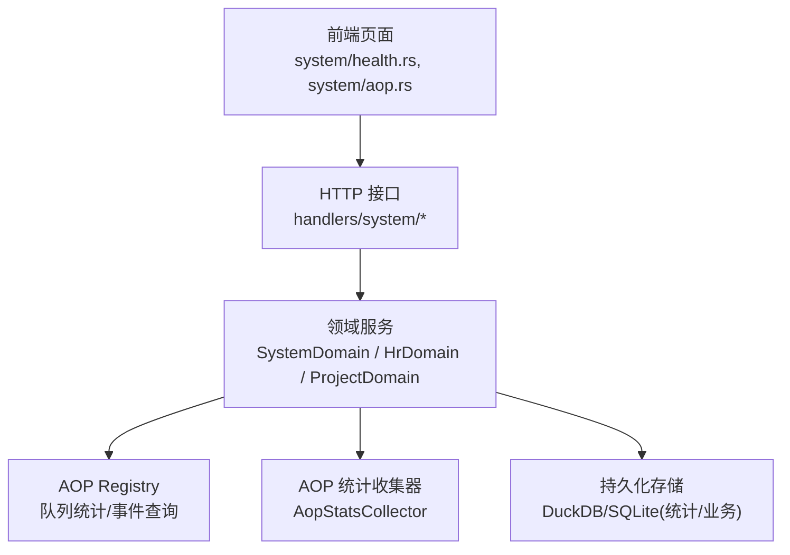
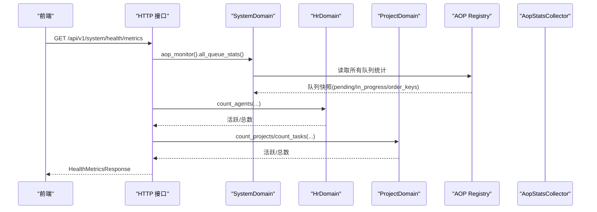
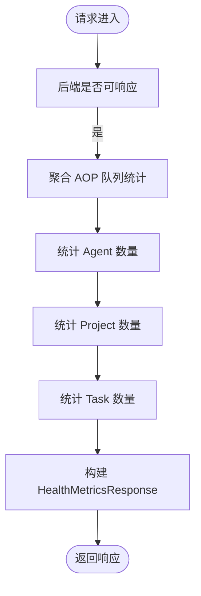
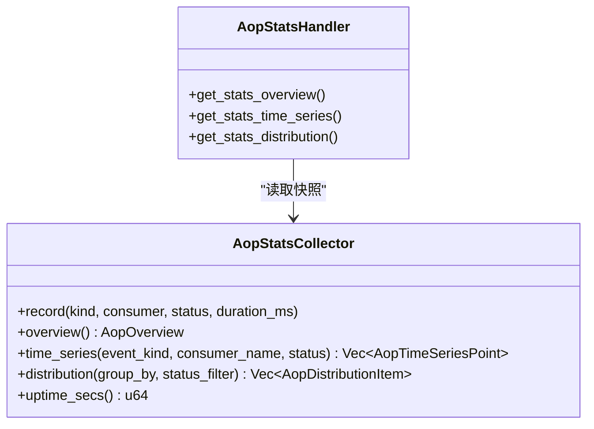
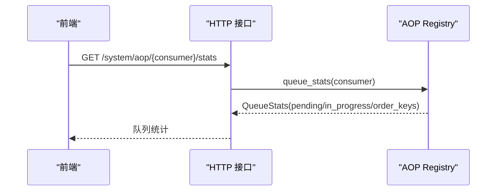
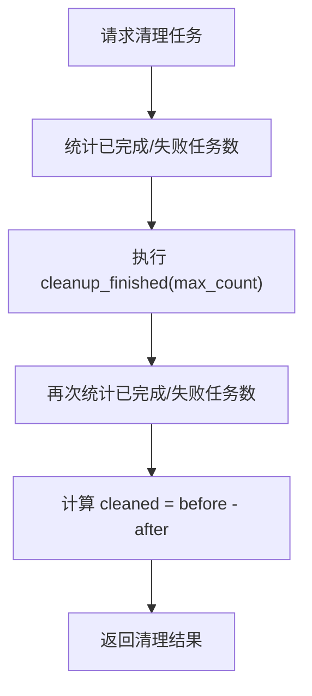
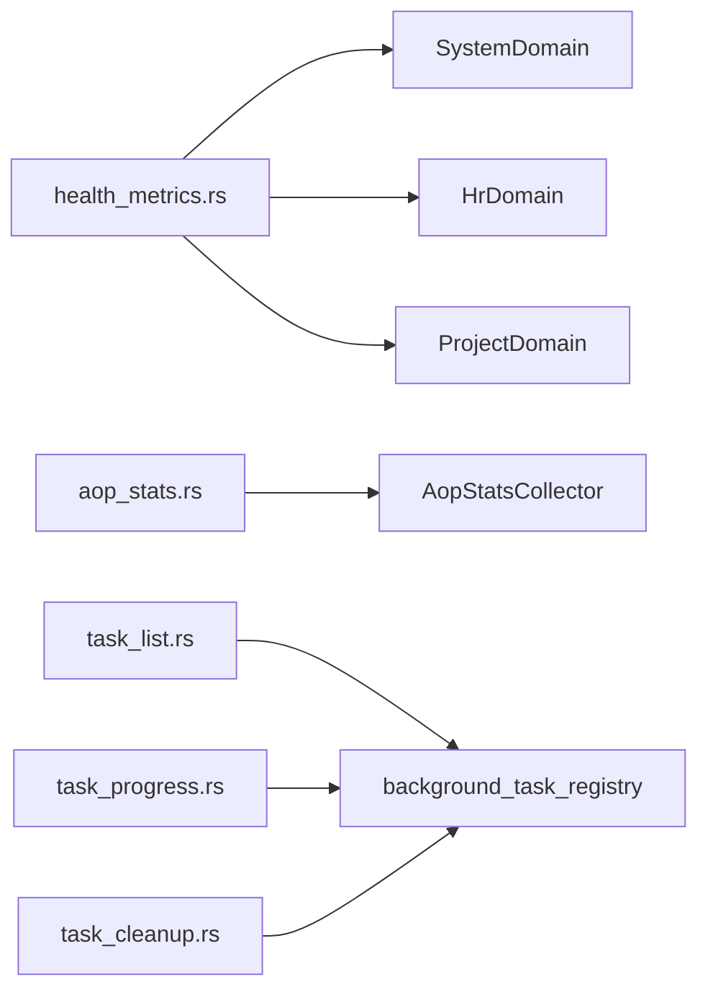

# 系统监控与健康检查

<cite>
**本文引用的文件**
- [health.rs](src/handlers/health.rs)
- [health_metrics.rs](src/handlers/system/health_metrics.rs)
- [task_progress.rs](src/handlers/system/task_progress.rs)
- [task_list.rs](src/handlers/system/task_list.rs)
- [task_cleanup.rs](src/handlers/system/task_cleanup.rs)
- [aop_stats.rs](src/handlers/system/aop_stats.rs)
- [router.rs](src/router.rs)
- [aop_stats_collector.rs](src/consumer/aop_stats_collector.rs)
- [health.rs](frontend/src/pages/system/health.rs)
- [aop.rs](frontend/src/pages/system/aop.rs)

### 本文关联的三类文档（四类互引闭环）

**① 设计文档（Design）**：
- [Canvas 渲染与可视化手册](docs/archive/design-archive/canvas_rendering_playbook.md) — HUD 风格 Canvas 渲染、图表与知识图谱可视化规范
- [统计模块设计](docs/archive/design-archive/stats_module_design.md) — DuckDB 持久化统计框架与 5 维表注册设计
- [统计查询设计](docs/archive/design-archive/stats_query_design.md) — 统计聚合与时序查询 API 协议设计

**② 落地计划（Plan）**：
- [知识图谱推荐起点与组件复用重构](docs/archive/plan-archive/知识图谱推荐起点与组件复用重构.md) — 知识图谱推荐起点与 Canvas 组件复用重构
- [统计图表Phase1基础设施与时序图展示重构](docs/archive/plan-archive/统计图表Phase1基础设施与时序图展示重构.md) — 图表组件落地点与前后端对接

**④ RAG 原子知识卡**：
- [Canvas HUD 可视化 RAG 卡](docs/wiki/knowledge/zh/Canvas%20HUD%20%E5%8F%AF%E8%A7%86%E5%8C%96%EF%BC%9AGraphCanvas%20%E7%9F%A5%E8%AF%86%E5%9B%BE%E8%B0%B1%20+%20%E5%9B%BE%E8%A1%A8%E5%9C%BA%E6%99%AFLineDonut%20+%20%E4%BB%AA%E8%A1%A8%E7%9B%98Gauge%E5%8F%8C%E7%89%88%20+%20HudPalette%E6%A9%99%E5%85%89%E5%85%89%E6%99%95/Canvas%20HUD%20%E5%8F%AF%E8%A7%86%E5%8C%96%EF%BC%9AGraphCanvas%20%E7%9F%A5%E8%AF%86%E5%9B%BE%E8%B0%B1%20+%20%E5%9B%BE%E8%A1%A8%E5%9C%BA%E6%99%AFLineDonut%20+%20%E4%BB%AA%E8%A1%A8%E7%9B%98Gauge%E5%8F%8C%E7%89%88%20+%20HudPalette%E6%A9%99%E5%85%89%E5%85%89%E6%99%95.md) — GraphCanvas + Line/Donut + Gauge 仪表盘速查
- [统计查询 API 与前端仪表盘](docs/wiki/knowledge/zh/%E7%BB%9F%E8%AE%A1%E6%9F%A5%E8%AF%A2%20API%20%E4%B8%8E%E5%89%8D%E7%AB%AF%E4%BB%AA%E8%A1%A8%E7%9B%98%EF%BC%9ADuckDB%205%20%E7%BB%B4%E8%A1%A8%E6%9F%A5%E8%AF%A2%20+%20RuntimeStats%20%E5%86%85%E5%AD%98%E6%BB%91%E5%8A%A8%E8%81%9A%E5%90%88%20+%20StatsHandler%20REST%20API%20+%20%E5%89%8D%E7%AB%AF%20LineDonutGauge%20%E5%B1%95%E7%A4%BA/%E7%BB%9F%E8%AE%A1%E6%9F%A5%E8%AF%A2%20API%20%E4%B8%8E%E5%89%8D%E7%AB%AF%E4%BB%AA%E8%A1%A8%E7%9B%98%EF%BC%9ADuckDB%205%20%E7%BB%B4%E8%A1%A8%E6%9F%A5%E8%AF%A2%20+%20RuntimeStats%20%E5%86%85%E5%AD%98%E6%BB%91%E5%8A%A8%E8%81%9A%E5%90%88%20+%20StatsHandler%20REST%20API%20+%20%E5%89%8D%E7%AB%AF%20LineDonutGauge%20%E5%B1%95%E7%A4%BA.md) — DuckDB 持久化 + RuntimeStats 内存统计 + 前后端查询可视化全链路
</cite>

## 目录
1. [简介](#简介)
2. [项目结构](#项目结构)
3. [核心组件](#核心组件)
4. [架构总览](#架构总览)
5. [详细组件分析](#详细组件分析)
6. [依赖关系分析](#依赖关系分析)
7. [性能考量](#性能考量)
8. [故障排查指南](#故障排查指南)
9. [结论](#结论)
10. [附录](#附录)

## 简介
本章节面向“系统监控与健康检查”能力，覆盖健康状态检测、性能指标收集、资源使用监控、任务队列监控与进度跟踪、任务清理机制、监控数据存储与历史查询、趋势分析、前端仪表板与可视化展示、以及监控集成与扩展点。文档严格基于仓库现有实现进行说明，不包含未实现的推测内容。

## 项目结构
后端采用四层单向调用：Adapter（HTTP Handler）→ Domain → DAL → DAO；通用工具在 pkg 层。监控相关能力主要分布在以下位置：
- 健康检查与聚合指标：handlers/system/health_metrics.rs、handlers/health.rs
- AOP 实时统计：consumer/aop_stats_collector.rs、handlers/system/aop_stats.rs
- 后台任务管理：handlers/system/task_progress.rs、task_list.rs、task_cleanup.rs
- 路由注册：router.rs
- 前端监控页面：frontend/src/pages/system/health.rs、frontend/src/pages/system/aop.rs

图表来源
- [router.rs:637-675](src/router.rs#L637-L675)
- [health_metrics.rs:1-134](src/handlers/system/health_metrics.rs#L1-L134)
- [aop_stats.rs:1-73](src/handlers/system/aop_stats.rs#L1-L73)
- [aop_stats_collector.rs:1-307](src/consumer/aop_stats_collector.rs#L1-L307)

章节来源
- [router.rs:637-675](src/router.rs#L637-L675)

## 核心组件
- 健康检查端点：提供进程级健康探针与版本信息。
- 健康指标聚合端点：聚合后端在线状态、AOP 队列堆积、Agent/Project/Task 活跃数、运行时长等。
- AOP 实时统计：纯内存滑动窗口收集器，提供概览、时序、分布三类查询。
- 后台任务管理：统一列表、进度查询、已完成任务清理。
- 前端监控页面：HUD 仪表盘墙与 AOP 实时监控/统计图表页。

章节来源
- [health.rs:1-16](src/handlers/health.rs#L1-L16)
- [health_metrics.rs:1-134](src/handlers/system/health_metrics.rs#L1-L134)
- [aop_stats.rs:1-73](src/handlers/system/aop_stats.rs#L1-L73)
- [task_progress.rs:1-26](src/handlers/system/task_progress.rs#L1-L26)
- [task_list.rs:1-41](src/handlers/system/task_list.rs#L1-L41)
- [task_cleanup.rs:1-47](src/handlers/system/task_cleanup.rs#L1-L47)
- [health.rs:1-97](frontend/src/pages/system/health.rs#L1-L97)
- [aop.rs:89-128](frontend/src/pages/system/aop.rs#L89-L128)

## 架构总览
监控体系由“采集—聚合—暴露—展示”四段组成：
- 采集：AOP 框架通过 Hook 记录事件到内存收集器；业务域在关键路径记录事件或计数。
- 聚合：SystemDomain 聚合各消费者队列快照；健康指标聚合端点汇总多域数据。
- 暴露：REST 接口按维度暴露概览、时序、分布、队列统计、任务进度等。
- 展示：前端页面轮询渲染 HUD 仪表盘、折线图、环形图、任务列表与详情。

图表来源
- [health_metrics.rs:1-134](src/handlers/system/health_metrics.rs#L1-L134)
- [router.rs:637-675](src/router.rs#L637-L675)

## 详细组件分析

### 健康检查与指标聚合
- 基础健康探针：返回服务状态与版本，用于存活探测。
- 健康指标聚合：
  - backend_online：handler 可响应即 true。
  - aop_pending/aop_in_progress：通过 SystemDomain.aop_monitor() 聚合所有消费者队列。
  - uptime_secs：首次调用时初始化时间锚点，近似进程运行时长。
  - active_agents/total_agents：HrDomain.agent_manage() 统计。
  - active_projects/total_projects：ProjectDomain.project_manage() 统计。
  - pending_tasks/total_tasks：ProjectDomain.task_manage() 统计。

图表来源
- [health_metrics.rs:1-134](src/handlers/system/health_metrics.rs#L1-L134)

章节来源
- [health.rs:1-16](src/handlers/health.rs#L1-L16)
- [health_metrics.rs:1-134](src/handlers/system/health_metrics.rs#L1-L134)

### AOP 实时统计（概览/时序/分布）
- 采集器：纯内存滑动窗口（最近 60 分钟），按分钟桶聚合，支持按 event_kind/consumer_name/status 过滤。
- 接口：
  - 概览：总发布/消费/成功/失败、平均耗时。
  - 时序：最近 60 分钟每分钟的事件数量。
  - 分布：按 consumer/status/kind 分组统计。
- 前端：AOP 页面提供“实时监控”和“统计图表”两个 Tab，5 秒轮询渲染折线图与环形图。

图表来源
- [aop_stats_collector.rs:1-307](src/consumer/aop_stats_collector.rs#L1-L307)
- [aop_stats.rs:1-73](src/handlers/system/aop_stats.rs#L1-L73)

章节来源
- [aop_stats.rs:1-73](src/handlers/system/aop_stats.rs#L1-L73)
- [aop_stats_collector.rs:1-307](src/consumer/aop_stats_collector.rs#L1-L307)
- [aop.rs:89-128](frontend/src/pages/system/aop.rs#L89-L128)

### 任务队列监控与事件查询
- 队列统计：通过 Registry 获取每个消费者的 pending/in_progress、order_key 分布、最老事件年龄。
- 事件查询：支持 order_key/status 过滤与分页，返回事件摘要与详情（脱敏预览）。
- 路由：/system/aop/stats、/system/aop/{consumer}/stats、/system/aop/{consumer}/events、/system/aop/{consumer}/events/{event_id}。

图表来源
- [router.rs:637-675](src/router.rs#L637-L675)

章节来源
- [router.rs:637-675](src/router.rs#L637-L675)

### 后台任务管理（列表/进度/清理）
- 列表：支持按 task_type 与 status 筛选，按 started_at 降序返回全部匹配任务（客户端分页）。
- 进度：通过 task_id 查询任务进度快照。
- 清理：保留每个 task_type 最近 max_count 个已完成/失败的任务，其余移除；返回清理数量。

图表来源
- [task_cleanup.rs:1-47](src/handlers/system/task_cleanup.rs#L1-L47)

章节来源
- [task_list.rs:1-41](src/handlers/system/task_list.rs#L1-L41)
- [task_progress.rs:1-26](src/handlers/system/task_progress.rs#L1-L26)
- [task_cleanup.rs:1-47](src/handlers/system/task_cleanup.rs#L1-L47)

### 前端监控仪表板与可视化
- 健康 HUD：10 秒轮询聚合指标，颜色映射（AOP 堆积、Agent/Project 活跃度、待处理任务）。
- AOP 监控：Tab 切换“实时监控”与“统计图表”，5 秒轮询渲染折线图与环形图。
- 交互：手动触发健康检查、刷新队列统计、查看任务详情与确认清理。

章节来源
- [health.rs:1-97](frontend/src/pages/system/health.rs#L1-L97)
- [aop.rs:89-128](frontend/src/pages/system/aop.rs#L89-L128)

## 依赖关系分析
- 健康指标聚合依赖多个领域服务：SystemDomain（AOP 监控）、HrDomain（Agent）、ProjectDomain（Project/Task）。
- AOP 统计接口直接读取内存收集器，零数据库查询，毫秒级响应。
- 任务管理依赖 SystemDomain.background_task_registry() 提供进度与清理能力。
- 路由集中注册于 router.rs，将 HTTP 路径映射到具体 handler。

图表来源
- [health_metrics.rs:1-134](src/handlers/system/health_metrics.rs#L1-L134)
- [aop_stats.rs:1-73](src/handlers/system/aop_stats.rs#L1-L73)
- [task_list.rs:1-41](src/handlers/system/task_list.rs#L1-L41)
- [task_progress.rs:1-26](src/handlers/system/task_progress.rs#L1-L26)
- [task_cleanup.rs:1-47](src/handlers/system/task_cleanup.rs#L1-L47)

章节来源
- [health_metrics.rs:1-134](src/handlers/system/health_metrics.rs#L1-L134)
- [aop_stats.rs:1-73](src/handlers/system/aop_stats.rs#L1-L73)
- [task_list.rs:1-41](src/handlers/system/task_list.rs#L1-L41)
- [task_progress.rs:1-26](src/handlers/system/task_progress.rs#L1-L26)
- [task_cleanup.rs:1-47](src/handlers/system/task_cleanup.rs#L1-L47)

## 性能考量
- 健康指标聚合：避免前端并发请求多个域接口，改为单一聚合端点，降低网络开销与竞争条件。
- AOP 统计：纯内存滑动窗口，60 分钟桶，内存占用估算约 38KB；查询为快照读取，无 DB 压力。
- 任务列表：后端返回全量匹配任务，前端客户端分页，适用于任务规模不大的场景。
- 轮询频率：健康 HUD 10 秒、AOP 统计 5 秒，兼顾实时性与负载。

[本节为通用性能讨论，不直接分析具体文件]

## 故障排查指南
- 健康检查失败：检查后端是否可响应；若聚合端点异常，逐一验证 AOP 队列、Agent/Project/Task 统计接口。
- AOP 队列堆积：通过 /system/aop/{consumer}/stats 查看 pending/in_progress 与 order_key 分布；必要时通过事件查询定位阻塞事件。
- 任务堆积或长时间运行：使用任务列表与进度接口定位卡住的任务；必要时执行清理以释放内存与 UI 负担。
- 前端加载失败：检查轮询逻辑与错误提示；确认后端接口可用与权限正确。

章节来源
- [health.rs:1-16](src/handlers/health.rs#L1-L16)
- [health_metrics.rs:1-134](src/handlers/system/health_metrics.rs#L1-L134)
- [task_cleanup.rs:1-47](src/handlers/system/task_cleanup.rs#L1-L47)

## 结论
本项目已具备完善的系统监控与健康检查能力：
- 健康探针与聚合指标提供快速系统状态感知。
- AOP 实时统计以纯内存方式提供低延迟的概览、时序与分布查询。
- 任务队列监控与后台任务管理支持问题定位与治理。
- 前端仪表板与可视化提升运维效率。
后续可扩展方向包括：更丰富的告警规则与通知渠道、长期历史数据的持久化与趋势分析、导出/备份/迁移流程的完善。

[本节为总结性内容，不直接分析具体文件]

## 附录

### 监控相关 API 清单（基于路由注册）
- 健康探针：/api/v1/health
- 健康指标聚合：/api/v1/system/health/metrics
- AOP 统计：
  - /api/v1/system/aop/stats/overview
  - /api/v1/system/aop/stats/time-series
  - /api/v1/system/aop/stats/distribution
- AOP 队列监控：
  - /api/v1/system/aop/stats
  - /api/v1/system/aop/{consumer}/stats
  - /api/v1/system/aop/{consumer}/events
  - /api/v1/system/aop/{consumer}/events/{event_id}
- 后台任务：
  - /api/v1/system/tasks
  - /api/v1/system/tasks/progress
  - /api/v1/system/tasks/cleanup

章节来源
- [router.rs:637-675](src/router.rs#L637-L675)