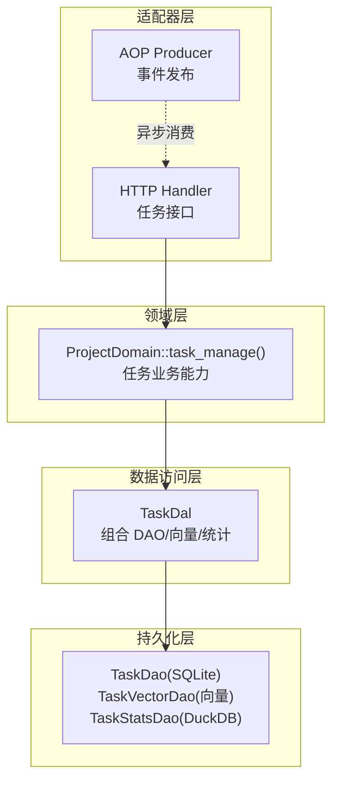
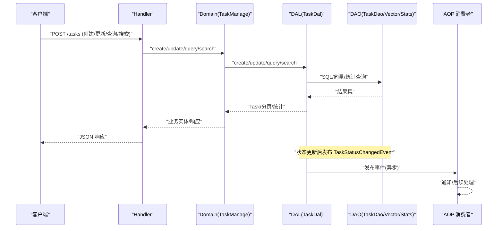
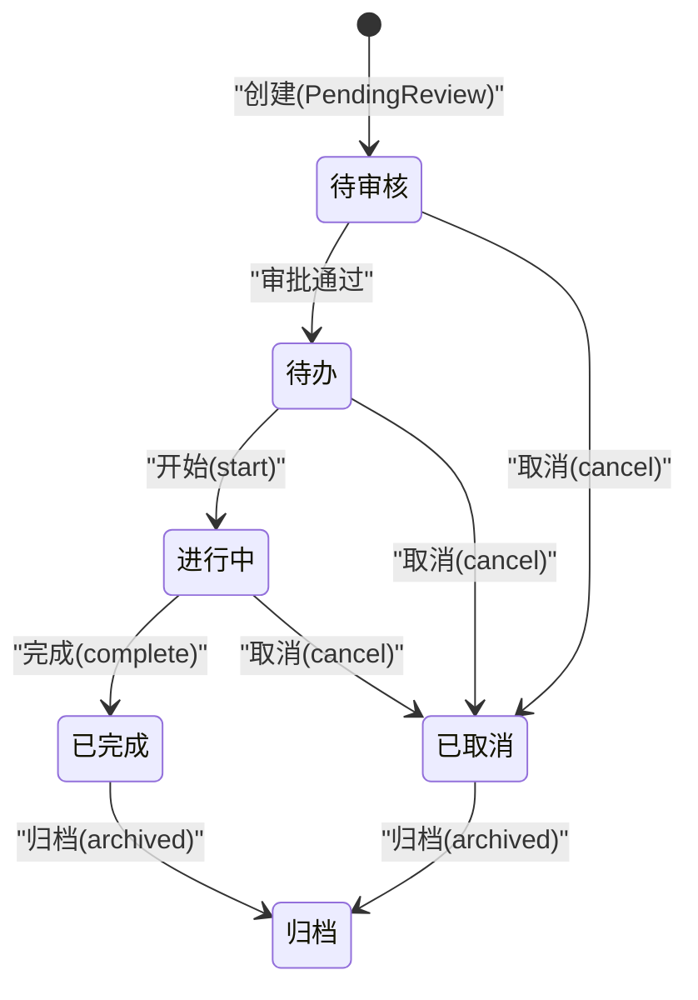
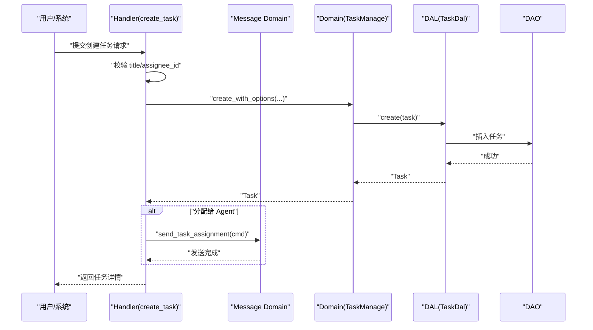
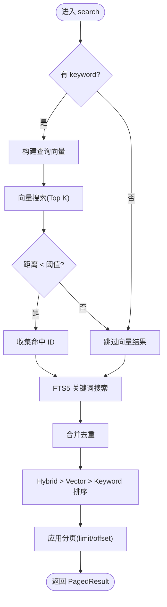
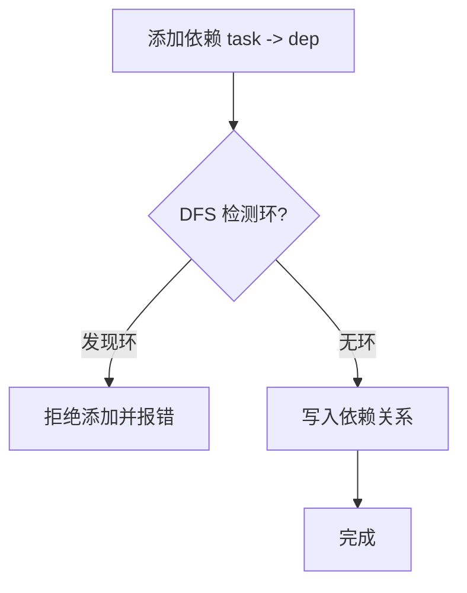
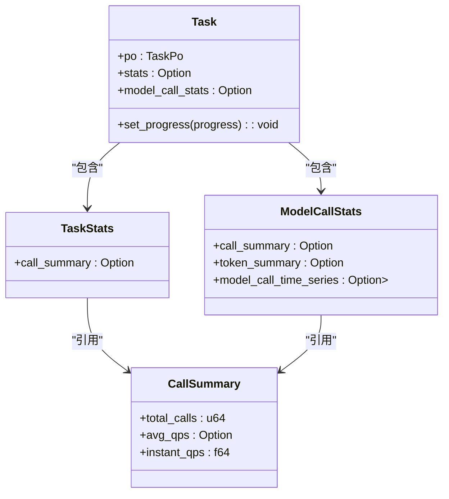
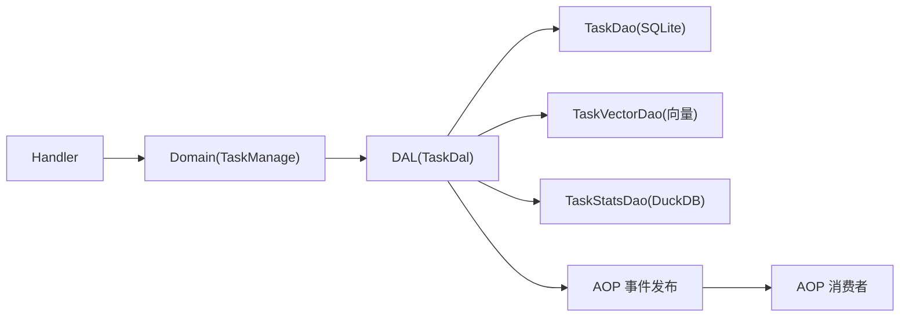

# 任务管理（业务功能层）

<cite>
**本文引用的文件**
- [src/models/task.rs](src/models/task.rs)
- [common/src/enums/task.rs](common/src/enums/task.rs)
- [src/service/domain/project/mod.rs](src/service/domain/project/mod.rs)
- [src/service/dal/task.rs](src/service/dal/task.rs)
- [src/service/dao/task/mod.rs](src/service/dao/task/mod.rs)
- [src/handlers/project/task/mod.rs](src/handlers/project/task/mod.rs)
- [src/handlers/project/task/create_task.rs](src/handlers/project/task/create_task.rs)
- [common/src/api/task.rs](common/src/api/task.rs)
- [migrations/20260712000002_task_progress.sql](migrations/20260712000002_task_progress.sql)
- [src/models/events/task_status.rs](src/models/events/task_status.rs)
- [common/src/models/stats.rs](common/src/models/stats.rs)
- [docs/project_management_design.md](docs/project_management_design.md)
- [docs/stats_query_design.md](docs/stats_query_design.md)

**本文关联三类文档（四类互引闭环）**
- 【① Design 决策快照】
  - [task_design.md](docs/archive/design-archive/task_design.md) — 任务实体模型 + 四态状态机 + dependencies 数组 DAG 语义
  - [project_design.md](docs/archive/design-archive/project_design.md) — 项目实体一对多任务关联 + owner_agent_id PMO 角色 + last_followup_at
  - [project_management_design.md](docs/archive/design-archive/project_management_design.md) — 任务状态上报 + 实时通知 + 项目巡检补偿三机制
- 【② Plan 落地快照】
  - [项目任务增强.md](docs/archive/plan-archive/项目任务增强.md) — execution_plan/result JSON schema + progress_summary 算法 + TaskGraph DAG
  - [后台任务管理页面与列表清理接口重构.md](docs/archive/plan-archive/后台任务管理页面与列表清理接口重构.md) — query 接口 + 通用 count + PagedResult 统一
- 【④ RAG 原子知识卡】
  - [任务状态机与项目聚合：TaskStatus 4 态 + progress 0-100 自动联动 + execution_plan_result JSON Patch + TaskGraph 依赖 DAG](docs/wiki/knowledge/zh/任务状态机与项目聚合：TaskStatus%204%20态%20+%20progress%200-100%20自动联动%20+%20execution_plan_result%20JSON%20Patch%20+%20TaskGraph%20依赖%20DAG/任务状态机与项目聚合：TaskStatus%204%20态%20+%20progress%200-100%20自动联动%20+%20execution_plan_result%20JSON%20Patch%20+%20TaskGraph%20依赖%20DAG.md) — 四态流转禁逆向 + dependencies 环检测 + TaskStatus 禁数字比较 6 条红线
- 【③ Wiki 关联长文】
  - [任务生命周期管理.md](docs/wiki/zh/content/项目概述/核心功能特性/任务协作与执行计划/任务生命周期管理.md) — 创建→分配→pending→in_progress→completed→取消软删完整路径
  - [执行计划与结果追踪.md](docs/wiki/zh/content/项目概述/核心功能特性/任务协作与执行计划/执行计划与结果追踪.md) — plan/steps 风险字段 result/completed_steps 条目规范
  - [项目管理.md](docs/wiki/zh/content/功能模块/项目管理/项目管理.md) — 项目详情 5 Tab + 进度百分比聚合
</cite>

## 目录
1. [简介](#简介)
2. [项目结构](#项目结构)
3. [核心组件](#核心组件)
4. [架构总览](#架构总览)
5. [详细组件分析](#详细组件分析)
6. [依赖关系分析](#依赖关系分析)
7. [性能与扩展性](#性能与扩展性)
8. [故障排查指南](#故障排查指南)
9. [结论](#结论)
10. [附录：API 与数据模型速查](#附录api-与数据模型速查)

## 简介
本文件面向"任务管理"能力，围绕任务的创建、分配、跟踪、完成与清理进行系统化说明。内容覆盖任务实体模型、状态机设计、优先级与截止日期管理、依赖关系（DAG）处理、进度跟踪、统计与绩效分析、搜索过滤分页、以及与项目、Agent、工具、技能的关联和执行上下文。同时给出关键流程图与时序图，帮助读者快速理解端到端工作流。

> 📌 视角说明（AGENTS §2.1.3 Level 3 互补视角平行卡）：
> 本长文是「任务管理」主题的 **业务功能层** 视角。同主题还有以下平行视角卡，请按需交叉阅读：
> - [任务管理（代码落地层）](docs/wiki/zh/content/核心模块/处理器层/A2A协议处理器/任务管理.md)

## 项目结构
任务管理在四层单向调用架构中实现：Adapter（HTTP Handler / AOP Producer）→ Domain → DAL → DAO。任务相关代码主要分布在以下位置：
- 模型层：TaskPo（持久化对象）、Task（业务实体）
- 枚举与公共 API：TaskStatus、AssigneeType、查询/搜索请求体
- Domain：ProjectDomain::task_manage() 暴露任务管理能力
- DAL：TaskDal 封装 TaskDao、向量索引、统计查询
- DAO：TaskDao（SQLite）、TaskVectorDao（向量）、TaskStatsDao（DuckDB）
- Handler：任务创建、查询、更新、搜索等 HTTP 接口

图表来源
- [src/handlers/project/task/mod.rs:1-28](src/handlers/project/task/mod.rs#L1-L28)
- [src/service/domain/project/mod.rs:228-359](src/service/domain/project/mod.rs#L228-L359)
- [src/service/dal/task.rs:89-207](src/service/dal/task.rs#L89-L207)
- [src/service/dao/task/mod.rs:40-139](src/service/dao/task/mod.rs#L40-L139)

章节来源
- [src/handlers/project/task/mod.rs:1-28](src/handlers/project/task/mod.rs#L1-L28)
- [src/service/domain/project/mod.rs:228-359](src/service/domain/project/mod.rs#L228-L359)
- [src/service/dal/task.rs:89-207](src/service/dal/task.rs#L89-L207)
- [src/service/dao/task/mod.rs:40-139](src/service/dao/task/mod.rs#L40-L139)

## 核心组件
- 任务实体模型
  - TaskPo：持久化对象，包含标题、描述、状态、优先级、标签、截止时间、开始/结束时间、依赖列表、根用户、分配对象、项目、思考深度、进度、执行计划/结果等字段。
  - Task：业务实体，聚合 TaskPo 及可选的搜索匹配信息、统计数据、模型调用统计、产物列表。
- 状态与分配类型
  - TaskStatus：已取消、待审核、待办、进行中、已完成、归档。
  - AssigneeType：User、Agent。
- 查询与搜索
  - TaskQuery：通用条件过滤（ID、关键词、项目、负责人、状态、分页）。
  - TaskSearch：统一搜索入参（keyword + query_vector + top_k + filters），DAL 层自动选择 FTS5/向量/混合策略。
- 统计与指标
  - TaskStats：任务自身维度统计（如事件次数汇总）。
  - ModelCallStats：模型调用统计（调用次数、Token、时序趋势）。
  - StatsFetchOptions：按需加载 call_summary/token_summary/time_series。
- 事件与通知
  - TaskStatusChangedEvent：任务状态变更事件，由 DAL 层在状态更新成功后发布，供 AOP 消费者异步处理（例如通知 Owner Agent）。

章节来源
- [src/models/task.rs:16-81](src/models/task.rs#L16-L81)
- [common/src/enums/task.rs:8-72](common/src/enums/task.rs#L8-L72)
- [src/service/dao/task/mod.rs:13-38](src/service/dao/task/mod.rs#L13-L38)
- [common/src/models/stats.rs:108-149](common/src/models/stats.rs#L108-L149)
- [src/models/events/task_status.rs:5-23](src/models/events/task_status.rs#L5-L23)

## 架构总览
任务管理的端到端流程遵循严格分层：Handler 接收请求并校验参数，委托 Domain 执行业务规则；Domain 通过 DAL 组合 DAO 完成数据读写与统计；DAL 负责向量化与统计查询；DAO 对接 SQLite/DuckDB/向量存储。状态变更通过 AOP 发布事件，消费者异步处理通知或后续动作。

图表来源
- [src/handlers/project/task/create_task.rs:21-85](src/handlers/project/task/create_task.rs#L21-L85)
- [src/service/domain/project/mod.rs:232-359](src/service/domain/project/mod.rs#L232-L359)
- [src/service/dal/task.rs:223-255](src/service/dal/task.rs#L223-L255)
- [src/service/dal/task.rs:607-643](src/service/dal/task.rs#L607-L643)
- [src/models/events/task_status.rs:5-23](src/models/events/task_status.rs#L5-L23)

## 详细组件分析

### 任务实体与状态机
- 实体模型
  - TaskPo 承载所有持久化字段，支持 JSON 序列化的 tags 与 dependencies。
  - Task 提供业务方法：start/complete/cancel、进度设置、思考深度管理、Prompt 摘要生成等。
- 状态机
  - 状态包括：已取消、待审核、待办、进行中、已完成、归档。
  - 状态流转通过 Domain 的 transition_status/start/complete/cancel 等方法驱动，DAL 层在 update_status 成功后发布状态变更事件。
- 进度与时间
  - progress 为 0-100 整数，用于任务进度跟踪。
  - due_at/start_at/end_at 用于截止与生命周期时间戳。

图表来源
- [common/src/enums/task.rs:8-27](common/src/enums/task.rs#L8-L27)
- [src/models/task.rs:172-188](src/models/task.rs#L172-L188)
- [src/service/dal/task.rs:607-643](src/service/dal/task.rs#L607-L643)

章节来源
- [src/models/task.rs:16-81](src/models/task.rs#L16-L81)
- [src/models/task.rs:172-214](src/models/task.rs#L172-L214)
- [common/src/enums/task.rs:8-27](common/src/enums/task.rs#L8-L27)
- [migrations/20260712000002_task_progress.sql:1-4](migrations/20260712000002_task_progress.sql#L1-L4)

### 任务创建、分配与通知
- 创建任务
  - Handler 校验必填字段（title、assignee_id），构造 RequestContext，调用 Domain::create_with_options。
  - Domain 写入任务并返回 Task。
- 分配与通知
  - 若 assignee_type 为 Agent，Handler 通过 Message Domain 发送任务分配消息给目标 Agent。
- 上下文注入
  - RequestContext 携带 project_id、task_id 等信息，便于后续统计与追踪。

图表来源
- [src/handlers/project/task/create_task.rs:21-85](src/handlers/project/task/create_task.rs#L21-L85)
- [src/service/domain/project/mod.rs:232-265](src/service/domain/project/mod.rs#L232-L265)
- [src/service/dal/task.rs:223-255](src/service/dal/task.rs#L223-L255)

章节来源
- [src/handlers/project/task/create_task.rs:21-85](src/handlers/project/task/create_task.rs#L21-L85)
- [src/service/domain/project/mod.rs:232-265](src/service/domain/project/mod.rs#L232-L265)

### 任务搜索、过滤、排序与分页
- 查询与搜索
  - TaskQuery：支持 ids、project_id、assignee_type、assignee_id、status_in、分页。
  - TaskSearch：统一搜索入参，DAL 层根据 keyword/query_vector 自动选择 FTS5/向量/混合搜索。
- 混合搜索策略
  - 仅 keyword：FTS5 全文检索（BM25）。
  - 仅 query_vector：向量语义搜索（距离阈值过滤）。
  - 两者都有：合并结果，按 Hybrid > Vector > Keyword 优先级排序，组内按距离/相关性排序。
- 分页
  - 统一使用 PaginationParams（limit、offset），返回 PagedResult。

图表来源
- [src/service/dal/task.rs:366-571](src/service/dal/task.rs#L366-L571)
- [src/service/dao/task/mod.rs:27-38](src/service/dao/task/mod.rs#L27-L38)
- [common/src/api/task.rs:254-298](common/src/api/task.rs#L254-L298)

章节来源
- [src/service/dal/task.rs:366-571](src/service/dal/task.rs#L366-L571)
- [src/service/dao/task/mod.rs:27-38](src/service/dao/task/mod.rs#L27-L38)
- [common/src/api/task.rs:254-298](common/src/api/task.rs#L254-L298)

### 任务依赖与 DAG 管理
- 依赖关系
  - TaskPo.dependencies 以 JSON 数组字符串存储前置任务 ID 列表。
  - 支持多对多依赖（一个任务依赖多个，多个任务依赖同一个）。
- 环形检测
  - 添加依赖前进行 DFS 环形依赖检测，禁止自依赖与环状依赖。
- 级联操作
  - 项目归档时级联归档下属任务与产物。

图表来源
- [docs/project_management_design.md:258-290](docs/project_management_design.md#L258-L290)
- [docs/project_management_design.md:291-308](docs/project_management_design.md#L291-L308)
- [src/models/task.rs:37-38](src/models/task.rs#L37-L38)

章节来源
- [docs/project_management_design.md:258-308](docs/project_management_design.md#L258-L308)
- [src/models/task.rs:37-38](src/models/task.rs#L37-L38)

### 进度跟踪、工时统计与绩效分析
- 进度跟踪
  - Task.progress 表示 0-100 的任务完成百分比，可通过 Domain::update_progress 更新。
- 统计维度
  - TaskStats：任务自身维度的事件次数汇总（call_summary）。
  - ModelCallStats：模型调用统计（调用次数、Token、时序趋势），由 DAL 层组合 ModelProviderStatsDao 获取。
- 选项控制
  - StatsFetchOptions 控制是否加载 call_summary/token_summary/time_series，避免不必要查询。
- 事件记录
  - 任务生命周期事件（created/started/completed/cancelled/status_changed）记录于 task_events，用于统计与审计。

图表来源
- [src/models/task.rs:65-81](src/models/task.rs#L65-L81)
- [common/src/models/stats.rs:108-149](common/src/models/stats.rs#L108-L149)
- [src/service/dal/task.rs:692-721](src/service/dal/task.rs#L692-L721)

章节来源
- [common/src/models/stats.rs:108-149](common/src/models/stats.rs#L108-L149)
- [src/service/dal/task.rs:692-721](src/service/dal/task.rs#L692-L721)
- [docs/stats_query_design.md:511-623](docs/stats_query_design.md#L511-L623)

### 任务与项目、Agent、工具、技能的关联与执行上下文
- 项目关联
  - Task.project_id 标识所属项目；Domain 提供 list_by_project 等能力。
- Agent 关联
  - Task.assignee_type/assignee_id 可指向 Agent；Handler 在分配给 Agent 时发送通知。
- 工具与技能
  - 工具调用事件（ToolCallEvent）内置 project_id/task_id，支持按任务维度统计工具调用。
  - 技能（Skill）与 Agent 关联，间接影响任务执行能力；任务执行上下文通过 RequestContext 传递。
- 执行上下文
  - RequestContext 携带 organization_id、user_id、project_id、task_id 等，贯穿各层。

章节来源
- [src/service/domain/project/mod.rs:278-283](src/service/domain/project/mod.rs#L278-L283)
- [src/handlers/project/task/create_task.rs:65-82](src/handlers/project/task/create_task.rs#L65-L82)
- [docs/stats_query_design.md:566-568](docs/stats_query_design.md#L566-L568)

### 自动化规则、通知机制与工作流配置
- 自动化规则
  - 任务状态变更触发 AOP 事件，消费者可订阅并执行自动化逻辑（如通知 Owner Agent）。
- 通知机制
  - 任务分配给 Agent 时，通过 Message Domain 发送任务分配消息。
- 工作流配置
  - 当前仓库未提供独立的工作流配置模块；任务状态流转由 Domain 方法驱动，可扩展为基于配置的规则引擎。

章节来源
- [src/models/events/task_status.rs:5-23](src/models/events/task_status.rs#L5-L23)
- [src/handlers/project/task/create_task.rs:65-82](src/handlers/project/task/create_task.rs#L65-L82)

### 任务模板、批量操作与数据迁移
- 任务模板
  - 当前仓库未提供独立的“任务模板”实体；可通过重复创建任务并复用标题/描述/标签等字段模拟。
- 批量操作
  - 支持按 IDs 批量查询（TaskQuery.ids）；批量创建/更新需在上层组装多次调用。
- 数据迁移
  - 进度字段通过迁移脚本添加至 tasks 表。

章节来源
- [src/service/dao/task/mod.rs:13-25](src/service/dao/task/mod.rs#L13-L25)
- [migrations/20260712000002_task_progress.sql:1-4](migrations/20260712000002_task_progress.sql#L1-L4)

## 依赖关系分析
任务管理涉及的模块依赖如下：
- Handler 依赖 Domain（任务管理能力）
- Domain 依赖 DAL（数据访问抽象）
- DAL 组合 DAO（SQLite/向量/统计）
- AOP Producer/Consumer 解耦状态变更通知

图表来源
- [src/handlers/project/task/mod.rs:1-28](src/handlers/project/task/mod.rs#L1-L28)
- [src/service/domain/project/mod.rs:228-359](src/service/domain/project/mod.rs#L228-L359)
- [src/service/dal/task.rs:89-207](src/service/dal/task.rs#L89-L207)
- [src/service/dao/task/mod.rs:40-139](src/service/dao/task/mod.rs#L40-L139)

章节来源
- [src/handlers/project/task/mod.rs:1-28](src/handlers/project/task/mod.rs#L1-L28)
- [src/service/domain/project/mod.rs:228-359](src/service/domain/project/mod.rs#L228-L359)
- [src/service/dal/task.rs:89-207](src/service/dal/task.rs#L89-L207)
- [src/service/dao/task/mod.rs:40-139](src/service/dao/task/mod.rs#L40-L139)

## 性能与扩展性
- 搜索性能
  - FTS5 全文检索与向量语义搜索结合，默认 Top K 与距离阈值控制结果规模。
  - 混合搜索优先 Hybrid，其次 Vector，最后 Keyword，提升相关性。
- 统计性能
  - 使用 DuckDB 进行聚合与时序查询，StatsFetchOptions 按需加载减少开销。
- 向量化降级
  - 向量化失败不影响主流程，记录警告日志并降级到关键词搜索。
- 扩展点
  - 可在 Domain 层增加工作流配置与自动化规则；在 DAL 层扩展更多统计维度。

[本节为通用指导，不直接分析具体文件]

## 故障排查指南
- 任务状态变更未触发通知
  - 检查 DAL 层 update_status 是否在 SQL 成功后发布 TaskStatusChangedEvent。
  - 确认 AOP 消费者是否正确订阅并处理该事件。
- 搜索结果为空或相关性低
  - 检查 keyword 与 query_vector 是否有效；确认向量索引是否存在且 model_provider_id 一致。
  - 调整距离阈值与 Top K 参数。
- 统计缺失
  - 确认任务生命周期事件（created/started/completed/cancelled/status_changed）是否记录。
  - 检查 StatsFetchOptions 是否启用相应维度。

章节来源
- [src/service/dal/task.rs:607-643](src/service/dal/task.rs#L607-L643)
- [src/models/events/task_status.rs:5-23](src/models/events/task_status.rs#L5-L23)
- [src/service/dal/task.rs:366-571](src/service/dal/task.rs#L366-L571)
- [docs/stats_query_design.md:511-623](docs/stats_query_design.md#L511-L623)

## 结论
任务管理在本项目中实现了完整的 CRUD、状态机、依赖 DAG、进度跟踪、统计分析与混合搜索能力。通过严格的分层架构与 AOP 事件机制，确保了高内聚、低耦合与可扩展性。未来可在 Domain 层引入工作流配置与自动化规则，进一步增强任务编排与智能调度能力。

[本节为总结，不直接分析具体文件]

## 附录：API 与数据模型速查
- 任务查询请求
  - TaskQueryRequest：支持 ids、keyword、project_id、assignee_type、assignee_id、status_in、分页。
- 任务搜索请求
  - SearchTasksRequest：支持 keyword、ids、project_id、assignee_type、assignee_id、status_in、分页。
- 任务进度更新
  - UpdateTaskProgressRequest：id、progress（0-100）。
- 任务实体关键字段
  - TaskPo：id、title、description、status、priority、tags、due_at、start_at、end_at、dependencies、root_user_id、assignee_type、assignee_id、project_id、thinking_depth、progress、created_by、modified_by、created_at、updated_at、execution_plan、execution_result。

章节来源
- [common/src/api/task.rs:231-298](common/src/api/task.rs#L231-L298)
- [src/models/task.rs:16-63](src/models/task.rs#L16-L63)