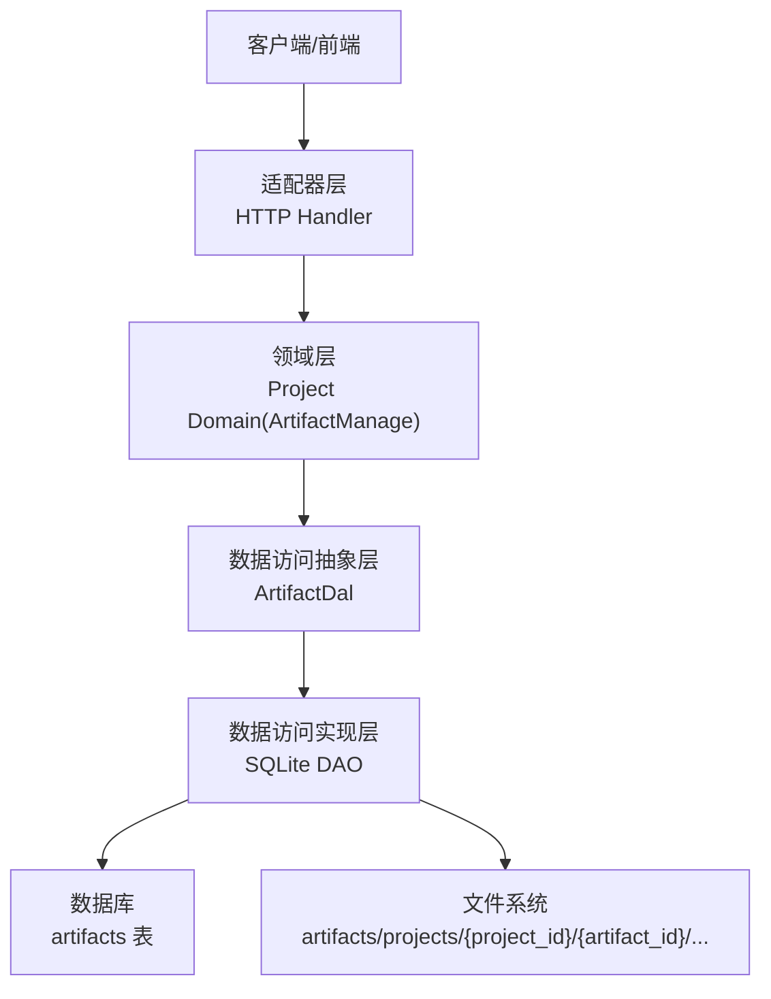
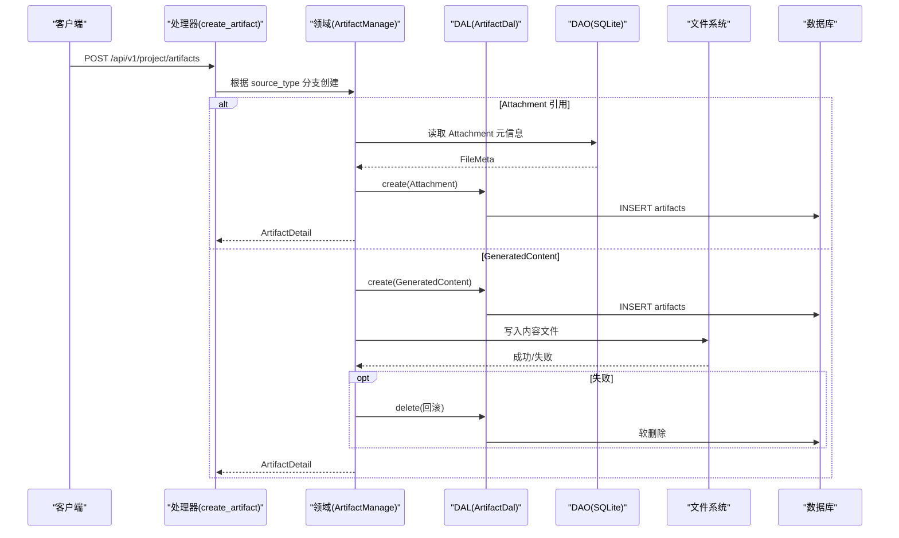
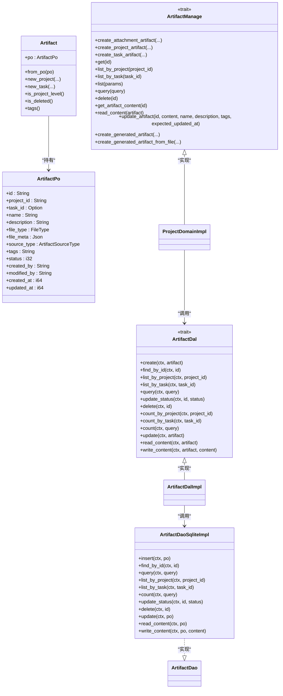
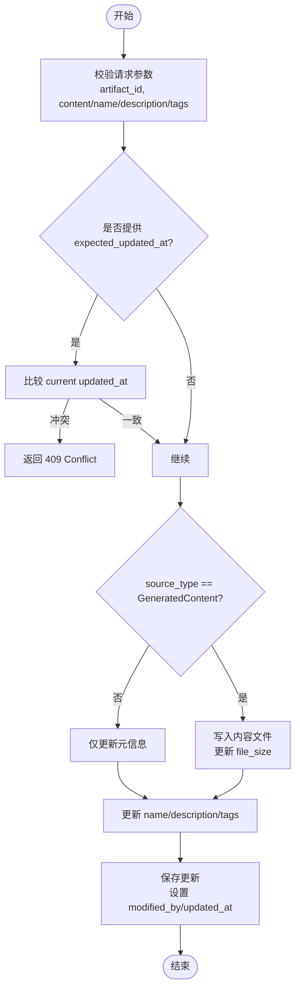

# 工件管理

<cite>
**本文引用的文件**
- [artifact.rs](src/models/artifact.rs)
- [artifact.rs（枚举）](common/src/enums/artifact.rs)
- [artifact.rs（API DTO）](common/src/api/artifact.rs)
- [artifact.rs（领域层）](src/service/domain/project/artifact.rs)
- [artifact.rs（DAL）](src/service/dal/artifact.rs)
- [sqlite.rs（DAO 实现）](src/service/dao/artifact/sqlite.rs)
- [mod.rs（处理器模块）](src/handlers/project/artifact/mod.rs)
- [create_artifact.rs](src/handlers/project/artifact/create_artifact.rs)
- [update_artifact.rs](src/handlers/project/artifact/update_artifact.rs)
- （2026-09-04 清理：superpowers 目录已归档，待 doc-maintainer 跟进）
- [project_management_design.md](docs/project_management_design.md)
</cite>

## 目录
1. [简介](#简介)
2. [项目结构](#项目结构)
3. [核心组件](#核心组件)
4. [架构总览](#架构总览)
5. [详细组件分析](#详细组件分析)
6. [依赖关系分析](#依赖关系分析)
7. [性能考虑](#性能考虑)
8. [故障排查指南](#故障排查指南)
9. [结论](#结论)
10. [附录](#附录)

## 简介
本文件系统性说明“工件（Artifact）”管理能力，覆盖创建、存储、检索、更新与删除；工件类型系统（文本、代码、文档、二进制）、元数据与标签管理、版本控制策略；文件上传下载、内容预览与在线编辑；分类、搜索索引与全文检索；权限控制、访问审计与安全策略；与项目、任务、Agent 的关联与数据同步；存储后端、备份恢复与迁移策略；模板、批量操作与 API 集成示例。

## 项目结构
工件能力贯穿四层单向调用：Adapter（HTTP Handler / AOP Producer）→ Domain → DAL → DAO，禁止跨层调用与同层互调。Domain 输入为 Command/Query，输出业务实体；DAL 对外统一使用业务实体；PO 仅在 DAO/DAL 内部使用。

图示来源
- [mod.rs（处理器模块）:1-24](src/handlers/project/artifact/mod.rs#L1-L24)
- [artifact.rs（领域层）:26-211](src/service/domain/project/artifact.rs#L26-L211)
- [artifact.rs（DAL）:37-91](src/service/dal/artifact.rs#L37-L91)
- [sqlite.rs（DAO 实现）:62-335](src/service/dao/artifact/sqlite.rs#L62-L335)

章节来源
- [mod.rs（处理器模块）:1-24](src/handlers/project/artifact/mod.rs#L1-L24)
- [artifact.rs（领域层）:26-211](src/service/domain/project/artifact.rs#L26-L211)
- [artifact.rs（DAL）:37-91](src/service/dal/artifact.rs#L37-L91)
- [sqlite.rs（DAO 实现）:62-335](src/service/dao/artifact/sqlite.rs#L62-L335)

## 核心组件
- 模型与枚举
  - ArtifactPo/Artifact：持久化对象与业务实体，包含项目/任务归属、名称、描述、文件类型、文件元信息、来源类型、标签、状态、创建/修改人与时间戳等。
  - ArtifactSourceType：来源类型枚举（附件引用、生成内容、远程 URL 预留）。
- 领域层（Domain）
  - ArtifactManage 接口及 ProjectDomainImpl 实现：负责创建、查询、更新、删除、权限校验、乐观锁、内容读写协调。
- 数据访问层（DAL/DAO）
  - ArtifactDal：统一查询与内容读写抽象。
  - SQLite DAO：SQL 构建、分页、过滤、软删除、内容读取/写入到文件系统。
- 适配器层（Handler）
  - create_artifact、update_artifact、get_artifact、list_artifacts、query_artifacts、get_artifact_content 等 HTTP 处理器，暴露 RESTful 接口并注册为 Agent 工具。

章节来源
- [artifact.rs（模型）:17-338](src/models/artifact.rs#L17-L338)
- [artifact.rs（枚举）:8-62](common/src/enums/artifact.rs#L8-L62)
- [artifact.rs（领域层）:26-532](src/service/domain/project/artifact.rs#L26-L532)
- [artifact.rs（DAL）:37-196](src/service/dal/artifact.rs#L37-L196)
- [sqlite.rs（DAO 实现）:62-361](src/service/dao/artifact/sqlite.rs#L62-L361)
- [artifact.rs（API DTO）:9-269](common/src/api/artifact.rs#L9-L269)

## 架构总览
工件管理遵循严格的分层与职责分离：
- Handler 仅做参数校验、路由分发与响应转换，不承载业务规则。
- Domain 集中处理权限校验、事务性流程编排（如先建记录再写内容，失败回滚）、乐观锁、来源类型约束。
- DAL 封装 DAO 并提供面向领域的查询与内容读写接口。
- DAO 专注 SQL 与文件系统 I/O，保证路径安全与最小权限。

图示来源
- [create_artifact.rs:13-53](src/handlers/project/artifact/create_artifact.rs#L13-L53)
- [create_artifact.rs:55-146](src/handlers/project/artifact/create_artifact.rs#L55-L146)
- [artifact.rs（领域层）:342-399](src/service/domain/project/artifact.rs#L342-L399)
- [artifact.rs（DAL）:101-105](src/service/dal/artifact.rs#L101-L105)
- [sqlite.rs（DAO 实现）:64-105](src/service/dao/artifact/sqlite.rs#L64-L105)

## 详细组件分析

### 工件类型系统与来源
- 来源类型
  - attachment：引用 Finance Attachment，只复制元信息，不搬运文件。
  - generated_content：Agent/运行时生成的文本类产物，写入 artifact 专属目录。
  - remote_url：预留扩展，当前不接受。
- 文件类型
  - FileType 用于分类展示与筛选（文档、图片、音频、视频、二进制），不影响存储格式。

章节来源
- [artifact.rs（枚举）:8-62](common/src/enums/artifact.rs#L8-L62)
- [project_management_design.md:90-98](docs/project_management_design.md#L90-L98)
- [create_artifact.rs:37-53](src/handlers/project/artifact/create_artifact.rs#L37-L53)

### 元数据与标签管理
- 元数据字段：name、description、file_type、file_meta（path/mime/size）、source_type、status、created_by、modified_by、created_at、updated_at。
- 标签：以 JSON 数组存储，提供 set_tags/tags 方法，支持按 tag 过滤（参考记忆/知识图谱的 tags 过滤范式）。
- 变更追踪：每次修改更新 modified_by 与 updated_at。

章节来源
- [artifact.rs（模型）:17-48](src/models/artifact.rs#L17-L48)
- [artifact.rs（模型）:304-314](src/models/artifact.rs#L304-L314)
- [sqlite.rs（DAO 实现）:246-286](src/service/dao/artifact/sqlite.rs#L246-L286)

### 版本控制
- 当前版本：无独立 version 字段，采用“覆盖式更新”，通过 name/description/tags 表达版本语义（如 v1、draft）。
- 乐观锁：更新时支持 expected_updated_at，冲突返回 409。

章节来源
- [project_management_design.md:310-314](docs/project_management_design.md#L310-L314)
- [artifact.rs（领域层）:273-340](src/service/domain/project/artifact.rs#L273-L340)
- （2026-09-04 清理：superpowers 目录已归档，待 doc-maintainer 跟进）

### 文件上传、下载、预览与在线编辑
- 上传
  - Attachment 模式：先上传至 Finance Attachment，再通过 Artifact 创建引用型工件。
  - GeneratedContent 模式：直接提交文本内容，由 Domain 写入 artifact 专属目录。
- 下载/预览
  - GET /api/v1/project/artifacts/{id}/content：仅对 GeneratedContent 开放，返回 UTF-8 文本内容。
- 在线编辑
  - PUT /api/v1/project/artifacts/{id}：部分更新 content/name/description/tags；content 仅适用于 GeneratedContent；支持乐观锁。

章节来源
- [create_artifact.rs:55-146](src/handlers/project/artifact/create_artifact.rs#L55-L146)
- [update_artifact.rs:1-54](src/handlers/project/artifact/update_artifact.rs#L1-L54)
- [artifact.rs（领域层）:224-271](src/service/domain/project/artifact.rs#L224-L271)
- [sqlite.rs（DAO 实现）:288-334](src/service/dao/artifact/sqlite.rs#L288-L334)

### 分类、标签、搜索索引与全文检索
- 分类与过滤：支持按 project_id、task_id、file_type、source_type 过滤与分页。
- 标签过滤：可结合 json_each(tags) 实现 OR 语义过滤（参考记忆/知识图谱方案）。
- 全文检索：系统级 FTS5 + trigram 分词器可用于消息/实体等；工件本身未内置 FTS，可通过标签与关键字组合查询。

章节来源
- [sqlite.rs（DAO 实现）:123-159](src/service/dao/artifact/sqlite.rs#L123-L159)
- [sqlite.rs（DAO 实现）:337-361](src/service/dao/artifact/sqlite.rs#L337-L361)
- [project_management_design.md:310-383](docs/project_management_design.md#L310-L383)

### 权限控制、访问审计与安全策略
- 权限边界：所有工件操作需通过项目归属校验，确保当前用户为项目 root_user。
- 任务级工件：若传入 task_id，需校验该任务属于同一项目。
- 审计字段：created_by、modified_by、created_at、updated_at 完整记录。
- 安全策略：
  - 路径安全：解析生成内容路径时进行穿越检测，限制在 artifacts_dir 下。
  - 大小限制：文本内容最大 1MB。
  - 来源限制：非 GeneratedContent 不允许直接读写内容。

章节来源
- [artifact.rs（领域层）:489-531](src/service/domain/project/artifact.rs#L489-L531)
- [sqlite.rs（DAO 实现）:41-59](src/service/dao/artifact/sqlite.rs#L41-L59)
- [create_artifact.rs:118-122](src/handlers/project/artifact/create_artifact.rs#L118-L122)
- [update_artifact.rs:27-36](src/handlers/project/artifact/update_artifact.rs#L27-L36)

### 与项目、任务、Agent 的关联与数据同步
- 项目/任务关联：
  - project_id 必填，task_id 可选；任务级工件必须属于同一项目。
  - 列表/查询支持按 project/task 维度过滤。
- Agent 关联：
  - 通过工具 create_text_artifact、register_artifact_from_path 将 Agent 生成的文本或已有文件注册为工件。
  - fs_write 路径隔离至 agents/{agent_id}/，避免越权访问。

章节来源
- [artifact.rs（领域层）:167-211](src/service/domain/project/artifact.rs#L167-L211)
- （2026-09-04 清理：superpowers 目录已归档，待 doc-maintainer 跟进）
- （2026-09-04 清理：superpowers 目录已归档，待 doc-maintainer 跟进）

### 存储后端、备份恢复与迁移策略
- 存储后端：
  - 元数据：SQLite artifacts 表。
  - 内容：文件系统 artifacts/projects/{project_id}/{artifact_id}/{file_name}。
- 备份恢复：
  - 建议定期备份 SQLite 数据库与 artifacts 目录；恢复时保持目录结构与权限一致。
- 迁移策略：
  - 新增字段/表通过 migrations 管理；向后兼容设计（如 source_type 预留 RemoteUrl）。

章节来源
- [sqlite.rs（DAO 实现）:41-59](src/service/dao/artifact/sqlite.rs#L41-L59)
- [project_management_design.md:325-328](docs/project_management_design.md#L325-L328)

### 工件模板、批量操作与 API 集成示例
- 模板：
  - 可通过 CreateTextArtifactParams/RegisterArtifactFromPathParams 定义常用模板（默认 mime_type、file_type、tags）。
- 批量操作：
  - 当前未提供专用批量接口；可通过循环调用 list/query + update/delete 实现。
- API 示例（REST）：
  - 创建工件（Attachment/GeneratedContent）：POST /api/v1/project/artifacts
  - 获取工件详情：GET /api/v1/project/artifacts/{id}
  - 列出工件：GET /api/v1/project/artifacts?project_id=...&task_id=...&file_type=...&source_type=...&limit=...&offset=...
  - 读取内容：GET /api/v1/project/artifacts/{id}/content
  - 更新工件：PUT /api/v1/project/artifacts/{id}
  - 删除工件：DELETE /api/v1/project/artifacts/{id}

章节来源
- [artifact.rs（API DTO）:9-269](common/src/api/artifact.rs#L9-L269)
- [create_artifact.rs:13-53](src/handlers/project/artifact/create_artifact.rs#L13-L53)
- [update_artifact.rs:1-54](src/handlers/project/artifact/update_artifact.rs#L1-L54)

## 依赖关系分析

图示来源
- [artifact.rs（模型）:17-192](src/models/artifact.rs#L17-L192)
- [artifact.rs（领域层）:26-532](src/service/domain/project/artifact.rs#L26-L532)
- [artifact.rs（DAL）:37-196](src/service/dal/artifact.rs#L37-L196)
- [sqlite.rs（DAO 实现）:62-361](src/service/dao/artifact/sqlite.rs#L62-L361)

章节来源
- [artifact.rs（模型）:17-192](src/models/artifact.rs#L17-L192)
- [artifact.rs（领域层）:26-532](src/service/domain/project/artifact.rs#L26-L532)
- [artifact.rs（DAL）:37-196](src/service/dal/artifact.rs#L37-L196)
- [sqlite.rs（DAO 实现）:62-361](src/service/dao/artifact/sqlite.rs#L62-L361)

## 性能考虑
- 查询优化：使用 QueryBuilder 动态拼接 WHERE，避免全表扫描；COUNT 与 LIST 复用过滤逻辑。
- 分页：支持 limit/offset，默认按 created_at DESC 排序。
- 内容 I/O：仅 GeneratedContent 落盘，减少不必要磁盘写入；读取前检查路径存在性。
- 并发更新：通过 optimistic locking（expected_updated_at）降低覆盖风险。

章节来源
- [sqlite.rs（DAO 实现）:123-159](src/service/dao/artifact/sqlite.rs#L123-L159)
- [sqlite.rs（DAO 实现）:288-334](src/service/dao/artifact/sqlite.rs#L288-L334)
- [artifact.rs（领域层）:273-340](src/service/domain/project/artifact.rs#L273-L340)

## 故障排查指南
- 常见错误
  - 权限不足：检查当前用户是否为项目 root_user。
  - 路径穿越：确认目标路径在 artifacts_dir 内。
  - 内容过大：文本内容超过 1MB 将被拒绝。
  - 乐观锁冲突：expected_updated_at 不匹配时返回 409。
  - 来源类型限制：非 GeneratedContent 无法直接读写内容。
- 定位步骤
  - 查看 Handler 入参校验日志。
  - 检查 Domain 权限校验与来源类型分支。
  - 核查 DAO 路径解析与文件系统权限。
  - 验证数据库记录是否存在且未被软删除。

章节来源
- [create_artifact.rs:26-53](src/handlers/project/artifact/create_artifact.rs#L26-L53)
- [update_artifact.rs:27-54](src/handlers/project/artifact/update_artifact.rs#L27-L54)
- [sqlite.rs（DAO 实现）:41-59](src/service/dao/artifact/sqlite.rs#L41-L59)
- [artifact.rs（领域层）:273-340](src/service/domain/project/artifact.rs#L273-L340)

## 结论
工件管理以清晰的四层架构与严格的权限边界，实现了多来源、多类型的工件生命周期管理。通过来源类型区分、元数据与标签体系、乐观锁与路径安全策略，兼顾了易用性与安全性。未来可扩展远程 URL 工件、更丰富的全文检索与批量操作能力。

## 附录

### 关键流程图：更新工件（部分更新）

图示来源
- [artifact.rs（领域层）:273-340](src/service/domain/project/artifact.rs#L273-L340)
- [update_artifact.rs:1-54](src/handlers/project/artifact/update_artifact.rs#L1-L54)