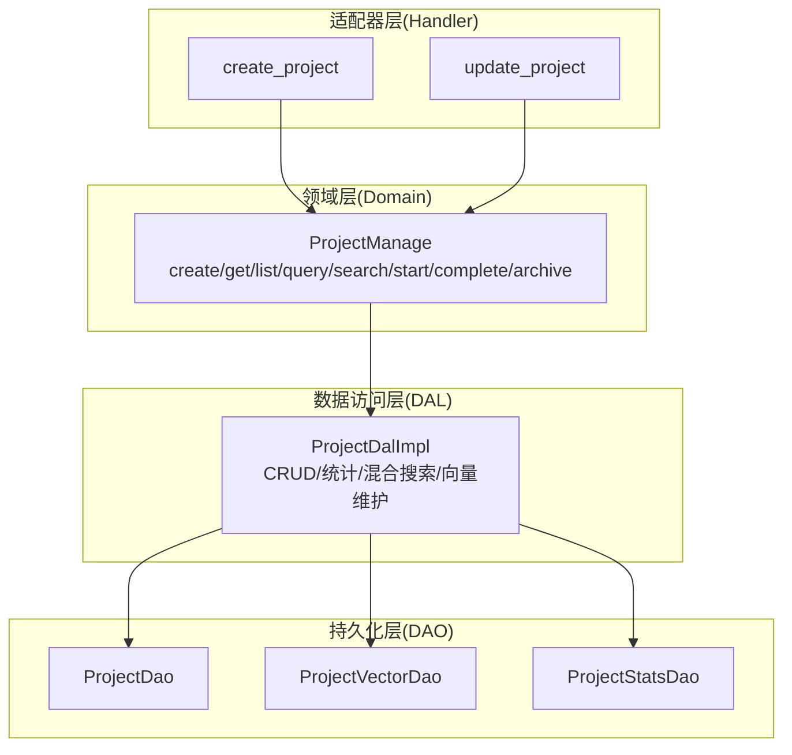
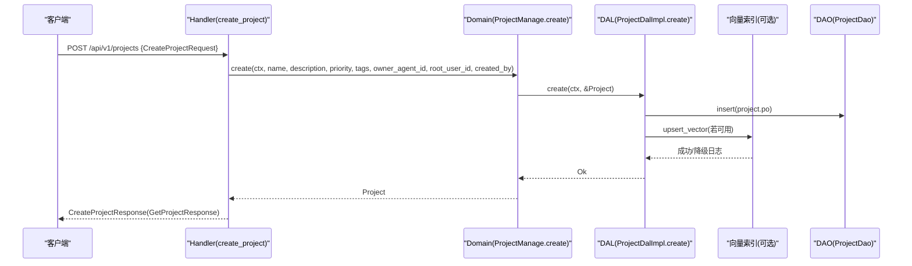
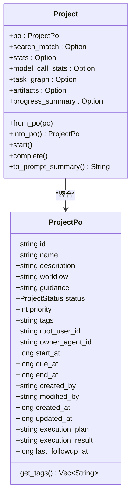
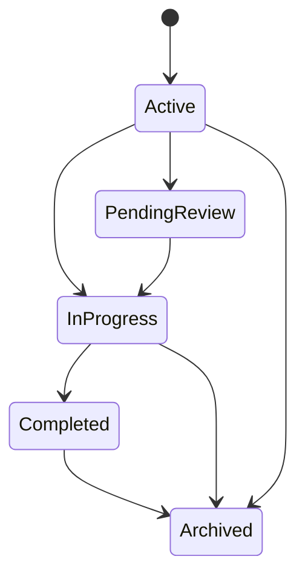
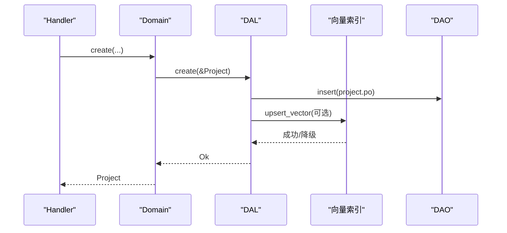
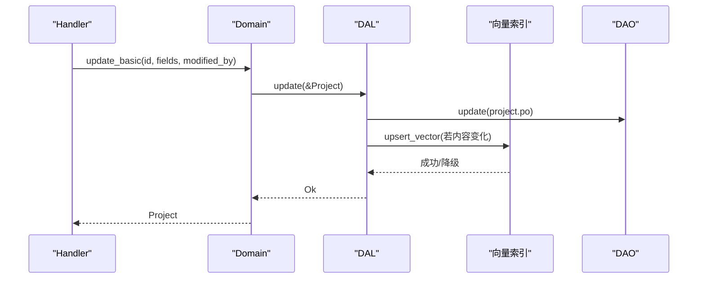
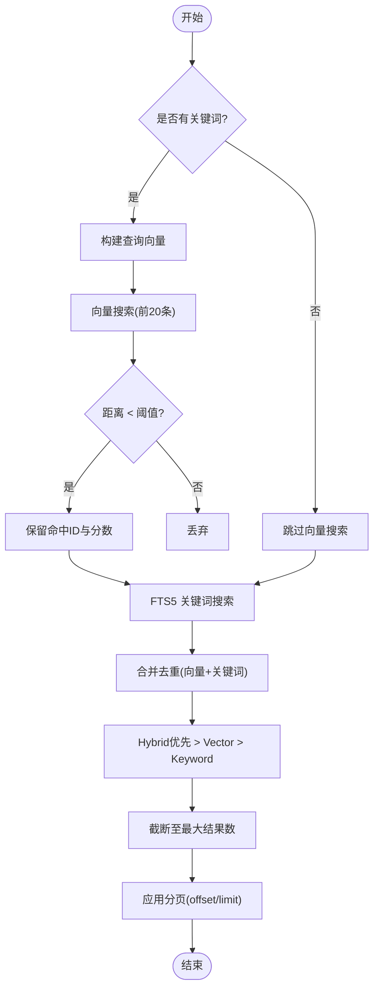
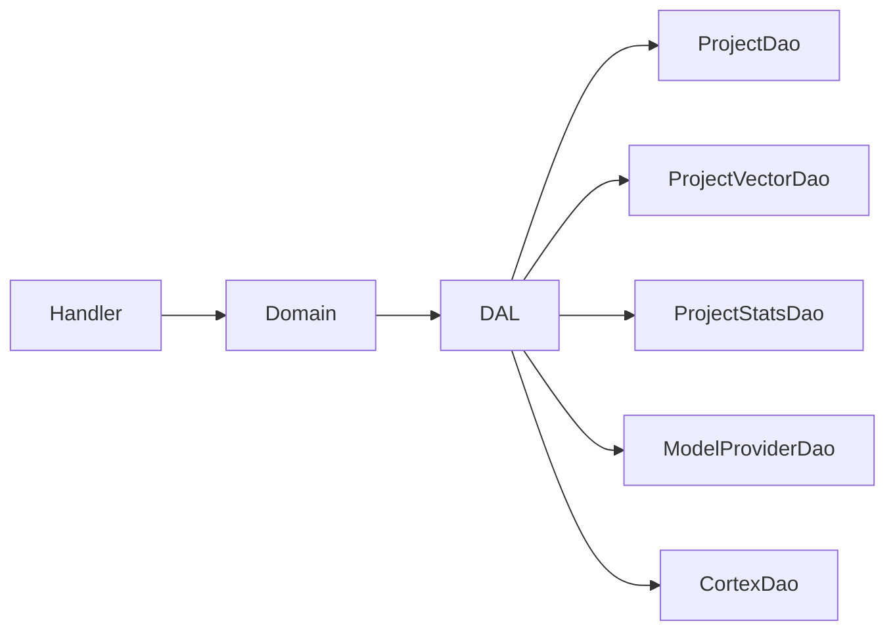

# 项目 CRUD 操作

<cite>
**本文引用的文件**
- [common/src/api/project.rs](common/src/api/project.rs)
- [common/src/enums/project.rs](common/src/enums/project.rs)
- [src/models/project.rs](src/models/project.rs)
- [src/service/dal/project.rs](src/service/dal/project.rs)
- [src/service/domain/project/mod.rs](src/service/domain/project/mod.rs)
- [src/handlers/project/projects/create_project.rs](src/handlers/project/projects/create_project.rs)
- [src/handlers/project/projects/update_project.rs](src/handlers/project/projects/update_project.rs)
</cite>

## 目录
1. [简介](#简介)
2. [项目结构](#项目结构)
3. [核心组件](#核心组件)
4. [架构总览](#架构总览)
5. [详细组件分析](#详细组件分析)
6. [依赖关系分析](#依赖关系分析)
7. [性能考虑](#性能考虑)
8. [故障排查指南](#故障排查指南)
9. [结论](#结论)
10. [附录：API 接口文档](#附录api-接口文档)

## 简介
本文件面向“项目”实体的全量 CRUD、查询与搜索能力，覆盖创建、读取、更新、删除（归档）、状态管理、权限控制、版本/执行计划字段、模板机制、批量操作、数据导入导出、生命周期与状态流转规则、以及与组织/用户/Agent 的关联关系和数据一致性保证。文档严格遵循四层单向调用：Adapter（HTTP Handler / 公开回调 / AOP Producer）→ Domain → DAL → DAO，禁止跨层调用与同层互调；PO 仅在 DAO/DAL 内部使用，Domain 对外统一返回业务实体。

## 项目结构
围绕“项目”的核心代码分布在以下位置：
- API 请求/响应 DTO：common/src/api/project.rs
- 项目状态枚举：common/src/enums/project.rs
- 领域模型与聚合：src/models/project.rs
- 领域服务（Domain）：src/service/domain/project/mod.rs
- 数据访问层（DAL）：src/service/dal/project.rs
- HTTP 处理器（Handler）：src/handlers/project/projects/*.rs

图表来源
- [src/handlers/project/projects/create_project.rs:1-47](src/handlers/project/projects/create_project.rs#L1-L47)
- [src/handlers/project/projects/update_project.rs:1-41](src/handlers/project/projects/update_project.rs#L1-L41)
- [src/service/domain/project/mod.rs:91-226](src/service/domain/project/mod.rs#L91-L226)
- [src/service/dal/project.rs:90-209](src/service/dal/project.rs#L90-L209)

章节来源
- [common/src/api/project.rs:1-255](common/src/api/project.rs#L1-L255)
- [src/service/domain/project/mod.rs:91-226](src/service/domain/project/mod.rs#L91-L226)
- [src/service/dal/project.rs:90-209](src/service/dal/project.rs#L90-L209)

## 核心组件
- 项目实体与 PO
  - ProjectPo：持久化对象，包含项目基础信息、时间戳、执行计划/结果、负责人 Agent ID、标签等。
  - Project：业务实体，聚合 ProjectPo 并携带搜索匹配信息、统计数据、任务图、产物列表、进度汇总等。
- 项目状态
  - ProjectStatus：Deleted/Active/PendingReview/InProgress/Completed/Archived。
- 领域服务
  - ProjectManage：提供 create/get/list/query/search/start/complete/archive/update_basic/transition_status 等能力。
- 数据访问层
  - ProjectDalImpl：封装 DAO，实现 CRUD、统计、混合搜索（FTS5 + 向量）、向量索引自动维护与重建。
- HTTP 处理器
  - create_project/update_project：将请求参数透传到 Domain，完成创建/更新并返回详情。

章节来源
- [src/models/project.rs:15-80](src/models/project.rs#L15-L80)
- [common/src/enums/project.rs:8-27](common/src/enums/project.rs#L8-L27)
- [src/service/domain/project/mod.rs:110-226](src/service/domain/project/mod.rs#L110-L226)
- [src/service/dal/project.rs:213-221](src/service/dal/project.rs#L213-L221)
- [src/handlers/project/projects/create_project.rs:10-46](src/handlers/project/projects/create_project.rs#L10-L46)
- [src/handlers/project/projects/update_project.rs:10-40](src/handlers/project/projects/update_project.rs#L10-L40)

## 架构总览
本项目采用严格的四层单向调用：
- Adapter（Handler）仅负责参数校验、上下文提取与调用 Domain。
- Domain 组合多个 DAL，执行业务规则（如状态流转），不直接访问 DAO。
- DAL 封装 DAO，处理统计、搜索、向量索引维护等横切逻辑。
- DAO 负责具体 SQL 与存储交互。

图表来源
- [src/handlers/project/projects/create_project.rs:22-46](src/handlers/project/projects/create_project.rs#L22-L46)
- [src/service/domain/project/mod.rs:118-129](src/service/domain/project/mod.rs#L118-L129)
- [src/service/dal/project.rs:225-274](src/service/dal/project.rs#L225-L274)

## 详细组件分析

### 项目实体与数据结构
- ProjectPo 关键字段
  - id/name/description/workflow/guidance/status/priority/tags/root_user_id/owner_agent_id
  - start_at/due_at/end_at/created_by/modified_by/created_at/updated_at
  - execution_plan/execution_result/last_followup_at
- Project 扩展字段
  - search_match/stats/model_call_stats/task_graph/artifacts/progress_summary
- 标签序列化
  - tags 以 JSON 字符串持久化，提供 get_tags() 反序列化为 Vec<String>。
- 向量化文本
  - vectorize_text() 拼接 name/description/workflow/guidance 用于向量检索。

图表来源
- [src/models/project.rs:15-80](src/models/project.rs#L15-L80)
- [src/models/project.rs:214-263](src/models/project.rs#L214-L263)
- [src/models/project.rs:282-315](src/models/project.rs#L282-L315)

章节来源
- [src/models/project.rs:15-80](src/models/project.rs#L15-L80)
- [src/models/project.rs:214-263](src/models/project.rs#L214-L263)
- [src/models/project.rs:282-315](src/models/project.rs#L282-L315)

### 项目状态管理与生命周期
- 状态枚举
  - Deleted/Active/PendingReview/InProgress/Completed/Archived
- 生命周期方法
  - start()：设置状态为 InProgress，记录 start_at
  - complete()：设置状态为 Completed，记录 end_at
  - archive()：通过 DAL 更新状态为 Archived，并清理向量索引
- 状态流转
  - 由 Domain 的 transition_status 统一校验与执行，确保合法性。

图表来源
- [common/src/enums/project.rs:8-27](common/src/enums/project.rs#L8-L27)
- [src/models/project.rs:173-183](src/models/project.rs#L173-L183)
- [src/service/dal/project.rs:448-456](src/service/dal/project.rs#L448-L456)
- [src/service/domain/project/mod.rs:219-226](src/service/domain/project/mod.rs#L219-L226)

章节来源
- [common/src/enums/project.rs:8-27](common/src/enums/project.rs#L8-L27)
- [src/models/project.rs:173-183](src/models/project.rs#L173-L183)
- [src/service/dal/project.rs:448-456](src/service/dal/project.rs#L448-L456)
- [src/service/domain/project/mod.rs:219-226](src/service/domain/project/mod.rs#L219-L226)

### 创建流程（Create）
- Handler 接收 CreateProjectRequest，校验用户上下文，透传 owner_agent_id。
- Domain 构造 Project 并调用 DAL 写入数据库。
- DAL 在写入后尝试构建向量参数并 upsert 向量索引；失败仅降级记录日志，不影响主流程。

图表来源
- [src/handlers/project/projects/create_project.rs:22-46](src/handlers/project/projects/create_project.rs#L22-L46)
- [src/service/dal/project.rs:225-274](src/service/dal/project.rs#L225-L274)

章节来源
- [src/handlers/project/projects/create_project.rs:22-46](src/handlers/project/projects/create_project.rs#L22-L46)
- [src/service/dal/project.rs:225-274](src/service/dal/project.rs#L225-L274)

### 更新流程（Update）
- Handler 接收 UpdateProjectRequest，调用 Domain.update_basic 更新名称、描述、优先级、标签、执行计划/结果等。
- DAL 更新数据库后，检测内容哈希变化，必要时重建向量索引。

图表来源
- [src/handlers/project/projects/update_project.rs:19-40](src/handlers/project/projects/update_project.rs#L19-L40)
- [src/service/dal/project.rs:374-433](src/service/dal/project.rs#L374-L433)

章节来源
- [src/handlers/project/projects/update_project.rs:19-40](src/handlers/project/projects/update_project.rs#L19-L40)
- [src/service/dal/project.rs:374-433](src/service/dal/project.rs#L374-L433)

### 查询与搜索（Query/Search）
- Query：通用综合查询，支持 ids/keyword/status_in/owner_agent_id 过滤与分页。
- Search：混合搜索（FTS5 关键词 + 向量语义），按 Hybrid > Vector > Keyword 排序，限制最大结果数并分页。
- 向量距离阈值默认 0.8，失败时降级到纯关键词搜索。

图表来源
- [src/service/dal/project.rs:490-703](src/service/dal/project.rs#L490-L703)

章节来源
- [src/service/dal/project.rs:490-703](src/service/dal/project.rs#L490-L703)

### 删除（归档）与软删除策略
- 归档：通过 DAL.archive 将状态置为 Archived，并清理向量索引。
- 软删除：状态 Deleted 默认被过滤，不在常规查询中返回。

章节来源
- [src/service/dal/project.rs:448-456](src/service/dal/project.rs#L448-L456)
- [common/src/enums/project.rs:8-27](common/src/enums/project.rs#L8-L27)

### 权限控制与上下文
- Handler 从 RequestContext 获取当前用户 ID，作为 root_user_id 与 modified_by。
- 列表查询默认限定 root_user_id，避免越权。
- 系统级查询（如 list_all_by_status）用于调度场景，忽略 root_user_id 过滤。

章节来源
- [src/handlers/project/projects/create_project.rs:22-46](src/handlers/project/projects/create_project.rs#L22-L46)
- [src/service/dal/project.rs:124-130](src/service/dal/project.rs#L124-L130)

### 版本管理与执行计划/结果
- execution_plan：Agent Loop 规划阶段产出，可随项目更新。
- execution_result：Agent Loop 执行阶段产出，可随项目更新。
- 这些字段参与更新流程，并在更新时触发向量索引重建（若内容变化）。

章节来源
- [src/models/project.rs:52-58](src/models/project.rs#L52-L58)
- [src/handlers/project/projects/update_project.rs:19-40](src/handlers/project/projects/update_project.rs#L19-L40)
- [src/service/dal/project.rs:374-433](src/service/dal/project.rs#L374-L433)

### 项目模板机制
- 模板可通过 workflow/guidance 字段定义标准运作流程与指导建议，为空时使用默认流程。
- 创建项目时可传入 workflow/guidance，后续可由 Agent 或管理员更新。

章节来源
- [src/models/project.rs:24-27](src/models/project.rs#L24-L27)
- [common/src/api/project.rs:10-28](common/src/api/project.rs#L10-L28)

### 批量操作与数据导入导出
- 批量查询：支持 ids 批量过滤（query/search）。
- 数据导出：通过 query/search 分页拉取项目列表，结合前端或后台任务导出为 CSV/JSON。
- 数据导入：基于 CreateProjectRequest 批量调用创建接口，注意幂等与错误重试。

章节来源
- [common/src/api/project.rs:214-251](common/src/api/project.rs#L214-L251)
- [src/service/dal/project.rs:132-181](src/service/dal/project.rs#L132-L181)

### 与组织、用户、Agent 的关联关系
- root_user_id：项目归属的用户（根用户）。
- owner_agent_id：负责人 Agent（PMO 推进项目），可为空。
- 数据一致性：创建/更新时由 Handler 注入 root_user_id/modified_by；DAL 在归档时清理向量索引，保持索引与状态一致。

章节来源
- [src/models/project.rs:34-37](src/models/project.rs#L34-L37)
- [src/handlers/project/projects/create_project.rs:22-46](src/handlers/project/projects/create_project.rs#L22-L46)
- [src/service/dal/project.rs:448-456](src/service/dal/project.rs#L448-L456)

## 依赖关系分析
- Handler 依赖 Domain 单例，Domain 依赖 DAL 单例，DAL 依赖多个 DAO（ProjectDao/ProjectVectorDao/ProjectStatsDao）。
- 向量索引依赖 Cortex/ModelProvider 提供的 Embedding Provider，不可用时降级。

图表来源
- [src/service/domain/project/mod.rs:63-89](src/service/domain/project/mod.rs#L63-L89)
- [src/service/dal/project.rs:29-47](src/service/dal/project.rs#L29-L47)

章节来源
- [src/service/domain/project/mod.rs:63-89](src/service/domain/project/mod.rs#L63-L89)
- [src/service/dal/project.rs:29-47](src/service/dal/project.rs#L29-L47)

## 性能考虑
- 向量索引：创建/更新时按需重建，内容未变则跳过；失败降级不影响主流程。
- 搜索限制：混合搜索结果限制最大条数，避免无限分页；向量距离阈值过滤低相关结果。
- 统计查询：按需加载 stats/model_call_stats，减少不必要开销。
- 重建向量：provider 变更或集合元数据不一致时清空重建，避免重复计算。

章节来源
- [src/service/dal/project.rs:230-274](src/service/dal/project.rs#L230-L274)
- [src/service/dal/project.rs:374-433](src/service/dal/project.rs#L374-L433)
- [src/service/dal/project.rs:490-703](src/service/dal/project.rs#L490-L703)
- [src/service/dal/project.rs:738-800](src/service/dal/project.rs#L738-L800)

## 故障排查指南
- 向量索引失败：查看日志中的 vector_index/vector_search/rebuild_vectors 警告，确认 Embedding Provider 配置与可用性。
- 搜索结果为空：检查关键词分词与 FTS5 索引；必要时调整关键词或重建向量索引。
- 状态更新异常：确认 Domain 的 transition_status 校验逻辑与目标状态合法性。
- 权限问题：确认 root_user_id 与 modified_by 是否正确注入，列表查询是否受限于 root_user_id。

章节来源
- [src/service/dal/project.rs:230-274](src/service/dal/project.rs#L230-L274)
- [src/service/dal/project.rs:490-703](src/service/dal/project.rs#L490-L703)
- [src/service/dal/project.rs:738-800](src/service/dal/project.rs#L738-L800)

## 结论
本项目对“项目”实体提供了完整的 CRUD、查询与搜索能力，并通过 Domain 层统一状态流转与业务规则，DAL 层封装统计与向量索引维护，Handler 层专注参数与上下文处理。整体架构清晰、职责分明，具备良好的可扩展性与容错性。

## 附录：API 接口文档

### 创建项目
- 路径：POST /api/v1/projects
- 请求体：CreateProjectRequest
  - name: 项目名称（必填）
  - description: 项目描述（可选）
  - priority: 优先级（可选）
  - tags: 标签列表（可选）
  - owner_agent_id: 负责人 Agent ID（可选）
- 响应：CreateProjectResponse（即 GetProjectResponse）
- 错误：缺少用户上下文时返回 InvalidRequest

章节来源
- [common/src/api/project.rs:10-31](common/src/api/project.rs#L10-L31)
- [src/handlers/project/projects/create_project.rs:22-46](src/handlers/project/projects/create_project.rs#L22-L46)

### 获取项目详情
- 路径：GET /api/v1/projects/{id}
- 查询参数：
  - with_stats: 是否加载统计信息（可选）
  - with_model_call_stats: 是否加载模型调用统计（可选）
  - stats_time_start/stats_time_end: 统计时间范围（可选）
  - stats_interval: 时序查询粒度（可选）
  - with_task_graph: 是否加载任务依赖图（可选）
  - with_artifacts: 是否加载产物列表（可选）
  - with_progress_summary: 是否加载进度汇总（可选）
- 响应：GetProjectResponse

章节来源
- [common/src/api/project.rs:33-147](common/src/api/project.rs#L33-L147)

### 获取项目列表
- 路径：GET /api/v1/projects
- 查询参数：PaginationParams（limit/offset）
- 响应：ListProjectsResponse（projects 列表）

章节来源
- [common/src/api/project.rs:65-97](common/src/api/project.rs#L65-L97)
- [common/src/api/project.rs:207-212](common/src/api/project.rs#L207-L212)

### 更新项目基本信息
- 路径：PUT /api/v1/projects/{id}
- 请求体：UpdateProjectRequest
  - id: 项目 ID（路径参数）
  - name/description/priority/tags: 可选更新字段
  - execution_plan/execution_result: 可选更新字段
- 响应：UpdateProjectResponse（即 GetProjectResponse）

章节来源
- [common/src/api/project.rs:167-190](common/src/api/project.rs#L167-L190)
- [src/handlers/project/projects/update_project.rs:19-40](src/handlers/project/projects/update_project.rs#L19-L40)

### 更新项目状态
- 路径：PATCH /api/v1/projects/{id}/status
- 请求体：UpdateProjectStatusRequest
  - id: 项目 ID（路径参数）
  - status: 目标状态（ProjectStatus）
- 响应：UpdateProjectStatusResponse（即 GetProjectResponse）

章节来源
- [common/src/api/project.rs:192-205](common/src/api/project.rs#L192-L205)

### 通用查询
- 路径：POST /api/v1/projects/query
- 请求体：ProjectQueryRequest
  - ids/status_in/owner_agent_id/root_user_id/pagination
- 响应：PagedResult<ProjectListItem>

章节来源
- [common/src/api/project.rs:214-230](common/src/api/project.rs#L214-L230)

### 搜索项目
- 路径：POST /api/v1/projects/search
- 请求体：SearchProjectsRequest
  - keyword/ids/status_in/owner_agent_id/root_user_id/pagination
- 响应：SearchProjectsResponse（PagedResult<ProjectListItem>）

章节来源
- [common/src/api/project.rs:232-251](common/src/api/project.rs#L232-L251)