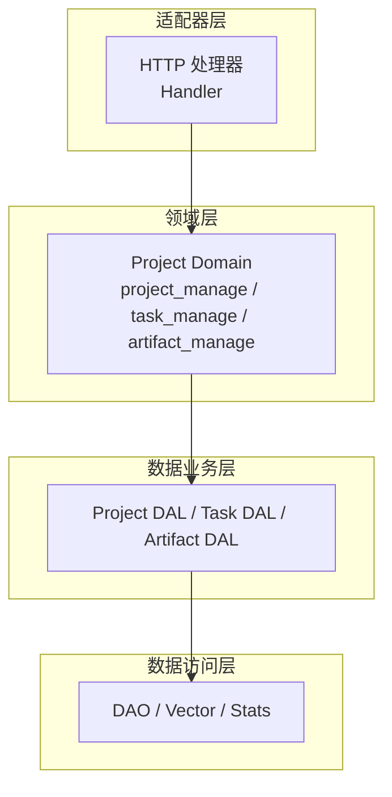
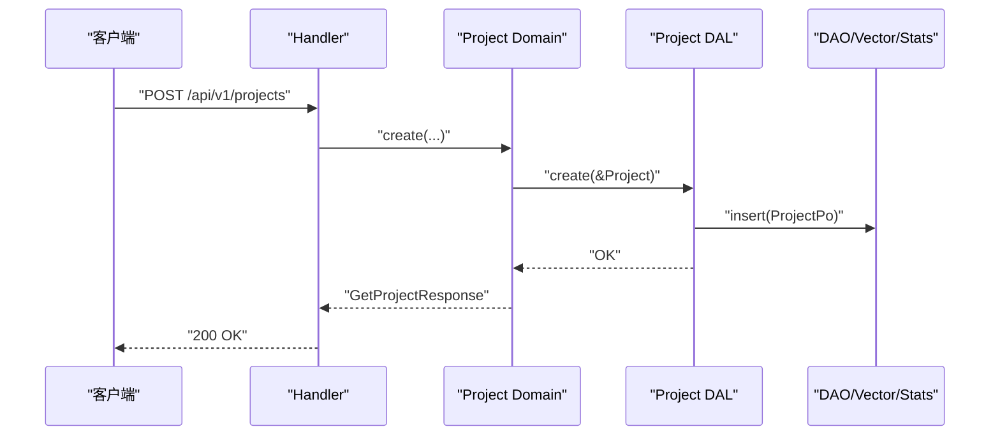
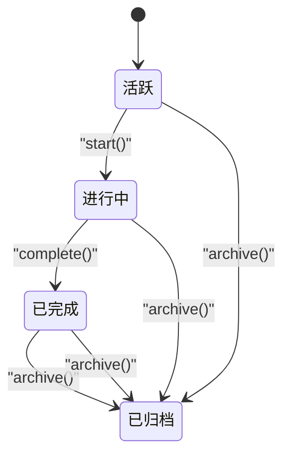
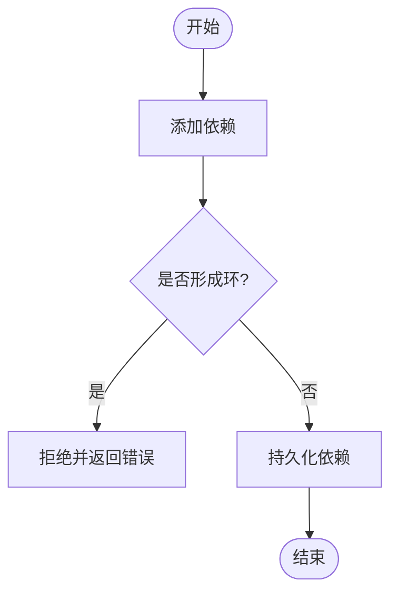
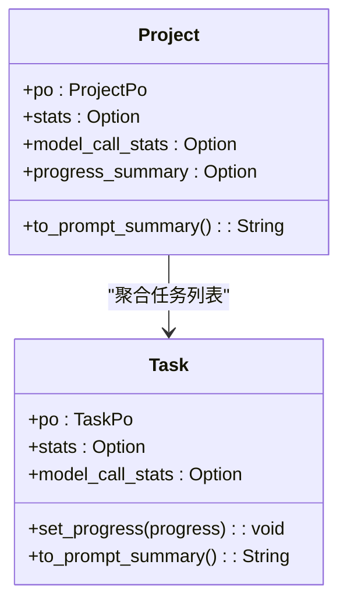
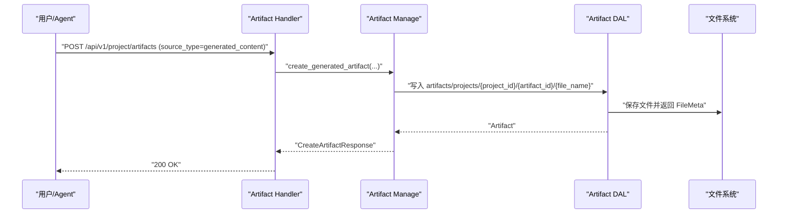
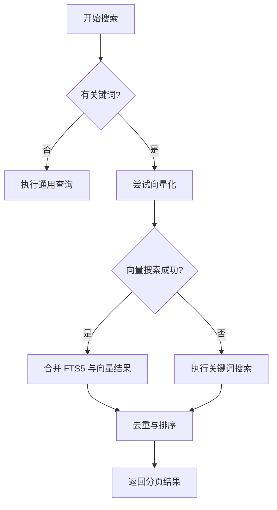
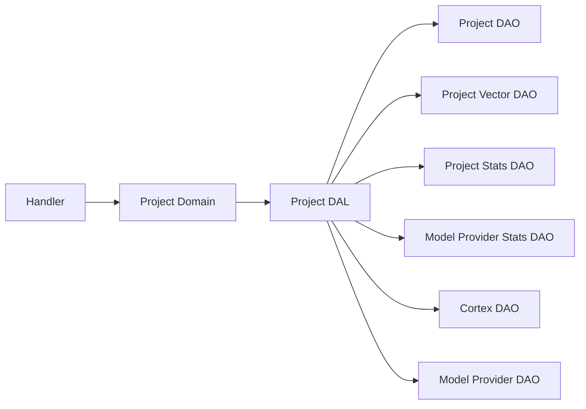

# 项目管理（业务功能层）

<cite>
**本文引用的文件**
- [项目管理系统设计文档](docs/project_management_design.md)
- [项目系统设计文档](docs/project_design.md)
- [项目模型（Project/Task）](src/models/project.rs)
- [任务模型（Task）](src/models/task.rs)
- [项目 API DTO](common/src/api/project.rs)
- [任务 API DTO](common/src/api/task.rs)
- [项目 DAL](src/service/dal/project.rs)
- [项目 Domain 入口与能力定义](src/service/domain/project/mod.rs)
</cite>

### 本文关联的三类文档（四类互引闭环）

**① 设计文档（Design）**：
- [项目领域架构设计](docs/design/project_design.md) — Project 一对多任务关联、进度追踪、软删除分层设计
- [项目管理增强设计](docs/design/project_management_design.md) — Project Domain 六能力整合 + 任务 DAG 依赖 + 产物元数据 + 进度实时计算

**② 落地计划（Plan）**：
- [项目任务增强](docs/plan/项目任务增强.md) — TaskGraph DAG 构建 + ArtifactManage + FetchOptions 按需注入模式

**④ RAG 原子知识卡**：
- [项目领域与制品聚合：ProjectService 六能力 + TaskGraph DAG 依赖编排 + Artifact 制品双关联 + 对话上下文聚合](docs/wiki/knowledge/zh/%E9%A1%B9%E7%9B%AE%E9%A2%86%E5%9F%9F%E4%B8%8E%E5%88%B6%E5%93%81%E8%81%9A%E5%90%88%EF%BC%9AProjectService%20%E5%85%AD%E8%83%BD%E5%8A%9B%20+%20TaskGraph%20DAG%20%E4%BE%9D%E8%B5%96%E7%BC%96%E6%8E%92%20+%20Artifact%20%E5%88%B6%E5%93%81%E5%8F%8C%E5%85%B3%E8%81%94%20+%20%E5%AF%B9%E8%AF%9D%E4%B8%8A%E4%B8%8B%E6%96%87%E8%81%9A%E5%90%88/%E9%A1%B9%E7%9B%AE%E9%A2%86%E5%9F%9F%E4%B8%8E%E5%88%B6%E5%93%81%E8%81%9A%E5%90%88%EF%BC%9AProjectService%20%E5%85%AD%E8%83%BD%E5%8A%9B%20+%20TaskGraph%20DAG%20%E4%BE%9D%E8%B5%96%E7%BC%96%E6%8E%92%20+%20Artifact%20%E5%88%B6%E5%93%81%E5%8F%8C%E5%85%B3%E8%81%94%20+%20%E5%AF%B9%E8%AF%9D%E4%B8%8A%E4%B8%8B%E6%96%87%E8%81%9A%E5%90%88.md) — ProjectManage 六能力 + FetchOptions 七开关 + 10 条分层红线

## 目录
1. [简介](#简介)
2. [项目结构](#项目结构)
3. [核心组件](#核心组件)
4. [架构总览](#架构总览)
5. [详细组件分析](#详细组件分析)
6. [依赖关系分析](#依赖关系分析)
7. [性能考量](#性能考量)
8. [故障排查指南](#故障排查指南)
9. [结论](#结论)
10. [附录](#附录)

## 简介
本章节面向"项目管理"能力，覆盖项目的创建、配置、协作与监控机制；说明项目生命周期管理、任务分解、进度跟踪、里程碑管理；包含成员权限、协作工作流、版本控制集成思路；提供项目模板、任务模板、自动化工作流的配置示例；说明统计报表、燃尽图、绩效分析；包含数据导出、归档、克隆机制；并详细说明项目与 Agent、工具、技能的关联与集成方式。

> 📌 视角说明（AGENTS §2.1.3 Level 3 互补视角平行卡）：
> 本长文是「项目管理」主题的 **业务功能层** 视角。同主题还有以下平行视角卡，请按需交叉阅读：
> - [项目管理（数据模型层）](docs/wiki/zh/content/数据模型/项目和任务模型/项目管理.md)

## 项目结构
本项目采用严格四层单向调用：Adapter（HTTP Handler / 公开回调 / AOP Producer）→ Domain → DAL → DAO，禁止跨层调用与同层互调。PO 仅在 DAO/DAL 内部使用，Domain 对外接口统一使用业务实体。所有公共方法首参为 RequestContext，跨层传递使用 ctx.clone()。

图表来源
- [项目 DAL:1-209](src/service/dal/project.rs#L1-L209)
- [项目 Domain 入口与能力定义:91-226](src/service/domain/project/mod.rs#L91-L226)

章节来源
- [项目管理系统设计文档:11-36](docs/project_management_design.md#L11-L36)
- [项目 DAL:29-67](src/service/dal/project.rs#L29-L67)
- [项目 Domain 入口与能力定义:63-89](src/service/domain/project/mod.rs#L63-L89)

## 核心组件
- 项目（Project）：承载项目元信息、状态、时间边界、负责人 Agent、执行计划与结果等，支持向量检索与统计注入。
- 任务（Task）：承载任务标题、描述、优先级、标签、截止时间、依赖、分配对象、进度、思考深度等，支持 DAG 依赖与进度更新。
- 产物（Artifact）：承载项目级或任务级产物，支持附件引用型与生成内容型，支持内容读取与部分更新。
- 领域服务（Project Domain）：聚合 ProjectManage、TaskManage、ArtifactManage，负责状态流转、依赖校验、产物聚合等。
- 数据业务层（DAL）：封装 DAO，提供混合搜索、统计查询、向量索引维护等。

章节来源
- [项目模型（Project/Task）:15-80](src/models/project.rs#L15-L80)
- [任务模型（Task）:16-81](src/models/task.rs#L16-L81)
- [项目 Domain 入口与能力定义:91-498](src/service/domain/project/mod.rs#L91-L498)
- [项目 DAL:71-209](src/service/dal/project.rs#L71-L209)

## 架构总览
系统以 Project Domain 为核心编排层，Handler 仅调用 Domain，Domain 组合 DAL，DAL 组合 DAO/Vector/Stats。写操作接收实体避免重复查询，读操作接收 ID/参数；PO 不暴露到 Domain 及以上。

图表来源
- [项目 API DTO:10-31](common/src/api/project.rs#L10-L31)
- [项目 Domain 入口与能力定义:111-129](src/service/domain/project/mod.rs#L111-L129)
- [项目 DAL:223-274](src/service/dal/project.rs#L223-L274)

章节来源
- [项目管理系统设计文档:138-161](docs/project_management_design.md#L138-L161)
- [项目 DAL:223-274](src/service/dal/project.rs#L223-L274)

## 详细组件分析

### 项目生命周期与状态流转
- 状态枚举：已删除(软删除)、活跃、进行中、已完成、已归档。
- 启动/完成/归档：通过 Domain 的 transition_status 统一校验合法性与副作用。
- 时间字段：start_at、due_at、end_at 在状态变更时由领域逻辑填充。
- 负责人 Agent：owner_agent_id 用于项目级自动化推进。

图表来源
- [项目系统设计文档:31-43](docs/project_design.md#L31-L43)
- [项目 Domain 入口与能力定义:184-225](src/service/domain/project/mod.rs#L184-L225)

章节来源
- [项目系统设计文档:31-43](docs/project_design.md#L31-L43)
- [项目 Domain 入口与能力定义:184-225](src/service/domain/project/mod.rs#L184-L225)

### 任务分解与 DAG 依赖
- 任务依赖：dependencies 字段存储前置任务 ID 列表，支持多对多依赖。
- 环形检测：添加依赖前进行 DFS 检测，禁止自依赖与环。
- 进度与思考深度：progress 表示 0-100 进度；thinking_depth 记录当前轮次，支持重置。

图表来源
- [项目管理系统设计文档:258-289](docs/project_management_design.md#L258-L289)
- [任务模型（Task）:37-63](src/models/task.rs#L37-L63)

章节来源
- [项目管理系统设计文档:258-289](docs/project_management_design.md#L258-L289)
- [任务模型（Task）:37-63](src/models/task.rs#L37-L63)

### 进度跟踪与实时统计
- 项目进度汇总：基于任务列表实时计算 total_tasks、completed、in_progress、pending、cancelled、overall_percent。
- 模型调用统计：可按项目维度获取 token、时序趋势等。
- 事件统计：ProjectEvent/TaskEvent 用于计数与聚合。

图表来源
- [项目模型（Project/Task）:60-80](src/models/project.rs#L60-L80)
- [任务模型（Task）:65-81](src/models/task.rs#L65-L81)

章节来源
- [项目模型（Project/Task）:317-359](src/models/project.rs#L317-L359)
- [任务模型（Task）:172-214](src/models/task.rs#L172-L214)

### 产物管理与版本留痕
- 产物来源：attachment 引用型（Batch 3.1 落地）、generated_content（预留/后续扩展）、remote_url（预留）。
- 路径策略：Attachment 引用使用 attachments/{relative_path}；Agent 生成内容使用 artifacts/projects/{project_id}/{artifact_id}/{file_name}。
- 内容编辑：仅针对 generated_content 类型，支持 GET/PUT 文本内容，最大 64KB，UTF-8，文件名安全校验。

图表来源
- [项目管理系统设计文档:332-406](docs/project_management_design.md#L332-L406)
- [项目 Domain 入口与能力定义:465-498](src/service/domain/project/mod.rs#L465-L498)

章节来源
- [项目管理系统设计文档:316-406](docs/project_management_design.md#L316-L406)
- [项目 Domain 入口与能力定义:361-498](src/service/domain/project/mod.rs#L361-L498)

### 混合搜索与向量索引
- 搜索策略：关键词（FTS5）+ 向量语义（Embedding Provider），双命中优先，组内按距离/排名排序。
- 自动维护：create/update 时根据内容哈希变化决定是否重建向量索引；rebuild_vectors 支持全量重建。
- 降级策略：向量化失败或无可用 Provider 时降级到纯关键词搜索。

图表来源
- [项目 DAL:488-703](src/service/dal/project.rs#L488-L703)

章节来源
- [项目 DAL:488-703](src/service/dal/project.rs#L488-L703)

### 项目模板、任务模板与自动化工作流
- 项目模板：可通过 workflow/guidance 字段描述运作流程与指导建议，作为 Agent 执行参考。
- 任务模板：可复用 dependencies、tags、priority、due_at 等字段快速创建相似任务。
- 自动化工作流：结合 Cron Trigger（系统级定时任务）与 Owner Agent，实现项目跟进、巡检与提醒。

章节来源
- [项目模型（Project/Task）:24-27](src/models/project.rs#L24-L27)
- [任务模型（Task）:37-63](src/models/task.rs#L37-L63)
- [项目管理系统设计文档:544-670](docs/project_management_design.md#L544-L670)

### 成员权限、协作工作流与版本控制集成
- 成员权限：root_user_id 保证归属与过滤；owner_agent_id 指定自动化负责人；Handler 层负责权限校验后再调用 Domain。
- 协作工作流：通过消息通道与 Agent Loop 编排，任务状态变更触发通知与协同。
- 版本控制集成：建议将项目/任务关键变更（如 execution_plan/result）纳入外部版本库钩子，或通过系统备份/归档能力实现快照。

章节来源
- [项目系统设计文档:70-83](docs/project_design.md#L70-L83)
- [项目管理系统设计文档:544-670](docs/project_management_design.md#L544-L670)

### 统计报表、燃尽图与绩效分析
- 统计报表：ProjectStats/ModelCallStats 提供事件次数、token 用量与时序趋势。
- 燃尽图：基于任务进度与状态分布，前端渲染剩余工作量随时间变化曲线。
- 绩效分析：结合任务完成度、耗时、模型调用成本，评估团队/Agent 效率。

章节来源
- [项目 DAL:183-202](src/service/dal/project.rs#L183-L202)
- [项目模型（Project/Task）:60-80](src/models/project.rs#L60-L80)
- [任务模型（Task）:65-81](src/models/task.rs#L65-L81)

### 数据导出、归档与克隆
- 数据导出：通过 DAL 的 query/search 接口导出项目/任务/产物清单与详情，配合系统备份能力输出结构化数据。
- 归档：archive_project 级联归档下属任务与产物，清理向量索引，保留审计历史。
- 克隆：基于现有项目/任务/产物元数据创建新实例，重新生成 ID 并建立新的依赖关系。

章节来源
- [项目管理系统设计文档:291-307](docs/project_management_design.md#L291-L307)
- [项目 DAL:448-456](src/service/dal/project.rs#L448-L456)

### 与 Agent、工具、技能的关联与集成
- 关联关系：Project.owner_agent_id 绑定负责人 Agent；Task.assignee_type/assignee_id 指向具体执行者（Agent/人）。
- 集成方式：Handler 在创建项目/任务时注入 owner_agent_id/assignee；Domain 不感知 hr domain，仅做纯粹持久化。
- 技能与工具：通过工具注册表与消息通道，Agent 在执行任务时动态加载技能与工具，执行结果回写至任务/产物。

章节来源
- [项目系统设计文档:77-83](docs/project_design.md#L77-L83)
- [项目 Domain 入口与能力定义:111-129](src/service/domain/project/mod.rs#L111-L129)
- [项目管理系统设计文档:544-670](docs/project_management_design.md#L544-L670)

## 依赖关系分析
- 模块耦合：Domain 仅依赖 DAL，DAL 仅依赖 DAO/Vector/Stats；Handler 仅依赖 Domain。
- 直接依赖：Project DAL 依赖 ProjectDao、ProjectVectorDao、ProjectStatsDao、ModelProviderStatsDao、CortexDao、ModelProviderDao。
- 间接依赖：搜索与统计通过 Cortex/ModelProvider 提供 Embedding 与 Token 指标。

图表来源
- [项目 DAL:213-221](src/service/dal/project.rs#L213-L221)

章节来源
- [项目 DAL:213-221](src/service/dal/project.rs#L213-L221)

## 性能考量
- 避免 N+1：写操作接收实体，减少重复查询；批量查询使用 ids 列表。
- 向量索引：内容哈希变化才重建；无可用 Provider 时降级；rebuild_vectors 支持增量/全量重建。
- 统计查询：按需加载 stats/model_call_stats，避免不必要开销。
- 搜索限制：搜索结果限制总数（如 20），防止无限分页。

章节来源
- [项目管理系统设计文档:138-161](docs/project_management_design.md#L138-L161)
- [项目 DAL:223-274](src/service/dal/project.rs#L223-L274)
- [项目 DAL:488-703](src/service/dal/project.rs#L488-L703)

## 故障排查指南
- 向量索引失败：检查 Embedding Provider 配置与可用性；查看日志中的 vector_index 警告。
- 搜索结果为空：确认关键词与向量阈值；必要时切换为纯关键词搜索。
- 状态流转异常：确认目标状态合法性；检查 Domain 的 transition_status 实现。
- 产物内容编辑失败：确认 source_type 为 generated_content；检查文件名安全与大小限制。

章节来源
- [项目 DAL:223-274](src/service/dal/project.rs#L223-L274)
- [项目 DAL:488-703](src/service/dal/project.rs#L488-L703)
- [项目管理系统设计文档:332-406](docs/project_management_design.md#L332-L406)

## 结论
本项目管理系统以严格的分层架构与领域驱动设计为基础，围绕 Project/Task/Artifact 构建完整的项目生命周期管理能力。通过统一的 Domain 编排、DAL 的数据抽象与 DAO 的持久化，实现了高内聚、低耦合的可维护系统。混合搜索、统计报表、产物管理与 Agent 集成为项目协作与自动化提供了坚实基础。

## 附录
- API 参考：项目与任务的创建、查询、更新、状态变更、搜索等接口定义见 DTO 文件。
- 迁移与初始化：数据库迁移与基础数据注入遵循两阶段初始化流程。
- 测试与质量：集成测试覆盖认证、CRUD、消息投递、向量降级、A2A、预置技能、Cron 等场景。

章节来源
- [项目 API DTO:10-255](common/src/api/project.rs#L10-L255)
- [任务 API DTO:10-299](common/src/api/task.rs#L10-L299)
- [项目管理系统设计文档:472-498](docs/project_management_design.md#L472-L498)