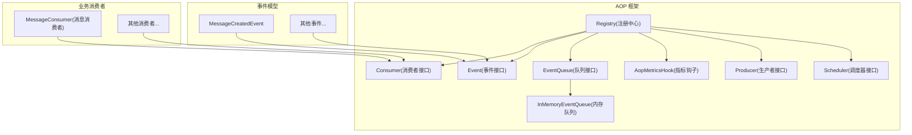
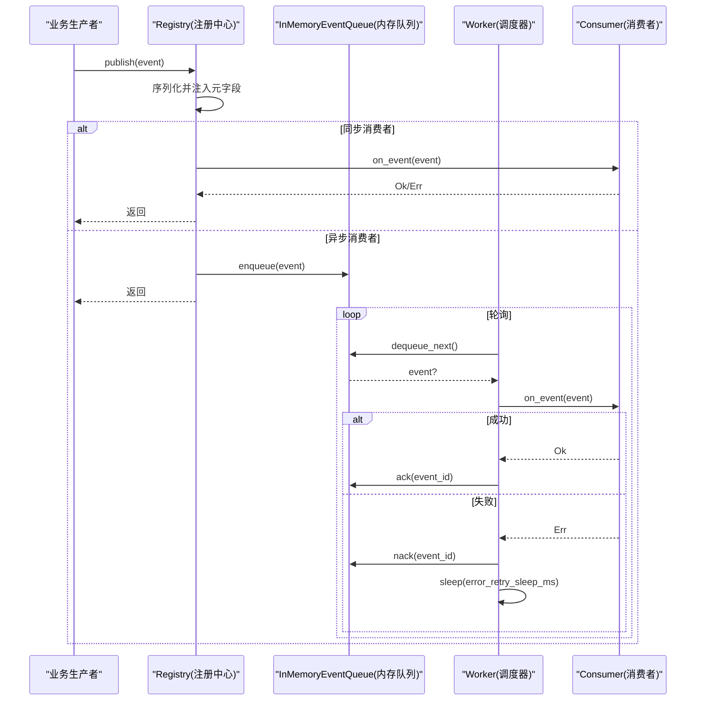
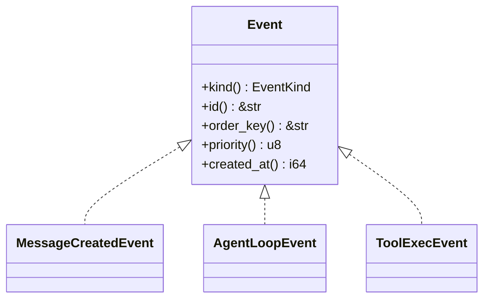
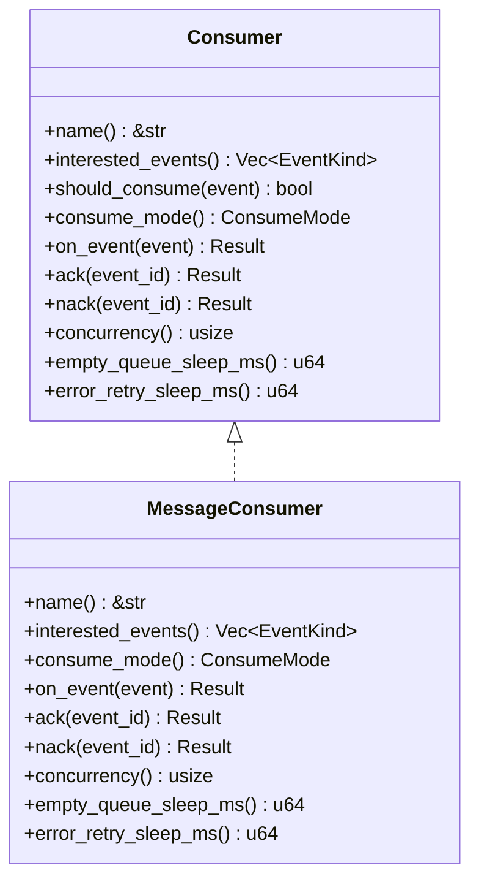
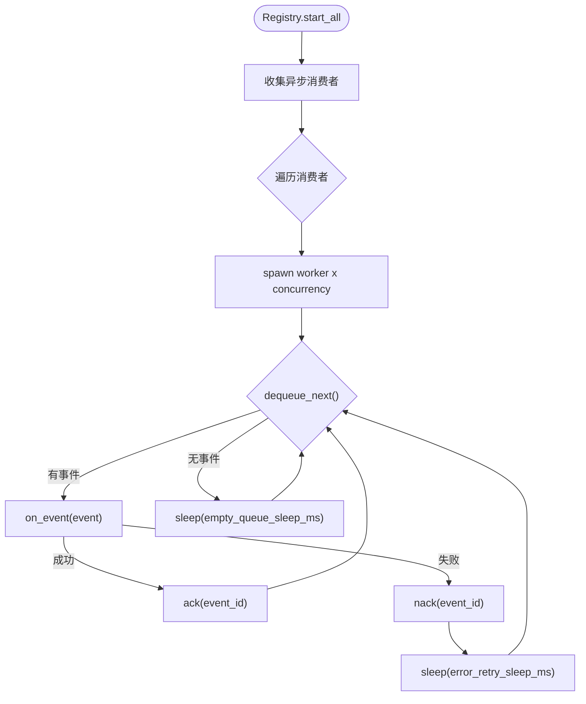
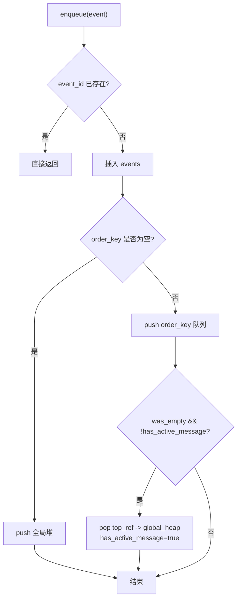
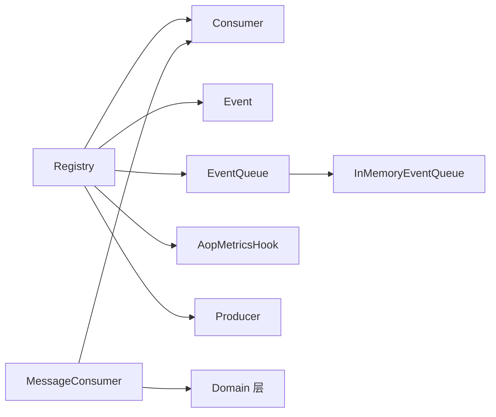

# AOP 事件系统（框架层）

<cite>
**本文引用的文件**
- [src/pkg/aop/mod.rs](src/pkg/aop/mod.rs)
- [src/pkg/aop/core/mod.rs](src/pkg/aop/core/mod.rs)
- [src/pkg/aop/core/registry.rs](src/pkg/aop/core/registry.rs)
- [src/pkg/aop/core/consumer.rs](src/pkg/aop/core/consumer.rs)
- [src/pkg/aop/core/event.rs](src/pkg/aop/core/event.rs)
- [src/pkg/aop/core/metrics_hook.rs](src/pkg/aop/core/metrics_hook.rs)
- [src/pkg/aop/core/producer.rs](src/pkg/aop/core/producer.rs)
- [src/pkg/aop/core/scheduler.rs](src/pkg/aop/core/scheduler.rs)
- [src/pkg/aop/queue/mod.rs](src/pkg/aop/queue/mod.rs)
- [src/pkg/aop/queue/in_memory.rs](src/pkg/aop/queue/in_memory.rs)
- [src/consumer/mod.rs](src/consumer/mod.rs)
- [src/consumer/message.rs](src/consumer/message.rs)
- [src/models/events/mod.rs](src/models/events/mod.rs)
- [docs/event_design.md](docs/event_design.md)

**本文关联三类文档（四类互引闭环）**
- 【① Design 决策快照】
  - [consumer_architecture.md](docs/archive/design-archive/consumer_architecture.md) — 生产-消费异步框架总设计，分层解耦 + 启动顺序红线
  - [event_design.md](docs/archive/design-archive/event_design.md) — ⚠️ 旧版 EventQueueDao 已废弃，仅作参考对比
- 【② Plan 落地快照】
  - [AOP生产消费事件中心重构.md](docs/archive/plan-archive/AOP生产消费事件中心重构.md) — Registry 单例 + consumer::init 注册顺序 + ack/nack 语义实现
- 【④ RAG 原子知识卡】
  - [AOP 生产消费事件中心：纯框架零业务 + pkg/aop/core 6 Trait + Registry 全局单例 + 8 类业务消费者注册](docs/wiki/knowledge/zh/AOP%20生产消费事件中心：纯框架零业务%20+%20pkg%2Faop%2Fcore%206%20Trait%20+%20Registry%20全局单例%20+%208%20类业务消费者注册/AOP%20生产消费事件中心：纯框架零业务%20+%20pkg%2Faop%2Fcore%206%20Trait%20+%20Registry%20全局单例%20+%208%20类业务消费者注册.md) — 零业务耦合硬边界 + lib.rs 启动 6 步严格顺序 + consumer::init 禁写 DB 等 6 条红线
- 【③ Wiki 关联长文】
  - [注册中心与调度器.md](docs/wiki/zh/content/基础设施/AOP%20事件系统/AOP%20核心架构/注册中心与调度器.md) — Registry self_ref 循环注入 + start_all 内部 worker
  - [事件消费者.md](docs/wiki/zh/content/基础设施/AOP%20事件系统/事件消费者/事件消费者.md) — 8 类消费者一览表
  - [后台任务系统.md](docs/wiki/zh/content/基础设施/后台任务系统.md) — 启动顺序红线说明
- 【① Design 决策快照 - Batch9 补充】
  - [consumer_architecture.md](docs/archive/design-archive/consumer_architecture.md) — 生产-消费异步框架总设计（分层解耦 + 启动顺序红线）
  - [event_design.md](docs/archive/design-archive/event_design.md) — ⚠️ 旧版 EventQueueDao 已废弃（仅对比参考）
- 【② Plan 落地快照 - Batch9 补充】
  - [agent_loop_engine_plan.md](docs/archive/plan-archive/agent_loop_engine_plan.md) — Agent 循环引擎：DomainEvent 8 类 → AgentLoopConsumer 唤醒调度
- 【④ RAG 原子知识卡 - Batch9 新增平行卡】
  - [Domain 内部事件与消费者全链路：8 类 DomainEvent 枚举 + 8 类 Consumer 业务消费 + AOP Producer 投递入口 + Registry 订阅](docs/wiki/knowledge/zh/Domain%20%E5%86%85%E9%83%A8%E4%BA%8B%E4%BB%B6%E4%B8%8E%E6%B6%88%E8%B4%B9%E8%80%85%E5%85%A8%E9%93%BE%E8%B7%AF%EF%BC%9A8%20%E7%B1%BB%20DomainEvent%20%E6%9E%9A%E4%B8%BE%20+%208%20%E7%B1%BB%20Consumer%20%E4%B8%9A%E5%8A%A1%E6%B6%88%E8%B4%B9%20+%20AOP%20Producer%20%E6%8A%95%E9%80%92%E5%85%A5%E5%8F%A3%20+%20Registry%20%E8%AE%A2%E9%98%85/Domain%20%E5%86%85%E9%83%A8%E4%BA%8B%E4%BB%B6%E4%B8%8E%E6%B6%88%E8%B4%B9%E8%80%85%E5%85%A8%E9%93%BE%E8%B7%AF%EF%BC%9A8%20%E7%B1%BB%20DomainEvent%20%E6%9E%9A%E4%B8%BE%20+%208%20%E7%B1%BB%20Consumer%20%E4%B8%9A%E5%8A%A1%E6%B6%88%E8%B4%B9%20+%20AOP%20Producer%20%E6%8A%95%E9%80%92%E5%85%A5%E5%8F%A3%20+%20Registry%20%E8%AE%A2%E9%98%85.md) — 8 类 DomainEvent 枚举（Message/Task/AgentAwake/Schedule/ToolExec/ThinkRound 等）+ 事件 3 阶段生命周期 + 9 条分层红线
</cite>

## 更新摘要
**变更内容**
- 更新了注册中心错误处理和日志输出的格式规范
- 改进了代码可维护性和一致性
- 增强了错误处理的统一化设计
- 优化了锁管理和并发控制

## 目录
1. [简介](#简介)
2. [项目结构](#项目结构)
3. [核心组件](#核心组件)
4. [架构总览](#架构总览)
5. [详细组件分析](#详细组件分析)
6. [依赖关系分析](#依赖关系分析)
7. [性能与优化](#性能与优化)
8. [故障排查指南](#故障排查指南)
9. [结论](#结论)
10. [附录：使用示例与扩展机制](#附录使用示例与扩展机制)

## 简介
本技术文档围绕 AI Orz 的 AOP 事件系统，系统性阐述面向切面编程（AOP）在事件分发中的设计理念、事件中心架构、生产者-消费者模式实现、事件总线设计、异步处理机制、统计收集器与监控钩子、事件生命周期管理、队列机制、消费策略与性能优化。同时提供事件定义、注册、发布与消费的完整流程说明，并解释与其他系统的集成方式与扩展点。

**最新更新**：注册中心已进行格式改进，提升了代码可维护性和一致性，包括统一的错误处理格式、标准化的日志输出和优化的锁管理机制。

> 📌 视角说明（AGENTS §2.1.3 Level 3 互补视角平行卡）：
> 本长文是「AOP 事件系统」主题的 **框架层** 视角。同主题还有以下平行视角卡，请按需交叉阅读：
> - [AOP 事件系统（代码落地层）](docs/wiki/zh/content/核心模块/AOP 事件系统/AOP 事件系统.md)
> - [AOP 事件系统（系统管理层）](docs/wiki/zh/content/功能模块/系统管理/AOP 事件系统.md)

## 项目结构
AOP 事件系统位于 src/pkg/aop 下，采用"框架层 + 业务消费者"的分层组织：
- 框架层（pkg/aop）：定义事件、消费者、注册中心、调度器、队列接口及内存实现，负责事件流转与调度，不感知业务实体。
- 业务消费者（consumer/*）：实现具体业务逻辑，通过注册中心订阅感兴趣的事件类型，由调度器异步拉取并处理。
- 事件模型（models/events/*）：定义领域事件结构，供生产者在业务中发布。

**图表来源**
- [src/pkg/aop/core/registry.rs:12-22](src/pkg/aop/core/registry.rs#L12-L22)
- [src/pkg/aop/core/consumer.rs:24-71](src/pkg/aop/core/consumer.rs#L24-L71)
- [src/pkg/aop/core/event.rs:12-24](src/pkg/aop/core/event.rs#L12-L24)
- [src/pkg/aop/queue/mod.rs:77-106](src/pkg/aop/queue/mod.rs#L77-L106)
- [src/pkg/aop/core/metrics_hook.rs:61-89](src/pkg/aop/core/metrics_hook.rs#L61-L89)
- [src/pkg/aop/core/producer.rs:7-35](src/pkg/aop/core/producer.rs#L7-L35)
- [src/pkg/aop/core/scheduler.rs:3-8](src/pkg/aop/core/scheduler.rs#L3-L8)

**章节来源**
- [src/pkg/aop/mod.rs:1-69](src/pkg/aop/mod.rs#L1-L69)
- [src/pkg/aop/core/mod.rs:1-14](src/pkg/aop/core/mod.rs#L1-L14)

## 核心组件
- 事件（Event）：携带数据的纯数据结构，具备 kind、id、order_key、priority、created_at 等元信息，用于路由与排序。
- 消费者（Consumer）：统一的事件消费接口，支持同步（Sync）与异步（Async）两种模式；异步模式需实现 ack/nack 以支持确认与重试。
- 注册中心（Registry）：维护消费者与生产者集合，负责事件分发、队列分配、调度器启动与指标埋点。**已进行格式改进，提升代码可维护性**。
- 队列（EventQueue）：抽象出入队、出队、确认、失败重试、恢复与清理等操作；当前提供内存实现 InMemoryEventQueue。
- 调度器（Scheduler）：由 Registry 启动，为每个异步消费者创建固定数量的 worker，循环拉取事件并调用 on_event，根据结果执行 ack/nack。
- 指标钩子（AopMetricsHook）：可插拔的统计采集点，覆盖 publish、consume_start、consume_success、consume_failure 等阶段。
- 生产者（Producer）：外部数据源适配器，支持轮询和非轮询两种模式。

**章节来源**
- [src/pkg/aop/core/event.rs:12-24](src/pkg/aop/core/event.rs#L12-L24)
- [src/pkg/aop/core/consumer.rs:24-71](src/pkg/aop/core/consumer.rs#L24-L71)
- [src/pkg/aop/core/registry.rs:12-22](src/pkg/aop/core/registry.rs#L12-L22)
- [src/pkg/aop/queue/mod.rs:77-106](src/pkg/aop/queue/mod.rs#L77-L106)
- [src/pkg/aop/core/metrics_hook.rs:61-89](src/pkg/aop/core/metrics_hook.rs#L61-L89)
- [src/pkg/aop/core/producer.rs:7-35](src/pkg/aop/core/producer.rs#L7-L35)

## 架构总览
AOP 事件系统采用"生产者-消费者 + 事件总线"的解耦架构：
- 生产者通过 Registry.publish 发布事件，框架自动序列化并注入元字段（event_id、kind、order_key、priority、created_at）。
- 对于同步消费者，直接在发布线程调用 on_event；对于异步消费者，事件入队到对应消费者的内存队列。
- 调度器为每个异步消费者启动多个 worker，循环 dequeue_next，调用 on_event，成功后 ack，失败则 nack 并退避重试。
- 队列按 order_key 保证顺序性，全局堆按 priority 和 created_at 决定出队优先级。

**图表来源**
- [src/pkg/aop/core/registry.rs:101-210](src/pkg/aop/core/registry.rs#L101-L210)
- [src/pkg/aop/core/registry.rs:264-515](src/pkg/aop/core/registry.rs#L264-L515)
- [src/pkg/aop/queue/in_memory.rs:106-267](src/pkg/aop/queue/in_memory.rs#L106-L267)

## 详细组件分析

### 事件与事件模型
- Event trait 定义了事件的标识、顺序键、优先级与时间戳等元信息，便于统一路由与排序。
- 业务事件（如 MessageCreatedEvent）在 models/events 中定义，并通过 consumer::init 注册到 AOP。

**图表来源**
- [src/pkg/aop/core/event.rs:12-24](src/pkg/aop/core/event.rs#L12-L24)
- [src/models/events/mod.rs:1-21](src/models/events/mod.rs#L1-L21)

**章节来源**
- [src/pkg/aop/core/event.rs:12-24](src/pkg/aop/core/event.rs#L12-L24)
- [src/models/events/mod.rs:1-21](src/models/events/mod.rs#L1-L21)

### 消费者接口与消息消费者
- Consumer trait 提供 name、interested_events、should_consume、consume_mode、on_event、ack、nack、concurrency、empty_queue_sleep_ms、error_retry_sleep_ms 等能力。
- MessageConsumer 作为 Async 消费者，订阅 message.created，并发度为 4，空队列休眠 100ms，错误重试休眠 1000ms。

**图表来源**
- [src/pkg/aop/core/consumer.rs:24-71](src/pkg/aop/core/consumer.rs#L24-L71)
- [src/consumer/message.rs:1-534](src/consumer/message.rs#L1-L534)

**章节来源**
- [src/pkg/aop/core/consumer.rs:24-71](src/pkg/aop/core/consumer.rs#L24-L71)
- [src/consumer/message.rs:1-534](src/consumer/message.rs#L1-L534)

### 注册中心与调度器
- Registry 维护 consumers、producers、queues，并在 start_all 中为每个异步消费者启动固定数量的 worker。
- publish 时根据 consume_mode 选择同步或异步路径；异步路径将事件入队到对应消费者的内存队列。
- worker 循环 dequeue_next，调用 on_event，成功则 ack，失败则 nack 并 sleep(error_retry_sleep_ms)。
- **格式改进**：错误处理使用统一的 err! 宏，日志输出采用标准化格式，锁管理更加安全高效。

**图表来源**
- [src/pkg/aop/core/registry.rs:264-515](src/pkg/aop/core/registry.rs#L264-L515)

**章节来源**
- [src/pkg/aop/core/registry.rs:101-210](src/pkg/aop/core/registry.rs#L101-L210)
- [src/pkg/aop/core/registry.rs:264-515](src/pkg/aop/core/registry.rs#L264-L515)

### 内存队列与顺序/优先级
- InMemoryEventQueue 使用全局 BinaryHeap 按 (priority DESC, created_at ASC) 出队，保证高优先级优先。
- 对非空 order_key 的事件，按 order_key 分组维护有序队列，确保同 key 顺序处理。
- has_active_message 标记某 order_key 是否已有活动消息，避免重复入队导致死锁。
- ack 会移除 in_progress 并从 order_key 队列弹出下一个事件；nack 会将事件重新入队并标记活动。

**图表来源**
- [src/pkg/aop/queue/in_memory.rs:106-166](src/pkg/aop/queue/in_memory.rs#L106-L166)

**章节来源**
- [src/pkg/aop/queue/in_memory.rs:106-267](src/pkg/aop/queue/in_memory.rs#L106-L267)

### 统计收集器与监控钩子
- Registry 支持注入 AopMetricsHook，在 publish、consume_start、consume_success、consume_failure 四个阶段记录指标。
- 队列提供 stats、query_events、get_event 等监控方法，便于外部系统查询队列状态与事件详情。
- 可通过 system 层暴露 API 聚合各消费者队列统计，支持按 order_key、status 过滤与分页。

**章节来源**
- [src/pkg/aop/core/registry.rs:42-51](src/pkg/aop/core/registry.rs#L42-L51)
- [src/pkg/aop/core/registry.rs:153-158](src/pkg/aop/core/registry.rs#L153-L158)
- [src/pkg/aop/core/registry.rs:565-609](src/pkg/aop/core/registry.rs#L565-L609)
- [src/pkg/aop/queue/mod.rs:96-106](src/pkg/aop/queue/mod.rs#L96-L106)

### 生产者接口
- Producer trait 定义了生产者的标准接口，支持注册、启动、停止和轮询功能。
- 支持两种模式：轮询模式（poll_interval_secs > 0）和非轮询模式（poll_interval_secs = 0）。
- 非轮询模式下，生产者自行管理生命周期，通过 start() 和 stop() 控制。

**章节来源**
- [src/pkg/aop/core/producer.rs:7-35](src/pkg/aop/core/producer.rs#L7-L35)

## 依赖关系分析
- Registry 依赖 Consumer、Event、EventQueue 抽象，内部持有 queues 映射（消费者名 -> 队列实例）。
- InMemoryEventQueue 依赖 RequestContext、serde_json 进行上下文传递与事件序列化。
- 业务消费者（如 MessageConsumer）依赖 domain 层完成实际业务编排，与 AOP 框架解耦。

**图表来源**
- [src/pkg/aop/core/registry.rs:12-22](src/pkg/aop/core/registry.rs#L12-L22)
- [src/pkg/aop/queue/in_memory.rs:1-449](src/pkg/aop/queue/in_memory.rs#L1-L449)
- [src/consumer/message.rs:1-534](src/consumer/message.rs#L1-L534)

**章节来源**
- [src/pkg/aop/core/registry.rs:12-22](src/pkg/aop/core/registry.rs#L12-L22)
- [src/pkg/aop/queue/in_memory.rs:1-449](src/pkg/aop/queue/in_memory.rs#L1-L449)
- [src/consumer/message.rs:1-534](src/consumer/message.rs#L1-L534)

## 性能与优化
- 顺序与并行：相同 order_key 顺序处理，不同 order_key 可并行，最大化吞吐。
- 优先级：全局堆按 priority 与 created_at 排序，高优先级事件优先处理。
- 退避策略：空队列与错误重试分别配置 empty_queue_sleep_ms 与 error_retry_sleep_ms，避免紧密自旋。
- 并发控制：消费者可设置 concurrency，调节 worker 数量以匹配负载。
- 内存占用：队列仅存储事件 JSON 与引用，避免重复入队，减少内存压力。
- **格式优化**：统一的错误处理和日志格式减少了运行时开销，提高了代码执行效率。

## 故障排查指南
- 事件卡死：检查 order_key 是否仍有活动消息（has_active_message），确认 ack/nack 是否正确调用。
- 重试风暴：调整 error_retry_sleep_ms，避免频繁重试导致 CPU 飙升。
- 队列积压：增加消费者 concurrency，或优化 on_event 处理耗时。
- 监控定位：使用队列 stats、query_events、get_event 查看 pending/in_progress 分布与最老事件年龄。
- **格式问题排查**：如果看到格式不一致的错误信息，检查 registry.rs 中的错误处理是否使用了统一的 err! 宏。

**章节来源**
- [src/pkg/aop/core/registry.rs:524-550](src/pkg/aop/core/registry.rs#L524-L550)
- [src/pkg/aop/queue/in_memory.rs:208-267](src/pkg/aop/queue/in_memory.rs#L208-L267)
- [src/pkg/aop/queue/in_memory.rs:300-382](src/pkg/aop/queue/in_memory.rs#L300-L382)

## 结论
AOP 事件系统通过清晰的抽象与解耦，实现了轻量级、高性能、可扩展的事件分发与处理机制。其顺序保证、优先级调度、异步消费与监控钩子为复杂业务场景提供了坚实基础。结合业务消费者与领域层，系统能够灵活应对多种事件流需求，并具备良好的可观测性与可维护性。

**最新更新**：注册中心的格式改进进一步提升了代码的可维护性和一致性，为未来的功能扩展奠定了更好的基础。

## 附录：使用示例与扩展机制

### 事件定义、注册、发布与消费流程
- 定义事件：实现 Event trait，提供 kind、id、order_key、priority、created_at。
- 注册消费者：在 consumer::init 中调用 registry.register_consumer，指定 interested_events。
- 发布事件：调用 aop::publish(event)，框架自动序列化并分发。
- 消费事件：消费者实现 on_event，异步模式下实现 ack/nack，由调度器驱动。

**章节来源**
- [src/pkg/aop/mod.rs:48-69](src/pkg/aop/mod.rs#L48-L69)
- [src/consumer/mod.rs:16-37](src/consumer/mod.rs#L16-L37)
- [src/pkg/aop/core/registry.rs:101-210](src/pkg/aop/core/registry.rs#L101-L210)

### 与其他系统的集成
- 与 DAL/DAO：消费者通过 domain 层访问数据，AOP 不直接操作数据库。
- 与消息通道：消息创建后发布 message.created，由 MessageConsumer 分发至用户/Agent/System。
- 与监控系统：通过 AopMetricsHook 与队列监控接口，对外暴露队列状态与事件详情。

**章节来源**
- [src/consumer/message.rs:78-128](src/consumer/message.rs#L78-L128)
- [docs/event_design.md:375-383](docs/event_design.md#L375-L383)

### 历史设计与演进
- 旧版事件总线设计强调持久化与崩溃恢复，现已被 AOP 事件中心取代。
- 当前实现保留轻量内存队列与顺序/优先级特性，满足单实例部署需求。

**章节来源**
- [docs/event_design.md:1-195](docs/event_design.md#L1-L195)