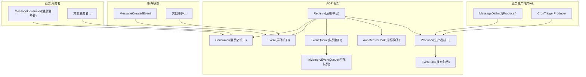
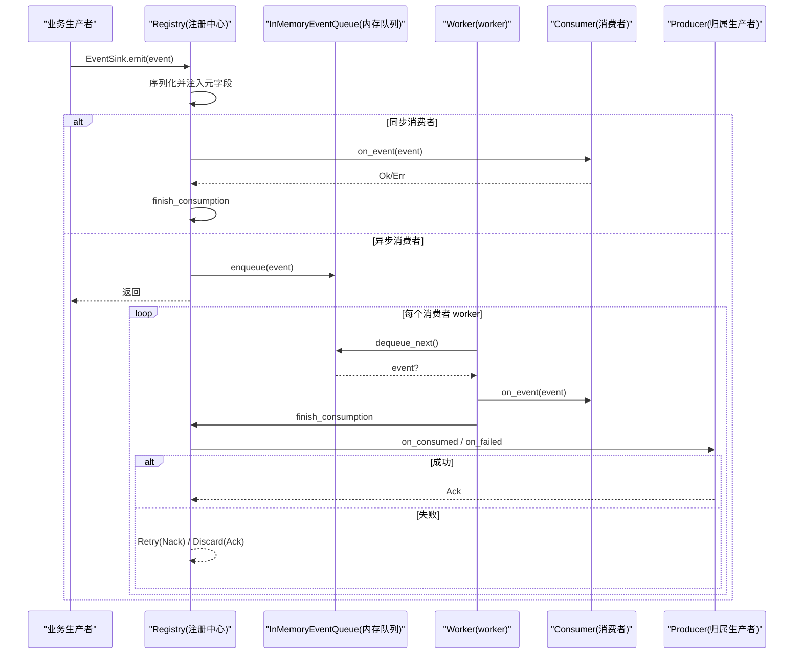
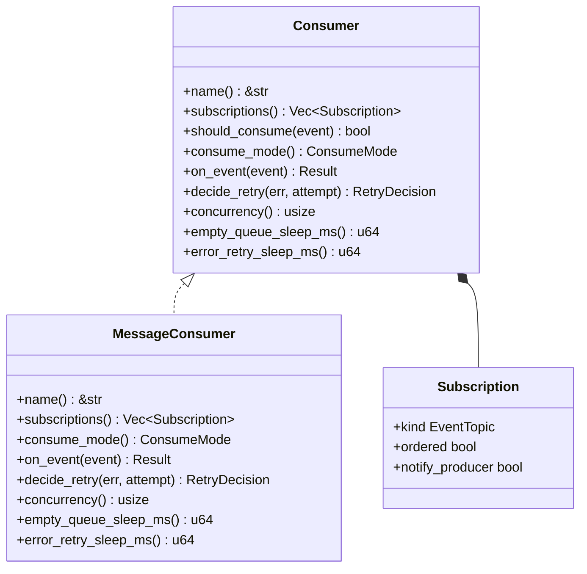
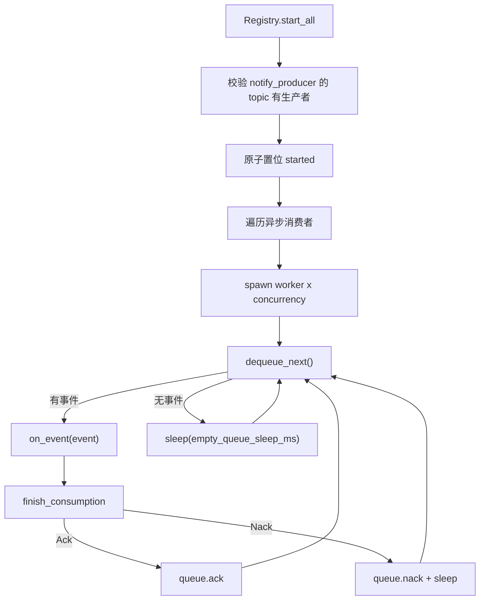
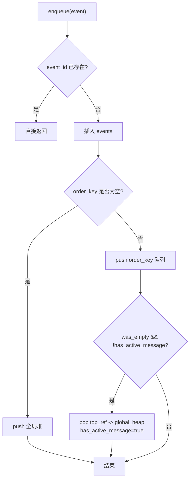
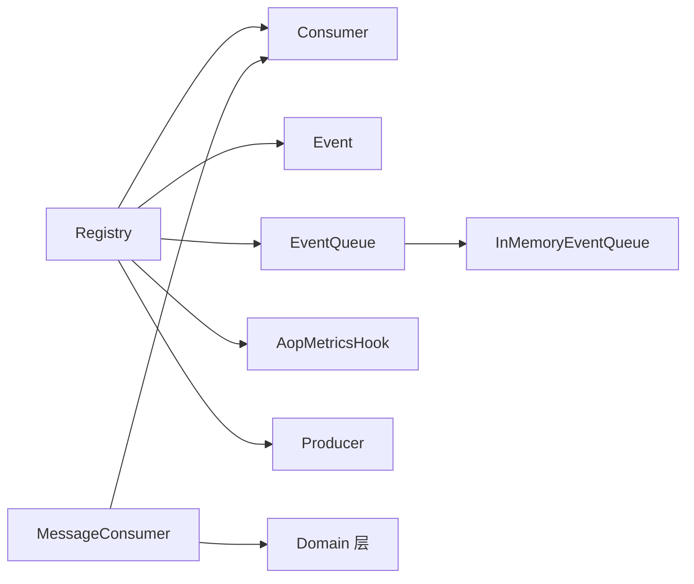

# AOP 事件系统（框架层）

<cite>
**本文引用的文件**
- [src/pkg/aop/mod.rs](src/pkg/aop/mod.rs)
- [src/pkg/aop/core/mod.rs](src/pkg/aop/core/mod.rs)
- [src/pkg/aop/core/event.rs](src/pkg/aop/core/event.rs)
- [src/pkg/aop/core/consumer.rs](src/pkg/aop/core/consumer.rs)
- [src/pkg/aop/core/producer.rs](src/pkg/aop/core/producer.rs)
- [src/pkg/aop/core/event_sink.rs](src/pkg/aop/core/event_sink.rs)
- [src/pkg/aop/core/registry.rs](src/pkg/aop/core/registry.rs)
- [src/pkg/aop/core/metrics_hook.rs](src/pkg/aop/core/metrics_hook.rs)
- [src/pkg/aop/queue/mod.rs](src/pkg/aop/queue/mod.rs)
- [src/pkg/aop/queue/in_memory.rs](src/pkg/aop/queue/in_memory.rs)
- [common/src/enums/event_topic.rs](common/src/enums/event_topic.rs)
- [src/models/events/mod.rs](src/models/events/mod.rs)
- [src/consumer/mod.rs](src/consumer/mod.rs)
- [src/consumer/message.rs](src/consumer/message.rs)
- [docs/design/aop_producer_consumer_contract_design.md](docs/design/aop_producer_consumer_contract_design.md)

**本文关联的文档（单向引用 v2.1：活文档 → 历史/兄弟文档）**
- 【① Design 决策快照】
  - [aop_producer_consumer_contract_design.md](docs/design/aop_producer_consumer_contract_design.md) — 生产者-消费者契约重构总设计（topic 收敛、DAL-as-Producer、收尾归属、重试决策）
  - [consumer_architecture.md](docs/archive/design-archive/consumer_architecture.md) — 生产-消费异步框架总设计，分层解耦 + 启动顺序红线
- 【② Plan 落地快照】
  - [AOP生产消费事件中心重构.md](docs/archive/plan-archive/AOP生产消费事件中心重构.md) — Registry 单例 + consumer::init 注册顺序 + 收尾回调语义实现
- 【④ RAG 原子知识卡】
  - [AOP 生产消费事件中心：纯框架零业务 + pkg/aop/core 6 Trait + Registry 全局单例 + 8 类业务消费者注册](docs/wiki/knowledge/zh/AOP%20生产消费事件中心：纯框架零业务%20+%20pkg%2Faop%2Fcore%206%20Trait%20+%20Registry%20全局单例%20+%208%20类业务消费者注册/AOP%20生产消费事件中心：纯框架零业务%20+%20pkg%2Faop%2Fcore%206%20Trait%20+%20Registry%20全局单例%20+%208%20类业务消费者注册.md) — 零业务耦合硬边界 + lib.rs 启动 6 步严格顺序 + consumer::init 禁写 DB 等 6 条红线
- 【③ Wiki 关联长文】
  - [注册中心与调度器.md](docs/wiki/zh/content/基础设施/AOP%20事件系统/AOP%20核心架构/注册中心与调度器.md) — Registry 按 topic 反查生产者 + start_all 校验与 start/stop
  - [事件消费者.md](docs/wiki/zh/content/基础设施/AOP%20事件系统/事件消费者/事件消费者.md) — 8 类消费者一览表
  - [后台任务系统.md](docs/wiki/zh/content/基础设施/后台任务系统.md) — 启动顺序红线说明
</cite>

## 更新摘要
**变更内容**
- 事件类型标识由已删除的 `EventKind` 收敛为 `common::enums::EventTopic`（闭合枚举，点分线格式），`Event::kind()` 现返回 `EventTopic`
- 消费者订阅由 `interested_events()` 改为 `subscriptions() -> Vec<Subscription>`（`kind`/`ordered`/`notify_producer`）
- 生产者 trait 改形：删除 `register()`/`poll()`/`poll_interval_secs()`，新增 `topic()`/`on_consumed()`/`on_failed()`/`start(EventSink)`/`stop()`；轮询自管交由 `ProducerLoop`
- 删除 `Consumer::ack/nack`（及 `source` 分发）；收尾统一在 `Registry::finish_consumption` 按 topic 反查生产者回调
- 引入 `EventSink`（预绑定 topic，强制执行 1 producer : 1 topic）与 `RetryDecision { Retry, Discard }`（无 max_retry、无死信）
- `src/pkg/aop/core/scheduler.rs` 已不再接入 Registry/Producer 流程，从架构图中移除

## 目录
1. [简介](#简介)
2. [项目结构](#项目结构)
3. [核心组件](#核心组件)
4. [架构总览](#架构总览)
5. [详细组件分析](#详细组件分析)
6. [依赖关系分析](#依赖关系分析)
7. [性能与优化](#性能与优化)
8. [故障排查指南](#故障排查指南)
9. [结论](#结论)
10. [附录：使用示例与扩展机制](#附录使用示例与扩展机制)

## 简介
本技术文档围绕 AI Orz 的 AOP 事件系统，系统性阐述面向切面编程（AOP）在事件分发中的设计理念、事件中心架构、生产者-消费者模式实现、事件总线设计、异步处理机制、统计收集器与监控钩子、事件生命周期管理、队列机制、消费策略与性能优化。同时提供事件定义、注册、发布与消费的完整流程说明，并解释与其他系统的集成方式与扩展点。

> 📌 视角说明（AGENTS §2.1.3 Level 3 互补视角平行卡）：
> 本长文是「AOP 事件系统」主题的 **框架层** 视角。同主题还有以下平行视角卡，请按需交叉阅读：
> - [AOP 事件系统（代码落地层）](docs/wiki/zh/content/核心模块/AOP 事件系统/AOP 事件系统.md)
> - [AOP 事件系统（系统管理层）](docs/wiki/zh/content/功能模块/系统管理/AOP 事件系统.md)

## 项目结构
AOP 事件系统位于 src/pkg/aop 下，采用"框架层 + 业务消费者"的分层组织：
- 框架层（pkg/aop）：定义事件、消费者、注册中心、队列接口及内存实现，负责事件流转与调度，不感知业务实体。
- 业务消费者（consumer/*）：实现具体业务逻辑，通过注册中心声明订阅的事件主题，由框架按订阅分发处理。
- 事件模型（models/events/*）：定义领域事件结构，供生产者在业务中发布。
- 生产者归属（DAL/Producer 自身）：拥有某 topic 业务收尾能力的对象直接实现 `Producer`，不新建独立 `producer/` 类型。

图表来源
- [src/pkg/aop/core/registry.rs#L15-L123](src/pkg/aop/core/registry.rs#L15-L123)
- [src/pkg/aop/core/consumer.rs#L21-L112](src/pkg/aop/core/consumer.rs#L21-L112)
- [src/pkg/aop/core/event.rs#L1-L17](src/pkg/aop/core/event.rs#L1-L17)
- [src/pkg/aop/queue/mod.rs#L1-L107](src/pkg/aop/queue/mod.rs#L1-L107)
- [src/pkg/aop/core/metrics_hook.rs#L1-L90](src/pkg/aop/core/metrics_hook.rs#L1-L90)
- [src/pkg/aop/core/producer.rs#L11-L154](src/pkg/aop/core/producer.rs#L11-L154)
- [src/pkg/aop/core/event_sink.rs#L1-L54](src/pkg/aop/core/event_sink.rs#L1-L54)
- [common/src/enums/event_topic.rs#L28-L65](common/src/enums/event_topic.rs#L28-L65)

章节来源
- [src/pkg/aop/mod.rs#L1-L69](src/pkg/aop/mod.rs#L1-L69)
- [src/pkg/aop/core/mod.rs#L1-L14](src/pkg/aop/core/mod.rs#L1-L14)

## 核心组件
- 事件（Event）：携带数据的纯数据结构，具备 kind（`EventTopic`）、id、order_key、priority、created_at 等元信息，用于路由与排序。
- 消费者（Consumer）：统一的事件消费接口，支持同步（Sync）与异步（Async）两种模式；通过 `subscriptions()` 声明订阅的 `EventTopic`、是否顺序消费、消费完成后是否回调生产者。
- 注册中心（Registry）：维护消费者（按 topic 索引）与生产者（按 topic 索引）集合，负责事件分发、队列分配、worker 启动与指标埋点；`finish_consumption` 作为 Sync/Async 唯一的收尾出口按 topic 反查生产者回调。
- 队列（EventQueue）：抽象出入队、出队、确认、失败重试、恢复与清理等操作；当前提供内存实现 InMemoryEventQueue。
- 生产者（Producer）：拥有某 topic 业务收尾能力的对象，通过 `start(EventSink)` 自管循环、`stop()` 优雅退出；`EventSink` 预绑定 topic，强制执行 1 producer : 1 topic。
- 指标钩子（AopMetricsHook）：可插拔的统计采集点，覆盖 publish、consume_start、consume_success、consume_failure、consume_discarded 等阶段。

章节来源
- [src/pkg/aop/core/event.rs#L1-L17](src/pkg/aop/core/event.rs#L1-L17)
- [src/pkg/aop/core/consumer.rs#L21-L112](src/pkg/aop/core/consumer.rs#L21-L112)
- [src/pkg/aop/core/registry.rs#L15-L123](src/pkg/aop/core/registry.rs#L15-L123)
- [src/pkg/aop/queue/mod.rs#L1-L107](src/pkg/aop/queue/mod.rs#L1-L107)
- [src/pkg/aop/core/metrics_hook.rs#L1-L90](src/pkg/aop/core/metrics_hook.rs#L1-L90)
- [src/pkg/aop/core/producer.rs#L11-L154](src/pkg/aop/core/producer.rs#L11-L154)
- [src/pkg/aop/core/event_sink.rs#L1-L54](src/pkg/aop/core/event_sink.rs#L1-L54)

## 架构总览
AOP 事件系统采用"生产者-消费者 + 事件总线"的解耦架构：
- 生产者通过 `EventSink::emit` 发布事件，`EventSink` 校验 `event.kind() == 自身 topic` 后由框架序列化并注入元字段（event_id、kind、order_key、priority、created_at）。
- 对于同步消费者，直接在发布线程调用 on_event 并经 `finish_consumption` 判定收尾；对于异步消费者，事件入队到对应消费者的内存队列，由 worker 拉取处理。
- 收尾结论由 `finish_consumption` 单一判定：`Ok` → `on_consumed` → Ack；`Err` → `Consumer::decide_retry` 判定 `RetryDecision` → `Retry`(Nack)/`Discard`(Ack)。
- 队列按 order_key 保证顺序性，全局堆按 priority 和 created_at 决定出队优先级。

图表来源
- [src/pkg/aop/core/registry.rs#L142-L271](src/pkg/aop/core/registry.rs#L142-L271)
- [src/pkg/aop/core/registry.rs#L343-L562](src/pkg/aop/core/registry.rs#L343-L562)
- [src/pkg/aop/core/registry.rs#L734-L802](src/pkg/aop/core/registry.rs#L734-L802)
- [src/pkg/aop/queue/in_memory.rs#L106-L267](src/pkg/aop/queue/in_memory.rs#L106-L267)

## 详细组件分析

### 事件与事件模型
- Event trait 定义了事件的标识（kind / `EventTopic`）、顺序键、优先级与时间戳等元信息，便于统一路由与排序。
- 业务事件（如 MessageCreatedEvent）在 models/events 中定义，通过 `consumer::init` 注册到 AOP，并声明订阅的 `EventTopic`。

图表来源
- [src/pkg/aop/core/event.rs#L1-L17](src/pkg/aop/core/event.rs#L1-L17)
- [src/models/events/mod.rs#L1-L37](src/models/events/mod.rs#L1-L37)

章节来源
- [src/pkg/aop/core/event.rs#L1-L17](src/pkg/aop/core/event.rs#L1-L17)
- [src/models/events/mod.rs#L1-L37](src/models/events/mod.rs#L1-L37)

### 消费者接口与消息消费者
- Consumer trait 提供 name、`subscriptions()`、`should_consume`、`consume_mode`、`on_event`、`concurrency`、`empty_queue_sleep_ms`、`error_retry_sleep_ms` 等能力。
- 订阅声明 `subscriptions() -> Vec<Subscription>`，每项含 `kind: EventTopic`、`ordered: bool`、`notify_producer: bool`。
- MessageConsumer 作为 Async 消费者，订阅 `message.created`，并发度为 4，空队列休眠 100ms，错误重试休眠 1000ms。

图表来源
- [src/pkg/aop/core/consumer.rs#L21-L112](src/pkg/aop/core/consumer.rs#L21-L112)
- [src/consumer/message.rs#L1-L534](src/consumer/message.rs#L1-L534)

章节来源
- [src/pkg/aop/core/consumer.rs#L21-L112](src/pkg/aop/core/consumer.rs#L21-L112)
- [src/consumer/message.rs#L1-L534](src/consumer/message.rs#L1-L534)

### 注册中心与生产者归属
- Registry 维护 `consumers: topic -> Vec<Consumer>` 与 `producers_by_topic: topic -> Producer`，并在 start_all 中为每个异步消费者启动固定数量的 worker，并逐个 `EventSink::new(registry, topic)` + `producer.start(sink)` 启动生产者。
- `start_all` 先做校验：声明了 `notify_producer` 的 topic 若缺生产者 → 启动 Err（早于 `started` 置位），避免业务收尾静默丢失。
- worker 循环 dequeue_next，调用 on_event，成功后经 `finish_consumption` 判定 Ack，失败则判定 Nack 并 sleep(error_retry_sleep_ms)。

图表来源
- [src/pkg/aop/core/registry.rs#L343-L562](src/pkg/aop/core/registry.rs#L343-L562)
- [src/pkg/aop/core/registry.rs#L569-L602](src/pkg/aop/core/registry.rs#L569-L602)

章节来源
- [src/pkg/aop/core/registry.rs#L53-L123](src/pkg/aop/core/registry.rs#L53-L123)
- [src/pkg/aop/core/registry.rs#L343-L562](src/pkg/aop/core/registry.rs#L343-L562)

### 内存队列与顺序/优先级
- InMemoryEventQueue 使用全局 BinaryHeap 按 (priority DESC, created_at ASC) 出队，保证高优先级优先。
- 对非空 order_key 的事件，按 order_key 分组维护有序队列，确保同 key 顺序处理。
- has_active_message 标记某 order_key 是否已有活动消息，避免重复入队导致死锁。
- 收尾结论由 `finish_consumption` 给出（Ack/Nack），队列侧 `ack`/`nack` 由 worker 在结论后调用。

图表来源
- [src/pkg/aop/queue/in_memory.rs#L106-L166](src/pkg/aop/queue/in_memory.rs#L106-L166)

章节来源
- [src/pkg/aop/queue/in_memory.rs#L106-L267](src/pkg/aop/queue/in_memory.rs#L106-L267)

### 统计收集器与监控钩子
- Registry 支持注入 AopMetricsHook，在 publish、consume_start、consume_success、consume_failure、consume_discarded 五个阶段记录指标。
- 队列提供 stats、query_events、get_event 等监控方法，便于外部系统查询队列状态与事件详情。
- 可通过 system 层暴露 API 聚合各消费者队列统计，支持按 order_key、status 过滤与分页。

章节来源
- [src/pkg/aop/core/registry.rs#L42-L51](src/pkg/aop/core/registry.rs#L42-L51)
- [src/pkg/aop/core/registry.rs#L658-L702](src/pkg/aop/core/registry.rs#L658-L702)
- [src/pkg/aop/queue/mod.rs#L1-L107](src/pkg/aop/queue/mod.rs#L1-L107)

### 生产者接口与 EventSink
- Producer trait 定义 `name()`、`topic()`、`on_consumed(ctx, event)`、`on_failed(ctx, event, err, decision, attempt)`、`start(sink)`、`stop()`。
- 已删除 `register()`、`poll()`、`poll_interval_secs()`；轮询机制由生产者自持的 `ProducerLoop`（可中断 sleep，AtomicBool + 250ms 分片）实现。
- `EventSink` 由 AOP 在 start_all 时构造并预绑定 `producer.topic()`，`emit` 校验 `event.kind() == topic`，确保 1 producer : 1 topic。
- 生命周期两契约：`start()` 必须 spawn 后**立即返回**；`stop()` 必须置位**且** await `JoinHandle`。

章节来源
- [src/pkg/aop/core/producer.rs#L11-L154](src/pkg/aop/core/producer.rs#L11-L154)
- [src/pkg/aop/core/event_sink.rs#L1-L54](src/pkg/aop/core/event_sink.rs#L1-L54)
- [common/src/enums/event_topic.rs#L28-L65](common/src/enums/event_topic.rs#L28-L65)

## 依赖关系分析
- Registry 依赖 Consumer、Event、EventQueue 抽象，内部持有 queues 映射（消费者名 -> 队列实例）与 producers_by_topic 映射（topic -> 生产者）。
- InMemoryEventQueue 依赖 RequestContext、serde_json 进行上下文传递与事件序列化。
- 业务消费者（如 MessageConsumer）依赖 domain 层完成实际业务编排，与 AOP 框架解耦；生产者归属对象（DAL/Producer）同样通过 domain 完成收尾。

图表来源
- [src/pkg/aop/core/registry.rs#L15-L123](src/pkg/aop/core/registry.rs#L15-L123)
- [src/pkg/aop/queue/in_memory.rs#L1-L449](src/pkg/aop/queue/in_memory.rs#L1-L449)
- [src/consumer/message.rs#L1-L534](src/consumer/message.rs#L1-L534)

章节来源
- [src/pkg/aop/core/registry.rs#L15-L123](src/pkg/aop/core/registry.rs#L15-L123)
- [src/pkg/aop/queue/in_memory.rs#L1-L449](src/pkg/aop/queue/in_memory.rs#L1-L449)
- [src/consumer/message.rs#L1-L534](src/consumer/message.rs#L1-L534)

## 性能与优化
- 顺序与并行：相同 order_key 顺序处理，不同 order_key 可并行，最大化吞吐。
- 优先级：全局堆按 priority 与 created_at 排序，高优先级事件优先处理。
- 退避策略：空队列与错误重试分别配置 empty_queue_sleep_ms 与 error_retry_sleep_ms，避免紧密自旋。
- 并发控制：消费者可设置 concurrency，调节 worker 数量以匹配负载。
- 内存占用：队列仅存储事件 JSON 与引用，避免重复入队，减少内存压力。
- 收尾单一出口：`finish_consumption` 让投递结论只在一个地方判定，避免 Sync/Async 双路径漂移。

## 故障排查指南
- 事件卡死：检查 order_key 是否仍有活动消息（has_active_message），确认 `finish_consumption` 结论是否落到 `queue.ack`/`queue.nack`。
- 重试风暴：关注 `Consumer::decide_retry` 的判定；默认策略已按永久错误码表与 `DEFAULT_MAX_ATTEMPTS = 8` 兜底 `Discard`。
- 队列积压：增加消费者 concurrency，或优化 on_event 处理耗时。
- 业务收尾丢失：检查声明了 `notify_producer` 的 topic 是否注册了对应 Producer；缺失会在 `start_all` 阶段启动失败。
- 监控定位：使用队列 stats、query_events、get_event 查看 pending/in_progress 分布与最老事件年龄。

章节来源
- [src/pkg/aop/core/registry.rs#L734-L802](src/pkg/aop/core/registry.rs#L734-L802)
- [src/pkg/aop/queue/in_memory.rs#L208-L267](src/pkg/aop/queue/in_memory.rs#L208-L267)
- [src/pkg/aop/queue/in_memory.rs#L300-L382](src/pkg/aop/queue/in_memory.rs#L300-L382)

## 结论
AOP 事件系统通过清晰的抽象与解耦，实现了轻量级、高性能、可扩展的事件分发与处理机制。其顺序保证、优先级调度、异步消费与监控钩子为复杂业务场景提供了坚实基础。生产者通过 `ProducerLoop` 自管循环、`EventSink` 强制执行 1 producer : 1 topic，收尾经 `finish_consumption` 按 topic 反查生产者回调，结合业务消费者与领域层，系统能够灵活应对多种事件流需求，并具备良好的可观测性与可维护性。

## 附录：使用示例与扩展机制

### 事件定义、注册、发布与消费流程
- 定义事件：实现 Event trait，提供 kind（`EventTopic`）、id、order_key、priority、created_at。
- 注册消费者：在 consumer::init 中通过 `registry.register_consumer` 注册，声明 `subscriptions`。
- 发布事件：生产者经 `EventSink::emit(event)` 发布，框架自动序列化并分发。
- 消费事件：消费者实现 on_event；收尾由 `finish_consumption` 统一判定（含生产者回调）。

章节来源
- [src/pkg/aop/mod.rs#L48-L69](src/pkg/aop/mod.rs#L48-L69)
- [src/consumer/mod.rs#L16-L37](src/consumer/mod.rs#L16-L37)
- [src/pkg/aop/core/registry.rs#L142-L271](src/pkg/aop/core/registry.rs#L142-L271)

### 与其他系统的集成
- 与 DAL/DAO：消费者/生产者通过 domain 层访问数据，AOP 不直接操作数据库。
- 与消息通道：消息创建后发布 `message.created`，由 MessageConsumer 分发至用户/Agent/System。
- 与监控系统：通过 AopMetricsHook 与队列监控接口，对外暴露队列状态与事件详情。

章节来源
- [src/consumer/message.rs#L78-L128](src/consumer/message.rs#L78-L128)
- [docs/design/aop_producer_consumer_contract_design.md](docs/design/aop_producer_consumer_contract_design.md)

### 历史设计与演进
- 旧版事件总线设计（含 `EventKind` 裸字符串与 `models/event.rs` 单数事件总线）已删除，被 AOP 事件中心与 `common::enums::EventTopic` 闭合枚举取代。
- 当前实现保留轻量内存队列与顺序/优先级特性，满足单实例部署需求。

章节来源
- [common/src/enums/event_topic.rs#L1-L66](common/src/enums/event_topic.rs#L1-L66)
- [src/pkg/aop/core/event.rs#L1-L17](src/pkg/aop/core/event.rs#L1-L17)
