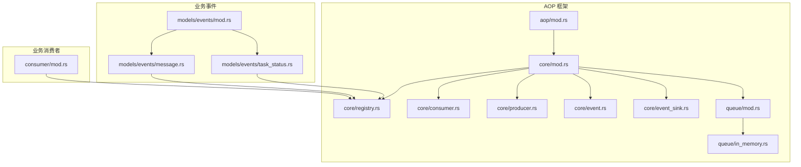
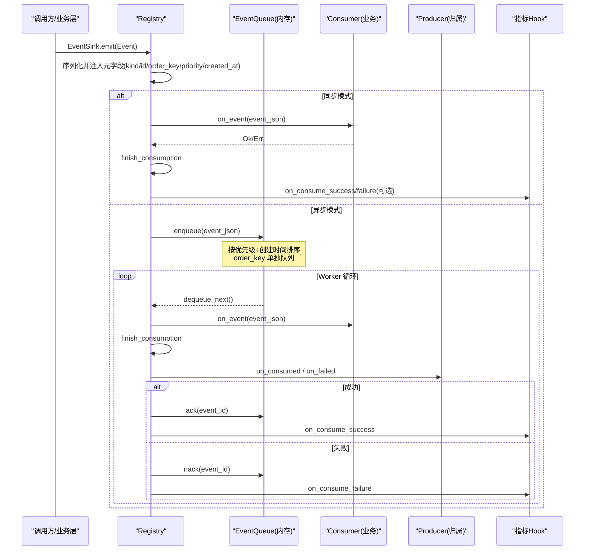
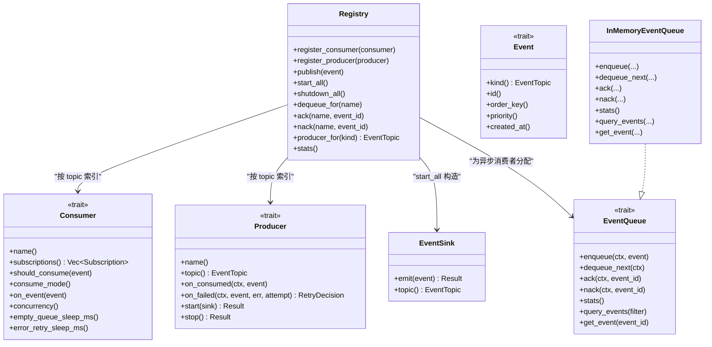

# AOP 核心架构

<cite>
**本文引用的文件**
- [src/pkg/aop/mod.rs](src/pkg/aop/mod.rs)
- [src/pkg/aop/core/mod.rs](src/pkg/aop/core/mod.rs)
- [src/pkg/aop/core/event.rs](src/pkg/aop/core/event.rs)
- [src/pkg/aop/core/producer.rs](src/pkg/aop/core/producer.rs)
- [src/pkg/aop/core/consumer.rs](src/pkg/aop/core/consumer.rs)
- [src/pkg/aop/core/event_sink.rs](src/pkg/aop/core/event_sink.rs)
- [src/pkg/aop/core/registry.rs](src/pkg/aop/core/registry.rs)
- [src/pkg/aop/queue/mod.rs](src/pkg/aop/queue/mod.rs)
- [src/pkg/aop/queue/in_memory.rs](src/pkg/aop/queue/in_memory.rs)
- [common/src/enums/event_topic.rs](common/src/enums/event_topic.rs)
- [src/models/events/mod.rs](src/models/events/mod.rs)
- [src/models/events/message.rs](src/models/events/message.rs)
- [src/models/events/task_status.rs](src/models/events/task_status.rs)
- [src/consumer/mod.rs](src/consumer/mod.rs)
</cite>

## 更新摘要
**变更内容**
- 事件类型标识由已删除的 `EventKind` 收敛为 `common::enums::EventTopic`；`Event::kind()` 现返回 `EventTopic`
- 消费者订阅由 `interested_events()` 改为 `subscriptions() -> Vec<Subscription>`（`kind`/`ordered`/`notify_producer`）
- 生产者 trait 改形：删除 `register()`/`poll()`/`poll_interval_secs()`，新增 `topic()`/`on_consumed()`/`on_failed()`/`start(EventSink)`/`stop()`；轮询由 `ProducerLoop` 自管
- 删除 `Consumer::ack/nack`（及 `source` 分发）；收尾统一在 `Registry::finish_consumption` 按 topic 反查生产者回调
- 引入 `EventSink`（预绑定 topic，强制执行 1 producer : 1 topic）与 `RetryDecision { Retry, Discard }`（无 max_retry、无死信）
- `Registry::register_producer` 改为同步；`self_ref`/`Weak` 已删除，不再有 Scheduler 类

## 目录
1. [简介](#简介)
2. [项目结构](#项目结构)
3. [核心组件](#核心组件)
4. [架构总览](#架构总览)
5. [详细组件分析](#详细组件分析)
6. [依赖关系分析](#依赖关系分析)
7. [性能考量](#性能考量)
8. [故障排查指南](#故障排查指南)
9. [结论](#结论)
10. [附录：事件定义与使用示例](#附录：事件定义与使用示例)

## 简介
本文件围绕 AOP 事件系统的核心架构进行系统化说明，覆盖事件中心设计理念、Event 抽象接口、EventTopic 主题枚举、事件元数据结构与生命周期管理、Producer 生产者模式、Consumer 消费者 trait、Registry 注册中心、队列实现、事件生命周期管理、异步处理机制、错误处理与性能优化策略。同时给出事件定义规范、注册流程、发布消费模式的完整示例路径，并解释与其他模块的集成方式与扩展点设计。

## 项目结构
AOP 事件系统位于 src/pkg/aop 下，采用"纯框架、无业务感知"的设计原则：
- core：定义 Event、Consumer、Producer、Registry、EventSink 等核心抽象与调度逻辑
- queue：底层队列抽象与内存实现（InMemoryEventQueue）
- mod：暴露全局 Registry 单例与便捷 publish/init_all API
- models/events：领域事件定义（如消息创建、任务状态变更等），由业务层实现 Event trait
- consumer：业务消费者注册入口，统一在 init 中完成注册

图示来源
- [src/pkg/aop/mod.rs#L1-L61](src/pkg/aop/mod.rs#L1-L61)
- [src/pkg/aop/core/mod.rs#L1-L14](src/pkg/aop/core/mod.rs#L1-L14)
- [src/pkg/aop/core/registry.rs#L15-L123](src/pkg/aop/core/registry.rs#L15-L123)
- [src/pkg/aop/core/consumer.rs#L21-L112](src/pkg/aop/core/consumer.rs#L21-L112)
- [src/pkg/aop/core/producer.rs#L11-L154](src/pkg/aop/core/producer.rs#L11-L154)
- [src/pkg/aop/core/event.rs#L1-L17](src/pkg/aop/core/event.rs#L1-L17)
- [src/pkg/aop/core/event_sink.rs#L1-L54](src/pkg/aop/core/event_sink.rs#L1-L54)
- [src/pkg/aop/queue/mod.rs#L1-L107](src/pkg/aop/queue/mod.rs#L1-L107)
- [src/pkg/aop/queue/in_memory.rs#L1-L449](src/pkg/aop/queue/in_memory.rs#L1-L449)
- [src/models/events/mod.rs#L1-L37](src/models/events/mod.rs#L1-L37)
- [src/models/events/message.rs#L1-L53](src/models/events/message.rs#L1-L53)
- [src/models/events/task_status.rs#L1-L66](src/models/events/task_status.rs#L1-L66)
- [src/consumer/mod.rs#L1-L43](src/consumer/mod.rs#L1-L43)

章节来源
- [src/pkg/aop/mod.rs#L1-L61](src/pkg/aop/mod.rs#L1-L61)
- [src/pkg/aop/core/mod.rs#L1-L14](src/pkg/aop/core/mod.rs#L1-L14)

## 核心组件
- Event 抽象：统一事件数据结构与元信息（kind 为 `EventTopic`/id/order_key/priority/created_at），所有领域事件需实现该 trait。
- Consumer 消费者：支持同步/异步两种消费模式；通过 `subscriptions()` 声明订阅的 `EventTopic`、`ordered` 与 `notify_producer`，不再有 ack/nack。
- Producer 生产者：拥有某 topic 业务收尾能力的对象，经 `start(EventSink)`/`stop()` 管理生命周期，提供 `on_consumed`/`on_failed`。
- Registry 注册中心：按 topic 维护消费者与生产者索引，负责事件分发、队列路由、worker 启动、收尾回调反查与指标埋点注入。
- Queue 队列：抽象出 enqueue/dequeue/ack/nack/stats/query 等能力，当前提供 InMemoryEventQueue 实现，支持优先级、order_key 顺序、in_progress 跟踪与统计查询。

章节来源
- [src/pkg/aop/core/event.rs#L1-L17](src/pkg/aop/core/event.rs#L1-L17)
- [src/pkg/aop/core/consumer.rs#L21-L112](src/pkg/aop/core/consumer.rs#L21-L112)
- [src/pkg/aop/core/producer.rs#L11-L154](src/pkg/aop/core/producer.rs#L11-L154)
- [src/pkg/aop/core/registry.rs#L15-L123](src/pkg/aop/core/registry.rs#L15-L123)
- [src/pkg/aop/queue/mod.rs#L1-L107](src/pkg/aop/queue/mod.rs#L1-L107)
- [src/pkg/aop/queue/in_memory.rs#L1-L449](src/pkg/aop/queue/in_memory.rs#L1-L449)

## 架构总览
AOP 事件系统以 Registry 为核心，将事件从 Producer 或业务调用方经 `EventSink::emit` 发布后，按 `EventTopic` 路由到对应 Consumer。同步模式直接在发布线程执行 on_event；异步模式入队并由独立 worker 拉取处理，经 `finish_consumption` 判定 Ack/Nack 与生产者回调。队列层通过 order_key 保证同 key 的顺序性，并通过优先级与创建时间决定出队顺序。

图示来源
- [src/pkg/aop/core/registry.rs#L142-L271](src/pkg/aop/core/registry.rs#L142-L271)
- [src/pkg/aop/core/registry.rs#L343-L562](src/pkg/aop/core/registry.rs#L343-L562)
- [src/pkg/aop/core/registry.rs#L734-L802](src/pkg/aop/core/registry.rs#L734-L802)
- [src/pkg/aop/queue/in_memory.rs#L104-L267](src/pkg/aop/queue/in_memory.rs#L104-L267)

## 详细组件分析

### Event 抽象接口
- kind：事件主题（`EventTopic`），用于路由到对应消费者与反查生产者归属
- id：唯一事件 ID，用于 ack/nack 与去重
- order_key：顺序键，相同 key 的事件串行处理
- priority：优先级，越大越优先
- created_at：创建时间，用于排序与监控

典型实现：
- MessageCreatedEvent：根据接收者角色选择 order_key（Agent 用 to_id，非 Agent 用 task_id→project_id 降级）
- TaskStatusChangedEvent：以 task_id 作为 order_key，确保同一任务的状态变更有序

章节来源
- [src/pkg/aop/core/event.rs#L1-L17](src/pkg/aop/core/event.rs#L1-L17)
- [src/models/events/message.rs#L1-L53](src/models/events/message.rs#L1-L53)
- [src/models/events/task_status.rs#L1-L66](src/models/events/task_status.rs#L1-L66)
- [common/src/enums/event_topic.rs#L28-L65](common/src/enums/event_topic.rs#L28-L65)

### Producer 生产者模式
- name：生产者名称（日志与排障用）
- topic：归属的事件主题（`EventTopic`），声明 1 producer : 1 topic
- start/stop：生命周期管理；`start(EventSink)` 必须 spawn 后**立即返回**，`stop()` 必须置位并 await `JoinHandle`
- on_consumed：消费成功或 Discard 后的业务收尾（先于 queue.ack，必须幂等）
- on_failed：每次尝试失败回调，返回 `RetryDecision`（Retry/Nack 或 Discard/Ack）
- 轮询机制：由 `ProducerLoop`（AtomicBool + 250ms 可中断 sleep）自管，不再有 `poll()`/`poll_interval_secs()`

章节来源
- [src/pkg/aop/core/producer.rs#L11-L154](src/pkg/aop/core/producer.rs#L11-L154)
- [src/pkg/aop/core/event_sink.rs#L1-L54](src/pkg/aop/core/event_sink.rs#L1-L54)
- [src/pkg/aop/core/registry.rs#L550-L562](src/pkg/aop/core/registry.rs#L550-L562)

### Consumer 消费者 trait
- name：消费者名称（全局唯一）
- subscriptions：订阅声明列表 `Vec<Subscription>`（`kind: EventTopic`、`ordered: bool`、`notify_producer: bool`）
- should_consume：事件过滤（默认全部通过）
- consume_mode：同步/异步模式
- on_event：核心处理逻辑
- concurrency：并发 worker 数量（仅异步生效）
- empty_queue_sleep_ms/error_retry_sleep_ms：轮询节奏控制
- 已删除 ack/nack：`Consumer::ack/nack` 与 `source` 分发整体删除，收尾由 `finish_consumption` 按 topic 反查生产者回调

章节来源
- [src/pkg/aop/core/consumer.rs#L21-L112](src/pkg/aop/core/consumer.rs#L21-L112)
- [src/pkg/aop/core/registry.rs#L734-L802](src/pkg/aop/core/registry.rs#L734-L802)

### Registry 注册中心
职责：
- 注册消费者与生产者（register_consumer / register_producer，均为同步）
- 发布事件：序列化并注入元字段，按 `EventTopic` 路由到订阅消费者
- 启动调度：先做校验（声明 `notify_producer` 的 topic 缺生产者 → 启动 Err，早于 started 置位），再为每个异步消费者启动指定数量的 worker，并逐个 `EventSink::new(registry, topic)` + `producer.start(sink)`
- 收尾反查：按 `kind` 解析 `EventTopic` ∧ 消费者对该 kind 声明 `notify_producer` ∧ `producer_for(kind)` 存在 → 回调，否则 ①类纯通知零回调
- 指标采集：通过可插拔 Hook 记录发布、消费开始/成功/失败/丢弃
- 队列管理：为异步消费者分配独立队列，提供 dequeue/ack/nack/stats/query

关键流程：
- publish：提取元字段 → 序列化 → 注入元字段 → 同步直接调用 or 异步入队
- start_all：先校验 → 原子标记 started → 启动 worker 循环 → 启动生产者（start(sink)）

章节来源
- [src/pkg/aop/core/registry.rs#L15-L123](src/pkg/aop/core/registry.rs#L15-L123)
- [src/pkg/aop/core/registry.rs#L343-L602](src/pkg/aop/core/registry.rs#L343-L602)
- [src/pkg/aop/core/registry.rs#L734-L802](src/pkg/aop/core/registry.rs#L734-L802)

### 队列实现（InMemoryEventQueue）
数据结构：
- events：事件内容映射（event_id → json）
- queues：按 order_key 划分的 BinaryHeap（优先级队列）
- global_heap：全局优先级堆（无 order_key 或各 order_key 的活跃头）
- in_progress：正在处理的事件（event_id → (ref, order_key)）
- has_active_message：标记某 order_key 是否有活跃消息

算法要点：
- enqueue：去重 → 插入 events → 若 order_key 为空则入 global_heap；否则入对应 order_key 队列，若队列为空且无活跃消息则将队首推入 global_heap
- dequeue_next：从 global_heap 弹出，注入 `EventRef.attempt` 后放入 in_progress 并返回
- ack：从 in_progress 移除，删除 events；若有下一个元素则推回 global_heap 并更新 has_active_message
- nack：从 in_progress 移除并重新入 global_heap，保持 has_active_message=true

统计与查询：
- stats：pending_count、in_progress_count、order_keys 分布、最老事件年龄
- query_events/get_event：支持分页、过滤、脱敏预览

章节来源
- [src/pkg/aop/queue/mod.rs#L1-L107](src/pkg/aop/queue/mod.rs#L1-L107)
- [src/pkg/aop/queue/in_memory.rs#L1-L449](src/pkg/aop/queue/in_memory.rs#L1-L449)

### 事件生命周期管理
- 发布阶段：Registry 经 `EventSink` 序列化并注入元字段，记录 on_publish 指标
- 消费阶段：
  - 同步：on_event 直接执行，经 `finish_consumption` 判定收尾
  - 异步：worker 循环 dequeue → on_event → `finish_consumption` → 队列 ack/nack
- 重试与退避：on_event 失败 → `on_failed` 返回 `Retry` → queue.nack 并 sleep(error_retry_sleep_ms)；`Discard` → queue.ack（仍回调 on_consumed）
- 顺序保证：order_key 相同的消息串行处理，通过 has_active_message 与队列头管理

章节来源
- [src/pkg/aop/core/registry.rs#L142-L271](src/pkg/aop/core/registry.rs#L142-L271)
- [src/pkg/aop/core/registry.rs#L343-L562](src/pkg/aop/core/registry.rs#L343-L562)
- [src/pkg/aop/core/registry.rs#L734-L802](src/pkg/aop/core/registry.rs#L734-L802)
- [src/pkg/aop/queue/in_memory.rs#L104-L267](src/pkg/aop/queue/in_memory.rs#L104-L267)

### 异步处理机制
- 每个异步消费者拥有独立队列与多个 worker 协程
- worker 循环：dequeue → on_event → `finish_consumption` → queue ack/nack → sleep（空队列或错误）
- 并发度由 consumer.concurrency() 控制
- 生产者自管循环：由 `ProducerLoop` 驱动，`start()` 后 spawn 立即返回，不再由 Registry 定时 poll

章节来源
- [src/pkg/aop/core/registry.rs#L343-L562](src/pkg/aop/core/registry.rs#L343-L562)
- [src/pkg/aop/core/producer.rs#L105-L154](src/pkg/aop/core/producer.rs#L105-L154)
- [src/pkg/aop/core/consumer.rs#L21-L112](src/pkg/aop/core/consumer.rs#L21-L112)

### 错误处理
- 序列化失败：记录错误并跳过该事件
- 消费者同步错误：经 `finish_consumption` 判定，记录错误并上报指标
- 异步 on_event 失败：调 `on_failed` 得 `RetryDecision`，`Retry` → nack 并 sleep，`Discard` → ack 且记 `on_consume_discarded`
- 队列操作失败：记录错误但不中断主流程
- 回调失败：`on_consumed`/`on_failed` 失败只记日志，不改投递结论（避免卡住队列）

章节来源
- [src/pkg/aop/core/registry.rs#L142-L271](src/pkg/aop/core/registry.rs#L142-L271)
- [src/pkg/aop/core/registry.rs#L734-L802](src/pkg/aop/core/registry.rs#L734-L802)

### 性能优化策略
- 优先级 + 创建时间排序：BinaryHeap 保证高优先级先出，同优先级先进先出
- order_key 顺序控制：减少跨 worker 竞争，降低 busy 状态重试开销
- 去重：events map 防止重复事件入队
- 最小锁粒度：队列内部使用 Mutex 保护关键区，尽量缩短持锁时间
- 退避策略：error_retry_sleep_ms 与 empty_queue_sleep_ms 避免忙等
- 指标零开销：未注入 Hook 时不产生额外开销

章节来源
- [src/pkg/aop/queue/in_memory.rs#L104-L267](src/pkg/aop/queue/in_memory.rs#L104-L267)
- [src/pkg/aop/core/registry.rs#L343-L562](src/pkg/aop/core/registry.rs#L343-L562)

## 依赖关系分析
- Registry 依赖 Consumer、Producer、EventQueue、EventSink、RequestContext、AopMetricsHook
- InMemoryEventQueue 依赖 RequestContext、serde_json、标准库容器
- 业务事件（MessageCreatedEvent、TaskStatusChangedEvent）依赖 Event trait 与 `EventTopic`
- consumer::init 统一注册业务消费者到 Registry；生产者由拥有归属的对象（DAL/Producer）在装配期 `register_producer`

图示来源
- [src/pkg/aop/core/registry.rs#L15-L123](src/pkg/aop/core/registry.rs#L15-L123)
- [src/pkg/aop/core/consumer.rs#L21-L112](src/pkg/aop/core/consumer.rs#L21-L112)
- [src/pkg/aop/core/producer.rs#L11-L154](src/pkg/aop/core/producer.rs#L11-L154)
- [src/pkg/aop/core/event.rs#L1-L17](src/pkg/aop/core/event.rs#L1-L17)
- [src/pkg/aop/core/event_sink.rs#L1-L54](src/pkg/aop/core/event_sink.rs#L1-L54)
- [src/pkg/aop/queue/mod.rs#L1-L107](src/pkg/aop/queue/mod.rs#L1-L107)
- [src/pkg/aop/queue/in_memory.rs#L1-L449](src/pkg/aop/queue/in_memory.rs#L1-L449)

章节来源
- [src/pkg/aop/core/registry.rs#L15-L123](src/pkg/aop/core/registry.rs#L15-L123)
- [src/pkg/aop/queue/mod.rs#L1-L107](src/pkg/aop/queue/mod.rs#L1-L107)

## 性能考量
- 队列复杂度：入队 O(log n)（BinaryHeap），出队 O(log n)，查询 O(n)（受分页限制）
- 锁竞争：队列内部使用单一 Mutex，建议合理设置 concurrency 避免过多 worker 争抢
- 内存占用：events map 存储完整 JSON，注意大事件体对内存的影响
- 顺序与并行：order_key 串行化可能成为瓶颈，应合理拆分 order_key 粒度
- 指标开销：仅在注入 Hook 时产生，默认零开销

[本节为通用性能讨论，不直接分析具体文件]

## 故障排查指南
常见问题与定位：
- 事件未消费：检查消费者是否注册、`subscriptions` 的 `kind` 是否匹配、consume_mode 是否正确
- 顺序错乱：确认 order_key 设置是否符合预期（如 MessageCreatedEvent 的 Agent 维度串行）
- 队列堆积：查看 queue.stats 中的 pending_count 与 oldest_event_age_secs，调整 concurrency 或优化 on_event 耗时
- 业务收尾丢失/启动失败：声明 `notify_producer` 的 topic 缺生产者 → `start_all` 返回 Err（早于 started 置位）
- 频繁重试：关注 `on_failed` 返回的 `RetryDecision`；框架无 max_retry，需生产者自行 Discard
- 死锁风险：Registry.start_all 已避免长持锁，确保消费者 on_event 不长时间持有外部锁

章节来源
- [src/pkg/aop/core/registry.rs#L343-L602](src/pkg/aop/core/registry.rs#L343-L602)
- [src/pkg/aop/queue/in_memory.rs#L300-L449](src/pkg/aop/queue/in_memory.rs#L300-L449)

## 结论
AOP 事件系统以 Registry 为中心，结合 Event/Consumer/Producer/Queue 抽象与 `EventSink` 的 1 producer : 1 topic 强制约束，提供了轻量、可扩展、可观测的事件分发与调度能力。通过 order_key 与优先级保障顺序与时效，通过 `finish_consumption` 单一出口与 `RetryDecision` 提升可靠性，通过指标 Hook 实现可观测性。业务层只需实现事件与消费者/生产者，即可无缝接入。

[本节为总结性内容，不直接分析具体文件]

## 附录：事件定义与使用示例

### 事件定义规范
- 实现 Event trait：提供 kind（`EventTopic`）/id/order_key/priority/created_at
- 推荐为每个事件定义独立的 struct，便于序列化与反序列化
- order_key 设计应遵循业务语义（如任务级、会话级、Agent 级）

参考实现：
- MessageCreatedEvent：按接收者角色选择 order_key
- TaskStatusChangedEvent：以 task_id 作为 order_key

章节来源
- [src/models/events/message.rs#L1-L53](src/models/events/message.rs#L1-L53)
- [src/models/events/task_status.rs#L1-L66](src/models/events/task_status.rs#L1-L66)
- [src/models/events/mod.rs#L1-L37](src/models/events/mod.rs#L1-L37)

### 注册流程
- 在 consumer::init 中注册所有业务消费者（声明 subscriptions）
- 拥有 topic 归属的对象（如 MessageDalImpl）在装配期 `register_producer`
- 启动时调用 aop::init_all 启动 worker 与生产者自管循环

章节来源
- [src/consumer/mod.rs#L1-L43](src/consumer/mod.rs#L1-L43)
- [src/pkg/aop/mod.rs#L1-L61](src/pkg/aop/mod.rs#L1-L61)
- [src/pkg/aop/core/registry.rs#L102-L123](src/pkg/aop/core/registry.rs#L102-L123)

### 发布消费模式示例
- 发布事件：生产者经 `EventSink::emit(event)` 发布
- 同步消费：实现 Consumer 并返回 ConsumeMode::Sync
- 异步消费：实现 Consumer 并返回 ConsumeMode::Async，由 worker 拉取处理，收尾在 `finish_consumption`

章节来源
- [src/pkg/aop/mod.rs#L1-L61](src/pkg/aop/mod.rs#L1-L61)
- [src/pkg/aop/core/consumer.rs#L21-L112](src/pkg/aop/core/consumer.rs#L21-L112)

### 与其他模块的集成方式
- 业务 DAL/Domain：通过发布事件解耦副作用（如任务状态变更后通知 Owner Agent）；生产者由归属对象自身实现
- 前端/HTTP：通过 Handler 触发 Domain 操作，Domain 发布事件，消费者异步处理
- 监控：注入 AopMetricsHook 采集发布与消费指标

章节来源
- [src/models/events/task_status.rs#L1-L66](src/models/events/task_status.rs#L1-L66)
- [src/pkg/aop/core/registry.rs#L15-L123](src/pkg/aop/core/registry.rs#L15-L123)

### 扩展点设计
- 新增事件：定义事件 struct 并实现 Event trait
- 新增消费者：实现 Consumer trait 并在 consumer::init 注册（声明 subscriptions）
- 新增生产者：拥有归属的对象实现 Producer trait（topic/on_consumed/on_failed/start/stop），装配期 register_producer
- 自定义队列：实现 EventQueue trait 替换 InMemoryEventQueue（如持久化队列）

章节来源
- [src/pkg/aop/core/producer.rs#L11-L154](src/pkg/aop/core/producer.rs#L11-L154)
- [src/pkg/aop/queue/mod.rs#L1-L107](src/pkg/aop/queue/mod.rs#L1-L107)
