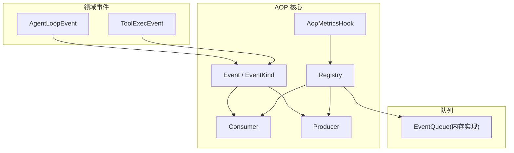
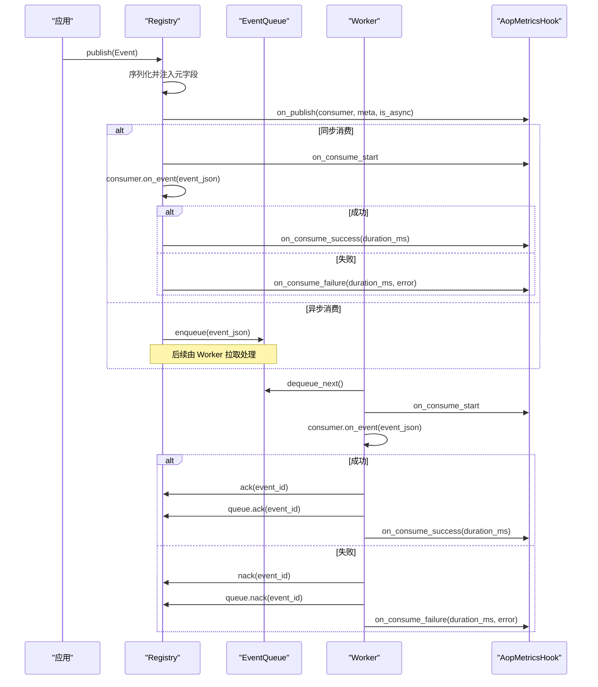
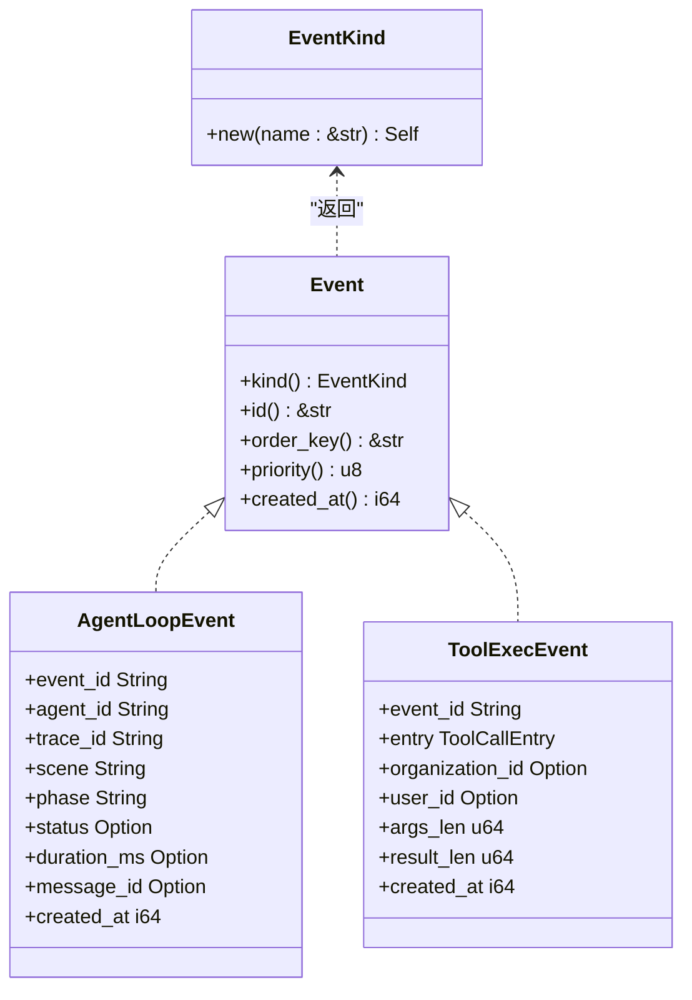
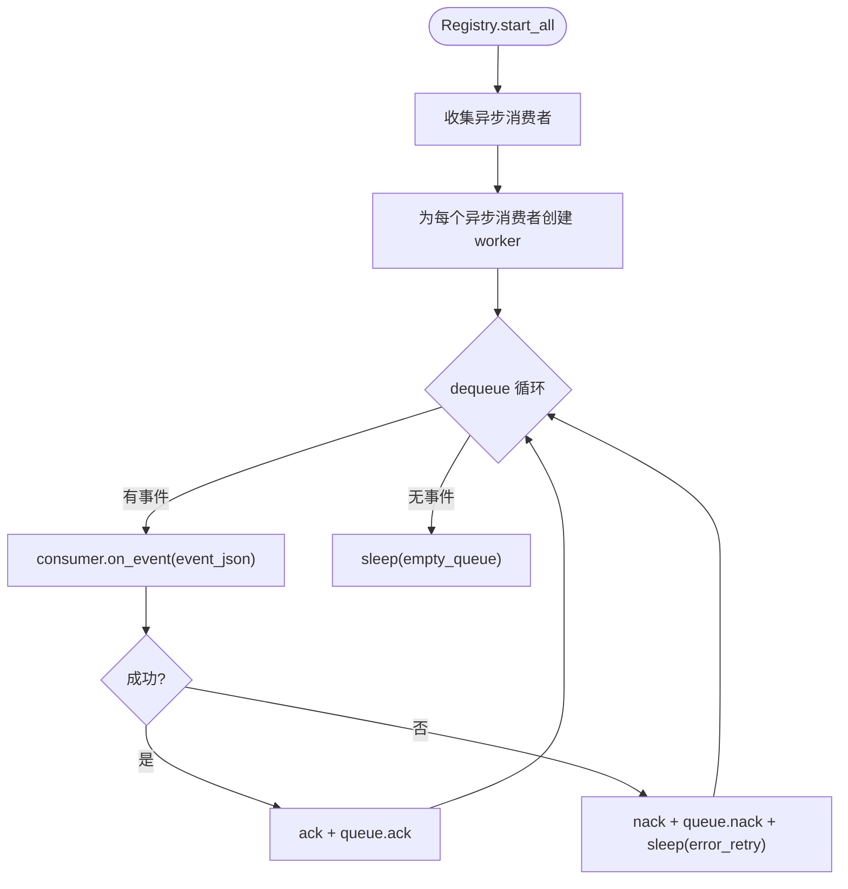
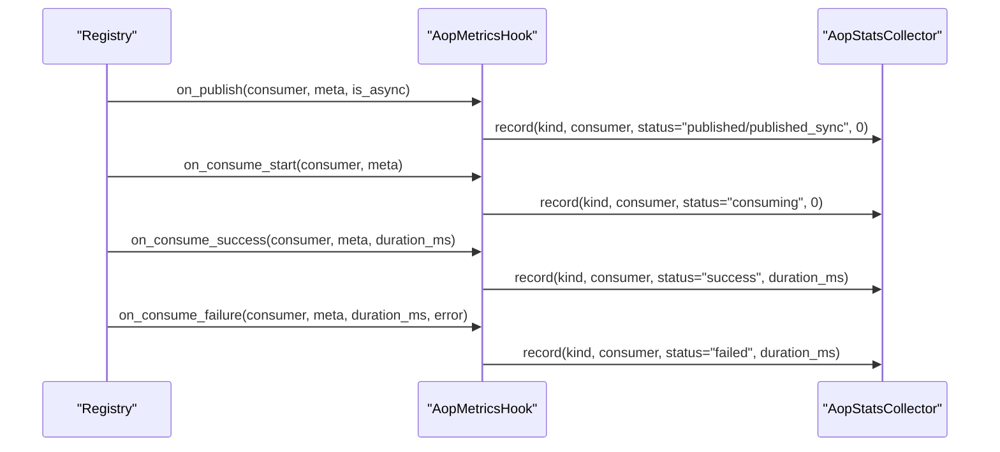
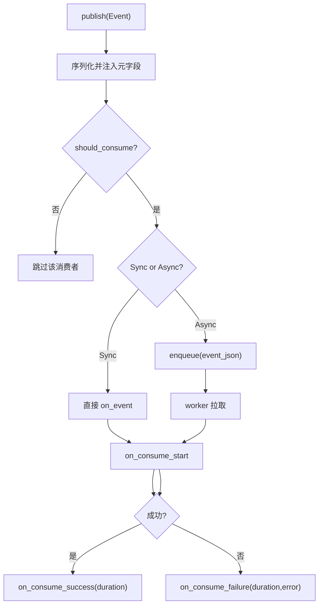
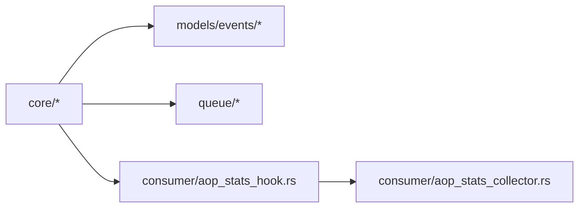

# 事件系统核心

<cite>
**本文引用的文件**
- [src/pkg/aop/core/event.rs](src/pkg/aop/core/event.rs)
- [src/pkg/aop/core/consumer.rs](src/pkg/aop/core/consumer.rs)
- [src/pkg/aop/core/producer.rs](src/pkg/aop/core/producer.rs)
- [src/pkg/aop/core/metrics_hook.rs](src/pkg/aop/core/metrics_hook.rs)
- [src/pkg/aop/core/registry.rs](src/pkg/aop/core/registry.rs)
- [src/models/events/mod.rs](src/models/events/mod.rs)
- [src/models/events/agent_loop.rs](src/models/events/agent_loop.rs)
- [src/models/events/tool_exec.rs](src/models/events/tool_exec.rs)
- [src/consumer/aop_stats_collector.rs](src/consumer/aop_stats_collector.rs)
- [src/consumer/aop_stats_hook.rs](src/consumer/aop_stats_hook.rs)
</cite>

## 目录
1. [简介](#简介)
2. [项目结构](#项目结构)
3. [核心组件](#核心组件)
4. [架构总览](#架构总览)
5. [详细组件分析](#详细组件分析)
6. [依赖关系分析](#依赖关系分析)
7. [性能考量](#性能考量)
8. [故障排查指南](#故障排查指南)
9. [结论](#结论)
10. [附录：事件定义规范与扩展点](#附录：事件定义规范与扩展点)

## 简介
本文件聚焦 AOP 事件系统的核心组件，系统性阐述 Event 抽象接口的设计理念、EventKind 枚举、事件元数据结构与生命周期管理；深入解释 AopEventMeta 与 AopMetricsHook 的作用机制（事件统计收集、性能监控与数据追踪）；给出事件定义规范、序列化格式与扩展点设计；并提供具体代码示例路径，展示如何定义自定义事件类型和处理事件元数据。

## 项目结构
AOP 事件系统位于 src/pkg/aop 下，采用“核心接口 + 运行时注册中心 + 队列 + 指标 Hook”的分层组织：
- core：定义 Event、Consumer、Producer、Registry、Scheduler、AopMetricsHook 等核心抽象与实现
- queue：事件队列抽象与内存实现
- impls：面向业务场景的 Producer/Consumer 实现（如消息、定时任务）
- models/events：领域事件模型（AgentLoop、ToolExec 等），实现 Event trait

图表来源
- [src/pkg/aop/core/event.rs:1-25](src/pkg/aop/core/event.rs#L1-L25)
- [src/pkg/aop/core/consumer.rs:1-72](src/pkg/aop/core/consumer.rs#L1-L72)
- [src/pkg/aop/core/producer.rs:1-36](src/pkg/aop/core/producer.rs#L1-L36)
- [src/pkg/aop/core/registry.rs:1-561](src/pkg/aop/core/registry.rs#L1-L561)
- [src/pkg/aop/core/metrics_hook.rs:1-90](src/pkg/aop/core/metrics_hook.rs#L1-L90)
- [src/models/events/agent_loop.rs:1-79](src/models/events/agent_loop.rs#L1-L79)
- [src/models/events/tool_exec.rs:1-65](src/models/events/tool_exec.rs#L1-L65)

章节来源
- [src/pkg/aop/core/mod.rs:1-14](src/pkg/aop/core/mod.rs#L1-L14)
- [src/models/events/mod.rs:1-21](src/models/events/mod.rs#L1-L21)

## 核心组件
- Event 与 EventKind：统一的事件抽象与类型标识，提供 id、order_key、priority、created_at 等元信息钩子
- Consumer：事件消费者，支持同步/异步两种消费模式，具备 ack/nack、并发度与轮询退避配置
- Producer：事件生产者，支持启动/停止与轮询模式
- Registry：事件注册与调度中心，负责消费者注册、事件发布、队列路由、工作线程启动、指标 Hook 调用
- AopEventMeta/AopMetricsHook：从事件 JSON 提取元信息并注入到四个生命周期回调（on_publish/on_consume_start/on_consume_success/on_consume_failure），用于统计与追踪

章节来源
- [src/pkg/aop/core/event.rs:1-25](src/pkg/aop/core/event.rs#L1-L25)
- [src/pkg/aop/core/consumer.rs:1-72](src/pkg/aop/core/consumer.rs#L1-L72)
- [src/pkg/aop/core/producer.rs:1-36](src/pkg/aop/core/producer.rs#L1-L36)
- [src/pkg/aop/core/metrics_hook.rs:1-90](src/pkg/aop/core/metrics_hook.rs#L1-L90)
- [src/pkg/aop/core/registry.rs:1-561](src/pkg/aop/core/registry.rs#L1-L561)

## 架构总览
AOP 事件系统在启动时由服务层初始化，注册所有 Producer/Consumer，并通过 Registry::start_all 启动异步消费者的 worker 与可选的轮询 Producer。发布事件时，Registry 将事件序列化为 JSON，并在顶层注入统一的元字段（event_id、kind、order_key、priority、created_at），随后按消费者兴趣分发，触发指标 Hook 与消费流程。

图表来源
- [src/pkg/aop/core/registry.rs:97-206](src/pkg/aop/core/registry.rs#L97-L206)
- [src/pkg/aop/core/registry.rs:208-449](src/pkg/aop/core/registry.rs#L208-L449)
- [src/pkg/aop/core/metrics_hook.rs:16-89](src/pkg/aop/core/metrics_hook.rs#L16-L89)

## 详细组件分析

### Event 抽象与 EventKind
- EventKind：静态字符串标识事件类型，作为消费者路由键
- Event trait：要求实现 kind()/id()，并提供 order_key()/priority()/created_at() 等可选钩子，用于顺序保证、优先级与时间戳
- 典型实现：AgentLoopEvent、ToolExecEvent 等

图表来源
- [src/pkg/aop/core/event.rs:1-25](src/pkg/aop/core/event.rs#L1-L25)
- [src/models/events/agent_loop.rs:1-79](src/models/events/agent_loop.rs#L1-L79)
- [src/models/events/tool_exec.rs:1-65](src/models/events/tool_exec.rs#L1-L65)

章节来源
- [src/pkg/aop/core/event.rs:1-25](src/pkg/aop/core/event.rs#L1-L25)
- [src/models/events/agent_loop.rs:1-79](src/models/events/agent_loop.rs#L1-L79)
- [src/models/events/tool_exec.rs:1-65](src/models/events/tool_exec.rs#L1-L65)

### 消费者与生产者的生命周期
- Consumer：name()/interested_events()/should_consume()/consume_mode()/on_event()/ack()/nack()/concurrency()/empty_queue_sleep_ms()/error_retry_sleep_ms()
- Producer：name()/register()/start()/stop()/poll_interval_secs()/poll()
- Registry：维护消费者映射、生产者列表、队列集合，负责 start_all 启动 worker 与轮询 producer

图表来源
- [src/pkg/aop/core/registry.rs:260-449](src/pkg/aop/core/registry.rs#L260-L449)
- [src/pkg/aop/core/consumer.rs:1-72](src/pkg/aop/core/consumer.rs#L1-L72)

章节来源
- [src/pkg/aop/core/consumer.rs:1-72](src/pkg/aop/core/consumer.rs#L1-L72)
- [src/pkg/aop/core/producer.rs:1-36](src/pkg/aop/core/producer.rs#L1-L36)
- [src/pkg/aop/core/registry.rs:260-449](src/pkg/aop/core/registry.rs#L260-L449)

### 事件元数据与指标采集（AopEventMeta 与 AopMetricsHook）
- AopEventMeta：从事件 JSON 顶层提取 event_id、kind、order_key、priority、created_at
- AopMetricsHook：在四个关键节点回调，默认空实现零开销；通过 Registry.set_metrics_hook 注入
- 业务实现：AopStatsHook 将回调转为对 AopStatsCollector.record 的后台任务调用，避免阻塞主流程

图表来源
- [src/pkg/aop/core/metrics_hook.rs:16-89](src/pkg/aop/core/metrics_hook.rs#L16-L89)
- [src/consumer/aop_stats_hook.rs:1-118](src/consumer/aop_stats_hook.rs#L1-L118)
- [src/consumer/aop_stats_collector.rs:1-307](src/consumer/aop_stats_collector.rs#L1-L307)

章节来源
- [src/pkg/aop/core/metrics_hook.rs:1-90](src/pkg/aop/core/metrics_hook.rs#L1-L90)
- [src/consumer/aop_stats_hook.rs:1-118](src/consumer/aop_stats_hook.rs#L1-L118)
- [src/consumer/aop_stats_collector.rs:1-307](src/consumer/aop_stats_collector.rs#L1-L307)

### 事件发布与消费流程（含顺序与重试）
- 发布阶段：序列化事件并注入元字段；根据消费者兴趣过滤；触发 on_publish；按消费模式选择同步或入队
- 消费阶段：异步模式下 worker 拉取事件；成功则 ack + queue.ack；失败则 nack + queue.nack 并退避重试
- 顺序保证：order_key 用于同 key 的顺序控制（例如 agent_id、tool 执行日志顺序）

图表来源
- [src/pkg/aop/core/registry.rs:97-206](src/pkg/aop/core/registry.rs#L97-L206)
- [src/pkg/aop/core/registry.rs:208-449](src/pkg/aop/core/registry.rs#L208-L449)

章节来源
- [src/pkg/aop/core/registry.rs:97-206](src/pkg/aop/core/registry.rs#L97-L206)
- [src/pkg/aop/core/registry.rs:208-449](src/pkg/aop/core/registry.rs#L208-L449)

## 依赖关系分析
- 模块内聚：core 仅暴露抽象与通用逻辑；models/events 实现具体事件；consumer/* 提供统计 Hook 与收集器
- 外部依赖：serde/serde_json 用于序列化；tokio 用于异步与后台任务；common/error 统一错误类型
- 耦合点：Registry 依赖 Queue、Hook、Consumer/Producer；Hook 依赖 Collector；Collector 使用 RuntimeStatsCollector

图表来源
- [src/pkg/aop/core/registry.rs:1-561](src/pkg/aop/core/registry.rs#L1-L561)
- [src/consumer/aop_stats_hook.rs:1-118](src/consumer/aop_stats_hook.rs#L1-L118)
- [src/consumer/aop_stats_collector.rs:1-307](src/consumer/aop_stats_collector.rs#L1-L307)

章节来源
- [src/pkg/aop/core/registry.rs:1-561](src/pkg/aop/core/registry.rs#L1-L561)
- [src/consumer/aop_stats_hook.rs:1-118](src/consumer/aop_stats_hook.rs#L1-L118)
- [src/consumer/aop_stats_collector.rs:1-307](src/consumer/aop_stats_collector.rs#L1-L307)

## 性能考量
- 零开销 Hook：未注入 AopMetricsHook 时，Registry 不执行任何额外逻辑
- 异步解耦：异步消费者通过队列与 worker 解耦，避免阻塞发布线程
- 退避策略：空队列与错误重试均设置休眠，防止 CPU 自旋
- 顺序与并发：order_key 保障顺序；concurrency 控制并行度；建议根据负载调优
- 统计开销：Hook 内部使用 tokio::spawn 异步记录，避免阻塞主流程

[本节为通用指导，无需特定文件引用]

## 故障排查指南
- 事件未消费：检查 interested_events 是否包含对应 EventKind；确认 should_consume 过滤条件
- 队列堆积：查看 queue_len 与 all_queue_stats；调整 concurrency 与 empty_queue_sleep_ms
- 频繁失败重试：关注 on_consume_failure 的错误信息；检查 on_event 实现与资源可用性
- 顺序错乱：确认 order_key 设置合理（如 agent_id、工具调用上下文）
- 指标缺失：确认已 set_metrics_hook 且 AopStatsHook 正常注入

章节来源
- [src/pkg/aop/core/registry.rs:208-449](src/pkg/aop/core/registry.rs#L208-L449)
- [src/consumer/aop_stats_hook.rs:1-118](src/consumer/aop_stats_hook.rs#L1-L118)

## 结论
AOP 事件系统以 Event 抽象为核心，配合 Registry 的统一调度与 AopMetricsHook 的可插拔指标采集，实现了高内聚、低耦合、可扩展的事件基础设施。通过顺序键、优先级与异步队列，兼顾了可靠性与性能；通过 Hook 机制，在不侵入业务的前提下完成统计与追踪。

[本节为总结性内容，无需特定文件引用]

## 附录：事件定义规范与扩展点

### 事件定义规范
- 必须实现 Event trait，提供 kind()/id()，并尽量实现 order_key()/priority()/created_at()
- 事件类型名（EventKind）建议使用语义化命名，如 "agent.loop"、"agent.tool.executed"
- 事件结构体需可序列化/反序列化（Serialize + DeserializeOwned）

章节来源
- [src/pkg/aop/core/event.rs:1-25](src/pkg/aop/core/event.rs#L1-L25)
- [src/models/events/agent_loop.rs:1-79](src/models/events/agent_loop.rs#L1-L79)
- [src/models/events/tool_exec.rs:1-65](src/models/events/tool_exec.rs#L1-L65)

### 序列化格式与元字段
- 发布时会将以下元字段注入到 JSON 顶层：event_id、kind、order_key、priority、created_at
- 这些元字段供队列与指标 Hook 读取，确保一致性与可观测性

章节来源
- [src/pkg/aop/core/registry.rs:116-142](src/pkg/aop/core/registry.rs#L116-L142)
- [src/pkg/aop/core/metrics_hook.rs:16-55](src/pkg/aop/core/metrics_hook.rs#L16-L55)

### 扩展点设计
- 自定义事件：新增 struct 实现 Event trait，并在 models/events 中导出
- 自定义消费者：实现 Consumer trait，注册到 Registry；按需实现 ack/nack 与并发参数
- 自定义生产者：实现 Producer trait，注册后由 Registry 启动（轮询或非轮询）
- 指标采集：实现 AopMetricsHook 并通过 Registry.set_metrics_hook 注入；可使用现有 AopStatsHook

章节来源
- [src/pkg/aop/core/consumer.rs:1-72](src/pkg/aop/core/consumer.rs#L1-L72)
- [src/pkg/aop/core/producer.rs:1-36](src/pkg/aop/core/producer.rs#L1-L36)
- [src/pkg/aop/core/registry.rs:38-47](src/pkg/aop/core/registry.rs#L38-L47)
- [src/consumer/aop_stats_hook.rs:1-118](src/consumer/aop_stats_hook.rs#L1-L118)

### 示例：定义自定义事件与处理元数据
- 定义事件类型：参考 AgentLoopEvent/ToolExecEvent 的实现路径
  - [src/models/events/agent_loop.rs:1-79](src/models/events/agent_loop.rs#L1-L79)
  - [src/models/events/tool_exec.rs:1-65](src/models/events/tool_exec.rs#L1-L65)
- 处理事件元数据：通过 AopEventMeta::from_json 获取 event_id/kind/order_key/priority/created_at
  - [src/pkg/aop/core/metrics_hook.rs:16-55](src/pkg/aop/core/metrics_hook.rs#L16-L55)