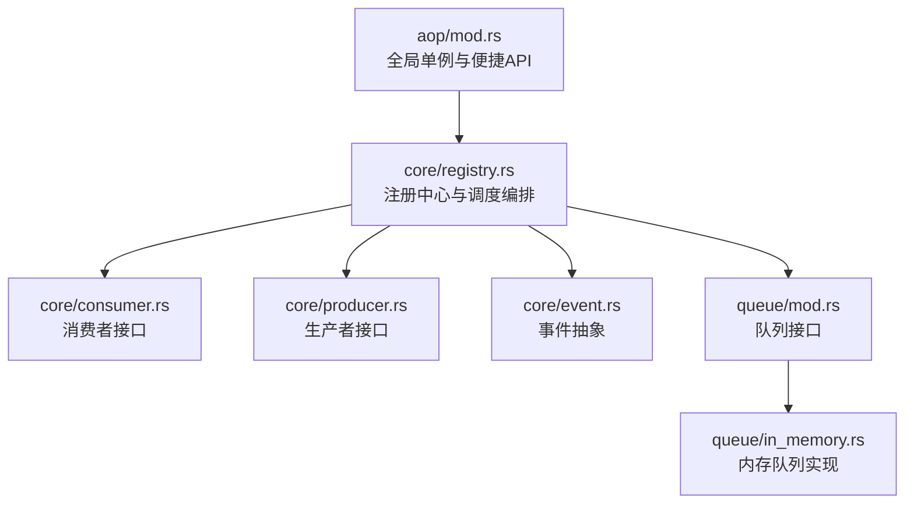
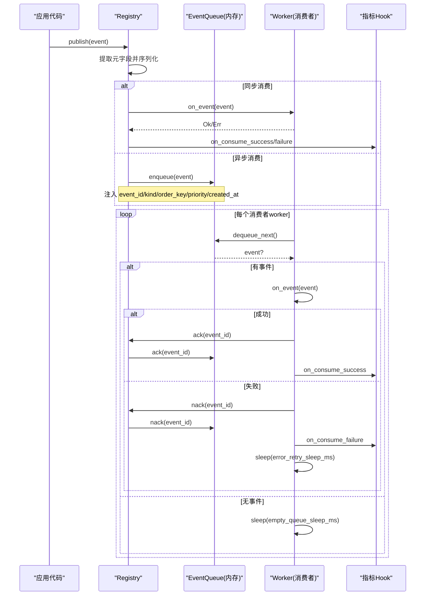
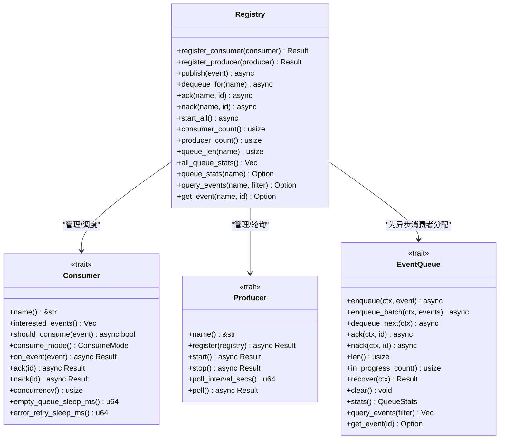
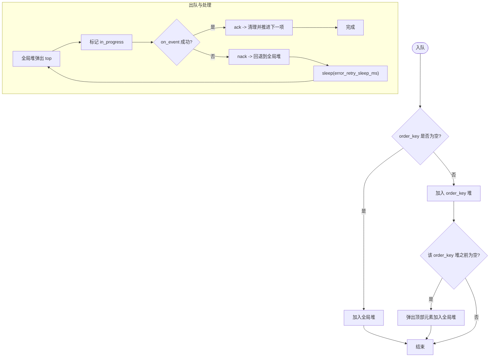
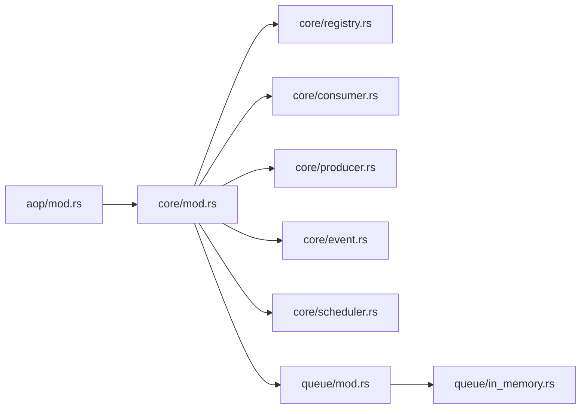

# 注册中心与调度器

<cite>
**本文引用的文件**
- [src/pkg/aop/mod.rs](src/pkg/aop/mod.rs)
- [src/pkg/aop/core/registry.rs](src/pkg/aop/core/registry.rs)
- [src/pkg/aop/core/consumer.rs](src/pkg/aop/core/consumer.rs)
- [src/pkg/aop/core/event.rs](src/pkg/aop/core/event.rs)
- [src/pkg/aop/core/producer.rs](src/pkg/aop/core/producer.rs)
- [src/pkg/aop/core/scheduler.rs](src/pkg/aop/core/scheduler.rs)
- [src/pkg/aop/queue/mod.rs](src/pkg/aop/queue/mod.rs)
- [src/pkg/aop/queue/in_memory.rs](src/pkg/aop/queue/in_memory.rs)
</cite>

## 目录
1. [简介](#简介)
2. [项目结构](#项目结构)
3. [核心组件](#核心组件)
4. [架构总览](#架构总览)
5. [详细组件分析](#详细组件分析)
6. [依赖关系分析](#依赖关系分析)
7. [性能考量](#性能考量)
8. [故障排查指南](#故障排查指南)
9. [结论](#结论)
10. [附录：使用示例与最佳实践](#附录使用示例与最佳实践)

## 简介
本章节面向 AOP 事件系统的“注册中心”和“调度器”，聚焦以下目标：
- 解释 Registry 的设计模式与实现原理，包括事件处理器注册、动态发现与生命周期管理。
- 说明 Scheduler 的调度算法与任务队列管理，涵盖优先级调度、负载均衡与故障恢复机制。
- 提供注册表操作、调度配置、任务管理的完整示例路径（以源码引用形式）。
- 解释并发安全、内存管理与性能优化策略。

AOP 层仅负责事件流转与调度，不感知业务实体；业务消费者在 consumer 层实现并注册，由 Registry 统一分发与调度。

## 项目结构
AOP 子系统位于 src/pkg/aop，采用分层清晰的模块组织：
- core：定义 Event、Consumer、Producer、Registry、Scheduler 等核心抽象与实现。
- queue：定义事件队列接口与内存队列实现。
- mod：暴露全局单例 Registry、便捷发布 API 与初始化入口。

图表来源
- [src/pkg/aop/mod.rs:24-61](src/pkg/aop/mod.rs#L24-L61)
- [src/pkg/aop/core/registry.rs:11-19](src/pkg/aop/core/registry.rs#L11-L19)
- [src/pkg/aop/core/consumer.rs:15-72](src/pkg/aop/core/consumer.rs#L15-L72)
- [src/pkg/aop/core/producer.rs:7-36](src/pkg/aop/core/producer.rs#L7-L36)
- [src/pkg/aop/core/event.rs:1-25](src/pkg/aop/core/event.rs#L1-L25)
- [src/pkg/aop/queue/mod.rs:77-107](src/pkg/aop/queue/mod.rs#L77-L107)
- [src/pkg/aop/queue/in_memory.rs:41-49](src/pkg/aop/queue/in_memory.rs#L41-L49)

章节来源
- [src/pkg/aop/mod.rs:1-61](src/pkg/aop/mod.rs#L1-L61)

## 核心组件
- 事件 Event：携带数据与元信息（id、order_key、priority、created_at），用于路由与排序。
- 消费者 Consumer：支持同步/异步两种消费模式；异步模式具备 ack/nack、并发度、空队列休眠与错误重试休眠等配置。
- 生产者 Producer：外部数据源或轮询任务，可交由 Registry 启动与管理生命周期。
- 注册中心 Registry：维护消费者/生产者集合、为异步消费者分配独立队列、分发事件、启动 worker 与轮询任务。
- 队列 EventQueue：抽象入队/出队/确认/失败重试/统计查询能力；InMemoryEventQueue 提供基于堆与哈希表的内存实现。
- 调度器 Scheduler：统一的定时/周期性任务抽象（name、interval_secs、run）。

章节来源
- [src/pkg/aop/core/event.rs:1-25](src/pkg/aop/core/event.rs#L1-L25)
- [src/pkg/aop/core/consumer.rs:1-72](src/pkg/aop/core/consumer.rs#L1-L72)
- [src/pkg/aop/core/producer.rs:1-36](src/pkg/aop/core/producer.rs#L1-L36)
- [src/pkg/aop/core/registry.rs:11-561](src/pkg/aop/core/registry.rs#L11-L561)
- [src/pkg/aop/queue/mod.rs:1-107](src/pkg/aop/queue/mod.rs#L1-L107)
- [src/pkg/aop/queue/in_memory.rs:1-449](src/pkg/aop/queue/in_memory.rs#L1-L449)
- [src/pkg/aop/core/scheduler.rs:1-9](src/pkg/aop/core/scheduler.rs#L1-L9)

## 架构总览
AOP 事件系统遵循“生产-消费”解耦模型：
- 发布侧通过 Registry.publish 将事件投递到对应消费者的队列或直接同步调用。
- 消费侧由 Registry.start_all 启动多个 worker 协程，按消费者配置的并发度拉取队列事件并执行 on_event。
- 成功处理 ack 后从队列移除；失败 nack 后重新入队，配合退避避免忙轮。
- 生产者可由 Registry 统一管理，支持轮询或非轮询两种模式。

图表来源
- [src/pkg/aop/core/registry.rs:97-206](src/pkg/aop/core/registry.rs#L97-L206)
- [src/pkg/aop/core/registry.rs:260-487](src/pkg/aop/core/registry.rs#L260-L487)
- [src/pkg/aop/queue/in_memory.rs:104-267](src/pkg/aop/queue/in_memory.rs#L104-L267)

## 详细组件分析

### 注册中心 Registry：设计模式与实现原理
- 职责
  - 维护消费者映射：EventKind -> Vec<Consumer>，支持多消费者订阅同一事件类型。
  - 为异步消费者创建独立队列，隔离不同消费者的处理节奏。
  - 发布事件时先提取元字段并注入 JSON，确保队列与监控一致。
  - 启动所有异步消费者 worker 与生产者轮询任务，生命周期集中管理。
- 并发与锁
  - 使用 RwLock 保护 consumers/producers/queues/started/metrics_hook。
  - start_all 中先原子标记 started，再释放写锁，避免跨 await 死锁。
- 生命周期
  - set_self_ref 允许 producer 反向持有 Registry 引用。
  - set_metrics_hook 注入指标采集钩子，None 时零开销。
- 关键流程
  - register_consumer：为 Async 消费者创建 InMemoryEventQueue，并按 interested_events 建立索引。
  - publish：根据事件 kind 找到消费者列表，过滤 should_consume，同步直接调用，异步入队。
  - start_all：收集所有 Async 消费者，去重后为每个消费者启动 concurrency 个 worker；同时启动 Producer 轮询。

图表来源
- [src/pkg/aop/core/registry.rs:11-561](src/pkg/aop/core/registry.rs#L11-L561)
- [src/pkg/aop/core/consumer.rs:15-72](src/pkg/aop/core/consumer.rs#L15-L72)
- [src/pkg/aop/core/producer.rs:7-36](src/pkg/aop/core/producer.rs#L7-L36)
- [src/pkg/aop/queue/mod.rs:77-107](src/pkg/aop/queue/mod.rs#L77-L107)

章节来源
- [src/pkg/aop/core/registry.rs:11-561](src/pkg/aop/core/registry.rs#L11-L561)

### 事件与消费者：动态发现与生命周期
- 事件 Event
  - 关键字段：id、order_key、priority、created_at，用于去重、顺序控制、优先级调度与老化统计。
  - order_key 为空时进入全局堆；非空时进入 order_key 维度的有序队列，保证同 key 的顺序性。
- 消费者 Consumer
  - 同步模式：发布线程内直接 on_event，适合轻量处理。
  - 异步模式：事件入队，由 worker 拉取处理；支持 ack/nack、并发度、空队列与错误退避。
  - should_consume 提供细粒度过滤，减少无效消费。

章节来源
- [src/pkg/aop/core/event.rs:1-25](src/pkg/aop/core/event.rs#L1-L25)
- [src/pkg/aop/core/consumer.rs:1-72](src/pkg/aop/core/consumer.rs#L1-L72)

### 队列与调度算法：优先级、负载均衡与故障恢复
- 优先级调度
  - 使用 BinaryHeap 作为全局优先队列，比较规则：priority 降序，其次 created_at 升序（更早创建的事件优先）。
  - order_key 非空时，每个 key 维护独立堆，保证同 key 顺序；首个元素入全局堆，完成后再推下一个。
- 负载均衡
  - 每个消费者启动 concurrency 个 worker，共享同一队列，天然实现消费者内部负载均衡。
  - 不同消费者之间通过独立队列隔离，互不影响。
- 故障恢复
  - on_event 失败则 nack 并重新入队，随后 sleep(error_retry_sleep_ms)，避免紧密自旋。
  - 队列为空时 sleep(empty_queue_sleep_ms)，降低空转 CPU 占用。
  - 成功处理后 ack，并从队列移除；若未 ack/nack，会导致事件卡死（已在注释中强调）。

图表来源
- [src/pkg/aop/queue/in_memory.rs:104-267](src/pkg/aop/queue/in_memory.rs#L104-L267)
- [src/pkg/aop/core/registry.rs:318-445](src/pkg/aop/core/registry.rs#L318-L445)

章节来源
- [src/pkg/aop/queue/in_memory.rs:1-449](src/pkg/aop/queue/in_memory.rs#L1-L449)
- [src/pkg/aop/core/registry.rs:260-487](src/pkg/aop/core/registry.rs#L260-L487)

### 生产者与调度器：轮询与非轮询
- 生产者 Producer
  - 支持 poll_interval_secs > 0 的轮询模式，由 Registry 定时调用 poll。
  - 非轮询模式下，start/stop 由生产者自行管理生命周期。
- 调度器 Scheduler
  - 统一抽象 name、interval_secs、run，便于扩展更多调度策略。

章节来源
- [src/pkg/aop/core/producer.rs:1-36](src/pkg/aop/core/producer.rs#L1-L36)
- [src/pkg/aop/core/scheduler.rs:1-9](src/pkg/aop/core/scheduler.rs#L1-L9)

## 依赖关系分析
- 模块耦合
  - aop/mod 依赖 core 与 queue，对外暴露 registry、publish、init_all。
  - core/registry 依赖 consumer、producer、event、queue，承担编排职责。
  - queue/in_memory 依赖 queue/mod 接口，实现具体数据结构与并发控制。
- 外部依赖
  - tokio 用于异步运行与时间片调度。
  - serde_json 用于事件序列化与元字段注入。
  - common::error 统一错误类型。

图表来源
- [src/pkg/aop/mod.rs:24-61](src/pkg/aop/mod.rs#L24-L61)
- [src/pkg/aop/core/mod.rs:1-14](src/pkg/aop/core/mod.rs#L1-L14)
- [src/pkg/aop/queue/mod.rs:1-107](src/pkg/aop/queue/mod.rs#L1-L107)

章节来源
- [src/pkg/aop/mod.rs:24-61](src/pkg/aop/mod.rs#L24-L61)
- [src/pkg/aop/core/mod.rs:1-14](src/pkg/aop/core/mod.rs#L1-L14)

## 性能考量
- 并发安全
  - Registry 使用 RwLock 保护共享状态，start_all 中提前释放写锁避免跨 await 死锁。
  - InMemoryEventQueue 使用 Mutex 粗粒度锁 + UnsafeCell 访问内部结构，保证高吞吐下的数据一致性。
- 内存管理
  - 事件以 JSON Value 存储，ack 后从 events 移除；order_key 队列清空后回收。
  - 建议合理设置 empty_queue_sleep_ms 与 error_retry_sleep_ms，避免忙轮与 CPU 浪费。
- 性能优化
  - 优先队列 O(logN) 插入/弹出，order_key 维度隔离提升局部顺序性。
  - 批量入队 enqueue_batch 减少锁竞争次数。
  - 指标 Hook 可选注入，None 时零开销。
- 可扩展性
  - 可通过替换 EventQueue 实现持久化队列（如 SQLite/DuckDB）以支持崩溃恢复与跨进程共享。

[本节为通用指导，不直接分析具体文件]

## 故障排查指南
- 常见问题定位
  - 事件未消费：检查消费者是否注册、interested_events 是否匹配、should_consume 是否过滤掉。
  - 事件卡死：确认 on_event 成功后是否调用 ack；失败是否调用 nack；否则事件停留在 in_progress。
  - 高 CPU：检查 empty_queue_sleep_ms 与 error_retry_sleep_ms 是否过小导致忙轮。
  - 顺序错乱：确认 order_key 是否正确设置；同 key 的事件会严格顺序处理。
- 诊断工具
  - 使用 queue_stats/all_queue_stats 查看 pending/in_progress 数量与 oldest_event_age_secs。
  - 使用 query_events/get_event 查看事件详情与状态。
  - 结合指标 Hook 观察 on_publish/on_consume_success/failure 耗时与失败率。

章节来源
- [src/pkg/aop/core/registry.rs:500-553](src/pkg/aop/core/registry.rs#L500-L553)
- [src/pkg/aop/queue/in_memory.rs:300-447](src/pkg/aop/queue/in_memory.rs#L300-L447)

## 结论
Registry 作为 AOP 事件系统的中枢，提供了稳定的事件分发、消费者注册与生命周期管理能力；配合 InMemoryEventQueue 的优先级与顺序保障，实现了高效可靠的异步处理流水线。通过合理的并发度、退避策略与指标观测，可在高负载场景下保持低延迟与稳定性。未来可引入持久化队列与更丰富的调度策略，进一步提升鲁棒性与可观测性。

[本节为总结，不直接分析具体文件]

## 附录：使用示例与最佳实践
- 注册消费者
  - 在 consumer::init 中注册业务消费者，按需实现 interested_events、consume_mode、concurrency 等。
  - 参考路径：[src/pkg/aop/core/consumer.rs:15-72](src/pkg/aop/core/consumer.rs#L15-L72)
- 发布事件
  - 使用 aop::publish 便捷方法，或通过 Registry.publish。
  - 参考路径：[src/pkg/aop/mod.rs:48-51](src/pkg/aop/mod.rs#L48-L51)
- 启动调度器
  - 调用 aop::init_all 启动所有异步消费者 worker 与生产者轮询。
  - 参考路径：[src/pkg/aop/mod.rs:53-60](src/pkg/aop/mod.rs#L53-L60)
- 队列配置与监控
  - 通过 Consumer 配置 concurrency、empty_queue_sleep_ms、error_retry_sleep_ms。
  - 使用 queue_stats/query_events/get_event 进行监控与排障。
  - 参考路径：[src/pkg/aop/core/consumer.rs:57-70](src/pkg/aop/core/consumer.rs#L57-L70)、[src/pkg/aop/core/registry.rs:500-553](src/pkg/aop/core/registry.rs#L500-L553)
- 生产者集成
  - 实现 Producer 接口，选择轮询或非轮询模式，由 Registry 统一管理。
  - 参考路径：[src/pkg/aop/core/producer.rs:7-36](src/pkg/aop/core/producer.rs#L7-L36)

[本节为实践指引，不直接分析具体文件]