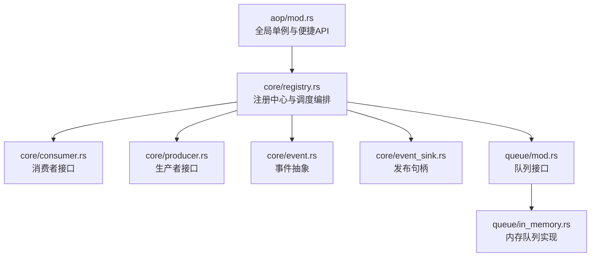
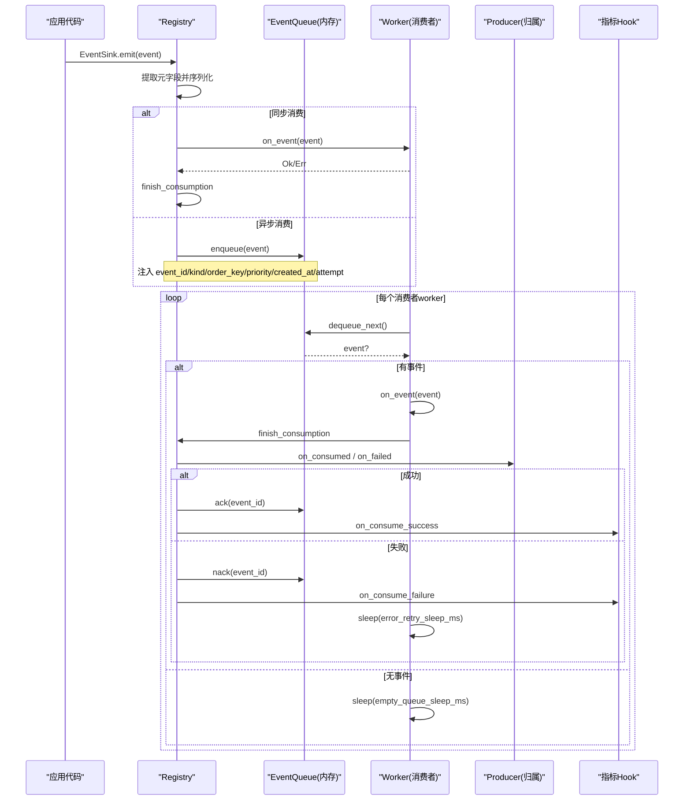
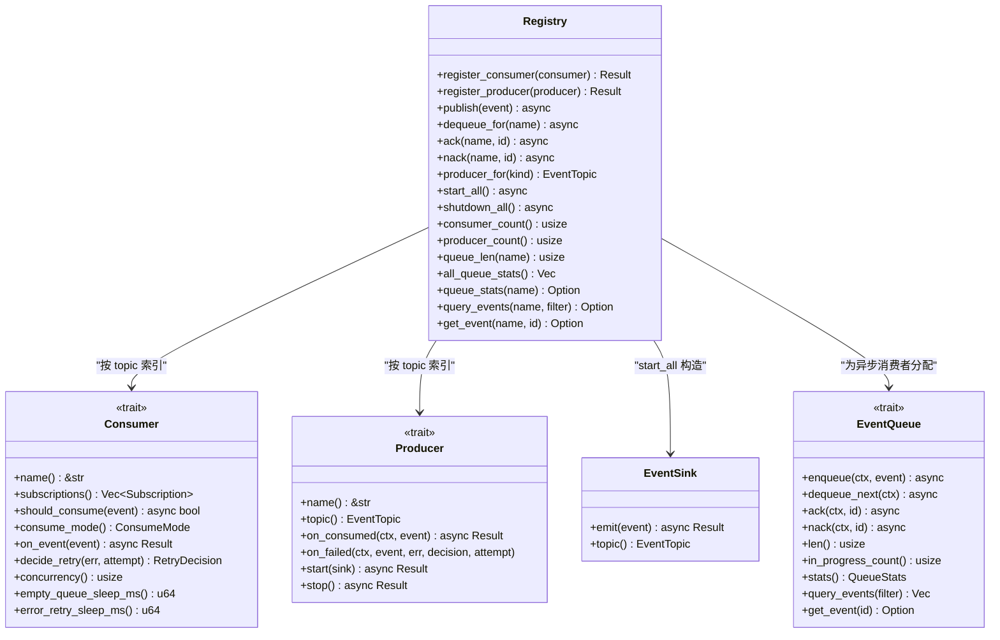
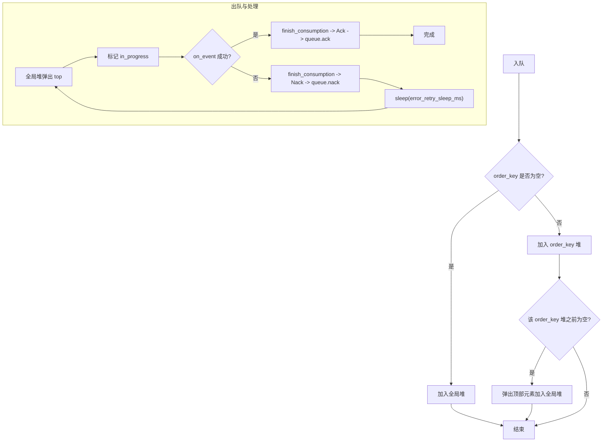
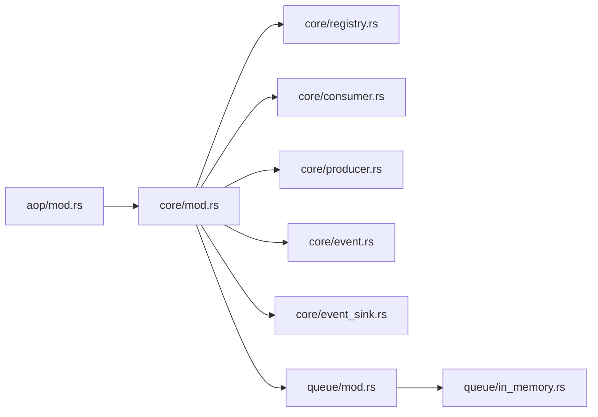

# 注册中心与调度器

<cite>
**本文引用的文件**
- [src/pkg/aop/mod.rs](src/pkg/aop/mod.rs)
- [src/pkg/aop/core/registry.rs](src/pkg/aop/core/registry.rs)
- [src/pkg/aop/core/consumer.rs](src/pkg/aop/core/consumer.rs)
- [src/pkg/aop/core/event.rs](src/pkg/aop/core/event.rs)
- [src/pkg/aop/core/producer.rs](src/pkg/aop/core/producer.rs)
- [src/pkg/aop/core/event_sink.rs](src/pkg/aop/core/event_sink.rs)
- [src/pkg/aop/queue/mod.rs](src/pkg/aop/queue/mod.rs)
- [src/pkg/aop/queue/in_memory.rs](src/pkg/aop/queue/in_memory.rs)
- [common/src/enums/event_topic.rs](common/src/enums/event_topic.rs)
- [docs/design/aop_producer_consumer_contract_design.md](docs/design/aop_producer_consumer_contract_design.md)
- [AOP 生产消费事件中心：纯框架零业务 + pkg/aop/core 6 Trait + Registry 全局单例 + 8 类业务消费者注册](docs/wiki/knowledge/zh/AOP%20生产消费事件中心：纯框架零业务%20+%20pkg%2Faop%2Fcore%206%20Trait%20+%20Registry%20全局单例%20+%208%20类业务消费者注册/AOP%20生产消费事件中心：纯框架零业务%20+%20pkg%2Faop%2Fcore%206%20Trait%20+%20Registry%20全局单例%20+%208%20类业务消费者注册.md)
</cite>

## 更新摘要
**变更内容**
- 事件类型标识由已删除的 `EventKind` 收敛为 `common::enums::EventTopic`；路由与生产者归属反查统一基于 `EventTopic`
- 消费者订阅由 `interested_events()` 改为 `subscriptions() -> Vec<Subscription>`（`kind`/`ordered`/`notify_producer`）
- 删除 `Consumer::ack/nack`（及 `source` 分发）；收尾统一在 `Registry::finish_consumption` 按 topic 反查生产者回调
- `register_producer` 改为同步（1 topic : 1 producer 硬校验）；`start_all` 先做校验（声明 notify_producer 的 topic 缺生产者 → 启动 Err）再逐个 `EventSink::new` + `producer.start(sink)`
- 删除 `self_ref`/`Weak`：`Producer::register()` 一并删除，发布句柄改由 `EventSink` 在 start_all 注入；`Scheduler` 类已从架构移除（轮询由 `ProducerLoop` 自管）

## 目录
1. [简介](#简介)
2. [项目结构](#项目结构)
3. [核心组件](#核心组件)
4. [架构总览](#架构总览)
5. [详细组件分析](#详细组件分析)
6. [依赖关系分析](#依赖关系分析)
7. [性能考量](#性能考量)
8. [故障排查指南](#故障排查指南)
9. [结论](#结论)
10. [附录：使用示例与最佳实践](#附录：使用示例与最佳实践)

## 简介
本章节面向 AOP 事件系统的"注册中心"和"事件流转调度"，聚焦以下目标：
- 解释 Registry 的设计模式与实现原理，包括消费者/生产者按 topic 注册、动态发现与生命周期管理。
- 说明生产者的自管循环（ProducerLoop）与 worker 调度算法，涵盖优先级调度、顺序保证与退避重试。
- 提供注册表操作、调度配置、任务管理的完整示例路径（以源码引用形式）。
- 解释并发安全、内存管理与性能优化策略。

AOP 层仅负责事件流转与调度，不感知业务实体；业务消费者在 consumer 层实现并声明订阅，拥有 topic 归属的生产者（DAL/Producer 自身）在装配期注册，由 Registry 统一分发、收尾回调与启动/停机。

## 项目结构
AOP 子系统位于 src/pkg/aop，采用分层清晰的模块组织：
- core：定义 Event、Consumer、Producer、Registry、EventSink 等核心抽象与实现。
- queue：定义事件队列接口与内存队列实现。
- mod：暴露全局单例 Registry、便捷发布 API 与初始化入口。

图表来源
- [src/pkg/aop/mod.rs#L24-L61](src/pkg/aop/mod.rs#L24-L61)
- [src/pkg/aop/core/registry.rs#L15-L123](src/pkg/aop/core/registry.rs#L15-L123)
- [src/pkg/aop/core/consumer.rs#L21-L112](src/pkg/aop/core/consumer.rs#L21-L112)
- [src/pkg/aop/core/producer.rs#L11-L154](src/pkg/aop/core/producer.rs#L11-L154)
- [src/pkg/aop/core/event.rs#L1-L17](src/pkg/aop/core/event.rs#L1-L17)
- [src/pkg/aop/core/event_sink.rs#L1-L54](src/pkg/aop/core/event_sink.rs#L1-L54)
- [src/pkg/aop/queue/mod.rs#L77-L107](src/pkg/aop/queue/mod.rs#L77-L107)
- [src/pkg/aop/queue/in_memory.rs#L41-L49](src/pkg/aop/queue/in_memory.rs#L41-L49)

章节来源
- [src/pkg/aop/mod.rs#L1-L61](src/pkg/aop/mod.rs#L1-L61)

## 核心组件
- 事件 Event：携带数据与元信息（kind 为 `EventTopic`、id、order_key、priority、created_at），用于路由与排序。
- 消费者 Consumer：支持同步/异步两种消费模式；通过 `subscriptions()` 声明订阅的 `EventTopic`、`ordered` 与 `notify_producer`；不再有 ack/nack。
- 生产者 Producer：拥有某 topic 业务收尾能力的对象，经 `start(EventSink)`/`stop()` 管理生命周期，提供 `on_consumed`/`on_failed`。
- 注册中心 Registry：按 topic 维护消费者/生产者索引、为异步消费者分配独立队列、分发事件、启动 worker 与生产者自管循环、在 `finish_consumption` 反查生产者回调。
- 发布句柄 EventSink：由 AOP 在 start_all 时构造并预绑定 topic，`emit` 强制执行 1 producer : 1 topic。
- 队列 EventQueue：抽象入队/出队/确认/失败重试/统计查询能力；InMemoryEventQueue 提供基于堆与哈希表的内存实现。

章节来源
- [src/pkg/aop/core/event.rs#L1-L17](src/pkg/aop/core/event.rs#L1-L17)
- [src/pkg/aop/core/consumer.rs#L21-L112](src/pkg/aop/core/consumer.rs#L21-L112)
- [src/pkg/aop/core/producer.rs#L11-L154](src/pkg/aop/core/producer.rs#L11-L154)
- [src/pkg/aop/core/registry.rs#L15-L123](src/pkg/aop/core/registry.rs#L15-L123)
- [src/pkg/aop/core/event_sink.rs#L1-L54](src/pkg/aop/core/event_sink.rs#L1-L54)
- [src/pkg/aop/queue/mod.rs#L1-L107](src/pkg/aop/queue/mod.rs#L1-L107)
- [src/pkg/aop/queue/in_memory.rs#L1-L449](src/pkg/aop/queue/in_memory.rs#L1-L449)

## 架构总览
AOP 事件系统遵循"生产-消费"解耦模型：
- 发布侧经 `EventSink::emit` 将事件投递到对应消费者的队列或直接同步调用。
- 消费侧由 Registry.start_all 启动多个 worker 协程，按消费者配置的并发度拉取队列事件并执行 on_event，经 `finish_consumption` 判定 Ack/Nack。
- 成功处理 → queue.ack 后从队列移除；失败 → `decide_retry` 判为 `Retry` → queue.nack 重新入队，配合退避避免忙轮；`Discard` → queue.ack（仍回调 on_consumed）。
- 生产者由 AOP 统一管理：start_all 时逐个 `EventSink::new(registry, topic)` + `producer.start(sink)`；stop 时逐个 `producer.stop()`。

图表来源
- [src/pkg/aop/core/registry.rs#L142-L271](src/pkg/aop/core/registry.rs#L142-L271)
- [src/pkg/aop/core/registry.rs#L343-L562](src/pkg/aop/core/registry.rs#L343-L562)
- [src/pkg/aop/core/registry.rs#L734-L802](src/pkg/aop/core/registry.rs#L734-L802)
- [src/pkg/aop/queue/in_memory.rs#L104-L267](src/pkg/aop/queue/in_memory.rs#L104-L267)

## 详细组件分析

### 注册中心 Registry：设计模式与实现原理
- 职责
  - 按 topic 维护消费者索引：`consumers: HashMap<EventTopic, Vec<Consumer>>`，支持多消费者订阅同一主题。
  - 按 topic 维护生产者索引：`producers_by_topic: HashMap<EventTopic, Producer>`（1 topic : 1 producer 硬校验）。
  - 为异步消费者创建独立队列，隔离不同消费者的处理节奏。
  - 发布事件时先提取元字段并注入 JSON，确保队列与监控一致。
  - 启动所有异步消费者 worker 与生产者自管循环，生命周期集中管理。
- 并发与锁
  - 使用 RwLock 保护 consumers/producers_by_topic/queues/started/metrics_hook。
  - start_all 中先原子标记 started，再释放写锁，避免跨 await 死锁。
- 生命周期
  - `set_metrics_hook` 注入指标采集钩子，None 时零开销。
  - 不再有 `set_self_ref`：生产者不再反向持有 `Arc<Registry>`，发布句柄改由 `EventSink` 在 start_all 注入。
- 关键流程
  - register_consumer：为 Async 消费者创建 InMemoryEventQueue，并按 `subscriptions()` 的 `kind` 建立索引（Sync 声明 `ordered` → 注册 Err）。
  - register_producer：同步写入 producers_by_topic，topic 已被占用 → Err（1 topic : 1 producer）。
  - publish：根据事件 kind（`EventTopic`）找到消费者列表，过滤 should_consume，同步直接调用，异步入队。
  - start_all：先校验（声明 `notify_producer` 的 topic 缺生产者 → Err，早于 started 置位），再启动 worker 与生产者自管循环。

图表来源
- [src/pkg/aop/core/registry.rs#L15-L123](src/pkg/aop/core/registry.rs#L15-L123)
- [src/pkg/aop/core/consumer.rs#L21-L112](src/pkg/aop/core/consumer.rs#L21-L112)
- [src/pkg/aop/core/producer.rs#L11-L154](src/pkg/aop/core/producer.rs#L11-L154)
- [src/pkg/aop/core/event_sink.rs#L1-L54](src/pkg/aop/core/event_sink.rs#L1-L54)
- [src/pkg/aop/queue/mod.rs#L77-L107](src/pkg/aop/queue/mod.rs#L77-L107)

章节来源
- [src/pkg/aop/core/registry.rs#L15-L123](src/pkg/aop/core/registry.rs#L15-L123)

### 事件与消费者：动态发现与生命周期
- 事件 Event
  - 关键字段：kind（`EventTopic`）、id、order_key、priority、created_at，用于去重、顺序控制、优先级调度与老化统计。
  - order_key 为空时进入全局堆；非空时进入 order_key 维度的有序队列，保证同 key 的顺序性。
- 消费者 Consumer
  - 同步模式：发布线程内直接 on_event，经 `finish_consumption` 判定收尾。
  - 异步模式：事件入队，由 worker 拉取处理；`subscriptions()` 声明 `ordered`/`notify_producer`；收尾由框架统一判定（已无 ack/nack）。
  - should_consume 提供细粒度过滤，减少无效消费。

章节来源
- [src/pkg/aop/core/event.rs#L1-L17](src/pkg/aop/core/event.rs#L1-L17)
- [src/pkg/aop/core/consumer.rs#L21-L112](src/pkg/aop/core/consumer.rs#L21-L112)

### 队列与调度算法：优先级、顺序保证与退避
- 优先级调度
  - 使用 BinaryHeap 作为全局优先队列，比较规则：priority 降序，其次 created_at 升序（更早创建的事件优先）。
  - order_key 非空时，每个 key 维护独立堆，保证同 key 顺序；首个元素入全局堆，完成后再推下一个。
- 负载均衡
  - 每个消费者启动 concurrency 个 worker，共享同一队列，天然实现消费者内部负载均衡。
  - 不同消费者之间通过独立队列隔离，互不影响。
- 退避与重试
  - `finish_consumption` 结论为 Nack 时，on_event 失败已打日志，随后 sleep(error_retry_sleep_ms)，避免紧密自旋。
  - 队列为空时 sleep(empty_queue_sleep_ms)，降低空转 CPU 占用。
  - 成功处理后 Ack 并从队列移除；若未正确落到 ack/nack，会导致事件卡死。

图表来源
- [src/pkg/aop/queue/in_memory.rs#L104-L267](src/pkg/aop/queue/in_memory.rs#L104-L267)
- [src/pkg/aop/core/registry.rs#L318-L529](src/pkg/aop/core/registry.rs#L318-L529)

章节来源
- [src/pkg/aop/queue/in_memory.rs#L1-L449](src/pkg/aop/queue/in_memory.rs#L1-L449)
- [src/pkg/aop/core/registry.rs#L343-L562](src/pkg/aop/core/registry.rs#L343-L562)

### 生产者与收尾归属：自管循环 + EventSink
- 生产者 Producer
  - 经 `EventSink` 发布：topic 由 `topic()` 声明，AOP 在 start_all 时构造预绑定该 topic 的 `EventSink`，`emit` 校验 `event.kind() == topic`（1 producer : 1 topic）。
  - 自管循环：轮询由 `ProducerLoop`（AtomicBool + 250ms 可中断 sleep）实现；`start()` spawn 后立即返回，`stop()` 置位并 await `JoinHandle`。
  - 收尾回调：`on_consumed`（成功/Discard 后）、`on_failed`（每次失败，接收 `decision`）。
- 收尾反查（finish_consumption）
  - 按 `meta.event_kind` 解析 `EventTopic` ∧ 该消费者对该 kind 声明 `notify_producer` ∧ `producer_for(kind)` 存在 → 回调；任一不满足 = ①类纯通知，零回调。
  - `Ok` → `on_consumed` → Ack；`Err` → `on_failed` → `Retry`(Nack)/`Discard`(Ack，仍回调 `on_consumed`)。

章节来源
- [src/pkg/aop/core/producer.rs#L11-L154](src/pkg/aop/core/producer.rs#L11-L154)
- [src/pkg/aop/core/event_sink.rs#L1-L54](src/pkg/aop/core/event_sink.rs#L1-L54)
- [src/pkg/aop/core/registry.rs#L734-L802](src/pkg/aop/core/registry.rs#L734-L802)
- [src/pkg/aop/core/registry.rs#L102-L128](src/pkg/aop/core/registry.rs#L102-L128)

## 依赖关系分析
- 模块耦合
  - aop/mod 依赖 core 与 queue，对外暴露 registry、publish、init_all。
  - core/registry 依赖 consumer、producer、event、event_sink、queue，承担编排职责。
  - queue/in_memory 依赖 queue/mod 接口，实现具体数据结构与并发控制。
- 外部依赖
  - tokio 用于异步运行与时间片调度。
  - serde_json 用于事件序列化与元字段注入。
  - common::error 统一错误类型。

图表来源
- [src/pkg/aop/mod.rs#L24-L61](src/pkg/aop/mod.rs#L24-L61)
- [src/pkg/aop/core/mod.rs#L1-L14](src/pkg/aop/core/mod.rs#L1-L14)
- [src/pkg/aop/queue/mod.rs#L1-L107](src/pkg/aop/queue/mod.rs#L1-L107)

章节来源
- [src/pkg/aop/mod.rs#L24-L61](src/pkg/aop/mod.rs#L24-L61)
- [src/pkg/aop/core/mod.rs#L1-L14](src/pkg/aop/core/mod.rs#L1-L14)

## 性能考量
- 并发安全
  - Registry 使用 RwLock 保护共享状态，start_all 中提前释放写锁避免跨 await 死锁。
  - InMemoryEventQueue 使用 Mutex 粗粒度锁保护内部结构，保证高吞吐下的数据一致性。
- 内存管理
  - 事件以 JSON Value 存储，ack 后从 events 移除；order_key 队列清空后回收。
  - 建议合理设置 empty_queue_sleep_ms 与 error_retry_sleep_ms，避免忙轮与 CPU 浪费。
- 性能优化
  - 优先队列 O(logN) 插入/弹出，order_key 维度隔离提升局部顺序性。
  - 批量入队 enqueue_batch 减少锁竞争次数。
  - 指标 Hook 可选注入，None 时零开销。
- 可扩展性
  - 可通过替换 EventQueue 实现持久化队列（如 SQLite/DuckDB）以支持崩溃恢复与跨进程共享。

[本节为通用指导，不直接分析具体文件]

## 故障排查指南
- 常见问题定位
  - 事件未消费：检查消费者是否注册、`subscriptions` 的 `kind` 是否匹配、should_consume 是否过滤掉。
  - 事件卡死：确认 `finish_consumption` 结论是否落到 queue.ack/nack；否则事件停留在 in_progress。
  - 业务收尾丢失/启动失败：声明 `notify_producer` 的 topic 缺生产者 → `start_all` 返回 Err（早于 started 置位）。
  - 高 CPU：检查 empty_queue_sleep_ms 与 error_retry_sleep_ms 是否过小导致忙轮。
  - 顺序错乱：确认 order_key 是否正确设置；同 key 的事件会严格顺序处理。
- 诊断工具
  - 使用 queue_stats/all_queue_stats 查看 pending/in_progress 数量与 oldest_event_age_secs。
  - 使用 query_events/get_event 查看事件详情与状态。
  - 结合指标 Hook 观察 on_publish/on_consume_success/failure/discarded 耗时与失败率。

章节来源
- [src/pkg/aop/core/registry.rs#L343-L602](src/pkg/aop/core/registry.rs#L343-L602)
- [src/pkg/aop/queue/in_memory.rs#L300-L447](src/pkg/aop/queue/in_memory.rs#L300-L447)

## 结论
Registry 作为 AOP 事件系统的中枢，提供了稳定的事件分发、消费者注册与生命周期管理能力；配合 InMemoryEventQueue 的优先级与顺序保障，实现了高效可靠的异步处理流水线。通过 `EventSink` 强制 1 producer : 1 topic 与 `finish_consumption` 单一收尾出口按 topic 反查生产者回调，把「业务收尾」责任下沉到拥有归属的对象自身。通过合理的并发度、退避策略与指标观测，可在高负载场景下保持低延迟与稳定性。未来可引入持久化队列与更丰富的调度策略，进一步提升鲁棒性与可观测性。

[本节为总结，不直接分析具体文件]

## 附录：使用示例与最佳实践
- 注册消费者
  - 在 consumer::init 中注册业务消费者，声明 `subscriptions`（含 `ordered`/`notify_producer`）、consume_mode、concurrency 等。
  - 参考路径：[src/pkg/aop/core/consumer.rs#L21-L112](src/pkg/aop/core/consumer.rs#L21-L112)
- 注册生产者（归属对象自身）
  - 拥有 topic 归属的对象在装配期 `register_producer`（同步，1 topic : 1 producer 硬校验），声明 `topic()` 并提供 `on_consumed`/`on_failed`。
  - 参考路径：[src/pkg/aop/core/producer.rs#L11-L154](src/pkg/aop/core/producer.rs#L11-L154)、[src/pkg/aop/core/registry.rs#L102-L123](src/pkg/aop/core/registry.rs#L102-L123)
- 发布事件
  - 生产者经 `EventSink::emit` 发布（框架已注入元字段）。
  - 参考路径：[src/pkg/aop/core/event_sink.rs#L1-L54](src/pkg/aop/core/event_sink.rs#L1-L54)
- 启动调度器
  - 调用 aop::init_all 启动所有异步消费者 worker 与生产者自管循环（先做 notify_producer 校验）。
  - 参考路径：[src/pkg/aop/mod.rs#L53-L60](src/pkg/aop/mod.rs#L53-L60)
- 队列配置与监控
  - 通过 Consumer 配置 concurrency、empty_queue_sleep_ms、error_retry_sleep_ms。
  - 使用 queue_stats/query_events/get_event 进行监控与排障。
  - 参考路径：[src/pkg/aop/core/consumer.rs#L98-L111](src/pkg/aop/core/consumer.rs#L98-L111)、[src/pkg/aop/core/registry.rs#L658-L702](src/pkg/aop/core/registry.rs#L658-L702)
