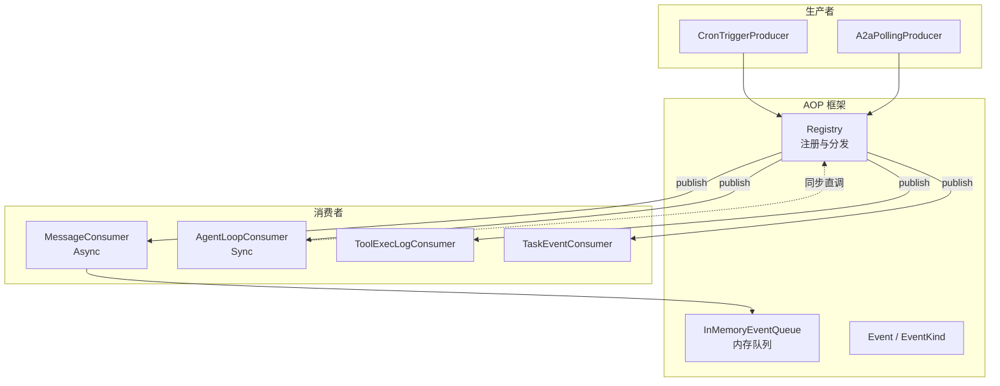
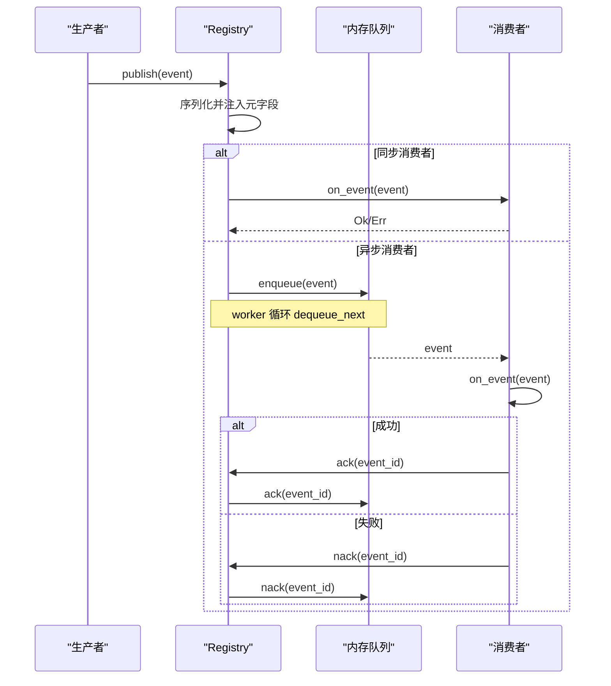
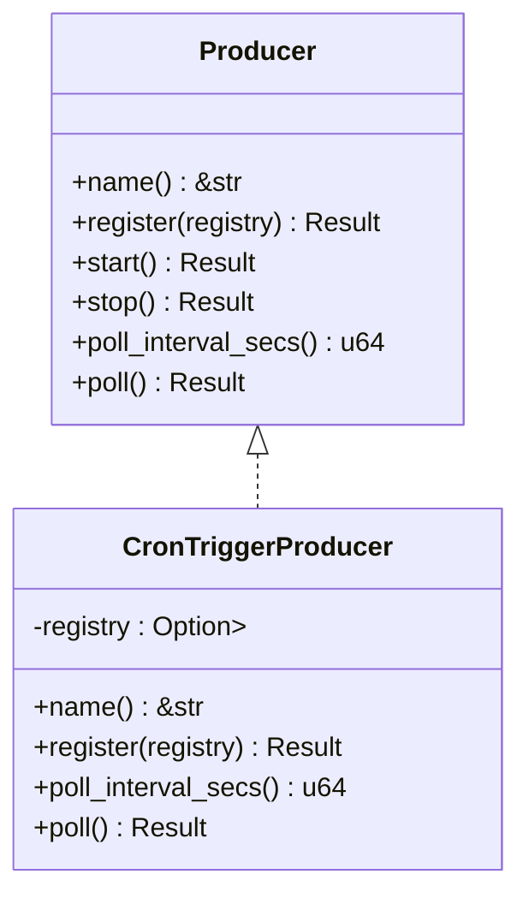
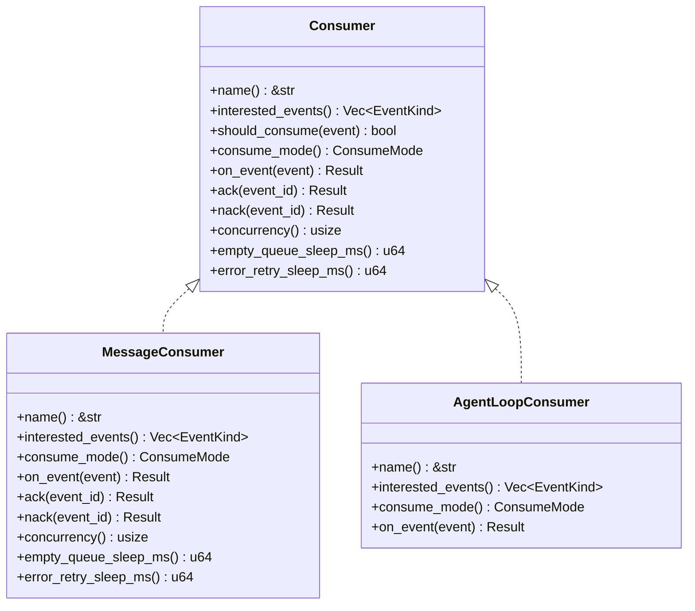
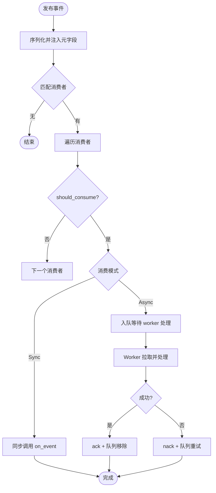
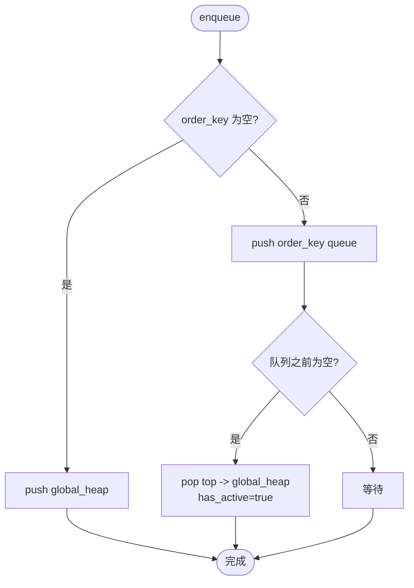
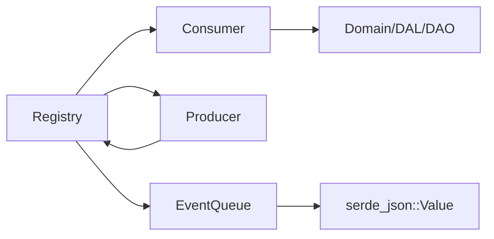

# 生产者消费者模式

<cite>
**本文引用的文件**
- [src/pkg/aop/mod.rs](src/pkg/aop/mod.rs)
- [src/pkg/aop/core/producer.rs](src/pkg/aop/core/producer.rs)
- [src/pkg/aop/core/consumer.rs](src/pkg/aop/core/consumer.rs)
- [src/pkg/aop/core/event.rs](src/pkg/aop/core/event.rs)
- [src/pkg/aop/core/registry.rs](src/pkg/aop/core/registry.rs)
- [src/pkg/aop/queue/in_memory.rs](src/pkg/aop/queue/in_memory.rs)
- [src/consumer/mod.rs](src/consumer/mod.rs)
- [src/consumer/message.rs](src/consumer/message.rs)
- [src/consumer/agent_loop_consumer.rs](src/consumer/agent_loop_consumer.rs)
- [src/producer/mod.rs](src/producer/mod.rs)
- [src/producer/cron_trigger.rs](src/producer/cron_trigger.rs)
</cite>

## 目录
1. [简介](#简介)
2. [项目结构](#项目结构)
3. [核心组件](#核心组件)
4. [架构总览](#架构总览)
5. [详细组件分析](#详细组件分析)
6. [依赖关系分析](#依赖关系分析)
7. [性能与背压](#性能与背压)
8. [故障排查指南](#故障排查指南)
9. [结论](#结论)
10. [附录：使用示例与最佳实践](#附录使用示例与最佳实践)

## 简介
本文件围绕 AOP 事件系统的“生产者-消费者”模式，系统性说明 Producer trait 的设计与实现、Consumer trait 的抽象与消费模式（同步/异步/批量）、事件路由与调度机制、错误处理与重试策略、以及背压、流量控制与资源管理。文档同时给出注册、订阅、发布、消费的完整流程与图示，帮助读者快速理解并正确使用该事件中心。

## 项目结构
AOP 事件中心位于 src/pkg/aop，提供纯框架能力（无业务感知），业务生产者位于 src/producer，业务消费者位于 src/consumer。启动时先注册生产者和消费者，再启动调度器；事件通过 Registry 统一分发到对应 Consumer，异步消费者由独立 worker 拉取队列中的事件进行处理。

图表来源
- [src/pkg/aop/core/registry.rs:97-206](src/pkg/aop/core/registry.rs#L97-L206)
- [src/pkg/aop/queue/in_memory.rs:104-177](src/pkg/aop/queue/in_memory.rs#L104-L177)
- [src/consumer/mod.rs:16-36](src/consumer/mod.rs#L16-L36)
- [src/producer/mod.rs:9-26](src/producer/mod.rs#L9-L26)

章节来源
- [src/pkg/aop/mod.rs:1-61](src/pkg/aop/mod.rs#L1-L61)
- [src/consumer/mod.rs:16-36](src/consumer/mod.rs#L16-L36)
- [src/producer/mod.rs:9-26](src/producer/mod.rs#L9-L26)

## 核心组件
- Event/EventKind：事件类型标识与通用元数据（id、order_key、priority、created_at）。
- Producer：事件源，支持轮询与非轮询两种生命周期管理。
- Consumer：事件消费者，支持同步与异步两种消费模式，并提供 ack/nack、并发度、退避等配置。
- Registry：注册中心，负责消费者注册、事件路由、异步 worker 启动、指标埋点。
- InMemoryEventQueue：内存队列，维护待处理、进行中、按 order_key 的顺序保证与优先级出队。

章节来源
- [src/pkg/aop/core/event.rs:1-25](src/pkg/aop/core/event.rs#L1-L25)
- [src/pkg/aop/core/producer.rs:7-35](src/pkg/aop/core/producer.rs#L7-L35)
- [src/pkg/aop/core/consumer.rs:6-71](src/pkg/aop/core/consumer.rs#L6-L71)
- [src/pkg/aop/core/registry.rs:11-206](src/pkg/aop/core/registry.rs#L11-L206)
- [src/pkg/aop/queue/in_memory.rs:41-177](src/pkg/aop/queue/in_memory.rs#L41-L177)

## 架构总览
事件从生产者发出，经 Registry 序列化并注入元字段后，根据消费者感兴趣的事件类型进行路由。同步消费者在发布线程直接调用 on_event；异步消费者入队，由 Registry 启动的 worker 循环拉取并处理，成功则 ack 并从队列移除，失败则 nack 并重试。

图表来源
- [src/pkg/aop/core/registry.rs:97-206](src/pkg/aop/core/registry.rs#L97-L206)
- [src/pkg/aop/core/registry.rs:208-449](src/pkg/aop/core/registry.rs#L208-L449)
- [src/pkg/aop/queue/in_memory.rs:104-267](src/pkg/aop/queue/in_memory.rs#L104-L267)

## 详细组件分析

### Producer trait 设计与实现
- 名称与生命周期：name() 用于日志与追踪；register() 获取 Registry 引用；start()/stop() 用于非轮询模式的生命周期；poll_interval_secs() 返回轮询间隔（0 表示非轮询）；poll() 执行一次生产。
- 典型实现：CronTriggerProducer 每 60 秒查询到期触发器，构造 CronTriggerEvent 并通过 registry.publish 发布，然后标记已执行。

图表来源
- [src/pkg/aop/core/producer.rs:7-35](src/pkg/aop/core/producer.rs#L7-L35)
- [src/producer/cron_trigger.rs:8-88](src/producer/cron_trigger.rs#L8-L88)

章节来源
- [src/pkg/aop/core/producer.rs:7-35](src/pkg/aop/core/producer.rs#L7-L35)
- [src/producer/cron_trigger.rs:8-88](src/producer/cron_trigger.rs#L8-L88)

### Consumer trait 与 ConsumeMode
- 消费模式：ConsumeMode::Sync 为同步模式，发布线程直接调用 on_event；ConsumeMode::Async 为异步模式，事件入队，由 worker 拉取处理。
- 过滤与兴趣：interested_events() 声明感兴趣的事件类型；should_consume() 可基于事件内容做二次过滤。
- 异步增强：concurrency() 控制 worker 数量；empty_queue_sleep_ms() 与 error_retry_sleep_ms() 控制空队列休眠与出错重试退避；ack()/nack() 完成确认与重试。

图表来源
- [src/pkg/aop/core/consumer.rs:6-71](src/pkg/aop/core/consumer.rs#L6-L71)
- [src/consumer/message.rs:64-141](src/consumer/message.rs#L64-L141)
- [src/consumer/agent_loop_consumer.rs:26-96](src/consumer/agent_loop_consumer.rs#L26-L96)

章节来源
- [src/pkg/aop/core/consumer.rs:6-71](src/pkg/aop/core/consumer.rs#L6-L71)
- [src/consumer/message.rs:64-141](src/consumer/message.rs#L64-L141)
- [src/consumer/agent_loop_consumer.rs:26-96](src/consumer/agent_loop_consumer.rs#L26-L96)

### 事件发布与路由流程
- 发布入口：Registry::publish 对事件进行序列化，并注入 event_id、kind、order_key、priority、created_at 等元字段。
- 路由规则：根据 consumer.interested_events() 匹配消费者列表，依次调用 should_consume 过滤。
- 同步路径：直接调用 consumer.on_event，记录耗时与成功/失败指标。
- 异步路径：将事件入队，worker 循环拉取，处理成功后 ack 并移除，失败则 nack 并重试。

图表来源
- [src/pkg/aop/core/registry.rs:97-206](src/pkg/aop/core/registry.rs#L97-L206)
- [src/pkg/aop/core/registry.rs:208-449](src/pkg/aop/core/registry.rs#L208-L449)

章节来源
- [src/pkg/aop/core/registry.rs:97-206](src/pkg/aop/core/registry.rs#L97-L206)
- [src/pkg/aop/core/registry.rs:208-449](src/pkg/aop/core/registry.rs#L208-L449)

### 内存队列与顺序保证
- 数据结构：全局堆（global_heap）按 priority DESC、created_at DESC 排序；每个 order_key 独立队列；in_progress 记录正在处理的事件；has_active_message 标记某 order_key 是否已有活动消息。
- 入队：若无 order_key 进入全局堆；若有 order_key 进入对应队列，若队列为空且无活动消息，则将队首推入全局堆并标记活动。
- 出队：优先从全局堆弹出，移入 in_progress。
- 确认/否定：ack 删除事件并推进同 order_key 下一项；nack 重新入队并恢复活动标记。
- 统计与查询：提供 pending/in_progress 计数、最老事件年龄、按 order_key/status 分页查询等。

图表来源
- [src/pkg/aop/queue/in_memory.rs:104-177](src/pkg/aop/queue/in_memory.rs#L104-L177)

章节来源
- [src/pkg/aop/queue/in_memory.rs:104-267](src/pkg/aop/queue/in_memory.rs#L104-L267)

### 典型消费者：消息消费者（异步）
- 订阅事件：message.created。
- 消费模式：异步，concurrency=4，空队列休眠 100ms，错误重试休眠 1000ms。
- 业务编排：根据 to_role 分发到不同 domain（Agent/User/System），必要时重建 RequestContext，调用 RuntimeDomain/MessageDomain/HrDomain/ProjectDomain 完成唤醒、投递或工具调用。
- 确认机制：成功更新消息状态为已处理；失败回滚为 Pending，触发重试。

章节来源
- [src/consumer/message.rs:64-141](src/consumer/message.rs#L64-L141)
- [src/consumer/message.rs:78-128](src/consumer/message.rs#L78-L128)

### 典型消费者：Agent 循环日志（同步）
- 订阅事件：agent.loop、agent.think.round。
- 消费模式：同步，适合轻量级日志记录。
- 行为：解析事件并输出结构化日志，便于观测 Agent 生命周期与每轮思考指标。

章节来源
- [src/consumer/agent_loop_consumer.rs:26-96](src/consumer/agent_loop_consumer.rs#L26-L96)

### 生产者注册与消费者订阅
- 生产者注册：producer::init 中注册 CronTriggerProducer、A2aPollingProducer，并初始化 message channel 相关生产者。
- 消费者注册：consumer::init 中注册多个业务消费者（消息、调度、工具执行日志/统计、Agent 循环、任务事件等）。
- 启动调度：aop::init_all 启动所有异步消费者的 worker 与轮询生产者。

章节来源
- [src/producer/mod.rs:9-26](src/producer/mod.rs#L9-L26)
- [src/consumer/mod.rs:16-36](src/consumer/mod.rs#L16-L36)
- [src/pkg/aop/mod.rs:53-61](src/pkg/aop/mod.rs#L53-L61)

## 依赖关系分析
- Registry 依赖 Queue、Consumer、Producer、MetricsHook；通过 Weak<Self> 避免循环引用。
- 内存队列依赖 RequestContext 与 JSON Value，内部以 UnsafeCell+Mutex 保证并发安全。
- 业务消费者依赖 Domain/DAL/DAO 完成具体业务逻辑，但仅通过接口解耦。
- 生产者通过 Registry 发布事件，不直接耦合消费者。

图表来源
- [src/pkg/aop/core/registry.rs:11-19](src/pkg/aop/core/registry.rs#L11-L19)
- [src/pkg/aop/queue/in_memory.rs:1-10](src/pkg/aop/queue/in_memory.rs#L1-L10)
- [src/consumer/message.rs:17-32](src/consumer/message.rs#L17-L32)
- [src/producer/cron_trigger.rs:1-7](src/producer/cron_trigger.rs#L1-L7)

章节来源
- [src/pkg/aop/core/registry.rs:11-19](src/pkg/aop/core/registry.rs#L11-L19)
- [src/pkg/aop/queue/in_memory.rs:1-10](src/pkg/aop/queue/in_memory.rs#L1-L10)
- [src/consumer/message.rs:17-32](src/consumer/message.rs#L17-L32)
- [src/producer/cron_trigger.rs:1-7](src/producer/cron_trigger.rs#L1-L7)

## 性能与背压
- 优先级与顺序：全局堆按优先级与创建时间排序；相同 order_key 的事件顺序消费，避免乱序。
- 并发度控制：消费者可通过 concurrency() 设置 worker 数量，平衡吞吐与资源占用。
- 退避与节流：空队列休眠与错误重试休眠避免忙轮询；on_event 失败后 sleep 防止紧密自旋。
- 背压与限流：当前内存队列无显式容量限制，高负载下可能堆积内存；建议在高吞吐场景结合外部队列或增加监控告警，必要时引入批处理与限速策略。
- 资源管理：Registry 持有消费者与队列的 Arc 引用；队列使用 Mutex+UnsafeCell 保护共享状态；ack/nack 确保事件状态一致，避免泄漏。

[本节为通用指导，不直接分析具体文件]

## 故障排查指南
- 事件未消费：检查消费者 interested_events 是否正确；确认 should_consume 过滤条件；查看队列统计与事件详情。
- 重复消费或卡死：确认 ack/nack 正确调用；检查 order_key 活动标记与队列推进逻辑；观察 in_progress 与 pending 计数。
- 性能问题：调整 concurrency、empty_queue_sleep_ms、error_retry_sleep_ms；关注队列长度与最老事件年龄；评估是否需要批处理或外部队列。
- 指标缺失：确认 metrics hook 已注入；检查 on_publish/on_consume_start/success/failure 是否被调用。

章节来源
- [src/pkg/aop/core/registry.rs:208-449](src/pkg/aop/core/registry.rs#L208-L449)
- [src/pkg/aop/queue/in_memory.rs:300-447](src/pkg/aop/queue/in_memory.rs#L300-L447)

## 结论
AOP 事件系统通过 Producer/Consumer 抽象与 Registry 调度，实现了松耦合、可扩展的事件驱动架构。同步模式适合轻量处理，异步模式具备高吞吐与重试能力；内存队列提供顺序保证与优先级调度。通过合理的并发度、退避与监控，可在保障稳定性的同时获得良好性能。对于更高吞吐与持久化需求，可平滑替换底层队列实现。

[本节为总结性内容，不直接分析具体文件]

## 附录：使用示例与最佳实践
- 生产者注册：在 producer::init 中注册各生产者，并在 start_all 前完成注册。
- 消费者订阅：在 consumer::init 中注册消费者，声明感兴趣事件与消费模式。
- 事件发布：通过 aop::publish 或直接调用 registry().publish 发布事件。
- 启动调度：调用 aop::init_all 启动异步消费者 worker 与轮询生产者。
- 背压与资源：合理设置 concurrency、sleep 参数；监控队列长度与事件年龄；必要时引入批处理与外部队列。

章节来源
- [src/producer/mod.rs:9-26](src/producer/mod.rs#L9-L26)
- [src/consumer/mod.rs:16-36](src/consumer/mod.rs#L16-L36)
- [src/pkg/aop/mod.rs:48-61](src/pkg/aop/mod.rs#L48-L61)