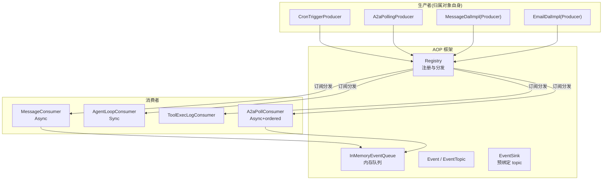
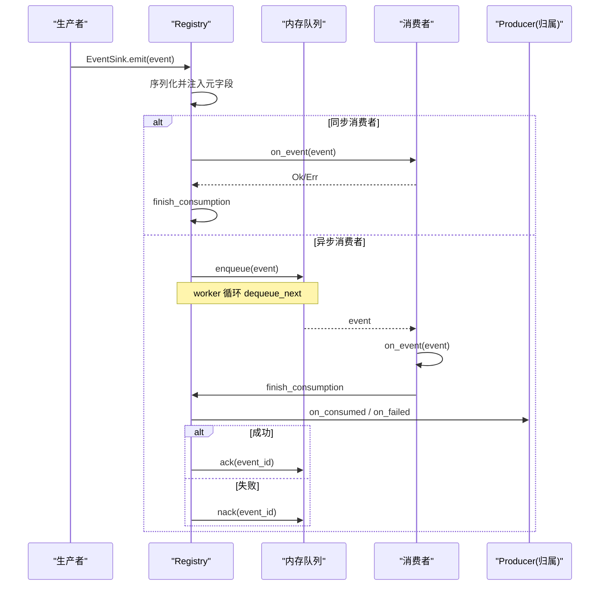
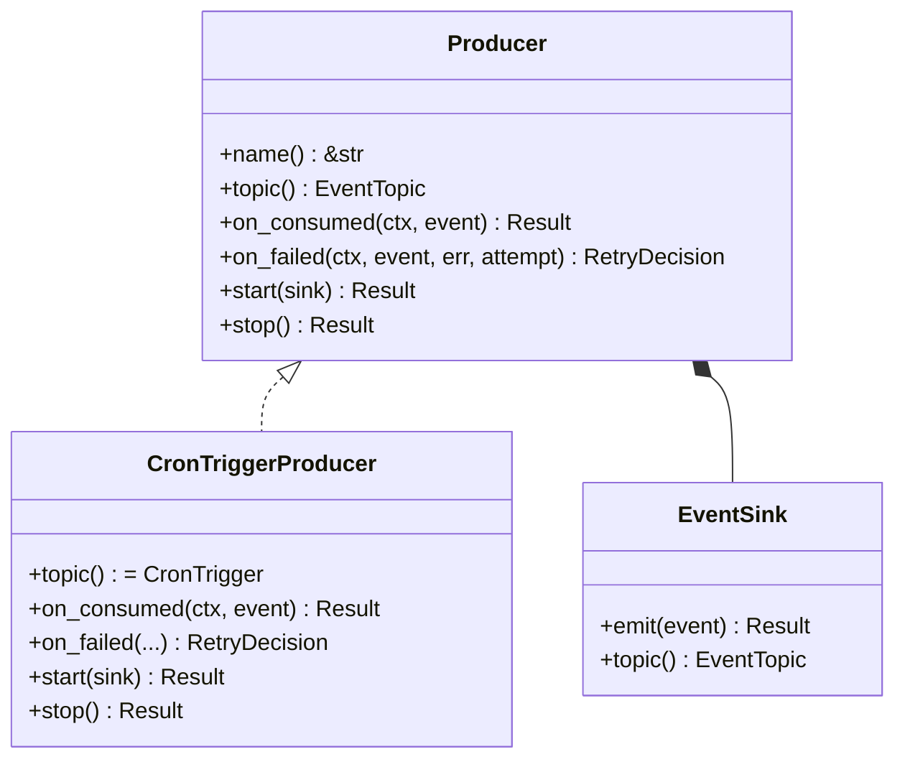
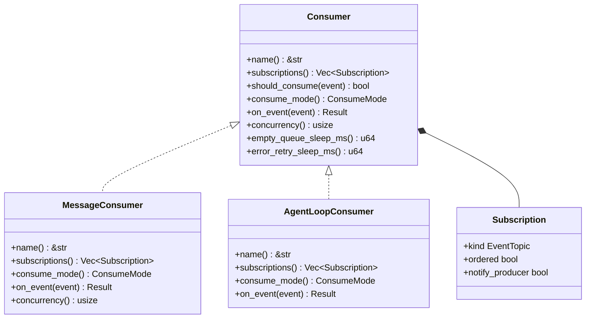
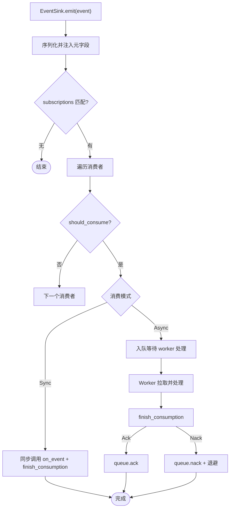
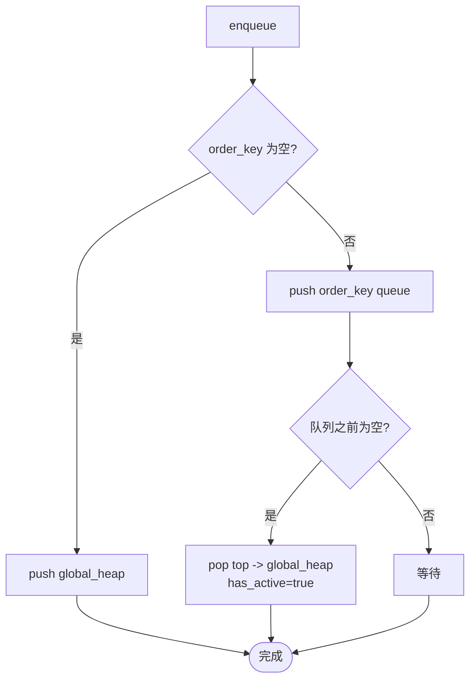
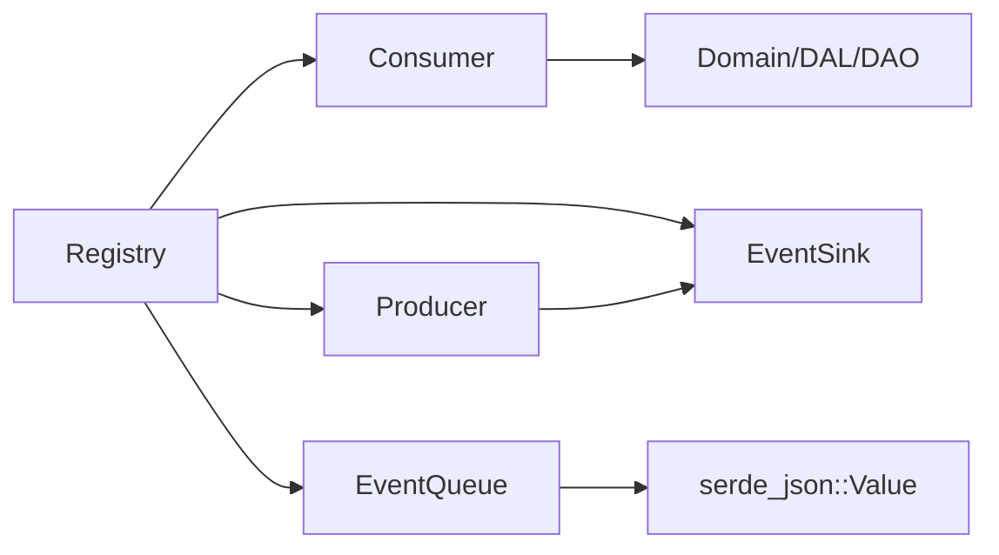

# 生产者消费者模式

<cite>
**本文引用的文件**
- [src/pkg/aop/mod.rs](src/pkg/aop/mod.rs)
- [src/pkg/aop/core/producer.rs](src/pkg/aop/core/producer.rs)
- [src/pkg/aop/core/consumer.rs](src/pkg/aop/core/consumer.rs)
- [src/pkg/aop/core/event.rs](src/pkg/aop/core/event.rs)
- [src/pkg/aop/core/event_sink.rs](src/pkg/aop/core/event_sink.rs)
- [src/pkg/aop/core/registry.rs](src/pkg/aop/core/registry.rs)
- [src/pkg/aop/queue/in_memory.rs](src/pkg/aop/queue/in_memory.rs)
- [common/src/enums/event_topic.rs](common/src/enums/event_topic.rs)
- [src/consumer/mod.rs](src/consumer/mod.rs)
- [src/consumer/message.rs](src/consumer/message.rs)
- [src/consumer/agent_loop_consumer.rs](src/consumer/agent_loop_consumer.rs)
- [src/consumer/a2a_poll.rs](src/consumer/a2a_poll.rs)
- [src/producer/mod.rs](src/producer/mod.rs)
- [src/producer/cron_trigger.rs](src/producer/cron_trigger.rs)
- [src/producer/a2a_polling.rs](src/producer/a2a_polling.rs)
- [src/service/dal/message.rs](src/service/dal/message.rs)
</cite>

## 更新摘要
**变更内容**
- 消费者订阅由 `interested_events()` 改为 `subscriptions() -> Vec<Subscription>`（`kind`/`ordered`/`notify_producer`）；删除 `Consumer::ack/nack`
- 生产者 trait 改形：删除 `register()`/`poll()`/`poll_interval_secs()`，新增 `topic()`/`on_consumed()`/`on_failed()`/`start(EventSink)`/`stop()`；轮询由 `ProducerLoop` 自管
- 引入 `EventSink`（预绑定 topic，强制执行 1 producer : 1 topic）与 `RetryDecision { Retry, Discard }`（无 max_retry、无死信）
- 「DAL-as-Producer」归属模型：拥有某 topic 收尾能力的对象自身实现 `Producer`（如 `MessageDalImpl`、`EmailDalImpl`、`WechatDalImpl`、`LarkDalImpl`），不新建 `producer/` 类型
- A2A 拆为「认领 + 消费」：`A2aPollingProducer` 只 `claim` 派发 `A2aPollRequestedEvent`，真正拉取在 `A2aPollConsumer`（Async + ordered）执行
- 既往缺陷修复（P3 cron 收尾移到 `on_consumed`、P2 游标随消费推进、P6 入站失败改报 Err 走 `inbound_retry::decide`）已纳入正文

## 目录
1. [简介](#简介)
2. [项目结构](#项目结构)
3. [核心组件](#核心组件)
4. [架构总览](#架构总览)
5. [详细组件分析](#详细组件分析)
6. [依赖关系分析](#依赖关系分析)
7. [性能与背压](#性能与背压)
8. [故障排查指南](#故障排查指南)
9. [结论](#结论)
10. [附录：使用示例与最佳实践](#附录：使用示例与最佳实践)

## 简介
本文件围绕 AOP 事件系统的"生产者-消费者"模式，系统性说明 Producer trait 的设计与实现、Consumer trait 的抽象与消费模式（同步/异步）、事件路由与调度机制、错误处理与重试策略、以及背压、流量控制与资源管理。文档同时给出注册、订阅、发布、消费的完整流程与图示，帮助读者快速理解并正确使用该事件中心。归属模型上，拥有某 topic 业务收尾能力的对象（DAL/Producer 自身）直接实现 `Producer`，由框架在 `finish_consumption` 时反查回调。

## 项目结构
AOP 事件中心位于 src/pkg/aop，提供纯框架能力（无业务感知），业务生产者归属在拥有该 topic 的对象自身（如 src/service/dal、src/producer），业务消费者位于 src/consumer。启动时先注册生产者和消费者，再启动调度；事件通过 Registry 按 `EventTopic` 统一分发到对应 Consumer，异步消费者由独立 worker 拉取队列中的事件处理。

图表来源
- [src/pkg/aop/core/registry.rs#L15-L123](src/pkg/aop/core/registry.rs#L15-L123)
- [src/pkg/aop/core/event_sink.rs#L1-L54](src/pkg/aop/core/event_sink.rs#L1-L54)
- [src/pkg/aop/queue/in_memory.rs#L104-L177](src/pkg/aop/queue/in_memory.rs#L104-L177)
- [src/consumer/mod.rs#L16-L36](src/consumer/mod.rs#L16-L36)
- [src/producer/mod.rs#L9-L26](src/producer/mod.rs#L9-L26)

章节来源
- [src/pkg/aop/mod.rs#L1-L61](src/pkg/aop/mod.rs#L1-L61)
- [src/consumer/mod.rs#L16-L36](src/consumer/mod.rs#L16-L36)
- [src/producer/mod.rs#L9-L26](src/producer/mod.rs#L9-L26)

## 核心组件
- Event/EventTopic：事件主题标识（`EventTopic` 闭合枚举）与通用元数据（id、order_key、priority、created_at）。
- Producer：拥有某 topic 业务收尾能力的对象，经 `start(EventSink)` 自管循环、`stop()` 优雅退出；提供 `on_consumed`/`on_failed`。
- Consumer：事件消费者，支持同步与异步两种消费模式，通过 `subscriptions()` 声明订阅与 `notify_producer` 回调；不再有 ack/nack。
- Registry：注册中心，按 topic 维护消费者/生产者索引，负责事件路由、异步 worker 启动、收尾回调反查与指标埋点。
- EventSink：发布句柄，预绑定 producer.topic()，`emit` 强制执行 1 producer : 1 topic。
- InMemoryEventQueue：内存队列，维护待处理、进行中、按 order_key 的顺序保证与优先级出队。

章节来源
- [src/pkg/aop/core/event.rs#L1-L17](src/pkg/aop/core/event.rs#L1-L17)
- [src/pkg/aop/core/producer.rs#L11-L154](src/pkg/aop/core/producer.rs#L11-L154)
- [src/pkg/aop/core/consumer.rs#L21-L112](src/pkg/aop/core/consumer.rs#L21-L112)
- [src/pkg/aop/core/registry.rs#L15-L123](src/pkg/aop/core/registry.rs#L15-L123)
- [src/pkg/aop/core/event_sink.rs#L1-L54](src/pkg/aop/core/event_sink.rs#L1-L54)
- [src/pkg/aop/queue/in_memory.rs#L41-L177](src/pkg/aop/queue/in_memory.rs#L41-L177)

## 架构总览
事件从生产者经 `EventSink::emit` 发出，由 Registry 序列化并注入元字段后，按消费者对该 `EventTopic` 的订阅（`subscriptions`）路由。同步消费者在发布线程直接调用 on_event；异步消费者入队，由 Registry 启动的 worker 循环拉取处理，经 `finish_consumption` 判定 Ack/Nack——`Ok` → `on_consumed` → ack；`Err` → `on_failed` 返回 `RetryDecision` → `Retry`(nack)/`Discard`(ack，仍回调 on_consumed)。

图表来源
- [src/pkg/aop/core/registry.rs#L142-L271](src/pkg/aop/core/registry.rs#L142-L271)
- [src/pkg/aop/core/registry.rs#L343-L562](src/pkg/aop/core/registry.rs#L343-L562)
- [src/pkg/aop/core/registry.rs#L734-L802](src/pkg/aop/core/registry.rs#L734-L802)
- [src/pkg/aop/queue/in_memory.rs#L104-L267](src/pkg/aop/queue/in_memory.rs#L104-L267)

## 详细组件分析

### Producer trait 设计与实现
- 名称与归属：name() 用于日志与追踪；topic() 声明归属的 `EventTopic`，AOP 在 start() 时注入预绑定该 topic 的 `EventSink`。
- 业务收尾：on_consumed(ctx, event) 在消费成功或 Discard 后回调（先于 queue.ack，必须幂等）；on_failed(ctx, event, err, attempt) → `RetryDecision`，决定重投或丢弃（无 max_retry、无死信）。
- 生命周期：start(sink) 必须 spawn 后**立即返回**；stop() 必须置位并 await `JoinHandle`。
- 轮询自管：轮询由 `ProducerLoop`（AtomicBool + 250ms 可中断 sleep）实现，不再有 `poll()`/`poll_interval_secs()`。
- 典型实现：CronTriggerProducer 每 60s `tick` 列出到期触发器并逐个 `sink.emit(CronTriggerEvent)`；其 `mark_trigger_executed` 已移到 `on_consumed`（P3 修复）。

图表来源
- [src/pkg/aop/core/producer.rs#L11-L154](src/pkg/aop/core/producer.rs#L11-L154)
- [src/pkg/aop/core/event_sink.rs#L1-L54](src/pkg/aop/core/event_sink.rs#L1-L54)
- [src/producer/cron_trigger.rs#L92-L207](src/producer/cron_trigger.rs#L92-L207)

章节来源
- [src/pkg/aop/core/producer.rs#L11-L154](src/pkg/aop/core/producer.rs#L11-L154)
- [src/producer/cron_trigger.rs#L92-L207](src/producer/cron_trigger.rs#L92-L207)

### Consumer trait 与 ConsumeMode
- 消费模式：ConsumeMode::Sync 为同步模式，发布线程直接调用 on_event；ConsumeMode::Async 为异步模式，事件入队，由 worker 拉取处理。
- 订阅声明：`subscriptions() -> Vec<Subscription>`，每项含 `kind: EventTopic`、`ordered: bool`、`notify_producer: bool`；`ordered` 仅被注册期校验读取（Sync 声明 `ordered` → 注册 Err）。
- 异步增强：concurrency() 控制 worker 数量；empty_queue_sleep_ms() 与 error_retry_sleep_ms() 控制空队列休眠与出错重试退避；收尾由 `finish_consumption` 统一判定（已无 ack/nack）。

图表来源
- [src/pkg/aop/core/consumer.rs#L21-L112](src/pkg/aop/core/consumer.rs#L21-L112)
- [src/consumer/message.rs#L64-L141](src/consumer/message.rs#L64-L141)
- [src/consumer/agent_loop_consumer.rs#L26-L96](src/consumer/agent_loop_consumer.rs#L26-L96)

章节来源
- [src/pkg/aop/core/consumer.rs#L21-L112](src/pkg/aop/core/consumer.rs#L21-L112)
- [src/consumer/message.rs#L64-L141](src/consumer/message.rs#L64-L141)
- [src/consumer/agent_loop_consumer.rs#L26-L96](src/consumer/agent_loop_consumer.rs#L26-L96)

### 事件发布与路由流程
- 发布入口：生产者经 `EventSink::emit` 发布；`EventSink` 校验 `event.kind() == 自身 topic` 后由 Registry::publish 序列化并注入 event_id、kind、order_key、priority、created_at、attempt 等元字段。
- 路由规则：按消费者 `subscriptions()` 的 `kind`（EventTopic）匹配，依次调用 should_consume 过滤。
- 同步路径：直接调用 consumer.on_event，经 `finish_consumption` 判定收尾。
- 异步路径：将事件入队，worker 循环拉取，处理成功后 `finish_consumption` → Ack，失败则 `on_failed` → `Retry`(Nack)/`Discard`(Ack)。

图表来源
- [src/pkg/aop/core/registry.rs#L142-L271](src/pkg/aop/core/registry.rs#L142-L271)
- [src/pkg/aop/core/registry.rs#L343-L562](src/pkg/aop/core/registry.rs#L343-L562)
- [src/pkg/aop/core/registry.rs#L734-L802](src/pkg/aop/core/registry.rs#L734-L802)

章节来源
- [src/pkg/aop/core/registry.rs#L142-L271](src/pkg/aop/core/registry.rs#L142-L271)
- [src/pkg/aop/core/registry.rs#L343-L562](src/pkg/aop/core/registry.rs#L343-L562)
- [src/pkg/aop/core/registry.rs#L734-L802](src/pkg/aop/core/registry.rs#L734-L802)

### 内存队列与顺序保证
- 数据结构：全局堆（global_heap）按 priority DESC、created_at ASC 排序；每个 order_key 独立队列；in_progress 记录正在处理的事件；has_active_message 标记某 order_key 是否已有活动消息。
- 入队：若无 order_key 进入全局堆；若有 order_key 进入对应队列，若队列为空且无活动消息，则将队首推入全局堆并标记活动。
- 出队：优先从全局堆弹出，注入 `EventRef.attempt` 后移入 in_progress。
- 确认/否定：`finish_consumption` 结论为 Ack 时删除事件并推进同 order_key 下一项；为 Nack 时重新入队并恢复活动标记。
- 统计与查询：提供 pending/in_progress 计数、最老事件年龄、按 order_key/status 分页查询等。

图表来源
- [src/pkg/aop/queue/in_memory.rs#L104-L177](src/pkg/aop/queue/in_memory.rs#L104-L177)

章节来源
- [src/pkg/aop/queue/in_memory.rs#L104-L267](src/pkg/aop/queue/in_memory.rs#L104-L267)

### DAL-as-Producer 归属模型
归属 = 拥有该 topic 收尾能力的对象自身，不再新建 `producer/` 类型。装配时用同一 `Arc` 各 coerce 一次，分别注册 `Arc<dyn XxxDal>` 与 `Arc<dyn Producer>`（DAL trait 没有 Producer supertrait，否则测试桩被迫实现）。

| topic | 生产者对象 | 在哪注册 |
|---|---|---|
| `message.created` | `MessageDalImpl` | `dal::init()` |
| `cron.trigger` | `CronTriggerProducer` | `producer::init()` |
| `email.inbound.message` | `EmailDalImpl` | `dal/email/mod.rs::init()` |
| `wechat.inbound.message` | `WechatDalImpl` | `dal/wechat/mod.rs::init()` |
| `lark.inbound.message` | `LarkDalImpl` | `dal/lark/mod.rs::init()` |
| `a2a.poll.requested` | 无（`A2aPollingProducer` 只 emit，不声明 notify_producer） | — |

启动顺序：`dal::init_all()`（4 个 DAL producer）→ `producer::init()`（cron + a2a）→ `consumer::init()`（含 a2a_poll）→ `aop::init_all()`。

章节来源
- [src/service/dal/message.rs](src/service/dal/message.rs)
- [src/producer/cron_trigger.rs#L92-L207](src/producer/cron_trigger.rs#L92-L207)
- [src/producer/a2a_polling.rs#L86-L141](src/producer/a2a_polling.rs#L86-L141)
- [src/consumer/a2a_poll.rs#L46-L73](src/consumer/a2a_poll.rs#L46-L73)
- [src/pkg/aop/core/registry.rs#L102-L123](src/pkg/aop/core/registry.rs#L102-L123)

### 典型消费者：消息消费者（异步）
- 订阅事件：`message.created`（声明 `notify_producer`，由 `MessageDalImpl` 收尾）。
- 消费模式：异步，concurrency=4，空队列休眠 100ms，错误重试休眠 1000ms。
- 业务编排：根据 to_role 分发到不同 domain（Agent/User/System），必要时重建 RequestContext，调用 RuntimeDomain/MessageDomain/HrDomain/ProjectDomain 完成唤醒、投递或工具调用。
- 确认机制：成功更新消息状态为已处理；失败回滚为 Pending，触发 `finish_consumption` → `on_failed`（由 `MessageDalImpl` 决策重投/丢弃）。

章节来源
- [src/consumer/message.rs#L64-L141](src/consumer/message.rs#L64-L141)
- [src/consumer/message.rs#L78-L128](src/consumer/message.rs#L78-L128)

### 典型消费者：Agent 循环日志（同步）
- 订阅事件：agent.loop、agent.think.round。
- 消费模式：同步，适合轻量级日志记录。
- 行为：解析事件并输出结构化日志，便于观测 Agent 生命周期与每轮思考指标。

章节来源
- [src/consumer/agent_loop_consumer.rs#L26-L96](src/consumer/agent_loop_consumer.rs#L26-L96)

### A2A：认领 + 消费拆分
- 认领：`A2aPollingProducer` 每 30s `claim` 列出全部远端 Agent，逐个 `sink.emit(A2aPollRequestedEvent)`；只派发不拉取，进度账在 task tags 的 `a2a_synced_msgs` 里（不声明 `notify_producer`）。
- 消费：`A2aPollConsumer`（Async + `.ordered()`，order_key=agent_id）订阅 `A2aPollRequestedEvent`，`on_event` → `poll_agent` 执行原 tick 的远端抓取/消息投递/`a2a_synced_msgs` tag 推进/`transition_status`；逐 task ctx 用 `RequestContext::builder().caller_type(System).agent_id(..).task_id(..)`（有则加 `project_id`）。

章节来源
- [src/producer/a2a_polling.rs#L48-L141](src/producer/a2a_polling.rs#L48-L141)
- [src/consumer/a2a_poll.rs#L46-L296](src/consumer/a2a_poll.rs#L46-L296)
- [src/models/events/a2a_poll.rs](src/models/events/a2a_poll.rs)

### 生产者注册与消费者订阅
- 生产者注册：装配期 `dal::init` / `producer::init` 注册各生产者（拥有归属的对象自身），通过 `Registry::register_producer`（同步，1 topic : 1 producer 硬校验）。
- 消费者注册：consumer::init 中注册多个业务消费者（声明 `subscriptions`，含 `notify_producer` 与否）。
- 启动调度：aop::init_all 先做校验（声明 notify_producer 的 topic 缺生产者 → 启动失败），再启动所有异步消费者的 worker 与生产者自管循环。

章节来源
- [src/producer/mod.rs#L9-L26](src/producer/mod.rs#L9-L26)
- [src/consumer/mod.rs#L16-L36](src/consumer/mod.rs#L16-L36)
- [src/pkg/aop/mod.rs#L53-L61](src/pkg/aop/mod.rs#L53-L61)
- [src/pkg/aop/core/registry.rs#L343-L602](src/pkg/aop/core/registry.rs#L343-L602)

## 依赖关系分析
- Registry 依赖 Queue、Consumer、Producer、EventSink、MetricsHook；通过 topic 索引（HashMap<EventTopic, _>）避免循环引用，不再使用 `Weak<Self>`。
- 内存队列依赖 RequestContext 与 JSON Value，内部以 Mutex 保证并发安全。
- 业务消费者依赖 Domain/DAL/DAO 完成具体业务逻辑，但仅通过接口解耦。
- 生产者通过 `EventSink` 发布事件，topic 被预绑定，无法耦合到别的 topic 的事件。

图表来源
- [src/pkg/aop/core/registry.rs#L15-L123](src/pkg/aop/core/registry.rs#L15-L123)
- [src/pkg/aop/core/event_sink.rs#L1-L54](src/pkg/aop/core/event_sink.rs#L1-L54)
- [src/consumer/message.rs#L17-L32](src/consumer/message.rs#L17-L32)
- [src/producer/cron_trigger.rs#L1-L37](src/producer/cron_trigger.rs#L1-L37)

章节来源
- [src/pkg/aop/core/registry.rs#L15-L123](src/pkg/aop/core/registry.rs#L15-L123)
- [src/pkg/aop/queue/in_memory.rs#L1-L10](src/pkg/aop/queue/in_memory.rs#L1-L10)
- [src/consumer/message.rs#L17-L32](src/consumer/message.rs#L17-L32)
- [src/producer/cron_trigger.rs#L1-L37](src/producer/cron_trigger.rs#L1-L37)

## 性能与背压
- 优先级与顺序：全局堆按优先级与创建时间排序；相同 order_key 的事件顺序消费，避免乱序。
- 并发度控制：消费者可通过 concurrency() 设置 worker 数量，平衡吞吐与资源占用。
- 退避与节流：空队列休眠与错误重试休眠避免忙轮询；on_event 失败后 `finish_consumption` 经 `on_failed` 得 `RetryDecision`，sleep 防止紧密自旋。
- 背压与限流：当前内存队列无显式容量限制，高负载下可能堆积内存；建议在高吞吐场景结合外部队列或增加监控告警，必要时引入批处理与限速策略。
- 资源管理：Registry 持有消费者与队列的 Arc 引用；队列使用 Mutex 保护共享状态；`finish_consumption` 的 Ack/Nack 确保事件状态一致，避免泄漏。

[本节为通用指导，不直接分析具体文件]

## 故障排查指南
- 事件未消费：检查消费者 `subscriptions` 的 `kind` 是否正确；确认 should_consume 过滤条件；查看队列统计与事件详情。
- 重复消费或卡死：确认 `finish_consumption` 结论是否落到 queue.ack/nack；检查 order_key 活动标记与队列推进逻辑；观察 in_progress 与 pending 计数。
- 业务收尾丢失/启动失败：声明 `notify_producer` 的 topic 缺生产者 → `start_all` 返回 Err（早于 started 置位）。
- 频繁重试风暴：关注 `on_failed` 返回的 `RetryDecision`；框架无 max_retry，需生产者自行用永久错误表决定 `Discard`（如 `inbound_retry::decide`）。
- 性能问题：调整 concurrency、empty_queue_sleep_ms、error_retry_sleep_ms；关注队列长度与最老事件年龄；评估是否需要批处理或外部队列。
- 指标缺失：确认 metrics hook 已注入；检查 on_publish/on_consume_start/success/failure/discarded 是否被调用。

章节来源
- [src/pkg/aop/core/registry.rs#L343-L602](src/pkg/aop/core/registry.rs#L343-L602)
- [src/pkg/aop/core/registry.rs#L734-L802](src/pkg/aop/core/registry.rs#L734-L802)
- [src/pkg/aop/queue/in_memory.rs#L300-L447](src/pkg/aop/queue/in_memory.rs#L300-L447)

## 结论
AOP 事件系统通过 Producer/Consumer 抽象与 Registry 调度，实现了松耦合、可扩展的事件驱动架构。同步模式适合轻量处理，异步模式具备高吞吐与重试能力；内存队列提供顺序保证与优先级调度。通过「DAL-as-Producer」归属模型与 `EventSink` 强制 1 producer : 1 topic，收尾经 `finish_consumption` 单一出口按 topic 反查回调，可在保障稳定性的同时获得良好的可观测性与可靠性。对于更高吞吐与持久化需求，可平滑替换底层队列实现。

[本节为总结性内容，不直接分析具体文件]

## 附录：使用示例与最佳实践
- 生产者注册：拥有归属的对象在装配期 `register_producer`（如 `dal::init` 注册 `MessageDalImpl`），topic 由 `topic()` 声明，1 topic : 1 producer 硬校验。
- 消费者订阅：在 consumer::init 中注册消费者，声明 `subscriptions`（含 `notify_producer` 与否）与消费模式。
- 事件发布：生产者经 `EventSink::emit` 发布（框架已注入元字段）。
- 启动调度：调用 aop::init_all 启动异步消费者 worker 与生产者自管循环（先做 notify_producer 校验）。
- 背压与资源：合理设置 concurrency、sleep 参数；监控队列长度与事件年龄；必要时引入批处理与外部队列。

章节来源
- [src/producer/mod.rs#L9-L26](src/producer/mod.rs#L9-L26)
- [src/consumer/mod.rs#L16-L36](src/consumer/mod.rs#L16-L36)
- [src/pkg/aop/mod.rs#L48-L61](src/pkg/aop/mod.rs#L48-L61)
