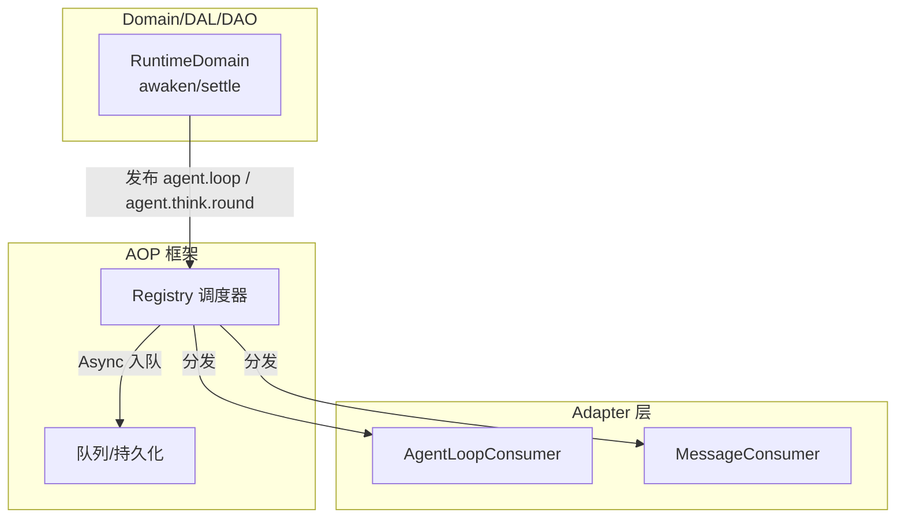
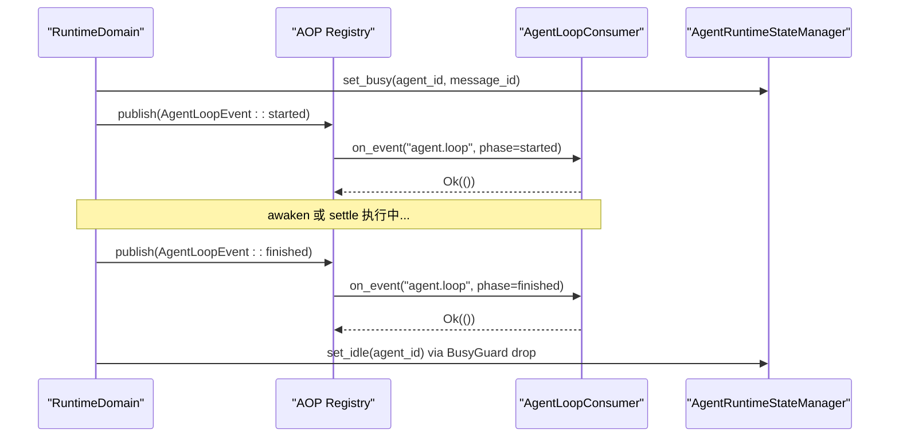
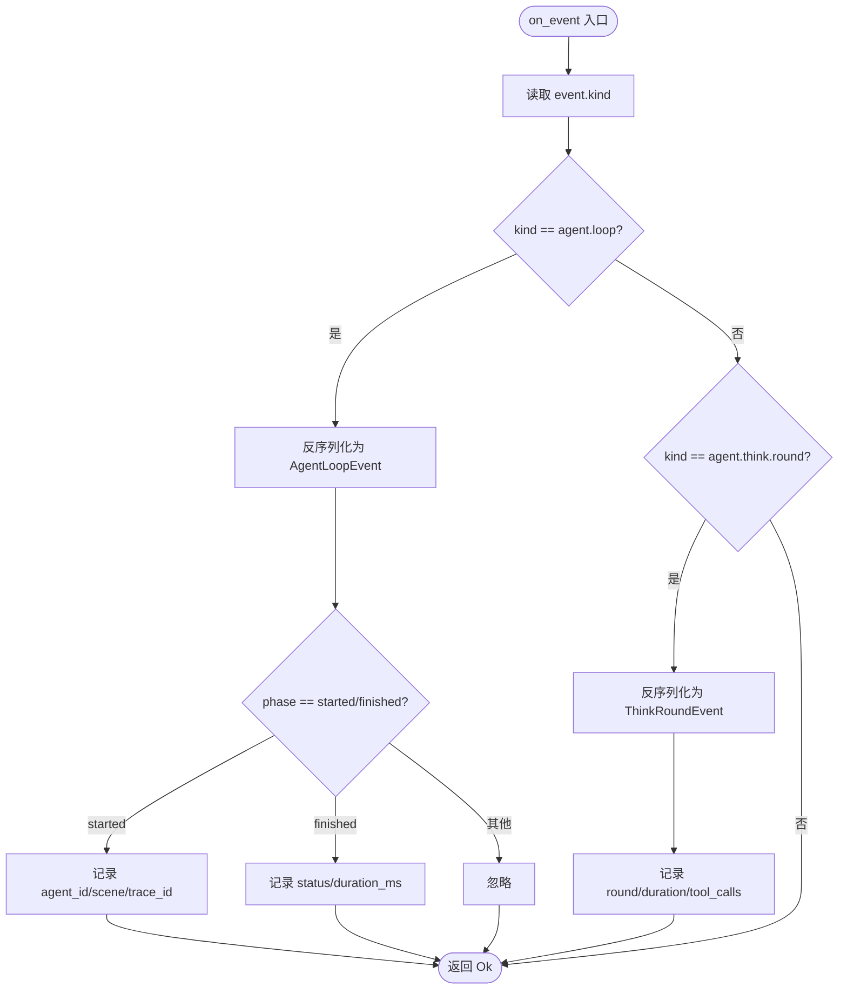
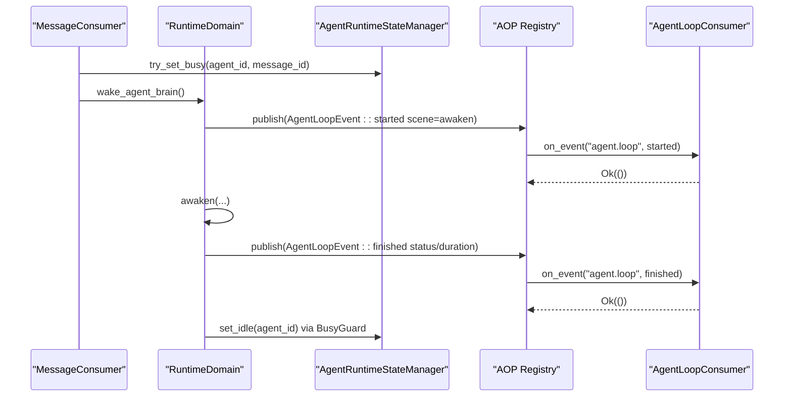
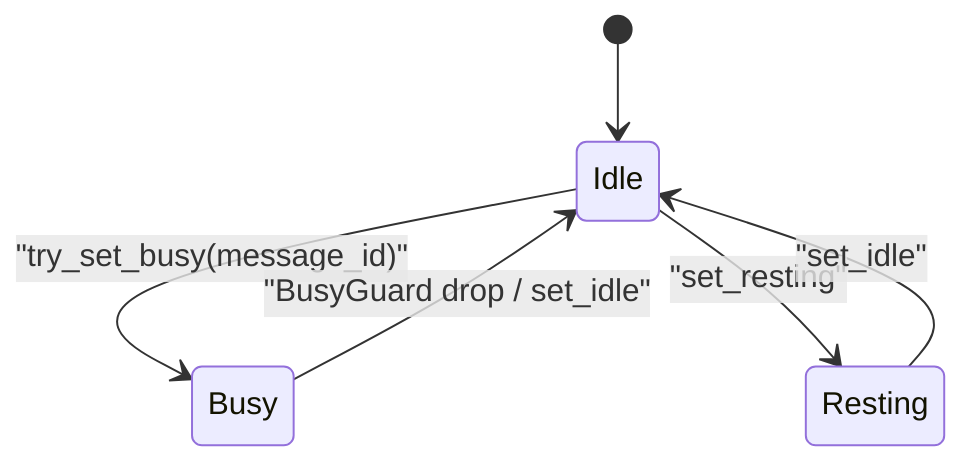
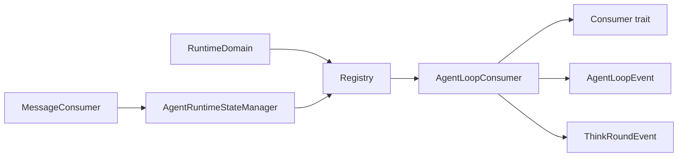

# Agent 循环消费者（框架层）

<cite>
**本文引用的文件**
- [agent_loop_consumer.rs](src/consumer/agent_loop_consumer.rs)
- [mod.rs（consumer 注册）](src/consumer/mod.rs)
- [consumer.rs（AOP Consumer trait）](src/pkg/aop/core/consumer.rs)
- [registry.rs（AOP 调度与重试）](src/pkg/aop/core/registry.rs)
- [agent_loop.rs（AgentLoopEvent）](src/models/events/agent_loop.rs)
- [think_round.rs（ThinkRoundEvent）](src/models/events/think_round.rs)
- [awakening.rs（awaken/settle 事件发布）](src/service/domain/runtime/awakening.rs)
- [busy_guard.rs（Busy RAII 清理）](src/service/domain/runtime/busy_guard.rs)
- [agent_runtime_state.rs（状态管理与 try_set_busy）](src/pkg/agent_runtime_state.rs)
- [message.rs（MessageConsumer 唤醒流程）](src/consumer/message.rs)
- [Intent 感知两阶段唤醒：IntentAnalyze Phase1 七字段意图分析 + 6 级 JSON 降级兜底 + Awaken Phase2 正式执行串联](docs/wiki/knowledge/zh/Intent 感知两阶段唤醒：IntentAnalyze Phase1 七字段意图分析 + 6 级 JSON 降级兜底 + Awaken Phase2 正式执行串联/Intent 感知两阶段唤醒：IntentAnalyze Phase1 七字段意图分析 + 6 级 JSON 降级兜底 + Awaken Phase2 正式执行串联.md)
</cite>

## 目录
1. [简介](#简介)
2. [项目结构](#项目结构)
3. [核心组件](#核心组件)
4. [架构总览](#架构总览)
5. [详细组件分析](#详细组件分析)
6. [依赖关系分析](#依赖关系分析)
7. [性能考量](#性能考量)
8. [故障排查指南](#故障排查指南)
9. [结论](#结论)
10. [附录：自定义事件处理最佳实践](#附录自定义事件处理最佳实践)

## 简介
本文件面向"Agent 循环消费者"的实现与使用，聚焦 AgentLoopConsumer 的设计与行为，覆盖以下主题：
- Agent 生命周期事件的处理：唤醒、思考轮次、沉淀等
- 状态转换逻辑：Idle/Busy/Resting 的原子切换与保护
- 异步处理机制：同步/异步消费模式、重试与退避
- 事件过滤规则、错误重试策略与性能优化技巧
- 自定义 Agent 事件处理的示例与最佳实践

> 📌 视角说明（AGENTS §2.1.3 Level 3 互补视角平行卡）：
> 本长文是「Agent 循环消费者」主题的 **框架层** 视角。同主题还有以下平行视角卡，请按需交叉阅读：
> - [Agent 循环消费者（代码落地层）](docs/wiki/zh/content/核心模块/AOP 事件系统/消费者框架/Agent 循环消费者.md)

## 项目结构
AgentLoopConsumer 位于 consumer 层，订阅 AOP 事件中心发布的 agent.loop 与 agent.think.round 事件，用于记录 Agent 循环的开始/结束与每轮 think 的指标。它通过统一的 Consumer trait 接入 AOP 框架，并遵循四层单向调用原则（Adapter → Domain → DAL → DAO），自身属于 Adapter 层的事件消费实现。

图表来源
- [agent_loop_consumer.rs:26-43](src/consumer/agent_loop_consumer.rs#L26-L43)
- [consumer.rs:6-13](src/pkg/aop/core/consumer.rs#L6-L13)
- [registry.rs:394-435](src/pkg/aop/core/registry.rs#L394-L435)
- [awakening.rs:775-804](src/service/domain/runtime/awakening.rs#L775-L804)

章节来源
- [mod.rs（consumer 注册）:16-37](src/consumer/mod.rs#L16-L37)
- [consumer.rs:6-13](src/pkg/aop/core/consumer.rs#L6-L13)

## 核心组件
- AgentLoopConsumer：订阅 agent.loop 与 agent.think.round 事件，进行日志记录与可观测性采集。
- AgentLoopEvent：描述 Agent 循环的 started/finished 阶段，包含场景（awaken/settle）、耗时、状态等。
- ThinkRoundEvent：描述单轮 think 的指标（轮次、耗时、工具调用次数、token 用量、上下文等）。
- BusyGuard：RAII 守卫，确保 Agent 在 awaken/settle 过程中无论成功失败都释放 Busy 状态。
- AgentRuntimeStateManager：提供 Idle/Busy/Resting 状态管理，以及 try_set_busy 原子抢占，避免并发重复唤醒。
- MessageConsumer：消息到达后触发 Agent 唤醒，内部会设置 Busy、发布循环事件、执行 awaken 或 settle。

章节来源
- [agent_loop_consumer.rs:12-43](src/consumer/agent_loop_consumer.rs#L12-L43)
- [agent_loop.rs:4-23](src/models/events/agent_loop.rs#L4-L23)
- [think_round.rs:4-39](src/models/events/think_round.rs#L4-L39)
- [busy_guard.rs:1-32](src/service/domain/runtime/busy_guard.rs#L1-L32)
- [agent_runtime_state.rs:85-119](src/pkg/agent_runtime_state.rs#L85-L119)
- [message.rs:290-317](src/consumer/message.rs#L290-L317)

## 架构总览
Agent 循环的生命周期由 RuntimeDomain 在 awaken 与 sleep_and_settle 两个阶段发布事件；AgentLoopConsumer 作为同步消费者记录这些事件，便于追踪与监控。

图表来源
- [awakening.rs:775-804](src/service/domain/runtime/awakening.rs#L775-L804)
- [agent_loop.rs:25-59](src/models/events/agent_loop.rs#L25-L59)
- [agent_loop_consumer.rs:43-74](src/consumer/agent_loop_consumer.rs#L43-L74)
- [busy_guard.rs:21-32](src/service/domain/runtime/busy_guard.rs#L21-L32)

## 详细组件分析

### AgentLoopConsumer 事件处理
- 订阅事件：agent.loop、agent.think.round
- 消费模式：Sync（同步），事件发布时立即处理，适合轻量日志记录
- 处理逻辑：
  - agent.loop.started：记录 agent_id、scene、trace_id
  - agent.loop.finished：记录 status、duration_ms
  - agent.think.round：记录 round_number、duration_ms、tool_call_count

图表来源
- [agent_loop_consumer.rs:26-97](src/consumer/agent_loop_consumer.rs#L26-L97)
- [agent_loop.rs:25-59](src/models/events/agent_loop.rs#L25-L59)
- [think_round.rs:41-105](src/models/events/think_round.rs#L41-L105)

章节来源
- [agent_loop_consumer.rs:26-97](src/consumer/agent_loop_consumer.rs#L26-L97)

### Agent 生命周期事件发布
- awaken 阶段：
  - 设置 Busy 状态（try_set_busy）
  - 构造 trace_id
  - 发布 AgentLoopEvent::started（scene=awaken）
- settle 阶段：
  - 设置 Resting（set_resting）
  - 装配 Brain、拼装沉淀 Prompt
  - 发布 AgentLoopEvent::started（scene=settle）
- 完成阶段：
  - 发布 AgentLoopEvent::finished（status、duration_ms）
  - 释放 Busy（BusyGuard drop）

图表来源
- [message.rs:290-317](src/consumer/message.rs#L290-L317)
- [awakening.rs:775-804](src/service/domain/runtime/awakening.rs#L775-L804)
- [busy_guard.rs:21-32](src/service/domain/runtime/busy_guard.rs#L21-L32)
- [agent_runtime_state.rs:85-119](src/pkg/agent_runtime_state.rs#L85-L119)

章节来源
- [awakening.rs:775-829](src/service/domain/runtime/awakening.rs#L775-L829)
- [busy_guard.rs:1-32](src/service/domain/runtime/busy_guard.rs#L1-L32)

### 状态转换与并发安全
- 状态枚举：Idle、Busy、Resting
- try_set_busy：原子尝试将 Idle 转为 Busy，若当前不可用则拒绝，避免同一 Agent 被多个 worker 同时唤醒
- BusyGuard：RAII 模式确保任何路径（包括 panic、提早返回）都会 set_idle，防止状态泄漏
- 消息消费前检查：使用 try_set_busy 替代先 check 再 set 的模式，消除 TOCTOU 竞态

图表来源
- [agent_runtime_state.rs:85-119](src/pkg/agent_runtime_state.rs#L85-L119)
- [busy_guard.rs:21-32](src/service/domain/runtime/busy_guard.rs#L21-L32)

章节来源
- [agent_runtime_state.rs:85-119](src/pkg/agent_runtime_state.rs#L85-L119)
- [busy_guard.rs:1-32](src/service/domain/runtime/busy_guard.rs#L1-L32)

### 思考轮次事件与指标
- ThinkRoundEvent 记录每轮 think 的轮次、耗时、是否触发工具调用、模型信息、token 用量、组织/用户/任务/项目上下文
- AgentLoopConsumer 以 debug 级别记录关键指标，便于问题定位与性能分析

章节来源
- [think_round.rs:4-124](src/models/events/think_round.rs#L4-L124)
- [agent_loop_consumer.rs:75-90](src/consumer/agent_loop_consumer.rs#L75-L90)

## 依赖关系分析
- AgentLoopConsumer 依赖 AOP Consumer trait 与 Event 类型
- RuntimeDomain 在 awaken/settle 中发布 AgentLoopEvent 与 ThinkRoundEvent
- MessageConsumer 负责消息到 Agent 的唤醒流程，并与状态管理器交互
- Registry 负责事件分发、异步入队、重试与退避

图表来源
- [consumer.rs:6-13](src/pkg/aop/core/consumer.rs#L6-L13)
- [agent_loop.rs:4-23](src/models/events/agent_loop.rs#L4-L23)
- [think_round.rs:4-39](src/models/events/think_round.rs#L4-L39)
- [registry.rs:394-435](src/pkg/aop/core/registry.rs#L394-L435)

章节来源
- [consumer.rs:6-13](src/pkg/aop/core/consumer.rs#L6-L13)
- [registry.rs:394-435](src/pkg/aop/core/registry.rs#L394-L435)

## 性能考量
- 同步消费模式：AgentLoopConsumer 采用 Sync 模式，避免额外队列开销，适合轻量日志记录
- 事件过滤：可通过 should_consume 对事件进行过滤，减少不必要处理
- 重试与退避：
  - Async 模式下，on_event 失败会 nack 并重试，配合 error_retry_sleep_ms 退避，避免紧密自旋
  - 队列为空时 empty_queue_sleep_ms 控制轮询节奏
- 并发控制：concurrency 限制每个消费者的 worker 数量，避免资源争用
- 指标埋点：AOP 框架在 publish/consume/success/failure 处埋点，结合 AopStatsHook 收集统计

章节来源
- [consumer.rs:32-70](src/pkg/aop/core/consumer.rs#L32-L70)
- [registry.rs:394-435](src/pkg/aop/core/registry.rs#L394-L435)

## 故障排查指南
- Agent 永远 Busy：
  - 检查 awaken 中是否正确创建 BusyGuard，确保 set_idle 在所有返回路径被执行
  - 确认 try_set_busy 使用正确，避免并发重复唤醒
- 事件未消费：
  - 检查 Consumer 是否注册（consumer/mod.rs 中的 init）
  - 检查 interested_events 是否匹配事件 kind
  - 检查 should_consume 是否误过滤
- 重试风暴：
  - 调整 error_retry_sleep_ms 与 empty_queue_sleep_ms
  - 检查 on_event 是否抛出可恢复错误导致频繁 nack
- 状态不一致：
  - 检查 set_busy/set_idle 调用位置，确保成对出现
  - 使用 try_set_busy 替代先查后设，避免 TOCTOU

章节来源
- [busy_guard.rs:1-32](src/service/domain/runtime/busy_guard.rs#L1-L32)
- [agent_runtime_state.rs:85-119](src/pkg/agent_runtime_state.rs#L85-L119)
- [consumer.rs:32-70](src/pkg/aop/core/consumer.rs#L32-L70)
- [registry.rs:394-435](src/pkg/aop/core/registry.rs#L394-L435)

## 结论
AgentLoopConsumer 通过 AOP 框架订阅 Agent 循环的关键事件，提供轻量、可靠的日志与可观测性支持。结合 BusyGuard 与 try_set_busy，系统实现了安全的状态转换与并发控制。通过合理的消费模式、事件过滤与重试退避策略，保证了高吞吐下的稳定性与性能。

## 附录：自定义事件处理最佳实践
- 选择消费模式：
  - 轻量处理（如日志）：使用 Sync 模式
  - 重处理（如 IO、外部调用）：使用 Async 模式，并实现 ack/nack
- 事件过滤：
  - 实现 should_consume 精确过滤，减少无效处理
- 错误处理：
  - 区分临时错误与永久错误，合理返回 Result 以便重试或丢弃
- 性能优化：
  - 调整 concurrency、empty_queue_sleep_ms、error_retry_sleep_ms
  - 避免 in on_event 中进行阻塞操作
- 示例：自定义消费者骨架
  - 参考 Consumer trait 的方法签名与默认实现
  - 在 consumer/mod.rs 的 init 中注册新消费者

章节来源
- [consumer.rs:6-70](src/pkg/aop/core/consumer.rs#L6-L70)
- [mod.rs（consumer 注册）:16-37](src/consumer/mod.rs#L16-L37)