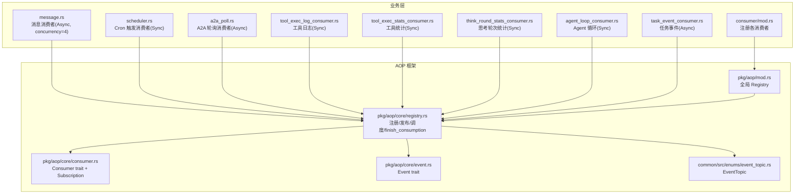
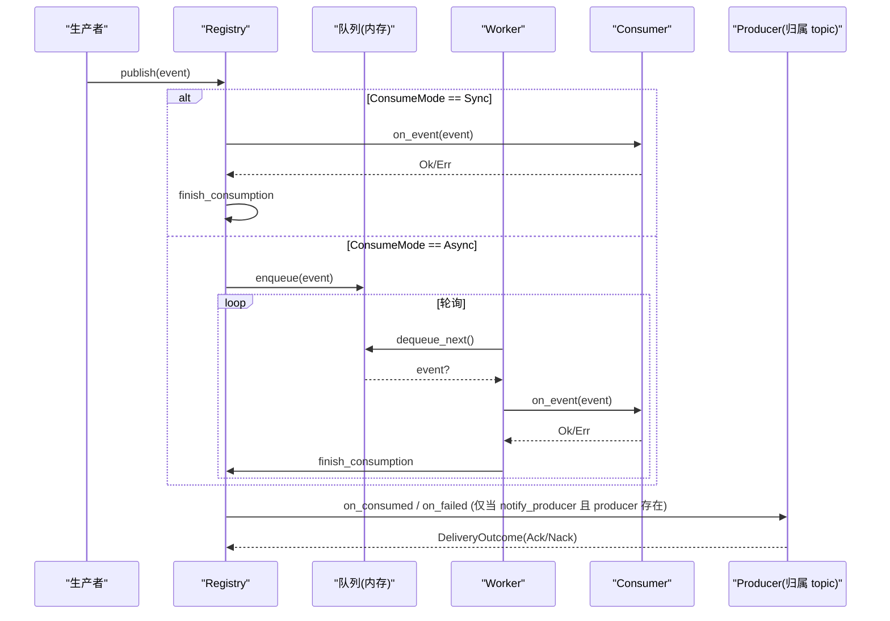
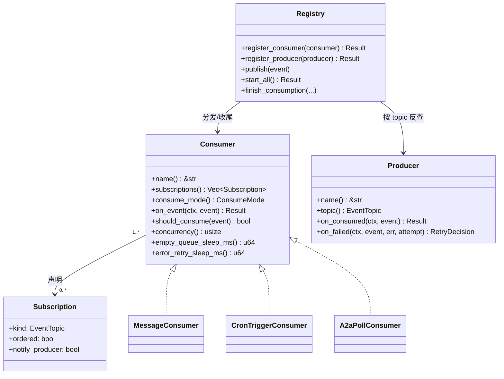

# 事件消费者

<cite>
**本文引用的文件**
- [src/pkg/aop/core/consumer.rs](src/pkg/aop/core/consumer.rs#L21-L112)
- [src/pkg/aop/core/registry.rs](src/pkg/aop/core/registry.rs#L53-L123)
- [src/pkg/aop/core/registry.rs](src/pkg/aop/core/registry.rs#L343-L562)
- [src/pkg/aop/core/registry.rs](src/pkg/aop/core/registry.rs#L734-L802)
- [src/pkg/aop/core/event.rs](src/pkg/aop/core/event.rs#L4-L17)
- [common/src/enums/event_topic.rs](common/src/enums/event_topic.rs#L32-L65)
- [src/consumer/mod.rs](src/consumer/mod.rs#L51-L90)
- [src/consumer/message.rs](src/consumer/message.rs#L95-L156)
- [src/consumer/scheduler.rs](src/consumer/scheduler.rs#L48-L55)
- [src/consumer/a2a_poll.rs](src/consumer/a2a_poll.rs#L32-L72)
- [src/service/dal/message.rs](src/service/dal/message.rs#L765-L800)
- [AOP 生产消费事件中心：纯框架零业务 + pkg/aop/core 6 Trait + Registry 全局单例 + 8 类业务消费者注册](docs/wiki/knowledge/zh/AOP%20生产消费事件中心：纯框架零业务%20+%20pkg/aop/core%206%20Trait%20+%20Registry%20全局单例%20+%208%20类业务消费者注册/AOP%20生产消费事件中心：纯框架零业务%20+%20pkg/aop/core%206%20Trait%20+%20Registry%20全局单例%20+%208%20类业务消费者注册.md)
</cite>

## 更新摘要
**变更内容**
- 订阅声明由 `interested_events()` / `EventKind` 改为 `Consumer::subscriptions() -> Vec<Subscription>`（`Subscription { kind: EventTopic, ordered, notify_producer }`）
- 删除 `Consumer::ack/nack` 与 `Consumer::source`；收尾统一在 `registry.rs::finish_consumption` 按 topic 反查 producer 回调 `on_consumed` / `on_failed`
- 消费者不再按 `source` 字符串分发；归属由 `EventTopic → producer` 索引自然决定
- `agent.awakening` 的订阅抽成关联函数 `MessageConsumer::declarations()`，并发度 `4` 是全仓唯一覆写 `concurrency()` 之处

## 目录
1. [简介](#简介)
2. [项目结构](#项目结构)
3. [核心组件](#核心组件)
4. [架构总览](#架构总览)
5. [详细组件分析](#详细组件分析)
6. [依赖关系分析](#依赖关系分析)
7. [性能考量](#性能考量)
8. [故障排查指南](#故障排查指南)
9. [结论](#结论)
10. [附录](#附录)

## 简介
本文件面向 AOP 事件消费者系统，聚焦以下主题：
- 消费者注册机制与生命周期管理
- 消费模式 ConsumeMode（同步/异步）及调度策略
- 订阅声明：以 `subscriptions()` 返回 `Subscription` 列表声明感兴趣的事件主题与消费语义
- 消费收尾与生产者回调：`finish_consumption` 单一出口按 topic 反查 producer
- 内置消费者实现：消息消费者、调度器消费者、工具执行日志消费者、工具执行统计消费者、思考轮次统计消费者、Agent 循环消费者、任务事件消费者、A2A 轮询消费者
- 性能监控与调试技巧、自定义消费者开发指南

## 项目结构
AOP 事件中心位于 `pkg/aop`，业务消费者位于 `consumer`。启动时通过 `consumer::init` 注册所有业务消费者，随后由 `aop::init_all` 启动调度器并拉起异步 worker。

图表来源
- [src/consumer/mod.rs:51-90](src/consumer/mod.rs#L51-L90)
- [src/pkg/aop/mod.rs](src/pkg/aop/mod.rs)
- [src/pkg/aop/core/registry.rs:53-123](src/pkg/aop/core/registry.rs#L53-L123)
- [src/pkg/aop/core/consumer.rs:21-112](src/pkg/aop/core/consumer.rs#L21-L112)
- [src/pkg/aop/core/event.rs:4-17](src/pkg/aop/core/event.rs#L4-L17)
- [common/src/enums/event_topic.rs:32-65](common/src/enums/event_topic.rs#L32-L65)

章节来源
- [src/consumer/mod.rs:51-90](src/consumer/mod.rs#L51-L90)
- [src/pkg/aop/mod.rs](src/pkg/aop/mod.rs)

## 核心组件
- Consumer trait：定义 `name`、`subscriptions`、`consume_mode`、`on_event`、`should_consume`、以及仅 Async 生效的 `concurrency`、`empty_queue_sleep_ms`、`error_retry_sleep_ms`。不再有 `ack` / `nack` / `source`（业务收尾回流到拥有该 topic 状态的生产者）。
- Subscription：订阅声明单元，含 `kind: EventTopic`、`ordered: bool`（同一 `order_key` 在本消费者内串行）、`notify_producer: bool`（消费完成后是否回调该 topic 的生产者 `on_consumed` / `on_failed`）。
- ConsumeMode：Sync（发布线程直接调用 `on_event`）、Async（入队后由调度器 worker 拉取）。
- Event：`Event::kind()` 返回 `EventTopic` 枚举（线格式为点分字符串）；另含 `id` / `order_key` / `priority` / `created_at`。
- EventTopic：`common::enums::EventTopic` 闭合枚举，取代旧 `EventKind`，是路由与「消费收尾回调归属」反查的唯一依据。
- Registry：维护 `topic → 消费者列表` 与 `topic → 生产者` 两个索引；负责发布、调度、worker 启动，以及收尾出口 `finish_consumption`。
- AOP 统计：`AopStatsCollector` 提供概览、时序、分布等内存统计。

章节来源
- [src/pkg/aop/core/consumer.rs:21-112](src/pkg/aop/core/consumer.rs#L21-L112)
- [src/pkg/aop/core/event.rs:4-17](src/pkg/aop/core/event.rs#L4-L17)
- [src/pkg/aop/core/registry.rs:15-28](src/pkg/aop/core/registry.rs#L15-L28)
- [common/src/enums/event_topic.rs:32-65](common/src/enums/event_topic.rs#L32-L65)
- [src/consumer/aop_stats_collector.rs](src/consumer/aop_stats_collector.rs)

## 架构总览
AOP 事件中心遵循「生产-消费」解耦：
- 生产者发布事件（`Event::kind()` 为某个 `EventTopic`），Registry 根据消费者 `subscriptions()` 声明的 topic 分发。
- Sync 消费者在发布线程内立即处理；Async 消费者入队，由多 worker 轮询拉取并处理。
- 投递结论与生产者回调统一在 `finish_consumption` 判定：按封套 `kind` 解析 topic，且仅当该消费者对该 kind 声明了 `notify_producer`、且 Registry 存在 `producer_for(kind)` 时，才回调 `on_consumed`（成功）或 `on_failed`（失败）。三者缺一则视为「①类纯通知」，零回调。

图表来源
- [src/pkg/aop/core/registry.rs:142-271](src/pkg/aop/core/registry.rs#L142-L271)
- [src/pkg/aop/core/registry.rs:343-562](src/pkg/aop/core/registry.rs#L343-L562)
- [src/pkg/aop/core/registry.rs:734-802](src/pkg/aop/core/registry.rs#L734-L802)

## 详细组件分析

### 消费者注册与生命周期
- 注册入口：`consumer::init` 中依次注册消息、调度器、A2A 轮询、三个入站、工具日志、工具统计、Agent 循环、思考轮次统计、任务事件等消费者。
- 启动调度：`aop::init_all` 调用 `registry.start_all`，为每个 Async 消费者启动 `concurrency` 个 worker。
- 生命周期：
  - 注册阶段：建立 `EventTopic → 消费者列表` 映射；于此校验 Sync 消费者不得声明 `ordered`。
  - 运行阶段：`publish` 按 topic 分发；Sync 直接调用；Async 入队并由 worker 拉取。
  - 收尾阶段：`finish_consumption` 反查 producer 并完成业务回调与投递结论。

章节来源
- [src/consumer/mod.rs:51-90](src/consumer/mod.rs#L51-L90)
- [src/pkg/aop/core/registry.rs:53-90](src/pkg/aop/core/registry.rs#L53-L90)
- [src/pkg/aop/core/registry.rs:343-562](src/pkg/aop/core/registry.rs#L343-L562)

### 订阅声明与消费模式
- `subscriptions()`：返回 `Vec<Subscription>`；旧 `interested_events()` 已删除。`Subscription::new(kind)` 默认 `ordered=false`、`notify_producer=false`，可链式 `.ordered()` / `.notify_producer()` 附加语义。
- ConsumeMode：Sync 适合轻量、快速完成的处理（如日志写入、统计记录、调度器）；Async 适合耗时、可能失败的业务编排（消息投递、A2A 远端抓取）。

章节来源
- [src/pkg/aop/core/consumer.rs:21-112](src/pkg/aop/core/consumer.rs#L21-L112)

### 消费收尾与生产者回调
- 单一出口：`finish_consumption`（Sync 内联路径与 Async worker 共用）。
- 反查链：`EventTopic::parse(meta.event_kind)` ∧ 该消费者对该 kind 声明 `notify_producer` ∧ `registry.producer_for(kind)` 存在 → 三者齐备才回调；否则按 `on_event` 的 `Result` 直接给 `DeliveryOutcome`（Ok→Ack，Err→Nack），且无回调。
- `Ok` → `on_consumed` → `Ack`；`Err` → `on_failed`（返回 `RetryDecision`）→ `Retry`=Nack、 `Discard`=Ack 且仍回调 `on_consumed`。
- 回调在 `carried_ctx` 还原的 ctx 上运行，**先于 `queue.ack`**，因此必须幂等。

章节来源
- [src/pkg/aop/core/registry.rs:734-802](src/pkg/aop/core/registry.rs#L734-L802)
- [src/pkg/aop/core/registry.rs:564-602](src/pkg/aop/core/registry.rs#L564-L602)

### 内置消费者详解

#### 消息消费者（MessageConsumer）
- 名称：`agent.awakening`；订阅 `message.created`（`.ordered().notify_producer()`）与 `agent.settle.requested`（`.ordered()`）。
- 模式：Async，并发 4，空队列 100ms，错误重试 1000ms。订阅抽成关联函数 `MessageConsumer::declarations()`（详见 `src/consumer/message.rs`）。
- 职责：
  - 解析 `MessageCreatedEvent`，加载完整 Message
  - 按 `to_role` 分发：Agent / User / System
  - Agent 消息：原子占用 Agent（BusyGuard），检查任务状态与最大思考深度，唤醒 Agent（awaken）
  - User 消息：投递到用户（SSE/渠道），全失败则上抛错误以触发重试
  - System 消息：ToolCallRequest 执行工具并回写结果
- 收尾：`messages.status` 的翻转已不在本消费者内做，而由 `impl Producer for MessageDalImpl` 在 `on_consumed` / `on_failed` 中完成（DAL-as-Producer 归属模型）。

章节来源
- [src/consumer/message.rs:95-156](src/consumer/message.rs#L95-L156)

#### 调度器消费者（CronTriggerConsumer）
- 订阅 `cron.trigger`（`.notify_producer()`），模式 Sync。
- 职责：解析 `payload.action`，分发 `agent_rest` / `project_followup`。`mark_trigger_executed` 已迁移到 `CronTriggerProducer::on_consumed`，由生产者收尾时调用。

章节来源
- [src/consumer/scheduler.rs:48-55](src/consumer/scheduler.rs#L48-L55)

#### 工具执行日志消费者（ToolExecLogConsumer）
- 订阅 `agent.tool.executed`，模式 Sync，将 `ToolExecEvent` 写入 JSONL 日志。

章节来源
- [src/consumer/tool_exec_log_consumer.rs](src/consumer/tool_exec_log_consumer.rs)

#### 工具执行统计消费者（ToolExecStatsConsumer）
- 订阅 `agent.tool.executed`，模式 Sync，将工具调用结果转换为 `ToolCallEvent` 经 `global_stats()` 记录统计。

章节来源
- [src/consumer/tool_exec_stats_consumer.rs](src/consumer/tool_exec_stats_consumer.rs)

#### 思考轮次统计消费者（ThinkRoundStatsConsumer）
- 订阅 `agent.think.round`，模式 Sync，将每轮 think 的 token 用量记录到 `ModelCallEvent`（跳过 `total_tokens=0` 的轮次）。

章节来源
- [src/consumer/think_round_stats_consumer.rs](src/consumer/think_round_stats_consumer.rs)

#### Agent 循环消费者（AgentLoopConsumer）
- 订阅 `agent.loop`、`agent.think.round`，模式 Sync，记录 Agent 生命周期与每轮 think 指标。

章节来源
- [src/consumer/agent_loop_consumer.rs](src/consumer/agent_loop_consumer.rs)

#### 任务事件消费者（TaskEventConsumer）
- 订阅 `task.status_changed`，模式 Async，仅处理 Completed 状态并驱动 Owner Agent 补偿。

章节来源
- [src/consumer/task_event_consumer.rs](src/consumer/task_event_consumer.rs)

#### A2A 轮询消费者（A2aPollConsumer）
- 订阅 `a2a.poll.requested`（`.ordered()`，`order_key = agent_id`），模式 Async；替代旧生产者里直接做网络重活的做法，承接远端抓取与消息投递。详见《A2A 轮询生产者》。

章节来源
- [src/consumer/a2a_poll.rs:32-72](src/consumer/a2a_poll.rs#L32-L72)

### 类图（消费者与框架）

图表来源
- [src/pkg/aop/core/consumer.rs:21-112](src/pkg/aop/core/consumer.rs#L21-L112)
- [src/pkg/aop/core/registry.rs:53-123](src/pkg/aop/core/registry.rs#L53-L123)
- [src/pkg/aop/core/producer.rs:13-99](src/pkg/aop/core/producer.rs#L13-L99)

## 依赖关系分析
- `consumer/mod.rs` 依赖 `pkg/aop` 的 Registry 进行消费者注册。
- 各消费者依赖各自领域 Domain/DAL（如 RuntimeDomain、MessageDomain、HrDomain、ProjectDomain）。
- Registry 依赖 EventQueue（默认 `InMemoryEventQueue`）与 `AopMetricsHook`（可选）。
- 统计模块 `AopStatsCollector` 基于 RuntimeStatsCollector 聚合维度 `(event_kind, consumer_name, status)`。
- 业务收尾回流到生产者：如 `message.created` 的收尾在 `MessageDalImpl`（见 `src/service/dal/message.rs`）。

章节来源
- [src/consumer/mod.rs:51-90](src/consumer/mod.rs#L51-L90)
- [src/pkg/aop/core/registry.rs:15-28](src/pkg/aop/core/registry.rs#L15-L28)
- [src/service/dal/message.rs:765-800](src/service/dal/message.rs#L765-L800)

## 性能考量
- 并发度调优：`MessageConsumer` 使用 `concurrency=4`，是全仓唯一覆写该值之处；其余消费者默认 1。
- 退避策略：`error_retry_sleep_ms` 避免失败时的紧密自旋；`empty_queue_sleep_ms` 降低空转。
- 顺序与优先级：`Event::order_key` 与 `priority` 影响队列调度，确保关键事件优先处理。
- 指标埋点：通过 `AopMetricsHook` 收集 `on_publish` / `on_consume_start` / `on_consume_success` / `on_consume_failure`，结合 `AopStatsCollector` 提供概览与时序。
- 资源释放：成功路径必须 `queue.ack`，避免 `order_key` 阻塞后续消息。

章节来源
- [src/consumer/message.rs:154-156](src/consumer/message.rs#L154-L156)
- [src/pkg/aop/core/registry.rs:343-562](src/pkg/aop/core/registry.rs#L343-L562)
- [src/consumer/aop_stats_collector.rs](src/consumer/aop_stats_collector.rs)

## 故障排查指南
- 事件未消费：
  - 检查 `subscriptions()` 是否正确声明了目标 `EventTopic`
  - 检查 `should_consume` 过滤逻辑
  - 查看队列长度与 stats（`queue_len` / `all_queue_stats`）
- 异步消费者卡死：
  - 确认 `on_event` 是否长时间阻塞，是否成功路径未回到 `finish_consumption`
  - 检查 `error_retry_sleep_ms` 是否过小导致重试风暴
- 业务收尾丢失（状态不翻转 / 游标不推进）：
  - 确认该 topic 有生产者且消费者声明了 `notify_producer`；否则 `start_all` 会因 `ensure_producers_for_notifying_consumers` 失败
  - 确认 producer 未因 topic 冲突被 `register_producer` 拒绝（`1 topic : 1 producer`）
- 指标异常：
  - 确认 `AopMetricsHook` 已注入，观察 `on_consume_*` 回调
  - 使用 `AopStatsCollector.overview` / `time_series` / `distribution` 定位问题

章节来源
- [src/pkg/aop/core/registry.rs:53-123](src/pkg/aop/core/registry.rs#L53-L123)
- [src/pkg/aop/core/registry.rs:564-602](src/pkg/aop/core/registry.rs#L564-L602)
- [src/pkg/aop/core/registry.rs:343-562](src/pkg/aop/core/registry.rs#L343-L562)
- [src/consumer/aop_stats_collector.rs](src/consumer/aop_stats_collector.rs)

## 结论
AOP 事件消费者系统通过统一的 `Consumer` 接口与 Registry 调度，实现了高内聚、低耦合的事件驱动架构。内置消费者覆盖了消息投递、定时任务、工具执行日志与统计、A2A 远端轮询、Agent 循环观测、任务状态通知等关键场景。订阅以 `subscriptions()` 表达主题与消费语义，收尾以 `finish_consumption` 单一出口按 topic 反查生产者完成业务回调，自此消费者不再持有 `ack`/`nack`/`source`。建议在生产环境中结合 `AopStatsCollector` 持续监控，并根据负载调优并发与退避参数。

## 附录

### 自定义消费者开发指南
- 实现 `Consumer` trait：
  - `name`：唯一标识
  - `subscriptions`：用 `Subscription::new(EventTopic::X)` 声明感兴趣的主题，按需 `.ordered()` / `.notify_producer()`
  - `consume_mode`：选择 Sync 或 Async
  - `on_event`：核心处理逻辑（返回 `Result`，`Err` 会触发收尾判定）
  - 若 Async 且需吞吐：覆写 `concurrency`、`empty_queue_sleep_ms`、`error_retry_sleep_ms`
- 注册消费者：在 `consumer::init` 中通过 `aop::registry().register_consumer(Arc::new(...))` 注册。
- 如需消费后业务收尾（状态翻转 / 游标推进）：让拥有该 topic 状态的对象实现 `Producer`（`on_consumed` / `on_failed`），并在订阅上声明 `.notify_producer()`；不要在消费者内自行持久化。
- 最佳实践：
  - 轻量逻辑用 Sync，复杂编排用 Async
  - 合理设置并发与退避，避免资源争用
  - 使用 `RequestContext` 传递上下文，保持链路追踪
  - 利用 tracing 与 stats 进行可观测性建设

章节来源
- [src/pkg/aop/core/consumer.rs:21-112](src/pkg/aop/core/consumer.rs#L21-L112)
- [src/consumer/mod.rs:51-90](src/consumer/mod.rs#L51-L90)
