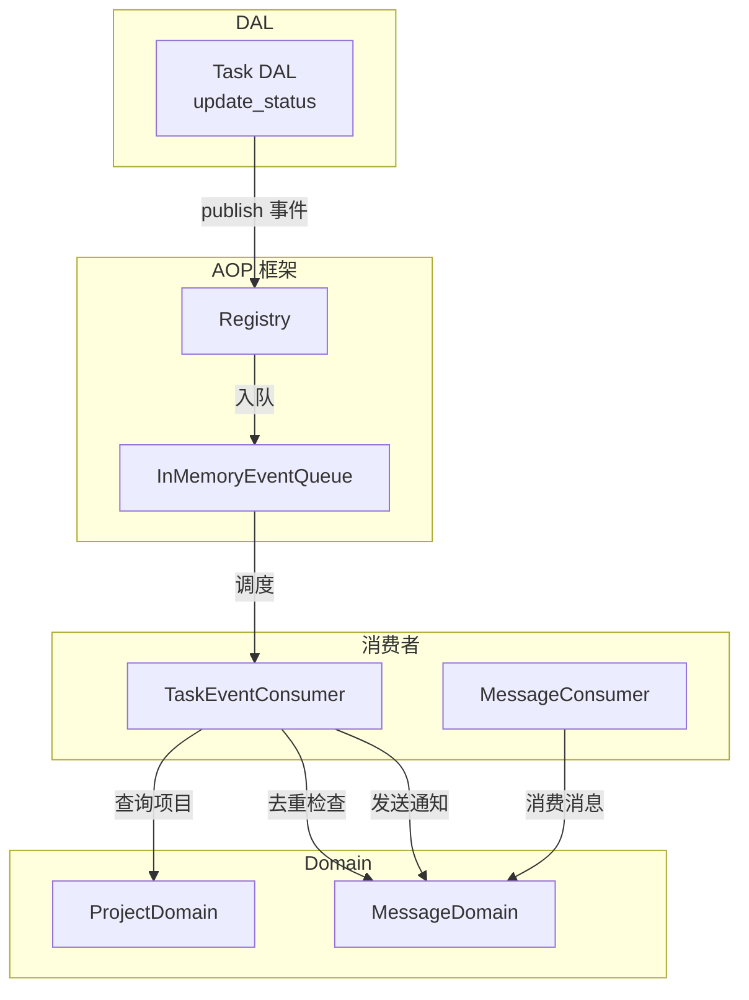
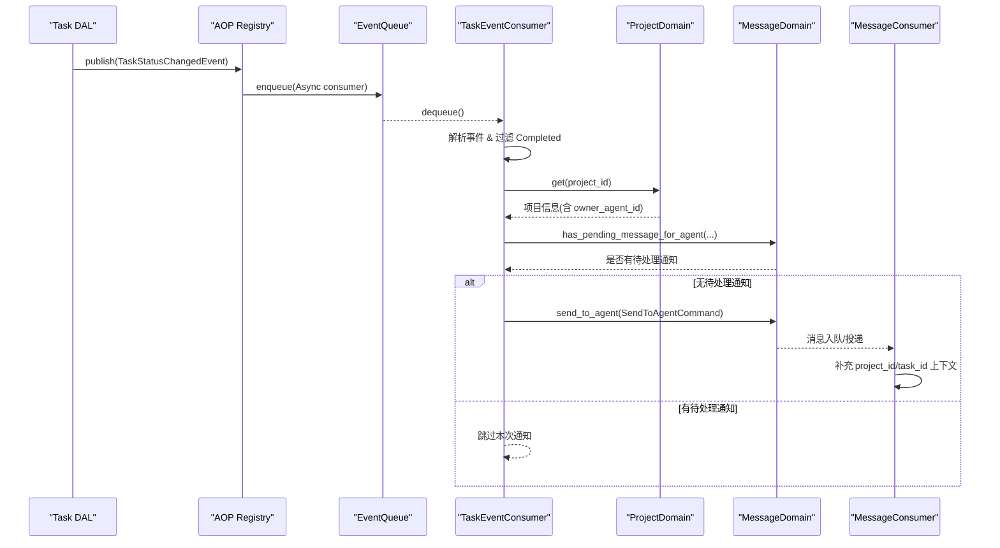
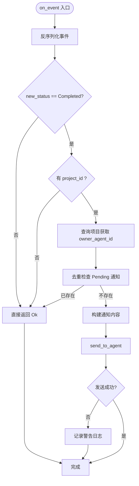
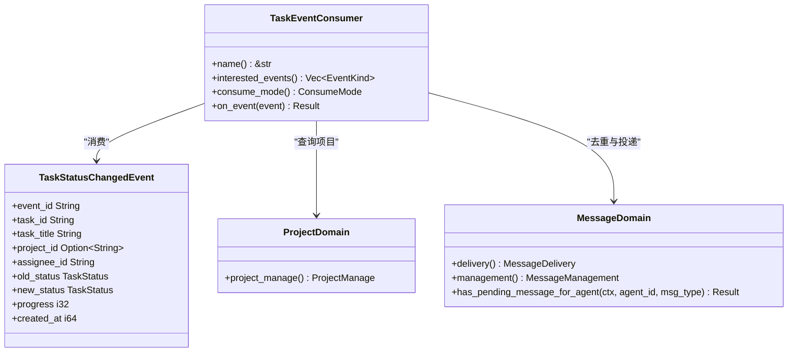

# 任务事件消费者（框架层）

<cite>
**本文引用的文件**
- [task_event_consumer.rs](src/consumer/task_event_consumer.rs)
- [mod.rs（consumer）](src/consumer/mod.rs)
- [task_status.rs（事件定义）](src/models/events/task_status.rs)
- [task.rs（DAL update_status 发布事件）](src/service/dal/task.rs)
- [message/mod.rs（MessageDomain 与去重接口）](src/service/domain/message/mod.rs)
- [message.rs（消息消费者，上下文补充与调度）](src/consumer/message.rs)
- [aop/mod.rs（AOP 框架入口）](src/pkg/aop/mod.rs)
- [core/mod.rs（AOP 核心导出）](src/pkg/aop/core/mod.rs)
- [project_management_design.md（任务依赖 DAG 规则）](docs/project_management_design.md)
</cite>

## 目录
1. [简介](#简介)
2. [项目结构](#项目结构)
3. [核心组件](#核心组件)
4. [架构总览](#架构总览)
5. [详细组件分析](#详细组件分析)
6. [依赖关系分析](#依赖关系分析)
7. [性能与并发](#性能与并发)
8. [故障排查指南](#故障排查指南)
9. [结论](#结论)
10. [附录：最佳实践](#附录最佳实践)

## 简介
本文件面向"任务事件消费者"的实现与使用，聚焦 TaskEventConsumer 如何监听任务状态变更事件、处理 Completed 状态并驱动 Owner Agent 的补偿机制。文档覆盖：
- 任务生命周期事件的处理流程
- 状态同步机制与幂等性保障
- 异常处理策略与可观测性
- 任务依赖关系管理对消费行为的影响
- 并发控制与资源协调
- 最佳实践与故障排查

> 📌 视角说明（AGENTS §2.1.3 Level 3 互补视角平行卡）：
> 本长文是「任务事件消费者」主题的 **框架层** 视角。同主题还有以下平行视角卡，请按需交叉阅读：
> - [任务事件消费者（代码落地层）](docs/wiki/zh/content/核心模块/AOP 事件系统/消费者框架/任务事件消费者.md)

## 项目结构
围绕任务事件消费的代码分布在以下层次：
- AOP 框架层（pkg/aop）：提供事件注册、发布、异步队列与调度能力
- 模型/事件层（models/events）：定义任务状态变更事件的结构与元数据
- DAL 层（service/dal/task）：在任务状态更新成功后发布事件
- Domain 层（service/domain/message, project）：提供消息投递、项目查询、去重检查等能力
- 消费者层（consumer）：TaskEventConsumer 订阅事件并完成业务编排

图表来源
- [task_event_consumer.rs:38-137](src/consumer/task_event_consumer.rs#L38-L137)
- [task_status.rs:1-66](src/models/events/task_status.rs#L1-L66)
- [task.rs:619-643](src/service/dal/task.rs#L619-L643)
- [message/mod.rs:98-117](src/service/domain/message/mod.rs#L98-L117)
- [message.rs:64-141](src/consumer/message.rs#L64-L141)
- [aop/mod.rs:1-46](src/pkg/aop/mod.rs#L1-L46)

章节来源
- [task_event_consumer.rs:1-138](src/consumer/task_event_consumer.rs#L1-L138)
- [mod.rs（consumer）:1-42](src/consumer/mod.rs#L1-L42)
- [task_status.rs:1-66](src/models/events/task_status.rs#L1-L66)
- [task.rs:619-643](src/service/dal/task.rs#L619-L643)
- [message/mod.rs:98-117](src/service/domain/message/mod.rs#L98-L117)
- [message.rs:64-141](src/consumer/message.rs#L64-L141)
- [aop/mod.rs:1-46](src/pkg/aop/mod.rs#L1-L46)

## 核心组件
- TaskEventConsumer：订阅 task.status_changed 事件，仅处理 Completed 状态；通过 ProjectDomain 获取 Owner Agent，通过 MessageDomain 进行去重检查与发送通知。
- TaskStatusChangedEvent：由 DAL 层在 SQL UPDATE 成功后发布，携带任务 ID、标题、项目 ID、旧/新状态、进度等信息。
- MessageDomain：提供 has_pending_message_for_agent 去重接口与 send_to_agent 投递能力。
- MessageConsumer：负责消息消费与上下文补充，使 TaskDispatchNotification 能自动注入 project_id 与 task_id 上下文。
- AOP Registry：统一事件分发与异步队列调度，支持 ConsumeMode::Async。

章节来源
- [task_event_consumer.rs:24-137](src/consumer/task_event_consumer.rs#L24-L137)
- [task_status.rs:12-66](src/models/events/task_status.rs#L12-L66)
- [message/mod.rs:98-117](src/service/domain/message/mod.rs#L98-L117)
- [message.rs:64-141](src/consumer/message.rs#L64-L141)
- [aop/mod.rs:1-46](src/pkg/aop/mod.rs#L1-L46)

## 架构总览
任务事件消费的关键路径如下：
1. DAL 层更新任务状态成功后发布 TaskStatusChangedEvent
2. AOP Registry 将事件入队（异步消费者）
3. TaskEventConsumer 从队列取出事件，解析为 TaskStatusChangedEvent
4. 仅当 new_status == Completed 时继续处理
5. 查询项目以定位 Owner Agent
6. 检查是否已有 Pending 的 TaskDispatchNotification（去重）
7. 构建通知内容并通过 MessageDomain 发送给 Owner Agent
8. MessageConsumer 消费消息并自动补充上下文（project_id、task_id）

图表来源
- [task.rs:619-643](src/service/dal/task.rs#L619-L643)
- [task_event_consumer.rs:52-137](src/consumer/task_event_consumer.rs#L52-L137)
- [message.rs:64-141](src/consumer/message.rs#L64-L141)
- [message/mod.rs:98-117](src/service/domain/message/mod.rs#L98-L117)

## 详细组件分析

### TaskEventConsumer 实现机制
- 事件订阅：interested_events 返回 task.status_changed
- 消费模式：ConsumeMode::Async，确保发送方不阻塞
- 事件处理：
  - 反序列化为 TaskStatusChangedEvent
  - 仅处理 Completed 状态
  - 必须存在 project_id 才能定位 Owner Agent
  - 查询项目并获取 owner_agent_id
  - 去重检查：has_pending_message_for_agent(agent_id, TaskDispatchNotification)
  - 构建通知内容并发送：send_to_agent(cmd)，填充 project_id 与 task_id
  - 错误记录：发送失败仅告警，不中断流程

图表来源
- [task_event_consumer.rs:52-137](src/consumer/task_event_consumer.rs#L52-L137)

章节来源
- [task_event_consumer.rs:38-137](src/consumer/task_event_consumer.rs#L38-L137)

### 事件定义与发布
- TaskStatusChangedEvent：包含 event_id、task_id、task_title、project_id、assignee_id、old_status、new_status、progress、created_at
- 发布时机：DAL 层 update_status 在 SQL UPDATE 成功后发布，且仅在 old_status != new_status 时避免重复事件
- 顺序键：order_key 基于 task_id，保证同一任务的顺序消费

章节来源
- [task_status.rs:12-66](src/models/events/task_status.rs#L12-L66)
- [task.rs:619-643](src/service/dal/task.rs#L619-L643)

### 消息消费者与上下文补充
- MessageConsumer 消费 message.created 事件，根据 to_role 分发到不同领域逻辑
- 对于系统消息（如 TaskDispatchNotification），会按类型路由至工具执行或用户通知
- 自动上下文补充：当消息携带 project_id/task_id，MessageConsumer 会在后续唤醒/执行中注入对应上下文，便于下游逻辑感知任务与项目环境

章节来源
- [message.rs:64-141](src/consumer/message.rs#L64-L141)
- [message.rs:479-514](src/consumer/message.rs#L479-L514)

### 去重与幂等性
- 去重策略：在发送通知前检查是否存在 Pending 的 TaskDispatchNotification，避免对同一 Agent 重复投递
- 幂等性：即使多次 Completed 事件到达，只要已有 Pending 通知即跳过，降低重复处理风险

章节来源
- [task_event_consumer.rs:85-103](src/consumer/task_event_consumer.rs#L85-L103)
- [message/mod.rs:107-117](src/service/domain/message/mod.rs#L107-L117)

### 任务依赖关系管理
- 任务依赖采用 DAG（有向无环图）约束，禁止自依赖与环形依赖
- 添加依赖时会进行 DFS 环形检测，确保任务执行顺序合法
- 对事件消费的影响：Completed 事件触发后，Owner Agent 需依据依赖关系判断后续任务是否可启动

章节来源
- [project_management_design.md:256-290](docs/project_management_design.md#L256-L290)

## 依赖关系分析
- TaskEventConsumer 依赖：
  - models/events.TaskStatusChangedEvent（事件数据）
  - service/domain.project（查询项目与 Owner Agent）
  - service/domain.message（去重检查与消息投递）
  - pkg/aop（事件注册与异步消费）
- 调用方向严格遵循四层单向调用：Adapter → Domain → DAL → DAO，消费者位于 consumer 层，通过 domain 访问业务逻辑，不直接操作 DAO

图表来源
- [task_event_consumer.rs:38-137](src/consumer/task_event_consumer.rs#L38-L137)
- [task_status.rs:12-66](src/models/events/task_status.rs#L12-L66)
- [message/mod.rs:98-117](src/service/domain/message/mod.rs#L98-L117)

章节来源
- [task_event_consumer.rs:38-137](src/consumer/task_event_consumer.rs#L38-L137)
- [task_status.rs:12-66](src/models/events/task_status.rs#L12-L66)
- [message/mod.rs:98-117](src/service/domain/message/mod.rs#L98-L117)

## 性能与并发
- 异步消费：ConsumeMode::Async 确保发布端不阻塞，适合重任务场景
- 去重检查：减少不必要的消息投递，降低下游负载
- 并发控制：MessageConsumer 实现了 concurrency=4，避免单点过载；TaskEventConsumer 本身轻量，主要开销在数据库查询与消息投递
- 建议：
  - 监控队列长度与消费延迟
  - 在高并发下关注数据库连接池与索引效率
  - 合理设置重试退避时间，避免风暴

[本节为通用指导，不直接分析具体文件]

## 故障排查指南
常见问题与定位方法：
- 未收到通知：
  - 检查事件是否发布：确认 DAL 层 update_status 是否执行成功且 old_status != new_status
  - 检查消费者是否注册：consumer::init 中是否注册了 TaskEventConsumer
  - 检查项目与 Owner Agent：确认 project_id 存在且项目拥有 owner_agent_id
- 重复通知：
  - 检查去重逻辑：has_pending_message_for_agent 是否正确返回
  - 检查消息状态：Pending 状态的 TaskDispatchNotification 是否被正确清理
- 发送失败：
  - 查看告警日志：发送失败会记录 task_id、project_id、agent_id 与错误信息
  - 检查 MessageDomain 投递链路：渠道配置、SSE 连接、用户订阅状态

章节来源
- [task_event_consumer.rs:125-133](src/consumer/task_event_consumer.rs#L125-L133)
- [mod.rs（consumer）:16-37](src/consumer/mod.rs#L16-L37)
- [task.rs:619-643](src/service/dal/task.rs#L619-L643)

## 结论
TaskEventConsumer 通过 AOP 异步事件机制，实现了对任务 Completed 状态的可靠响应。其设计要点包括：
- 仅处理 Completed 状态，聚焦关键业务节点
- 通过项目查询定位 Owner Agent，驱动补偿机制
- 去重检查避免重复通知，提升系统稳定性
- 与 MessageConsumer 协作，自动补充上下文，简化下游逻辑
- 遵循分层架构与单向调用原则，保持模块解耦

## 附录：最佳实践
- 事件命名与版本化：为事件定义清晰的 kind 与字段演进策略
- 幂等性优先：所有消费者应支持重复事件的安全处理
- 可观测性：完善日志与指标，记录关键路径耗时与错误
- 测试覆盖：集成测试验证事件发布、消费、去重与上下文补充
- 依赖管理：DAG 依赖变更需配合环形检测与回滚策略

[本节为通用指导，不直接分析具体文件]