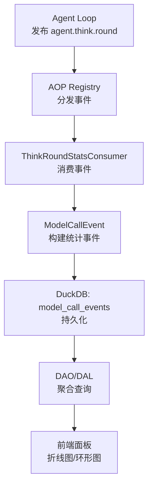
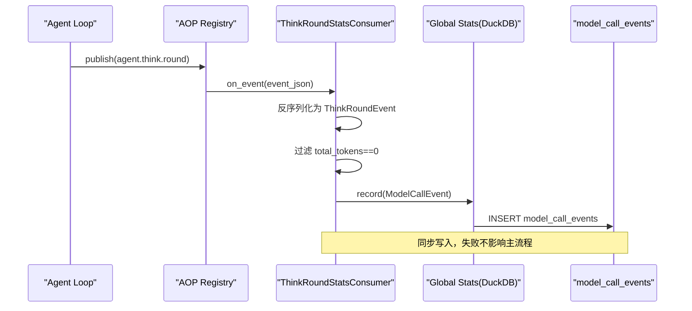
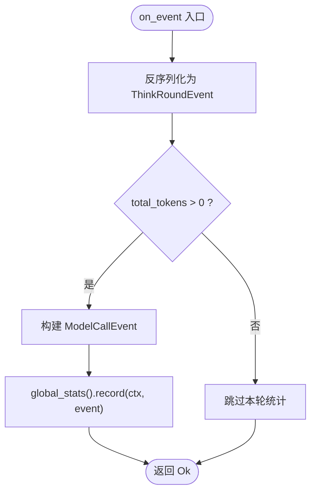
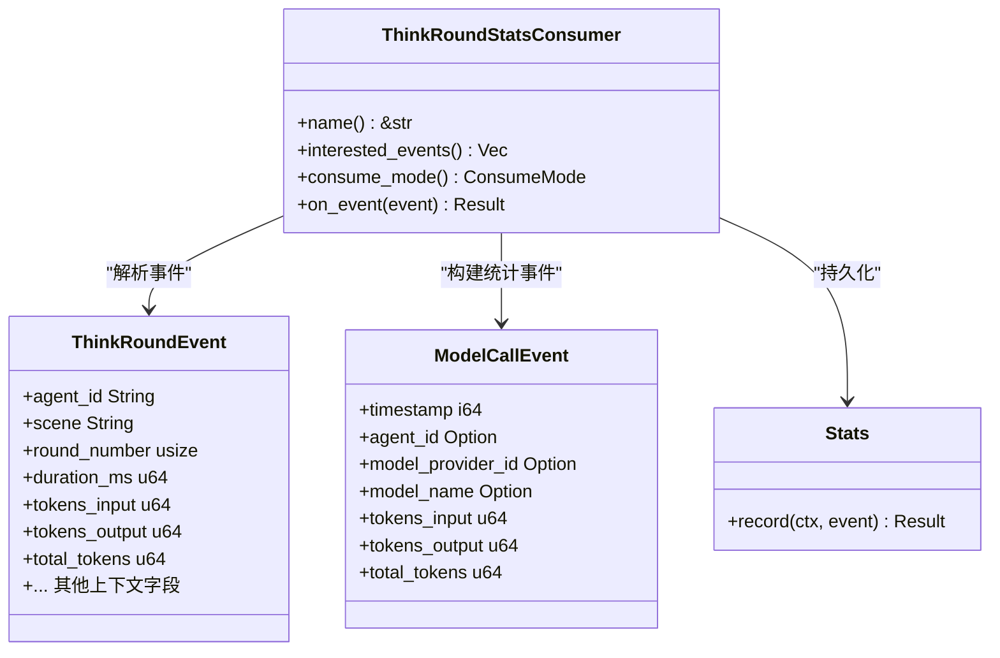

# 思考轮次统计消费者

<cite>
**本文引用的文件**
- [think_round_stats_consumer.rs](src/consumer/think_round_stats_consumer.rs)
- [think_round.rs](src/models/events/think_round.rs)
- [model_call.rs](src/pkg/stats/model_call.rs)
- [stats_mod.rs](src/pkg/stats/mod.rs)
- [agent_loop_consumer.rs](src/consumer/agent_loop_consumer.rs)
- [registry.rs](src/pkg/aop/core/registry.rs)
- [aop_stats_collector_plan.md](docs/superpowers/plans/2026-07-25-stats-charts-phase3.md)
- [model_provider_stats_dao.rs](src/service/dao/model_provider/mod.rs)
- [project_dal.rs](src/service/dal/project.rs)
- [frontend_stats_panel.rs](frontend/src/components/stats.rs)
- [pkg/policy/mod.rs](src/pkg/policy/mod.rs)（Policy 机制 policy_hit_ids 生成规则）
- [service/domain/runtime/awakening.rs](src/service/domain/runtime/awakening.rs)（exit_reason 归一化映射入口）

**本文关联三类文档**
- 【① Design 决策快照】[thinking_task_policy_engine_design.md](docs/design/thinking_task_policy_engine_design.md) — exit_reason 统计维度设计决策（§一 决策表）
- 【② Plan 落地快照】占位：待 [2026-08-14-policy-engine-and-think-runtime.md](docs/superpowers/plans/2026-08-14-policy-engine-and-think-runtime.md) 由 ai-orz-doc-maintainer 精简到 docs/plan/ 后回填（现参考 superpowers 执行蓝图 §Task 8 统计事件接入）
- 【④ RAG 原子知识卡】
  - [思考退出原因 exit_reason 统计与 ThinkRoundEvent AOP 事件链路](docs/wiki/knowledge/zh/思考退出原因%20exit_reason%20统计与%20ThinkRoundEvent%20AOP%20事件链路/思考退出原因%20exit_reason%20统计与%20ThinkRoundEvent%20AOP%20事件链路.md) — exit_reason 字符串归一化 + ThinkRoundEvent policy_hit_ids 硬约束
  - [Agent 思考运行时 AgentThinkRuntime：挂载清理取消与每轮快照上报](docs/wiki/knowledge/zh/Agent%20思考运行时%20AgentThinkRuntime：挂载清理取消与每轮快照上报/Agent%20思考运行时%20AgentThinkRuntime：挂载清理取消与每轮快照上报.md) — ThinkRuntimeSnapshot.last_exit_reason 与 exit_reason 同源约束
- 【③ Wiki 关联长文】
  - [运行时领域.md](docs/wiki/zh/content/核心模块/服务层/领域层/运行时领域.md) — §5 思考运行时挂载 + 退出 reason 归一化说明
  - [Runtime 领域编排.md](docs/wiki/zh/content/架构设计/分层架构设计/Domain%20层编排/Runtime%20领域编排.md) — AOP 事件在 Runtime 主链路的发布时机
</cite>

## 目录
1. [简介](#简介)
2. [项目结构](#项目结构)
3. [核心组件](#核心组件)
4. [架构总览](#架构总览)
5. [详细组件分析](#详细组件分析)
6. [依赖关系分析](#依赖关系分析)
7. [性能考量](#性能考量)
8. [故障排查指南](#故障排查指南)
9. [结论](#结论)
10. [附录](#附录)

## 简介
本文件面向“思考轮次统计消费者”（ThinkRoundStatsConsumer），系统性说明其实现原理、数据流、指标定义、时间序列与趋势分析方法，以及可视化、告警阈值、历史查询与报表生成建议。该消费者订阅 Agent 的“思考轮次”事件，将每轮 think 的 token 用量等指标持久化到 DuckDB 的 model_call_events 表，为后续按 Agent/项目/任务/模型提供商等多维度的统计、时序分析与前端可视化提供基础。

## 项目结构
围绕 ThinkRoundStatsConsumer 的关键位置如下：
- 事件定义：src/models/events/think_round.rs
- 消费者实现：src/consumer/think_round_stats_consumer.rs
- 统计事件与表映射：src/pkg/stats/model_call.rs
- 全局 Stats 访问器：src/pkg/stats/mod.rs
- AOP 注册与分发：src/pkg/aop/core/registry.rs
- 统计查询 DAO/DAL：src/service/dao/model_provider/mod.rs, src/service/dal/project.rs
- 前端展示：frontend/src/components/stats.rs

图表来源
- [registry.rs:486-531](src/pkg/aop/core/registry.rs#L486-L531)
- [think_round_stats_consumer.rs:1-73](src/consumer/think_round_stats_consumer.rs#L1-L73)
- [model_call.rs:12-39](src/pkg/stats/model_call.rs#L12-L39)
- [model_provider_stats_dao.rs:54-92](src/service/dao/model_provider/mod.rs#L54-L92)
- [project_dal.rs:721-752](src/service/dal/project.rs#L721-L752)
- [frontend_stats_panel.rs:237-260](frontend/src/components/stats.rs#L237-L260)

章节来源
- [think_round_stats_consumer.rs:1-73](src/consumer/think_round_stats_consumer.rs#L1-L73)
- [think_round.rs:1-124](src/models/events/think_round.rs#L1-L124)
- [model_call.rs:1-220](src/pkg/stats/model_call.rs#L1-L220)
- [stats_mod.rs:1-175](src/pkg/stats/mod.rs#L1-L175)
- [registry.rs:486-531](src/pkg/aop/core/registry.rs#L486-L531)

## 核心组件
- ThinkRoundStatsConsumer：同步消费者，订阅 agent.think.round 事件，过滤无 token 用量的轮次，构造 ModelCallEvent 并写入 DuckDB。
- ThinkRoundEvent：描述单轮 think 的上下文（Agent、场景、轮次、耗时、工具调用情况）及模型调用 token 用量。
- ModelCallEvent / ModelCallStatTable：绑定 model_call_events 表，承载 tag（维度）与 metric（指标）。
- Stats 全局访问器：global_stats() 供无法通过 RequestContext 获取 Stats 的场景使用（如 AOP 消费者）。
- 查询层：DAO/DAL 提供按多维度聚合与时序查询能力，支撑前端面板。

章节来源
- [think_round_stats_consumer.rs:1-73](src/consumer/think_round_stats_consumer.rs#L1-L73)
- [think_round.rs:1-124](src/models/events/think_round.rs#L1-L124)
- [model_call.rs:12-39](src/pkg/stats/model_call.rs#L12-L39)
- [stats_mod.rs:152-171](src/pkg/stats/mod.rs#L152-L171)

## 架构总览
ThinkRoundStatsConsumer 处于 AOP 消费者层，职责单一：将事件转换为统计事件并落库。上层由 Domain/DAL/DAO 提供查询；前端通过 API 拉取聚合结果进行可视化。

图表来源
- [registry.rs:486-531](src/pkg/aop/core/registry.rs#L486-L531)
- [think_round_stats_consumer.rs:43-70](src/consumer/think_round_stats_consumer.rs#L43-L70)
- [model_call.rs:149-180](src/pkg/stats/model_call.rs#L149-L180)

## 详细组件分析

### ThinkRoundStatsConsumer 实现要点
- 事件订阅：仅关注 agent.think.round。
- 消费模式：同步（ConsumeMode::Sync），在 AOP 主流程中处理。
- 事件解析与过滤：反序列化为 ThinkRoundEvent，若 total_tokens 为 0（例如外部 Agent 无模型调用）则直接跳过。
- 统计事件构建：基于 ThinkRoundEvent 字段填充 ModelCallEvent 的 tag 与 metric。
- 持久化：通过 global_stats() 获取 Stats 单例，创建系统级 RequestContext 后记录事件。

图表来源
- [think_round_stats_consumer.rs:43-70](src/consumer/think_round_stats_consumer.rs#L43-L70)

章节来源
- [think_round_stats_consumer.rs:1-73](src/consumer/think_round_stats_consumer.rs#L1-L73)

### ThinkRoundEvent 数据结构
- 关键字段：
  - 标识与追踪：event_id、trace_id、agent_id
  - 场景与轮次：scene（awaken/settle）、round_number
  - 性能与工具：duration_ms、has_tool_calls、tool_call_count
  - 模型与用量：model_provider_id、model_name、tokens_input、tokens_output、total_tokens
  - 上下文：organization_id、user_id、task_id、project_id
  - 时间戳：created_at

章节来源
- [think_round.rs:1-124](src/models/events/think_round.rs#L1-L124)

### ModelCallEvent 与存储表
- 事件类型：model_call
- Tag（维度）：agent_id、project_id、task_id、model_provider_id、model_name、organization_id、user_id
- Metric（指标）：call_count、tokens_input、tokens_output、total_tokens
- 表名：model_call_events
- 插入逻辑：单条与批量插入均封装在 StatTable 实现中

章节来源
- [model_call.rs:12-39](src/pkg/stats/model_call.rs#L12-L39)
- [model_call.rs:122-180](src/pkg/stats/model_call.rs#L122-L180)

### 全局 Stats 访问器
- 作用：为 AOP 消费者等无法持有 ctx 或 Stats 的场景提供全局访问。
- 初始化：由 Storage 启动阶段设置一次。
- 使用：ThinkRoundStatsConsumer 通过 global_stats() 获取 Arc<Stats> 并调用 record。

章节来源
- [stats_mod.rs:152-171](src/pkg/stats/mod.rs#L152-L171)
- [think_round_stats_consumer.rs:65-68](src/consumer/think_round_stats_consumer.rs#L65-L68)

### AOP 注册与分发
- Registry 负责维护消费者集合、队列与分发循环。
- 支持同步与异步两种消费模式；同步模式下直接在发布线程执行 on_event。
- 提供队列长度与聚合统计接口，便于监控消费者健康度。

章节来源
- [registry.rs:486-531](src/pkg/aop/core/registry.rs#L486-L531)

### 统计查询与可视化
- DAO 层提供统一查询参数 ModelProviderStatsQuery，支持按 provider/agent/project/task 过滤、时间范围、分组与聚合函数、时间间隔。
- DAL 层暴露 get_model_call_stats 等方法，组合查询并返回 ModelCallStats。
- 前端通过 stats 面板渲染折线图与卡片指标（QPS、Token 总量等）。

章节来源
- [model_provider_stats_dao.rs:54-92](src/service/dao/model_provider/mod.rs#L54-L92)
- [project_dal.rs:721-752](src/service/dal/project.rs#L721-L752)
- [frontend_stats_panel.rs:237-260](frontend/src/components/stats.rs#L237-L260)

## 依赖关系分析
- ThinkRoundStatsConsumer 依赖：
  - AOP 框架（Consumer trait、EventKind、ConsumeMode）
  - 事件模型 ThinkRoundEvent
  - 统计事件 ModelCallEvent 与 Stats 全局访问器
- 下游依赖：
  - DuckDB 表 model_call_events
  - DAO/DAL 查询接口
  - 前端统计面板

图表来源
- [think_round_stats_consumer.rs:15-70](src/consumer/think_round_stats_consumer.rs#L15-L70)
- [think_round.rs:6-39](src/models/events/think_round.rs#L6-L39)
- [model_call.rs:12-39](src/pkg/stats/model_call.rs#L12-L39)
- [stats_mod.rs:152-171](src/pkg/stats/mod.rs#L152-L171)

## 性能考量
- 同步消费：ThinkRoundStatsConsumer 采用同步模式，避免额外队列开销；但需确保 on_event 内部操作轻量（已做最小化处理：反序列化、过滤、构建事件、写入 DuckDB）。
- 快速路径：对 total_tokens == 0 的事件直接跳过，减少无效写入。
- 写入策略：单条插入为主，批量插入在 StatTable 中已实现，可按需扩展批处理以提升吞吐。
- 查询优化：DAO 层支持 time_range、interval、group_by、aggregations，建议在高频查询时合理选择聚合粒度与时间窗口。
- 内存与磁盘：DuckDB 本地文件存储，注意定期清理或归档历史数据以控制体积。

[本节为通用指导，不直接分析具体文件]

## 故障排查指南
- 事件未入库：
  - 检查 ThinkRoundEvent 是否包含非零 total_tokens；否则会被跳过。
  - 确认 global_stats() 已初始化且可访问。
- 写入失败：
  - 查看 DuckDB 连接与权限；检查 model_call_events 表是否存在。
  - 关注 on_event 异常日志与错误码。
- 查询为空：
  - 校验查询条件（provider/agent/project/task/time_range）是否与事件标签一致。
  - 确认 DAO/DAL 是否正确组装查询参数。
- 前端不更新：
  - 检查 API 响应结构与字段命名。
  - 确认前端轮询与渲染逻辑正常。

章节来源
- [think_round_stats_consumer.rs:43-70](src/consumer/think_round_stats_consumer.rs#L43-L70)
- [model_call.rs:122-180](src/pkg/stats/model_call.rs#L122-L180)
- [model_provider_stats_dao.rs:54-92](src/service/dao/model_provider/mod.rs#L54-L92)

## 结论
ThinkRoundStatsConsumer 以极小侵入的方式将 Agent 每轮 think 的 token 用量纳入统一的统计体系，借助 DuckDB 持久化与 DAO/DAL 的多维查询能力，为性能趋势分析、成本核算与前端可视化提供了坚实基础。配合合理的查询策略与前端面板，可实现从实时到历史的完整观测闭环。

[本节为总结性内容，不直接分析具体文件]

## 附录

### 指标定义与口径
- call_count：每次 think 轮次计为 1 次调用。
- tokens_input/tokens_output/total_tokens：来自 ThinkRoundEvent 的模型调用 token 用量。
- 维度（Tag）：agent_id、project_id、task_id、model_provider_id、model_name、organization_id、user_id。

章节来源
- [think_round.rs:6-39](src/models/events/think_round.rs#L6-L39)
- [model_call.rs:12-39](src/pkg/stats/model_call.rs#L12-L39)

### 时间序列与趋势分析
- 时间粒度：可通过 DAO 的 interval 参数控制（如分钟/小时/天）。
- 常用聚合：
  - 按 provider/agent/project/task 分组统计 total_tokens、tokens_input、tokens_output。
  - 计算 QPS（调用次数/时间区间）、平均耗时（结合 think 轮次 duration_ms 的独立采集点）。
- 趋势识别：观察峰值时段、突增/突降、长尾延迟等。

章节来源
- [model_provider_stats_dao.rs:54-92](src/service/dao/model_provider/mod.rs#L54-L92)
- [project_dal.rs:721-752](src/service/dal/project.rs#L721-L752)

### 可视化与报表
- 前端面板：
  - 模型调用概览卡片（总调用、QPS、Token 总量）。
  - 折线图展示时间序列（调用量、Token 用量）。
  - 环形图展示分布（如按 provider 或 agent）。
- 报表生成建议：
  - 日报/周报：按日/周聚合 total_tokens、调用次数、QPS 均值/峰值。
  - 成本报表：结合模型定价，按 provider/agent/project 汇总 token 成本。
  - 导出格式：CSV/JSON，便于离线分析。

章节来源
- [frontend_stats_panel.rs:237-260](frontend/src/components/stats.rs#L237-L260)

### 告警阈值建议
- 调用量异常：单位时间内 total_calls 超过基线 N%（如 3σ）。
- Token 用量异常：单位时间内 total_tokens 突增或突降。
- 失败率：若引入失败计数，失败率超过阈值触发告警。
- 延迟：think 轮次耗时 P95/P99 超阈值。

[本节为通用实践建议，不直接分析具体文件]

### 历史数据查询示例（概念）
- 按 Agent 统计最近 24 小时 token 用量：
  - 过滤 agent_id、time_range=过去24h、interval=小时、aggregations=sum(total_tokens)。
- 按项目统计每日调用次数与 QPS：
  - 过滤 project_id、time_range=指定日期、interval=天、aggregations=sum(call_count)、计算 QPS。

[本节为概念性示例，不直接分析具体文件]