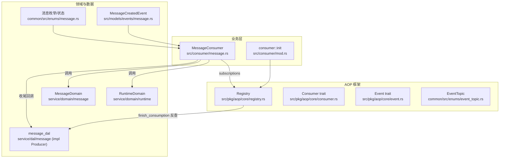
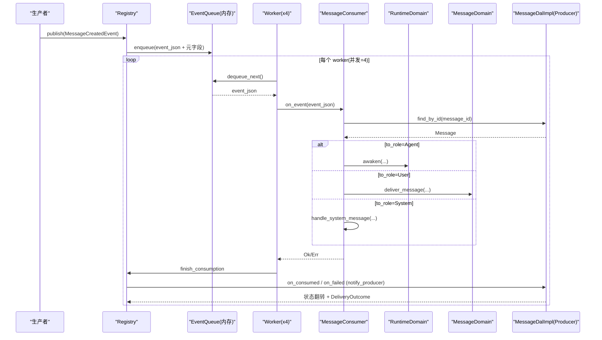
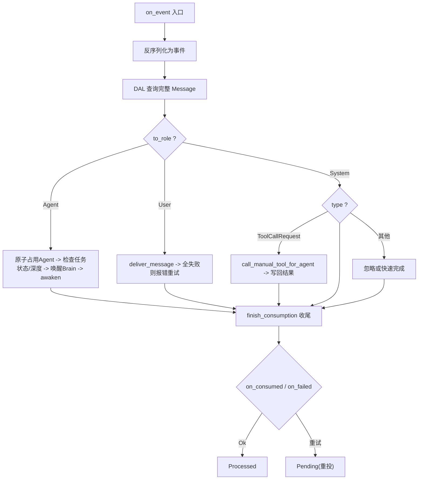
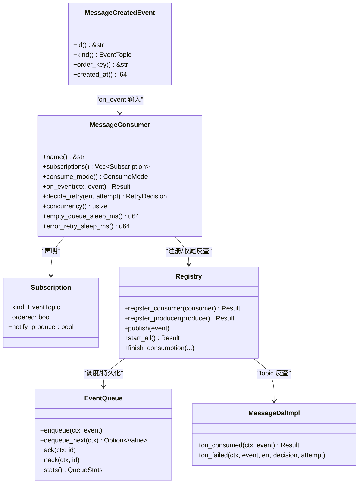

# 消息消费者（框架层）

<cite>
**本文引用的文件**
- [src/consumer/mod.rs](src/consumer/mod.rs#L51-L90)
- [src/consumer/message.rs](src/consumer/message.rs#L95-L156)
- [src/consumer/message.rs](src/consumer/message.rs#L119-L477)
- [src/models/events/message.rs](src/models/events/message.rs)
- [common/src/enums/message.rs](common/src/enums/message.rs)
- [src/pkg/aop/mod.rs](src/pkg/aop/mod.rs)
- [src/pkg/aop/core/registry.rs](src/pkg/aop/core/registry.rs#L53-L123)
- [src/pkg/aop/core/registry.rs](src/pkg/aop/core/registry.rs#L343-L562)
- [src/pkg/aop/core/registry.rs](src/pkg/aop/core/registry.rs#L734-L802)
- [src/pkg/aop/core/consumer.rs](src/pkg/aop/core/consumer.rs#L21-L112)
- [src/pkg/aop/core/event.rs](src/pkg/aop/core/event.rs#L4-L17)
- [common/src/enums/event_topic.rs](common/src/enums/event_topic.rs#L32-L65)
- [src/service/dal/message.rs](src/service/dal/message.rs#L765-L800)
- [AgentRuntimeInfo 状态机 + BusyGuard RAII：Idle/Busy/Resting 三态转换 + task_id/project_id 业务上下文 + 前端 runtime-list 过滤](docs/wiki/knowledge/zh/AgentRuntimeInfo%20三态状态机%20+%20BusyGuard%20RAII：Idle%20Busy%20Resting%20转换%20+%20task_id%20project_id%20业务上下文透视/AgentRuntimeInfo%20三态状态机%20+%20BusyGuard%20RAII：Idle%20Busy%20Resting%20转换%20+%20task_id%20project_id%20业务上下文透视.md)
</cite>

## 更新摘要
**变更内容**
- 订阅声明由 `interested_events()` / `EventKind` 改为 `Consumer::subscriptions()`（返回含 `message.created` 的 `Subscription`，`.ordered().notify_producer()`）
- 删除 `ack` / `nack`：消息状态翻转回流转入 `MessageDalImpl` 的 `Producer::on_consumed` / `on_failed`，由 `finish_consumption` 收尾时回调
- 不在消费者里按 `source` 分流；`message.created` 的归属由 topic → producer 索引直接决定

## 目录
1. [简介](#简介)
2. [项目结构](#项目结构)
3. [核心组件](#核心组件)
4. [架构总览](#架构总览)
5. [详细组件分析](#详细组件分析)
6. [依赖关系分析](#依赖关系分析)
7. [性能考量](#性能考量)
8. [故障排查指南](#故障排查指南)
9. [结论](#结论)
10. [附录](#附录)

## 简介
本文件面向「消息消费者」子系统，聚焦 `MessageConsumer` 的实现机制与运行流程。内容涵盖：
- 消息路由与分发处理（按接收角色与消息类型）
- 持久化存储与状态流转（Pending/Processing/Processed/Failed）
- 消息类型识别、优先级队列管理与并发策略
- 消息去重、失败重试与死信队列现状
- 完整时序图与错误处理示例

> 📌 视角说明（AGENTS §2.1.3 Level 3 互补视角平行卡）：
> 本长文是「消息消费者」主题的 **框架层** 视角。同主题还有以下平行视角卡，请按需交叉阅读：
> - [消息消费者（代码落地层）](docs/wiki/zh/content/核心模块/AOP 事件系统/消费者框架/消息消费者.md)

## 项目结构
消息消费者位于业务层 `consumer/` 模块，通过 AOP 事件中心订阅 `message.created` 事件，并调用 Domain/DAL/DAO 完成业务编排与持久化。AOP 框架提供事件注册、发布、异步调度与队列抽象；消息事件模型定义在 `models/events` 中；枚举与状态定义在 `common/enums`。

图表来源
- [src/consumer/mod.rs:51-90](src/consumer/mod.rs#L51-L90)
- [src/consumer/message.rs:95-156](src/consumer/message.rs#L95-L156)
- [src/pkg/aop/core/registry.rs:53-123](src/pkg/aop/core/registry.rs#L53-L123)
- [src/pkg/aop/core/consumer.rs:21-112](src/pkg/aop/core/consumer.rs#L21-L112)
- [src/pkg/aop/core/event.rs:4-17](src/pkg/aop/core/event.rs#L4-L17)
- [common/src/enums/event_topic.rs:32-65](common/src/enums/event_topic.rs#L32-L65)

章节来源
- [src/consumer/mod.rs:51-90](src/consumer/mod.rs#L51-L90)
- [src/pkg/aop/mod.rs](src/pkg/aop/mod.rs)

## 核心组件
- MessageConsumer：业务层消费者，实现 `Consumer` trait，通过 `subscriptions()` 声明 `message.created`（`.ordered().notify_producer()`），从 AOP 队列拉取事件，解析后按 `to_role` 分发到不同 Domain 处理。消息状态翻转不再在本消费者内完成，而由 `MessageDalImpl`（实现 `Producer`）在 `on_consumed` / `on_failed` 收尾。
- Registry：AOP 注册中心，维护 topic → 消费者、topic → 生产者索引，负责事件发布、入队、worker 启动与收尾出口 `finish_consumption`。
- EventQueue：队列抽象，提供 enqueue/dequeue/ack/nack/stats/query 等能力；当前默认实现在内存队列中。
- MessageCreatedEvent：事件模型，定义 `order_key` 策略，用于同 key 串行与优先级控制。
- 消息枚举与状态：`MessageRole`、`MessageType`、`MessageStatus` 用于消息路由与状态机管理。

章节来源
- [src/consumer/message.rs:95-156](src/consumer/message.rs#L95-L156)
- [src/pkg/aop/core/registry.rs:15-28](src/pkg/aop/core/registry.rs#L15-L28)
- [src/models/events/message.rs](src/models/events/message.rs)
- [common/src/enums/message.rs](common/src/enums/message.rs)
- [src/service/dal/message.rs:765-800](src/service/dal/message.rs#L765-L800)

## 架构总览
消息从生产侧进入 AOP 事件中心，经 Registry 序列化并注入元字段（`event_id` / `kind` / `order_key` / `priority` / `created_at`），根据消费者 `subscriptions()` 声明的 `EventTopic` 分发到对应队列；异步消费者由多 worker 轮询拉取，执行 `on_event`，收尾时由 `finish_consumption` 按 topic 反查 `MessageDalImpl`，在其 `on_consumed` 中把消息状态翻转为 Processed（失败时由 `on_failed` 置 Pending）。

图表来源
- [src/pkg/aop/core/registry.rs:142-271](src/pkg/aop/core/registry.rs#L142-L271)
- [src/pkg/aop/core/registry.rs:343-562](src/pkg/aop/core/registry.rs#L343-L562)
- [src/pkg/aop/core/registry.rs:734-802](src/pkg/aop/core/registry.rs#L734-L802)
- [src/consumer/message.rs:119-477](src/consumer/message.rs#L119-L477)
- [src/service/dal/message.rs:765-800](src/service/dal/message.rs#L765-L800)

## 详细组件分析

### MessageConsumer 分析与流程
- 事件订阅：`subscriptions()` 返回 `message.created`（`.ordered().notify_producer()`）与 `agent.settle.requested`（`.ordered()`）；`consume_mode` 为 Async；`concurrency` 为 4；空队列与错误重试分别休眠 100ms/1000ms。订阅抽成关联函数 `MessageConsumer::declarations()`，便于纯单测复用。
- 事件处理：`on_event` 反序列化为 `MessageCreatedEvent`，重建 `RequestContext`，从 DAL 加载完整 Message，按 `to_role` 分发：
  - Agent：原子占用 Agent（`try_set_busy`），校验任务状态与思考深度限制，必要时唤醒 Brain，构造 `ThinkingOptions` 并调用 `RuntimeDomain.awaken`。
  - User：调用 `MessageDomain.deliver_message`，若所有渠道投递失败则上抛错误触发重试。
  - System：仅处理 `ToolCallRequest`，构建上下文并调用 `RuntimeDomain.tool_execution`，再写回结果。
- 收尾机制：消息状态翻转不再由消费者自行 `ack`，而是在 `finish_consumption` 判定成功（Ok）后回调 `MessageDalImpl::on_consumed`，将状态置为 Processed；失败（Err）且生产者决策为重试时保持 Pending，由下一轮重投驱动。

图表来源
- [src/consumer/message.rs:119-477](src/consumer/message.rs#L119-L477)
- [src/service/dal/message.rs:765-800](src/service/dal/message.rs#L765-L800)

章节来源
- [src/consumer/message.rs:95-156](src/consumer/message.rs#L95-L156)
- [src/consumer/message.rs:119-477](src/consumer/message.rs#L119-L477)
- [src/service/dal/message.rs:765-800](src/service/dal/message.rs#L765-L800)

### 消息类型识别与路由
- 基于 `MessageRole` 区分 Agent/User/System，决定后续分支。
- System 分支内基于 `MessageType` 识别 `ToolCallRequest`，进一步走工具执行路径。
- 这些枚举定义于 `common/enums/message.rs`。

章节来源
- [src/consumer/message.rs:119-477](src/consumer/message.rs#L119-L477)
- [common/src/enums/message.rs](common/src/enums/message.rs)

### 优先级队列管理与顺序保证
- `order_key` 策略：当接收者为 Agent 时使用 `to_id`（`agent_id`）保证同一 Agent 的消息串行；否则使用 `task_id → project_id` 降级，确保用户消息在任务维度有序且不跨任务阻塞。
- 该策略在事件模型中实现，避免并发竞争导致的重复唤醒与无效重试。

章节来源
- [src/models/events/message.rs](src/models/events/message.rs)

### 并发处理策略
- `MessageConsumer` 设置 `concurrency=4`，是全仓唯一覆写该值之处；Registry 为每个异步消费者启动 N 个 worker 循环拉取队列。
- 空队列与错误场景均引入 sleep，避免 CPU 自旋；错误重试间隔可配置。

章节来源
- [src/consumer/message.rs:154-156](src/consumer/message.rs#L154-L156)
- [src/pkg/aop/core/registry.rs:343-562](src/pkg/aop/core/registry.rs#L343-L562)

### 消息去重、失败重试与死信队列
- 去重：当前代码未实现显式幂等键或去重表；`order_key` 串行化降低重复处理风险，但不等同于去重。
- 失败重试：由 `finish_consumption` 在 `on_event` 返回 Err 时按 `RetryDecision` 决定；生产者可返回 `Discard` 走 ack 路径移除事件（无死信）。缺省为 `Retry`（Nack 重投）。
- 死信队列：当前无独立死信队列；`Discard` 事件被永久移除且记独立埋点，不混入失败率。

章节来源
- [src/consumer/message.rs:119-477](src/consumer/message.rs#L119-L477)
- [src/pkg/aop/core/registry.rs:734-802](src/pkg/aop/core/registry.rs#L734-L802)
- [src/pkg/aop/queue/mod.rs](src/pkg/aop/queue/mod.rs)

### 持久化存储与状态流转
- 消息状态：Pending/Processing/Processed/Failed，由 `message_dal` 更新。
- 收尾：成功路径在 `MessageDalImpl::on_consumed` 将消息状态置为 Processed；失败路径在 `on_failed` 维持 Pending（等待重投）。
- 注意：当前 ack/nack 直接操作消息表状态，而非独立事件表；队列本身为内存实现。

章节来源
- [src/consumer/message.rs:119-477](src/consumer/message.rs#L119-L477)
- [src/service/dal/message.rs:765-800](src/service/dal/message.rs#L765-L800)
- [common/src/enums/message.rs](common/src/enums/message.rs)

## 依赖关系分析
- MessageConsumer 依赖：
  - RuntimeDomain：唤醒 Agent、工具执行
  - MessageDomain：消息投递与结果回写
  - message_dal（实现 Producer）：消息查询与状态更新收尾
  - AOP Consumer trait：统一接口
- Registry 依赖：
  - EventQueue：队列抽象（当前 InMemory）
  - MetricsHook：可选指标采集
- 事件模型与枚举：
  - MessageCreatedEvent：事件结构与 order_key
  - MessageRole/MessageType/MessageStatus：路由与状态

图表来源
- [src/consumer/message.rs:95-156](src/consumer/message.rs#L95-L156)
- [src/pkg/aop/core/registry.rs:53-123](src/pkg/aop/core/registry.rs#L53-L123)
- [src/models/events/message.rs](src/models/events/message.rs)
- [src/service/dal/message.rs:765-800](src/service/dal/message.rs#L765-L800)

章节来源
- [src/consumer/message.rs:95-156](src/consumer/message.rs#L95-L156)
- [src/pkg/aop/core/registry.rs:53-123](src/pkg/aop/core/registry.rs#L53-L123)
- [src/service/dal/message.rs:765-800](src/service/dal/message.rs#L765-L800)

## 性能考量
- 并发度：`MessageConsumer` 设置为 4 个 worker，适合中等吞吐；是全仓唯一覆写 `concurrency()` 之处。
- 顺序性：`order_key` 串行化减少竞争，但可能成为瓶颈；建议在高并发下评估是否拆分 `order_key` 粒度。
- 退避策略：错误重试 sleep 避免 CPU 自旋；可根据错误类型细化退避策略（指数退避）。
- 内存队列：当前 `EventQueue` 为内存实现，重启不持久；如需高可用需替换为持久队列。
- 上下文重建：`rebuild_context` 按需填充 org/project/task/user/model_provider 等字段，避免多余 IO。

[本节为通用指导，不直接分析具体文件]

## 故障排查指南
- 常见错误与定位
  - Agent busy：`try_set_busy` 失败会返回冲突错误并释放 Busy，允许重试；检查是否有并发抢占或长时间占用。
  - 任务已结束：Completed/Cancelled/Archived 的任务跳过唤醒，避免无效处理。
  - 思考深度超限：达到 `max_thinking_depth` 时停止唤醒并通知用户；属于合法终止。
  - 投递失败：所有渠道失败时返回错误触发重试；检查 SSE 订阅与渠道配置。
  - 工具调用失败：错误信息封装为 `ToolCallExecutionOutcome.Failure`，写入结果消息。
- 日志与监控
  - Registry 记录 `on_consume_start` / `success` / `failure` 指标；可通过 `metrics_hook` 接入监控系统。
  - 队列统计：`stats()` / `query_events()` / `get_event()` 可用于观察 pending/in_progress 与最老事件年龄。
- 状态不翻转
  - 确认 `MessageDalImpl` 已注册为 `message.created` 的 Producer，且消费者订阅声明了 `.notify_producer()`；否则收尾无回调。

章节来源
- [src/consumer/message.rs:119-477](src/consumer/message.rs#L119-L477)
- [src/pkg/aop/core/registry.rs:564-602](src/pkg/aop/core/registry.rs#L564-L602)
- [src/service/dal/message.rs:765-800](src/service/dal/message.rs#L765-L800)
- [src/pkg/aop/queue/mod.rs](src/pkg/aop/queue/mod.rs)

## 结论
`MessageConsumer` 以 AOP 事件为中心，结合 `order_key` 串行化与多 worker 并发，实现了可靠的消息路由与处理。通过 `subscriptions()` 声明主题、由 `finish_consumption` 按 topic 反查 `MessageDalImpl` 完成状态翻转，保障了消息最终一致性与可重试性。当前内存队列与无死信队列的设计适用于开发测试环境；生产环境建议引入持久队列与死信通道，并完善去重机制。

[本节为总结，不直接分析具体文件]

## 附录
- 关键流程参考
  - 消费者注册与启动：`consumer::init` 注册 `MessageConsumer`；`Registry.start_all` 启动 worker。
  - 事件发布：`Registry.publish` 序列化并注入元字段，按消费者 `subscriptions()` 声明的 topic 分发。
  - 收尾回调：在 `finish_consumption` 中按 topic 反查 `MessageDalImpl`，调用 `on_consumed` / `on_failed`。

章节来源
- [src/consumer/mod.rs:51-90](src/consumer/mod.rs#L51-L90)
- [src/pkg/aop/core/registry.rs:343-562](src/pkg/aop/core/registry.rs#L343-L562)
- [src/pkg/aop/core/registry.rs:734-802](src/pkg/aop/core/registry.rs#L734-L802)
- [src/service/dal/message.rs:765-800](src/service/dal/message.rs#L765-L800)
