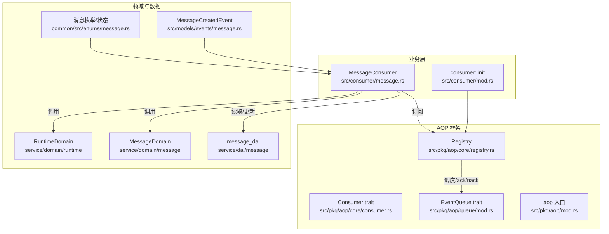
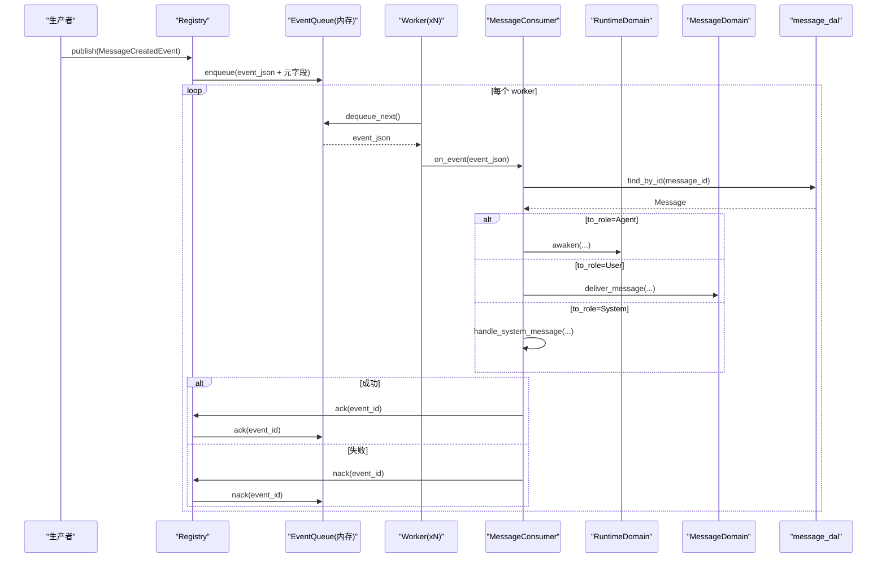
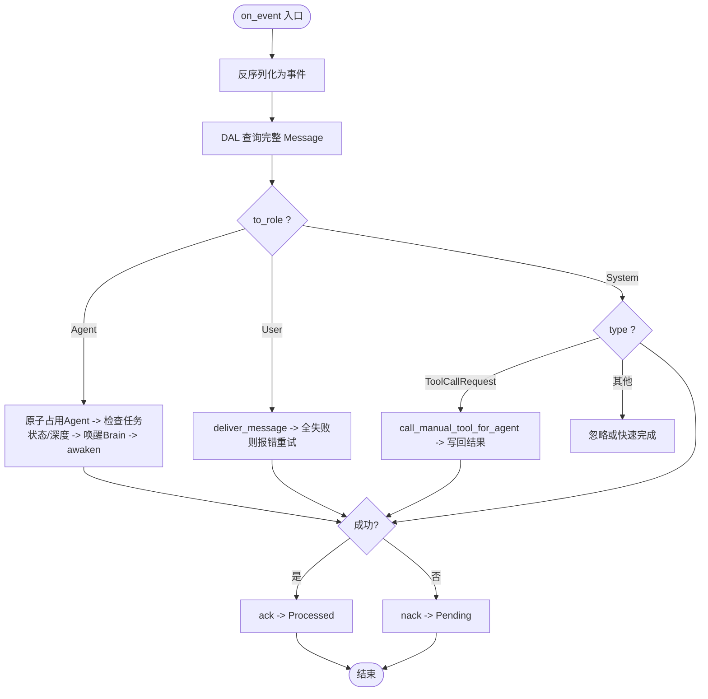
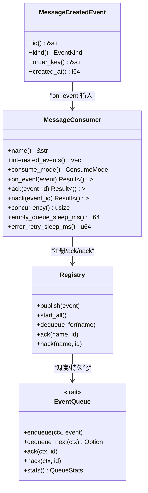

# 消息消费者（框架层）

<cite>
**本文引用的文件**
- [src/consumer/mod.rs](src/consumer/mod.rs)
- [src/consumer/message.rs](src/consumer/message.rs)
- [src/models/events/message.rs](src/models/events/message.rs)
- [common/src/enums/message.rs](common/src/enums/message.rs)
- [src/pkg/aop/mod.rs](src/pkg/aop/mod.rs)
- [src/pkg/aop/core/mod.rs](src/pkg/aop/core/mod.rs)
- [src/pkg/aop/core/registry.rs](src/pkg/aop/core/registry.rs)
- [src/pkg/aop/core/consumer.rs](src/pkg/aop/core/consumer.rs)
- [src/pkg/aop/queue/mod.rs](src/pkg/aop/queue/mod.rs)
- [AgentRuntimeInfo 状态机 + BusyGuard RAII：Idle/Busy/Resting 三态转换 + task_id/project_id 业务上下文 + 前端 runtime-list 过滤](docs/wiki/knowledge/zh/AgentRuntimeInfo 三态状态机 + BusyGuard RAII：Idle Busy Resting 转换 + task_id project_id 业务上下文透视/AgentRuntimeInfo 三态状态机 + BusyGuard RAII：Idle Busy Resting 转换 + task_id project_id 业务上下文透视.md)
</cite>

## 目录
1. [简介](#简介)
2. [项目结构](#项目结构)
3. [核心组件](#核心组件)
4. [架构总览](#架构总览)
5. [详细组件分析](#详细组件分析)
6. [依赖关系分析](#依赖关系分析)
7. [性能考量](#性能考量)
8. [故障排查指南](#故障排查指南)
9. [结论](#结论)
10. [附录](#附录)

## 简介
本文件面向"消息消费者"子系统，聚焦 MessageConsumer 的实现机制与运行流程。内容涵盖：
- 消息路由与分发处理（按接收角色与消息类型）
- 持久化存储与状态流转（Pending/Processing/Processed/Failed）
- 消息类型识别、优先级队列管理与并发策略
- 消息去重、失败重试与死信队列处理现状
- 完整时序图与错误处理示例

> 📌 视角说明（AGENTS §2.1.3 Level 3 互补视角平行卡）：
> 本长文是「消息消费者」主题的 **框架层** 视角。同主题还有以下平行视角卡，请按需交叉阅读：
> - [消息消费者（代码落地层）](docs/wiki/zh/content/核心模块/AOP 事件系统/消费者框架/消息消费者.md)

## 项目结构
消息消费者位于业务层 consumer/ 模块，通过 AOP 事件中心订阅 message.created 事件，并调用 Domain/DAL/DAO 完成业务编排与持久化。AOP 框架提供事件注册、发布、异步调度与队列抽象；消息事件模型定义在 models/events 中；枚举与状态定义在 common/enums。

图表来源
- [src/consumer/mod.rs:16-37](src/consumer/mod.rs#L16-L37)
- [src/consumer/message.rs:64-141](src/consumer/message.rs#L64-L141)
- [src/pkg/aop/core/registry.rs:97-206](src/pkg/aop/core/registry.rs#L97-L206)
- [src/pkg/aop/core/consumer.rs:24-71](src/pkg/aop/core/consumer.rs#L24-L71)
- [src/pkg/aop/queue/mod.rs:77-106](src/pkg/aop/queue/mod.rs#L77-L106)
- [src/models/events/message.rs:1-53](src/models/events/message.rs#L1-L53)
- [common/src/enums/message.rs:134-151](common/src/enums/message.rs#L134-L151)

章节来源
- [src/consumer/mod.rs:16-37](src/consumer/mod.rs#L16-L37)
- [src/pkg/aop/mod.rs:1-61](src/pkg/aop/mod.rs#L1-L61)

## 核心组件
- MessageConsumer：业务层消费者，实现 Consumer trait，负责从 AOP 队列拉取 message.created 事件，解析后按 to_role 分发到不同 Domain 处理，并在成功/失败时 ack/nack 持久化消息状态。
- Registry：AOP 注册中心，维护消费者、生产者、队列映射，负责事件发布、入队、worker 启动、ack/nack 桥接与指标埋点。
- EventQueue：队列抽象，提供 enqueue/dequeue/ack/nack/stats/query 等能力；当前默认实现在内存队列中。
- MessageCreatedEvent：事件模型，定义 order_key 策略，用于同 key 串行与优先级控制。
- 消息枚举与状态：MessageRole、MessageType、MessageStatus 用于消息路由与状态机管理。

章节来源
- [src/consumer/message.rs:34-141](src/consumer/message.rs#L34-L141)
- [src/pkg/aop/core/registry.rs:11-19](src/pkg/aop/core/registry.rs#L11-L19)
- [src/pkg/aop/queue/mod.rs:77-106](src/pkg/aop/queue/mod.rs#L77-L106)
- [src/models/events/message.rs:1-53](src/models/events/message.rs#L1-L53)
- [common/src/enums/message.rs:7-88](common/src/enums/message.rs#L7-L88)
- [common/src/enums/message.rs:134-151](common/src/enums/message.rs#L134-L151)

## 架构总览
消息从生产侧进入 AOP 事件中心，经 Registry 序列化并注入元字段（event_id/kind/order_key/priority/created_at），根据消费者感兴趣的事件类型分发到对应队列；异步消费者由多 worker 轮询拉取，执行 on_event，成功后 ack 标记为 Processed，失败则 nack 回退为 Pending 并退避重试。

图表来源
- [src/pkg/aop/core/registry.rs:97-206](src/pkg/aop/core/registry.rs#L97-L206)
- [src/pkg/aop/core/registry.rs:318-446](src/pkg/aop/core/registry.rs#L318-L446)
- [src/consumer/message.rs:78-128](src/consumer/message.rs#L78-L128)
- [src/models/events/message.rs:18-52](src/models/events/message.rs#L18-L52)

## 详细组件分析

### MessageConsumer 分析与流程
- 事件订阅：interested_events 返回 message.created；consume_mode 为 Async；concurrency 为 4；空队列与错误重试分别休眠 100ms/1000ms。
- 事件处理：on_event 反序列化为 MessageCreatedEvent，重建 RequestContext，从 DAL 加载完整 Message，按 to_role 分发：
  - Agent：原子占用 Agent（try_set_busy），校验任务状态与思考深度限制，必要时唤醒 Brain，构造 ThinkingOptions 并调用 RuntimeDomain.awaken。
  - User：调用 MessageDomain.deliver_message，若所有渠道投递失败则返回错误触发重试。
  - System：仅处理 ToolCallRequest，构建上下文并调用 RuntimeDomain.tool_execution，再写回结果。
- 确认机制：ack 将消息状态置为 Processed；nack 置为 Pending，配合 Registry 的 nack 使事件重新入队。

图表来源
- [src/consumer/message.rs:78-141](src/consumer/message.rs#L78-L141)
- [src/consumer/message.rs:147-357](src/consumer/message.rs#L147-L357)
- [src/consumer/message.rs:359-477](src/consumer/message.rs#L359-L477)
- [common/src/enums/message.rs:7-88](common/src/enums/message.rs#L7-L88)

章节来源
- [src/consumer/message.rs:64-141](src/consumer/message.rs#L64-L141)
- [src/consumer/message.rs:147-477](src/consumer/message.rs#L147-L477)
- [common/src/enums/message.rs:7-88](common/src/enums/message.rs#L7-L88)

### 消息类型识别与路由
- 基于 MessageRole 区分 Agent/User/System，决定后续分支。
- System 分支内基于 MessageType 识别 ToolCallRequest，进一步走工具执行路径。
- 这些枚举定义于 common/enums/message.rs。

章节来源
- [src/consumer/message.rs:98-109](src/consumer/message.rs#L98-L109)
- [src/consumer/message.rs:391-400](src/consumer/message.rs#L391-L400)
- [common/src/enums/message.rs:7-88](common/src/enums/message.rs#L7-L88)

### 优先级队列管理与顺序保证
- order_key 策略：当接收者为 Agent 时使用 to_id（agent_id）保证同一 Agent 的消息串行；否则使用 task_id → project_id 降级，确保用户消息在任务维度有序且不跨任务阻塞。
- 该策略在事件模型中实现，避免并发竞争导致的重复唤醒与无效重试。

章节来源
- [src/models/events/message.rs:18-52](src/models/events/message.rs#L18-L52)

### 并发处理策略
- MessageConsumer 设置 concurrency=4，Registry 会为每个异步消费者启动 N 个 worker 循环拉取队列。
- 空队列与错误场景均引入 sleep，避免 CPU 自旋；错误重试间隔可配置。

章节来源
- [src/consumer/message.rs:130-141](src/consumer/message.rs#L130-L141)
- [src/pkg/aop/core/registry.rs:318-446](src/pkg/aop/core/registry.rs#L318-L446)

### 消息去重、失败重试与死信队列
- 去重：当前代码未实现显式幂等键或去重表；order_key 串行化降低重复处理风险，但不等同于去重。
- 失败重试：ack/nack 配合 Registry 的 nack 实现重试；失败后 sleep 退避，避免紧密循环。
- 死信队列：当前无独立死信队列；失败事件会持续重试直至成功或外部干预。

章节来源
- [src/consumer/message.rs:114-128](src/consumer/message.rs#L114-L128)
- [src/pkg/aop/core/registry.rs:386-431](src/pkg/aop/core/registry.rs#L386-L431)
- [src/pkg/aop/queue/mod.rs:77-106](src/pkg/aop/queue/mod.rs#L77-L106)

### 持久化存储与状态流转
- 消息状态：Pending/Processing/Processed/Failed，由 message_dal 更新。
- ack：将消息状态置为 Processed；nack：置为 Pending。
- 注意：当前 ack/nack 直接操作消息表状态，而非独立事件表；队列本身为内存实现。

章节来源
- [src/consumer/message.rs:114-128](src/consumer/message.rs#L114-L128)
- [common/src/enums/message.rs:134-151](common/src/enums/message.rs#L134-L151)

## 依赖关系分析
- MessageConsumer 依赖：
  - RuntimeDomain：唤醒 Agent、工具执行
  - MessageDomain：消息投递与结果回写
  - message_dal：消息查询与状态更新
  - AOP Consumer trait：统一接口
- Registry 依赖：
  - EventQueue：队列抽象（当前 InMemory）
  - MetricsHook：可选指标采集
- 事件模型与枚举：
  - MessageCreatedEvent：事件结构与 order_key
  - MessageRole/MessageType/MessageStatus：路由与状态

图表来源
- [src/consumer/message.rs:64-141](src/consumer/message.rs#L64-L141)
- [src/pkg/aop/core/registry.rs:97-206](src/pkg/aop/core/registry.rs#L97-L206)
- [src/pkg/aop/queue/mod.rs:77-106](src/pkg/aop/queue/mod.rs#L77-L106)
- [src/models/events/message.rs:1-53](src/models/events/message.rs#L1-L53)

章节来源
- [src/consumer/message.rs:64-141](src/consumer/message.rs#L64-L141)
- [src/pkg/aop/core/registry.rs:97-206](src/pkg/aop/core/registry.rs#L97-L206)
- [src/pkg/aop/queue/mod.rs:77-106](src/pkg/aop/queue/mod.rs#L77-L106)
- [src/models/events/message.rs:1-53](src/models/events/message.rs#L1-L53)

## 性能考量
- 并发度：MessageConsumer 设置为 4 个 worker，适合中等吞吐；可根据负载调整 concurrency。
- 顺序性：order_key 串行化减少竞争，但可能成为瓶颈；建议在高并发下评估是否拆分 order_key 粒度。
- 退避策略：错误重试 sleep 避免 CPU 自旋；可根据错误类型细化退避策略（指数退避）。
- 内存队列：当前 EventQueue 为内存实现，重启不持久；如需高可用需替换为持久队列。
- 上下文重建：rebuild_context 按需填充 org/project/task/user/model_provider 等字段，避免多余 IO。

[本节为通用指导，不直接分析具体文件]

## 故障排查指南
- 常见错误与定位
  - Agent busy：try_set_busy 失败会返回冲突错误并释放 Busy，允许重试；检查是否有并发抢占或长时间占用。
  - 任务已结束：Completed/Cancelled/Archived 的任务跳过唤醒，避免无效处理。
  - 思考深度超限：达到 max_thinking_depth 时停止唤醒并通知用户；属于合法终止。
  - 投递失败：所有渠道失败时返回错误触发重试；检查 SSE 订阅与渠道配置。
  - 工具调用失败：错误信息封装为 ToolCallExecutionOutcome.Failure，写入结果消息。
- 日志与监控
  - Registry 记录 on_consume_start/success/failure 指标；可通过 metrics_hook 接入监控系统。
  - 队列统计：stats()/query_events()/get_event() 可用于观察 pending/in_progress 与最老事件年龄。

章节来源
- [src/consumer/message.rs:147-357](src/consumer/message.rs#L147-L357)
- [src/consumer/message.rs:359-477](src/consumer/message.rs#L359-L477)
- [src/pkg/aop/core/registry.rs:348-431](src/pkg/aop/core/registry.rs#L348-L431)
- [src/pkg/aop/queue/mod.rs:10-106](src/pkg/aop/queue/mod.rs#L10-L106)

## 结论
MessageConsumer 以 AOP 事件为中心，结合 order_key 串行化与多 worker 并发，实现了可靠的消息路由与处理。通过 ack/nack 与状态机，保障消息最终一致性与可重试性。当前内存队列与无死信队列的设计适用于开发测试环境；生产环境建议引入持久队列与死信通道，并完善去重机制。

[本节为总结，不直接分析具体文件]

## 附录
- 关键流程参考
  - 消费者注册与启动：consumer::init 注册多个消费者；Registry.start_all 启动 worker。
  - 事件发布：Registry.publish 序列化并注入元字段，按消费者模式分发。
  - 队列操作：EventQueue 提供 enqueue/dequeue/ack/nack/stats/query。

章节来源
- [src/consumer/mod.rs:16-37](src/consumer/mod.rs#L16-L37)
- [src/pkg/aop/core/registry.rs:260-487](src/pkg/aop/core/registry.rs#L260-L487)
- [src/pkg/aop/queue/mod.rs:77-106](src/pkg/aop/queue/mod.rs#L77-L106)