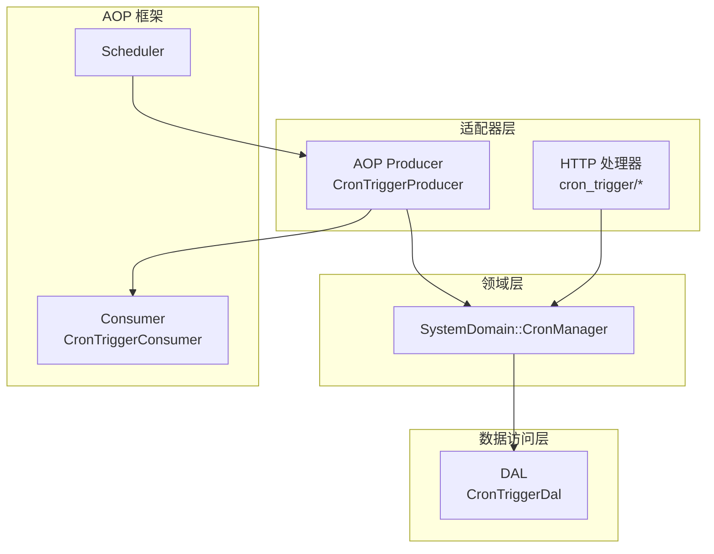
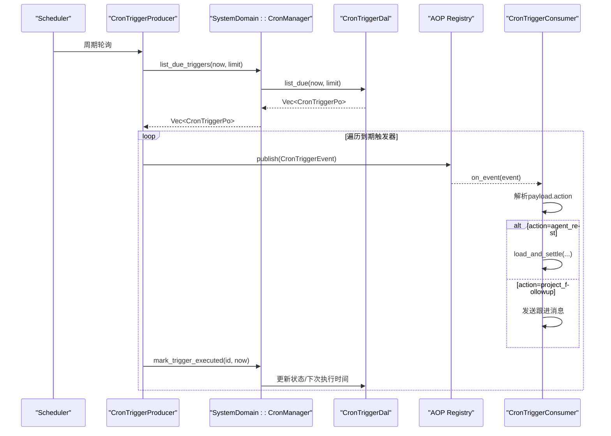
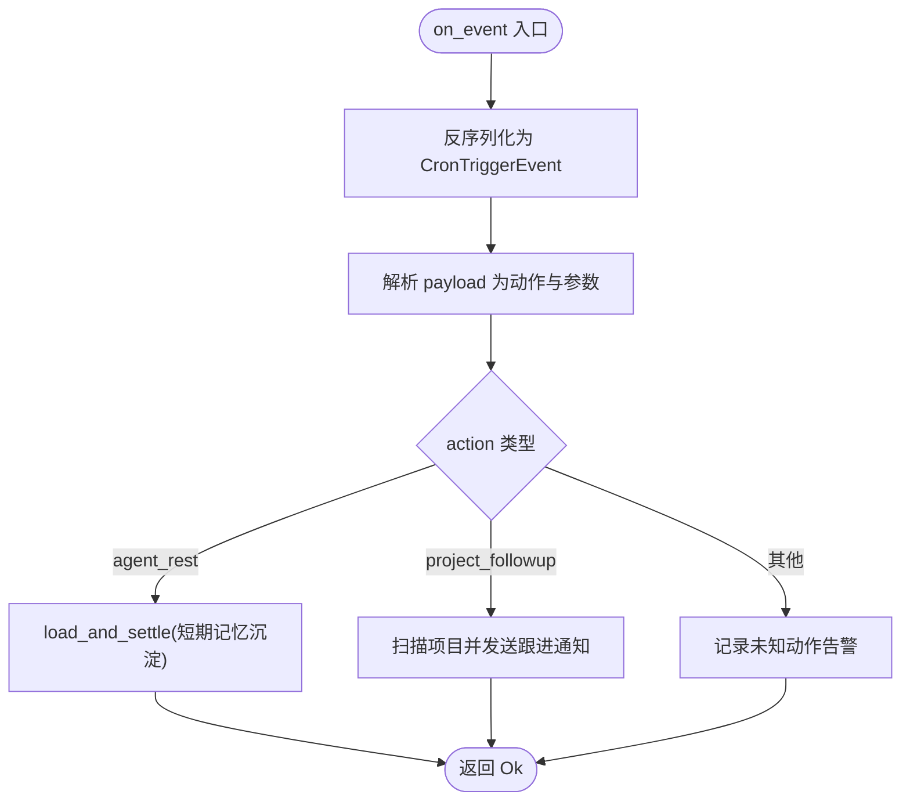
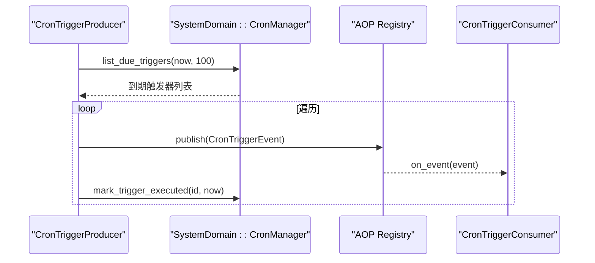
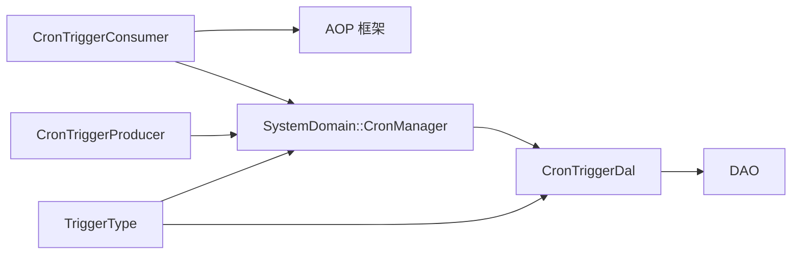

# 调度器消费者

<cite>
**本文引用的文件**
- [src/consumer/scheduler.rs](src/consumer/scheduler.rs)
- [src/producer/cron_trigger.rs](src/producer/cron_trigger.rs)
- [src/models/events/cron_trigger.rs](src/models/events/cron_trigger.rs)
- [src/service/dal/cron_trigger.rs](src/service/dal/cron_trigger.rs)
- [src/service/domain/system/mod.rs](src/service/domain/system/mod.rs)
- [common/src/enums/cron_trigger.rs](common/src/enums/cron_trigger.rs)
- [src/handlers/system/cron_trigger/response.rs](src/handlers/system/cron_trigger/response.rs)
- [src/handlers/system/cron_trigger/update_cron_trigger.rs](src/handlers/system/cron_trigger/update_cron_trigger.rs)
- [src/pkg/aop/core/scheduler.rs](src/pkg/aop/core/scheduler.rs)
</cite>

## 目录
1. [简介](#简介)
2. [项目结构](#项目结构)
3. [核心组件](#核心组件)
4. [架构总览](#架构总览)
5. [详细组件分析](#详细组件分析)
6. [依赖关系分析](#依赖关系分析)
7. [性能与扩展性](#性能与扩展性)
8. [故障排查指南](#故障排查指南)
9. [结论](#结论)
10. [附录：配置示例与恢复策略](#附录：配置示例与恢复策略)

## 简介
本文件面向“调度器消费者”，围绕 CronTriggerConsumer 的实现原理，系统阐述定时任务调度、执行计划管理、任务触发机制、执行上下文构建、结果回调处理、冲突检测、超时与资源清理策略，并提供可操作的配置示例与故障恢复建议。整体遵循四层单向调用（Adapter → Domain → DAL → DAO），AOP 仅负责事件流转，业务编排由消费者完成。

## 项目结构
与调度器消费者相关的代码分布在以下层次：
- Adapter 层：HTTP Handler 暴露 Cron Trigger 的 CRUD 接口；AOP Producer 周期性扫描到期触发器并发布事件。
- Domain 层：SystemDomain::CronManager 抽象出触发器的创建、查询、暂停/恢复、到期列表、执行标记等能力。
- DAL 层：封装对 DAO 的调用，实现一次性/间隔型触发器的下次执行时间计算与状态更新；当前 Cron 表达式解析尚未实现。
- AOP 框架：Scheduler 定义轮询周期；Producer 按周期拉取到期触发器并发布事件；Consumer 订阅事件并执行业务编排。

图表来源
- [src/handlers/system/cron_trigger/response.rs:1-44](src/handlers/system/cron_trigger/response.rs#L1-L44)
- [src/producer/cron_trigger.rs:1-88](src/producer/cron_trigger.rs#L1-L88)
- [src/service/domain/system/mod.rs:116-259](src/service/domain/system/mod.rs#L116-L259)
- [src/service/dal/cron_trigger.rs:34-176](src/service/dal/cron_trigger.rs#L34-L176)
- [src/pkg/aop/core/scheduler.rs:1-9](src/pkg/aop/core/scheduler.rs#L1-L9)
- [src/consumer/scheduler.rs:1-211](src/consumer/scheduler.rs#L1-L211)

章节来源
- [src/handlers/system/cron_trigger/response.rs:1-44](src/handlers/system/cron_trigger/response.rs#L1-L44)
- [src/producer/cron_trigger.rs:1-88](src/producer/cron_trigger.rs#L1-L88)
- [src/service/domain/system/mod.rs:116-259](src/service/domain/system/mod.rs#L116-L259)
- [src/service/dal/cron_trigger.rs:34-176](src/service/dal/cron_trigger.rs#L34-L176)
- [src/pkg/aop/core/scheduler.rs:1-9](src/pkg/aop/core/scheduler.rs#L1-L9)
- [src/consumer/scheduler.rs:1-211](src/consumer/scheduler.rs#L1-L211)

## 核心组件
- CronTriggerConsumer：AOP 消费者，订阅 cron.trigger 事件，按 payload.action 分发到具体业务处理（agent_rest、project_followup）。
- CronTriggerProducer：AOP 生产者，周期性从 Domain 获取到期触发器，构造事件并发布，随后标记执行成功。
- SystemDomain::CronManager：领域接口，统一暴露触发器管理能力。
- CronTriggerDal：数据访问层，实现一次性/间隔型触发器的下次执行时间计算与状态更新；Cron 表达式解析暂不支持。
- CronTriggerPo / TriggerType：持久化模型与触发类型枚举（Once/Cron/Interval）。

章节来源
- [src/consumer/scheduler.rs:1-211](src/consumer/scheduler.rs#L1-L211)
- [src/producer/cron_trigger.rs:1-88](src/producer/cron_trigger.rs#L1-L88)
- [src/service/domain/system/mod.rs:116-259](src/service/domain/system/mod.rs#L116-L259)
- [src/service/dal/cron_trigger.rs:34-176](src/service/dal/cron_trigger.rs#L34-L176)
- [common/src/enums/cron_trigger.rs:1-46](common/src/enums/cron_trigger.rs#L1-L46)

## 架构总览
调度器消费者的端到端流程如下：
- 启动阶段：SystemDomain 初始化时确保两条系统级默认触发器（agent_rest 每 4 小时、project_followup 每 1 小时）。
- 调度阶段：Scheduler 驱动 CronTriggerProducer 以固定间隔轮询，查询到期触发器并批量发布事件。
- 消费阶段：CronTriggerConsumer 同步消费事件，解析 payload.action 并调用对应 Domain/DAL 完成业务编排。
- 状态回写：Producer 在发布事件后，立即调用 mark_trigger_executed 更新触发器状态（一次性禁用、间隔型设置 next_run_at）。

图表来源
- [src/pkg/aop/core/scheduler.rs:1-9](src/pkg/aop/core/scheduler.rs#L1-L9)
- [src/producer/cron_trigger.rs:42-86](src/producer/cron_trigger.rs#L42-L86)
- [src/service/domain/system/mod.rs:240-259](src/service/domain/system/mod.rs#L240-L259)
- [src/service/dal/cron_trigger.rs:131-176](src/service/dal/cron_trigger.rs#L131-L176)
- [src/consumer/scheduler.rs:53-94](src/consumer/scheduler.rs#L53-L94)

## 详细组件分析

### CronTriggerConsumer：事件消费与业务编排
- 事件订阅：声明感兴趣的事件为 cron.trigger，消费模式为同步。
- 事件解析：将事件体反序列化为 CronTriggerEvent，再解析 payload 为动作与参数。
- 动作分发：
  - agent_rest：复用 settle_memory 的 load_and_settle 公共函数，加载 Agent 并执行记忆沉淀。
  - project_followup：扫描进行中且有 Owner Agent 的项目，预检查 Agent 运行时状态，避免 Busy/Resting 时无意义重试；构建 ProjectFollowupNotification 消息并投递。
- 错误处理：反序列化失败返回 bad_request；未知 action 记录警告日志。

图表来源
- [src/consumer/scheduler.rs:53-94](src/consumer/scheduler.rs#L53-L94)
- [src/consumer/scheduler.rs:104-131](src/consumer/scheduler.rs#L104-L131)
- [src/consumer/scheduler.rs:139-194](src/consumer/scheduler.rs#L139-L194)

章节来源
- [src/consumer/scheduler.rs:1-211](src/consumer/scheduler.rs#L1-L211)

### CronTriggerProducer：到期触发器发现与事件发布
- 轮询间隔：固定 60 秒。
- 到期查询：通过 SystemDomain::CronManager.list_due_triggers 获取到期触发器列表。
- 事件发布：为每个到期触发器构造 CronTriggerEvent 并发布到 AOP Registry。
- 执行标记：发布后立即调用 mark_trigger_executed 更新触发器状态（一次性禁用、间隔型设置 next_run_at）。

图表来源
- [src/producer/cron_trigger.rs:38-86](src/producer/cron_trigger.rs#L38-L86)
- [src/service/domain/system/mod.rs:240-259](src/service/domain/system/mod.rs#L240-L259)

章节来源
- [src/producer/cron_trigger.rs:1-88](src/producer/cron_trigger.rs#L1-L88)
- [src/service/domain/system/mod.rs:240-259](src/service/domain/system/mod.rs#L240-L259)

### SystemDomain::CronManager：领域能力抽象
- 提供触发器的创建、查询、更新、删除、暂停/恢复、到期列表、执行标记等能力。
- 初始化阶段确保两条系统级默认触发器（幂等）：agent_rest（每 4 小时）、project_followup（每 1 小时）。

章节来源
- [src/service/domain/system/mod.rs:116-259](src/service/domain/system/mod.rs#L116-L259)
- [src/service/domain/system/mod.rs:358-416](src/service/domain/system/mod.rs#L358-L416)

### CronTriggerDal：执行计划管理与状态更新
- 到期查询：list_due(now, limit) 返回到期触发器。
- 执行标记：mark_executed 根据触发类型更新状态：
  - Once：禁用并记录 last_run_at。
  - Interval：基于 interval_seconds 计算 next_run_at 并更新。
  - Cron：当前返回 UnsupportedOperation（未实现表达式解析）。

章节来源
- [src/service/dal/cron_trigger.rs:34-176](src/service/dal/cron_trigger.rs#L34-L176)

### 触发类型与模型
- TriggerType：Once、Cron、Interval。
- CronTriggerPo：包含 id、name、trigger_type、cron_expression、interval_seconds、run_at、next_run_at、is_enabled、payload、last_run_at、时间戳与审计字段。

章节来源
- [common/src/enums/cron_trigger.rs:1-46](common/src/enums/cron_trigger.rs#L1-L46)
- [src/models/cron_trigger.rs:1-65](src/models/cron_trigger.rs#L1-L65)

### HTTP 接口与请求响应
- 提供创建、查询、更新、暂停/恢复、删除等接口。
- 请求体包含 name、trigger_type、cron_expression、interval_seconds、run_at、payload 等字段。

章节来源
- [src/handlers/system/cron_trigger/response.rs:1-44](src/handlers/system/cron_trigger/response.rs#L1-L44)
- [src/handlers/system/cron_trigger/update_cron_trigger.rs:1-57](src/handlers/system/cron_trigger/update_cron_trigger.rs#L1-L57)

## 依赖关系分析
- Consumer 依赖 AOP 框架（Event/Consumer/ConsumeMode）与 Domain 层（通过 handler 或 domain 方法调用业务逻辑）。
- Producer 依赖 Domain 层（CronManager）与 AOP Registry。
- Domain 层依赖 DAL 层（CronTriggerDal）。
- DAL 层依赖 DAO 层（数据库操作）。
- 触发类型与模型在 common 模块中共享给前后端。

图表来源
- [src/consumer/scheduler.rs:1-211](src/consumer/scheduler.rs#L1-L211)
- [src/producer/cron_trigger.rs:1-88](src/producer/cron_trigger.rs#L1-L88)
- [src/service/domain/system/mod.rs:116-259](src/service/domain/system/mod.rs#L116-L259)
- [src/service/dal/cron_trigger.rs:34-176](src/service/dal/cron_trigger.rs#L34-L176)
- [common/src/enums/cron_trigger.rs:1-46](common/src/enums/cron_trigger.rs#L1-L46)

章节来源
- [src/consumer/scheduler.rs:1-211](src/consumer/scheduler.rs#L1-L211)
- [src/producer/cron_trigger.rs:1-88](src/producer/cron_trigger.rs#L1-L88)
- [src/service/domain/system/mod.rs:116-259](src/service/domain/system/mod.rs#L116-L259)
- [src/service/dal/cron_trigger.rs:34-176](src/service/dal/cron_trigger.rs#L34-L176)
- [common/src/enums/cron_trigger.rs:1-46](common/src/enums/cron_trigger.rs#L1-L46)

## 性能与扩展性
- 轮询粒度：Producer 每 60 秒轮询一次，适合低频系统任务。
- 批处理：每次最多拉取 100 条到期触发器，避免单次负载过大。
- 同步消费：Consumer 采用同步模式，适合轻量编排；若后续动作耗时较长，应考虑异步消费与限流。
- 可扩展点：
  - 新增 action：在 Consumer 的动作分支中添加新分支，并在 Domain/DAL 中实现相应能力。
  - Cron 表达式解析：在 DAL 层实现 Cron 表达式的解析与 next_run_at 计算，替换当前 UnsupportedOperation。
  - 超时控制：为长耗时动作增加超时与重试策略，避免阻塞消费者线程。
  - 并发控制：对 project_followup 等批量场景引入并发上限与背压，防止下游服务过载。

[本节为通用指导，不直接分析具体文件]

## 故障排查指南
- 事件反序列化失败：检查 payload 格式与 action 字段是否正确。
- 未知 action：确认 Consumer 是否已实现对应分支。
- 到期触发器未执行：检查 is_enabled 是否为启用状态；确认 next_run_at 是否已到；查看 Producer 日志是否发布事件。
- 执行标记失败：确认 mark_trigger_executed 是否被调用；检查数据库连接与事务。
- Cron 表达式不可用：当前 DAL 对 Cron 类型返回 UnsupportedOperation，需实现表达式解析后再使用。

章节来源
- [src/consumer/scheduler.rs:53-94](src/consumer/scheduler.rs#L53-L94)
- [src/producer/cron_trigger.rs:42-86](src/producer/cron_trigger.rs#L42-L86)
- [src/service/dal/cron_trigger.rs:140-176](src/service/dal/cron_trigger.rs#L140-L176)

## 结论
调度器消费者通过 AOP Producer/Consumer 解耦了调度与业务编排，实现了统一的触发器生命周期管理。当前已支持一次性与间隔型触发器；Cron 表达式解析待实现。通过合理的轮询粒度、批处理与幂等初始化，系统在稳定性与可维护性方面具备良好基础。后续应重点完善 Cron 表达式解析、超时与重试策略、以及批量场景的并发控制。

[本节为总结，不直接分析具体文件]

## 附录：配置示例与恢复策略

### 触发器配置要点
- 名称：便于识别与运维。
- 触发类型：
  - Once：指定 run_at，执行一次后自动禁用。
  - Interval：指定 interval_seconds，按固定间隔重复执行。
  - Cron：预留字段 cron_expression，当前不可用。
- Payload：JSON 字符串，必须包含 action 字段，例如：
  - {"action":"agent_rest","extra":{"settle_limit":10}}
  - {"action":"project_followup","extra":{}}

章节来源
- [src/handlers/system/cron_trigger/response.rs:1-44](src/handlers/system/cron_trigger/response.rs#L1-L44)
- [src/service/domain/system/mod.rs:358-416](src/service/domain/system/mod.rs#L358-L416)

### 故障恢复建议
- 幂等初始化：系统启动时确保两条默认触发器存在，避免重复创建。
- 状态回写：Producer 在发布事件后立即标记执行，保证即使消费者失败也能推进计划。
- 监控与告警：关注 AOP 队列统计与事件明细，及时发现积压与失败。
- 降级策略：当下游服务不可用时，跳过或延迟执行，避免雪崩。

章节来源
- [src/service/domain/system/mod.rs:358-416](src/service/domain/system/mod.rs#L358-L416)
- [src/producer/cron_trigger.rs:42-86](src/producer/cron_trigger.rs#L42-L86)