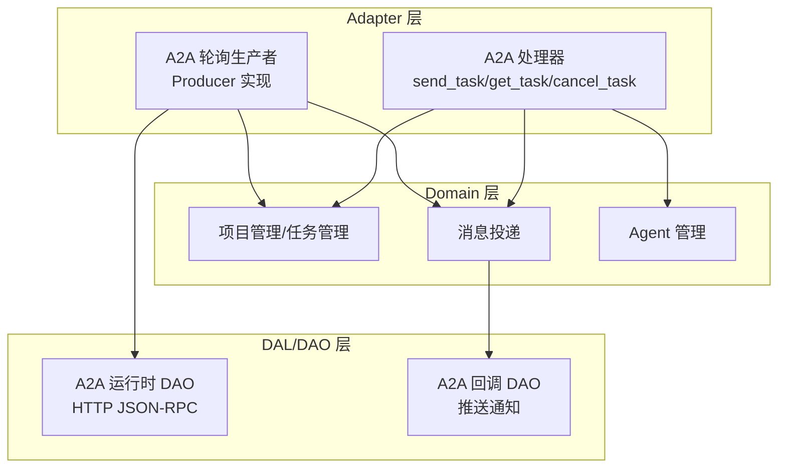
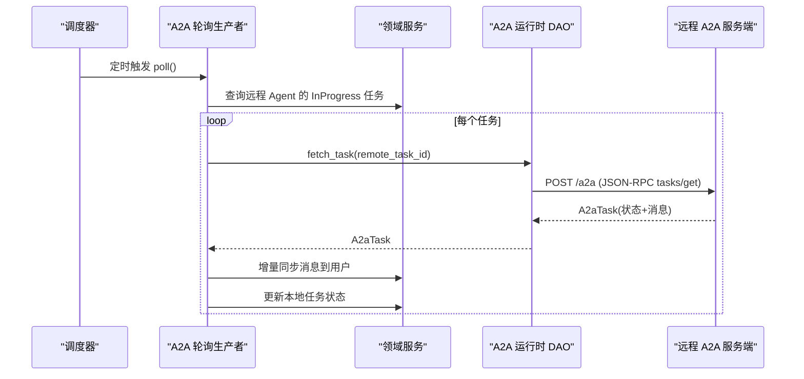
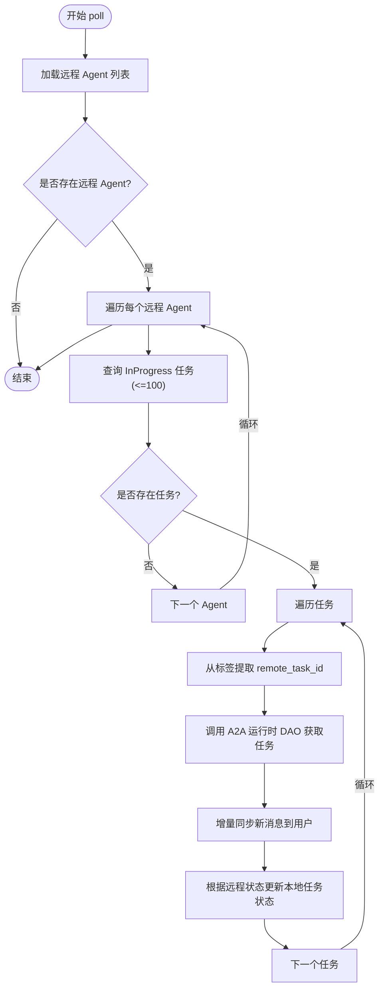
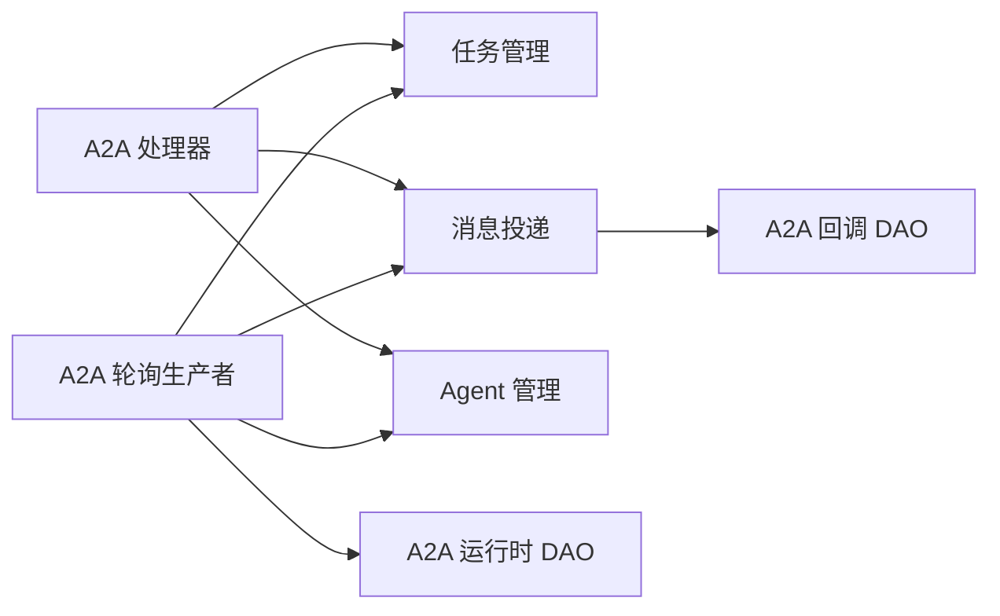

# A2A 轮询生产者

<cite>
**本文引用的文件**
- [src/producer/a2a_polling.rs](src/producer/a2a_polling.rs)
- [common/src/api/a2a.rs](common/src/api/a2a.rs)
- [src/handlers/a2a/mod.rs](src/handlers/a2a/mod.rs)
- [src/handlers/a2a/send_task.rs](src/handlers/a2a/send_task.rs)
- [src/handlers/a2a/get_task.rs](src/handlers/a2a/get_task.rs)
- [src/service/dao/agent_runtime/a2a.rs](src/service/dao/agent_runtime/a2a.rs)
- [src/models/events/a2a_task_update.rs](src/models/events/a2a_task_update.rs)
- [src/service/dao/a2a_callback/mod.rs](src/service/dao/a2a_callback/mod.rs)
</cite>

## 目录
1. [简介](#简介)
2. [项目结构](#项目结构)
3. [核心组件](#核心组件)
4. [架构总览](#架构总览)
5. [详细组件分析](#详细组件分析)
6. [依赖分析](#依赖分析)
7. [性能考虑](#性能考虑)
8. [故障排除指南](#故障排除指南)
9. [结论](#结论)
10. [附录](#附录)

## 简介
本文件面向“轮询型 A2A 生产者”，聚焦于在 A2A（Agent-to-Agent）协议下，如何周期性拉取远程 Agent 的任务状态、增量同步消息并更新本地任务状态。文档覆盖：
- A2A 协议规范与消息格式定义
- 轮询策略配置、重试机制、错误处理与性能优化
- 任务状态检查、结果获取与回调处理
- 集成示例、监控指标与故障排除

## 项目结构
围绕 A2A 轮询生产者的代码分布在以下层次：
- Adapter 层（HTTP Handler / 公开回调 Handler / AOP Producer）
  - A2A 协议 HTTP 端点：send_task、get_task、cancel_task、agent_card、jsonrpc 分发等
  - A2A 轮询生产者：实现 AOP Producer 接口，按固定间隔轮询远程任务
- Domain 层：业务实体与领域服务（任务、消息、项目、Agent 管理等）
- DAL/DAO 层：数据访问与外部系统调用（如 A2A 运行时 DAO 通过 HTTP JSON-RPC 调用远端）

图表来源
- [src/handlers/a2a/mod.rs:1-28](src/handlers/a2a/mod.rs#L1-L28)
- [src/producer/a2a_polling.rs:16-58](src/producer/a2a_polling.rs#L16-L58)
- [src/service/dao/agent_runtime/a2a.rs:29-68](src/service/dao/agent_runtime/a2a.rs#L29-L68)
- [src/service/dao/a2a_callback/mod.rs:1-50](src/service/dao/a2a_callback/mod.rs#L1-L50)

章节来源
- [src/handlers/a2a/mod.rs:1-28](src/handlers/a2a/mod.rs#L1-L28)

## 核心组件
- A2A 轮询生产者（A2aPollingProducer）
  - 职责：定时轮询所有远程 Agent 的 InProgress 任务，拉取远程任务状态与消息，增量同步到本地用户，并同步任务状态。
  - 关键行为：
    - 每 30 秒执行一次 poll
    - 查询远程 Agent 的 InProgress 任务列表
    - 通过 A2A 运行时 DAO 调用 tasks/get 获取远程任务
    - 增量同步 agent/assistant 消息到本地用户
    - 根据远程任务状态转换本地任务状态
- A2A 协议类型与消息格式
  - 定义 Agent Card、JSON-RPC 2.0、Task、Message、Artifact、方法参数等
- A2A 运行时 DAO
  - 通过 HTTP JSON-RPC 调用远端 A2A 服务端，封装 tasks/send、tasks/get 等方法
- A2A 回调 DAO
  - 将消息变更以完整 A2A Task 形式推送到客户端注册的 notification_url

章节来源
- [src/producer/a2a_polling.rs:16-58](src/producer/a2a_polling.rs#L16-L58)
- [common/src/api/a2a.rs:1-306](common/src/api/a2a.rs#L1-L306)
- [src/service/dao/agent_runtime/a2a.rs:29-68](src/service/dao/agent_runtime/a2a.rs#L29-L68)
- [src/service/dao/a2a_callback/mod.rs:1-50](src/service/dao/a2a_callback/mod.rs#L1-L50)

## 架构总览
轮询生产者作为 AOP Producer 被调度器周期触发，读取远程 Agent 的 InProgress 任务，通过 A2A 运行时 DAO 调用 tasks/get，将新消息推送到用户，并更新本地任务状态。同时，A2A 回调通道支持 PushNotifications，将任务状态变化推送到客户端。

图表来源
- [src/producer/a2a_polling.rs:60-270](src/producer/a2a_polling.rs#L60-L270)
- [src/service/dao/agent_runtime/a2a.rs:207-247](src/service/dao/agent_runtime/a2a.rs#L207-L247)
- [common/src/api/a2a.rs:147-198](common/src/api/a2a.rs#L147-L198)

## 详细组件分析

### A2A 轮询生产者（A2aPollingProducer）
- 角色与职责
  - 实现 Producer 接口，提供 name、register、poll_interval_secs、poll
  - 每 30 秒轮询一次，遍历远程 Agent 的 InProgress 任务
- 关键流程
  - 构建 RequestContext（System 调用者）
  - 查询远程 Agent 列表并过滤出 kind=remote 的 Agent
  - 对每个 Agent 查询其 InProgress 任务（最多 100）
  - 从任务标签中解析 remote_task_id
  - 调用 A2A 运行时 DAO 获取远程任务
  - 增量同步 agent/assistant 消息到用户（基于 a2a_synced_msgs 计数）
  - 根据远程任务状态映射为本地任务状态并执行状态迁移
- 错误处理
  - 网络或 JSON-RPC 错误：记录警告并跳过该任务
  - 消息发送失败：记录警告但不中断后续任务
  - 状态迁移失败：记录警告并继续
- 性能特性
  - 批量查询任务（limit=100）
  - 增量同步避免重复推送
  - 固定轮询间隔（30s），可通过扩展配置化

图表来源
- [src/producer/a2a_polling.rs:60-270](src/producer/a2a_polling.rs#L60-L270)

章节来源
- [src/producer/a2a_polling.rs:16-270](src/producer/a2a_polling.rs#L16-L270)

### A2A 协议与消息格式
- Agent Card：组织级能力描述，包含名称、版本、URL、能力声明、技能列表、默认输入输出模式
- JSON-RPC 2.0：请求/响应结构、标准错误码
- Task：id、session_id、status、messages、artifacts、metadata
- Message：role（user/agent/assistant）、parts（Text/File/Data）
- Artifact：产物信息
- 方法参数：SendTaskParams、GetTaskParams、CancelTaskParams

章节来源
- [common/src/api/a2a.rs:1-306](common/src/api/a2a.rs#L1-L306)

### A2A 运行时 DAO（HTTP JSON-RPC）
- 功能
  - 构造 JSON-RPC 请求（含单调递增 id）
  - 发送 HTTP POST 到远端 endpoint，携带 Authorization Bearer token（可选）
  - 解析 JSON-RPC 响应，处理 error/result
  - 暴露 fetch_task、execute_a2a_send 等方法
- 错误处理
  - HTTP 非成功状态：返回内部错误
  - JSON 解析失败：返回内部错误
  - JSON-RPC error：返回内部错误并附带 code/message
- 文本提取
  - 从 tasks/send 结果中提取 assistant/agent 的 text parts 拼接

章节来源
- [src/service/dao/agent_runtime/a2a.rs:29-68](src/service/dao/agent_runtime/a2a.rs#L29-L68)
- [src/service/dao/agent_runtime/a2a.rs:86-148](src/service/dao/agent_runtime/a2a.rs#L86-L148)
- [src/service/dao/agent_runtime/a2a.rs:150-205](src/service/dao/agent_runtime/a2a.rs#L150-L205)
- [src/service/dao/agent_runtime/a2a.rs:207-247](src/service/dao/agent_runtime/a2a.rs#L207-L247)
- [src/service/dao/agent_runtime/a2a.rs:249-275](src/service/dao/agent_runtime/a2a.rs#L249-L275)

### A2A 回调（PushNotifications）
- 功能
  - 当 send_task 提供了 notification_url，创建 A2aCallback 渠道（scope_project 绑定）
  - 消息投递时按 scope_project 过滤并推送完整 A2A Task 到客户端
- 接口
  - push(ctx, message, channel)
  - test_connection(ctx, channel)

章节来源
- [src/handlers/a2a/send_task.rs:93-114](src/handlers/a2a/send_task.rs#L93-L114)
- [src/service/dao/a2a_callback/mod.rs:1-50](src/service/dao/a2a_callback/mod.rs#L1-L50)

### 任务状态映射与同步
- 远程状态到本地状态的映射
  - Completed → Completed
  - Failed/Canceled → Cancelled
  - Working/Submitted/InputRequired → Pending→InProgress
- 同步标记
  - 使用 a2a_task_id 标签关联远程任务
  - 使用 a2a_synced_msgs 计数增量同步消息

章节来源
- [src/producer/a2a_polling.rs:218-259](src/producer/a2a_polling.rs#L218-L259)
- [src/models/events/a2a_task_update.rs:1-36](src/models/events/a2a_task_update.rs#L1-L36)

## 依赖分析
- 轮询生产者依赖
  - Domain：agent_manage、task_manage、message delivery
  - DAO：A2aRuntimeDao（HTTP JSON-RPC）
  - 事件工具：a2a_task_id、synced_msg_count 标签处理
- A2A 处理器依赖
  - Domain：project_manage、message management、artifact_manage
  - Mapper：构建 A2aTask
- 回调 DAO 依赖
  - 消息渠道：MessageChannel（A2aCallback 类型）

图表来源
- [src/producer/a2a_polling.rs:60-270](src/producer/a2a_polling.rs#L60-L270)
- [src/handlers/a2a/get_task.rs:17-49](src/handlers/a2a/get_task.rs#L17-L49)
- [src/service/dao/a2a_callback/mod.rs:1-50](src/service/dao/a2a_callback/mod.rs#L1-L50)

章节来源
- [src/producer/a2a_polling.rs:60-270](src/producer/a2a_polling.rs#L60-L270)
- [src/handlers/a2a/get_task.rs:17-49](src/handlers/a2a/get_task.rs#L17-L49)
- [src/service/dao/a2a_callback/mod.rs:1-50](src/service/dao/a2a_callback/mod.rs#L1-L50)

## 性能考虑
- 轮询频率
  - 当前固定 30 秒；可根据负载调整
- 批量查询
  - 每次最多查询 100 个任务，减少数据库压力
- 增量同步
  - 基于 a2a_synced_msgs 计数，避免重复推送
- 超时控制
  - A2A 运行时 DAO 使用 http Client 超时（timeout_secs）
- 并发与背压
  - 建议在生产环境引入限流与退避策略（指数退避）
- 日志与可观测性
  - 关键路径记录 info/warn，便于定位问题

[本节为通用指导，不直接分析具体文件]

## 故障排除指南
- 无法获取远程任务
  - 检查 A2A 运行时 DAO 的 endpoint、auth_token、timeout_secs 配置
  - 查看 HTTP 状态码与 JSON-RPC error 信息
- 消息未同步到用户
  - 确认任务标签中存在 a2a_task_id
  - 检查 a2a_synced_msgs 计数是否增长
  - 查看消息投递错误日志
- 任务状态未更新
  - 核对远程任务状态映射逻辑
  - 检查状态迁移调用是否成功
- 回调推送失败
  - 验证 notification_url 可达性与权限
  - 使用回调 DAO 的 test_connection 进行连通性测试

章节来源
- [src/producer/a2a_polling.rs:114-128](src/producer/a2a_polling.rs#L114-L128)
- [src/producer/a2a_polling.rs:165-180](src/producer/a2a_polling.rs#L165-L180)
- [src/producer/a2a_polling.rs:234-259](src/producer/a2a_polling.rs#L234-L259)
- [src/service/dao/agent_runtime/a2a.rs:116-148](src/service/dao/agent_runtime/a2a.rs#L116-L148)
- [src/service/dao/a2a_callback/mod.rs:32-45](src/service/dao/a2a_callback/mod.rs#L32-L45)

## 结论
A2A 轮询生产者通过稳定的轮询机制，实现了远程 Agent 任务的持续跟踪与结果回灌。结合 A2A 协议规范、JSON-RPC 通信、增量消息同步与状态映射，形成了可靠的跨 Agent 协作闭环。配合回调通道，可在需要时主动推送任务进展，提升用户体验。建议在部署环境中完善超时、重试与监控指标，确保高可用与可观测性。

[本节为总结性内容，不直接分析具体文件]

## 附录

### A2A 协议规范摘要
- 端点与方法
  - tasks/send：异步提交任务，立即返回 working 状态
  - tasks/get：查询任务状态与消息历史
  - tasks/cancel：取消任务
- 数据结构
  - AgentCard、JsonRpcRequest/Response、A2aTask、A2aMessage、A2aArtifact
- 认证
  - 通过 Authorization: Bearer <token> 传递认证令牌

章节来源
- [common/src/api/a2a.rs:64-145](common/src/api/a2a.rs#L64-L145)
- [common/src/api/a2a.rs:147-306](common/src/api/a2a.rs#L147-L306)
- [src/service/dao/agent_runtime/a2a.rs:102-108](src/service/dao/agent_runtime/a2a.rs#L102-L108)

### 集成示例（概念流程）
- 客户端调用 tasks/send 提交任务
- 服务端创建项目与消息，入队消费者唤醒 Agent
- 轮询生产者定期拉取远程任务，增量同步消息到用户
- 如需推送，客户端提供 notification_url，服务端通过回调 DAO 推送完整 A2A Task

章节来源
- [src/handlers/a2a/send_task.rs:31-128](src/handlers/a2a/send_task.rs#L31-L128)
- [src/handlers/a2a/get_task.rs:17-49](src/handlers/a2a/get_task.rs#L17-L49)
- [src/producer/a2a_polling.rs:60-270](src/producer/a2a_polling.rs#L60-L270)
- [src/service/dao/a2a_callback/mod.rs:1-50](src/service/dao/a2a_callback/mod.rs#L1-L50)