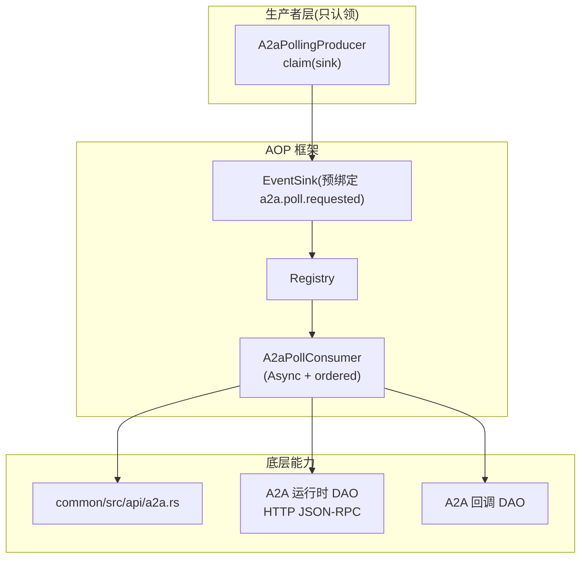
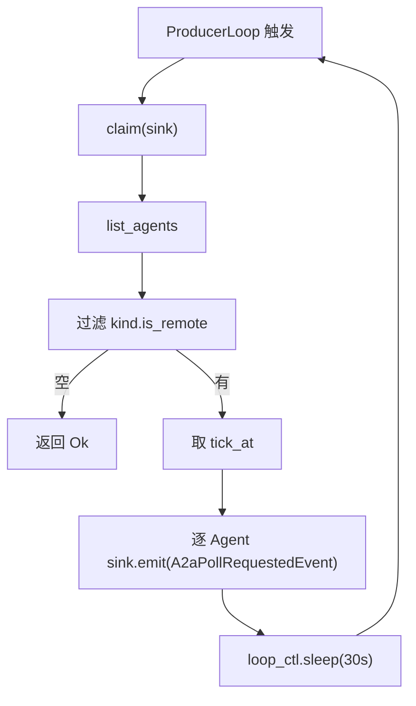
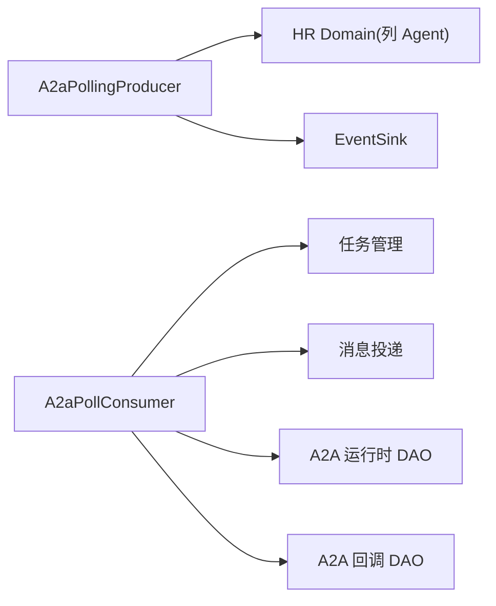

# A2A 轮询生产者

<cite>
**本文引用的文件**
- [src/producer/a2a_polling.rs](src/producer/a2a_polling.rs#L53-L140)
- [src/consumer/a2a_poll.rs](src/consumer/a2a_poll.rs#L32-L140)
- [src/models/events/a2a_poll.rs](src/models/events/a2a_poll.rs#L22-L58)
- [src/pkg/aop/core/producer.rs](src/pkg/aop/core/producer.rs#L13-L99)
- [src/pkg/aop/core/event_sink.rs](src/pkg/aop/core/event_sink.rs#L20-L54)
- [src/pkg/aop/core/registry.rs](src/pkg/aop/core/registry.rs#L53-L123)
- [src/pkg/aop/core/registry.rs](src/pkg/aop/core/registry.rs#L734-L802)
- [common/src/enums/event_topic.rs](common/src/enums/event_topic.rs#L32-L65)
- [common/src/api/a2a.rs](common/src/api/a2a.rs)
- [src/service/dao/agent_runtime/a2a.rs](src/service/dao/agent_runtime/a2a.rs)
- [src/service/dao/a2a_callback/mod.rs](src/service/dao/a2a_callback/mod.rs)
</cite>

## 更新摘要
**变更内容**
- 生产侧改为「只认领」语义：`tick()` → `claim(sink)`，只 `list_agents` + 过滤 remote + `sink.emit(A2aPollRequestedEvent)`，**不再直接做网络重活**
- 真正的远端抓取 / 消息投递 / `a2a_synced_msgs` 标签推进 / `transition_status` 已搬到新消费者 `src/consumer/a2a_poll.rs`（Async + `.ordered()`，`order_key = agent_id`）
- 新事件 `src/models/events/a2a_poll.rs::A2aPollRequestedEvent` 承载认领；`A2aPollingProducer` 只 emit、不声明 `notify_producer`

## 目录
1. [简介](#简介)
2. [项目结构](#项目结构)
3. [核心组件](#核心组件)
4. [架构总览](#架构总览)
5. [详细组件分析](#详细组件分析)
6. [依赖分析](#依赖分析)
7. [性能考虑](#性能考虑)
8. [故障排除指南](#故障排除指南)
9. [结论](#结论)
10. [附录](#附录)

## 简介
本文件面向「轮询型 A2A 生产者」，聚焦在 A2A（Agent-to-Agent）协议下，生产者如何**周期性认领**需要同步的远端 Agent，并把「拉取远端任务、增量同步消息、更新本地任务状态」这些重量级动作交给下游消费者执行。文档覆盖：
- 生产者「只认领」语义与 `claim(sink)` 流程
- `A2aPollRequestedEvent` 认领事件结构
- 消费侧 `A2aPollConsumer` 如何承接远端抓取与投递（新路径）
- A2A 协议/DAO/回调等底层能力的落点（见对应源码）
- 监控指标与故障排除

## 项目结构
围绕 A2A 轮询的代码分布在以下层次：
- 生产者层（`src/producer/a2a_polling.rs`）：`A2aPollingProducer` 实现 `Producer`，由 `ProducerLoop` 每 30s 驱动一次 `claim(sink)`。
- 消费层（`src/consumer/a2a_poll.rs`）：`A2aPollConsumer`（Async + `.ordered()`）消费 `a2a.poll.requested`，执行原 tick 的远端拉取/投递/状态推进。
- 事件层（`src/models/events/a2a_poll.rs`）：`A2aPollRequestedEvent`（`order_key = agent_id`）。
- 协议/DAO/回调层：`common/src/api/a2a.rs`、`src/service/dao/agent_runtime/a2a.rs`、`src/service/dao/a2a_callback/mod.rs`。



图表来源
- [src/producer/a2a_polling.rs:53-140](src/producer/a2a_polling.rs#L53-L140)
- [src/consumer/a2a_poll.rs:32-140](src/consumer/a2a_poll.rs#L32-L140)
- [src/models/events/a2a_poll.rs:22-58](src/models/events/a2a_poll.rs#L22-L58)

章节来源
- [src/producer/a2a_polling.rs:53-140](src/producer/a2a_polling.rs#L53-L140)

## 核心组件
- A2A 轮询生产者（`A2aPollingProducer`）
  - 职责：**只认领**——每 30 秒列出全部远端 Agent，对每个 remote Agent 发一条 `A2aPollRequestedEvent`；不在此线程做网络/DB 重活。
  - 归属：`topic() = EventTopic::A2aPollRequested`；经预绑定的 `EventSink` emit（发不出别的 topic）。
  - 自管循环：`start(sink)` spawn 后**立即返回**，`ProducerLoop` 每 30s 调用一次 `claim`，`stop()` 置位并 `await` JoinHandle。
- `A2aPollRequestedEvent`：认领事件，`order_key = agent_id`、`id = "{agent_id}-{tick_at}"`，由 `A2aPollConsumer` 按 Agent 串行处理。
- A2A 轮询消费者（`A2aPollConsumer`）：Async + `.ordered()`，承接原生产者 tick 的内层逻辑（远端抓取、消息投递、`a2a_synced_msgs` 推进、`transition_status`）。
- A2A 协议类型与 DAO：定义 Agent Card / JSON-RPC / Task / Message（`common/src/api/a2a.rs`），以及 HTTP JSON-RPC 运行时 DAO 与回调 DAO。

章节来源
- [src/producer/a2a_polling.rs:53-140](src/producer/a2a_polling.rs#L53-L140)
- [src/models/events/a2a_poll.rs:22-58](src/models/events/a2a_poll.rs#L22-L58)
- [src/consumer/a2a_poll.rs:32-140](src/consumer/a2a_poll.rs#L32-L140)
- [common/src/enums/event_topic.rs:32-65](common/src/enums/event_topic.rs#L32-L65)

## 架构总览
生产者被 `ProducerLoop` 周期触发，只做「认领」：列出远端 Agent、过滤 remote、向预绑定 topic emit 认领事件。真正的重活在 `A2aPollConsumer` 中执行——它在独立 worker 里拉取远端任务、增量同步消息到用户、更新本地任务状态，且失败降级为 warn+skip（下一轮重新认领即可）。

```mermaid
sequenceDiagram
participant Loop as "ProducerLoop(30s)"
participant Prod as "A2aPollingProducer"
participant Sink as "EventSink"
participant Reg as "Registry"
participant Cons as "A2aPollConsumer"
participant DAO as "A2A 运行时 DAO"
Loop->>Prod : claim(sink)
Prod->>Prod : list_agents + 过滤 remote
loop 每个 remote Agent
Prod->>Sink : emit(A2aPollRequestedEvent)
Sink->>Reg : publish
end
Reg->>Cons : on_event(A2aPollRequestedEvent)
Cons->>DAO : fetch_task / 投递消息 / 状态推进
```

图表来源
- [src/producer/a2a_polling.rs:53-140](src/producer/a2a_polling.rs#L53-L140)
- [src/consumer/a2a_poll.rs:32-140](src/consumer/a2a_poll.rs#L32-L140)
- [src/models/events/a2a_poll.rs:22-58](src/models/events/a2a_poll.rs#L22-L58)

## 详细组件分析

### A2A 轮询生产者（A2aPollingProducer，只认领）
- 角色与职责
  - 实现 `Producer` 接口，提供 `name` / `topic` / `on_consumed`(默认空) / `on_failed`(默认 Retry) / `start(sink)` / `stop`。
  - **不声明 `notify_producer`**：只 emit，没有业务收尾，因此 `a2a.poll.requested` 的归属表为空（见生产者总览的 DAL-as-Producer 表）。
- 关键流程（`claim(sink)`）
  - 构建 system ctx，调用 `hr_domain.agent_manage().list_agents` 获取全部 Agent。
  - 过滤 `kind.is_remote()` 的 Agent；为空直接返回。
  - 取轮次时间戳 `tick_at`，逐 Agent `sink.emit(A2aPollRequestedEvent::new(&agent.po.id, tick_at))`（发布句柄只认本 topic，发不出去则 Err）。
- 循环与生命周期
  - `start(sink)`：`tokio::spawn` 后立即返回；loop 内调用 `claim` 后 `loop_ctl.sleep(30s)`，被 `stop()` 置位后下一片（≤250ms）返回 `false` 退出。
  - 错误处理：`claim` 内任一 `emit` 失败即返回 Err；loop 捕获后仅记日志，下一轮继续认领（不拖累 30s 周期）。



图表来源
- [src/producer/a2a_polling.rs:53-140](src/producer/a2a_polling.rs#L53-L140)

章节来源
- [src/producer/a2a_polling.rs:40-140](src/producer/a2a_polling.rs#L40-L140)

### A2aPollRequestedEvent（认领事件）
- `event_id = "{agent_id}-{tick_at}"`（带轮次时间戳，便于日志区分相邻两轮）。
- `agent_id`：目标远端 Agent；`created_at = tick_at`。
- `order_key = agent_id`：同一 Agent 相邻两轮 tick 落在同一队列串行，上一轮未消费完则下一轮排队等待，避免重叠处理同一批任务（重复轮次由 `a2a_synced_msgs` 计数幂等吸收）。

章节来源
- [src/models/events/a2a_poll.rs:22-58](src/models/events/a2a_poll.rs#L22-L58)

### A2A 轮询消费者（A2aPollConsumer，消费侧重活）
- 订阅 `a2a.poll.requested`（`.ordered()`，`order_key = agent_id`），模式 Async。
- `on_event` 反序列化出 `A2aPollRequestedEvent` 后调用 `poll_agent(ctx, &event.agent_id)`。
- `poll_agent` 承接原生产者 tick 的内层逻辑：查询本地任务列表、拉取远端任务、增量同步消息到用户（`a2a_synced_msgs` 计数推进）、按远端状态 `transition_status`。
- 失败语义：单点失败降级为 warn + skip（下一轮 tick 重新认领同一 Agent 重来，比 nack 重投更快收敛）；真正的「整轮失败」（如查本地任务列表报错）才上抛 `Err`。
- 上下文：每 task ctx 用 `RequestContext::builder().caller_type(System).agent_id(..).task_id(..)`（有则加 `project_id`）。

章节来源
- [src/consumer/a2a_poll.rs:32-140](src/consumer/a2a_poll.rs#L32-L140)

### 注册与装配
- 生产者：`producer::init` 注册 `A2aPollingProducer`（DAL-as-Producer 表中 `a2a.poll.requested` 无生产者）。
- 消费者：`consumer::init` 注册 `A2aPollConsumer`（见 `src/consumer/mod.rs`）。
- 启动顺序：`dal::init_all()` → `producer::init()` → `consumer::init()` → `aop::init_all()`。

章节来源
- [src/consumer/mod.rs](src/consumer/mod.rs)
- [src/producer/mod.rs](src/producer/mod.rs)
- [src/producer/a2a_polling.rs:53-140](src/producer/a2a_polling.rs#L53-L140)

### 底层能力落点（协议 / DAO / 回调）
- 协议类型：Agent Card、JSON-RPC 2.0、Task、Message、Artifact（`common/src/api/a2a.rs`）。
- 运行时 DAO：`fetch_task` / `execute_a2a_send`（HTTP JSON-RPC 调用远端，`src/service/dao/agent_runtime/a2a.rs`）。
- 回调 DAO：`push(ctx, message, channel)` / `test_connection`（按 scope_project 过滤推送完整 A2A Task，`src/service/dao/a2a_callback/mod.rs`）。
- 任务状态映射：远端 Completed → 本地 Completed；Failed/Canceled → Cancelled；Working/Submitted/InputRequired → InProgress（在 `A2aPollConsumer::poll_agent` 内执行）。

章节来源
- [common/src/api/a2a.rs](common/src/api/a2a.rs)
- [src/service/dao/agent_runtime/a2a.rs](src/service/dao/agent_runtime/a2a.rs)
- [src/service/dao/a2a_callback/mod.rs](src/service/dao/a2a_callback/mod.rs)
- [src/consumer/a2a_poll.rs:32-140](src/consumer/a2a_poll.rs#L32-L140)

## 依赖分析
- 生产者依赖
  - Domain：`hr_domain.agent_manage`（`list_agents`）——仅用于列 Agent，不做远端拉取。
  - AOP：`EventSink`（emit 认领事件）。
- 消费者依赖
  - Domain：task_manage、message delivery、agent_manage。
  - DAO：A2A 运行时 DAO（HTTP JSON-RPC）、A2A 回调 DAO。
- 协议/回调层依赖
  - 消息渠道：MessageChannel（A2aCallback 类型）。



图表来源
- [src/producer/a2a_polling.rs:53-140](src/producer/a2a_polling.rs#L53-L140)
- [src/consumer/a2a_poll.rs:32-140](src/consumer/a2a_poll.rs#L32-L140)
- [src/service/dao/agent_runtime/a2a.rs](src/service/dao/agent_runtime/a2a.rs)

章节来源
- [src/producer/a2a_polling.rs:53-140](src/producer/a2a_polling.rs#L53-L140)
- [src/consumer/a2a_poll.rs:32-140](src/consumer/a2a_poll.rs#L32-L140)

## 性能考虑
- 轮询频率：当前固定 30 秒（由 `ProducerLoop` 的 `sleep` 控制）；认领动作极轻（只 emit 事件）。
- 批量与并发：远端拉取/投递在消费者侧按 Agent 串行（`order_key = agent_id`）执行，避免同一 Agent 重叠处理；如需更高吞吐可调高 `A2aPollConsumer` 的 `concurrency`（注意 `ordered` 目前只在并发 >1 时可观测）。
- 增量同步：`a2a_synced_msgs` 计数保证只推送新消息。
- 超时控制：A2A 运行时 DAO 使用 http Client 超时（`timeout_secs`）。
- 日志与可观测性：关键路径记录 info/warn；消费者失败降级为 warn+skip，不进入无限重投。

[本节为通用指导，不直接分析具体文件]

## 故障排除指南
- 生产者不 emit 认领事件
  - 检查 `a2a_polling` 生产者是否在 `producer::init` 注册、`aop::init_all` 是否成功（查 `producer started (topic=a2a.poll.requested)` 日志）。
  - 检查是否有 `kind.is_remote()` 的 Agent（否则 `claim` 直接返回，日志无 `claiming N remote agents`）。
- 远端任务未同步到用户
  - 确认 `A2aPollConsumer` 已注册且 `a2a.poll.requested` 队列有事件。
  - 查看 `a2a_poll` 消费者日志：远端 fetch 失败 / 消息投递失败均为 warn+skip，下一轮重来。
- 任务状态未更新
  - 核对 `A2aPollConsumer::poll_agent` 内的远端状态 → 本地状态映射与 `transition_status` 调用。
- 回调推送失败
  - 验证 `notification_url` 可达性与权限；用回调 DAO 的 `test_connection` 做连通性测试。

章节来源
- [src/producer/a2a_polling.rs:53-140](src/producer/a2a_polling.rs#L53-L140)
- [src/consumer/a2a_poll.rs:32-140](src/consumer/a2a_poll.rs#L32-L140)
- [src/service/dao/agent_runtime/a2a.rs](src/service/dao/agent_runtime/a2a.rs)
- [src/service/dao/a2a_callback/mod.rs](src/service/dao/a2a_callback/mod.rs)

## 结论
A2A 轮询生产者已从「生产者亲自拉取并投递」重构为「只认领」：每 30s 仅 `list_agents` + 过滤 remote + `emit(A2aPollRequestedEvent)`，把网络/DB 重活下沉到 `A2aPollConsumer`（Async + 按 Agent 串行）。这一拆分让 30s 周期不再被慢远端请求拖长，且认领事件天然进入 AOP 监控与失败指标；真正的远端抓取、消息投递与状态推进由消费者承接，单点失败降级为 warn+skip、下一轮重新认领即可收敛。建议在部署环境中完善超时、重试与监控指标，确保高可用与可观测性。

[本节为总结性内容，不直接分析具体文件]

## 附录

### A2A 协议规范摘要
- 端点与方法
  - `tasks/send`：异步提交任务，立即返回 working 状态。
  - `tasks/get`：查询任务状态与消息历史。
  - `tasks/cancel`：取消任务。
- 数据结构：AgentCard、JsonRpcRequest/Response、A2aTask、A2aMessage、A2aArtifact。
- 认证：通过 `Authorization: Bearer <token>` 传递认证令牌。

章节来源
- [common/src/api/a2a.rs](common/src/api/a2a.rs)

### 集成示例（概念流程）
- 客户端调用 `tasks/send` 提交任务。
- 服务端创建项目与消息，入队消费者唤醒 Agent。
- 生产者每 30s 认领远端 Agent，emit `A2aPollRequestedEvent`。
- `A2aPollConsumer` 拉取远端任务、增量同步消息到用户、按远端状态迁移本地任务。
- 如需推送，客户端提供 `notification_url`，服务端通过回调 DAO 推送完整 A2A Task。

章节来源
- [src/handlers/a2a/send_task.rs](src/handlers/a2a/send_task.rs)
- [src/handlers/a2a/get_task.rs](src/handlers/a2a/get_task.rs)
- [src/producer/a2a_polling.rs:53-140](src/producer/a2a_polling.rs#L53-L140)
- [src/consumer/a2a_poll.rs:32-140](src/consumer/a2a_poll.rs#L32-L140)
- [src/service/dao/a2a_callback/mod.rs](src/service/dao/a2a_callback/mod.rs)
