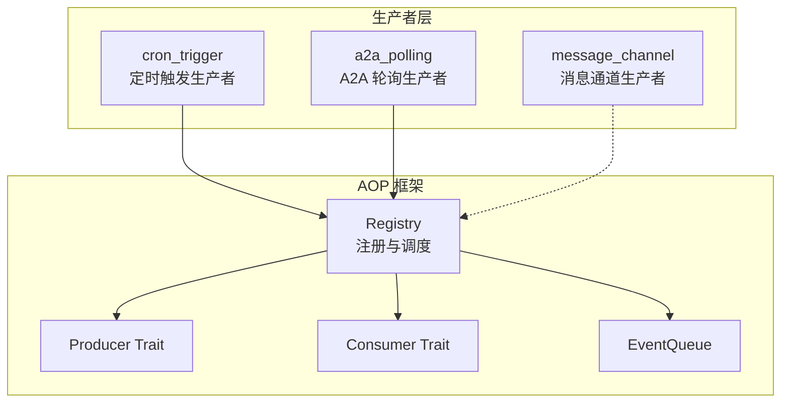
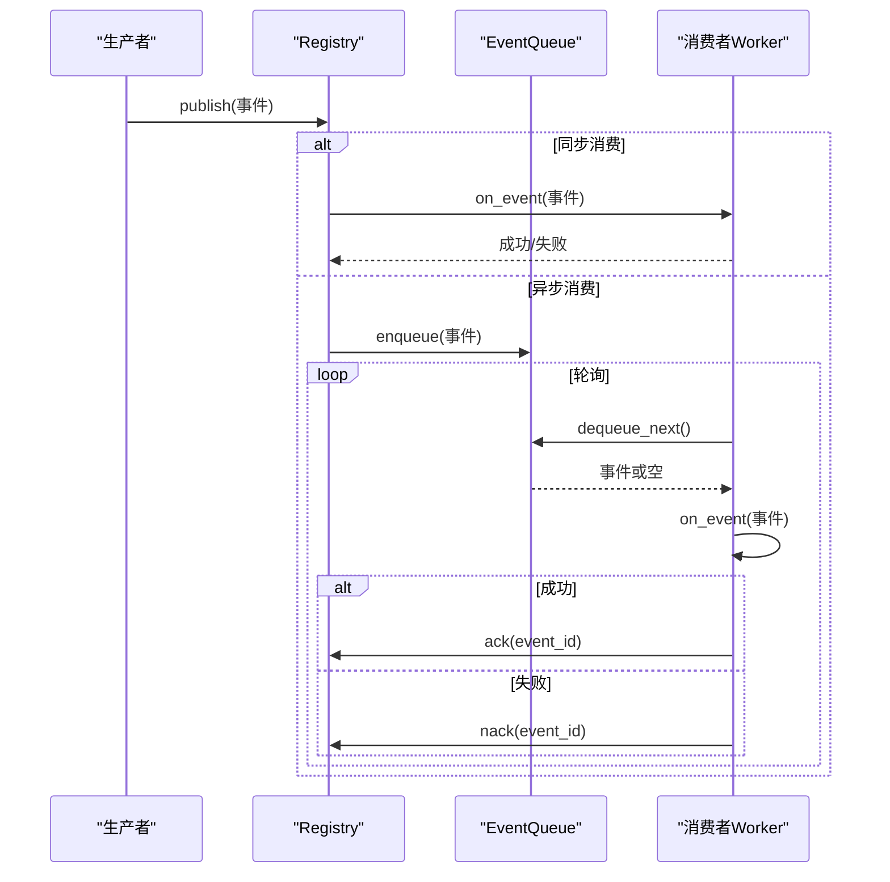
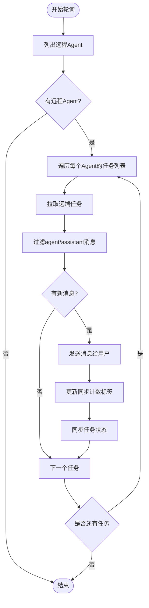
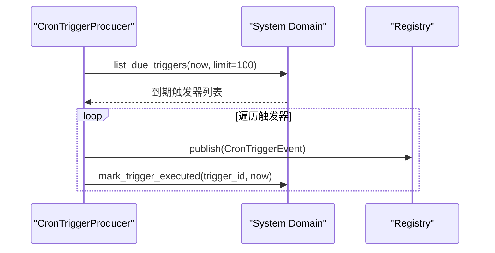
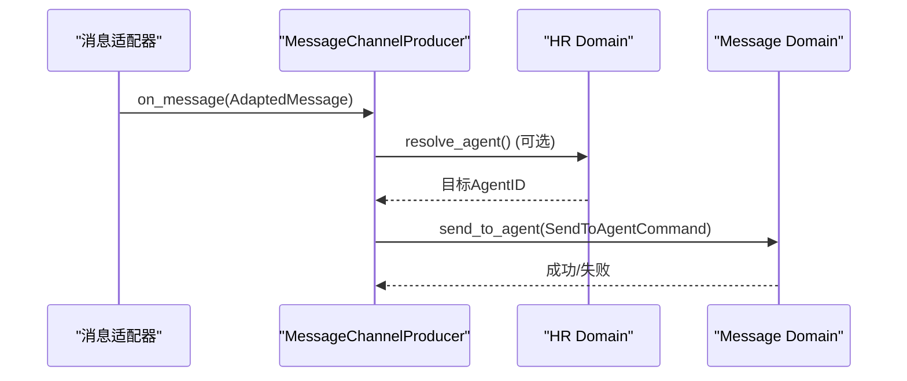
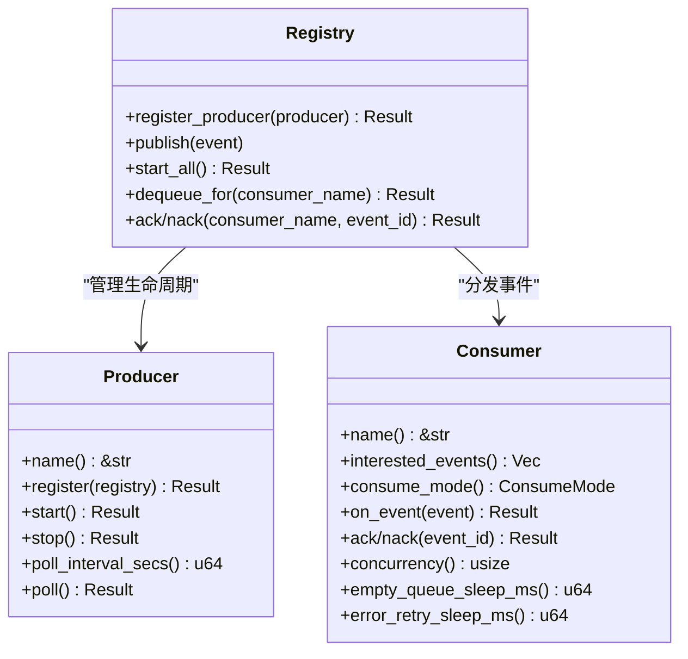
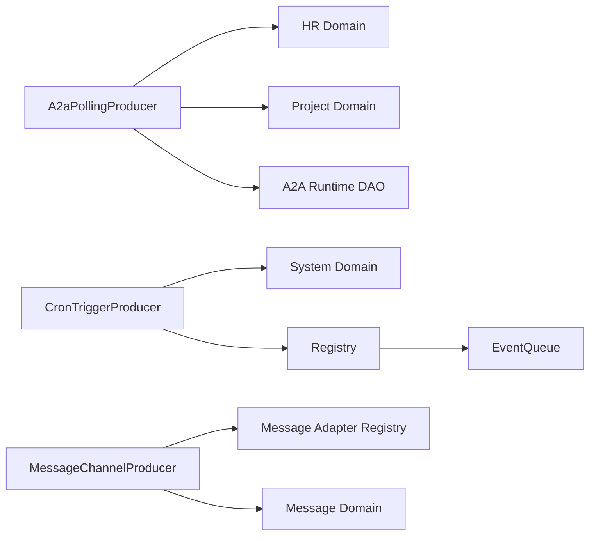

# 事件生产者

<cite>
**本文引用的文件**
- [src/producer/mod.rs](src/producer/mod.rs)
- [src/producer/a2a_polling.rs](src/producer/a2a_polling.rs)
- [src/producer/cron_trigger.rs](src/producer/cron_trigger.rs)
- [src/producer/message_channel.rs](src/producer/message_channel.rs)
- [src/pkg/aop/mod.rs](src/pkg/aop/mod.rs)
- [src/pkg/aop/core/mod.rs](src/pkg/aop/core/mod.rs)
- [src/pkg/aop/core/producer.rs](src/pkg/aop/core/producer.rs)
- [src/pkg/aop/core/consumer.rs](src/pkg/aop/core/consumer.rs)
- [src/pkg/aop/core/event.rs](src/pkg/aop/core/event.rs)
- [src/pkg/aop/core/registry.rs](src/pkg/aop/core/registry.rs)
- [src/pkg/aop/core/scheduler.rs](src/pkg/aop/core/scheduler.rs)
</cite>

## 目录
1. [简介](#简介)
2. [项目结构](#项目结构)
3. [核心组件](#核心组件)
4. [架构总览](#架构总览)
5. [详细组件分析](#详细组件分析)
6. [依赖关系分析](#依赖关系分析)
7. [性能考量](#性能考量)
8. [故障排查指南](#故障排查指南)
9. [结论](#结论)
10. [附录](#附录)

## 简介
本文件面向 AOP 事件生产者系统，系统性说明事件生产模式、定时任务触发、外部系统集成与消息通道处理。文档覆盖内置生产者实现（A2A 轮询生产者、定时触发生产者、消息通道生产者）、事件生成策略、批量处理、错误重试与监控指标，并提供生产者开发指南、配置选项与性能优化建议。

## 项目结构
事件生产者位于 src/producer 模块，统一通过 AOP 注册中心进行生命周期管理与调度；AOP 框架位于 src/pkg/aop，提供 Producer/Consumer/Registry/Queue 等基础能力。

图表来源
- [src/producer/mod.rs:9-25](src/producer/mod.rs#L9-L25)
- [src/pkg/aop/core/registry.rs:75-95](src/pkg/aop/core/registry.rs#L75-L95)
- [src/pkg/aop/core/producer.rs:7-35](src/pkg/aop/core/producer.rs#L7-L35)
- [src/pkg/aop/core/consumer.rs:24-71](src/pkg/aop/core/consumer.rs#L24-L71)

章节来源
- [src/producer/mod.rs:1-27](src/producer/mod.rs#L1-L27)
- [src/pkg/aop/mod.rs:1-61](src/pkg/aop/mod.rs#L1-L61)

## 核心组件
- 生产者接口 Producer：定义 name、register、start/stop、poll_interval_secs、poll，支持轮询与非轮询两种模式。
- 消费者接口 Consumer：定义 interested_events、consume_mode、on_event、ack/nack、concurrency、empty_queue_sleep_ms、error_retry_retry_sleep_ms。
- 注册中心 Registry：负责注册 producer/consumer、发布事件、启动异步 worker、管理队列与指标钩子。
- 事件模型 Event：定义 kind/id/order_key/priority/created_at 等元数据。
- 调度器 Scheduler：用于扩展的周期性任务抽象（当前未直接驱动生产者）。

章节来源
- [src/pkg/aop/core/producer.rs:7-35](src/pkg/aop/core/producer.rs#L7-L35)
- [src/pkg/aop/core/consumer.rs:6-71](src/pkg/aop/core/consumer.rs#L6-L71)
- [src/pkg/aop/core/event.rs:1-25](src/pkg/aop/core/event.rs#L1-L25)
- [src/pkg/aop/core/registry.rs:11-47](src/pkg/aop/core/registry.rs#L11-L47)
- [src/pkg/aop/core/scheduler.rs:1-9](src/pkg/aop/core/scheduler.rs#L1-L9)

## 架构总览
AOP 事件中心以“生产者-注册中心-消费者”解耦为核心：
- 生产者按固定间隔或外部回调产生事件并交由 Registry 分发。
- Registry 根据消费者感兴趣的事件类型进行同步或异步投递。
- 异步消费者由独立 worker 拉取队列中的事件进行处理，并通过 ack/nack 控制重试与确认。
- 指标钩子可注入到 Registry，对发布与消费过程进行观测。

图表来源
- [src/pkg/aop/core/registry.rs:97-206](src/pkg/aop/core/registry.rs#L97-L206)
- [src/pkg/aop/core/registry.rs:208-241](src/pkg/aop/core/registry.rs#L208-L241)
- [src/pkg/aop/core/registry.rs:260-487](src/pkg/aop/core/registry.rs#L260-L487)

## 详细组件分析

### A2A 轮询生产者
职责
- 每 30 秒轮询一次远程 Agent 的任务状态与消息增量，将新消息推送给本地用户，并同步任务状态。

关键流程
- 列出所有远程 Agent，筛选出处于进行中且带有 A2A 任务标签的任务。
- 调用 A2A 运行时 DAO 获取远端任务消息，过滤 agent/assistant 角色内容。
- 基于已同步计数发送新消息至用户，更新任务标签中的同步计数。
- 根据远端任务状态映射为本地任务状态并执行状态迁移。

错误处理
- 远端任务获取失败、消息发送失败、状态迁移失败均记录警告日志并继续处理其他任务。

性能与批处理
- 单次轮询最多读取 100 个任务，避免一次性拉取过多数据。
- 仅处理新增消息，减少重复发送。

图表来源
- [src/producer/a2a_polling.rs:56-270](src/producer/a2a_polling.rs#L56-L270)

章节来源
- [src/producer/a2a_polling.rs:16-272](src/producer/a2a_polling.rs#L16-L272)

### 定时触发生产者
职责
- 每分钟扫描即将到期的 Cron Trigger，构造 CronTriggerEvent 并发布到 AOP 事件中心，同时标记触发器已执行。

关键流程
- 查询到期触发器（上限 100），为每个触发器构建事件并调用 Registry.publish。
- 立即标记触发器已执行，避免重复触发。

错误处理
- 若 Registry 未注册则返回内部错误。
- 事件发布失败时由上层消费者处理重试逻辑。

图表来源
- [src/producer/cron_trigger.rs:42-86](src/producer/cron_trigger.rs#L42-L86)

章节来源
- [src/producer/cron_trigger.rs:8-88](src/producer/cron_trigger.rs#L8-L88)

### 消息通道生产者
职责
- 作为消息适配器回调，将外部渠道的消息转换为系统内消息，路由到指定 Agent 或默认 Agent。

关键流程
- 根据 from_role 设置 caller_type 与 user_id。
- 解析 to_agent_id（显式或从 HR Domain 解析）。
- 构造 SendToAgentCommand 并通过 MessageDomain.delivery.send_to_agent 投递。

错误处理
- 无法解析目标 Agent 时记录警告并跳过。
- 发送失败时包装为内部错误并返回。

图表来源
- [src/producer/message_channel.rs:26-90](src/producer/message_channel.rs#L26-L90)

章节来源
- [src/producer/message_channel.rs:11-116](src/producer/message_channel.rs#L11-L116)

### AOP 框架与调度
- Producer Trait：定义轮询间隔与 poll 方法，支持非轮询模式（start/stop）。
- Registry：
  - 注册生产者后，在 start_all 中根据 poll_interval_secs 决定是否启动轮询协程。
  - 异步消费者启动多个 worker，循环 dequeue_next -> on_event -> ack/nack。
  - 指标钩子在发布与消费各阶段被调用。
- Consumer Trait：支持同步/异步消费，提供并发度与休眠策略。

图表来源
- [src/pkg/aop/core/producer.rs:7-35](src/pkg/aop/core/producer.rs#L7-L35)
- [src/pkg/aop/core/registry.rs:75-487](src/pkg/aop/core/registry.rs#L75-L487)
- [src/pkg/aop/core/consumer.rs:24-71](src/pkg/aop/core/consumer.rs#L24-L71)

章节来源
- [src/pkg/aop/core/mod.rs:1-14](src/pkg/aop/core/mod.rs#L1-L14)
- [src/pkg/aop/core/registry.rs:11-561](src/pkg/aop/core/registry.rs#L11-L561)
- [src/pkg/aop/core/consumer.rs:1-72](src/pkg/aop/core/consumer.rs#L1-L72)
- [src/pkg/aop/core/event.rs:1-25](src/pkg/aop/core/event.rs#L1-L25)
- [src/pkg/aop/core/scheduler.rs:1-9](src/pkg/aop/core/scheduler.rs#L1-L9)

## 依赖关系分析
- 生产者依赖业务 Domain（hr、project、system、message）完成数据读取与状态变更。
- A2A 轮询生产者依赖 A2A 运行时 DAO 访问远端任务。
- 消息通道生产者依赖消息适配器的注册表与回调机制。
- Registry 依赖 EventQueue 实现异步消费者的持久化与重试。

图表来源
- [src/producer/a2a_polling.rs:60-270](src/producer/a2a_polling.rs#L60-L270)
- [src/producer/cron_trigger.rs:42-86](src/producer/cron_trigger.rs#L42-L86)
- [src/producer/message_channel.rs:26-102](src/producer/message_channel.rs#L26-L102)
- [src/pkg/aop/core/registry.rs:97-487](src/pkg/aop/core/registry.rs#L97-L487)

章节来源
- [src/producer/mod.rs:9-25](src/producer/mod.rs#L9-L25)
- [src/pkg/aop/core/registry.rs:75-487](src/pkg/aop/core/registry.rs#L75-L487)

## 性能考量
- 轮询间隔调优：A2A 轮询为 30 秒，Cron 触发为 60 秒；可根据负载调整。
- 批量限制：Cron 与 A2A 均限制单次处理数量（如 100），避免内存与 IO 压力。
- 异步消费者并发：可通过 Consumer.concurrency 提升吞吐；注意下游资源限制。
- 队列退避：空队列与错误重试分别使用 empty_queue_sleep_ms 与 error_retry_sleep_ms 降低 CPU 占用。
- 指标埋点：通过 Registry.set_metrics_hook 注入指标采集，观察发布与消费延迟、失败率。

[本节为通用指导，不直接分析具体文件]

## 故障排查指南
- 轮询无产出：检查是否有符合条件的远程 Agent 与任务；查看日志中“found remote agents”与“processed tasks”。
- 消息未送达：确认 A2A 远端任务存在 agent/assistant 消息且大于已同步计数；检查消息发送错误日志。
- Cron 未触发：确认 list_due_triggers 返回为空；检查 mark_trigger_executed 是否成功。
- 异步消费者堆积：查看队列长度与统计；调整 concurrency 与 sleep 参数；关注 nack 后的重试行为。
- 指标缺失：确认已设置 metrics hook；检查 on_publish/on_consume_* 调用路径。

章节来源
- [src/producer/a2a_polling.rs:114-216](src/producer/a2a_polling.rs#L114-L216)
- [src/producer/cron_trigger.rs:55-83](src/producer/cron_trigger.rs#L55-L83)
- [src/pkg/aop/core/registry.rs:333-444](src/pkg/aop/core/registry.rs#L333-L444)

## 结论
AOP 事件生产者系统通过统一的 Producer/Consumer/Registry 抽象，实现了高内聚、低耦合的事件驱动架构。内置生产者覆盖了定时任务、外部集成与消息通道三大场景，具备批量处理、错误重试与指标观测能力。遵循四层单向调用与 pkg 层无业务感知原则，可在保证稳定性的前提下快速扩展新的生产者与消费者。

[本节为总结性内容，不直接分析具体文件]

## 附录

### 生产者开发指南
- 实现 Producer Trait：
  - name：唯一标识。
  - register：保存 Registry 引用以便发布事件。
  - poll_interval_secs：>0 表示轮询模式；=0 表示非轮询模式，需自行管理 start/stop。
  - poll：轮询逻辑，读取数据、构造事件并调用 registry.publish。
- 注册与启动：
  - 在 producer::init 中调用 aop::registry().register_producer(Arc::new(...))。
  - 调用 aop::init_all() 启动所有生产者与异步消费者。
- 错误处理：
  - 记录警告日志并继续处理后续项；确保幂等与可恢复。
- 指标与监控：
  - 通过 Registry.set_metrics_hook 注入指标采集；利用 on_publish/on_consume_* 观察性能。

章节来源
- [src/producer/mod.rs:9-25](src/producer/mod.rs#L9-L25)
- [src/pkg/aop/core/producer.rs:7-35](src/pkg/aop/core/producer.rs#L7-L35)
- [src/pkg/aop/mod.rs:48-61](src/pkg/aop/mod.rs#L48-L61)
- [src/pkg/aop/core/registry.rs:38-47](src/pkg/aop/core/registry.rs#L38-L47)

### 配置选项
- 轮询间隔：
  - A2A 轮询：30 秒。
  - Cron 触发：60 秒。
- 批量大小：
  - Cron 与 A2A 单次最多处理 100 条。
- 异步消费者：
  - concurrency：并行 worker 数。
  - empty_queue_sleep_ms：队列为空时的休眠时间。
  - error_retry_sleep_ms：处理失败时的重试间隔。

章节来源
- [src/producer/a2a_polling.rs:56-92](src/producer/a2a_polling.rs#L56-L92)
- [src/producer/cron_trigger.rs:38-58](src/producer/cron_trigger.rs#L38-L58)
- [src/pkg/aop/core/consumer.rs:57-71](src/pkg/aop/core/consumer.rs#L57-L71)

### 性能优化建议
- 合理设置轮询间隔与批量大小，避免过度拉取。
- 使用异步消费者提升吞吐，结合下游资源限制调整并发。
- 启用指标钩子，持续观察发布与消费延迟、失败率与队列积压。
- 对频繁失败的下游服务实施退避与熔断，减少雪崩风险。

[本节为通用指导，不直接分析具体文件]