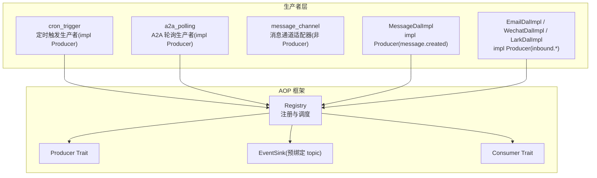
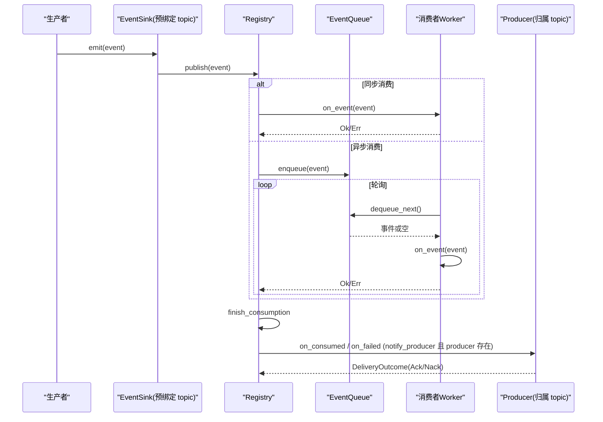
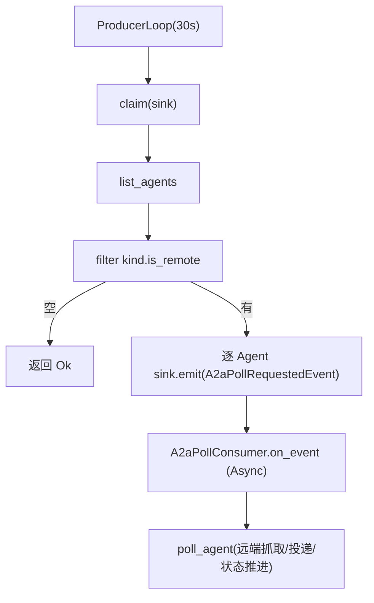
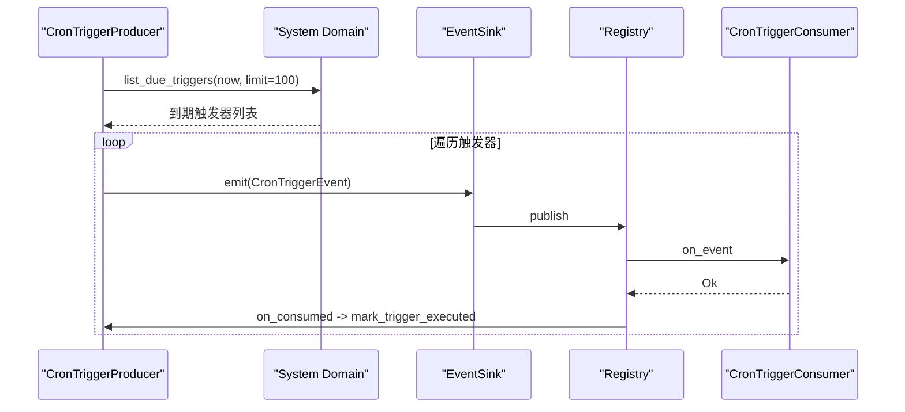
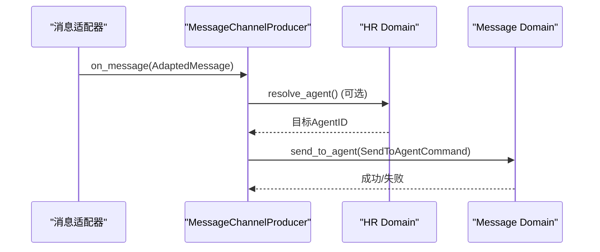
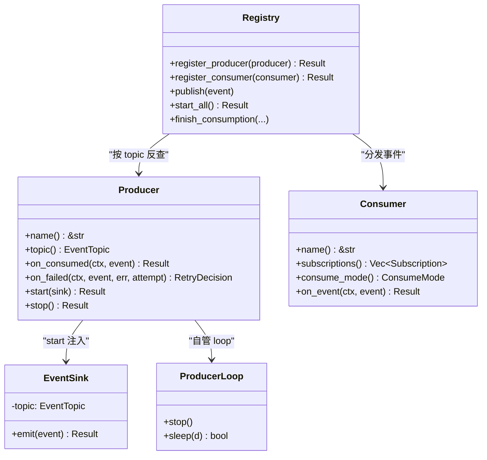
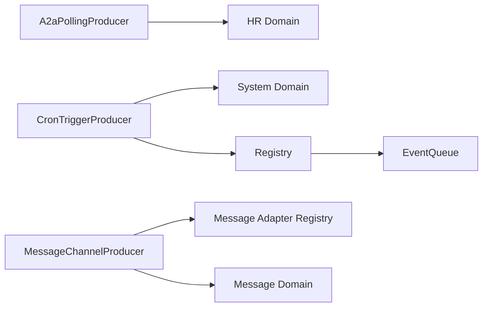

# 事件生产者

<cite>
**本文引用的文件**
- [src/producer/mod.rs](src/producer/mod.rs)
- [src/producer/a2a_polling.rs](src/producer/a2a_polling.rs#L53-L140)
- [src/producer/cron_trigger.rs](src/producer/cron_trigger.rs#L92-L145)
- [src/producer/cron_trigger.rs](src/producer/cron_trigger.rs#L213-L217)
- [src/producer/message_channel.rs](src/producer/message_channel.rs)
- [src/pkg/aop/mod.rs](src/pkg/aop/mod.rs)
- [src/pkg/aop/core/producer.rs](src/pkg/aop/core/producer.rs#L13-L99)
- [src/pkg/aop/core/producer.rs](src/pkg/aop/core/producer.rs#L105-L154)
- [src/pkg/aop/core/event_sink.rs](src/pkg/aop/core/event_sink.rs#L20-L54)
- [src/pkg/aop/core/consumer.rs](src/pkg/aop/core/consumer.rs#L21-L112)
- [src/pkg/aop/core/event.rs](src/pkg/aop/core/event.rs#L4-L17)
- [src/pkg/aop/core/registry.rs](src/pkg/aop/core/registry.rs#L53-L123)
- [src/pkg/aop/core/registry.rs](src/pkg/aop/core/registry.rs#L343-L562)
- [common/src/enums/event_topic.rs](common/src/enums/event_topic.rs#L32-L65)
- [src/service/dal/message.rs](src/service/dal/message.rs#L765-L800)
- [src/consumer/a2a_poll.rs](src/consumer/a2a_poll.rs#L32-L72)
- [src/models/events/a2a_poll.rs](src/models/events/a2a_poll.rs#L22-L58)
- [src/service/dal/inbound_retry.rs](src/service/dal/inbound_retry.rs)
</cite>

## 更新摘要
**变更内容**
- `Producer` trait 改形：`name()` / `topic()` / `on_consumed` / `on_failed` / `start(EventSink)` / `stop()`；删除 `register()` / `poll()` / `poll_interval_secs()`
- 新增 `EventSink`（预绑定 `producer.topic()`，强制「1 producer : 1 topic」）与 `ProducerLoop`（可中断 sleep）
- 「DAL-as-Producer」归属模型：拥有 topic 收尾能力的对象自身实现 `Producer`（如 `MessageDalImpl`、`CronTriggerProducer`、各 inbound DAL 的 Impl）
- 消费者侧兴趣声明改为 `subscriptions() -> Vec<Subscription>`，收尾由 `finish_consumption` 按 topic 反查生产者回调

## 目录
1. [简介](#简介)
2. [项目结构](#项目结构)
3. [核心组件](#核心组件)
4. [架构总览](#架构总览)
5. [详细组件分析](#详细组件分析)
6. [依赖关系分析](#依赖关系分析)
7. [性能考量](#性能考量)
8. [故障排查指南](#故障排查指南)
9. [结论](#结论)
10. [附录](#附录)

## 简介
本文件面向 AOP 事件生产者系统，系统性说明事件生产模式、定时任务触发、外部系统集成与消息通道处理。文档覆盖内置生产者实现（A2A 轮询生产者、定时触发生产者、消息通道生产者）、事件生成策略、批量处理、错误重试与监控指标，并提供生产者开发指南、配置选项与性能优化建议。

> 消费者侧契约（订阅声明、收尾回调、并发）见《事件消费者》。

## 项目结构
事件生产者位于 `src/producer` 模块，统一通过 AOP 注册中心进行生命周期管理与调度；AOP 框架位于 `src/pkg/aop`，提供 `Producer` / `Consumer` / `Registry` / `EventSink` 等基础能力。

图表来源
- [src/producer/mod.rs](src/producer/mod.rs)
- [src/pkg/aop/core/registry.rs:53-123](src/pkg/aop/core/registry.rs#L53-L123)
- [src/pkg/aop/core/producer.rs:13-99](src/pkg/aop/core/producer.rs#L13-L99)
- [src/pkg/aop/core/event_sink.rs:20-54](src/pkg/aop/core/event_sink.rs#L20-L54)

章节来源
- [src/producer/mod.rs](src/producer/mod.rs)
- [src/pkg/aop/mod.rs](src/pkg/aop/mod.rs)

## 核心组件
- 生产者接口 `Producer`：定义 `name` / `topic` / `on_consumed` / `on_failed` / `start(sink)` / `stop`。不再有 `register` / `poll` / `poll_interval_secs`（轮询机制下放到生产者自管的 `ProducerLoop`）。
- `EventSink`：由 AOP 在 `start_all` 时构造并**预绑定** `producer.topic()`；`emit` 校验 `event.kind() == topic`，生产者发不出别人的事件（「1 producer : 1 topic」的执行点）。
- `ProducerLoop`：可中断 sleep（`AtomicBool` + 250ms 分片），`stop()` 后下一片返回 `false`，loop 随即退出；接管原先 Registry 里的「轮询线程自检」。
- 消费者接口 `Consumer`：定义 `subscriptions` / `consume_mode` / `on_event` / `should_consume`，以及仅 Async 生效的 `concurrency` / `empty_queue_sleep_ms` / `error_retry_sleep_ms`。不再有 `ack` / `nack` / `source`。
- 事件模型 `Event`：`Event::kind()` 返回 `EventTopic` 枚举，另含 `id` / `order_key` / `priority` / `created_at`。
- `EventTopic`：`common::enums::EventTopic` 闭合枚举，取代旧 `EventKind`，是路由与「消费收尾回调归属」反查的唯一依据。
- 注册中心 Registry：维护 `topic → 消费者列表` 与 `topic → 生产者` 两个索引；负责注册 producer/consumer、发布事件、启动异步 worker、管理队列与指标钩子。

章节来源
- [src/pkg/aop/core/producer.rs:13-154](src/pkg/aop/core/producer.rs#L13-L154)
- [src/pkg/aop/core/event_sink.rs:20-54](src/pkg/aop/core/event_sink.rs#L20-L54)
- [src/pkg/aop/core/consumer.rs:21-112](src/pkg/aop/core/consumer.rs#L21-L112)
- [src/pkg/aop/core/event.rs:4-17](src/pkg/aop/core/event.rs#L4-L17)
- [common/src/enums/event_topic.rs:32-65](common/src/enums/event_topic.rs#L32-L65)
- [src/pkg/aop/core/registry.rs:15-123](src/pkg/aop/core/registry.rs#L15-L123)

## 架构总览
AOP 事件中心以「生产者-注册中心-消费者」解耦为核心：
- 生产者用 `ProducerLoop` 自管循环（机制在生产者，时机由 AOP 统一 `start` / `stop`），不再由 Registry 定时 spawn 轮询任务。
- 生产者经预绑定的 `EventSink` 发布事件；Registry 根据消费者 `subscriptions()` 声明的 topic 进行同步或异步投递。
- 异步消费者由独立 worker 拉取队列中的事件进行处理；收尾由 `finish_consumption` 单一出口判定：按 topic 反查生产者并回调 `on_consumed` / `on_failed`，给出 `DeliveryOutcome`（Ack/Nack）。
- 指标钩子可注入到 Registry，对发布与消费过程进行观测。

图表来源
- [src/pkg/aop/core/registry.rs:142-271](src/pkg/aop/core/registry.rs#L142-L271)
- [src/pkg/aop/core/registry.rs:343-562](src/pkg/aop/core/registry.rs#L343-L562)
- [src/pkg/aop/core/registry.rs:734-802](src/pkg/aop/core/registry.rs#L734-L802)
- [src/pkg/aop/core/event_sink.rs:20-54](src/pkg/aop/core/event_sink.rs#L20-L54)

## 详细组件分析

### A2A 轮询生产者（「只认领」语义）
职责
- 每 30 秒（由 `ProducerLoop` 驱动）列出全部远端 Agent，筛选 `kind.is_remote()` 的 Agent，逐条 `sink.emit(A2aPollRequestedEvent)`；**不在此线程做网络重活**。

关键流程（`claim(sink)`）
- 构造 system ctx，调用 `hr_domain.agent_manage().list_agents` 获取全部 Agent。
- 过滤出远端 Agent；为空则直接返回。
- 取轮次时间戳 `tick_at`，逐 Agent `sink.emit(A2aPollRequestedEvent::new(&agent.po.id, tick_at))`（发布句柄只认本 topic `a2a.poll.requested`）。

真正的远端抓取、消息投递、`a2a_synced_msgs` 标签推进、`transition_status` 已搬到新消费者 `src/consumer/a2a_poll.rs`（Async + `.ordered()`，`order_key = agent_id`），对应新事件 `src/models/events/a2a_poll.rs`。详见《A2A 轮询生产者》。

错误处理
- `claim` 内部任一 Agent 的 `emit` 失败即返回 Err；`start` 的 loop 捕获后仅记日志，下一轮继续认领。

性能与批处理
- 单次只 emit 认领事件（极轻），远端拉取成本转移到消费者侧，避免拖长 30s 周期。

图表来源
- [src/producer/a2a_polling.rs:53-140](src/producer/a2a_polling.rs#L53-L140)
- [src/consumer/a2a_poll.rs:32-72](src/consumer/a2a_poll.rs#L32-L72)
- [src/models/events/a2a_poll.rs:22-58](src/models/events/a2a_poll.rs#L22-L58)

章节来源
- [src/producer/a2a_polling.rs:53-140](src/producer/a2a_polling.rs#L53-L140)
- [src/consumer/a2a_poll.rs:32-140](src/consumer/a2a_poll.rs#L32-L140)

### 定时触发生产者
职责
- 每 60 秒扫描即将到期的 Cron Trigger，构造 `CronTriggerEvent` 并发布到 AOP 事件中心。

关键流程
- `tick(sink)`：查询到期触发器（上限 100），为每个触发器构建事件并经 `sink.emit` 发布。
- `mark_trigger_executed` **已从 tick 移入** `CronTriggerProducer::on_consumed`：消费者报成功后才标记触发器已执行；`executed_at` 取事件 `created_at`（≈ 触发时刻），而非回调时刻（避免 `next_run_at` 被越拖越后）。`on_failed` **恒 `Retry`**（`Discard` 会 ack 且仍回调 → 反把未执行标成「已执行」）。

错误处理
- 若 Registry 未注册则返回内部错误。
- 事件发布失败由下游消费者在 `finish_consumption` 中经 `on_failed` 决策重试/丢弃。

图表来源
- [src/producer/cron_trigger.rs:58-89](src/producer/cron_trigger.rs#L58-L89)
- [src/producer/cron_trigger.rs:92-145](src/producer/cron_trigger.rs#L92-L145)
- [src/producer/cron_trigger.rs:213-217](src/producer/cron_trigger.rs#L213-L217)

章节来源
- [src/producer/cron_trigger.rs:58-217](src/producer/cron_trigger.rs#L58-L217)

### 消息通道生产者
职责
- 作为消息适配器回调，将外部渠道的消息转换为系统内消息，路由到指定 Agent 或默认 Agent。

关键流程
- 根据 `from_role` 设置 `caller_type` 与 `user_id`。
- 解析 `to_agent_id`（显式或从 HR Domain 解析）。
- 构造 `SendToAgentCommand` 并通过 `MessageDomain.delivery.send_to_agent` 投递。

错误处理
- 无法解析目标 Agent 时记录警告并跳过。
- 发送失败时包装为内部错误并返回。

图表来源
- [src/producer/message_channel.rs](src/producer/message_channel.rs)

章节来源
- [src/producer/message_channel.rs](src/producer/message_channel.rs)

### AOP 框架与调度
- Producer Trait：`name()` / `topic()` / `on_consumed` / `on_failed` / `start(sink)` / `stop()`；机制（自管 loop）在生产者，时机（何时 start/stop）由 AOP 统一管。
- EventSink：预绑定 `producer.topic()`；`emit` 校验 `event.kind() == topic`，强制「1 producer : 1 topic」。
- Registry：
  - `register_producer` 改为**同步**；topic 占位冲突 → `Conflict`（「1 topic : 1 producer」）。
  - `start_all` 先做校验（声明了 `notify_producer` 的 topic 缺 producer → 启动 Err，早于 `started` 置位），再逐个 `EventSink::new(self, producer.topic())` + `producer.start(sink)`。
  - 异步消费者启动多个 worker，循环 `dequeue_next` → `on_event` → `finish_consumption`。
  - 指标钩子在发布与消费各阶段被调用。
- Consumer Trait：支持同步/异步消费，提供并发度与休眠策略；订阅声明为 `subscriptions() -> Vec<Subscription>`。

图表来源
- [src/pkg/aop/core/producer.rs:13-154](src/pkg/aop/core/producer.rs#L13-L154)
- [src/pkg/aop/core/event_sink.rs:20-54](src/pkg/aop/core/event_sink.rs#L20-L54)
- [src/pkg/aop/core/registry.rs:53-562](src/pkg/aop/core/registry.rs#L53-L562)
- [src/pkg/aop/core/consumer.rs:21-112](src/pkg/aop/core/consumer.rs#L21-L112)

章节来源
- [src/pkg/aop/core/mod.rs](src/pkg/aop/core/mod.rs)
- [src/pkg/aop/core/registry.rs:15-562](src/pkg/aop/core/registry.rs#L15-L562)
- [src/pkg/aop/core/producer.rs:13-154](src/pkg/aop/core/producer.rs#L13-L154)
- [src/pkg/aop/core/consumer.rs:21-112](src/pkg/aop/core/consumer.rs#L21-L112)
- [src/pkg/aop/core/event.rs:4-17](src/pkg/aop/core/event.rs#L4-L17)

### 归属模型：DAL-as-Producer
归属 = **拥有该 topic 收尾能力的对象自身**，不再新建 `producer/` 类型：

| topic | 生产者对象 | 在哪注册 |
|---|---|---|
| `message.created` | `MessageDalImpl` | `dal::init()` |
| `cron.trigger` | `CronTriggerProducer` | `producer::init()` |
| `email.inbound.message` | `EmailDalImpl` | `dal/email/mod.rs::init()` |
| `wechat.inbound.message` | `WechatDalImpl` | `dal/wechat/mod.rs::init()` |
| `lark.inbound.message` | `LarkDalImpl` | `dal/lark/mod.rs::init()` |
| `a2a.poll.requested` | **无**（`A2aPollingProducer` 只 emit，不声明 `notify_producer`） | — |

装配用同一个 `Arc` 各 coerce 一次，分别注册 `Arc<dyn XxxDal>` 与 `Arc<dyn Producer>`（DAL trait 没有 `Producer` supertrait）。启动顺序：`dal::init_all()`（4 个 DAL producer）→ `producer::init()`（cron + a2a）→ `consumer::init()`（含 a2a_poll）→ `aop::init_all()`。

入站失败适配（P6）：三个入站消费者上报 `Err`，由共享决策 `src/service/dal/inbound_retry.rs::decide(err, attempt)` 按错误码前缀判定 `Discard`（永久）/ `Retry`（否则），`attempt >= MAX_ATTEMPTS(8)` 兜底 `Discard`。

章节来源
- [src/service/dal/message.rs:765-800](src/service/dal/message.rs#L765-L800)
- [src/producer/cron_trigger.rs:92-145](src/producer/cron_trigger.rs#L92-L145)
- [src/producer/a2a_polling.rs:53-140](src/producer/a2a_polling.rs#L53-L140)
- [src/service/dal/inbound_retry.rs](src/service/dal/inbound_retry.rs)
- [src/consumer/mod.rs](src/consumer/mod.rs)

## 依赖关系分析
- 生产者依赖业务 Domain（hr、project、system、message）完成数据读取与状态变更。
- A2A 轮询生产者的 `claim` 依赖 HR Domain 的 `list_agents`；真正的远端拉取在 `A2aPollConsumer` 中，依赖 A2A 运行时 DAO。
- 消息通道生产者依赖消息适配器的注册表与回调机制。
- Registry 依赖 EventQueue 实现异步消费者的持久化与重试；生产者经 `EventSink` 发布。

图表来源
- [src/producer/a2a_polling.rs:53-140](src/producer/a2a_polling.rs#L53-L140)
- [src/producer/cron_trigger.rs:58-145](src/producer/cron_trigger.rs#L58-L145)
- [src/producer/message_channel.rs](src/producer/message_channel.rs)
- [src/pkg/aop/core/registry.rs:53-562](src/pkg/aop/core/registry.rs#L53-L562)

章节来源
- [src/producer/mod.rs](src/producer/mod.rs)
- [src/pkg/aop/core/registry.rs:53-562](src/pkg/aop/core/registry.rs#L53-L562)

## 性能考量
- 轮询间隔调优：A2A 轮询为 30 秒，Cron 触发为 60 秒；由各自 `ProducerLoop` 的 `sleep` 控制。
- 批量限制：Cron 限制单次处理数量（如 100），避免内存与 IO 压力。
- 异步消费者并发：可通过 `Consumer.concurrency` 提升吞吐；注意下游资源限制（全仓仅 `MessageConsumer` 覆写为 4）。
- 队列退避：空队列与错误重试分别使用 `empty_queue_sleep_ms` 与 `error_retry_sleep_ms` 降低 CPU 占用。
- 指标埋点：通过 `Registry.set_metrics_hook` 注入指标采集，观察发布与消费延迟、失败率。

[本节为通用指导，不直接分析具体文件]

## 故障排查指南
- 轮询无产出：检查是否有符合条件的远端 Agent 与任务；查看日志中「claiming N remote agents」。
- 消息未送达：确认 A2A 远端任务存在 agent/assistant 消息且大于已同步计数；检查消息发送错误日志（在 `A2aPollConsumer` 中）。
- Cron 未触发：确认 `list_due_triggers` 返回为空；检查 `mark_trigger_executed` 是否在 `on_consumed` 中成功。
- topic 冲突：`register_producer` 回报 `1 topic : 1 producer` → 同一 topic 被两个生产者声明，需合并。
- 收尾丢失：声明了 `notify_producer` 却无生产者 → `start_all` 会因 `ensure_producers_for_notifying_consumers` 失败；检查生产者是否在 `dal::init()` / `producer::init()` 注册。
- 异步消费者堆积：查看队列长度与统计；调整 concurrency 与 sleep 参数；关注 `RetryDecision::Retry` 后的重投行为。
- 指标缺失：确认已设置 metrics hook；检查 `on_publish` / `on_consume_*` 调用路径。

章节来源
- [src/producer/a2a_polling.rs:53-140](src/producer/a2a_polling.rs#L53-L140)
- [src/producer/cron_trigger.rs:92-217](src/producer/cron_trigger.rs#L92-L217)
- [src/pkg/aop/core/registry.rs:53-602](src/pkg/aop/core/registry.rs#L53-L602)

## 结论
AOP 事件生产者系统通过统一的 `Producer` / `Consumer` / `Registry` 抽象，实现了高内聚、低耦合的事件驱动架构。内置生产者覆盖了定时任务、外部集成与消息通道三大场景，并采用 DAL-as-Producer 归属模型让「拥有 topic 状态的对象」自身承担收尾。机制（自管 `ProducerLoop`）在生产者、时机（start/stop）由 AOP 统一管，配合 `EventSink` 的「1 producer : 1 topic」强约束与 `finish_consumption` 的单一收尾出口，系统在可靠性与可扩展性之间取得平衡。

[本节为总结性内容，不直接分析具体文件]

## 附录

### 生产者开发指南
- 实现 `Producer` trait：
  - `name`：唯一标识。
  - `topic`：声明归属的 `EventTopic`（一个生产者只拥有一个 topic）。
  - `on_consumed`：消费成功或丢弃后的业务收尾（状态翻转 / 游标推进 / `mark_trigger_executed`），**必须幂等**。
  - `on_failed`：返回 `RetryDecision`（默认 `Retry`）；框架不设 `max_retry`、无死信，决策权下沉生产者。
  - `start(sink)`：spawn 后**立即返回**，用 `ProducerLoop` 自管循环，`sink` 已预绑定本 topic。
  - `stop()`：置位并 `await` 保存的 `JoinHandle`，确保 loop 真正退出。
- 注册与启动：
  - 在 `producer::init`（或 `dal::init`）中调用 `aop::registry().register_producer(Arc::new(...))`（同步）。
  - 调用 `aop::init_all()` 启动所有生产者与异步消费者。
- 错误处理：在 `on_failed` 中按错误性质返回 `Retry` / `Discard`；记录警告日志并继续处理后续项。
- 指标与监控：通过 `Registry.set_metrics_hook` 注入指标采集；利用 `on_publish` / `on_consume_*` 观察性能。

章节来源
- [src/producer/mod.rs](src/producer/mod.rs)
- [src/pkg/aop/core/producer.rs:13-154](src/pkg/aop/core/producer.rs#L13-L154)
- [src/pkg/aop/core/event_sink.rs:20-54](src/pkg/aop/core/event_sink.rs#L20-L54)
- [src/pkg/aop/mod.rs](src/pkg/aop/mod.rs)
- [src/pkg/aop/core/registry.rs:53-123](src/pkg/aop/core/registry.rs#L53-L123)

### 配置选项
- 轮询间隔：
  - A2A 轮询：30 秒（`ProducerLoop` sleep）。
  - Cron 触发：60 秒。
- 批量大小：
  - Cron 单次最多处理 100 条。
- 异步消费者：
  - `concurrency`：并行 worker 数（默认 1，仅 `MessageConsumer` 覆写为 4）。
  - `empty_queue_sleep_ms`：队列为空时的休眠时间。
  - `error_retry_sleep_ms`：处理失败时的重试间隔。

章节来源
- [src/producer/a2a_polling.rs:53-140](src/producer/a2a_polling.rs#L53-L140)
- [src/producer/cron_trigger.rs:58-145](src/producer/cron_trigger.rs#L58-L145)
- [src/pkg/aop/core/consumer.rs:99-111](src/pkg/aop/core/consumer.rs#L99-L111)

### 性能优化建议
- 合理设置轮询间隔与批量大小，避免过度拉取。
- 使用异步消费者提升吞吐，结合下游资源限制调整并发。
- 启用指标钩子，持续观察发布与消费延迟、失败率与队列积压。
- 对频繁失败的下游服务在 `on_failed` 中返回 `Discard` 以终止重投，减少雪崩风险。

[本节为通用指导，不直接分析具体文件]
